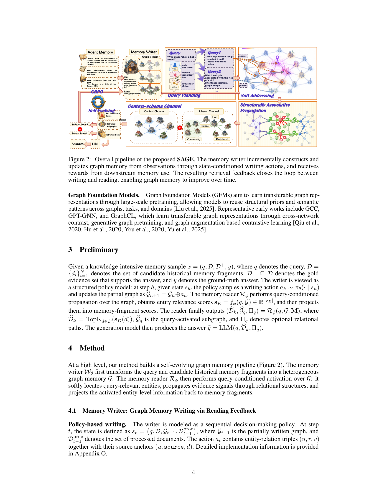

> [[../index|Wiki]] | [[../summary|Summary]] | [[../digest|Digest]]

# Method: Memory Writer + Memory Reader (Sec 4, 4.1, 4.2)

**In one sentence:** SAGE couples a policy-based memory writer (trained with reader-aware GRPO rewards to emit compact, grounded triple graphs) with a Graph-Foundation-Model memory reader (structured query planning + soft addressing + gated structural propagation under a context/schema split), and alternates the two in a self-evolution loop whose writer update raises graph readability while the reader update cancels writer-induced distribution shift.

## Key points

- The pipeline has two stages: the writer *W*θ turns the query *q* and candidate historical fragments *D* into a heterogeneous graph memory *G*, and the reader *R*φ performs query-conditioned activation over *G* — soft-locates relevant entities, propagates evidence through relations, and projects entity-level activations back to memory fragments (Section 4).
- Writing is a sequential policy: state *s*t = (*q, D, G*t−1, *D*t−1[proc]), action *a*t = entity–relation triples (*u, r, v*) plus source anchors (*u*, `source`, *d*); the reward is reader-aware (the writer is scored by how well the frozen reader can derive an answer and recover supporting text from the written graph), and the writer is updated with standard clipped GRPO (Section 4.1).
- The hybrid task reward is *r*task = (α*r*rec + β*r*pre + γ*r*ded)/(α+β+γ), where *r*rec rewards coverage of gold evidence *D*+ by the reader's top-*k* set *P*k(*q, G*), *r*pre penalizes irrelevant evidence expansion, *r*ded = 1{Judge(*q, y | P*k(q, G)*`) = Yes`}, and an answer-level auxiliary *r*ans uses F1 against the answer alias set *Y*(y); a repetition penalty ρrep(G) in the trajectory return stops the policy from inflating the graph with duplicate triples (Section 4.1).
- The reader is a Graph Foundation Model (GFM) — chosen because dense retrievers can't exploit entity roles/bridge paths and per-domain GNNs generalize poorly — and outputs *f*φ(*q, G, D*) = (*p*φ(e|q,G), *p*φ(d|q,G,D), *G*q): entity distribution, document distribution, and an interpretable retrieval subgraph, plus a lightweight query-conditioned subgraph selector (Section 4.2).
- Cognition-inspired query planning decomposes the query into associative probes *P*ω(*q*) = (Eexp, A, Crel, Chard, τ, {(q̃m, αm, tm)})m=1..M to counter "tip-of-the-tongue" alias/bridging failures; soft addressing scores each entity with the six-term Eq. (1) (exact match, alias, max-probe embedding cosine, entity type, constraint consistency, NER cross-link), normalizes with temperature *T*₀, and seeds *h*e(0) = *p*₀(e|q)·WqEmb(q) + Wx**x**e (working memory ⊕ solidified long-term memory) (Section 4.2).
- A synapse-inspired edge-level vector gate **g**uv[l] = 1 + δ·tanh(MLPg[l](**z**uv[l])) — built from node features φ(v), edge-pair features ψ(u,v), and a graph summary **r**G — enables three brain-like behaviors absent in PPR/community expansion: Inhibition of hub edges, preservation of long-distance bridge/association edges, and Habituation of redundant local edges (Section 4.2).
- Target-graph adaptation uses a context–schema decomposition: **H**(*q,G*) = **H**ctx + βsch**H**sch, where the gated context channel calibrates to the current writer-generated graph and the schema channel is a softmax-weighted mix of cross-graph structural prompt bases {**P**j[l]}j=1..K retaining stable patterns (bridge nodes, community boundaries, core–periphery, noise short-circuits) (Section 4.2).
- Self-evolution alternates: freeze the reader and train the writer with retrieval-based rewards, then freeze the writer and retrain the reader on its new graphs (Algorithm 1); this is an approximate coordinate improvement over a joint memory-utility objective, and Proposition 1(iii) shows the reader output does not oscillate arbitrarily as the graph evolves under writer updates (Section 4.2).

---

## 4 Method (overview)

At a high level, SAGE builds a **self-evolving graph memory pipeline** (Figure 2). The memory writer *W*θ first transforms the query and candidate historical memory fragments into a heterogeneous graph memory *G*. The memory reader *R*φ then performs query-conditioned activation over *G*: it softly locates query-relevant entities, propagates evidence signals through relational structures, and projects the activated entity-level information back to memory fragments. The two components are then coupled in a writer–reader self-evolution loop (Section 4.2 below).

*(The figure-description file for this image was empty in the source snapshot, so the caption above paraphrases the Section 4 overview in the chunk rather than figure-internal details that could not be verified.)*

## 4.1 Memory Writer: Graph Memory Writing via Reading Feedback

### Policy-based writing

The writer is modeled as a **sequential decision-making policy**. At step *t*:

- **State:** *s*t = (*q, D, G*t−1, *D*t−1[proc]), where *G*t−1 is the partially written graph and *D*t−1[proc] is the set of already processed documents.
- **Action:** *a*t contains entity–relation triples (*u, r, v*) together with their **source anchors** (*u*, `source`, *d*) — i.e., each triple is grounded to the document it was extracted from (implementation details in Appendix O).

### Reader-aware writing reward

The writer's reward comes from the **task utility of its written graph after being accessed by the memory reader**: given the current graph *G*, the *frozen* reader returns evidence *P*k(*q, G*). Two complementary reward categories (inspired by Tsang et al., 2025):

1. **Deduction reward** — is the graph sufficient as a *knowledge carrier* to support deriving the answer?

   *r*ded(*q, y, G*) = 1{Judge(*q, y* | *P*k(q, G)*`) = Yes`}

2. **Recall / precision** — can the graph serve as a *knowledge index* to recover the supporting text?

   - *r*rec(*q, D*+, G*) = |*P*k(*q, G*)* ∩ *D*+| / |*D*+| (coverage of necessary evidence)
   - *r*pre(*q, D*+, G*) = |*P*k(*q, G*) ∩ *D*+| / |*P*k(*q, G*)*| (penalizes expansion of irrelevant evidence)

Additionally, to align with end-to-end QA, an **answer-level auxiliary reward**:

*r*ans(*q, y, G*) = maxy′∈Y(y) F1(*y, y′*), where ŷ = LLM(*q, P*k(q, G)*) and *Y*(*y*) is the set of answer aliases.

In practice SAGE adopts a **hybrid task reward**:

*r*task = (α*r*rec + α'β*r*pre + γ*r*ded)/(α + β + γ)

*(the chunk's typesetting renders the numerator as `αr_rec + αβ r_pre + γ r_ded` over the denominator `α + β + γ`.)*

**Anti-redundancy.** To stop the policy from inflating graph size by stacking duplicate triples, SAGE defines a **repetition rate**

ρrep(G) = (|T(G)| − |Tuni(G)|) / |T(G)|

and derives the **trajectory return**

R(τ) = rtask(τ) − λrep·ρrep(Gτ) + λfmt Σt=1..|τ| rtfmt

This directly addresses the phenomenon reported by HaluMem (Chen et al., 2025a): memory-system errors often originate *at extraction/time of writing*, not at the answering stage. The writer is updated with **standard clipped GRPO**.

## 4.2 Memory Reader: Memory Retrieval Based on Graph Foundation Model

**Why a GFM.** The reader must operate stably over a graph that the writer continuously updates. Dense retrievers learn only query–document semantic matching (can't exploit entity roles, bridge paths, cross-community dependencies); conventional GNN retrievers are tied to fixed graph distributions and generalize poorly across domains, users, and evolution stages. SAGE therefore uses a **Graph Foundation Model (GFM)** — its multi-graph pretraining gives transferable structural priors and lightweight calibration on new graphs (Luo et al., 2025; Zhang et al., 2025c). Formally the reader outputs an entity distribution, a document distribution, and an optional retrieval subgraph:

*f*φ(*q, G, D*) = ( *p*φ(e | q, G),  *p*φ(d | q, G, D),  *G*q )

where *p*φ(e|q,G) is the query-activated entity memory, *p*φ(d|q,G,D) the final retrieved textual evidence, and *G*q an interpretable retrieval path. A lightweight **query-conditioned subgraph selector** further yields a compact, query-aligned activated subgraph (Appendix I).

### Cognition-inspired Structured Query Planning

Human long-term-memory extraction is anchored by the brain's *automatic generation of multi-dimensional retrieval cues* from a vague final intention. SAGE applies the same idea: it stops treating the natural-language query as a single retrieval command and instead introduces a **planning function** *P*ω that simulates the brain's cue-reconstruction before "awakening" memory, decomposing the query into a set of rich associative probes:

*P*ω(*q*) = ( Eexp, A, Crel, Chard, τ, {(q̃m, αm, tm)}m=1..M )

This multi-path concurrent awakening overcomes the **"tip-of-the-tongue phenomenon"** (alias alignment failures, missing bridging entities) and stitches together forgotten implicit relationships (Trivedi et al., 2023; Asai et al., 2023; Wu et al., 2025b; Zhang et al., 2025b). Full notation, prompt templates, and output schema are in Appendix K.

### Soft Addressing and Pre-activation of Memory Fragments

Cognitive neuroscience notes that human retrieval involves not just extracting exact matches but an *instinctive awakening of peripherally related memories* (**Semantic Priming**). SAGE treats the query-conditioned entry score *s*e(q) as a comprehensive assessment of stimulus intensity across different **Memory Engrams** — this is what the paper refers to as addressing its **first challenge**:

**Entry score (Eq. 1):**

se(q) = λ₁ Exact(e, Eexp) + λ₂ Alias(e, A) + λ₃ maxm≤M cos( Emb(desc(e)), Emb(q̃m) ) + λ₄ Type(e, τ) + λ₅ Cons(e, Chard) + λ₆ Σξ∈NER(q) EL(e | ξ)

The **Softmax** over entities with temperature *T*₀ (simulating the brain's limited **Attention Allocation**) normalizes these multi-dimensional stimulus signals into the initial activation distribution of the "memory atlas":

p₀(e | q) = exp(se(q)/T₀) / Σv∈V_E exp(sv(q)/T₀)

From this the initial node state mixes the query-conditioned component with a static entity representation:

**h**e(0) = p₀(e|q)·WqEmb(q) + Wx**x**e

Here **x**e is the solidified **long-term memory** (static entity representation) and the query vector weighted by recall degree p₀(e|q) is the current **working memory** (task context).

### Synapse-inspired Structurally Conditioned Associative Propagation

To address the **second challenge** while avoiding indiscriminate diffusion, SAGE introduces **edge-level vector structural gating** in the GFM. Three structural features (Appendix L for definitions/normalization):

- **Node-level (Eq. 2):** φ(v) = ( log(1+d_v), c_v, κ_v, d̄_N(v) )
- **Edge-pair (Eq. 3):** ψ(u,v) = ( |d_u − d_v|, |N(u) ∩ N(v)|, Jaccard(N(u), N(v)) )
- **Graph-level summary (Eq. 4):** **r**_G = ( meanv∈V_E φ(v); stdv∈V_E φ(v); dens(G) )

For the *l*-th layer, the **edge structural context** concatenates node and pair embeddings plus the graph summary:

**z**uv[l] = [ E_n[l](φ(u)); E_n[l](φ(v)); E_p[l](ψ(u,v)); E_g[l](**r**_G) ]

which generates the **vector gate**

**g**uv[l] = 1 + δ·tanh( MLP_g[l](**z**uv[l]) )

Let ηuv be the normalized adjacency weight with self-loops. Message and node updates:

**m**u→v[l] = ηuv · **g**uv[l] ⊙ W_(m[l]) **h**u[l−1]

**h**v[l] = LayerNorm( **h**v[l−1] + PReLU( **b**[l] + Σu∈N(v) **m**u→v[l] ) )

Unlike heuristic path expansion, PPR walks, or community summarization (Edge et al., 2024; Guo et al., 2024; Wang & Han, 2025), this system can actively perform three brain-like behaviors:

1. **Inhibition** — suppress non-specific generalized memories (hub edges).
2. **Long-distance association capture** — preserve lateral-thinking/bridge edges across cognitive clusters.
3. **Habituation** — weaken redundant local edges.

**Signal–budget view (Proposition 1(i)).** Traditional query-dependent GNNs or PPR-style expansion can multi-hop propagate along graph structure, but the key issue is not expanding propagation range — it's preserving the *signal advantage* of query-relevant evidence over distractor noise under a limited top-*k* budget. Proposition 1(i) (Appendix B) summarizes: soft addressing improves the initial evidence activation; the structural gating preserves bridge/evidence paths while suppressing noisy neighborhoods; and controlled entity→document projection converts the entity-level advantage into more efficient document-level retrieval.

### Target Graph Calibration and Cross-graph Structural Priors

The writer continuously changes the memory graph per round — each *G* alters local topology and noise distribution, so the reader cannot rely on propagation patterns of a single fixed graph. It must **simultaneously adapt to the current target graph and retain cross-graph structural priors**. This motivates the **context–schema decomposition**, where Proposition 1(ii) (Appendix C/D) states: the *schema channel* provides the transferable structural prior, while the *context channel* corrects the target-graph residual induced by (current writer, current domain, entity granularity, local noise).

**Contextual calibration.** A feature prompt vector **p̃**_f* calibrates the query-activated input: he(0) = p̃_f ⊙ **h**e(0). The contextual channel then performs **gated propagation** on the current graph *G*:

**H**ctx = F_gate( **H̃**(0), G; Θ_gate )

This captures the immediate structural state within the current memory graph.

**Schema prior channel.** In parallel, a set of cross-graph structural prompt bases {**P**j[l]}j=1..K encodes the **stable reading habits** formed during multi-graph training. Per-layer attention over these bases:

ωj[l] = softmax_j(a[l]/T_p),   **P**_schema[l] = Σj=1..K ωj[l] **P**j[l]

Propagation over the schema prompts yields:

**H**sch = F_prompt( **H̃**(0), G; { **P**_schema[l] }l=1..L )

**Final entity representation** jointly determined by current context and long-term schema:

**H**(*q, G*) = **H**ctx + β_sch **H**sch

- **H**ctx — context-dependent immediate recall state, adapting to the specific graph the current writer generated.
- **H**sch — memory schema formed across experiences, retaining ability to recognize stable patterns (bridge nodes, community boundaries, core–periphery structures, noise short-circuits).

### Reader Training

The reader is trained to learn **cross-graph transferable retrieval biases** in two stages:

1. **Structural contrastive pre-training** on multiple augmented graph views.
2. **Supervised fine-tuning** — the reader is trained to identify and rank supporting entities for each query using **weighted classification** and **multi-positive ranking** objectives.

Details in Appendices M and N.

### Writer–Reader Self-evolution

To address the **third challenge**, SAGE proposes a **self-evolution framework** detailed in **Algorithm 1**, where each iteration has two phases:

1. **Freeze the reader; train the writer** using the reader's retrieval results as the reward signal (Section 4.1 rewards).
2. **Generate new graphs with the updated writer; continue training the reader.**

**Theoretical interpretation.** This alternate process is an **approximate coordinate improvement over a joint memory utility**: the writer update improves graph readability, and the reader update reduces writer-induced graph distribution shift and reward bias. Full coordinate-improvement analysis, a **surrogate reward bias bound**, and single-sided update bottleneck analysis are in Appendix F. **Proposition 1(iii)** shows that even though each writer update changes the graph structure, the reader output **does not oscillate arbitrarily** with graph evolution. Full **training, inference, memory, and selector-regularizer complexity** analyses are in Appendix J.

**Covers:** SAGE Method, Section 4 (4.1 Memory Writer, 4.2 Memory Reader); source lines 226–442.
