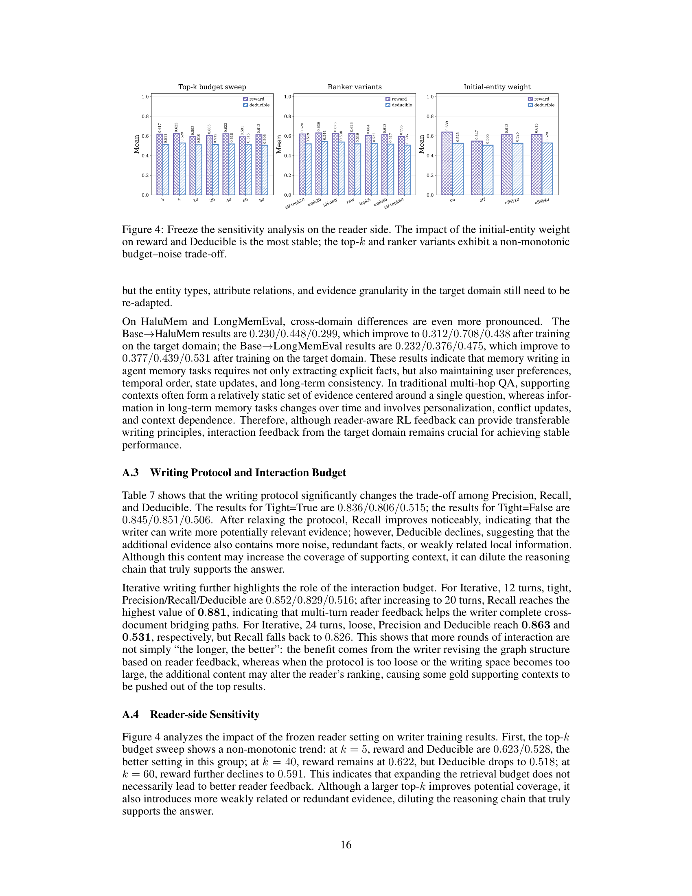

> [[../index|Wiki]] | [[../summary|Summary]] | [[../digest|Digest]]

# Appendix A & B — Memory Writer Analysis and the SNR / Retrieval-Budget Theory

**In one sentence:** Appendix A shows experimentally that reader-aware RL reward design, the writing protocol, and the reader-side initial-entity weight dominate writer quality (while transfer across domains is possible but incomplete), and Appendix B formalizes *why* the SAGE-GFM reader helps: soft addressing, structural gating, context–schema calibration, and entity-to-document projection jointly bound the query-relevant signal-to-noise ratio, which yields an upper bound on the top-k retrieval budget needed to reach a given level of gold-evidence coverage.

## Key points

- Reward choice matters most: hybrid RL reaches the best Precision/Recall (0.902/0.917) with Deducible 0.522, while pure recall rewards raise coverage (0.889/0.835) but *lower* Deducible (0.502), proving retrieval matching quality is not the same as answer deducibility.
- Supervised finetuning alone (GFM-finetuned: 0.824/0.813/0.512) is no better than GFM pretrained-only (0.838/0.818/0.510) for frozen-reader utility.
- A base writer trained on HotpotQA/MuSiQue transfers poorly to agent-memory domains: Base→HaluMem 0.230/0.448/0.299 vs 0.312/0.708/0.438 with target-domain training (precision/recall/deducible).
- Iterative writing is non-monotone in the budget: 20 turns maxes Recall at 0.881; a 24-turn loose protocol lifts Precision/Deducible to 0.863/0.531 but Recall falls back to 0.826 — more rounds are not "the longer, the better".
- Reader-side, disabling the initial-entity weight is the most damaging change (reward 0.639→0.547, Deducible 0.525→0.505), and increasing retrieval budget cannot compensate; top-k sweeps show a non-monotonic budget–noise trade-off (k=5 best at 0.623/0.528).
- Training regularization (repetition penalty, rollout filtering, group size, warmup) gives only small gains: e.g. group size n=1→10 improves reward/Deducible from 0.610/0.511 to 0.620/0.531 — the core gains come from reader-aware RL feedback.
- Theoretically, an aggregate propagation model yields Lemma B.6 (S_l ≥ A_l·S_{l-1}; N_l ≤ B_l·N_{l-1} + C_l·S_{l-1} + ξ_l) and Theorem B.7, giving a closed-form upper bound on 1/SNR_L in terms of per-layer ratios B_l/A_l, C_l/A_l, and ξ_l/(A_l·S_{l-1}).
- Theorem B.13 converts the entity-level SNR bound into a document-level budget bound B_ρ(q,G) ≤ m_ρ + (m_ρ K_A)/(c_ρ S_L)·(1/SNR_L) + m_ρ·ζ_A/(c_ρ S_L), and Propositions 2–5 show the bound is monotone in each reader design factor — so SAGE's advantage does not require perfect edge-wise gating, only aggregate evidence-retention dominance (B_l/A_l, C_l/A_l sufficiently small).

---

## A: Additional Analysis of the Memory Writer

### A.1 Reward Design and Writer Behavior

Different RL rewards induce measurably different writer behaviors for a frozen reader (Table 5). Baselines: GFM-pretrained-only achieves Precision/Recall/Deducible of 0.838 / 0.818 / 0.510, while GFM-finetuned achieves 0.824 / 0.813 / 0.512 — i.e., supervised finetuning alone does not stably improve graph-memory utility. This is consistent with the setup: the writer's goal is not to reproduce a static graph format.

Single-objective rewards each have a visible bias:

- **RL-Recall** lifts Precision/Recall to 0.889 / 0.835 but Deducible *drops* to 0.502: rewarding supporting-context coverage makes the writer store more locally relevant evidence without forming a complete multi-hop chain.
- **RL-F1** raises Recall to ~0.881 but Deducible is only 0.497: the reader hitting supporting contexts does not guarantee those contexts are organized to support answer reasoning.
- **RL-Deduce** reaches 0.861 / 0.892 / 0.517: using answer deducibility directly as feedback pushes the writer toward bridging entities, cross-document relations, and answer-relevant causal/attribute paths.
- **RL-Hybrid** is best on coverage-plus-utility: Precision 0.902, Recall 0.917 (improvements of +0.064 and +0.099 over pretrained-only) with Deducible 0.522 — the hybrid mitigates the pure-recall bias (weakly relevant evidence) and the pure-deduce bias (overfavoring short paths and local answer clues).
- **Hybrid + frozen answer API** achieves the highest Deducible at **0.526**, but Precision/Recall drop to 0.832 / 0.874: stronger answer-side feedback makes the writer more conservative, writing only evidence directly related to the final answer at the cost of context coverage.

### A.2 Cross-domain Transfer

Table 6: a base writer trained on HotpotQA/MuSiQue transfers to some extent, but target-domain training remains essential.

| Transfer | Precision | Recall | Deducible |
|---|---|---|---|
| Base → GRBench | 0.575 | 0.609 | 0.411 |
| GRBench train → val | 0.794 | 0.833 | 0.596 |
| Base → HaluMem | 0.230 | 0.448 | 0.299 |
| HaluMem train → val | 0.312 | 0.708 | 0.438 |
| Base → LongMemEval | 0.232 | 0.376 | 0.475 |
| LongMemEval train → val | 0.377 | 0.439 | 0.531 |

The multi-hop QA writing strategy transfers to structured product/domain graph memory (GRBench), but the entity types, attribute relations, and evidence granularity of the target domain must still be re-adapted. Differences are far more pronounced on HaluMem and LongMemEval: agent-memory writing needs not only explicit fact extraction but also user preferences, temporal order, state updates, and long-term consistency. In multi-hop QA, supporting contexts form a relatively static evidence set around one question; long-term memory changes over time with personalization, conflict updates, and context dependence. Hence reader-aware RL provides transferable *writing principles*, but interaction feedback from the target domain is crucial for stable performance.

### A.3 Writing Protocol and Interaction Budget

Table 7: the writing protocol shifts the Precision/Recall/Deducible trade-off.

| Setting | Precision | Recall | Deducible |
|---|---|---|---|
| Tight = True | 0.836 | 0.806 | 0.515 |
| Tight = False | 0.845 | 0.851 | 0.506 |
| Iterative, 12 turns, tight | 0.852 | 0.829 | 0.516 |
| Iterative, 20 turns | — | **0.881** | — |
| Iterative, 24 turns, loose | **0.863** | 0.826 | **0.531** |

Relaxing the protocol (Tight=False) lets the writer emit more potentially relevant evidence (Recall up), but Deducible declines — the extra evidence contains noise, redundant facts, and weakly related local information that dilutes the reasoning chain that supports the answer. Iterative writing shows the interaction budget is not "the longer, the better": 20 turns reach the highest Recall (0.881) because multi-turn reader feedback helps complete cross-document bridging paths; but the 24-turn loose protocol sacrifices Recall (0.826) — a too-loose protocol or too large writing space can alter the reader's ranking and push gold supporting contexts out of the top results. The benefit of more rounds comes from *revising* the graph structure based on reader feedback, not from sheer volume.

### A.4 Reader-side Sensitivity

Figure 4 sweeps three frozen-reader settings and reports reward and Deducible:

**Top-k budget sweep (k = 3…80):** non-monotonic. k=5 gives the best setting in the group at reward/Deducible 0.623 / 0.528; at k=40 reward stays at 0.622 but Deducible drops to 0.518; at k=60 reward falls to 0.591. Other points in the sweep: k=3 0.617/0.511, k=10 0.593/0.510, k=20 0.605/0.512, k=80 0.612/0.505. Conclusion: expanding the retrieval budget does not necessarily improve reader feedback — larger top-k improves potential coverage but introduces weakly related or redundant evidence that dilutes the answer-supporting chain (a budget–noise trade-off).

**Ranker variants:** similar coverage–noise trade-off. topk20 is best at 0.630 / 0.544; idf-only and raw both at reward 0.626 but Deducible 0.538 and 0.519 respectively; idf-topk60 declines to 0.595 / 0.506 (also: idf-topk20 0.620/0.519, topk5 0.613/0.522). The ranker cannot rely on entity overlap alone nor on enlarging the candidate set; it must balance entity matching, semantic relevance, and contextual compactness. For the writer, a too-weak ranker makes effective graph structure hard to read out, while a too-broad candidate space amplifies the damage of noisy writes.

**Initial-entity weight: the most stable factor.** Enabled: reward 0.639, Deducible 0.525. Disabled: reward 0.547, Deducible 0.505. Even with a larger budget after disabling (off@10, off@40), reward recovers only to 0.613 and 0.615. The initial entity anchor is crucial for multi-hop graph retrieval: it lets the reader enter the correct local subgraph from the question entity and expand along the bridging relations the writer produced. Without it, more retrieval budget cannot compensate for the deviation in traversal direction.

### A.5 Training Stability and Regularization

Figure 5 (repetition penalty, rollout filtering, rollout group size, warmup ratio) shows small, mostly non-monotonic effects:

- **Repetition penalty:** non-monotonic. None: 0.585/0.510 (reward/Deducible); 0.10: 0.610/0.520; 0.50: best at 0.619/0.522; 1.00: drops to 0.597/0.500. A moderate penalty suppresses redundant edges and cyclic expressions, but a too-strong one limits necessary restatement — in multi-hop reasoning the same bridging entity legitimately appears in multiple relational paths, so repetition is not always noise.
- **Rollout filtering:** consistent but limited gains. Off: 0.585/0.510; thresholds thr_80 / thr_90 / thr_95: reward 0.621 / 0.617 / 0.625 with Deducible stable at 0.516–0.518. Filtering removes obviously negative samples to stabilize policy updates but does not set the performance ceiling. (One panel variant shows 0.516/0.517 across thresholds.)
- **Rollout group size (n = 1…10):** reward/Deducible rises from 0.610/0.511 to 0.620/0.531 — larger groups give more reliable relative preference estimates for distinguishing effective vs ineffective writing.
- **Warmup ratio:** best at 0.20, where Deducible reaches 0.529 (group of points: 0.510, 0.517, 0.518, 0.521, 0.529, 0.510, 0.513 in the sweep); little warmup → unstable early updates; too much → delays the RL signal.

Takeaway: regularization and training-scale settings improve stability, but their gains are smaller than those of reward design, the reader-side initial-entity weight, and the interaction protocol. The core improvement of the memory writer is reader-aware RL feedback itself: it forces the graph constructor to preserve bridging entities, cross-document relations, and evidence chains supporting answer derivation while reducing repetitive structures and irrelevant local facts.

## B: Signal-to-Noise Ratio and Retrieval Budget of Structurally Gated Propagation

Appendix B analyzes the *read* side theoretically: on noisy graph memories dynamically written by the LLM writer, how do soft addressing, structurally gated propagation, context–schema dual-channel calibration, and entity-to-document projection jointly improve the ratio of query-relevant evidence signal to distractor noise, and thereby reduce the top-k budget needed for a given evidence coverage? This is framed as a propagation/budget question rather than a *k*-WL expressivity question.

### B.1 Review of the SAGE-GFM Reader Formalization

Given a sample x = (q, D, D⁺, y) with query q, candidate memory fragments D = {d_i}, and gold evidence set D⁺ ⊆ D supporting answer y, the writer builds a heterogeneous graph

> G = W_θ(q, D) = (V_E ∪ V_D, E_EE ∪ E_ED) (Eq. 5)

where V_E are entity nodes, V_D memory-fragment nodes, E_EE entity–entity relation edges, and E_ED entity–text-fragment anchoring edges. The reader outputs an entity distribution, a document distribution, and an optional activated subgraph:

> f_ϕ(q, G, D) = (p_ϕ(e|q,G), p_ϕ(d|q,G,D), G_q) (Eq. 6)

**Soft addressing / entry scores.** Let s_e(q) be the entry score of entity e, integrating explicit entities, aliases, pseudo-query similarity, answer type, hard constraints, and entity linking. The initial activation distribution is a softmax (Eq. 7):

> p₀(e|q) = exp(s_e(q)/T₀) / Σ_{v∈V_E} exp(s_v(q)/T₀)

and the initial entity representation mixes query and node content (Eq. 8): h_e⁽⁰⁾ = p₀(e|q)·W_q Emb(q) + W_x x_e, 0 ≤ η ≤ 1.

**Structural gates.** Node features φ(v) = (log(1+d_v), c_v, κ_v, d̄_N(v)) (Eq. 9); edge-pair features ψ(u,v) = (|d_u − d_v|, |N(u)∩N(v)|, Jaccard(N(u),N(v))) (Eq. 10); graph-level summary r_G = (mean φ, std φ, dens(G)) (Eq. 11). At layer l the edge structural context is z_uv⁽ˡ⁾ = (E_n⁽ˡ⁾(φ(u)); E_n⁽ˡ⁾(φ(v)); E_p⁽ˡ⁾(ψ(u,v)); E_g⁽ˡ⁾(r_G)) (Eq. 12), generating the vector-valued gate g_uv⁽ˡ⁾ = 1 + δ·tanh(MLP_g⁽ˡ⁾(z_uv⁽ˡ⁾)) (Eq. 13) — note it is *soft*, centered at 1, not a hard 0/1 selector.

With η_uv ≥ 0 the normalized self-loop adjacency weight, message and node updates are (Eqs. 14–15):

> m_{u→v}⁽ˡ⁾ = η_uv·g_uv⁽ˡ⁾ ⊙ W⁽ˡ⁾ h_u⁽ˡ⁻¹⁾
> h_v⁽ˡ⁾ = LayerNorm( h_v⁽ˡ⁻¹⁾ + PReLU( Σ_{u∈N(v)} m_{u→v}⁽ˡ⁾ + b⁽ˡ⁾ ) )

Plus a dual calibration channel combining a contextual channel on the current graph with a cross-graph schema prior (Eq. 16): H(q,G) = H_ctx + β_sch·H_sch.

### B.2 Recoverable Evidence Region and Effective SNR

**Definition B.1 (Recoverable Evidence Region).** R_q ⊆ V_E is the set of entities jointly determined by the current graph structure, anchoring edges, and reader-reachable paths — answer-supporting nodes, document-connecting nodes, or bridge entities. With A(d) ⊆ V_E the anchor set of document d, **anchor coverage** of the graph over gold evidence is (Eq. 17):

> ρ_A = |{d ∈ D⁺ : A(d) ∩ R_q ≠ ∅}| / |D⁺|

**Definition B.2 (Query-Relevant Scalar Activation).** With r_q the query/scoring-head direction, a_v⁽ˡ⁾ = ⟨r_q, h_v⁽ˡ⁾⟩₊ (Eq. 18). Then the evidence signal mass, noise mass, and effective SNR at layer l are (Eqs. 19–21):

> S_l = Σ_{v∈R_q} a_v⁽ˡ⁾,   N_l = Σ_{v∈V_E\R_q} a_v⁽ˡ⁾,   SNR_l = S_l / N_l

with the convention SNR_l = +∞ when N_l = 0.

**Remark B.3 (Scope).** Eq. 18 does *not* assume the full vector update in Eq. 15 is a nonnegative linear recurrence in every coordinate (LayerNorm, PReLU, residual, and linear maps all change directions). Only the query-relevant scoring channel is analyzed; nonlinear/directional effects are absorbed into a perturbation term, avoiding an overly strong coordinate-wise monotonicity assumption.

### B.3 Aggregate Propagation Assumptions and Structural Gating Coefficients

Idealized analyses assume every evidence edge has a lower gate bound g₊ and every noisy edge an upper bound g₋. That is unrealistic: in LLM-written graphs edges can be missing, erroneous, or repeated — some evidence edges underestimated, some distractor edges highly gated. So the paper adopts an **aggregate propagation assumption**.

**Assumption B.4 (Query-Relevant Effective Propagation Operator).** For each layer l ∈ {1,…,L} there exist a nonnegative matrix T_l ∈ R^{|V_E|×|V_E|} and a nonnegative perturbation vector ε_l such that, coordinate-wise,

> a⁽ˡ⁾ ⪯ T_l a⁽ˡ⁻¹⁾ + ε_l (Eq. 22)

T_l is the effective propagation operator on the query-relevant scalar channel, absorbing normalized adjacency η_uv, structural gates g_uv⁽ˡ⁾, message projection W⁽ˡ⁾, context–schema composition, and final scoring-channel projection into one nonnegative kernel: T_l(u,v) is the effective nonnegative contribution of node v's previous-layer activation to node u at layer l. ε_l absorbs what nonnegative linear propagation cannot characterize (LayerNorm, PReLU, residuals, direction rotations, scoring-channel mismatch, finite-parameter error). No requirement that the gate perfectly separates evidence from noise edges — T_l may misweight individual edges; only aggregate effects matter.

Partitioning by R_q and R̄_q = V_E \ R_q gives blocks (Eq. 23):

> T_l = [ T_RR⁽ˡ⁾   T_R R̄⁽ˡ⁾ ;  T_R̄ R⁽ˡ⁾   T_R̄ R̄⁽ˡ⁾ ]

i.e., evidence-retention, evidence→noise leakage, noise→evidence, and noise self-propagation.

**Definition B.5 (Aggregate Propagation Coefficients).**
- **A_l (evidence-retention coefficient)**: any nonnegative constant with A_l ≤ inf_{x: 1ᵀx>0} 1ᵀT_RR⁽ˡ⁾x / 1ᵀx (Eq. 24); equivalently, for any nonnegative evidence signal x, 1ᵀT_RR⁽ˡ⁾x ≥ A_l·1ᵀx.
- **B_l (noise self-propagation coefficient)**: any constant with 1ᵀT_R̄R̄⁽ˡ⁾y ≤ B_l·1ᵀy for all nonnegative noise signals y (Eq. 25).
- **C_l (evidence-to-noise leakage coefficient)**: any constant with 1ᵀT_R̄R⁽ˡ⁾x ≤ C_l·1ᵀx for all nonnegative evidence signals x (Eq. 26).
- And ξ_l = 1ᵀε_{l,R̄} (Eq. 27) is the total perturbation mass injected into the noise region at layer l.

**Lemma B.6 (Aggregate Propagation Recurrence).** Under Assumption B.4 and Definition B.5, if S_{l-1} > 0 and N_{l-1} ≥ 0, then

> S_l ≥ A_l·S_{l-1} (Eq. 28);  N_l ≤ B_l·N_{l-1} + C_l·S_{l-1} + ξ_l (Eq. 29).

Proof sketch: mass retained within R_q propagating is at least A_l·S_{l-1} by the retention definition; the noise-region mass is upper-bounded by three terms — noise self-propagation, evidence leakage, and injected perturbation — bounded by B_l·N_{l-1}, C_l·S_{l-1}, and ξ_l respectively.

*Informal implication: evidence signal can be guaranteed to be retained by only the factor A_l per layer, while noise can grow by the factor B_l, plus injection C_l·S_{l-1} + ξ_l. The reader mechanism's job is to keep B_l/A_l and C_l/A_l small and A_l near 1.*

### B.4 Realistic Aggregate SNR Bound

**Theorem B.7 (Realistic Aggregate SNR Bound).** If for all l there exist A_l > 0, B_l, C_l, ξ_l ≥ 0 such that Eqs. 28–29 hold, define Q_l = 1/SNR_l = N_l/S_l. Then

> Q_L ≤ (∏_{l=1}^L B_l/A_l)·Q₀ + Σ_{i=1}^L (C_i/A_i + ξ_i/(A_i·S_{i-1}))·∏_{t=i+1}^L B_t/A_t  (Eq. 34)

(empty product = 1). Equivalently, when the RHS is finite,

> SNR_L ≥ 1 / [ (∏_{l=1}^L B_l/A_l)·(1/SNR_0) + Σ_{i=1}^L (C_i/A_i + ξ_i/(A_i·S_{i-1}))·∏_{t=i+1}^L B_t/A_t ]  (Eq. 35).

This is just the closed-form expansion of the first-order nonhomogeneous recurrence Q_l ≤ r_l Q_{l-1} + d_l with r_l = B_l/A_l and d_l = (C_l + ξ_l/S_{l-1})/A_l.

**Corollary B.8 (Layer-Homogeneous Case).** With constant A, B, C and ξ_l = 0:

> SNR_L ≥ SNR_0 · (B/A)^{−L} − (C/A)·[(B/A)^L − 1]/(B/A − 1)  (Eq. 42)

and if additionally C = 0 (no evidence→noise leakage), the clean result (Eq. 43):

> SNR_L ≥ SNR_0 · (A/B)^L

i.e., if the evidence region retains a larger fraction of mass than the noise region self-propagates, and nothing leaks, SNR grows geometrically with depth.

**Corollary B.9 (Ideal Edge-Wise Gating as a Special Case).** Taking A = g₊α₊ (evidence retention), B = g₋α₋ (noise self-propagation), C = g₀·λ_leak (leakage), ξ_l = 0, Theorem B.7 reduces to

> SNR_L ≥ SNR_0·(g₋α₋/g₊α₊)^{−L} − (g₀λ_leak/g₊α₊)·[(g₋α₋/g₊α₊)^L − 1]/(g₋α₋/g₊α₋ − 1)  (Eq. 44),

and with λ_leak = 0 (Eq. 45):

> SNR_L ≥ SNR_0 · (g₊α₊/(g₋α₋))^L

This recovers the classical perfect-gating intuition (g₊ > g₋ ⇒ SNR grows) as a special case of the aggregate model.

### B.5 Document Retrieval Budget

The final retrieval targets are documents. With final document score S_D(d) and top-k result P_k(q,G) = Top-k_{d∈D} S_D(d) (Eq. 46), and for 0 < ρ ≤ ρ_A the target m_ρ = ⌈ρ|D⁺|⌉ (Eq. 47), the **ρ-Coverage Retrieval Budget** (Definition B.10) is

> B_ρ(q,G) = min{ k : |P_k(q,G) ∩ D⁺| ≥ m_ρ }  (Eq. 48),

with τ_ρ⁺ the m_ρ-th largest gold-document score (the gold threshold required for ρ-coverage).

**Lemma B.11 (Quantile Retrieval Budget Bound).** With total distractor score mass M_L⁻ = Σ_{d∈D\D⁺} S_D(d) (Eq. 49) and τ_ρ⁺ > 0:

> B_ρ(q,G) ≤ m_ρ + M_L⁻ / τ_ρ⁺  (Eq. 50).

Proof: the number of distractors scoring at least τ_ρ⁺ satisfies |N_ρ|·τ_ρ⁺ ≤ M_L⁻, so including m_ρ gold documents plus that bounded set of distractors is sufficient.

To import entity-level SNR here, noise expansion from entity-to-document projection must be controlled:

**Assumption B.12 (Projection Noise and Gold Score Concentration).** Constants K_A ≥ 0, ζ_A ≥ 0, c_ρ ∈ (0,1] such that

> M_L⁻ ≤ K_A·N_L + ζ_A  (Eq. 54);   τ_ρ⁺ ≥ (m_ρ·c_ρ/S_L)·S_L... = c_ρ/m_ρ · S_L ...  (Eq. 55)

In words: the total distractor document score mass is bounded by the final entity noise mass times a projection *noise expansion factor* K_A plus a residual ζ_A (from incorrect/missing anchors or extra text-similarity terms), and the gold threshold τ_ρ⁺ is at least (c_ρ/m_ρ)·S_L — i.e., the evidence signal is effectively distributed over at least m_ρ gold documents with strength measured by c_ρ ∈ (0,1].

**Theorem B.13 (Realistic Signal–Noise–Budget Bound).** Under Theorem B.7 plus Assumption B.12:

> B_ρ(q,G) ≤ m_ρ + (m_ρ K_A / c_ρ) · (1/SNR_L + ζ_A·m_ρ/(c_ρ·S_L))  (Eq. 56)

i.e., the budget is the target gold count m_ρ plus a term proportional to the inverse final SNR, scaled by the projection noise expansion K_A and divided by c_ρ·S_L, plus the projection residual term m_ρ·ζ_A/(c_ρ·S_L). The proof is a direct substitution: M_L⁻/τ_ρ⁺ ≤ (m_ρ K_A·N_L + m_ρ ζ_A)/(c_ρ S_L) = (m_ρ K_A)/(c_ρ S_L)·(1/SNR_L) + m_ρ·ζ_A/(c_ρ S_L). Substituting Theorem B.7's bound on 1/SNR_L then yields the explicit fully expanded bound (Eq. 57) in which every per-layer ratio B_l/A_l, C_i/A_i, and ξ_i/(A_i·S_{i-1}) appears inside the 1/SNR_L factor.

**Corollary B.14 (Full Evidence Recovery Budget).** For ρ = 1 and ρ_A = 1, m_ρ = |D⁺| and B_ρ is exactly the full evidence recovery budget; Theorem B.13 then upper-bounds the top-k needed to recover *all* gold evidence.

### B.6 Interpretation for the SAGE Design

Theorems B.7 and B.13 unify the four reader design factors under one budget upper bound, with direct monotonicity results:

- **Proposition 2 (Monotonicity of the Budget Bound).** Fixing m_ρ, K_A, c_ρ, ζ_A, S_L, SNR₀, define Γ_L by the SNR recurrence combination (Eq. 60) and the bound

  > U_ρ = m_ρ + (m_ρ K_A / c_ρ S_L)·( Γ_L·S_L ... )  (Eq. 61)

  Then U_ρ is monotonically **nondecreasing** in Γ_L, K_A, ζ_A and **nonincreasing** in c_ρ, S_L. If other product terms are fixed, decreasing any of B_l/A_l, C_l/A_l, or ξ_l/(A_l·S_{l-1}) cannot increase U_ρ.

- **Proposition 3 (Effect of Soft Addressing).** If soft addressing raises the initial evidence signal S₀ and lowers initial noise N₀ (hence raises SNR₀), the budget bound of Theorem B.13 does not increase. Concretely, explicit entities, aliases, pseudo-queries, type constraints, hard constraints, and entity-linking in query planning improve the final budget bound whenever they raise S₀/N₀ in aggregate.
- **Proposition 4 (Aggregate Advantage of Structural Gating).** Compared to an ungated reader, a structurally gated reader whose coefficients satisfy B_l^gate/A_l^gate ≤ B_l^plain/A_l^plain, C_l^gate/A_l^gate ≤ C_l^plain/A_l^plain, and ξ_l^gate/(A_l^gate·S_{l-1}^gate) ≤ ξ_l^plain/(A_l^plain·S_{l-1}^plain) (Eq. 62) has a budget upper bound no larger than the plain reader's.
- **Proposition 5 (Stability of the Context–Schema Dual Channel).** Let δ_l be the failure probability of the aggregate recurrences (Eqs. 28–29) at layer l. If the schema-prior channel reduces the variance of cross-graph structural-role estimation and the context calibration channel reduces current-graph adaptation error, so that δ_l drops to δ′_l ≤ δ_l, then the probability lower bound under which both Theorems B.7 and B.13 simultaneously hold improves from 1 − Σ_l δ_l to 1 − Σ_l δ′_l.

**Core derived quantities (Eqs. 63–64):**

> 1/SNR_L ≤ (∏_{l=1}^L B_l/A_l)·(1/SNR₀) + Σ_{i=1}^L (C_i/A_i + ξ_i/(A_i·S_{i-1}))·∏_{t=i+1}^L B_t/A_t

and

> B_ρ(q,G) ≤ m_ρ + (m_ρ K_A)/(c_ρ S_L) · (1/SNR_L) + (m_ρ ζ_A)/(c_ρ S_L)

Reading of the SAGE design: soft addressing lowers the noise subsequent propagation must overcome by improving SNR₀; structural gating improves aggregate evidence retention and noise suppression by raising A_l and lowering B_l, C_l; the context–schema dual channel makes these aggregate inequalities more stable on dynamic memories (Proposition 5's probability argument); and entity-to-document projection converts entity-level SNR into document-level budget efficiency by lowering K_A, ζ_A and raising c_ρ. Because the bounds only require aggregate (or high-probability) evidence-retention dominance — B_l/A_l and C_l/A_l sufficiently small — SAGE-GFM's advantage does **not** rely on perfect edge-wise classification or zero leakage.

**Covers:** source lines 937–2416 (Appendix A: A.1 Reward Design, A.2 Cross-domain Transfer, A.3 Writing Protocol & Interaction Budget, A.4 Reader-side Sensitivity incl. Figure 4, A.5 Training Stability & Regularization incl. Figure 5; Appendix B: B.1 Reader Formalization, B.2 Recoverable Evidence Region & SNR, B.3 Aggregate Propagation Assumptions + Lemma B.6, B.4 Theorem B.7 + Corollaries B.8–B.9, B.5 Retrieval Budget Lemma B.11 / Theorem B.13 / Corollary B.14, B.6 Interpretation + Propositions 2–5, Eqs. 5–64)
