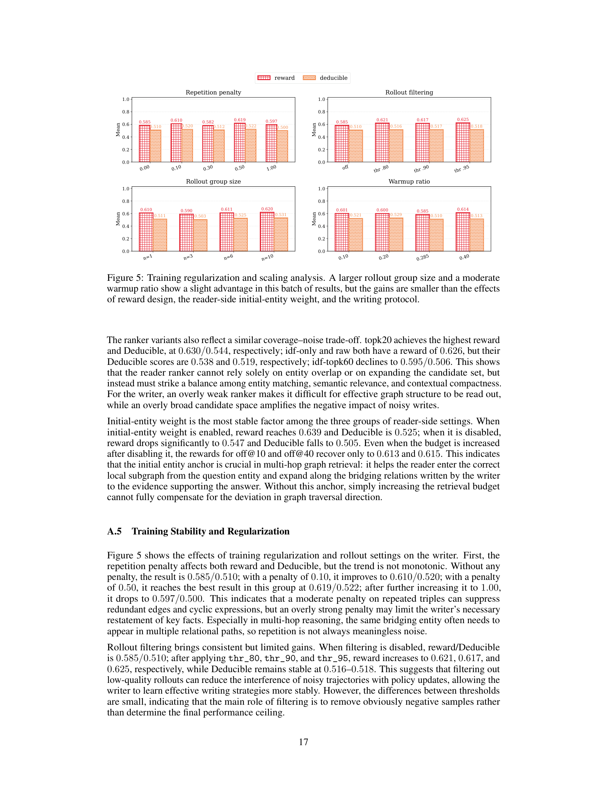

> [[../index|Wiki]] | [[../summary|Summary]] | [[../digest|Digest]]

# Appendix C–F: Target-Graph Calibration, Distribution Shift, Reader Stability, and the Writer–Reader Loop

**In one sentence:** The appendices formalize — and in each case justify by a bound — why SAGE's writer–reader architecture works: the ideal reading function decomposes into a cross-graph schema part plus a per-graph residual (Theorem C.4), writer updates shift the graph distribution so a fixed reader must be recalibrated (Prop. 7 / Cor. D.1), the gated-gnn reader is locally Lipschitz in an "augmented graph drift" so score and top-k changes stay small and boundary-local (Theorems E.11–E.18), and alternating updates are approximate coordinate improvement of one joint utility with provable surrogate-to-true transfer and irreducible single-sided bottlenecks (Theorems F.1, F.3, Prop. 9).

## Key points

- **Context–schema decomposition is provably optimal given two approximating classes.** If a schema class approximates the shared structural rule within ε_sch and a context class approximates the target-graph residual within ε_ctx, then the combined reader achieves R_G ≤ 2ε_sch + 2ε_ctx (Thm C.4) — and a schema-only reader retains an irreducible bias exactly equal to dist²_{L²}(f^⋆_{ctx,G}, H_sch) (Proposition 6, Eq. 75).
- **The schema prior buys sample complexity, not just bias.** With n_G target-graph samples, estimation error scales as O(√(d_full/n_G)) without the prior vs O(√(d_res/n_G)) with it (Eq. 81–82); in self-evolving memory each writer round yields only limited supervised signal, so learning the residual is the right regime (Remark C.8).
- **Writer updates are a distribution shift that the fixed reader's risk can reflect.** |L_R(ϕ;θ′) − L_R(ϕ;θ)| ≤ TV(Π_θ′, Π_θ), and ≤ L_ℓ·W₁(Π_θ′, Π_θ) when the loss is L_ℓ-Lipschitz in the graph (Prop. 7, Eqs. 85–86); hence target-graph re-optimization of the reader is declared a *necessary* mechanism (Cor. D.1).
- **Stability is measured by augmented drift Δ_aug = Δ_X + Δ_A + Δ_seed + Δ_Z + Δ_B** (feature, adjacency, seed-score, gate-input, and anchor-matrix drift; Eqs. 88–91), not a global Lipschitz assumption — explicitly because real graphs have hubs and add/alias/anchor changes.
- **The layered result is linear-in-drift, local.** D_L representations: ‖H(L)−H′(L)‖ ≤ C_H(Δ_X + Δ_seed + Δ_A + Δ_Z) (Eq. 123); entity/doc scores: ‖s_E−s′_E‖∞ ≤ C_E·Δ_aug with C_E = L_E(C_ctx + |β_sch|C_sch), C_D = C_E + S_E (Eq. 134).
- **Hard top-k instability is confined to the score boundary.** Top-k(s) △ Top-k(s′) ⊆ {d : |s_d − t_k| ≤ 2ε_s} (Thm E.15), and if s_(k) − s_(k+1) > 2ε_s the top-k set is unchanged; soft retrieval changes by ‖π_D − π′_D‖₁ ≤ (2C_D/τ)Δ_aug (Thm E.17).
- **Self-evolution = approximate coordinate improvement on joint utility.** One round improves J by Δ_W + Δ_R − ε_W − ε_R (Thm F.1); reader surrogate bias bounded by ε_ϕ transfers to true utility gain ≥ Δ − 2ε_ϕ (Thm F.3), and calibration raising the bound by 2(ε_ϕ − ε_ϕ′) (Cor. F.4).
- **Single-sided updates have hard floors.** With E = E_write(θ) + E_read(ϕ;θ) + ε_int, reader-only updates can never beat E_write(θ), writer-only can never beat E_read(ϕ;θ′) (Prop. 9, Eqs. 169–170) — the two sides are complementary, not substitutable.
- **Writer-side results (Table 5):** RL-Hybrid dominates on precision 0.902, recall 0.917, deducible 0.522; fine-tuning the reader that feeds GFM's reward does not help (0.824/0.813/0.512 vs 0.838/0.818/0.510), and a frozen answer-API add-on lifts deducible most (0.526) but hurts precision (0.832).

---

## C. Target Graph Calibration and Cross-graph Structural Priors

### C.1 Structural Role Decomposition Assumption

**Definition C.1 (Structural role mapping).** A mapping ρ_G : V(G) → R into a structural role space R, jointly determined by φ_G(v), local edge/community-boundary statistics, and other structure summaries. Roles include hub, bridge, community core, boundary node, and "noisy shortcut".

**Definition C.2 (Target graph reading risk).** With query–node sampling distribution D_G and ideal evidence-relevance f^⋆_G(q, v), the squared risk is R_G(f) = E_{(q,v)∼D_G}[(f(q,v,G) − f^⋆_G(q,v))²] (Eq. 66).

**Assumption C.3 (Context–schema decomposability).** The ideal reading function splits as

f^⋆_G(q, v) = f^⋆_sch(q, ρ_G(v)) + f^⋆_{ctx,G}(q, v)   (Eq. 67)

i.e., a cross-graph *shared structural reading rule* plus a *target-graph residual* induced by the current writer, domain, entity naming, local noise, and writing style. This is exactly SAGE's design: H_sch approximates f^⋆_sch and H_ctx approximates f^⋆_{ctx,G}.

### C.2 Approximation Risk of Context–Schema Decomposition

**Theorem C.4.** Let H_sch + H_ctx,G = {f_s + f_c}. If both pieces are approximable within squared error ε_sch, ε_ctx (Eqs. 69–70, expectations over D_G), then

inf_{f ∈ H_sch + H_ctx,G} R_G(f) ≤ 2ε_sch + 2ε_ctx   (Eq. 71)

Proof sketch: pick fˆ_s, fˆ_c with slack α, use (a+b)² ≤ 2a² + 2b² to get R_G(fˆ) ≤ 2ε_sch + 2ε_ctx + 4α, then take α → 0.

**Proposition 6 (Residual bias of schema-only models).** If L²(D_G) is a Hilbert space, H_sch a closed linear subspace with f^⋆_sch ∈ H_sch, then

inf_{f_s ∈ H_sch} R_G(f_s) = dist²_{L²(D_G)}(f^⋆_{ctx,G}, H_sch)   (Eq. 75)

So as long as the residual f^⋆_{ctx,G} ∉ H_sch, a schema-only reader has an *irreducible* target-graph bias. (Remark C.5 states the implication: the schema prior characterizes only the shared structural rules and cannot replace target-graph calibration; H_ctx exists precisely to absorb the current writer's local noise, entity granularity, relation style, and domain residual.)

### C.3 Sample Complexity Advantage of Schema Prior

**Lemma C.6 (Uniform convergence for bounded loss classes).** For ℓ ∈ [0,1], with probability ≥ 1 − δ, for all f ∈ F simultaneously:

R(f) ≤ R̂_S(f) + 2Rad_n(ℓ∘F) + √(log(2/δ)/n)   (Eq. 77)

(standard symmetrization + McDiarmid/Hoeffding).

**Theorem C.7 (Schema prior reduces sample complexity of target-graph adaptation).** With n_G supervised samples, and empirical minimizers over H_full (no prior) and f_s + H_res (with prior), with probability ≥ 1 − δ:

- R_G(f̂_full) ≤ inf_{H_full} R_G(f) + 4Rad_{n_G}(ℓ∘H_full) + 6√(log(4/δ)/n_G)   (Eq. 80)
- R_G(f_s + f̂_res) ≤ inf_{H_res} R_G(f_s + f_r) + 4Rad_{n_G}(ℓ∘(f_s + H_res)) + 6√(log(4/δ)/n_G)   (Eq. 81)

If Rad terms are O(√(d_full/n_G)) and O(√(d_res/n_G)) respectively (Eq. 82) with d_res ≪ d_full, then the schema prior "reduces target-graph learning from estimating the full reading function to estimating the residual, and lowers the estimation error term for target-graph adaptation."

**Remark C.8** ties this to SAGE: in self-evolving memory each new writer-generated graph provides only limited supervised signal; relearning the full reading function every round is high-variance estimation, which the schema prior fixes/regularizes and lets H_ctx learn only the residual.

## D. Writer-induced Graph Distribution Shift and Target Graph Calibration

The writer parameter θ induces a graph distribution P_θ(G | q, D); the joint law of (q, D, D⁺, y, G) is Π_θ. Reader risk (Eq. 84):

L_R(ϕ; θ) = E_{Π_θ}[ℓ_R(R_ϕ(q, G, D), D⁺, y)],

where ℓ_R can be supporting-entity BCE, multi-positive ranking loss, document recall loss, or a combination.

**Proposition 7 (Writer updates cause reader distribution shift).** For 0 ≤ ℓ_R ≤ 1, |L_R(ϕ;θ′) − L_R(ϕ;θ)| ≤ TV(Π_θ′, Π_θ) (Eq. 85, dual definition of TV); if the loss is L_ℓ-Lipschitz in G under graph metric d_G, then ≤ L_ℓ·W₁(Π_θ′, Π_θ) (Eq. 86, Kantorovich–Rubinstein duality).

**Corollary D.1 (Necessity of target graph calibration).** If a writer update makes TV(Π_θ′, Π_θ) non-negligible, a fixed reader's risk may increase — and with no reader update there is no optimization mechanism to offset the drift. Target-graph calibration (ϕ → ϕ′ minimizing L_R(ϕ′; θ′)) is therefore a *necessary* mechanism for handling writer-induced graph distribution shift.

## E. Reader Stability under Dynamic Graph Evolution

### E.1 Realistic Graph Evolution Distance

Real graphs have hubs, node add/delete, alias merges, anchor rewrites, and statistics that are not globally Lipschitz — so evolution is measured by **augmented graph drift**, the drift actually perceived by the reader.

**Definition E.1 (Padding alignment).** Consecutive-round graphs G, G′ are aligned by persistent memory ids to a common node universe V̄ = V(G) ∪ V(G′); a node present in only one graph becomes an isolated padding node with a presence bit in its features.

**Definition E.2 (Augmented graph drift).** With self-looped row-normalized adjacencies A, A′; pre-soft-addressing score vectors S_q, S′_q; row-normalized entity→document anchoring B, B′:

Δ_X = ‖X − X′‖_{2,∞},  Δ_A = ‖A − A′‖_∞,  Δ_seed = ‖S_q − S′_q‖_∞,  Δ_B = ‖B − B′‖_∞   (Eq. 88)

plus the weighted structural gate drift Δ_Z[l] = max_v (Σ_u A′_vu‖z_uv[l] − z′_uv[l]‖₂), Δ_Z = max_{1≤l≤L} Δ_Z[l] (Eq. 90). Total:

**Δ_aug(G, G′; q) = Δ_X + Δ_A + Δ_seed + Δ_Z + Δ_B**   (Eq. 91).

### E.2 Stability Assumptions

- **A. E.3 (Normalized adjacency):** rows sum to 1, so ‖A‖_∞ = 1; hubs allowed but single-layer propagation never unboundedly amplified by degree (Eq. 92).
- **A. E.4 (Trajectory-local boundedness):** ‖H^(l)(q,G)‖_{2,∞}, ‖H^(l)(q,G′)‖_{2,∞} ≤ B_l for l = 0…L (Eq. 93).
- **A. E.5 (Locally Lipschitz modules):** ‖W^{(l)}‖₂ ≤ M_l; the gate MLP is L_{g,l}-Lipschitz in the trajectory neighborhood (Eq. 95); PReLU constant L_σ, LayerNorm constant L_LN,l.
- **A. E.6 (Score head and projection):** ‖s_E(q,G) − s_E(q,G′)‖∞ ≤ L_E‖H(q,G) − H(q,G′)‖_{2,∞} (Eq. 96); with ‖s_E‖∞ ≤ S_E and B row-normalized so ‖B‖∞ ≤ 1.

### E.3 Stability of Soft Addressing and Initial Representation

**Lemma E.7 (Softmax & pre-activation stability).** For p = softmax(S/T₀): ‖p − p′‖∞ ≤ T₀⁻¹‖S − S′‖∞ (Eq. 98); with temperature-weighted addresses a_v = (p_v + ε_p)^η, 0 < η ≤ 1: ‖a − a′‖∞ ≤ (ηε_p^{η−1}/T₀)‖S − S′‖∞ (Eq. 99). (Softmax Jacobian diag(p) − pp⊤ has ‖·‖_{∞→∞} ≤ 1.)

**Lemma E.8 (Initial node representation stability).** For h^(0)_v = a_v(q)u_q + W_x x_v (Eq. 102):

‖H^(0)(q,G) − H^(0)(q,G′)‖_{2,∞} ≤ C_init(Δ_seed + Δ_X),  C_init = (ηε_p^{η−1}‖u_q‖₂)/T₀ + ‖W_x‖₂   (Eqs. 103–104).

### E.4 Single-layer Stability of Structurally Gated Propagation

**Lemma E.9 (Gate boundedness and stability).** The gate g_uv[l] = 1 + δ·tanh(MLP^{(g_l)}(z_uv[l])) satisfies ‖g_uv[l]‖∞ ≤ 1 + δ (Eq. 108) and ‖g_uv[l] − g′_uv[l]‖∞ ≤ δL_{g,l}‖z_uv[l] − z′_uv[l]‖₂ (Eq. 109) — since tanh has range [−1,1] and is 1-Lipschitz.

**Lemma E.10 (Single-layer stability).** With D_l = ‖H^(l)(q,G) − H^(l)(q,G′)‖_{2,∞} (Eq. 111), under E.3–E.6:

D_l ≤ α_l D_{l−1} + β_l,A Δ_A + β_l,Z Δ_Z[l]   (Eq. 112)

with α_l = L_LN,l(1 + L_σ(1+δ)M_l), β_l,A = L_LN,l·L_σ(1+δ)M_l B_{l−1}, β_l,Z = L_LN,l·L_σ·δL_{g,l}M_l B_{l−1} (Eqs. 113–114). The proof splits message drift into three additive/subtractive terms: feature difference (Eq. 117, bounded by (1+δ)M_l D_{l−1}), adjacency drift (Eq. 118), and gate drift (Eq. 119), then applies the PReLU/LayerNorm Lipschitz constants.

### E.5 Stability of Representations, Scores, and Retrieval Sets

**Theorem E.11 (Local stability of gated representations).** Unrolling Eq. 112 over L layers:

D_L ≤ (∏_{l=1}^{L} α_l) D₀ + Σ_{t=1}^{L}(∏_{l=t+1}^{L} α_l)(β_tA Δ_A + βtZ ΔZ[t])   (Eq. 122)

so there is C_H > 0 with

‖H^(L)(q,G) − H^(L)(q,G′)‖_{2,∞} ≤ C_H(Δ_X + Δ_seed + Δ_A + Δ_Z)   (Eq. 123).

**Theorem E.12 (Stability of context/schema dual channels).** If ‖H_ctx(G) − H_ctx(G′)‖ ≤ C_ctx Δ_aug and ‖H_sch(G) − H_sch(G′)‖ ≤ C_sch Δ_aug (Eqs. 125–126), additive fusion gives ‖H(G) − H(G′)‖ ≤ (C_ctx + |β_sch|C_sch)Δ_aug (Eq. 127); normalized convex fusion H_λ = (1−λ)H_ctx + λH_sch gives ‖H_λ(G) − H_λ(G′)‖ ≤ ((1−λ)C_ctx + λC_sch)Δ_aug (Eq. 129), which is *decreasing in λ when C_sch < C_ctx*. Remark E.13 clarifies that Eq. 127 does not claim the schema prior necessarily lowers worst-case Lipschitz constants of additive fusion — its main role is risk decomposition and sample-complexity reduction; with gating/normalization (Eq. 129 form) it can additionally act as a low-sensitivity channel.

**Theorem E.14 (Stability of entity and document scores).** ‖s_E(q,G) − s_E(q,G′)‖∞ ≤ C_E Δ_aug (Eq. 132) and ‖s_D(q,G) − s_D(q,G′)‖∞ ≤ C_D Δ_aug (Eq. 133); for additive fusion, C_E = L_E(C_ctx + |β_sch|C_sch), C_D = C_E + S_E (Eq. 134). (Document scores via s_D = B s_E, using ‖B‖∞ ≤ 1 and ‖s_E‖∞ ≤ S_E.)

**Theorem E.15 (Boundary stability of hard top-k).** With ‖s − s′‖∞ ≤ ε_s and boundary set B_{k,2ε_s}(s) = {d : |s_d − t_k| ≤ 2ε_s} (Eq. 138):

Top-k(s) △ Top-k(s′) ⊆ B_{k,2ε_s}(s)   (Eq. 139)

and if s_(k) − s_(k+1) > 2ε_s then Top-k(s) = Top-k(s′) — a clear margin at the k-boundary makes hard ranking *exactly* invariant to the drift.

**Corollary E.16.** Taking ε_s = C_D Δ_aug gives P_k(q,G) △ P_k(q,G′) ⊆ B_{k, 2C_D Δ_aug}(s_D(q,G)) (Eq. 142): top-k instability under graph evolution is restricted to candidates near the original score boundary.

**Theorem E.17 (Soft retrieval distribution stability).** For π_D(q,G) = softmax(s_D(q,G)/τ), ‖π_D − π′_D‖₁ ≤ (2/τ)‖s − s′‖∞ (Eq. 144, softmax is L∞→L1 with constant 2), hence

‖π_D(q,G) − π_D(q,G′)‖₁ ≤ (2C_D/τ) Δ_aug(G, G′; q)   (Eq. 145).

**Theorem E.18 (High-probability graph evolution stability).** If P[Δ_aug > ε] ≤ δ, then P[‖s_D(G) − s_D(G′)‖∞ > C_D ε] ≤ δ (Eq. 150); if E[Δ_aug] ≤ ε̄, then E[‖s_D(G) − s_D(G′)‖∞] ≤ C_D ε̄ (Eq. 151) — the deterministic per-pair bound (Eq. 152) transferred to probability and expectation.

### E.6 Local Influence Cone

**Proposition 8.** If the writer changes only a primitive set U (nodes/edges/anchors/attributes), the gate input z_uv[l] depends on a local neighborhood of radius r_z, and G, G′ are identical outside N_{L+r_z}(U), then for every v ∉ N_{L+r_z}(U) the final representations agree *exactly*: h^(L)_v(q,G) = h^(L)_v(q,G′) (Eqs. 153–154, inductive on layer l). If graph-level summary drift is ρ_g = ‖r_G − r_G′‖₂, then ‖h^(L)_v(q,G) − h^(L)_v(q,G′)‖₂ ≤ C_g ρ_g (Eq. 155) — the only global leak is through the summary channel.

## F. Theoretical Motivation of the Self-evolving Writer–Reader Loop

### F.1 Joint Memory Utility

The reader-aware writer reward combines evidence coverage, precision, deducibility, and answer utility. Abstractly:

J(θ, ϕ) = E_{(q,D,D⁺,y)}[U(R_ϕ(q, W_θ(q,D), D), D⁺, y)]   (Eq. 156)

with U e.g. U = (α r_rec + β r_pre + γ r_ded)/(α+β+γ) − λ_rep ρ_rep + λ_fmt r_fmt (Eq. 157). This places writer graph-construction quality and reader graph-reading ability under a single objective.

### F.2 Approximate Coordinate Improvement

**Theorem F.1.** If the writer update improves J at fixed ϕ^(r) by Δ_W[r] − ε_W[r] (Eq. 158) and the reader update improves J at fixed θ^(r+1) by Δ_R[r] − ε_R[r] (Eq. 159), then one full round satisfies

J(θ^(r+1), ϕ^(r+1)) − J(θ^(r), ϕ^(r)) ≥ Δ_W[r] + Δ_R[r] − ε_W[r] − ε_R[r]   (Eq. 160)

— i.e., the self-evolution loop is **approximate coordinate improvement on the joint memory utility**, and improves whenever Δ_W + Δ_R > ε_W + ε_R. (Proof is a telescoping split into the reader step + writer step.)

### F.3 Reader Reward Bias and Calibration Benefit

**Definition F.2 (True utility and reader surrogate reward).** U⋆(G) is true downstream utility; Û_ϕ(G) is the reader-derived surrogate reward. Reader reward bias ε_ϕ: |Û_ϕ(G) − U⋆(G)| ≤ ε_ϕ for all considered G (Eq. 162).

**Theorem F.3 (Surrogate → true improvement).** If the surrogate improves by Δ ≥ (Eq. 163), then

U⋆(G_θ′) − U⋆(G_θ) ≥ Δ − 2ε_ϕ   (Eq. 164)

**Corollary F.4 (Reader calibration reduces writer optimization bias).** Calibrating ϕ → ϕ′ and reducing bias from ε_ϕ to ε_ϕ′ raises the lower bound on true-utility improvement by **2(ε_ϕ − ε_ϕ′)** for the same Δ (Eq. 167) — a concrete quantitative value of reader calibration for writer-side optimization.

### F.4 Irreducible Bottlenecks of Single-sided Updates

**Proposition 9.** Decompose total error as E(θ,ϕ) = E_write(θ) + E_read(ϕ;θ) + ε_int(θ,ϕ), all terms ≥ 0 (Eq. 168). Then:

- Reader-only update (ϕ → ϕ′): E(θ,ϕ′) ≥ E_write(θ) (Eq. 169)
- Writer-only update (θ → θ′): E(θ′,ϕ) ≥ E_read(ϕ;θ′) (Eq. 170)

"Reader-only updates cannot compensate for evidence chains that the writer has not written; writer-only updates cannot guarantee that a fixed reader can read out the evidence structures in the new graph distribution."

### F.5 Stability of Closed-loop Graph Evolution and Parameter Updates

**Theorem F.5 (Score drift control under multi-round self-evolution).** If single-step graph stability holds, ‖s_D(q,G^(r+1);ϕ^(r)) − s_D(q,G^(r);ϕ^(r))‖∞ ≤ C_D Δ_r with Δ_r = Δ_aug(G^(r), G^(r+1); q) (Eq. 172), and scores are locally Lipschitz in reader parameters, ‖s_D(q,G;ϕ) − s_D(q,G;ϕ′)‖∞ ≤ C_ϕ‖ϕ − ϕ′‖₂ (Eq. 173), then over T rounds:

‖s_D(q,G^(T);ϕ^(T)) − s_D(q,G⁽⁰⁾;ϕ⁽⁰⁾)‖∞ ≤ Σ_{r=0}^{T−1} (C_D Δ_r + C_ϕ‖ϕ^(r+1) − ϕ^(r)‖₂)   (Eq. 174)

(i.e., multi-round drift is the sum of per-round graph-drift and parameter-update contributions; no compounding amplification).

**Corollary F.6 (High-probability multi-round stability).** If P[Δ_r > ε_r] ≤ δ_r, then with probability ≥ 1 − Σ_r δ_r,

‖s_D(q,G^(T);ϕ^(T)) − s_D(q,G⁽⁰⁾;ϕ⁽⁰⁾)‖∞ ≤ Σ_{r=0}^{T−1} (C_D ε_r + C_ϕ‖ϕ^(r+1) − ϕ^(r)‖₂)   (Eq. 176)

(union bound over rounds + Thm F.5 on the good event).

## Writer training results (Table 5) & training/regularization analysis

Table 5 in this chunk evaluates memory-writer training variants under a fixed reader (the reader is either the *pretrained* or *fine-tuned* GFM reader providing rewards):

| Method | Prec. ↑ | Recall ↑ | Deducible ↑ |
|---|---|---|---|
| GFM-pretrained-only | 0.838 | 0.818 | 0.510 |
| GFM-finetuned | 0.824 | 0.813 | 0.512 |
| RL-Recall | 0.889 | 0.835 | 0.502 |
| RL-F1 | 0.839 | 0.881 | 0.497 |
| RL-Deduce | 0.861 | 0.892 | 0.517 |
| **RL-Hybrid** | **0.902** | **0.917** | 0.522 |
| Hybrid + frozen answer API | 0.832 | 0.874 | **0.526** |

RL-Hybrid is the strongest balanced configuration (best precision 0.902 and recall 0.917); single-objective RL-Recall and RL-F1 each sacrifice one of the two (Recall-only trades deducible, F1 trades recall against precision). A frozen answer-API component gives the best deducible (0.526) at the cost of precision (0.832). Notably, fine-tuning the *reader* that supplies the reward signal to GFM does not help the writer (slightly lower precision/recall, deducible nearly flat).

The corresponding writer-side training-regularization and scaling sweeps in Figure 5 vary repetition penalty, rollout filtering threshold, rollout group size n, and warmup ratio, and plot reward vs deducible:

Read with Table 5, the scaling analysis says these writer-hyperparameter knobs are second-order: reward stays in roughly the 0.58–0.62 band and deducible in the low-to-mid 0.5s, with small and often non-monotone swings. Panel-by-panel: repetition penalty is non-monotone (worst at 0.0 and at the maximum penalty, peak at moderate ≈0.5 — over-penalizing duplicate triples hurts necessary restatement in multi-hop reasoning); rollout filtering (off → thr_80/90/95) lifts reward modestly while deducible stays flat — it mainly trims negative samples rather than raising the ceiling; rollout group size n (1 → 10) leaves reward essentially flat and pushes deducible up gently; warmup ratio (0.10 → 0.40) shows no clear monotone trend, with a moderate ratio slightly favored. The paper's takeaway is that absolute gains from these training-side knobs are smaller than the levers discussed elsewhere (reward design, reader-side initial-entity weight, writing protocol), which dominate the performance differences.

**Covers:** Source lines 2417–3709 — Appendix C (target graph calibration and cross-graph structural priors: C.1 structural role decomposition, C.2 approximation risk of the context–schema decomposition, C.3 sample-complexity advantage), Appendix D (writer-induced graph distribution shift and target-graph calibration), Appendix E (reader stability under dynamic graph evolution: E.1 augmented graph drift, E.2 stability assumptions, E.3 soft addressing & init representation stability, E.4 single-layer gated propagation stability, E.5 stability of representations/scores/retrieval sets, E.6 local influence cone), Appendix F (theoretical motivation of the self-evolving writer–reader loop: F.1 joint memory utility, F.2 approximate coordinate improvement, F.3 reader reward bias & calibration benefit, F.4 irreducible bottlenecks of single-sided updates, F.5 closed-loop evolution stability incl. Eqs. 174/176), and Table 5 (writer training results) with the Figure 5 writer-side training-regularization/scaling analysis.
