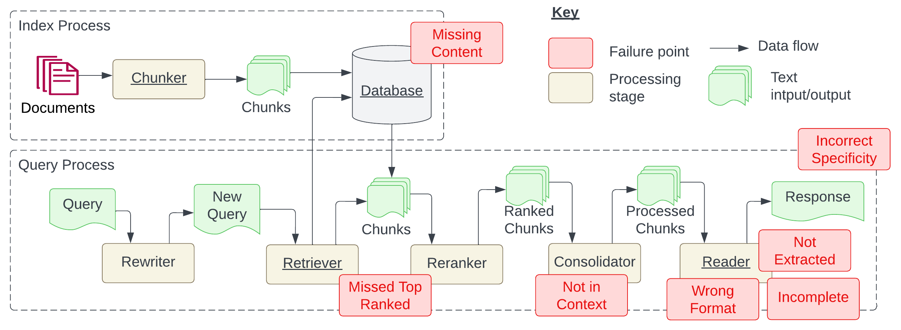

> [[../index|Wiki]] | [[../summary|Summary]] | [[../digest|Digest]]

# Background & RAG Pipeline

**In one sentence:** RAG is the pragmatic alternative to fine-tuning for grounding LLM answers in an organisation's unstructured knowledge, and this page lays out why it is chosen, the two-stage Index/Query pipeline it runs on, and the design decisions engineers must make at each stage.

## Key points

- RAG is preferred over fine-tuning because it avoids the cost of training/serving a fine-tuned LLM and lets the knowledge base be continuously updated with new documents; both options carry tradeoffs around privacy/security, scalability, cost, and required skills, and the paper focuses on RAG.
- RAG systems aim to (a) reduce hallucinated LLM responses, (b) link sources/references to generated answers, and (c) remove the need for annotating documents with metadata — any unstructured content can be indexed and queried without knowledge-graph construction or heavy data curation.
- LLMs used directly as QA systems face two fundamental challenges that RAG addresses: hallucinations (responses that look right but are incorrect) and unboundedness (no way to direct or update output content other than prompt engineering).
- The Index process is a development-time pipeline: documents are split into chunks, each chunk is converted to a vector embedding and stored alongside the chunk in a vector database; chunk size is a core tradeoff — too small and some questions can't be answered, too long and answers contain generated noise.
- Changing the embedding model requires re-indexing all chunks, so the embedding choice should be validated on the application domain, expected question types, chunk size, and content structure before committing.
- The Query process runs at runtime: an LLM rewriter generalises the raw question (folding in chat history), the new query is embedded, and top-k chunks are retrieved via similarity search (vector databases use tricks like inverted indexes to speed this up).
- Retrieved chunks are re-ranked to push the answer-bearing chunk near the top, then a Consolidator must compress them to fit LLM token limits and API rate limits — often chaining prompts (a reduction strategy) — before the Reader extracts a formatted answer from the generated text.
- RAG systems are hard to test because no ground-truth question/answer data exists for newly indexed documents, so test data must be discovered experimentally via synthetic data generation or minimal piloting — validation is feasible only during operation.

---

## Why RAG over fine-tuning

The introduction frames the problem as follows: LLMs (ChatGPT and its successors) unlock new capabilities for software engineers — building HCI solutions, completing complex tasks, summarising documents, answering questions over given artefacts, and generating content. But LLMs suffer from two limitations: they lack up-to-date knowledge, and they lack domain-specific knowledge captured in a company's repositories.

Two options address this: (a) fine-tune an LLM with domain-specific artefacts, which requires managing or serving a fine-tuned LLM, or (b) use a RAG system that relies on LLMs for answer generation over existing (extensible) knowledge artefacts. Both have pros and cons around privacy/security of data, scalability, cost, and required skills; the paper commits to the RAG option.

RAG is compelling because it combines an information retrieval component (retrieve relevant information for a query from a data store) with a generation component (use the retrieved information as context to generate an answer). This lets all unstructured information be indexed and queried — reducing development time by avoiding knowledge-graph creation and limited data curation/cleaning.

For a software engineer, building a RAG system means: preprocessing domain knowledge captured as artefacts in different formats, storing processed information in an appropriate data store (vector database), implementing or integrating the right query-artifact matching strategy, ranking matched artifacts, and calling the LLM API passing in the user query and context documents. New RAG-building advances keep emerging, but how they relate and perform for a specific application context must be discovered per project.

The paper's purpose is twofold: (1) provide a reference for practitioners, and (2) present a research roadmap for RAG systems. It claims to be the first empirical insight into the challenges of creating robust RAG systems. The research questions are:

1. *What are the failure points that occur when engineering a RAG system?* — answered empirically using the BioASQ dataset: 15,000 documents and 1,000 question-answer pairs indexed, queries run through a GPT-4-based pipeline, all responses validated with OpenAI evals, and manual inspection of discrepancies to find patterns (Section 5).
2. *What are the key considerations when engineering a RAG system?* — answered via lessons learned from three case studies (research, education, biomedical) (Section 6).

Contributions: a catalogue of failure points (FPs) in RAG systems; an experience report from 3 case studies (two of them currently running at Deakin University); and a research direction list for RAG systems based on the lessons learned.

## Related work

RAG encompasses using documents to augment LLMs through pre-training and at inference time. Because of compute cost, data preparation time, and required resources, using RAG without training or fine-tuning is an attractive proposition — though challenges arise with LLMs for information extraction, such as performance with long text.

A recent survey found LLMs are used across the RAG pipeline (retriever, data generation, rewriter, reader). This work complements that survey by taking a software engineering perspective: what issues engineers face and what SE research is necessary to realise solutions with state-of-the-art RAG.

Emerging work has benchmarked RAG systems, but not at the failures occurring during implementation. SE research has investigated RAG for code-related tasks, but RAG's application is broader than SE tasks. This paper complements existing work by presenting implementation challenges with a focus on practitioners.

Errors and failures in RAG systems overlap with other information retrieval systems: (1) no metrics for query rewriting, (2) document re-ranking, and (3) effective content summarisation. The paper's results confirm this. The unique aspects are tied to the semantic and generative nature of LLMs, including evaluating factual accuracy.

## RAG as an information retrieval approach

With the popularity explosion of LLM services (ChatGPT, Claude, Bard), people explored them as question-answering systems. Performance is impressive, but two fundamental challenges remain:

1. **Hallucinations** — the LLM produces a response that looks right but is incorrect.
2. **Unbounded** — no way to direct or update the content of the output other than through prompt engineering.

A RAG system is an information retrieval approach designed to overcome these limitations: it takes a natural-language query, converts it into an embedding, uses that embedding to semantically search a set of documents, and passes the retrieved documents to an LLM to generate an answer. The overview appears as two separate processes — **Index** and **Query** — in Figure 1 below.

### The Index process

The retrieval system works using embeddings, which provide a compressed semantic representation of a document expressed as a vector of numbers. During the Index process:

1. Each document is split into smaller chunks.
2. Each chunk is converted into an embedding using an embedding model.
3. The original chunk and its embedding are indexed in a database.

Software engineers face design decisions around how to chunk a document and how large a chunk should be. The tradeoff in the paper's words: "If chunks are too small certain questions cannot be answered, if the chunks are too long then the answers include generated noise."

Different document types require different chunking and processing stages — e.g. video content requires a transcription pipeline to extract the audio and convert it to text prior to encoding (as the AI Tutor case study does with Whisper).

The choice of embedding model matters: **changing the embedding strategy requires re-indexing all chunks.** An embedding should be chosen based on its ability to semantically retrieve correct responses, and this depends on the size of chunks, the types of questions expected, the structure of the content, and the application domain.

### The Query process

The Query process takes place at run time:

1. **Rewrite** — the natural-language question is first converted into a general query using an LLM, which enables additional context (e.g. previous chat history) to be included in the new query.
2. **Embed** — an embedding is calculated from the new query to locate relevant documents from the database.
3. **Retrieve** — top-k similar documents are retrieved using a similarity method such as cosine similarity (vector databases have techniques such as inverted indexes to speed up retrieval time). The intuition: chunks that are semantically close to the query are likely to contain the answer.
4. **Re-rank** — retrieved documents are re-ranked to maximise the likelihood that the chunk with the answer is located near the top.
5. **Consolidate** — the Consolidator processes the chunks. This stage is needed to overcome two LLM limitations: (1) **token limit** — services such as OpenAI have hard limits on the amount of text in a prompt, which restricts the number of chunks that can be included in a single answer-extraction prompt, so a reduction strategy is needed to chain prompts to obtain an answer; and (2) **rate limit** — these services also restrict the number of tokens usable within a time frame, restricting system latency. Engineers must consider these tradeoffs when designing a RAG system.
6. **Extract** — the final stage extracts the answer from the generated text. The **Reader** is responsible for filtering noise from the prompt, adhering to formatting instructions (e.g. answer the question as a list of options), and producing the output to return for the query.

Implementation requires customising multiple prompts to process questions and answers; this process ensures that questions relevant to the domain are returned.

The section closes with a testing observation: using LLMs to answer real-time questions from documents opens up new application domains, but **RAG systems are difficult to test** because no (question, answer) data exists for newly indexed content — test data must be experimentally discovered through either (a) synthetic data generation, or (b) piloting the system with minimal testing.

### Figure 1: the two-process architecture

Figure 1 depicts the same two-process split described above as a system-architecture diagram. The **offline Index process** reads documents through a Chunker to produce chunks stored in a database (the green input/output stacks show raw text entering on one side of each region). The **online Query process** shows the runtime chain in full: the user query passes through a Rewriter (which produces a new, generalised query), the Retriever pulls candidate chunks from the database, a Reranker orders them, the Consolidator compresses them into processed chunks, and the Reader produces the final response.

Beyond the data flow, the figure is a diagnostic map: each of the study's seven failure points is anchored (in red boxes) to the pipeline stage where it originates — *Missing Content* at the database/indexing stage, *Missed Top Ranked* at the Retriever, *Not in Context* at the Consolidator, and *Wrong Format* / *Not Extracted* / *Incomplete* / *Incorrect Specificity* at the Reader/response side. In other words, the diagram localises each class of RAG error — lost at index time, mis-retrieved, mis-consolidated, or mis-read at query time — so an observed bad answer can be traced back to its source component and debugged independently of the others. It is a qualitative taxonomy of *where* failures occur, not a measurement of their frequency.

**Covers:** Sections 1–3 (Introduction, Related Work, Retrieval Augmented Generation)
