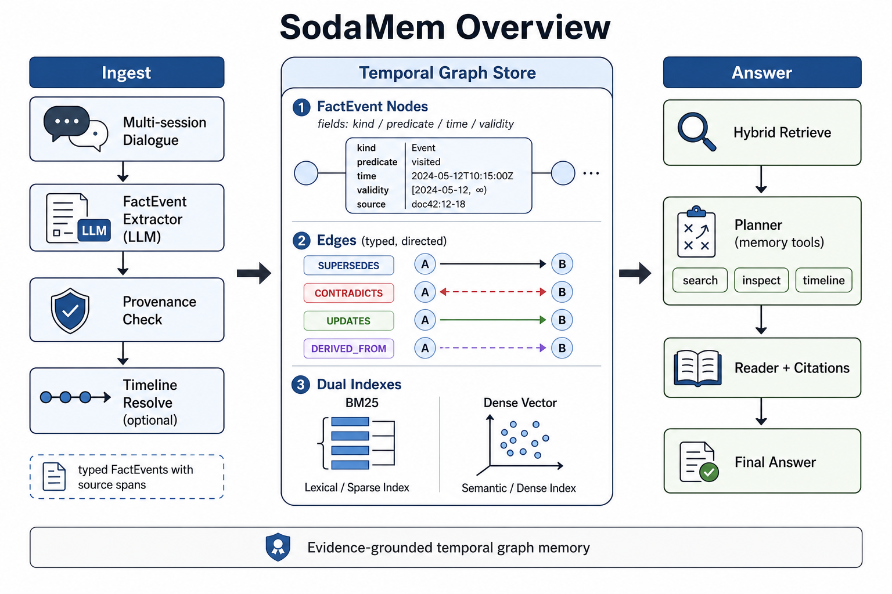
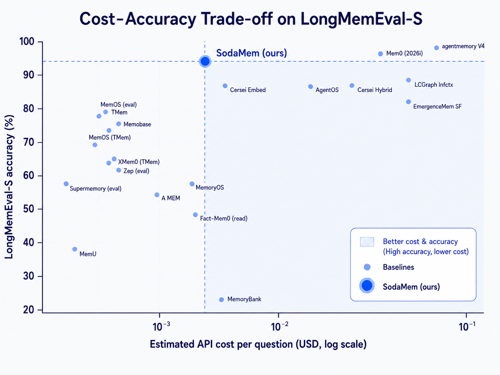

# SodaMem: Evidence-Grounded Temporal Graph Memory for LLM Agents

**Paper:** [SodaMem: Evidence-Grounded Temporal Graph Memory for LLM Agents (Wan, Wu, Lyu, 2026)](https://arxiv.org/abs/2608.08055)
**Wiki:** [[index]] | **Digest:** [[digest]]

## Human Readable TL;DR

Imagine a personal assistant that keeps a diary of everything you've ever told it — but never crosses anything out. If you once said "I love spicy food" and later said "I'm cutting down on spice," a flat diary keeps both lines and might quote the wrong one back to you. SodaMem instead builds a living fact-graph: every fact it remembers is tagged with exactly which sentence it came from (so it can prove itself), when it was true, and whether a newer fact has replaced it. When you ask a question, a planner hunts through the graph the way a detective follows leads — checking multiple trails (keyword search, meaning-based search, and graph connections) before a separate "reader" writes the final answer with citations. On a standard long-memory test, this setup answers 92.8% of questions correctly for about one-sixth of a cent per question — cheap and accurate at the same time.

## TL;DR

SodaMem models agent memory as an evidence-grounded temporal knowledge graph: an LLM extracts typed FactEvents with mandatory source-span provenance, mention/occurrence/validity time axes, and write-time SUPERSEDES/CONTRADICTS/UPDATES edges over a hybrid BM25+dense index. Retrieval fuses three tunnels (graph/entity, BM25, embedding) by connection density with a soft time bonus rather than hard temporal filters, and answering runs a planner–reader loop that gathers citable evidence before a separate reader composes the final response. On LongMemEval-S (500 questions), the store-of-record configuration reaches 92.8% accuracy (464/500) at a measured mean $0.00161/question with deepseek-v4-flash, and the authors compile a 22-method cost–accuracy table showing SodaMem near the accuracy frontier at Flash-tier spend, strictly dominating several higher-cost, lower-accuracy public systems.

---

## Problem & Motivation

Long-horizon personal agents need to know *what is currently true*, not just what was once said. Flat RAG and Markdown-log memories optimize needle-in-haystack retrieval but fail on four pressures: **(P1) currency/conflict** — preferences reverse, and append-only logs leave "which value is current?" to unordered chunks; **(P2) temporal structure** — relative-date and "most recent" questions break without a comparable timeline; **(P3) provenance** — lossy summaries and opaque vector hits can't be audited back to source; **(P4) association** — multi-hop questions need entity/claim links beyond cosine similarity, while avoiding "episode-wrong but similar" memories polluting the answer.

## Main Original Ideas

1. **FactEvent schema with mandatory provenance.** Every extracted fact `f = (κ, π, m, τ, ρ, S, σ)` — kind, predicate, modality, temporal fields, entity roles, source spans, status — must cite spans that literally occur in the source turn; candidates that don't are rejected at ingest (Algorithm 1).
2. **Three explicit temporal axes + write-time supersession.** Mention time (when said), occurrence time (when it happened), and validity (valid_from/valid_until) are tracked separately; when a new fact competes with an old one on the same subject–predicate slot, the old fact is deterministically marked superseded and its validity interval closes — currency is structural, not left to LLM judgment at read time.
3. **Soft-time ranking instead of hard temporal filters.** Query time parses into a window + sort direction, but a stated or vague time window only adds a ranking bonus (β, default 0.3) rather than excluding evidence outright — so a user who misremembers "two months ago" for a three-month-old fact doesn't lose the right answer to a hard filter.
4. **Connection-density fusion across three recall tunnels.** Graph/entity (strong), BM25 (strong), and embedding (weak) tunnels each award mass to evidence IDs (defaults: strong direct 0.4, weak direct 0.2, strong derived 0.1, weak derived 0.05); density(i) = Σ masses, and confidence = density + soft time bonus — ranking by how many independent signals corroborate a fact, not by cosine similarity alone.
5. **Planner–reader answering loop.** A planner LLM can call memory tools (search, inspect, session-expand, timeline, count, compute) under a step budget to grow the evidence pool before a *separate* reader model composes the cited final answer — separating tool-use policy from citation discipline.

---

## Key Findings

- **Accuracy/cost headline:** on LongMemEval-S (500 questions, ~115k-token histories), the store-of-record run (500 users, 235,840 facts; deepseek-v4-flash as planner/reader/judge) scores 464/500 = **92.8%** (best of N=3; median 90.6%) at a mean of **$0.00161/question** (~18.3k tokens; median $0.00111 / ~14.6k tokens — the mean is pulled up by a long tail).
- **Self-grading caveat:** the same Flash model grades its own answers; absolute accuracy could shift under an independent judge (e.g. GPT-4o), though cost figures are judge-independent.
- **Cost–accuracy table (selected rows, sorted by accuracy; full 22-method table in [[wiki/03-evaluation-and-results|wiki page 3]]):**

| Method | Model | Accuracy | Cost / 10³ Q |
|---|---|---|---|
| agentmemory V4 | Claude Opus 4.6 | 96.2% | $60 (est.) |
| Mem0 (2026 research) | GPT-4o (est.) | 94.4% | $22 (est.) |
| **SodaMem (ours)** | deepseek-v4-flash | **92.8%** | **$1.61 (meas.)** |
| Cersei Full-context | Gemini 2.5 Flash | 87.6% | $33 (meas.) |
| AgentOS | GPT-4o | 85.6% | $7.7 (meas.) |
| MemOS (eval set) | GPT-4o-mini | 77.8% | $0.33 (est.) |
| Zep (eval set) | GPT-4o-mini | 63.8% | $0.36 (est.) |
| MemoryBank | GPT-4o-mini | 21.0% | $2.21 (est.) |

- **Dominance region:** SodaMem strictly dominates (cheaper AND more accurate than) Cersei Embed/Hybrid/Full-context, AgentOS, long-context GPT-5-mini, EmergenceMem Simple Fast, and MemoryBank-under-TiMem; only Opus/GPT-4o-class systems beat it on accuracy, at ~10–40× the estimated cost.
- **Public accuracy jumps track reader-model upgrades** (e.g. Mastra 84.23%→94.87% swapping GPT-4o for GPT-5-mini) more than they track memory architecture — a caution against attributing all gains to the memory design.

## Suggestions & Future Directions

1. Independent re-judging of released answer hypotheses under a non-self model (e.g. GPT-4o) to validate the 92.8% figure.
2. Session-anchored timeline resolution at ingest, to further reduce temporal-reasoning misses (the paper's acknowledged weakest category).
3. Ablations on ingest-time spend and the optional TimelineResolution layer, left for follow-up work.
4. A unified, single-harness re-run of all baselines — current cost comparisons are compiled estimates from disclosed tokens/USD across differing protocols, not a bake-off.

## Authors & Institutions

Fengrong Wan, Chengcan Wu, Ningtao Lyu — Peking University. Code: https://github.com/SodaMem/SodaMem (arXiv:2608.08055v1 [cs.AI], 8 Aug 2026).

## Figures

