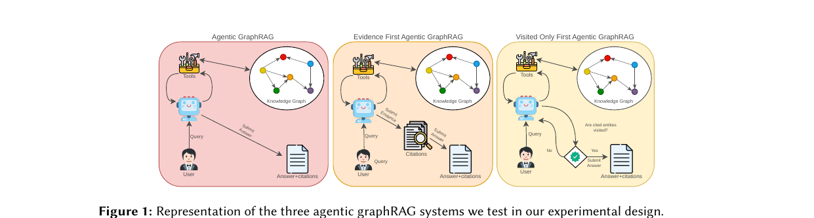
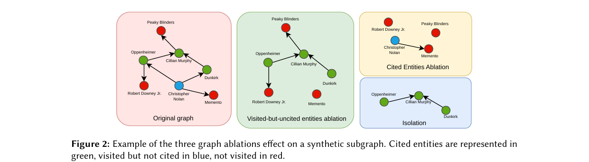

> [[../index|Wiki]] | [[../summary|Summary]] | [[../digest|Digest]]

# Experimental Design and the Three Ablation Studies

**In one sentence:** To measure how much agentic GraphRAG answers depend on cited evidence versus the surrounding graph structure, the authors build a 30-question multi-hop QA benchmark over a knowledge base, establish baselines with six LLM systems across three agentic GraphRAG citation regimes, and then run three graph ablation studies (isolation of evidence, cited-evidence removal, visited-but-uncited removal) that surgically remove or mask different entity classes to attribute accuracy to each component.

## Key points

- The experiment uses a 30-question benchmark built from the 2WikiMultiHopQA development set, chosen for multi-hop questions with supporting facts, evidence triples, and distractor paragraphs.
- The 30 questions break into 12 local-path (clear gold evidence chain), 12 distractor-path (plausible wrong routes via overlapping distractor paragraphs), and 6 summary-vs-local comparison questions.
- The knowledge base was built from 275 unique merged gold+distractor paragraphs chunked into 318 text units, enriched with entities and relationships extracted from distractor text, with Leiden communities, resulting in 1,815 entities, 1,692 relationships, and 7 communities.
- Six systems are evaluated (plain LLM, RAG, non-agentic GraphRAG, and three agentic GraphRAG settings), all using Mistral-Small-4-119B-2603.
- The three agentic settings differ only in citation discipline: unconstrained submission, evidence-first (citations submitted and validated before the final answer), and visited-only (citations rejected unless the cited entities were visited).
- In all ablation studies, each question's entities are sorted into three groups — never visited, visited-and-cited, and visited-but-uncited — and a question-specific modified graph is built by removing entities or restricting access to their text units.
- Study 1 (Isolation) asks whether cited evidence is *sufficient*: Full Isolation removes every non-cited entity; Text-only Isolation keeps the full graph but blocks reading text units attached to non-cited entities, so any accuracy recovery shows the value of graph structure.
- Study 2 (Cited Evidence Ablation) asks whether cited evidence is *necessary*, and controls for the fact that any node removal degrades accuracy structurally, by comparing Cited Removal against Random Removal of an equal-sized set of non-cited, plausibly retrievable text units.
- Study 3 (Visited-but-uncited Ablation) tests the role of navigational context by comparing Entity Removal against Entity text mask, where the masked entities' metadata is also hidden to prevent information leakage from the traversal context.

---

## The three agentic GraphRAG systems tested

All settings run on the same backbone — a user query enters an agent that can call tools and read the Knowledge Graph, and the agent emits an answer with citations — but differ in the discipline imposed on the final answer step (Figure 1):

- **Agentic GraphRAG (pink, baseline)** — the agent actively investigates the graph through tools (`search entities`, `get entity details`, `get neighbors`, `read textunit`, `search communities`, `read community`, `submit answer`), allowing iterative traversal before producing an answer with cited entities, relationships, text units, and communities. It freely transitions between Tools, Knowledge Graph, and Submit Answer with no explicit check on the grounding of the answer.
- **Evidence-First Agentic GraphRAG (orange)** — the same agentic environment, but the agent must first submit and validate its cited evidence before it is allowed to submit the final answer: evidence must be assembled and committed prior to the answer.
- **Visited-Only-First Agentic GraphRAG (yellow)** — a verification gate is added: at submission, citations are checked to see whether the cited entities have also been visited; if not, the citations are rejected and the agent must rephrase, only on "Yes" is the answer submitted — enforcing that every cited source was actually inspected.

These constrained variants exist so that the agent's behavior can be tested under conditions where it is forced to handle citations without the freedom to perform post-rationalization of citations or to cite false entities.

## Study 1 — Isolation of Evidence

Purpose: measure how much of the answer can be attributed to the cited evidence alone, i.e., whether cited evidence is *sufficient*.

- **Full Isolation** — every entity except those cited in the baseline run is removed from the graph, leaving the agent with only the cited evidence. If the agent still answers correctly, the cited evidence was sufficient; if accuracy drops, the original answer depended on non-cited entities, text units, or relationships.
- **Text-only Isolation** — no entities are removed, but access to text units attached to non-cited entities is blocked. The metadata of the non-cited entities remains available, so the agent can still collect traversal information: the graph structure stays intact, the agent can traverse entity nodes and their neighbors, but can only read text units from cited entities.

If accuracy rises back under Text-only Isolation compared to Full Isolation, that shows the impact of preserving the graph structure.

## Study 2 — Cited Evidence Ablation

Where Study 1 tests whether cited evidence is *sufficient*, Study 2 tests whether it is *necessary*.

- **Cited Removal** — every entity cited in the baseline is removed from the graph (performed singularly, specifically for each single question). The agent must answer without the evidence it explicitly attributed, while the rest of the graph structure remains intact.
- **Random Removal** — a same-sized random set of non-cited but plausibly retrievable text units is removed instead.

The Random Removal condition is the control: simply observing that removing cited evidence degrades accuracy is not enough to conclude that citations are meaningful, because removing any entities from the graph reduces the information available to the agent and may degrade accuracy for structural reasons alone. Since the number of removed entities is the same in both conditions, any accuracy difference can be attributed specifically to the informational value of the cited entities rather than to the structural disruption of removing nodes.

## Study 3 — Visited-but-uncited entities Ablation

Purpose: examine the role of entities the agent visited but did not cite. During multi-step graph exploration, the agent follows edges and inspects neighbors to navigate toward an answer, yet many visited nodes never appear in the final citation.

If removing these entities degrades accuracy, the most direct explanation is that the agent relied on evidence it did not cite — but it may also indicate that the traversal path itself shaped the answer through the context it exposed during navigation or the structure it used to reach the cited evidence. To distinguish these theories, Study 3 compares two ablations of the visited-but-uncited entities:

- **Entity Removal** — the visited-but-uncited entities are fully removed from the graph.
- **Entity text mask** — access to their text is restricted, but unlike Text-only Isolation in Study 1, the metadata of the blocked entities is also unavailable, to avoid any information leakage from the traversal context.

Figure 2 shows these ablations applied to one synthetic subgraph (cited = green, visited-but-uncited = blue, not visited = red): the original subgraph spans ~7 entities linked through cited hubs; the cited-entities ablation strips out all green core nodes and fragments most of the structure; the visited-but-uncited ablation drops the blue bridge nodes and their edges, isolating downstream red nodes; and the isolation view retains only the mutually connected cited subgraph.

---

**Covers:** Section 2 (Experimental Design) and Studies 1-3, source/full.txt lines 74-239
