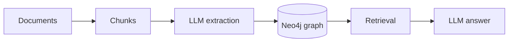

# 00 — Setup: Neo4j, `uv`, and Ollama

## What you will learn
- What we are building over this whole tutorial, and why it needs a graph database.
- Why this tutorial runs its own Neo4j container instead of reusing another one.
- How the Docker Compose file, the `uv` Python project, `.env`, and the `justfile` fit together.
- How to reach the two local Ollama (a program that runs LLMs, Large Language Models, on your own machine) models we use, and how to check they answer.
- How to run `just check` and read its output, and where to click in the Neo4j browser.

## What we are building

This tutorial turns a folder of documents nobody has read yet into a **knowledge graph** you can ask questions about — that is **Graph RAG** (Graph Retrieval-Augmented Generation): instead of only searching similar text chunks, we also let an LLM read each chunk, pull out entities ("things", like a method or a dataset) and relationships between them, store that as a graph in Neo4j (a graph database), and answer questions by walking the graph.



Chapter 00 (this one) only builds the *foundations* everything else depends on: a running Neo4j, a Python project that can talk to it, and a working connection to the LLM. No documents are ingested yet — that starts in chapter 02.

## Project layout

```
project/
├── docker-compose.yml       # neo4j-graphrag container (this chapter)
├── pyproject.toml           # uv project: package graph_rag
├── uv.lock                  # exact dependency versions, committed
├── .env.template            # settings with placeholder-free tutorial defaults
├── justfile                 # up/down/reset/logs/shell/cypher/sync/check/test
├── src/graph_rag/
│   ├── config.py            # Settings, loaded once from .env
│   ├── db.py                # get_driver / run / run_df
│   ├── llm.py                # chat / chat_json / embed (Ollama)
│   └── check.py             # `python -m graph_rag.check`
├── data/
│   ├── docs/                # the sample corpus (see below)
│   └── extracted/           # cached LLM output, filled from chapter 04 on
└── tests/
    └── test_00_setup.py
```

Every later chapter adds one module under `src/graph_rag/` and a handful of `just` recipes, but this layout does not change.

## The sample corpus

`project/data/docs/` holds a single real PDF, `graphrag_survey_2408.08921.pdf` — the paper *"Graph Retrieval-Augmented Generation: A Survey"* (Peng et al., 2024, arXiv 2408.08921). It is 41 pages of unstructured technical text that nobody has hand-labelled with entities or relationships, which is exactly the situation the rest of this tutorial is about: one big document of unknown content goes in, a labelled graph comes out. A second PDF, `project/data/docs_extra/graphrag_local_to_global_2404.16130.pdf` (the Microsoft GraphRAG paper, 26 pages), stays out of the main corpus until chapter 10, where it is used to demonstrate adding a document to an existing graph.

Reading it with `pypdf` (the library chapter 02 uses for real chunking) confirms the page count and shows what raw, un-chunked PDF text looks like:

```bash
uv run python -c "from pypdf import PdfReader; r=PdfReader('data/docs/graphrag_survey_2408.08921.pdf'); print(len(r.pages)); print(r.pages[0].extract_text()[:600])"
```

Real output:
```
41
Graph Retrieval-Augmented Generation: A Survey
BOCI PENG∗, School of Intelligence Science and Technology, Peking University, China
YUN ZHU∗, College of Computer Science and Technology, Zhejiang University, China
YONGCHAO LIU, Ant Group, China
XIAOHE BO, Gaoling School of Artificial Intelligence, Renmin University of China, China
HAIZHOU SHI, Rutgers University, US
CHUNTAO HONG, Ant Group, China
YAN ZHANG†, School of Intelligence Science and Technology, Peking University, China
SILIANG TANG, College of Computer Science and Technology, Zhejiang University, China
Recently, Retrieval-Augmented Gen
```

`data/extracted/` starts empty (only a `.gitkeep` so Git tracks the folder); from chapter 04 onward it fills with cached JSON so re-running a chapter does not re-pay the 10–60s-per-call cost of the LLM.

## Why a separate Neo4j container

There are already other Neo4j instances on this machine: `neo4j-tutorial` (host ports 7476/7689, used by the sibling `knowledge/research_topics/graph_rag/tutorials/neo4j/` tutorial) and Neo4j Desktop on 7474/7687 (and 7688). If we reused any of them, an accidental `MATCH (n) DETACH DELETE n` in a later chapter would destroy someone else's data, and the plugins we need here (APOC and GDS, see below) are not guaranteed to be installed there. So this tutorial gets its own container, `neo4j-graphrag`, on its own ports: browser UI on **7477**, Bolt (Neo4j's binary protocol) on **7690**. (Originally it was documented as 7476/7689 — the ports the `neo4j-tutorial` container owns — so its `just up` failed to bind while that container was running; 7477/7690 are the free pair next to it.)

**A mistake we made and fixed while building this chapter, so you don't repeat it:** both this project and the `neo4j` tutorial's project live in a folder literally called `project/`. Docker Compose derives a *default* project name from the current directory name when the compose file does not set one — so the first `docker compose up -d` here silently adopted the *same* default project name as the other tutorial's compose stack and **recreated (deleted) the running `neo4j-tutorial` container**, replacing it with this one. The underlying data survived only because it is a bind mount (a plain host folder, not a Docker-managed volume) — `./data/neo4j` on disk was untouched, so the container could be recreated with its data intact. The fix, now baked into both compose files, is an explicit top-level `name:` key:

```yaml
name: graph-rag-tutorial   # this tutorial
```
```yaml
name: neo4j-tutorial       # the sibling tutorial
```

**Lesson:** if you ever run more than one Docker Compose stack, always set an explicit `name:` in each `docker-compose.yml` — never rely on the directory-name default, especially when directory names repeat (as `project/` does across tutorials).

## Docker Compose walkthrough

`project/docker-compose.yml`:

```yaml
name: graph-rag-tutorial

services:
  neo4j:
    image: neo4j:5
    container_name: neo4j-graphrag
    ports:
      - "7477:7474"
      - "7690:7687"
    environment:
      NEO4J_AUTH: neo4j/graphrag123
      NEO4J_PLUGINS: '["apoc","graph-data-science"]'
      NEO4J_apoc_export_file_enabled: "true"
      NEO4J_apoc_import_file_enabled: "true"
      NEO4J_apoc_import_file_use__neo4j__config: "true"
    volumes:
      - ./data/neo4j:/data
      - ./data:/import
    healthcheck:
      test: ["CMD-SHELL", "wget --no-verbose --tries=1 --spider http://localhost:7474 || exit 1"]
      interval: 5s
      timeout: 5s
      retries: 20
```

Line by line:
- `image: neo4j:5` — the official Neo4j 5 image; no need to build anything ourselves.
- `container_name: neo4j-graphrag` — a fixed, predictable name (instead of a random Compose-generated one) so `docker exec`, `docker inspect`, etc. always target the right container.
- `ports: "7477:7474"` (browser UI) and `"7690:7687"` (Bolt) — `host:container`. The container always listens on Neo4j's normal ports (7474 HTTP, 7687 Bolt); we only remap the **host** side to the next free pair, so this container does not collide with `neo4j-tutorial` (host 7476/7689) or Neo4j Desktop (host 7474/7687/7688).
- `NEO4J_AUTH: neo4j/graphrag123` — sets the initial username/password in one env var (`user/password` format). This is a tutorial password: fine for a local Docker container, never for anything internet-facing.
- `NEO4J_PLUGINS: '["apoc","graph-data-science"]'` — tells the image to download and enable two plugins at first boot:
  - **APOC** (Awesome Procedures On Cypher) — a huge library of extra Cypher functions/procedures (e.g. `apoc.version()`, JSON/CSV helpers, graph refactoring). We use it throughout for things plain Cypher cannot do.
  - **GDS** (Graph Data Science library) — algorithms like community detection, centrality, similarity, that run *inside* Neo4j. Chapter 09 (community detection with Leiden) needs it.
  - Both loaded successfully on this image — see the verification below. No `networkx` fallback was needed.
- The three `NEO4J_apoc_*` variables enable APOC's file import/export procedures (e.g. `apoc.export.csv.query`) and let them use Neo4j's own `dbms.directories.import` setting, so exports land in a predictable place. Off by default because unrestricted file access from Cypher is a real security consideration on a shared server — irrelevant for our local single-user container, but the setting exists for a reason.
- `volumes` — `./data/neo4j:/data` persists the actual database files (nodes, relationships, indexes) on the host, so `docker compose down` (without `-v`) does not lose data; `./data:/import` exposes our `data/` folder (docs, extracted JSON) inside the container at `/import`, which APOC's import/export procedures read from and write to.
- `healthcheck` — polls the HTTP port every 5s (up to 20 times) with `wget`, so `just up` can block until Neo4j is actually ready to accept queries instead of just "container started".

### Verifying APOC and GDS

```bash
just up
just cypher "RETURN apoc.version() AS v"
just cypher "RETURN gds.version() AS v"
```

Real output:
```
$ just cypher "RETURN apoc.version() AS v"
v
"5.26.29"

$ just cypher "RETURN gds.version() AS v"
v
"2.13.12"
```

Both work — no plugin fallback needed for this tutorial.

## The `uv` project and dependency roles

`uv` is a fast Python package manager; `project/pyproject.toml` declares the package `graph_rag` under `src/graph_rag/`, Python `>=3.12`, and these dependencies:

| package | role |
|---|---|
| `neo4j` | official driver — sends Cypher queries over Bolt |
| `pandas` | turns query results into DataFrames for quick inspection |
| `python-dotenv` | loads `.env` into environment variables |
| `pydantic` | typed schemas for structured LLM output (entities, relationships) |
| `httpx` | HTTP client used to call the Ollama API |
| `tiktoken` | counts tokens when we chunk documents (chapter 02) |
| `pypdf` | reads PDF documents (chapter 02) |
| `rich` | nicer console output |
| `typer` | CLI plumbing for later chapters' scripts |
| `pytest` (dev) | test runner |

Run `uv sync` once to create `.venv/` and `uv.lock` (the lock file is committed so every chapter runs against the exact same dependency versions).

## `.env` and why secrets/hosts live there

`project/.env.template` (committed) lists every setting a chapter needs, with no real secrets:

```
NEO4J_URI=bolt://localhost:7690
NEO4J_USER=neo4j
NEO4J_PASSWORD=graphrag123
OLLAMA_URL=http://127.0.0.1:11435
CHAT_MODEL=qwen3.8:27b
EMBED_MODEL=nomic-embed-text
EMBED_DIM=768
```

Copy it once: `cp .env.template .env`. `.env` itself is **not** committed (it is in `.gitignore`) — even though this particular password is not sensitive, keeping the pattern strict means the same code works unchanged if you point it at a real password or a different host later, and nobody accidentally commits a production credential. Confirm it is ignored:

```bash
$ git -C /Users/sergii/.ai check-ignore project/.env
knowledge/research_topics/graph_rag/tutorials/graph_rag/project/.env
```

`just` loads `.env` automatically (`set dotenv-load := true` at the top of the `justfile`), and our Python `config.py` loads it via `python-dotenv`, so both the shell recipes and the Python code see the same values.

## Ollama and the SSH tunnel

**Ollama** is a small server that runs open-weight LLMs locally and exposes an HTTP API (`/api/chat`, `/api/embed`, `/api/tags`, …). The models we use here run on a separate GPU machine; an SSH tunnel forwards its Ollama port to `127.0.0.1:11435` on this machine, which is why `OLLAMA_URL` in `.env` points there instead of the usual `11434`. If the tunnel is down, every LLM call in this tutorial will hang or time out — see the troubleshooting table.

Check which models are available:

```bash
curl $OLLAMA_URL/api/tags
```

Real (trimmed) output:
```json
{
  "models": [
    {
      "name": "nomic-embed-text:latest",
      "details": {"family": "nomic-bert", "parameter_size": "137M", "embedding_length": 768}
    },
    {
      "name": "qwen3.8:27b",
      "details": {"family": "qwen35", "parameter_size": "27.3B"}
    }
  ]
}
```

We use `qwen3.8:27b` for chat/extraction and `nomic-embed-text` (768-dimensional vectors) for embeddings, matching `index.md`'s settings table. Because a round trip over the tunnel takes 10–60 seconds, later chapters always cache LLM output on disk under `data/extracted/` so re-running a chapter is instant.

## The `config`, `db`, and `llm` modules

`src/graph_rag/config.py` — one `Settings` object, loaded once, with the same defaults as `.env.template` so the code still works even if `.env` is missing a line:

```python
@dataclass(frozen=True)
class Settings:
    neo4j_uri: str = os.getenv("NEO4J_URI", "bolt://localhost:7690")
    neo4j_user: str = os.getenv("NEO4J_USER", "neo4j")
    neo4j_password: str = os.getenv("NEO4J_PASSWORD", "graphrag123")
    ollama_url: str = os.getenv("OLLAMA_URL", "http://127.0.0.1:11435")
    chat_model: str = os.getenv("CHAT_MODEL", "qwen3.8:27b")
    embed_model: str = os.getenv("EMBED_MODEL", "nomic-embed-text")
    embed_dim: int = int(os.getenv("EMBED_DIM", "768"))


settings = Settings()
```

Every other module imports `settings` from here instead of reading environment variables directly, so there is exactly one place that knows about `.env`.

`src/graph_rag/db.py` — three small functions, all built on the official driver:

```python
def run(query: str, **params) -> list[dict]:
    """Run a Cypher query and return the results as a list of plain dicts."""
    with get_driver() as driver:
        result = driver.execute_query(query, params, database_="neo4j")
        return [record.data() for record in result.records]


def run_df(query: str, **params) -> pd.DataFrame:
    """Run a Cypher query and return the results as a pandas DataFrame."""
    return pd.DataFrame(run(query, **params))
```

`run` returns plain dicts (easy to assert on in tests); `run_df` wraps the same call in a DataFrame for quick interactive inspection — later chapters use whichever is more convenient.

`src/graph_rag/llm.py` — `chat`, `chat_json`, and `embed`. The interesting one is `chat_json`, because small local models occasionally emit malformed JSON even when told to follow a schema, so we retry once before giving up:

```python
def chat_json(messages: list[dict], schema: type[BaseModel]) -> BaseModel:
    payload = {
        "model": settings.chat_model,
        "messages": messages,
        "stream": False,
        "think": False,
        "format": schema.model_json_schema(),
        "options": {"temperature": 0},
    }
    last_error: Exception | None = None
    for attempt in range(2):
        response = httpx.post(f"{settings.ollama_url}/api/chat", json=payload, timeout=120)
        response.raise_for_status()
        content = response.json()["message"]["content"]
        try:
            return schema.model_validate_json(content)
        except Exception as exc:
            last_error = exc
    raise ValueError(f"chat_json failed to parse a valid {schema.__name__}: {last_error}")
```

Design notes:
- `"think": false` — `qwen3.8:27b` supports an internal "thinking" mode; we turn it off because we only want the final structured answer, and thinking tokens would need to be stripped out before JSON parsing.
- `"temperature": 0` — deterministic-as-possible output, which matters for extraction we want to be repeatable.
- `format: schema.model_json_schema()` — Pydantic can generate a JSON Schema from a model definition; Ollama uses it to constrain the model's output grammar.
- Every call prints a one-line timing log (`[llm.chat] 2.8s model=...`) — with 10–60s round trips over a tunnel, silent hangs are indistinguishable from a broken pipe, so we always show elapsed time.

`embed` batches at most 32 texts per request (Ollama's `/api/embed` accepts a list) to keep individual requests small and requests retriable:

```python
def embed(texts: list[str]) -> list[list[float]]:
    vectors: list[list[float]] = []
    for i in range(0, len(texts), _EMBED_BATCH_SIZE):
        batch = texts[i : i + _EMBED_BATCH_SIZE]
        payload = {"model": settings.embed_model, "input": batch}
        response = httpx.post(f"{settings.ollama_url}/api/embed", json=payload, timeout=120)
        response.raise_for_status()
        vectors.extend(response.json()["embeddings"])
    return vectors
```

## Automated tests

`project/tests/test_00_setup.py` checks the same two things `just check` shows, but as assertions a later chapter's CI-style run can rely on:

```python
def test_apoc_version():
    with get_driver() as driver:
        version = driver.execute_query(
            "RETURN apoc.version() AS v", database_="neo4j"
        ).records[0]["v"]
    assert isinstance(version, str)
    assert version


def test_embed_dimensions():
    vectors = embed(["hi"])
    assert len(vectors[0]) == 768


@pytest.mark.slow
def test_chat_replies():
    reply = chat([{"role": "user", "content": "Reply with one word: ok"}])
    assert isinstance(reply, str)
    assert reply.strip()
```

The chat test is marked `slow` (registered in `pyproject.toml`'s `[tool.pytest.ini_options]`) because it is the one test that pays the full LLM round-trip cost; it still runs by default with `just test`, but later chapters can skip slow tests during quick iteration with `uv run pytest -m "not slow"`. Real run:

```
$ uv run pytest tests -q
...                                                                      [100%]
3 passed in 17.55s
```

## `just check`

```bash
$ just check
uv run python -m graph_rag.check
Neo4j Kernel version: 5.26.29
apoc.version() = 5.26.29
gds.version() = 2.13.12
[llm.chat] 2.8s model=qwen3.8:27b
chat reply: 'pong'
[llm.embed] batch=1 2.6s model=nomic-embed-text
embedding length: 768
```

Everything the rest of the tutorial depends on is confirmed working: Neo4j (with APOC and GDS), the chat model, and the embedding model at the expected 768 dimensions.

## First Cypher query in the browser

Open http://localhost:7477 in a browser, log in with `neo4j` / `graphrag123`, and run:

```cypher
RETURN 1 AS ok
```

which returns a single row `ok = 1` — confirming the browser UI reaches the same database as our Python code and `just cypher`. The database is empty at this point (`MATCH (n) RETURN count(n)` returns `0`); chapter 02 starts filling it. If you have not used Neo4j's browser or Cypher before, the sibling tutorial `knowledge/research_topics/graph_rag/tutorials/neo4j/` (chapters 00–05) covers the basics in more depth — this tutorial assumes that background and will not re-explain plain Cypher.

## Troubleshooting

| symptom | cause | fix |
|---|---|---|
| `docker compose up` fails to bind a port | host port 7477 or 7690 already used by something else | `lsof -i :7477` / `lsof -i :7690` to find the process; stop it, or check you don't have a stale `neo4j-graphrag` container already running (`docker ps -a`) |
| `pytest` shows 44 `skipped` (or `ServiceUnavailable`/`AuthError` before the fix) | the `neo4j-graphrag` container is not running, or a *different* Neo4j listens on the Bolt port with different credentials | start it: `just up` (waits until `neo4j-graphrag` is healthy), then `just check` (proves connectivity + APOC + GDS + LLM); once both are clean, `just test` — the suite re-runs the one connectivity probe and runs all 44 tests |
| a *different* Neo4j tutorial container disappears after `docker compose up -d` here | two Compose stacks in same-named `project/` directories share Compose's default project name and collide | make sure every `docker-compose.yml` has an explicit top-level `name:` (already fixed in both this tutorial's and the `neo4j` tutorial's compose files) |
| `gds.version()` (or `apoc.version()`) returns "unknown function" | plugin failed to download/load on first boot | `just logs` and look for plugin errors; `just reset` to force a clean re-download; if GDS truly cannot load on your platform, drop it from `NEO4J_PLUGINS` and note it in `index.md` — chapter 09 would then use Python `networkx` instead (not needed here) |
| `llm.chat` / `llm.embed` hangs for a long time then times out | the SSH tunnel to the GPU box is down, so nothing is listening on `127.0.0.1:11435` | check the tunnel process is alive; `curl $OLLAMA_URL/api/tags` should return JSON within a couple of seconds — if it hangs, the tunnel is the problem, not Ollama itself |
| `chat_json` raises "failed to parse a valid X" after two attempts | the model produced text that doesn't match the schema (rare with `temperature 0`, still happens) | inspect the raw response, simplify the schema/prompt, or lower how much the model needs to infer in one call |

## Key takeaways
- This tutorial's Neo4j lives in its own container (`neo4j-graphrag`, host ports 7477/7690) with APOC and GDS both loading successfully — verified with real `apoc.version()` / `gds.version()` calls. While that container is stopped, `pytest tests/` does not error out: the conftest probes the database once and skips all 44 tests with "run `just up` first".
- Docker Compose needs an explicit `name:` whenever directory names repeat across projects — we hit this the hard way and fixed it in both tutorials' compose files.
- `config.py` is the single place that reads `.env`; `db.py` and `llm.py` build on it and are reused unchanged by every later chapter.
- `just check` is the one command that proves the whole stack (Neo4j + APOC + GDS + chat model + embedding model) is working end to end.

Next: [01_concepts.md](01_concepts.md) — what RAG is, why vector-only RAG misses "connect-the-dots" questions, and the Graph RAG pipeline and target schema this tutorial builds toward.
