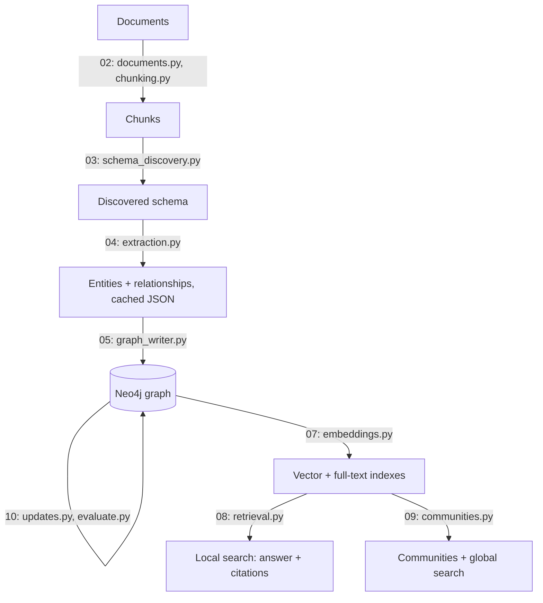
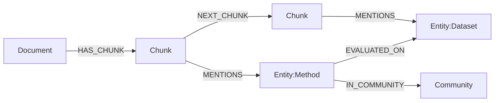

# 01 — Concepts: why Graph RAG, and what we are going to build

## What you will learn
- What RAG (Retrieval-Augmented Generation) is, with a tiny runnable demo using our own embedding model.
- Three concrete kinds of question that plain vector RAG cannot answer well, using our five sample documents.
- What a knowledge graph is, and the exact pipeline this tutorial builds, chapter by chapter and module by module.
- The two layers of our target graph (lexical vs domain) and why they are kept separate.
- The design decisions this tutorial makes, the alternatives, and why — plus how this connects to the Microsoft GraphRAG paper and to alternatives like LightRAG and HippoRAG.

## RAG in one page

RAG (Retrieval-Augmented Generation) is a way to let an LLM (Large Language Model) answer questions about text it was never trained on, without retraining it. The idea, in four steps:

1. **Chunk** — cut every document into small pieces (a paragraph, a few sentences).
2. **Embed** — turn each chunk into an **embedding**: a list of numbers (a vector) produced by a model, such that chunks with similar *meaning* end up as vectors that point in similar directions, even if they use different words.
3. **Nearest neighbours** — when a question comes in, embed the question the same way, and find the chunks whose vectors are closest to it. "Closest" is measured with **cosine similarity**: the cosine of the angle between two vectors. It ranges from -1 (opposite meaning) to 1 (identical meaning); two unrelated pieces of text usually land somewhere in between, e.g. 0.1–0.4.
4. **Prompt** — paste those chunks into the LLM's prompt along with the original question, and ask it to answer using only that context.

No fine-tuning, no retraining — you just give the LLM the right paragraphs at question time.

Why bother with retrieval at all, instead of pasting the whole corpus into the prompt? Two reasons. First, every LLM has a fixed **context window** (the maximum number of tokens — pieces of a word — it can read in one call); a large document collection simply does not fit. Second, even when it *would* fit, LLMs answer more accurately from a short, relevant context than from a long one padded with irrelevant text — a phenomenon sometimes called "lost in the middle." Retrieval is a filter: find the handful of chunks that actually matter, and only send those.

Chunk size is a real trade-off, not a detail to skip past. Smaller chunks (a sentence or two) give retrieval fine-grained precision — you get exactly the sentence you needed — but a fact that spans two sentences can get split across chunks and lose context. Larger chunks (a full section) keep context together but dilute the embedding: a 500-word chunk about five different sub-topics produces one vector that is a blurry average of all five, so a question about any single sub-topic matches it only weakly. Chapter 02 picks a concrete chunk size for our corpus and explains the reasoning; for now, just note that "how you cut the text" already shapes what retrieval can and cannot find, before a graph enters the picture at all.

### A tiny runnable demo

`project/src/graph_rag/demo_concepts.py` embeds three sentences with `graph_rag.llm.embed` (the same function `00_setup.md` introduced, calling our `nomic-embed-text` model over Ollama) and computes cosine similarity in plain Python — no extra dependency needed for three vectors:

```python
def cosine_similarity(a: list[float], b: list[float]) -> float:
    """Cosine of the angle between two vectors: 1.0 = identical direction, 0.0 = unrelated, -1.0 = opposite."""
    dot = sum(x * y for x, y in zip(a, b))
    norm_a = math.sqrt(sum(x * x for x in a))
    norm_b = math.sqrt(sum(y * y for y in b))
    return dot / (norm_a * norm_b)
```

Three sentences: two paraphrase the same idea (GraphRAG's community summarisation), one is about a different system (HippoRAG's retrieval algorithm):

```python
SENTENCES = [
    "GraphRAG partitions the knowledge graph into a hierarchy of communities "
    "and summarizes them bottom-up.",
    "Community detection groups closely related entities into hierarchical "
    "clusters that are summarized from the bottom level up.",
    "HippoRAG runs Personalized PageRank over a knowledge graph seeded by "
    "query entities to perform multi-hop retrieval in a single step.",
]
```

Run it:

```bash
$ just demo-concepts
uv run python -m graph_rag.demo_concepts
[llm.embed] batch=3 0.4s model=nomic-embed-text
embedded 3 sentences, 768 dimensions each

sim(sentence 0, sentence 1) = 0.6696
  [0] GraphRAG partitions the knowledge graph into a hierarchy of communities and summarizes them bottom-up.
  [1] Community detection groups closely related entities into hierarchical clusters that are summarized from the bottom level up.
sim(sentence 0, sentence 2) = 0.6328
  [0] GraphRAG partitions the knowledge graph into a hierarchy of communities and summarizes them bottom-up.
  [2] HippoRAG runs Personalized PageRank over a knowledge graph seeded by query entities to perform multi-hop retrieval in a single step.
sim(sentence 1, sentence 2) = 0.5012
  [1] Community detection groups closely related entities into hierarchical clusters that are summarized from the bottom level up.
  [2] HippoRAG runs Personalized PageRank over a knowledge graph seeded by query entities to perform multi-hop retrieval in a single step.
```

This is one real run of a real model — the exact numbers will drift slightly if you re-run it (embedding models are not perfectly deterministic across hardware/versions), but the *ordering* is stable and is the point: sentence 0 and 1 (two descriptions of the same idea, "community summarisation") score highest at 0.67; sentence 1 and 2 (a paraphrase vs. a different system) score lowest at 0.50. All three numbers sit in a fairly narrow band because all three sentences are short, technical, and about the same broad topic (graphs for retrieval) — with longer, more varied text the gap between "same idea" and "different idea" widens further. This narrow-band effect is itself a preview of why vector similarity alone is a blunt instrument for the harder questions below.

## Where vector-only RAG fails

Vector RAG retrieves chunks that are *textually similar* to the question. Similarity is a proxy for relevance, and it is a good one when the answer to a question sits inside a single chunk written in similar words to the question. It stops being a good proxy the moment the answer requires *connecting* two chunks that do not resemble each other at all, or requires looking at *all* chunks instead of the few most similar ones. That is exactly the right tool for "what does document X say about Y", and exactly the wrong tool for three kinds of question, illustrated with our five sample documents (`project/data/docs/`: digests of the GraphRAG paper, a GraphRAG survey, HippoRAG, GraphRAG-Bench, and a LinkedIn customer-service case study):

**1. Multi-hop / "connect the dots" questions.** *"Which retrieval methods use Personalized PageRank, and how does that relate to the hippocampal memory theory the same method is inspired by?"* The answer needs one chunk that says "HippoRAG uses Personalized PageRank" and a different, textually unrelated chunk that says "HippoRAG is inspired by the hippocampal memory indexing theory". Neither chunk mentions the other's topic, so a query embedding for "PageRank and hippocampal theory" is not obviously close to either chunk alone — vector search has to get lucky, or retrieve so many chunks that the LLM has to do the connecting work anyway. A graph, by contrast, already has an edge from a `HippoRAG` entity node to a `PersonalizedPageRank` node and another to `HippocampalMemoryTheory` — walking two hops answers the question directly.

**2. Aggregation questions.** *"Which methods were evaluated on the same datasets as GraphRAG (podcast transcripts and news articles)?"* This requires scanning *every* document for every dataset mention and grouping by dataset — not finding the single most-similar chunk, but computing a `GROUP BY` over entities that no one chunk contains in full. Vector search returns a ranked list of individually similar chunks; it has no notion of "give me all of them, grouped." A graph query like `MATCH (m:Method)-[:EVALUATED_ON]->(d:Dataset)<-[:EVALUATED_ON]-(m2:Method) RETURN d, collect(m2)` does exactly this aggregation in one step.

**3. Global / "main themes" questions.** *"What are the main themes across all five documents in this tutorial's corpus?"* No single chunk answers this — the answer is a synthesis over the *entire* corpus, and the corpus may be far larger than an LLM's context window in a real deployment. Vector RAG's top-k retrieval is built to find a needle, not to summarise the haystack. This is precisely the "sensemaking" problem the Microsoft GraphRAG paper targets with community detection and map-reduce summarisation (chapter 09).

These three failure modes — connect-the-dots, aggregation, and global summarisation — are the actual reason this tutorial builds a graph instead of stopping at "chunk, embed, retrieve." Chapter 08 revisits the first failure mode directly: it runs the same multi-hop question through plain vector search and through graph-based local search side by side, so you can see the difference in retrieved context, not just take our word for it. Chapter 09 does the same for the third failure mode with community-based global search.

## What a knowledge graph is

A **knowledge graph** stores information as **nodes** (things — a person, a paper, a dataset), each carrying one or more **labels** (its type, e.g. `Method`, `Dataset`) and **properties** (key-value data on the node, e.g. `name`, `description`), connected by **relationships** (edges with their own type and properties, e.g. `EVALUATED_ON {weight: 3}`). Unlike a table in a relational database, there is no fixed schema you must design up front for every possible connection — a new relationship type between two existing nodes is just a new edge, not a new table and a new foreign key. That flexibility is exactly what lets chapter 03 discover the schema from the documents instead of a human designing it first. Neo4j is the graph database we use to store and query this. If you have not used Neo4j or written Cypher (Neo4j's query language) before, read `ai show research_topics/graph_rag/tutorials/neo4j/01_concepts` first — this tutorial assumes that background and will not re-explain nodes, labels, or basic Cypher syntax.

## The Graph RAG pipeline, end to end



- **Load & chunk (chapter 02, `documents.py` / `chunking.py`)** — read each file in `data/docs/` (Markdown, text, or PDF), split it into overlapping chunks small enough for the embedding model and the LLM's context window, and write `(:Document)-[:HAS_CHUNK]->(:Chunk)` and `(:Chunk)-[:NEXT_CHUNK]->(:Chunk)` — the lexical graph, built once per document and independent of what the document is about.
- **Schema discovery (chapter 03, `schema_discovery.py`)** — since we don't know in advance what kinds of entities and relationships live in an arbitrary document, we ask the LLM to look at a sample of chunks and *propose* a schema: entity types (`Method`, `Dataset`, `Organization`, `Metric`, …) and relationship types (`EVALUATED_ON`, `IMPROVES_ON`, `PROPOSED_BY`, …). A human reviews and freezes that proposal before extraction runs at scale.
- **Extraction (chapter 04, `extraction.py`)** — for every chunk, ask the LLM (in JSON mode, against a Pydantic schema built from the frozen schema) which entities and relationships from that chunk match the schema. Output is validated, normalised, and cached to disk under `data/extracted/` so re-running later chapters does not re-pay 10–60 seconds per chunk over the Ollama tunnel.
- **Write the graph (chapter 05, `graph_writer.py`)** — turn the cached JSON into Cypher `MERGE` statements, batched with `UNWIND`, that create `(:Entity:<Type>)` nodes, typed relationships between them, and `(:Chunk)-[:MENTIONS]->(:Entity)` provenance edges back to the lexical graph.
- **Entity resolution (chapter 06, `resolution.py`)** — the same real-world entity often appears under different names across chunks and documents ("GraphRAG" vs "Microsoft's GraphRAG" vs "the GraphRAG approach"). This step normalises names, uses embedding similarity and an LLM-as-judge to detect duplicates, and merges them with APOC while keeping the original names as `aliases`.
- **Embeddings & indexes (chapter 07, `embeddings.py`)** — embed chunk text and entity descriptions, store the vectors as node properties, and build Neo4j vector and full-text indexes so both semantic and keyword search work over the graph.
- **Local search (chapter 08, `retrieval.py`)** — answer a specific question: vector search finds the most relevant chunks/entities, the graph neighbourhood around them is pulled in, and the assembled context (with citations back to source chunks via `MENTIONS`) goes to the LLM. This is directly compared against plain vector RAG on the multi-hop questions above.
- **Communities & global search (chapter 09, `communities.py`)** — run Leiden community detection (via GDS, the Graph Data Science library) to group densely-connected entities, summarise each community with the LLM, and answer global "main themes" questions by map-reduce over community summaries — the technique from the Microsoft GraphRAG paper.
- **Updates & evaluation (chapter 10, `updates.py`, `evaluate.py`)** — add, change, or delete a document without rebuilding the whole graph (deleting relies on the `MENTIONS`/`chunk_ids` provenance described below), plus a small evaluation set, cost/latency notes, and a production checklist.

## Lexical graph vs domain graph

The schema in `index.md` has two layers, and keeping them conceptually separate is one of the more important design choices in this tutorial:



- The **lexical graph** — `Document`, `Chunk`, `HAS_CHUNK`, `NEXT_CHUNK` — mirrors the physical structure of the input text. It is built entirely in chapter 02 and never depends on what the document is *about*; a legal contract and a research paper produce the same kind of lexical graph.
- The **domain graph** — `Entity` nodes with a discovered type label, typed relationships between them, `Community` nodes — is content-dependent: its shape is discovered per-corpus in chapter 03 and populated in chapters 04–09.
- `(:Chunk)-[:MENTIONS]->(:Entity)` is the bridge between the two layers, and it matters for two concrete reasons:
  1. **Citations.** When chapter 08's local search answers a question using entity `X`, walking `MENTIONS` backwards gives the exact chunk (and therefore document) that `X` came from, so the answer can cite its source instead of just asserting a fact.
  2. **Deletion.** When chapter 10 needs to remove a document, it cannot just delete its `Chunk` nodes — some of those chunks are the *only* evidence for entities and relationships that might also be mentioned by other, surviving chunks. Relationships additionally carry a `chunk_ids` property (which chunks support this specific edge); deleting a document means removing the document's chunk ids from every `chunk_ids` list, and only deleting an `Entity` or relationship if its `chunk_ids` becomes empty. Without this provenance, deleting one document would silently corrupt or orphan facts that other documents also support.

## Design decisions this tutorial takes

| Decision                                                          | Alternative                                                      | Why we chose it                                                                                                                                                                                                                                                                                                                                                                                                                                                       |
| ----------------------------------------------------------------- | ---------------------------------------------------------------- | --------------------------------------------------------------------------------------------------------------------------------------------------------------------------------------------------------------------------------------------------------------------------------------------------------------------------------------------------------------------------------------------------------------------------------------------------------------------- |
| Generic `Entity` label + a specific type label (`:Entity:Method`) | Only the specific label (`:Method`)                              | Every domain query can `MATCH (e:Entity)` without knowing the discovered type vocabulary in advance — useful for cross-type operations like embedding all entities or running community detection over "everything," regardless of type.                                                                                                                                                                                                                              |
| LLM-discovered schema (chapter 03)                                | Hand-written schema, or fully open extraction (no schema at all) | A hand-written schema needs a human who already knows the domain — the whole premise here is "documents nobody has read yet." Fully open extraction (whatever labels the LLM feels like inventing per chunk) produces near-duplicate types (`Dataset`, `Data set`, `Benchmark dataset`) that never `MERGE` cleanly. Letting the LLM propose a schema from a sample, then freezing it before bulk extraction, gets consistency without a human pre-reading everything. |
| `MERGE` on `normalized_name`                                      | `MERGE` on raw extracted `name`, or always `CREATE`              | Raw names vary in case and whitespace across chunks ("GraphRAG" vs "graphrag" vs " GraphRAG "); `CREATE` would produce a duplicate node per chunk. Normalising the name first and merging on that gives one node per real-world entity while chapter 06 still handles genuinely different-looking aliases.                                                                                                                                                            |
| Cache extraction output as JSON on disk                           | Re-run extraction every time                                     | Every LLM call costs 10–60 seconds over the SSH tunnel to the GPU box (see `00_setup.md`). Caching means iterating on chapter 05's graph-writing logic, or re-running the whole pipeline after a code change, costs nothing beyond parsing JSON.                                                                                                                                                                                                                      |
| Small open-weight model (`qwen3.8:27b`) served locally via Ollama | A hosted API model (e.g. GPT-4-class)                            | Cost (no per-token billing for a tutorial you might run hundreds of times), privacy (documents never leave infrastructure we control), and reproducibility (a fixed local model version does not change under us). Trade-off: lower raw extraction quality and instruction-following than the largest hosted models — mitigated by `temperature: 0`, JSON-schema-constrained output, and the retry-once logic in `chat_json` (`00_setup.md`).                         |

Two of these decisions interact directly with each other. Because the schema is LLM-discovered rather than fixed, extraction (chapter 04) cannot assume it knows every label ahead of time — it has to read the frozen schema file at runtime and build its Pydantic model dynamically. And because `MERGE` happens on `normalized_name`, normalisation has to be a deterministic, well-tested pure function (lower-case, strip whitespace, collapse punctuation) rather than another LLM call — an LLM asked "normalise this name" would itself be non-deterministic, defeating the point of a stable merge key.

## Relation to the Microsoft GraphRAG paper, and alternatives

This tutorial's design is a direct, simplified implementation of the ideas in Microsoft's GraphRAG paper, *From Local to Global: A Graph RAG Approach to Query-Focused Summarization* (`ai show research_topics/graph_rag/ArxivGraphRAGLocalToGlobal`). That paper's central distinction — **local search** (a specific fact-retrieval question, answered by walking the graph neighbourhood around a few matched entities) vs **global search** (a corpus-wide sensemaking question, answered by map-reduce over community summaries) — is exactly the split between our chapter 08 (local search) and chapter 09 (communities and global search). The paper's pipeline (chunk → LLM entity/relationship extraction → knowledge graph → Leiden communities → bottom-up community summaries → map-reduce query answering) is the same six-step shape as this tutorial's chapters 02–09, scaled down to a five-document corpus instead of a million-token dataset, and using a local open-weight model instead of GPT-4.

One difference worth flagging: the paper's community summaries are generated hierarchically at multiple levels (fine-grained leaf communities up to coarse top-level ones), and a real deployment picks which level to summarise from depending on query breadth. Chapter 09 covers Leiden community detection and summarisation but keeps the hierarchy shallow, since our corpus is five documents rather than a million-token dataset — the concept transfers, the scale does not need to.

Two well-known alternatives take different approaches worth knowing about, without a deep dive here: **LightRAG** simplifies extraction into a lighter-weight dual-level (entity + relationship) retrieval scheme designed to be cheaper to build and update than full GraphRAG, trading some of the community/global-summarisation power for speed and lower indexing cost. **HippoRAG** (`ai show research_topics/graph_rag/ArxivHippoRAG`) takes a different retrieval mechanism entirely: instead of vector search over chunks or map-reduce over communities, it seeds Personalized PageRank (a graph algorithm that scores nodes by how reachable they are from a set of starting nodes) from the entities mentioned in the query and lets that propagate across the whole graph in a single step — well suited to exactly the multi-hop "connect the dots" questions in the second section of this chapter, and one of the two paraphrased-vs-different-topic sentences in this chapter's demo was drawn from it.

## Glossary

| Term | Meaning |
|---|---|
| RAG | Retrieval-Augmented Generation: answer questions by retrieving relevant text and handing it to an LLM, without retraining the model. |
| LLM | Large Language Model — a model like the `qwen3.8:27b` chat model this tutorial uses. |
| Chunk | A small piece of a document (a paragraph or a few sentences), the unit RAG retrieves and embeds. |
| Embedding | A vector (list of numbers) produced by a model such that similar meanings produce similar vectors. |
| Cosine similarity | A measure of how close two vectors point in the same direction; ranges from -1 to 1. |
| Vector index | A database index built to quickly find the nearest embedding vectors to a query vector. |
| Knowledge graph | Data stored as nodes (things) and relationships (connections between things), each with labels and properties. |
| Node | A single entry in a graph (e.g. one entity or one chunk). |
| Label | A node's type tag (e.g. `Entity`, `Method`, `Chunk`); a node can have more than one. |
| Relationship | A directed, typed edge between two nodes, which can itself carry properties. |
| Property | A key-value field stored on a node or relationship. |
| Entity | A "thing" extracted from text — a person, method, dataset, organization, etc. |
| Entity resolution | Merging nodes that refer to the same real-world entity but were extracted under different names. |
| Provenance | A record of which chunk(s) support a given entity or relationship — here, `MENTIONS` edges and `chunk_ids` properties. |
| Lexical graph | The layer of the graph that mirrors document/chunk structure, independent of content. |
| Domain graph | The layer of the graph built from extracted entities and relationships, specific to the corpus. |
| Community | A cluster of densely-connected entities, found by an algorithm like Leiden. |
| Local search | Answering a specific question via the graph neighbourhood of a few matched entities. |
| Global search | Answering a corpus-wide question via map-reduce over community summaries. |
| Personalized PageRank | A graph algorithm that scores every node by reachability from a chosen set of seed nodes; used by HippoRAG for retrieval. |
| APOC | Awesome Procedures On Cypher — a Neo4j plugin adding extra Cypher functions/procedures. |
| GDS | Graph Data Science library — a Neo4j plugin providing algorithms like Leiden community detection. |

## Key takeaways
- Plain vector RAG (chunk, embed, retrieve nearest neighbours, prompt) works well for "what does the text say about X" but breaks down on multi-hop, aggregation, and global "main themes" questions — because those need connections *between* chunks, not just similarity to *one* chunk.
- This tutorial's pipeline builds two graph layers: a content-independent **lexical graph** (documents and chunks) built in chapter 02, and a content-dependent **domain graph** (entities and relationships) discovered and populated in chapters 03–09, bridged by `MENTIONS` provenance that both chapter 08's citations and chapter 10's deletion logic depend on.
- Every design choice here (generic `Entity` label, LLM-discovered schema, `MERGE` on `normalized_name`, caching, a small local model) trades some quality or generality for consistency, cost, and reproducibility on an unknown, ungoverned document corpus.
- The pipeline mirrors the Microsoft GraphRAG paper's local-search/global-search split at a scale this tutorial's five-document corpus and single Ollama-served model can actually run.

Next: [02_documents_and_chunks.md](02_documents_and_chunks.md) — loading the sample documents, chunking them, and writing the lexical graph (`Document`, `Chunk`, `HAS_CHUNK`, `NEXT_CHUNK`).
