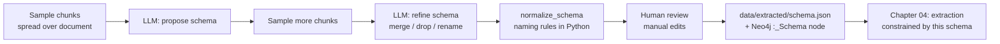

# 03 — Schema discovery: let the LLM propose a graph, then freeze it

## What you will learn
- Three strategies for deciding what a knowledge graph's labels and relationship types should be, and why this tutorial picks "LLM-proposed, then human-frozen".
- Why a **spread sample** of chunks (evenly spaced over the whole document) beats a "first N" sample when proposing a schema.
- The exact prompts used to propose and then refine a schema, and the Pydantic-to-JSON-schema trick that forces the LLM's reply into a shape Python can load directly.
- The real schema this tutorial's paper produced, and two manual edits made during human review.
- How naming rules are enforced in Python (not trusted to the LLM), how the schema is validated, and why it is also stored inside the graph itself as a `_Schema` node.

## The problem: we do not know what is in this document yet

Chapter 02 built the **lexical graph** — `Document` and `Chunk` nodes that mirror the PDF's physical structure, independent of what it is actually about (see `02_documents_and_chunks.md`). But the whole point of Graph RAG (Retrieval-Augmented Generation on a graph) is the **domain graph**: nodes like `Method` or `Dataset`, connected by relationships like `EVALUATED_ON` (see `01_concepts.md`). Before any of that can be extracted, something has to answer a basic question: *what kinds of things does this document talk about, and what does it call the relationships between them?*

We are handed one 41-page academic PDF we have never read closely. Three ways to answer that question:

| Strategy                                     | How it works                                                                                                                        | Pros                                                                                                              | Cons                                                                                                                                                                                                                                                             |
| -------------------------------------------- | ----------------------------------------------------------------------------------------------------------------------------------- | ----------------------------------------------------------------------------------------------------------------- | ---------------------------------------------------------------------------------------------------------------------------------------------------------------------------------------------------------------------------------------------------------------- |
| **Hand-written closed schema**               | A human reads (some of) the document and writes down entity/relationship types before extraction starts                             | Precise, matches exactly what you plan to query later                                                             | Only works if a human already understands the document; does not scale to "drop any file in and go"; misses types the human didn't think of                                                                                                                      |
| **Fully open extraction**                    | Skip a schema entirely — ask the LLM to extract "whatever entities and relationships it finds" per chunk, with free-text type names | Zero upfront cost, never misses a type                                                                            | Produces `"GraphRAG"`, `"Graph RAG"`, `"graph-based RAG"` as three different labels; `MATCH (m:Method)` in Cypher becomes useless because nothing is consistently labelled `Method`; every chunk's extraction is independent so labels drift across the document |
| **LLM-proposed, then frozen (this chapter)** | Sample the document, ask the LLM to *propose* a schema (like a closed schema would have), review it once, freeze it to a file       | Consistent labels for querying, scales to an unseen document, review is a few minutes instead of reading 41 pages | Proposal quality depends on the sample; needs an explicit review step (this chapter does it once, by hand)                                                                                                                                                       |

A schema matters because Neo4j queries are only convenient when labels are consistent. `MATCH (m:Method)-[:EVALUATED_ON]->(d:Dataset)` only works if every method in the graph really is labelled `Method` and every such relationship really is called `EVALUATED_ON` — that consistency is exactly what "fully open extraction" cannot guarantee and a frozen schema can. Chapter 04 uses this chapter's frozen schema to constrain per-chunk extraction so every method mention lands under the same label.



## Sampling: why "spread" beats "first N"

A 41-page paper does not talk about the same things on every page: the introduction motivates the problem, the middle sections describe methods, a results section lists datasets and metrics, and the conclusion summarises. If we sample the **first** 12 chunks, we would only see the introduction and related-work sections — the proposed schema would miss `Dataset` and `Metric` entirely, because those concepts only show up from roughly the middle of the document onward.

```python
def sample_chunks(n: int = 12, strategy: str = "spread") -> list[dict]:
    rows = run("MATCH (c:Chunk) RETURN c.index AS index, c.text AS text ORDER BY c.index")
    if not rows:
        return []
    if strategy != "spread" or len(rows) <= n:
        return rows[:n]
    step = len(rows) / n
    indices = sorted({int(i * step) for i in range(n)})
    return [rows[i] for i in indices]
```

The Cypher does the ordering (`ORDER BY c.index`); the striding (`step = len(rows) / n`, then `int(i * step)`) is plain Python — no need for a second Cypher round trip. On this tutorial's real 146-chunk document:

```python
>>> from graph_rag.schema_discovery import sample_chunks
>>> [c["index"] for c in sample_chunks(n=12, strategy="spread")]
[0, 12, 24, 36, 48, 60, 73, 85, 97, 109, 121, 133]
```

versus what a naive "first N" sample would give:

```python
>>> # first_n = rows[:12]
[0, 1, 2, 3, 4, 5, 6, 7, 8, 9, 10, 11]
```

The spread sample covers chunk 133 out of 146 — deep into the results/discussion — while "first N" never gets past chunk 11, still inside the introduction.

## The Pydantic models

```python
class PropertySpec(BaseModel):
    name: str
    type: Literal["string", "integer", "float", "date", "boolean", "list[string]"]
    description: str

class EntityType(BaseModel):
    name: str = Field(description="PascalCase, e.g. Method, Dataset")
    description: str
    properties: list[PropertySpec] = Field(default_factory=list)
    examples: list[str] = Field(default_factory=list, description="Real examples seen in the text")

class RelationshipType(BaseModel):
    name: str = Field(description="UPPER_SNAKE_CASE, e.g. EVALUATED_ON")
    description: str
    source_types: list[str]
    target_types: list[str]
    properties: list[PropertySpec] = Field(default_factory=list)

class GraphSchema(BaseModel):
    entity_types: list[EntityType]
    relationship_types: list[RelationshipType]
```

`source_types`/`target_types` on `RelationshipType` are what let `validate_schema` later catch a "dangling" relationship type — one that claims to connect to an entity type that doesn't exist in the same schema.

## The prompt, and the Pydantic-to-JSON-schema trick

`llm.chat_json(messages, schema)` (from chapter 00, reused unchanged) passes `schema.model_json_schema()` — Pydantic's built-in JSON-schema exporter — as Ollama's `format` parameter, so the model is constrained token-by-token to only emit JSON matching `GraphSchema`'s shape, then the response is parsed straight back into a `GraphSchema` instance with `schema.model_validate_json(content)`. No manual JSON parsing, no "please reply in JSON" prompt-engineering, and no risk of the model wrapping the answer in prose. `chat_json` also sets `think: false` (this model, `qwen3.8:27b`, supports a "thinking" mode that would otherwise spend tokens reasoning out loud before answering — irrelevant and slow for a structured task) and `temperature: 0` (schema proposal should be as deterministic and literal as possible, not creative).

The propose prompt:

```text
You are a knowledge-graph architect. Below are sample passages taken from one document, spread
evenly across its whole length. Propose a graph schema that would let someone answer questions
about these texts.

Rules:
- Propose at most 12 entity types and at most 15 relationship types.
- Entity type names must be PascalCase (e.g. Method, Dataset, Organization).
- Relationship type names must be UPPER_SNAKE_CASE (e.g. EVALUATED_ON, PROPOSED_BY).
- Do not propose generic types like "Thing", "Concept", "Entity" or "Item" — every type must be
specific enough that a reader immediately knows what belongs in it.
- Every relationship type must declare which entity type(s) can be its source and target.
- Give each entity type 2-4 relevant properties (beyond name/description) and 1-3 real examples
drawn from the passages.
- Only propose types that are actually reflected in the passages below.

Passages:
{passages}
```

```python
def propose_schema(chunks: list[dict]) -> GraphSchema:
    prompt = _PROPOSE_PROMPT.format(passages=_format_passages(chunks))
    return chat_json([{"role": "user", "content": prompt}], GraphSchema)
```

### Refining against a second sample

One sample of 12 chunks can still miss a type or invent near-duplicates (e.g. proposing both `Model` and `Method`). `refine_schema` takes the draft schema plus a **second**, different spread sample and asks the LLM to merge, rename or drop types:

```text
You proposed the following draft graph schema from a first sample of a document. Here is a
second, different sample of passages from the same document. Refine the schema:
- Merge or rename entity/relationship types that overlap or duplicate each other.
- Drop any type that is not clearly supported by evidence in the samples (first or second).
- Add a type only if the new passages clearly need it and no existing type fits.
- Keep names PascalCase for entity types and UPPER_SNAKE_CASE for relationship types.
- Output the complete, revised schema (not just the changes).

Draft schema (JSON):
{draft}

New passages:
{passages}
```

```python
def refine_schema(schema: GraphSchema, more_chunks: list[dict]) -> GraphSchema:
    prompt = _REFINE_PROMPT.format(
        draft=schema.model_dump_json(indent=2),
        passages=_format_passages(more_chunks),
    )
    return chat_json([{"role": "user", "content": prompt}], GraphSchema)
```

## Naming rules and deduplication, enforced in Python

Even with explicit instructions, a local model occasionally emits `"knowledge_graph"` or `"Knowledge Graph"` instead of `KnowledgeGraph`. Rather than re-prompting until it's right, `normalize_schema` fixes it deterministically:

```python
def normalize_schema(schema: GraphSchema) -> GraphSchema:
    seen_entities: dict[str, EntityType] = {}
    for entity in schema.entity_types:
        name = entity.name if _PASCAL_RE.match(entity.name) else _to_pascal_case(entity.name)
        if name not in seen_entities:
            seen_entities[name] = entity.model_copy(update={"name": name})

    valid_types = set(seen_entities)
    seen_relationships: dict[str, RelationshipType] = {}
    for rel in schema.relationship_types:
        name = rel.name if _UPPER_SNAKE_RE.match(rel.name) else _to_upper_snake_case(rel.name)
        source_types = [t for t in rel.source_types if t in valid_types]
        target_types = [t for t in rel.target_types if t in valid_types]
        if not source_types or not target_types:
            continue
        if name not in seen_relationships:
            seen_relationships[name] = rel.model_copy(
                update={"name": name, "source_types": source_types, "target_types": target_types}
            )
    return GraphSchema(entity_types=list(seen_entities.values()), relationship_types=list(seen_relationships.values()))
```

This also drops a relationship type outright if, after normalisation, it has no valid source or target type left — better to lose one relationship type than to freeze a schema with a dangling reference chapter 04 would trip over.

`validate_schema` then checks the frozen result and returns a list of human-readable issues (empty means valid): duplicate names, non-PascalCase entity names, non-UPPER_SNAKE_CASE relationship names, invalid property `type` values, and any relationship type whose `source_types`/`target_types` reference an entity type that does not exist.

## The real run

```bash
$ just schema-propose
uv run python -m graph_rag.schema_discovery propose --samples 12
Proposing schema from 12 sampled chunks...
[llm.chat_json] attempt=1 49.8s model=qwen3.8:27b
Refining schema against 12 more sampled chunks...
[llm.chat_json] attempt=1 38.5s model=qwen3.8:27b
Wrote 12 entity types, 15 relationship types -> data/extracted/schema.json
Stored schema as (:_Schema {version: 1}) in the graph.
```

Two LLM calls, ~90 seconds total (the 10-60s-per-call latency from `00_setup.md`, this is one real run — LLM output is not deterministic across re-runs, though `temperature: 0` keeps it close). The proposal, trimmed to two entity types and three relationship types:

```json
{
  "entity_types": [
    {
      "name": "Method",
      "description": "A specific algorithm, framework, or system proposed for GraphRAG or related tasks (e.g., retrieval, generation, or LLM integration).",
      "properties": [
        {"name": "category", "type": "string", "description": "The primary function of the method (e.g., Retrieval, Generation, Indexing)."},
        {"name": "year", "type": "integer", "description": "The year the method was proposed or published."},
        {"name": "technique", "type": "string", "description": "Key technical components (e.g., GNN, LLM, Non-parametric)."}
      ],
      "examples": ["ENGINE", "OpenCSR", "GNN-RAG", "HamQA", "DALK", "StructGPT", "KG-Agent", "UniKGQA"]
    },
    {
      "name": "Model",
      "description": "A specific neural network architecture or pre-trained model used within the GraphRAG pipeline.",
      "properties": [
        {"name": "architecture", "type": "string", "description": "The underlying architecture (e.g., Transformer, GNN)."},
        {"name": "role", "type": "string", "description": "Function in the pipeline (e.g., Generator, Retriever, Encoder)."}
      ],
      "examples": ["GCN", "GAT", "GraphSAGE", "Llama 2", "Graph Transformers"]
    }
  ],
  "relationship_types": [
    {"name": "PROPOSED_BY", "source_types": ["Method", "Model"], "target_types": ["Person", "Organization"], "properties": []},
    {"name": "EMPLOYS_MODEL", "source_types": ["Method"], "target_types": ["Model"], "properties": []},
    {"name": "EVALUATED_ON", "source_types": ["Method"], "target_types": ["Dataset"], "properties": []}
  ]
}
```

Twelve entity types came out of the refine step: `Method`, `Model`, `KnowledgeGraph`, `Dataset`, `Task`, `Metric`, `Organization`, `Person`, `Conference`, `Paper`, `Technique`, `Domain` — plus 15 relationship types including `PROPOSED_BY`, `EVALUATED_ON`, `IMPROVES_UPON`, `USES_KNOWLEDGE_GRAPH`, `AUTHORED_BY`, `CITES`.

## Human review: two manual edits

The point of freezing a schema is that a human looks at it once before it locks in. Two overlaps stood out in the raw proposal above:

1. **`Model` overlaps with `Method`.** The survey uses "GNN" and "Llama 2" both as components *of* a method and, in other passages, as methods in their own right (`"GNN-RAG"` is itself a `Method` whose name literally contains a model name). Keeping them separate produced ambiguous instances — is `GNN-RAG` a `Method` or a `Model`? Merged `Model` into `Method` (folded its examples in, extended the description, and removed the now-redundant `EMPLOYS_MODEL` relationship type).
2. **`Conference` overlaps with `Organization`.** A conference (`"ACL 2024"`) is, for this graph's purposes, just another kind of organization associated with a paper — `Organization.type` already had room for a value like `"Conference"` next to `"University"` / `"Tech Company"`. Merged `Conference` into `Organization` (folded its examples in) and repointed `PUBLISHED_IN` (`Paper -> Conference`) to `Paper -> Organization`.

After both merges: **10 entity types**, **14 relationship types**. This is exactly the kind of judgment call `refine_schema`'s automated pass could approximate but not fully replace — an LLM merging `Model` into `Method` on its own risked also merging things that should stay separate (e.g. `Task` and `Method` also co-occur constantly); a human spent two minutes confirming these two specific merges made sense and left the rest alone.

```bash
$ just schema-validate
uv run python -m graph_rag.schema_discovery validate
OK: 10 entity types, 14 relationship types, no issues.
```

The final entity types: `Method`, `KnowledgeGraph`, `Dataset`, `Task`, `Metric`, `Organization`, `Person`, `Paper`, `Technique`, `Domain`.
The final relationship types: `PROPOSED_BY`, `USES_KNOWLEDGE_GRAPH`, `EVALUATED_ON`, `SOLVES_TASK`, `MEASURED_BY`, `AFFILIATED_WITH`, `PUBLISHED_IN`, `AUTHORED_BY`, `APPLIES_TECHNIQUE`, `BELONGS_TO_DOMAIN`, `CITES`, `DERIVED_FROM`, `IMPROVES_UPON`, `PART_OF_PIPELINE`.

`just schema-show` renders both as tables (`rich`, reused from earlier chapters' terminal output style):

```bash
$ just schema-show
                                  Entity types
┏━━━━━━━━━━━━━━━━┳━━━━━━━━━━━━━━━━━━━━┳━━━━━━━━━━━━━━━━━━━━┳━━━━━━━━━━━━━━━━━━━┓
┃ Name           ┃ Description        ┃ Properties         ┃ Examples          ┃
┡━━━━━━━━━━━━━━━━╇━━━━━━━━━━━━━━━━━━━━╇━━━━━━━━━━━━━━━━━━━━╇━━━━━━━━━━━━━━━━━━━┩
│ Method         │ A specific         │ category, year,    │ ENGINE, OpenCSR,  │
│                │ algorithm,         │ technique          │ GNN-RAG, ...      │
│                │ framework, or...   │                    │ GCN, GAT, ...     │
│ KnowledgeGraph │ A structured       │ domain,            │ ConceptNet5,      │
│                │ database of...     │ structure_type,... │ ATOMIC, ...       │
...
```

## Storing the schema in the graph itself

The frozen schema is written to `data/extracted/schema.json` (committed, so chapter 04 and re-runs don't need another LLM call) — and also written into Neo4j:

```python
def store_schema_in_graph(schema: GraphSchema, version: int = 1) -> None:
    run(
        "MERGE (s:_Schema {version: $version}) SET s.json = $json, s.updated_at = datetime()",
        version=version,
        json=schema.model_dump_json(),
    )
```

Why bother, if the file already has it? Because the graph should be able to **document itself**. Anyone exploring this database cold with plain Cypher — the techniques in `knowledge/research_topics/graph_rag/tutorials/neo4j/001_explore_database.md`, e.g. `CALL db.labels()` or `CALL db.relationshipTypes()` — will see labels and relationship types show up with no explanation of what they mean or which endpoints are valid. A `(:_Schema {version, json})` node right there in the graph means `MATCH (s:_Schema) RETURN s.json` answers "what is this graph supposed to look like" without leaving the database or trusting that the on-disk file and the graph haven't drifted apart. The leading underscore in `_Schema` keeps it visually out of the way of real domain labels (`CALL db.labels()` sorts it away from `Method`, `Dataset`, etc.), and `MERGE` on `{version: 1}` means re-running `schema-propose` updates this one node in place rather than piling up history — until schema versioning (below) makes multiple versions meaningful.

```cypher
MATCH (s:_Schema) RETURN s.version AS version, size(s.json) AS json_size
```
```
version, json_size
1, 8311
```

## What happens when a later document needs a new type

This tutorial's pipeline processes one document (chapter 00's `graphrag_survey_2408.08921.pdf`) and, in chapter 10, a second one to demonstrate updates. If that second document mentioned a genuinely new kind of thing — say, `Benchmark` as distinct from `Dataset` — freezing the schema once here does not mean it can never change. The `version` field on `_Schema` exists for exactly this: chapter 10 previews **schema versioning** — re-running `schema-propose` (or a variant scoped to just the new document's chunks), reviewing the diff against `version: 1`, and either extending the existing schema in place or writing a `version: 2` node and migrating extraction. That is out of scope here; this chapter only needed the field to exist.

## Key takeaways
- A knowledge graph is only queryable if its labels are consistent — `MATCH (m:Method)` only works if the extraction step always uses exactly `Method`, never `"method"` or `"Methods"`.
- Sampling **evenly across** the whole document (not just the first N chunks) is what lets the schema proposal see the introduction, methods, results and conclusion sections instead of only the introduction.
- `chat_json` + `model.model_json_schema()` constrains the LLM's output to a shape Pydantic can parse directly — no prompt-engineered "reply in JSON", no manual parsing.
- A two-pass propose → refine loop catches some duplication automatically, but a human review pass (here: two manual merges, `Model` into `Method` and `Conference` into `Organization`) still catches overlaps an LLM would not confidently resolve on its own.
- Naming rules (`PascalCase` / `UPPER_SNAKE_CASE`) and referential integrity (no relationship type pointing at an entity type that doesn't exist) are enforced deterministically in Python, not left to the LLM to get right.
- The schema lives in two places on purpose: `data/extracted/schema.json` (what chapter 04 loads to constrain extraction) and a `(:_Schema)` node in the graph itself (so the graph documents itself for anyone exploring it with plain Cypher).

Next: [04_extraction.md](04_extraction.md) — using this frozen schema to extract entities and relationships from every chunk, with structured JSON output, validation, normalisation and caching.
