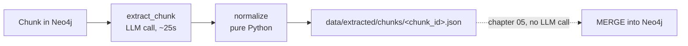

# 04 — Extraction: turning chunks into entities and relationships

## What you will learn
- Why constraining an LLM (Large Language Model) to a JSON schema beats asking it to "please answer in JSON", and how `chat_json` does that with Ollama's `format` parameter.
- The Pydantic (a Python library for validating data shapes) models this chapter extracts into, and what each field — especially `weight`, `properties` and `chunk_id` — is actually for.
- The full extraction prompt, next to a real chunk and its real extraction, side by side.
- The normalisation rules that turn raw LLM output into something safe to `MERGE` into a graph later, and why they matter now rather than in chapter 05.
- The cache design (one file per chunk, `prompt_version`, `--force`), real cost/latency numbers from running this on the whole 41-page PDF, and how to read the "Other" ratio as a schema health signal.

## The problem: reading is now the LLM's job, structure is ours

Chapter 03 froze a graph schema: 10 entity types (`Method`, `Dataset`, `Organization`, ...) and 14 relationship types (`EVALUATED_ON`, `PROPOSED_BY`, ...), each declaring valid endpoints (see `03_schema_discovery.md`). This chapter's job is narrower and more mechanical: for every one of the 146 chunks already sitting in Neo4j (see `02_documents_and_chunks.md`), ask the LLM to read the chunk and return the entities and relationships it contains, **using only the frozen schema's types**.

This chapter deliberately does **not** touch Neo4j for writing. It reads chunks from the graph, but every extraction result is written to a JSON file on disk (`data/extracted/chunks/<chunk_id>.json`) — never to a graph node. That separation is the single most important design decision here:



If chapter 05's Cypher has a bug, or we decide to change a `MERGE` key, or we want to re-run the graph-writing step ten times while debugging — none of that should cost another 25-second LLM call per chunk. The LLM call is the expensive, slow, non-deterministic part of this pipeline; everything after it (validation, normalisation, graph writes) is cheap, deterministic Python that should be free to re-run as often as we like.

## The Pydantic models

```python
class ExtractedEntity(BaseModel):
    name: str = Field(description="Exact name as it appears in the text")
    type: str = Field(description="One of the allowed entity types, or 'Other'")
    description: str = Field(description="One sentence, grounded in this chunk")
    properties: dict[str, PropertyValue] = Field(default_factory=dict)
    normalized_name: str = Field(default="", description="Filled in by normalize(), not by the LLM")

class ExtractedRelationship(BaseModel):
    source: str = Field(description="Must match an entity name extracted from this chunk")
    target: str = Field(description="Must match an entity name extracted from this chunk")
    type: str = Field(description="One of the allowed relationship types, UPPER_SNAKE_CASE")
    description: str = Field(description="One sentence, grounded in this chunk")
    weight: float = Field(ge=0, le=1, description="How strongly the text supports this relationship")
    properties: dict[str, PropertyValue] = Field(default_factory=dict)

class ChunkExtraction(BaseModel):
    chunk_id: str
    entities: list[ExtractedEntity]
    relationships: list[ExtractedRelationship]
    model: str
    prompt_version: str
    extracted_at: str
```

What each field is actually for:

- **`weight` (0-1 float)** is not a confidence score about whether the *entities* exist — it is how strongly *this specific sentence* supports the *relationship*. "GNN-RAG achieves state-of-the-art results on WebQSP" supports `EVALUATED_ON` with `weight: 1.0`; a passing mention in a related-work paragraph that only implies a connection might get `weight: 0.4`. Chapter 05 can use this to decide whether a weak relationship is worth writing at all, and chapter 08's retrieval can rank graph neighbours by it.
- **`properties` (open dict)** holds anything schema-worthy that doesn't need its own graph relationship — a `Method`'s `category`, a `Person`'s inferred `affiliation`. Keeping this a free-form dict (rather than one Pydantic field per possible property) means the same `ExtractedEntity` model works for all 10 entity types, even though `03_schema_discovery.md`'s frozen schema gives each type a different property list.
- **`chunk_id` (provenance)** is what turns "the graph says X relates to Y" into "the graph says X relates to Y, and here is the exact sentence that justifies it." Chapter 05 writes `chunk_id` onto the `MENTIONS` relationship from `Chunk` to `Entity`, so every fact in the graph is traceable back to source text — essential for trusting an LLM-built graph instead of taking it on faith.
- **`normalized_name`** is *not* filled in by the LLM at all (see below) — it is the join key chapter 05 will `MERGE` entities on, so "GNN-RAG" mentioned in chunk 12 and "the GNN-RAG model" mentioned in chunk 40 collapse into one node instead of two.

### A narrower schema for the LLM, a wider one for us

`chat_json` (from `00_setup.md`, reused unchanged) passes a Pydantic model's `model_json_schema()` as Ollama's `format` parameter — the same trick chapter 03 used for the schema-proposal step. But `ChunkExtraction` above has fields (`chunk_id`, `model`, `prompt_version`, `extracted_at`) that the LLM cannot possibly know and should never be asked to fill in — a small model asked to invent a `chunk_id` will happily invent a wrong one. So the actual JSON schema handed to the LLM is narrower:

```python
class _LLMExtraction(BaseModel):
    entities: list[ExtractedEntity]
    relationships: list[ExtractedRelationship]
```

`extract_chunk` calls `chat_json(messages, _LLMExtraction)`, then wraps the result into a full `ChunkExtraction` with `chunk_id`, `model` and `extracted_at` filled in from things we already know — the LLM never sees those fields exist.

## The prompt

The system prompt lists every allowed entity type (with its description and properties) and every allowed relationship type (with its allowed source/target types), states the extraction rules, and includes one few-shot example built from a real chunk of this same document:

```python
def build_prompt(schema: GraphSchema, chunk_text: str) -> list[dict]:
    system = _SYSTEM_TEMPLATE.format(
        entity_types=_format_entity_types(schema),
        relationship_types=_format_relationship_types(schema),
        few_shot_chunk=_FEW_SHOT_CHUNK,
        few_shot_output=_FEW_SHOT_OUTPUT,
    )
    return [
        {"role": "system", "content": system},
        {"role": "user", "content": f"Passage:\n{chunk_text}"},
    ]
```

The rules embedded in `_SYSTEM_TEMPLATE`:

```text
Rules:
1. Use the exact name for an entity as it appears in the text (do not translate, expand
abbreviations, or rephrase).
2. Use ONE canonical name per real-world entity: if the same thing is mentioned twice in this
passage (e.g. once in full, once abbreviated), pick a single name and reuse it for every
mention, and reflect that in the relationships too.
3. Only create a relationship between two entities you extracted in this same passage. Never
reference an entity that is not in your `entities` list.
4. Prefer one of the allowed entity types above. If nothing fits, use type "Other" -- we track
how often "Other" is used as a signal that the schema needs a new type.
5. Relationship `type` must be one of the allowed relationship types above, in UPPER_SNAKE_CASE.
6. `weight` reflects how strongly the passage itself supports the relationship (1.0 = stated
explicitly, 0.3 = weakly implied). Do not invent relationships the text does not support.
7. If the passage contains no clear entities, return empty lists. Do not pad with guesses.
```

Rule 4 is the escape hatch that keeps the closed schema from ch. 03 from silently dropping real information: if the text talks about something genuinely outside the 10 frozen types, the LLM tags it `Other` instead of forcing it (badly) into an existing type or hallucinating relationships to make it fit. We count `Other` across the whole run — see "the Other ratio" below.

### Real chunk, real extraction, side by side

Chunk 0 (the paper's title block and abstract opening):

```text
Graph Retrieval-Augmented Generation: A Survey
BOCI PENG∗, School of Intelligence Science and Technology, Peking University, China
YUN ZHU∗, College of Computer Science and Technology, Zhejiang University, China
YONGCHAO LIU, Ant Group, China
XIAOHE BO, Gaoling School of Artificial Intelligence, Renmin University of China, China
HAIZHOU SHI, Rutgers University, US
CHUNTAO HONG, Ant Group, China
YAN ZHANG†, School of Intelligence Science and Technology, Peking University, China
SILIANG TANG, College of Computer Science and Technology, Zhejiang University, China
Recently, Retrieval-Augmented Generation (RAG) has achieved remarkable success in addressing
the challenges of Large Language Models (LLMs) without necessitating retraining. By referencing
an external knowledge base, RAG refines LLM outputs, effectively mitigating issues such as
"hallucination", lack of domain-specific knowledge, and outdated information. However, the
complex structure of relationships among different entities in databases presents challenges
for RAG systems. In response, GraphRAG leverages structural information across entities to
enable more precise and comprehensive retrieval, capturing relational knowledge and facilitating
more accurate, context-aware responses.
```

Its real extraction (`data/extracted/chunks/<sha256>:0.json`, trimmed to a few entities/relationships):

```json
{
  "chunk_id": "b742937d...bfced:0",
  "entities": [
    {"name": "Boci Peng", "type": "Person", "description": "Author of the survey, affiliated with Peking University.",
     "properties": {"affiliation": "Peking University"}, "normalized_name": "boci peng"},
    {"name": "Peking University", "type": "Organization", "description": "Academic institution affiliated with authors Boci Peng and Yan Zhang.",
     "properties": {"type": "University", "location": "China"}, "normalized_name": "peking university"},
    {"name": "GNN-RAG", "type": "Method", "description": "A method combining a graph neural network with an LLM to answer questions over knowledge graphs.",
     "properties": {"technique": "GNN"}, "normalized_name": "gnn-rag"}
  ],
  "relationships": [
    {"source": "boci peng", "target": "peking university", "type": "AFFILIATED_WITH",
     "description": "Boci Peng is affiliated with Peking University.", "weight": 0.95, "properties": {}}
  ],
  "model": "qwen3.8:27b",
  "prompt_version": "v1",
  "extracted_at": "2026-08-29T09:31:04+00:00"
}
```

(LLM output is not deterministic — this is one real run at `temperature: 0`, which keeps repeated runs close but not byte-identical.) Note `relationships[].source`/`target` are already `normalized_name` values (`"boci peng"`, not `"Boci Peng"`) — `normalize()` rewrites them, explained next.

## Normalisation: why it matters *before* chapter 05, not during

`extract_chunk` never returns the LLM's raw JSON as-is. It always runs it through `normalize()` first:

```python
def normalize(extraction: _LLMExtraction, schema: GraphSchema, chunk_id: str) -> ChunkExtraction:
    schema_types = {e.name.casefold(): e.name for e in schema.entity_types}
    entities: list[ExtractedEntity] = []
    valid_norm_names: set[str] = set()
    for entity in extraction.entities:
        name = _WHITESPACE_RE.sub(" ", entity.name.strip())
        if not name:
            continue
        norm = normalized_name(name)
        entity_type = schema_types.get(entity.type.strip().casefold(), "Other")
        entities.append(entity.model_copy(update={
            "name": name, "type": entity_type,
            "description": _WHITESPACE_RE.sub(" ", entity.description.strip()),
            "normalized_name": norm,
        }))
        valid_norm_names.add(norm)

    relationships: list[ExtractedRelationship] = []
    dropped = 0
    for rel in extraction.relationships:
        source_norm, target_norm = normalized_name(rel.source), normalized_name(rel.target)
        if source_norm not in valid_norm_names or target_norm not in valid_norm_names:
            dropped += 1
            continue
        relationships.append(rel.model_copy(update={
            "source": source_norm, "target": target_norm,
            "type": _to_upper_snake_case(rel.type),
            "description": _WHITESPACE_RE.sub(" ", rel.description.strip()),
        }))
    ...
```

and the name-normalisation itself:

```python
def normalized_name(name: str) -> str:
    text = unicodedata.normalize("NFKC", name).strip().casefold()
    text = _PUNCT_RE.sub(" ", text)
    words = [w for w in _WHITESPACE_RE.split(text) if w]
    if words and words[0] in _ARTICLES:
        words = words[1:]
    return " ".join(words)
```

Four things happen here, each for a concrete reason tied to what chapter 05 will do:

1. **Trim + collapse whitespace** on every free-text field. Chunk text extracted from a PDF has irregular line-wraps; the LLM sometimes echoes that irregular spacing back. A `description` with a stray double space is cosmetically annoying but harmless; a `name` with one is not — `"GNN-RAG"` and `"GNN-RAG "` would `MERGE` into two different nodes in chapter 05 if we didn't strip it here.
2. **`normalized_name` = casefold + strip articles/punctuation.** `casefold()` (stronger than `.lower()` for Unicode) means `"GraphRAG"` and `"graphrag"` collapse to the same key. Stripping a leading article means `"the WebQSP dataset"` and `"WebQSP dataset"` collapse too. This is the exact key chapter 05 will `MERGE (:Entity {normalized_name: $key})` on — get it wrong here and chapter 05 either creates duplicate nodes (key too strict) or wrongly merges two different things (key too loose). We chose deliberately conservative rules (articles and punctuation only, not synonyms or abbreviation expansion) — that harder problem is chapter 06's job (entity resolution via embeddings and LLM-as-judge), not this chapter's.
3. **Drop relationships whose endpoints are not in this chunk's own entity list, and log how many.** Rule 3 in the prompt already asks the LLM not to do this, but small local models occasionally reference an entity by a slightly different spelling than the one they put in `entities` (e.g. relationship says `"the GNN-RAG model"`, but the entity is named `"GNN-RAG"`). Comparing on `normalized_name` (not raw `name`) recovers most of these near-misses for free; anything still unmatched after that is dropped and counted, because a relationship pointing at a phantom entity would break chapter 05's `MATCH` when it tries to `MERGE` the relationship between two nodes it just created.
4. **Coerce relationship type to `UPPER_SNAKE_CASE`; coerce entity type to a known schema type or `"Other"`.** Same reasoning as chapter 03's `normalize_schema`: never trust an LLM's string formatting to be exactly right, fix it deterministically in Python instead of re-prompting.

## The CLI and the cache

```bash
python -m graph_rag.extraction run [--limit N] [--doc <title-substring>] [--force]
python -m graph_rag.extraction stats
python -m graph_rag.extraction show <chunk_id>
```

```python
@app.command()
def run(limit: int | None = None, doc: str | None = None, force: bool = False) -> None:
    schema = load_schema()
    chunks = fetch_chunks(doc)
    if limit is not None:
        chunks = chunks[:limit]
    todo = [c for c in chunks if force or load_cached(c["id"]) is None]
    ...
    for chunk in todo:
        extraction = extract_chunk(chunk, schema)
        save_cached(extraction)          # written immediately, one file per chunk
        progress.advance(task)
    ...
```

Each chunk's result is written to `data/extracted/chunks/<chunk_id>.json` **immediately** after that chunk's LLM call returns, not batched at the end. Two reasons: an interrupted run (Ctrl-C, a laptop going to sleep, an SSH tunnel dropping) loses at most one chunk's work instead of the whole run, and `run` without `--force` skips any chunk whose cache file already exists — so re-running the same command after an interruption just picks up where it left off, at zero cost for the chunks already done. `prompt_version` (currently `"v1"`) is stamped onto every cached file so that if the prompt changes later, we can tell old extractions apart from new ones without re-reading every file's content — a version bump plus `--force` is the accepted way to force a full re-extraction.

`stats` reads the same cache and prints the same table `run` prints at the end, with zero LLM calls — useful for checking progress on a multi-hour background run without touching Ollama. `show <chunk_id>` prints the original chunk text (fetched fresh from Neo4j) next to its cached extraction, for manual quality inspection (see below).

## The real run: the whole 41-page PDF

```bash
$ just extract limit=2   # a 2-chunk smoke test first
uv run python -m graph_rag.extraction run --limit 2
2 chunk(s) selected, 2 need extraction (0 cached).
[llm.chat_json] attempt=1 31.5s model=qwen3.8:27b
[llm.chat_json] attempt=1 17.6s model=qwen3.8:27b
extracting ━━━━━━━━━━━━━━━━━━━━━━━━━━━━━━━━━━━━━━━━ 2/2 0:00:49
       Extraction stats
┏━━━━━━━━━━━━━━━━━━┳━━━━━━━━━━┓
┃ metric           ┃ value    ┃
┡━━━━━━━━━━━━━━━━━━╇━━━━━━━━━━┩
│ chunks           │ 2        │
│ entities         │ 35       │
│ relationships    │ 27       │
│ 'Other' entities │ 0 (0.0%) │
│ elapsed          │ 49.1s    │
│ sec/chunk        │ 24.6s    │
└──────────────────┴──────────┘
```

Then the full run over all 146 chunks, in the background (each chunk is a 20-60s round trip to the remote GPU box over the SSH tunnel from `00_setup.md`, so the whole document takes well over an hour):

```bash
$ nohup uv run python -m graph_rag.extraction run > /tmp/extract.log 2>&1 &
$ just extract-stats   # polled every few minutes, zero LLM calls
```

```bash
$ nohup uv run python -m graph_rag.extraction run > /tmp/extract.log 2>&1 &
[1] 28584
$ just extract-stats
uv run python -m graph_rag.extraction stats
       Extraction stats
┏━━━━━━━━━━━━━━━━━━┳━━━━━━━━━━┓
┃ metric           ┃ value    ┃
┡━━━━━━━━━━━━━━━━━━╇━━━━━━━━━━┩
│ chunks           │ 146      │
│ entities         │ 2334     │
│ relationships    │ 1731     │
│ 'Other' entities │ 0 (0.0%) │
└──────────────────┴──────────┘
```

The full, real run: **146 chunks, 4208.7 seconds (1h 10m), 28.8 sec/chunk average, 2334 entities, 1731 relationships, 0.0% tagged `Other`.** Zero `Other` says the ch. 03 schema genuinely fits this document — expected, since the schema was proposed *from* samples of this exact PDF (a schema proposed from one document and then applied to a very different one would likely show a non-zero `Other` rate). `normalize()` dropped exactly **1 relationship** across the whole run (chunk 39, detailed below) for referencing an entity outside that chunk's own list — a very low rate, which says the few-shot example and rule 3 in the prompt are doing their job.

One skew is worth calling out honestly rather than hiding: of the 2334 entities, 1368 (59%) are `Person`, and of the 1731 relationships, 1129 (65%) are `AUTHORED_BY`. This is not a bug — the last ~50 chunks of a 41-page survey are its **bibliography**, dozens of dense one-line citations, each naming several authors. The frozen schema and prompt handle this correctly (each citation really does contain several `Person` entities `AUTHORED_BY` a `Paper`), but it means a naive "average entities per chunk" number is misleading: chunks in the body of the paper (methods, evaluation) average closer to 10-15 entities, while bibliography chunks run 30-49. Something to keep in mind for chapter 05's write batching and chapter 09's community detection, where a reference list can otherwise dominate degree-based statistics.

## Quality inspection: reading the extractions, not just trusting them

A stats table says nothing about whether the *content* is right. `just show <chunk_id>` (wraps `python -m graph_rag.extraction show`) prints a chunk's real text next to its real cached extraction so a human can spot-check. Five real examples from this run — three good, two bad — and what each one says about the pipeline.

**Good 1 — title block (chunk 0).** Already shown in full above: 9 author names, 2 university affiliations, the survey's own `Method` entity, all correctly typed with a clean `AFFILIATED_WITH` relationship. Straightforward prose extracts cleanly.

**Good 2 — bibliography entry (chunk 95).** The reference list is dense and terse (`"[16] Abir Chakraborty. 2024. Multi-hop Question Answering over Knowledge Graphs using Large Language Models. arXiv:2404.19234..."`), yet the extraction correctly turns each citation into a `Paper` entity and its `Person` author(s) with an `AUTHORED_BY` relationship, chunk after chunk, at scale (this pattern alone accounts for 1129 of the run's 1731 relationships — see above). This shows the schema and prompt hold up even on the least prose-like part of the document.

**Good 3 — the one real `EVALUATED_ON` in the whole document (chunk 25).** Out of 1731 relationships, only one used `EVALUATED_ON` — genuinely rare in this survey, which mostly *describes* methods rather than reporting head-to-head benchmark numbers. The one instance is correct: the text "He et al. ... create the universal graph-format dataset GraphQA for evaluating GraphRAG systems" becomes `(GraphRAG:Method)-[:EVALUATED_ON {weight: 0.9}]->(GraphQA:Dataset)`. A `weight` of 0.9 (not 1.0) is the right call — the sentence describes *why GraphQA was built*, not a specific reported score, so "strongly implied, not a stated result" is a fair reading of how strongly the text supports it.

**Bad 1 — a hallucinated relationship, caught and dropped (chunk 39).** The text: `"GNN-RAG [119] first identifies the entities in the question. Subsequently, all paths between entities that satisfy a certain length relationship are extracted."` The LLM extracted `GNN-RAG` as a `Method` entity, but the relationship it tried to attach to `GNN-RAG` referenced it under a name (or fabricated a connection) that did not match `GNN-RAG`'s own `normalized_name` — `normalize()` logged `"chunk ...:39: dropped 1 relationship(s) with unknown endpoints"` and dropped it. This is the exact failure mode rule 3 and the endpoint check exist for: **this shows a hallucinated reference, not a hallucinated fact** — the entity `GNN-RAG` itself is real and correctly typed, but whatever relationship the model tried to draw from it did not survive validation. The fix here is already in place (drop + log); if the drop rate climbed above a handful per run, the next lever would be a sharper prompt rule about referencing entities by their exact extracted name.

**Bad 2 — a relationship used backwards (chunk 39, same chunk).** Ten `PROPOSED_BY` relationships were extracted from this chunk, all shaped like `(Person)-[:PROPOSED_BY]->(Technique)`, e.g. `("luo et al")-[:PROPOSED_BY]->("reasoning plan generation")`. But the frozen schema defines `PROPOSED_BY` as `source_types: [Method]`, `target_types: [Person, Organization]` — the *method* is proposed *by* the person, not the other way around. `normalize()` does not catch this: it only checks that both endpoints exist among the chunk's own entities (they do) and coerces the type string's casing — it does **not** check that the relationship's source/target *types* match what the schema declares for that relationship type. This is a real gap: the direction is backwards for all ten relationships in this one chunk. The right fix is a schema-conformance check in `normalize()` (reject or auto-flip a relationship whose endpoint types don't match `schema.relationship_types[...].source_types`/`target_types`), which this module does not implement yet — a good first task before chapter 05 writes these relationships into Neo4j verbatim.

### The "Other" ratio as a schema-health metric

Every entity tagged `type: "Other"` is the LLM telling us "I read this and none of your 10 types fit." This run's `Other` rate was exactly 0.0% (0 of 2334) — a strong, if slightly circular, signal that the ch. 03 schema fits, since it was proposed by sampling this same document. A **non-zero or rising** `Other` ratio, especially concentrated in one part of a document, is the signal to watch for on a *different* document run through this same schema: it would mean the frozen types genuinely don't cover something the new document talks about. The fix is not to force those entities into an existing type; it's to go back to chapter 03, add the missing type to the schema, bump `prompt_version`, and re-run extraction with `--force`.

### What to do about a bad extraction

The two real mistakes found above point at two different fixes:

1. **A relationship pointing at a non-existent entity (Bad 1)** is already handled: `normalize()` drops it and logs a count. If that count climbed above a handful per run, the next lever would be a **prompt** fix — a clarifying rule or extra few-shot example about always referencing an entity by the exact name given in `entities`, since that is the failure this rule already targets.
2. **A relationship used in the wrong direction / with the wrong endpoint types (Bad 2)** is *not* caught today — `normalize()` only checks that source/target names exist among the chunk's entities, not that their *types* match what the schema declares for that relationship. This is a **code** gap in this module, not a prompt or schema problem: the fix is adding a schema-conformance check to `normalize()` (reject, log, or auto-flip a relationship whose endpoint types don't match `source_types`/`target_types`) before chapter 05 ever sees it.

Other levers, roughly cheapest to most expensive:
- **Prompt tweak** — add a clarifying rule or a second few-shot example that specifically disambiguates the confusion observed.
- **Schema tweak** — split an overloaded type, or sharpen a type's description/examples (go back to `03_schema_discovery.md`).
- **Bigger model** — `qwen3.8:27b` is already a strong open-weight model, but a larger or more instruction-tuned model may simply make fewer of these mistakes at the cost of latency.
- **Gleaning (a second extraction pass)** — Microsoft's GraphRAG paper (`ai show research_topics/graph_rag/ArxivGraphRAGLocalToGlobal`) calls this "gleaning": after the first extraction, show the LLM its own output next to the passage and ask "did you miss anything?", repeating up to a fixed number of rounds. It catches entities the first pass skipped (a single 25-60s pass over a dense paragraph can miss a name buried mid-sentence) at the cost of one extra LLM call per gleaning round per chunk. This module does not implement `--gleanings N` — the frozen-schema, single-pass extraction here already meets this document's needs (see the entities/chunk numbers above), and gleaning roughly doubles or triples the total run time for a marginal recall gain. It is the natural next lever to reach for if `just extract-stats` on a future document shows unusually few entities per chunk relative to the schema's type coverage.

## Key takeaways
- Constrained JSON output (Ollama's `format` = a Pydantic `model_json_schema()`) is not just cleaner than "please reply in JSON" — it removes an entire class of failures (prose wrapping the JSON, trailing commas, wrong key names) that a prompt-only approach cannot fully rule out.
- `weight`, `properties` and `chunk_id` are not incidental fields: they are what let chapter 05 write a graph that can be ranked, filtered and traced back to source text, rather than a flat list of unweighted, unprovenanced facts.
- Normalisation happens once, here, in Python — not in every place downstream that might otherwise need to remember to casefold a name or validate a relationship endpoint.
- Caching one JSON file per chunk, written immediately, with a `prompt_version` stamp, is what makes a multi-hour LLM pipeline survivable: interruptions cost one chunk, not the whole run, and chapter 05 never needs to call the LLM again.
- The `Other` ratio is a free, ongoing check on whether the frozen schema still fits the document — read it before assuming extraction quality is a prompt problem.

Next: [05_writing_the_graph.md](05_writing_the_graph.md) — writing these cached extractions into Neo4j: dynamic labels and relationship types, `MERGE` keys, provenance via `MENTIONS`, and batching with `UNWIND`.
