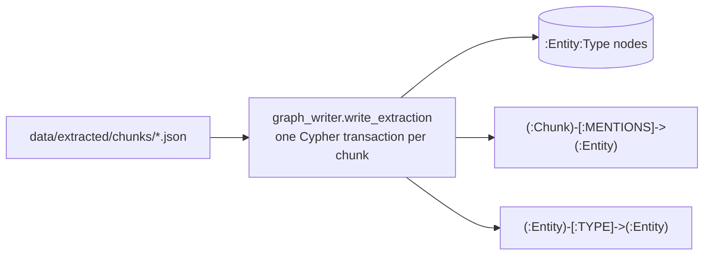

# 05 — Writing the graph: MERGE keys, dynamic labels, provenance

## What you will learn
- How each field of chapter 04's `ChunkExtraction` maps onto a graph element — a node, a label, a relationship type, or a property.
- Why `Entity.normalized_name` (not `(type, normalized_name)`) is the one uniqueness constraint entities MERGE on, and what that decision costs and buys.
- Neo4j's two ways to set a label or relationship type that is only known at runtime — the new dynamic-expression syntax (`:$(expr)`) and the older APOC procedures — and why classic Cypher cannot do this at all.
- How `ON CREATE` / `ON MATCH` combine conflicting descriptions and aliases from different chunks into one node, and how relationship `weight` and `chunk_ids` accumulate across re-runs.
- Real numbers from writing the whole 41-page survey into Neo4j: node/relationship counts, the label→relationship→label shape of the graph, one entity's full neighbourhood, and two real duplicate-entity examples that motivate chapter 06.

## The problem: cached JSON, not yet a graph

Chapter 04 left `data/extracted/chunks/*.json` on disk: 146 files, one `ChunkExtraction` each, holding entities and relationships that already fit the frozen schema (chapter 03). None of it is in Neo4j yet. This chapter's job is purely mechanical and, crucially, **LLM-free** — every Cypher query below is deterministic Python-driven Cypher, so it can be re-run as many times as needed while debugging without re-paying chapter 04's hour-long LLM bill.



## Mapping extraction fields onto graph elements

| Extraction field | Graph element |
|---|---|
| `entity.normalized_name` | the **MERGE key** of an `:Entity` node (identity) |
| `entity.name` | `Entity.name` property, set once on `ON CREATE`; every later spelling is folded into `Entity.aliases` instead |
| `entity.type` | one **extra label** on the node (`:Entity:Method`, `:Entity:Person`, ...), plus the `Entity.type` property |
| `entity.description` | `Entity.description` — kept as whichever chunk's description is *longest* so far |
| `entity.properties` (a free dict, e.g. `{"affiliation": "..."}`) | merged directly onto the node with `n += e.properties` |
| `relationship.type` | the **relationship type itself** (`:AFFILIATED_WITH`, `:AUTHORED_BY`, ...), also a runtime value like `entity.type` |
| `relationship.description` / `.weight` / `.properties` | relationship properties, same shapes as their entity counterparts |
| `chunk_id` (the file this extraction came from) | a `(:Chunk)-[:MENTIONS]->(:Entity)` edge (provenance: *which chunk said this*) **and** appended into every relationship's `chunk_ids` list (provenance: *which chunks support this fact*) |

Two different provenance mechanisms exist on purpose: `MENTIONS` answers "where does this entity come from", one edge per (chunk, entity) pair; `chunk_ids` answers "where does this specific *fact* (relationship) come from", as a list on the relationship itself, because the same relationship can be re-observed (and reinforced) by several chunks.

## The MERGE key decision: `normalized_name` alone, not `(type, normalized_name)`

A uniqueness constraint is the thing `MERGE` checks before deciding to create a node (chapter 02, `02_documents_and_chunks.md`; Cypher basics in `../neo4j/02_insert_data.md`). Two choices were on the table:

1. **`Entity.normalized_name` alone** — one node per normalised name, whatever type it currently carries.
2. **Composite `(Entity.type, Entity.normalized_name)`** — a different node per (type, name) pair.

We picked **(1)**. The reason is chapter 04's own numbers: the LLM's `type` field is **not stable across chunks** for the same real-world entity — chapter 04 showed the schema fits this document well (0% `Other`), but nothing stops the same entity from coming back typed differently in different passages (below, `"Li et al. [90]"` is extracted as both `Method` and `Person` in different chunks). With the composite key, every type flip would silently **create a second node** for the same real thing — precisely the duplicate-node bug `../neo4j/02_insert_data.md` warns about, just triggered by a noisy field instead of a typo. With `normalized_name` alone, a type flip cannot create a duplicate; at worst the node accumulates an extra label (shown below), which is a labelling *quality* problem chapter 06 already exists to fix, not a graph-integrity problem. The cost of this choice: the *first* type seen wins as the `Entity.type` property (`ON CREATE` only sets it, later chunks only fill it in if it was ever missing) — a stale first type is a smaller, easier-to-audit problem than duplicate nodes.

```python
def ensure_schema() -> None:
    run_query("CREATE CONSTRAINT entity_normalized_name IF NOT EXISTS "
              "FOR (n:Entity) REQUIRE n.normalized_name IS UNIQUE")
    run_query("CREATE INDEX entity_name IF NOT EXISTS FOR (n:Entity) ON (n.name)")
    run_query("CREATE INDEX entity_type IF NOT EXISTS FOR (n:Entity) ON (n.type)")
    run_query("CREATE CONSTRAINT chunk_id IF NOT EXISTS FOR (c:Chunk) REQUIRE c.id IS UNIQUE")
```

Real output, `SHOW CONSTRAINTS`/`SHOW INDEXES` after `ensure_schema()` ran:

```
name                       type         entityType  labelsOrTypes  properties
entity_normalized_name     UNIQUENESS   NODE        [Entity]       [normalized_name]
chunk_id                   UNIQUENESS   NODE        [Chunk]        [id]
entity_name                RANGE        NODE        [Entity]       [name]
entity_type                RANGE        NODE        [Entity]       [type]
```

`chunk_id` reuses the exact constraint name chapter 02's `ingest.py` already created — `IF NOT EXISTS` only no-ops when both the *name* and the definition already match, so this line is safe to call every run without erroring on "already exists with a different name".

## Dynamic labels and relationship types: two ways, one used here

Classic Cypher parses a label or relationship type as a literal token at **parse time** — you write `:Person`, not a variable. That means `SET n:$type` (a bare parameter as a label) has always been a syntax error, confirmed on this server:

```cypher
CREATE (n) SET n:$type RETURN n
```
```
Invalid input 'type': expected '(' (line 1, column 19 (offset: 18))
"CREATE (n) SET n:$type RETURN n"
                   ^
```

This matters here because `entity.type` and `relationship.type` are only known at **runtime** — they came out of the LLM, one row at a time, inside an `UNWIND`. Before Neo4j 5.26 the only way around this was either building the query text by hand (a Cypher-injection risk, the same class of bug `../neo4j/02_insert_data.md` warns about for values) or calling an APOC (Awesome Procedures On Cypher) procedure that takes the label/type as an ordinary string argument instead of a parsed token:

```cypher
-- APOC way (works on any Neo4j version with APOC installed)
CALL apoc.create.addLabels(n, [e.type]) YIELD node RETURN node
```

Neo4j 5.26 (this server: `5.26.29`, confirmed via `CALL dbms.components()`) added **dynamic label/type expressions**: `:$(expr)` evaluates the parenthesised expression — a parameter, a property, anything — to a name at runtime, no procedure call and no string-building needed:

```cypher
SET n:$(e.type)
MERGE (a)-[rel:$(r.type)]->(b)
```

Verified directly against the running server with a two-row `UNWIND`:

```cypher
UNWIND [{name:'GraphRAG', type:'Method', normalized_name:'graphrag', description:'A method.', properties:{category:'x'}},
        {name:'Graph RAG', type:'Method', normalized_name:'graphrag', description:'A longer description of the same method appearing twice.', properties:{}}] AS e
MERGE (n:Entity {normalized_name: e.normalized_name})
ON CREATE SET n.name = e.name, n.created_at = datetime()
SET n.type = coalesce(n.type, e.type),
    n.description = CASE WHEN size(e.description) > size(coalesce(n.description,'')) THEN e.description ELSE n.description END,
    n.aliases = apoc.coll.toSet(coalesce(n.aliases, []) + e.name),
    n += e.properties
SET n:$(e.type)
RETURN n.name, n.type, labels(n), n.description, n.aliases, n.category
```
```
n.name, n.type, labels(n), n.description, n.aliases, n.category
"GraphRAG", "Method", ["Entity", "Method"], "A longer description of the same method appearing twice.", ["GraphRAG", "Graph RAG"], "x"
"GraphRAG", "Method", ["Entity", "Method"], "A longer description of the same method appearing twice.", ["GraphRAG", "Graph RAG"], "x"
```

Both rows landed on the same node (one `MERGE` key), the longer of the two descriptions won, both spellings ended up in `aliases`, and the free-form `properties` dict (`category: "x"`) got merged straight onto the node. This tutorial uses the dynamic-expression syntax (`:$(e.type)` / `:$(r.type)`) everywhere, not APOC, since it needs no plugin beyond what chapter 00 already installed and reads closer to ordinary Cypher; `apoc.create.addLabels` / `apoc.merge.relationship` are shown above only so the older idiom is recognisable if you meet it in someone else's code.

## `write_extraction`: one chunk, one transaction, three queries

```python
def _write_extraction_tx(tx: ManagedTransaction, ext: ChunkExtraction) -> dict:
    """Everything for one chunk in a single transaction: entities, provenance,
    relationships. One chunk's extraction is one unit of work -- either all
    of it lands, or (on error) none of it does, so a crash mid-chunk never
    leaves a chunk half-written into the graph.
    """
    counters = {"nodes_created": 0, "properties_set": 0, "relationships_created": 0, "labels_added": 0}

    entities = _entity_rows(ext)
    if entities:
        summary = tx.run(_ENTITY_QUERY, entities=entities).consume()
        for key in counters:
            counters[key] += getattr(summary.counters, key, 0)
        summary = tx.run(_MENTIONS_QUERY, entities=entities, chunk_id=ext.chunk_id).consume()
        for key in counters:
            counters[key] += getattr(summary.counters, key, 0)

    relationships = _relationship_rows(ext)
    if relationships:
        summary = tx.run(_RELATIONSHIPS_QUERY, relationships=relationships, chunk_id=ext.chunk_id).consume()
        for key in counters:
            counters[key] += getattr(summary.counters, key, 0)

    return counters


def write_extraction(ext: ChunkExtraction) -> dict:
    with get_driver() as driver:
        with driver.session(database="neo4j") as session:
            return session.execute_write(_write_extraction_tx, ext)
```

`session.execute_write` (the driver's managed-transaction API) wraps all three `tx.run` calls in one transaction, with automatic retry on transient errors — the same guarantee `../neo4j/02_insert_data.md` describes for a single query, extended to a multi-statement unit of work. Each of the three queries itself `UNWIND`s its whole list in one round-trip (chapter 02's batching pattern), so one chunk with, say, 16 entities and 12 relationships costs 2-3 network round-trips total, not 28.

The entity query, with `ON CREATE` / `ON MATCH` semantics spelled out:

```cypher
UNWIND $entities AS e
MERGE (n:Entity {normalized_name: e.normalized_name})
ON CREATE SET n.name = e.name, n.created_at = datetime()
SET n.type = coalesce(n.type, e.type),
    n.description = CASE
        WHEN size(e.description) > size(coalesce(n.description, '')) THEN e.description
        ELSE n.description
    END,
    n.aliases = apoc.coll.toSet(coalesce(n.aliases, []) + e.name),
    n += e.properties
SET n:$(e.type)
```

- `ON CREATE SET n.name = ..., n.created_at = ...` runs **only the first time** a normalized name is seen — `name` and `created_at` should reflect the first sighting, not get overwritten every re-run.
- The plain `SET` below it runs **every time** (create or match): `type` uses `coalesce` so only a *missing* type gets filled in (the MERGE-key decision above); `description` keeps whichever of "what's there" vs "this chunk's description" is longer, a cheap proxy for "more informative"; `aliases` is `apoc.coll.toSet` (APOC's list-to-set helper) over the old aliases plus this chunk's exact-text name, so every distinct spelling accumulates without duplicates; `n += e.properties` merges the free-form property dict, later chunks' properties overwriting same-named keys from earlier ones.
- `SET n:$(e.type)` always runs, both on create and on match — this is deliberate: it is how a node ends up with more than one type label when the LLM assigns different types across chunks (see "what went wrong" below), and that accumulation is itself the signal chapter 06 needs.

The provenance query is a plain `MERGE` on the (chunk, entity) pair, keyed by whatever the graph already knows the entity's `normalized_name` to be:

```cypher
UNWIND $entities AS e
MATCH (c:Chunk {id: $chunk_id})
MATCH (n:Entity {normalized_name: e.normalized_name})
MERGE (c)-[m:MENTIONS]->(n)
SET m.description = e.description
```

The relationship query mirrors the entity query's `ON CREATE`/`ON MATCH` split, but for `weight` (averaged, not maxed — a fact repeated weakly across chunks should not look as strong as one stated explicitly once) and `chunk_ids` (grown, not replaced):

```cypher
UNWIND $relationships AS r
MATCH (a:Entity {normalized_name: r.source_norm}), (b:Entity {normalized_name: r.target_norm})
MERGE (a)-[rel:$(r.type)]->(b)
ON CREATE SET rel.weight = r.weight, rel.chunk_ids = [$chunk_id]
ON MATCH SET rel.weight = (rel.weight + r.weight) / 2,
             rel.chunk_ids = CASE
                 WHEN $chunk_id IN rel.chunk_ids THEN rel.chunk_ids
                 ELSE rel.chunk_ids + $chunk_id
             END
SET rel.description = coalesce(rel.description, r.description),
    rel += r.properties
```

Verified directly (`SELF_TEST` relationship, run twice): first run created `{weight: 0.5, chunk_ids: ["c1"]}`; the second run, same chunk id and a new `weight: 0.9`, produced `{weight: 0.7, chunk_ids: ["c1"]}` — the average of `0.5` and `0.9`, and `chunk_ids` stayed a single-element list because the `CASE` correctly recognised `"c1"` was already there instead of appending a duplicate.

## `--wipe-domain`: why the two layers are separable

```python
def wipe_domain() -> None:
    """Delete only `Entity` nodes (and everything attached to them):
    `MENTIONS` relationships and all domain relationships between entities.
    `Document` and `Chunk` (the lexical layer, chapter 02) are untouched --
    they came from parsing the PDF, not from the LLM, so there is never a
    reason to redo them just because we want to replay the domain graph
    from a fresh extraction or a schema change.
    """
    run_query("MATCH (n:Entity) DETACH DELETE n")
```

The lexical layer (`Document`, `Chunk`, `HAS_CHUNK`, `NEXT_CHUNK`) and the domain layer (`Entity` and its relationships) only touch through one edge type, `Chunk-[:MENTIONS]->Entity`, always pointing *from* the lexical side *to* the domain side. `DETACH DELETE` on `Entity` nodes removes that edge along with the node, but can never reach backwards into `Chunk` or `Document` — so re-running the whole domain graph from scratch (after a schema tweak, a `MERGE`-key change, or just to demo idempotency) never requires re-parsing or re-chunking the PDF. This is the same separation of concerns chapter 04 used to justify never calling the LLM from this module: cheap, deterministic layers should be freely redoable without re-paying for expensive, slow ones.

## Running it for real

```bash
$ just write-graph --wipe-domain
uv run python -m graph_rag.graph_writer write --wipe-domain
--wipe-domain: deleting all Entity nodes first
                       Graph write summary (146 chunk(s))
┏━━━━━━━━━━━━━━━━━━━━━━━┳━━━━━━━━━━━━━━━━━━━━━━━━━━━━━━━━━━━━━━━━━━━━━━━━━━━━━━┓
┃ metric                ┃ value                                                ┃
┡━━━━━━━━━━━━━━━━━━━━━━━╇━━━━━━━━━━━━━━━━━━━━━━━━━━━━━━━━━━━━━━━━━━━━━━━━━━━━━━┩
│ chunks written        │ 146                                                  │
│ nodes created         │ 1748                                                 │
│ relationships created │ 4033                                                 │
│ labels added          │ 3509                                                 │
│ properties set        │ 22265                                                │
│ entity types seen     │ Dataset, Domain, KnowledgeGraph, Method, Metric,     │
│                       │ Organization, Paper, Person, Task, Technique         │
└───────────────────────┴──────────────────────────────────────────────────────┘
```

The whole run — 146 chunks, ~2334 cached entities and ~1731 cached relationships from chapter 04 — took **about 2 seconds** end to end, confirming chapter 04's separation of concerns: the slow part (an hour of LLM calls) already happened once, and everything from here on is cheap enough to redo on a whim.

`just graph-stats` reads the graph currently sitting in Neo4j, no cache files involved:

```bash
$ just graph-stats
```
```
  Node counts per label
┏━━━━━━━━━━━━━━━━┳━━━━━━━┓
┃ label          ┃ count ┃
┡━━━━━━━━━━━━━━━━╇━━━━━━━┩
│ Entity         │ 1748  │
│ Person         │ 1055  │
│ Paper          │ 193   │
│ Chunk          │ 146   │
│ Method         │ 143   │
│ Technique      │ 105   │
│ Organization   │ 102   │
│ Task           │ 56    │
│ Dataset        │ 42    │
│ KnowledgeGraph │ 30    │
│ Metric         │ 18    │
│ Domain         │ 17    │
│ Document       │ 1     │
└────────────────┴───────┘
    Relationship type counts
┏━━━━━━━━━━━━━━━━━━━━━━┳━━━━━━━┓
┃ type                 ┃ count ┃
┡━━━━━━━━━━━━━━━━━━━━━━╇━━━━━━━┩
│ MENTIONS             │ 2334  │
│ AUTHORED_BY          │ 1122  │
│ HAS_CHUNK            │ 146   │
│ NEXT_CHUNK           │ 145   │
│ PROPOSED_BY          │ 132   │
│ PUBLISHED_IN         │ 115   │
│ APPLIES_TECHNIQUE    │ 113   │
│ BELONGS_TO_DOMAIN    │ 77    │
│ SOLVES_TASK          │ 61    │
│ PART_OF_PIPELINE     │ 22    │
│ USES_KNOWLEDGE_GRAPH │ 20    │
│ IMPROVES_UPON        │ 13    │
│ AFFILIATED_WITH      │ 9     │
│ DERIVED_FROM         │ 9     │
│ MEASURED_BY          │ 3     │
│ CITES                │ 2     │
│ EVALUATED_ON         │ 1     │
└──────────────────────┴───────┘
```

The **label→REL→label** shape (the same "who connects to whom" query as `../neo4j/001_explore_database.md`, `MATCH (a)-[r]->(b) RETURN labels(a) AS from, type(r) AS rel, labels(b) AS to, count(*) AS n ORDER BY n DESC`), top rows:

```
from, rel, to, n
["Chunk"], "MENTIONS", ["Entity", "Person"], 1364
["Entity", "Paper"], "AUTHORED_BY", ["Entity", "Person"], 1074
["Chunk"], "MENTIONS", ["Entity", "Method"], 229
["Chunk"], "MENTIONS", ["Entity", "Paper"], 202
["Chunk"], "MENTIONS", ["Entity", "Organization"], 166
["Document"], "HAS_CHUNK", ["Chunk"], 146
["Chunk"], "NEXT_CHUNK", ["Chunk"], 145
["Entity", "Paper"], "PUBLISHED_IN", ["Entity", "Organization"], 99
["Entity", "Method"], "APPLIES_TECHNIQUE", ["Entity", "Technique"], 75
["Entity", "Method"], "PROPOSED_BY", ["Entity", "Person"], 61
```

Same skew chapter 04 already flagged (a 41-page survey's bibliography dominates `Person`/`AUTHORED_BY` counts) shows up here too, now as graph structure rather than a stats-table percentage.

## One entity, its whole neighbourhood

`GraphRAG` — the survey's central subject — is the highest-degree entity in the graph: 35 `MENTIONS` (mentioned in 35 of the 146 chunks) and 59 domain relationships. A sample of its real, non-`MENTIONS` neighbourhood, sorted by relationship weight:

```cypher
MATCH (n:Entity {normalized_name:'graphrag'})-[r]-(m:Entity) WHERE NOT type(r)='MENTIONS'
RETURN startNode(r)=n AS outgoing, type(r), m.name, labels(m), r.weight
ORDER BY r.weight DESC LIMIT 6
```
```
outgoing, type, m.name, labels, weight
true, "APPLIES_TECHNIQUE", "answer generator", ["Entity", "Technique"], 1.0
true, "APPLIES_TECHNIQUE", "G-Retrieval", ["Entity", "Technique"], 1.0
true, "APPLIES_TECHNIQUE", "G-Indexing", ["Entity", "Technique"], 1.0
true, "APPLIES_TECHNIQUE", "Graph-Guided Retrieval", ["Entity", "Technique"], 1.0
true, "APPLIES_TECHNIQUE", "Graph-Based Indexing (G-Indexing)", ["Entity", "Technique"], 1.0
true, "APPLIES_TECHNIQUE", "Graph-Enhanced Generation (G-Generation)", ["Entity", "Technique"], 1.0
```

Two of its real `MENTIONS`, showing the same node's `description` staying stable while each chunk's own take on it is preserved on the edge instead:

```cypher
MATCH (c:Chunk)-[m:MENTIONS]->(n:Entity {normalized_name:'graphrag'})
RETURN c.index, m.description LIMIT 2
```
```
c.index, m.description
9, "A framework for question answering that leverages graphs with rich relational knowledge, divided into G-Indexing, G-Retrieval, and G-Generation stages."
69, "A technology category involving graph-based retrieval-augmented generation, summarized in the context of downstream tasks and applications."
```

## Idempotency, demonstrated

`write_all` was run twice in a row against the same 146 cached files. First run (fresh, after `--wipe-domain`): `1748` nodes, `4033` relationships created. Second run, no flags:

```
                       Graph write summary (146 chunk(s))
┏━━━━━━━━━━━━━━━━━━━━━━━┳━━━━━━━━━━━━━━━━━━━━━━━━━━━━━━━━━━━━━━━━━━━━━━━━━━━━━━┓
┃ metric                ┃ value                                                ┃
┡━━━━━━━━━━━━━━━━━━━━━━━╇━━━━━━━━━━━━━━━━━━━━━━━━━━━━━━━━━━━━━━━━━━━━━━━━━━━━━━┩
│ chunks written        │ 146                                                  │
│ nodes created         │ 0                                                    │
│ relationships created │ 0                                                    │
│ labels added          │ 0                                                    │
│ properties set        │ 17021                                                │
│ entity types seen     │ Dataset, Domain, KnowledgeGraph, Method, Metric,     │
│                       │ Organization, Paper, Person, Task, Technique         │
└───────────────────────┴──────────────────────────────────────────────────────┘
```

`nodes created`, `relationships created` and `labels added` all dropped to `0` — every `MERGE` matched an existing node, edge, and label instead of creating a new one. `properties set` stays non-zero on every run: Neo4j's counters count a `SET` as a property write even when the value is unchanged, so this number is not a sign of drift, just of the same properties being reasserted. `MATCH (n:Entity) RETURN count(n)` and `MATCH ()-[r]->() RETURN count(r)` were `1748` and `4324` before and after the second run — unchanged.

## What went wrong: real duplicates, motivating chapter 06

Nothing here is invented — every example below is a real node in this run.

**Same concept, different surface strings.** `GraphRAG`'s own neighbourhood above already shows it: `"G-Indexing"`, `"Graph-Based Indexing (G-Indexing)"` and `"Graph-Based Indexing"` are three separate `Technique` nodes, all clearly the same real-world stage of the pipeline, because `normalized_name` is a purely lexical key (casefold, strip punctuation, drop leading articles — chapter 04's `normalize()`) with no notion of abbreviation or synonymy. The same pattern shows up at the top level of the survey's own subject: `"GraphRAG"` (`normalized_name: "graphrag"`) and `"Graph Retrieval-Augmented Generation"` (`normalized_name: "graph retrieval-augmented generation"`) are two distinct `Method` nodes — again, obviously the same thing to a human reader, invisible to a string-equality MERGE key.

**Same real thing, unstable type.** `"Li et al. [90]"` appears in the graph with labels `["Entity", "Method", "Person"]` — a citation shorthand that one chunk's extraction typed as a `Person` (the author) and another typed as a `Method` (confusing "the method Li et al. propose" with "the person Li et al."). Because the MERGE key is `normalized_name` alone (see the decision above), this did not create a duplicate node — it created one node with an extra, wrong label, which is strictly easier to clean up later than a duplicate.

**No `Other` entities this run.** Unlike a hypothetical schema mismatch, this document produced 0 `Other`-typed entities (chapter 04's own stats table) — the frozen schema from chapter 03 genuinely fits this document, so there is no real "entity type didn't fit" example to show here; the honest finding is that this particular failure mode did not occur on this document.

Both real failures above are examples of the same underlying gap: **string identity is not the same as real-world identity.** `normalized_name` catches exact-spelling and casing differences but nothing beyond that — no abbreviation expansion, no semantic similarity, no "these two type labels can't both be right" check. That gap is exactly what chapter 06 (`06_entity_resolution.md`) exists to close: normalisation refinements, embedding similarity, an LLM-as-judge pass, and merging duplicate nodes with APOC while keeping every alias.

## Key takeaways
- Every extraction field has one, and only one, graph destination: `normalized_name` → node identity, `type` → an extra label plus a property, `description`/`weight`/`properties` → node or relationship properties, `chunk_id` → `MENTIONS` provenance and `chunk_ids` accumulation. Keeping this mapping this explicit is what makes the write queries auditable.
- The MERGE key is `Entity.normalized_name` alone, not `(type, normalized_name)` — because the LLM's `type` field is not stable across chunks, and a composite key would turn that instability into duplicate nodes instead of the easier-to-fix "extra label" problem.
- Dynamic label/type expressions (`:$(expr)`, Neo4j 5.26+) do what classic Cypher's bare `:$param` syntax error made impossible: compute a label or relationship type at runtime from a parameter, without string-building the query or reaching for an APOC procedure.
- `ON CREATE` sets facts that should only be true once (`name`, `created_at`); the following `SET` reconciles facts across repeated sightings (longest description, unioned aliases, averaged weight, grown `chunk_ids`) — and running the whole pipeline twice provably changes nothing (`0` created on the second run).
- Splitting the lexical layer (`Document`/`Chunk`, expensive to rebuild) from the domain layer (`Entity`, cheap to rebuild once cached) via `--wipe-domain` means a schema tweak or a `MERGE`-key change never requires re-parsing the PDF.
- Real duplicates already show up in this small, single-document run (`GraphRAG` vs `Graph Retrieval-Augmented Generation`, `Li et al. [90]` typed as both `Method` and `Person`) — string-identity MERGE keys are necessary but not sufficient, which is exactly what chapter 06 addresses next.

Next: [06_entity_resolution.md](06_entity_resolution.md) — the same thing under different names: normalisation refinements, embedding similarity, LLM-as-judge, merging duplicate nodes with APOC while keeping aliases.
