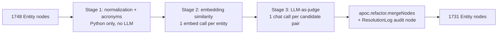

# 06 — Entity resolution: same thing, different names

## What you will learn
- Why duplicate `Entity` nodes are inevitable when an LLM (Large Language Model) extracts entities one chunk at a time, even with a frozen schema and a stable `normalized_name` key (chapter 05).
- A three-stage funnel — cheap normalisation, embedding similarity, LLM-as-judge — that trades cost for precision at each step, with real precision/recall numbers from this document.
- How to merge two duplicate nodes with `apoc.refactor.mergeNodes` (APOC = Awesome Procedures On Cypher) without losing any alias, description, or provenance (`MENTIONS`) relationship.
- Why "same surface name" is not the same as "same real-world thing" — a real example of three separate `GraphRAG` implementations that must **not** be merged.
- Real before/after numbers from resolving the whole 41-page survey's graph: candidate counts per stage, merges applied, and the audit trail left behind.

## The problem, restated with real numbers

Chapter 05 ended with two real examples of the same gap: `GraphRAG` and `Graph Retrieval-Augmented Generation` are two separate `Method` nodes, and `"G-Indexing"` / `"Graph-Based Indexing (G-Indexing)"` / `"Graph-Based Indexing"` are three separate `Technique` nodes — all because `normalized_name` (chapter 04's `normalize()`: casefold, strip punctuation, drop leading articles) is a purely **lexical** key. It cannot know that `"LLM"` is an acronym of `"Large Language Models"`, or that `"GraphRAG Survey"` and `"GraphRAG Survey Paper"` are the same paper. Duplicates are not a bug in chapter 04 or 05 — they are the direct, structural consequence of extracting one passage at a time with no memory of what was already extracted from a different passage.



Each stage of this funnel is cheaper and higher-precision than a brute-force "ask the LLM about every pair" approach (1748 entities → 1.5 million possible pairs), but also less certain — stage 1 is exact-and-free but only catches string variants; stage 2 catches semantic variants but at the cost of contacting the embedding model once per entity; stage 3 is the only stage allowed to actually say "yes, merge these", because it is the only one that reads full context (types, descriptions, and a real mention sentence) instead of a similarity score.

## Stage 1: normalization and acronyms (Python only, free)

`extraction.normalized_name()` already strips punctuation and casefolds, but keeps hyphens and does not touch parentheses or plurals. Chapter 06's `resolution_key()` goes one step further, and combines it with an acronym map **mined from this document itself**, not a hand-written list:

```python
_ACRONYM_RE = re.compile(r"\b([A-Z][\w-]*(?:\s+[A-Z][\w-]*)*)\s*\(([A-Z][\w-]{1,20})\)")


def build_acronym_map(names: list[str]) -> dict[str, str]:
    """Scan entity names for 'Full Name (ACRONYM)' patterns and build a map
    from the acronym's resolution key to the full name's resolution key.
    Built fresh from this corpus every run -- no hardcoded acronym list.
    """
    acronym_map: dict[str, str] = {}
    for name in names:
        for match in _ACRONYM_RE.finditer(name):
            phrase, acronym = match.group(1), match.group(2)
            acronym_map[resolution_key(acronym)] = resolution_key(phrase)
    return acronym_map


def resolution_key(name: str, acronym_map: dict[str, str] | None = None) -> str:
    """A looser normalization than `extraction.normalized_name`: also drops
    parenthetical asides, treats hyphens as word separators, and singularizes
    each word. Two entities with the same `resolution_key` are Stage 1
    candidates -- likely the same thing spelled differently.
    """
    text = strip_parenthetical(name).casefold()
    text = _PUNCT_RE.sub(" ", text.replace("-", " "))
    words = [_singularize(w) for w in _WHITESPACE_RE.split(text) if w]
    key = " ".join(words)
    if acronym_map and key in acronym_map:
        key = acronym_map[key]
    return key
```

The acronym regex only requires the parenthesised side to *start* with a capital letter, not to be a pure `[A-Z]{2,6}` acronym — because the real text in this survey uses shorthands like `"Graph-Based Indexing (G-Indexing)"`, where the "acronym" (`G-Indexing`) is not all-caps letters, it is the paper's own abbreviation for the phrase next to it. A stricter regex would miss exactly the pattern this document actually uses.

Real Stage 1 output (`candidates_by_normalization`, run against the 1748-entity graph): **29 candidate pairs**, entirely from Python string logic, 0 LLM calls, well under a second. A sample:

```
method         a                                                    b
normalization  LLMs                                                 LLM
normalization  LLMs                                                 Large Language Models
normalization  GNNs                                                 GNN
normalization  knowledge graph (KG)                                 Knowledge Graph
normalization  Graph-Based Indexing (G-Indexing)                    G-Indexing
normalization  Graph-Based Indexing (G-Indexing)                    Graph-Based Indexing
normalization  Graph-Guided Retrieval (G-Retrieval)                 G-Retrieval
normalization  EM                                                   Exact Match (EM)
normalization  GraphRAG (by Microsoft)                              GraphRAG (by NebulaGraph)
```

The last row is exactly the case Stage 1 is *not* supposed to resolve on its own — `resolution_key("GraphRAG (by Microsoft)")` and `resolution_key("GraphRAG (by NebulaGraph)")` both collapse to `"graphrag"` once the parenthetical is stripped, because the regex only strips parens, it does not read what's inside them. This is why every stage only produces **candidates**; only Stage 3 decides.

## Stage 2: embedding similarity (one `llm.embed` call per entity)

```python
def ensure_embeddings(entities: list[dict]) -> None:
    """Embed `name + ': ' + description` for entities missing `Entity.embedding`,
    batching Ollama calls (32 at a time) and writing each batch back to Neo4j
    immediately so a re-run only embeds what's still missing."""
    todo = [e for e in entities if e.get("embedding") is None]
    ...
    for i in range(0, len(todo), batch_size):
        batch = todo[i : i + batch_size]
        vectors = embed(texts[i : i + batch_size])
        run_query(
            "UNWIND $rows AS row MATCH (n:Entity {normalized_name: row.norm}) "
            "SET n.embedding = row.vec",
            rows=[{"norm": e["normalized_name"], "vec": v} for e, v in zip(batch, vectors)],
        )
```

`Entity.embedding` is stored on the node itself (chapter 07 reuses this property for the vector index — no need to recompute it). Real timing: embedding all 1748 entities (`nomic-embed-text`, 768 dimensions, 55 batches of 32) took **well under a minute** — a stark contrast to the chat model's 10-60 seconds per call. Cosine similarity over the resulting vectors is done in plain Python (`1748` entities → up to ~1.5M pairs, but restricted to same-`type`-or-`Other` pairs and computed in a tight double loop, still well under a minute for this document's size):

```python
def candidates_by_embedding(entities, threshold=0.92):
    ensure_embeddings(entities)
    pairs = []
    for i in range(len(entities)):
        for j in range(i + 1, len(entities)):
            a, b = entities[i], entities[j]
            if a["type"] != b["type"] and "Other" not in (a["type"], b["type"]):
                continue
            score = _cosine(a["embedding"], b["embedding"])
            if score >= threshold:
                pairs.append(CandidatePair(..., method="embedding", score=round(score, 4)))
    return pairs
```

**Real precision problem, at threshold 0.92**: this stage alone produced **276 candidate pairs**, and the overwhelming majority are false positives among `Person` entities — co-authors of the same paper get near-identical descriptions ("co-author of this survey"), which pushes their name+description embeddings well above 0.92 even though they are different people:

| a | b | cosine | real answer |
|---|---|---|---|
| `Li et al. [90]` | `Li et al. [95]` | 0.9988 | different citations |
| `Jin et al.` | `Jiang et al.` | 0.9882 | different authors |
| `GNNs` | `GNN` | 0.9536 | **same** (plural) |
| `node classification` | `graph classification` | 0.9688 | different tasks |
| `GraphRAG Survey` | `GraphRAG Survey Paper` | 0.9350 | **same** paper |

Raising the threshold trims volume but not the underlying problem — at **0.95** only 27 pairs remain, still mostly `Person` false positives (`Qiaoqiao Liu` / `Hui Liu` at 0.963, `Lei Liu` / `Xiaoyang Liu` at 0.963). This is why Stage 2's output is *candidates*, never a decision: name+description embeddings are similarity of **writing style and role** ("an author who co-wrote this survey"), not of **identity**. Only Stage 3 has enough context (type, full description, an actual mention) to tell them apart.

## Stage 3: LLM-as-judge

```python
class Judgement(BaseModel):
    same_entity: bool = Field(description="True if both names refer to the same real-world thing")
    canonical_name: str = Field(description="The best human-readable name to keep")
    reason: str = Field(description="One sentence explaining the decision")

_JUDGE_SYSTEM = """You are an entity-resolution judge for a knowledge graph built from a \
technical survey paper. You will be given two candidate entities: their names, types, \
descriptions, and one sentence of text where each was mentioned. Decide whether they refer to \
the SAME real-world thing (a duplicate that should be merged) or two DIFFERENT things that \
happen to look similar. Two entities with the same surface name but different roles (for \
example one is a general concept/component and the other a specific named system or model) are \
DIFFERENT. Output ONLY JSON matching the given schema. If they are the same, `canonical_name` \
should be the clearest, most complete of the two names."""
```

Each candidate pair (union of Stage 1 + Stage 2, de-duplicated) becomes one `chat_json` call with both entities' name, type, description, and one real `MENTIONS.description` sentence, cached to `data/extracted/resolution/<a>__<b>.json` (sorted so `(a,b)` and `(b,a)` share one file). Two real judgements from this run:

A **merge** — the case Stage 1 could not catch (different word counts, no acronym) and Stage 2 barely could (cosine 0.935, right at the edge of the "mostly noise" region above):
```json
{
  "same_entity": true,
  "canonical_name": "GraphRAG Survey",
  "reason": "Both entities describe the exact same academic publication (a survey on GraphRAG published in J. ACM in September 2024). The difference in naming is merely a stylistic variation ('Survey' vs 'Survey Paper') referring to the same document."
}
```

A **rejection** — one of the 276 `Person` false positives from Stage 2 (cosine 0.982), correctly separated:
```json
{
  "same_entity": false,
  "canonical_name": "Jin et al.",
  "reason": "The entities have different primary author names (Jin vs. Sun), indicating they are distinct research groups or papers, despite having similar descriptions regarding LLM-based agents."
}
```

**A real limitation, not smoothed over**: the judge is not perfectly self-consistent across the three pairwise judgements of one 3-member group — `"Query-Focused Summarization"`, `"QFS"`, `"Query-Focused Summarization (QFS)"`. Judged as three independent pairs, only **one** of the three came back `same_entity: true`; the other two (`"Query-Focused Summarization" <-> "QFS"` and `"QFS" <-> "Query-Focused Summarization (QFS)"`) came back `false`, even though a human reading all three together would merge all of them. Each judge call sees only two entities at a time, with no memory of other judgements — a real, known limitation of pairwise LLM-as-judge, not fixed here (a follow-up could re-run the judge on the *union* of a Stage-1 group instead of pairwise, at the cost of an less structured prompt).

## `merge()`: `apoc.refactor.mergeNodes` and the property policy

```python
def merge(a_norm: str, b_norm: str, canonical_name: str, method: str) -> dict | None:
    rows = run_query(
        """
        MATCH (a:Entity {normalized_name: $a_norm}), (b:Entity {normalized_name: $b_norm})
        WHERE a <> b
        CALL apoc.refactor.mergeNodes([a, b], {
            properties: {
                name: 'discard',
                aliases: 'combine',
                description: 'combine',
                `.*`: 'discard'
            },
            mergeRels: true
        }) YIELD node
        RETURN node.normalized_name AS normalized_name
        """,
        a_norm=a_norm, b_norm=b_norm,
    )
```

`apoc.refactor.mergeNodes([a, b], {...})` takes the *first* node in the list as the survivor and folds the second into it, one property at a time, according to the policy map:

- **`name: 'discard'`** — whichever side's `name` APOC would otherwise keep does not matter; the merge sets the canonical `name` explicitly right after (below), so this just avoids relying on APOC's default (keep-the-first) behaviour for a field we are about to overwrite anyway.
- **`aliases: 'combine'`** — APOC concatenates both nodes' `aliases` lists (it does not de-duplicate). The Python code right after reads the combined list back and de-duplicates it case-insensitively — this is also *exactly* the invariant chapter 06's own test suite checks after every run: no alias may be shared, case-insensitively, across two different `Entity` nodes.
- **`description: 'combine'`** — turns the two scalar `description` strings into a 2-element list (or, on a second merge into an already-merged node, extends that list further). The Python code flattens whatever list shows up and keeps the **longest** description, the same "more informative wins" heuristic chapter 05 used inside its own `MERGE` query.
- **`` `.*` `` (everything else, e.g. `type`, `created_at`, `embedding`): `'discard'`** — the wildcard key has to be backtick-quoted in Cypher (a bare `'.*'` map key is a syntax error, even though some APOC examples show it unquoted). There is no principled way to combine a `type` string or an embedding vector from two different nodes, so the survivor keeps whatever it already had and the discarded node's values are dropped.
- **`mergeRels: true`** — every relationship pointing at or from the discarded node, including `MENTIONS` (chapter 05's chunk-provenance edges) and every domain relationship (`AUTHORED_BY`, `EVALUATED_ON`, ...), is redirected onto the surviving node instead of being deleted. Two nodes that each had a `MENTIONS` edge from the same chunk now have **two parallel `MENTIONS` edges** between that chunk and the merged node — APOC does not deduplicate parallel edges by itself.

The follow-up Cypher unions `chunk_ids` across any parallel relationships APOC leaves behind and deletes the extras, so provenance is preserved (every chunk that ever mentioned either duplicate is still recorded) without leaving duplicate edges:

```cypher
MATCH (n:Entity {normalized_name: $norm})-[r]->(m)
WITH n, m, type(r) AS rel_type, collect(r) AS rels
WHERE size(rels) > 1
WITH rels[0] AS keep_rel, rels[1..] AS extra_rels,
     reduce(ids = [], x IN rels | ids + coalesce(x.chunk_ids, [])) AS all_ids
SET keep_rel.chunk_ids = apoc.coll.toSet(all_ids)
WITH extra_rels
UNWIND extra_rels AS extra
DELETE extra
```

Finally, one `(:ResolutionLog {a, b, canonical, method, at})` node is created per successful merge — a permanent audit trail answering "why did these two things become one node", independent of the Neo4j-native change log:

```cypher
CREATE (:ResolutionLog {
    a: $a_norm, b: $b_norm, canonical: $canonical_name,
    method: $method, at: datetime()
})
```

## Running it for real

```bash
$ just resolve dry="--dry-run" --threshold 0.92
```
```
Resolution candidates (301 pair(s), threshold=0.92)
a                          b                          method          score   decision        canonical
LLMs                       LLM                        normalization   -       MERGE           LLMs
GNNs                       GNN                        normalization   -       MERGE           GNNs
Graph-Based Indexing       G-Indexing                 normalization   -       MERGE           Graph-Based Indexing (G-Indexing)
GraphRAG (by Microsoft)    GraphRAG (by NebulaGraph)  normalization   -       keep separate   -
GraphRAG (by Microsoft)    GraphRAG (by Antgroup)     normalization   -       keep separate   -
GraphRAG Survey            GraphRAG Survey Paper      embedding       0.935   MERGE           GraphRAG Survey
Jin et al.                 Jiang et al.               embedding       0.988   keep separate   -
--dry-run: no merges applied
```

```bash
$ just resolve --threshold 0.92
```
```
22 merge(s) applied
```

`just resolve-report` afterward:

```bash
$ just resolve-report
```
```
Resolution log (17 merge(s))
a                                  b                                 canonical                             method
llms                               large language models             Large Language Models                normalization
gnns                               gnn                                GNNs                                 normalization
knowledge graph kg                 knowledge graph                    knowledge graph (KG)                 normalization
graph-based indexing g-indexing    g-indexing                         Graph-Based Indexing (G-Indexing)    normalization
graph-guided retrieval g-retrieval g-retrieval                        Graph-Guided Retrieval (G-Retrieval) normalization
em                                 exact match em                     Exact Match (EM)                     normalization
llm graph builder                  llm-graph-builder                 LLM Graph Builder                    normalization
graphrag survey                    graphrag survey paper              GraphRAG Survey                      embedding
```

22 pairs were judged `same_entity: true`, but 3-member duplicate groups (e.g. the `G-Indexing` trio) only need 2 real merges to collapse into 1 node — the 3rd pair's `MATCH` finds nothing once its `normalized_name` was already renamed away by an earlier merge in the same run, and silently no-ops (see gotcha below) — which is why 17 `:ResolutionLog` entries, not 22, are the true count of *distinct* merges that changed the graph.

## Before / after

| metric | chapter 05 (before) | chapter 06 (after) |
|---|---|---|
| `Entity` nodes | 1748 | 1731 |
| domain + lexical relationships | 4324 | 4317 |
| `Person` | 1055 | 1054 |
| `Method` | 143 | 139 |
| `Technique` | 105 | 99 |
| `Organization` | 102 | 101 |
| `KnowledgeGraph` | 30 | 28 |
| `Paper` | 193 | 192 |
| `Task` | 56 | 55 |
| `Metric` | 18 | 17 |

The label→relationship→label shape (chapter 05's same query) is essentially unchanged in absolute terms — 17 merges out of 1748 entities is a small fraction, exactly what "the frozen schema and `normalized_name` MERGE key already prevent most duplication" (chapter 05's finding) would predict. What changed is *which* nodes: `MENTIONS` count stayed effectively the same (2334) because merged nodes kept every mention, just redirected.

## Aliases and how retrieval benefits later

Every merged node keeps every spelling that ever pointed at it, case-deduplicated:

```cypher
MATCH (n:Entity {normalized_name: 'graph-based indexing g-indexing'}) RETURN n.name, n.aliases
```
```
n.name, n.aliases
"Graph-Based Indexing (G-Indexing)", ["G-Indexing", "Graph-Based Indexing", "Graph-Based Indexing (G-Indexing)"]
```

Chapter 07 builds a full-text index over `name` **and** `aliases` — this is exactly why aliases are worth carrying instead of discarding: a user question that says `"G-Indexing"` and one that says `"Graph-Based Indexing"` both need to land on the same node at retrieval time, and a full-text index over the union of every historical spelling is a much cheaper way to get there than re-running an LLM-as-judge at query time.

## Thresholds: how to tune them

The 0.92 → 0.95 comparison above (276 → 27 candidate pairs) is the practical lever: raising the cosine threshold trades recall (you might miss a real near-0.90 duplicate) for judge-cost (fewer, cheaper LLM calls) and — less obviously — for judge-*accuracy*, since a judge asked to adjudicate hundreds of near-identical `Person` pairs risks becoming numb to the pattern. In practice: start high (0.95+) to validate the pipeline cheaply, then lower it once the judge's rejection pattern for your document's noisiest entity type (here, `Person`/co-authors) is well understood, and consider excluding that type from Stage 2 entirely once you have evidence — as this document's numbers show — that it produces almost nothing but false positives.

## When NOT to merge

The clearest real example in this document: **`GraphRAG` (by Microsoft), `GraphRAG` (by NebulaGraph), `GraphRAG` (by Antgroup), and plain `GraphRAG`** are four separate `Method` nodes, all sharing the word "GraphRAG", and the judge correctly kept every pair among them separate — they are four different, specific software implementations that happen to share a generic name, not four spellings of one thing. This is the general rule Stage 3's system prompt states explicitly: *"Two entities with the same surface name but different roles... are DIFFERENT."* A `resolution_key` or embedding score has no way to see "implementation X vs. implementation Y" — only a judge reading the actual descriptions can. The same caution applies to a name shared across *types* by design, not accident: a `Transformer` model and a `Transformer` component of a larger architecture might share a name for a good reason and should stay separate nodes — Stage 2 already guards against comparing across unrelated types, but a same-type name collision like the GraphRAG example needs the judge, every time.

## Key takeaways
- Duplicates are a structural consequence of per-chunk LLM extraction, not a bug in chapter 04/05 — `normalized_name` is a lexical key and catches only exact-spelling variants.
- The three-stage funnel trades cost for precision: Stage 1 (Python, free, 29 real candidates) catches string/acronym variants; Stage 2 (one embed call per entity, ~1 minute for 1748 entities) catches semantic variants but at 0.92 is mostly `Person` false positives (276 of ~301 candidates); Stage 3 (one chat call per candidate pair, cached) is the only stage allowed to decide, because only it reads full context.
- `apoc.refactor.mergeNodes`'s property policy needs one row per property (or the backtick-quoted `` `.*` `` wildcard) and `mergeRels: true` to redirect every relationship — including `MENTIONS` provenance — onto the survivor, but never deduplicates parallel relationships itself, so a follow-up union of `chunk_ids` is needed.
- The LLM judge is not perfectly self-consistent across independently-judged pairs of the same group (real example: the `QFS` trio) — a known limitation of pairwise judging, worth knowing rather than hiding.
- Never merge purely on name similarity across different specific things sharing a generic name (`GraphRAG` by three vendors) — this is exactly what the judge's context (full descriptions, not just names) exists to catch.
- Aliases carried through every merge are the payoff for chapter 07's full-text index: a name and every historical variant of it should resolve to the same node at retrieval time without another LLM call.

Next: [07_embeddings_and_vector_index.md](07_embeddings_and_vector_index.md) — embedding chunks and entities, Neo4j vector and full-text indexes, hybrid search.
