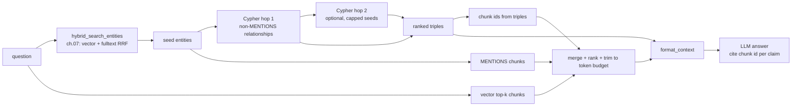

# 08 — Retrieval: local search, from a question to a cited answer

## What you will learn
- **Local search**: the standard Graph RAG (Retrieval-Augmented Generation on a knowledge graph) retrieval pattern for "this question is about specific things" -- start from the entities closest to the question, walk the graph one or two hops, and assemble a context from what you find.
- How to turn hybrid entity search (chapter 07) into graph-Cypher expansion: which relationships to follow, how to rank them, and how to cap the neighbourhood so one densely-connected entity can't flood the context.
- How provenance chunks are collected from three different sources and merged into one ranked, token-budgeted list.
- How to build an answer prompt that forces the LLM (Large Language Model) to cite a real chunk id after every claim -- and why the first version of that prompt failed.
- A real, honest side-by-side of graph-mode vs plain vector-mode answers on the same three questions: where the graph helped, where it made no difference, and why.

## The local search pipeline



Step by step:
1. **Seed** -- `hybrid_search_entities` (chapter 07) turns the question into a ranked list of entities using Reciprocal Rank Fusion of vector and full-text search. These seeds are the graph's entry point.
2. **Expand** -- one Cypher query pulls every non-`MENTIONS` relationship touching a seed, in either direction, correctly oriented. Optionally, a second hop expands from the strongest new neighbours (capped), to reach one step further without exploding the neighbourhood.
3. **Rank and cap** -- triples are ranked by how many seeds they connect (a triple linking two seeds is stronger evidence than one linking a seed to an unrelated neighbour), then by the extraction's own `weight`, and capped at 60 total.
4. **Collect provenance** -- passages come from three places: the chunks a selected triple actually cites (`r.chunk_ids`), the chunks that `MENTIONS` a seed entity, and the top vector hits for the raw question. All three are merged, deduplicated by chunk id, and ranked so a chunk that a triple/mention specifically cites outranks one that only looks topically similar.
5. **Trim to budget** -- chunks are added to the context, cheapest-first by relevance, until a rough token estimate (`len(text) // 4`, no tokenizer dependency) would exceed `max_tokens`.
6. **Answer** -- the context is rendered to plain text (`format_context`) and handed to the chat model with a prompt that requires citing the *exact* bracketed chunk id shown in the context, never an invented one.

## `retrieve_context`

```python
def retrieve_context(
    question: str,
    k_entities: int = 8,
    hops: int = 1,
    k_chunks: int = 6,
    max_tokens: int = 3000,
) -> Context:
    seeds = hybrid_search_entities(question, k=k_entities)
    seed_names = [s["normalized_name"] for s in seeds]
    seed_set = set(seed_names)

    triples = _expand_one_hop(seed_names)
    seen_keys = {(t["subject_key"], t["rel"], t["object_key"]) for t in triples}

    if hops >= 2:
        hop1_ranked = _rank_triples(list(triples), seed_set)
        hop2_seeds = []
        for t in hop1_ranked:
            for key in (t["subject_key"], t["object_key"]):
                if key not in seed_set and key not in hop2_seeds:
                    hop2_seeds.append(key)
            if len(hop2_seeds) >= _MAX_HOP2_SEEDS:
                break
        if hop2_seeds:
            triples += _expand_one_hop(hop2_seeds, exclude=seen_keys)

    triples = _dedupe_triples(triples)
    triples = _rank_triples(triples, seed_set)[:_MAX_TRIPLES]

    chunks = _collect_chunks(question, seed_names, triples, k_chunks)
    chunks, budget_used = _trim_to_budget(chunks, max_tokens)

    entities = [{"name": s["name"], "normalized_name": s["normalized_name"], "type": s.get("type")} for s in seeds]
    return Context(entities=entities, triples=triples, chunks=chunks, budget_used=budget_used)
```

`Context` and `Answer` are plain dataclasses:

```python
@dataclass
class Context:
    entities: list[dict]
    triples: list[dict]
    chunks: list[dict]
    budget_used: int

@dataclass
class Answer:
    text: str
    citations: list[str]
    context_stats: dict = field(default_factory=dict)
```

## The hop-1 Cypher, and why direction needs fixing

```cypher
MATCH (e:Entity)-[r]-(n:Entity)
WHERE e.normalized_name IN $seeds AND type(r) <> 'MENTIONS'
WITH e, r, n, startNode(r) = e AS e_is_source
RETURN
    CASE WHEN e_is_source THEN e.name ELSE n.name END AS subject,
    CASE WHEN e_is_source THEN e.normalized_name ELSE n.normalized_name END AS subject_key,
    type(r) AS rel,
    CASE WHEN e_is_source THEN n.name ELSE e.name END AS object,
    CASE WHEN e_is_source THEN n.normalized_name ELSE e.normalized_name END AS object_key,
    r.description AS description,
    coalesce(r.weight, 1.0) AS weight,
    coalesce(r.chunk_ids, []) AS chunk_ids
```

`MATCH (e)-[r]-(n)` (undirected, see `ai show research_topics/graph_rag/tutorials/neo4j` for Cypher basics) matches a relationship regardless of which side `e` is on -- necessary because a seed can be either the source or the target of a real relationship, and we don't know which in advance. But that means `n` is sometimes the actual subject and `e` the actual object. `startNode(r) = e` recovers the true direction so `subject`/`object` in the output always read the way the relationship was actually extracted (chapter 04), never flipped.

Real output for the seeds of *"How do HippoRAG and GraphRAG differ in how they build their index?"* (seeds: `GraphRAG`, `GraphRAG Survey Paper`, `GraphRAG (by NebulaGraph)`, `GraphRAG (by Microsoft)`, `Graph-Based Indexing`, `Lost in the Middle: ...`, `G-Indexing`, `HippoRAG` -- 80 raw rows, top 6 after ranking):

```
GraphRAG -> APPLIES_TECHNIQUE -> G-Indexing                      | weight=1.0 seed_touches=2
GraphRAG -> APPLIES_TECHNIQUE -> Graph-Based Indexing             | weight=1.0 seed_touches=2
Graph-Based Indexing -> PART_OF_PIPELINE -> GraphRAG              | weight=0.9 seed_touches=2
GraphRAG (by NebulaGraph) -> USES_KNOWLEDGE_GRAPH -> NebulaGraph  | weight=1.0 seed_touches=1
GraphRAG (by NebulaGraph) -> PROPOSED_BY -> NebulaGraph Corp.     | weight=1.0 seed_touches=1
GraphRAG Survey Paper -> PUBLISHED_IN -> J. ACM                   | weight=1.0 seed_touches=1
```

Note the top 3 rows all have `seed_touches=2`: `hybrid_search_entities` returned both `Graph-Based Indexing` and `G-Indexing` as separate seed entities (chapter 06's resolution didn't merge them -- they read as the same concept but were extracted with slightly different names in different chunks), and any triple connecting `GraphRAG` to either one gets the "connects two seeds" bonus. This is a real, useful signal even when it comes from an imperfect merge: it means the graph agrees, from two different angles, that `GraphRAG` and indexing are closely related.

The second hop (`hops=2`) takes the top `_MAX_HOP2_SEEDS=5` *new* entities from the ranked hop-1 triples (skipping ones already in the seed set) and runs the same query again with `exclude` set to the hop-1 triple keys, so nothing is double-counted. On this question hop 2 didn't change the final triple count (the hop-1 neighbourhood alone already exceeded the 60-triple cap), which is itself worth knowing: hop 2 only matters when hop 1 is sparse.

## Provenance chunks: three sources, one ranking

```python
def _collect_chunks(question, seed_names, triples, k_chunks):
    triple_chunk_ids = {cid for t in triples for cid in t["chunk_ids"]}

    mention_rows = run_query(
        """
        MATCH (c:Chunk)-[:MENTIONS]->(e:Entity)
        WHERE e.normalized_name IN $seeds
        RETURN DISTINCT c.id AS id, c.text AS text
        """,
        seeds=seed_names,
    )
    mention_ids = {r["id"] for r in mention_rows}
    vector_hits = search_chunks(question, k=k_chunks)
    # merge vector_hits, mention_rows, and any triple-cited chunk not
    # already present, keyed by chunk id ...

    def _rank_key(c):
        return (c["id"] in triple_chunk_ids, c["id"] in mention_ids, c["score"])

    return sorted(by_id.values(), key=_rank_key, reverse=True)
```

The ranking is a 3-level tuple, most important first: a chunk a *selected triple* explicitly cites beats one that merely `MENTIONS` a seed entity, which beats a chunk that only scored well on raw vector similarity to the question. This mirrors the intuition from chapter 07's search results: a specific relationship found by the graph is stronger evidence than a topically-similar passage, because the graph already did the work of confirming relevance.

## Token budgeting

`_trim_to_budget` uses `len(text) // 4` as a token estimate -- a widely used rule of thumb for English text, deliberately not a real tokenizer call (no extra dependency, no per-model tokenizer mismatch to keep in sync). It adds chunks in ranked order until the next one would exceed `max_tokens`, then stops -- so lower-ranked chunks are dropped entirely rather than truncated mid-passage, keeping every included chunk intact and citable.

## The answer prompt, and why the first version failed

```python
_SYSTEM_PROMPT = """You are answering a question using only the context below, taken from a \
research paper's knowledge graph and passages. Answer only from the context. \
Each passage in "Source passages" starts with its own id in square brackets, e.g. "[abc123:4] some text" \
-- after every claim, copy that exact bracketed id from the passage it came from, verbatim, \
do not invent or reformat an id (never write things like [chunk_1] or [chunk_003]). \
If the context does not support an answer, say "not in the documents" instead of guessing."""
```

The first version of this prompt just said *"cite the chunk id it came from in square brackets, e.g. [chunk_003]"*. Real, unedited result from `qwen3.8:27b` against that version, asked for the KBQA benchmark datasets (a question this document answers in one table, chapter 07's `search_chunks` finds the exact chunk with score 0.90+):

```
*   WebQSP [chunk_001]
*   WebQ [chunk_001]
...
```

The model invented plausible-looking but fake ids (`chunk_001`, `chunk_002`) instead of copying the real ones (`b742937d...:71`) shown right there in the context -- the example in the prompt (`[chunk_003]`) primed a *format* the model then filled in with made-up numbers rather than reading the actual id. Making the instruction point at the literal bracketed prefix already in front of every passage, and explicitly forbidding the example-shaped fake ids, fixed it completely (see the transcripts below: every citation is a real, verifiable chunk id). This is a small local model (`qwen3.8:27b` via Ollama) -- a frontier hosted model would likely need less hand-holding, but the failure mode itself (an LLM inventing a citation that looks right but isn't) is universal and worth designing the prompt defensively against.

## Three real Q&A transcripts: graph mode vs vector mode

All three ran with `k_chunks=4-6`, `max_tokens=1400-3000`, `mode="both"` (one call per mode, each grounded only in its own context). Citations are trimmed to the chunk suffix (`...:NN`) for readability; the full id is the 64-char SHA-256 of the source PDF plus `:` plus the chunk index (`b742937d...:32` means chunk 32 of `graphrag_survey_2408.08921.pdf`).

**Q1 (multi-hop): "Which methods use both a GNN and an LLM in their retrieval process, and how does each divide the work between the two?"**

| | graph mode (8 entities, 38 triples, 5 chunks) | vector mode (0 entities, 5 chunks) |
|---|---|---|
| answer | Names **GNN-RAG** (GNN encodes graph, scores/retrieves entities by threshold) and **EtD** (LLaMA2 selects edges each iteration, GNN embeds the new node layer for the next round). Explicitly hedges on **RoG**/**GenTKGQA**: notes they use LLMs but "does not explicitly state the use of a GNN ... in the same manner" | Names the same **EtD**, then also lists **RoG** and **GenTKGQA** as "categorized under hybrid/multi-stage retrieval involving LLMs and graph extraction" without the same hedge |
| citation | `[...32]` | `[...32]` |
| **verdict** | **graph won**, narrowly: both retrieved the identical evidence chunk (32), but the graph context's explicit `APPLIES_TECHNIQUE` triples (only GNN-RAG and EtD are linked to a GNN entity) kept the answer from over-generalizing RoG/GenTKGQA into "GNN-based" methods they aren't. |

**Q2 (comparative): "How do non-parametric, LM-based, and GNN-based retrievers differ, and which methods are examples of each?"**

| | graph mode (8 entities, 18 triples, 4 chunks) | vector mode (0 entities, 4 chunks) |
|---|---|---|
| answer | Correctly separates all three categories with examples (G-Retriever/Yasunaga et al./Taunk et al./Delile et al. for non-parametric; notes the text doesn't name LM-based-only examples distinct from the hybrid ones; GNN-RAG/EtD for GNN-based) | Same three categories, same examples, plus two extra vector-only hits (chunks 65, 36) surface *additional* named methods (Wang et al., pre-trained-embedding methods) not found by the graph path |
| citations | `[...30]`, `[...32]` | `[...30]`, `[...32]`, `[...65]`, `[...36]` |
| **verdict** | **tie, with a twist**: both answers are equally correct on the core claim, but vector mode's broader top-k chunk set (it isn't limited to what `MENTIONS` a seed entity) surfaced two extra relevant passages the graph path missed entirely -- a case where the graph's entity-anchored retrieval was actually *narrower* than plain vector search. |

**Q3 (comparative): "How do HippoRAG and GraphRAG differ in how they build their index?"**

| | graph mode (8 entities, 60 triples, 9 chunks) | vector mode (0 entities, 6 chunks) |
|---|---|---|
| answer | Explains GraphRAG's Graph-Based Indexing (G-Indexing) in detail with a citation, then explicitly states: *"there are no relationships, descriptions, or source passages ... that explain \[HippoRAG's\] indexing methodology"* and concludes the comparison is **"not in the documents"** | Same shape: explains G-Indexing, states HippoRAG isn't compared to it, concludes **"not in the documents"** |
| citations | none (HippoRAG side has nothing to cite) | none |
| **verdict** | **both correctly refuse**, and for the right reason: chapter 07 already showed `HippoRAG` scores relatively low (0.75) in vector search because this survey only mentions it in passing, and this chapter's graph shows `HippoRAG` has zero non-`MENTIONS` relationships at all -- both retrieval paths surface the same true fact (the document doesn't actually compare the two), and the prompt's "say not in the documents" instruction does its job instead of hallucinating a comparison. |

**Honest summary**: on this 41-page single-document corpus, graph-mode's advantage was real but modest -- it prevented one over-generalization (Q1) by only linking entities the extraction actually connected, but it was also narrower than vector search in one case (Q2, missing two relevant chunks that weren't tied to a seed entity via `MENTIONS`). Graph RAG's bigger advantages (chapter 09's community summaries for "what are the themes" questions, and precise multi-hop answers on questions with *no* good single passage) don't show up as strongly on direct, single-topic questions like these three, where a good vector search already finds the right passage.

## Citations: how to verify one

Every citation in `Answer.citations` is a real `Chunk.id` -- verify it directly:

```cypher
MATCH (c:Chunk {id: "b742937d01e608d02f0340532a6e54750942a5e9c923fd3221eea586be9bfced:32"})
RETURN c.text
```
```
6.1.3 GNN-based Retriever. GNNs are adept at understanding and leveraging complex graph
structures. GNN-based retrievers typically encode graph data and subsequently score different
retrieval granularities based on their similarity to the query. For example, GNN-RAG [119] first
encodes the graph, as...
```

This is exactly the passage the Q1 answer above cited for both GNN-RAG and EtD's descriptions -- the citation checks out. `_extract_citations` only keeps ids that are actually `c["id"]` for a chunk *in the context that was sent to the model* (`set(ans.citations) <= known_ids`, enforced by a test) -- so even if the model somehow fabricated an id shaped like a real one, a fabricated-but-plausible id that wasn't in `known_ids` would be silently dropped from `citations` rather than trusted.

## Knobs and their effect

Measured on the HippoRAG/GraphRAG question (`k_entities` default sweep, `hops` sweep, `max_tokens` sweep):

| knob | value | effect measured |
|---|---|---|
| `k_entities` | 4 | 4 seed entities, still 60 triples (cap reached), 9 chunks, budget 2979 |
| `k_entities` | 8 (default) | 8 seeds, 60 triples, 9 chunks, budget 2983 |
| `k_entities` | 16 | 16 seeds, 60 triples (cap), 8 chunks, budget 2927 -- more seeds did **not** mean more triples once the cap is hit |
| `hops` | 1 (default) | 60 triples (cap reached at hop 1 already) |
| `hops` | 2 | 60 triples -- identical on this question, because hop 1 alone exceeded `_MAX_TRIPLES=60`; hop 2 only adds value when hop 1 is sparse |
| `max_tokens` | 500 | 2 chunks kept, budget_used=491 |
| `max_tokens` | 1500 | 4 chunks kept, budget_used=1282 |
| `max_tokens` | 3000 (default) | 9 chunks kept, budget_used=2983 |

The practical takeaway: on a densely-connected seed (like `GraphRAG`, which has 80+ raw hop-1 relationships), `_MAX_TRIPLES` -- not `k_entities` or `hops` -- is the knob that actually controls context size. `max_tokens` is the one knob that reliably and linearly controls how many *chunks* make it into the prompt, which is usually the more important budget in practice (chunks are far larger than triples).

## Failure modes

- **Missing entity → fall back to vector.** If `hybrid_search_entities` returns no seeds close enough to be useful (a question about something genuinely absent from the graph), `retrieve_context` still runs but returns few or zero triples -- `answer(question, mode="graph")` then degrades gracefully to an answer built mostly from the vector-search-sourced chunks in `_collect_chunks`, and the prompt's "not in the documents" instruction is the actual safety net (demonstrated by the HippoRAG transcript above: 0 non-`MENTIONS` relationships, and the model correctly declines to compare). `mode="vector"` is available explicitly as a pure baseline that never depends on the graph having anything at all.
- **Over-expansion.** A hub entity like `GraphRAG` (mentioned in nearly every chunk) can return 80+ raw hop-1 relationships from a single seed; without `_MAX_TRIPLES` and the seed-touch/weight ranking, the context would be dominated by low-value edges (e.g. every `AUTHORED_BY` edge of every co-cited paper) crowding out the two or three triples that actually answer the question. Always cap and rank -- never render every triple a hop returns.
- **Stale embeddings.** `hybrid_search_entities` and `search_chunks` depend on chapter 07's `Entity.embedding`/`Chunk.embedding` being current; if new chunks or entities were written (chapter 05) after the last `just embed`, they are invisible to seeding even though they exist in the graph -- the same "absent, not wrong" failure mode chapter 07 documented for vector search. Re-run `just embed` after any `just write-graph` or `just resolve`.

## Key takeaways
- Local search seeds from hybrid entity search (chapter 07), expands through the graph with a small, capped, ranked Cypher traversal, and merges three provenance sources (triple-cited chunks, `MENTIONS`, and raw vector hits) into one token-budgeted context -- never render an entire neighbourhood unranked.
- `startNode(r) = e` is required to recover a relationship's real direction when matching it with an undirected `(e)-[r]-(n)` pattern from a seed that could be on either side.
- A prompt that says "cite the chunk id" is not enough for a small local model -- it needs to be told to *copy* the exact id already shown in the context, with an explicit warning against the example format, or it invents plausible-looking fake ids.
- On this single-document corpus, graph-mode retrieval's advantage over plain vector RAG was real but modest for direct, single-topic questions (it avoided one over-generalization, but was narrower in another case); the larger wins for a knowledge graph show up in chapter 09's global, cross-document questions.
- Every citation is checked against the chunk ids actually sent to the model before being trusted, and every citation is one `MATCH (c:Chunk {id: ...})` away from being verified against the source text.

Next: [09_communities_global_search.md](09_communities_global_search.md) -- community detection (Leiden), community summaries, and map-reduce answers to "what are the main themes?" questions that no single local search can answer.
