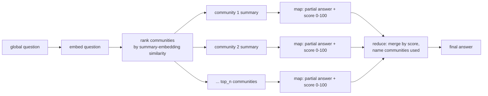

# 09 — Communities and global search (map-reduce over the graph)

## What you will learn
- Why local search (chapter 08) structurally cannot answer a "what are the main themes/open problems across the whole corpus?" question -- with a real, failing example.
- **Community detection**: grouping the graph into densely-connected clusters of entities with Leiden, run through Neo4j's GDS (Graph Data Science library), and what *modularity* actually measures.
- How each community gets its own LLM-written report (title, summary, key findings, importance rating), cached to disk and stored on the graph.
- **Global search**: a map-reduce pattern -- ask every relevant community for a partial answer and a relevance score, then merge the best ones into one final answer that names its sources.
- Why community ids are not stable across re-detections, and what that means for when to rebuild.

## Why local search fails on global questions

Chapter 08's local search always starts from a *seed*: `hybrid_search_entities` finds the entities closest to the question, then the pipeline walks one or two hops out from there. That works well when a question is about specific things ("how does GNN-RAG retrieve subgraphs?"). It has no answer for a question that isn't about any particular entity, but about the *whole document* -- there is no single seed to start from.

Here is a real run of chapter 08's `just ask` against exactly that kind of question:

```bash
just ask q="What are the main open problems and future directions the survey identifies?" mode="graph"
```

```
──────────────────────────────── answer (graph) ────────────────────────────────
The provided context does not contain a specific list of "main open problems" or
a detailed section on "future directions" for the primary survey being discussed
(which appears to be a survey on GraphRAG, based on the description in ).

While the context mentions that the survey's Section 10 "provides an outlook on
future directions", it does not list what those specific directions or open
problems are. The context primarily lists references to other papers (such as
surveys on Graphs and LLMs, Medical LLMs, and KBQA) and their authors, but does
not provide the content of the "future directions" section of the main survey.

Therefore, the specific main open problems and future directions are **not in
the documents**.
citations: ['b742937d01e608d02f0340532a6e54750942a5e9c923fd3221eea586be9bfced:9']
context: {'mode': 'graph', 'n_entities': 8, 'n_triples': 30, 'n_chunks': 10, 'budget_used': 2713}
```

This isn't a bug: it is the correct, honest answer for what local search actually does. `hybrid_search_entities` picked 8 seed entities close to the question's wording, expanded 30 triples and 10 chunks around them, and none of that neighbourhood happens to be the survey's own "Future Directions" section -- because the question is about the whole document's themes, not about any one entity's neighbourhood. Local search has no mechanism to step back and summarize "the graph" as a whole; it only ever sees a local patch of it.

## Community detection: grouping the graph before asking about it

Microsoft's GraphRAG paper solves this by pre-computing a second view of the graph: instead of asking "what's near this entity?", group entities into *communities* -- clusters where entities are much more connected to each other than to the rest of the graph -- and write one summary per community, once, ahead of time. A global question is then answered by reading through those summaries instead of the raw graph.

### Leiden, modularity, in plain words

**Leiden** is a graph-clustering algorithm. In plain words: it repeatedly tries moving a single node into a neighbouring community and asks "does this make the *modularity* better?" Modularity is a score that answers one question: "are there more edges packed inside these groups than we'd expect if the same number of edges were scattered around at random?" A partition with high modularity means the community boundaries actually line up with real clusters of connection, not an arbitrary chopping-up of the graph. Leiden keeps moving nodes until modularity stops improving, then it collapses each community into one super-node and repeats the whole process on that smaller graph -- which is why it naturally produces several *levels*: many small communities at level 0, progressively fewer and bigger ones at higher levels, down to one coarsest partition at the top level.

`00_setup.md` confirmed GDS (`gds.version()` returns `2.13.12`) is installed on this stack, so chapter 09 uses the real Leiden algorithm through GDS rather than the `networkx.community.louvain_communities` fallback the task allows for a stack without GDS. Louvain (the fallback) is Leiden's direct ancestor and optimizes the same modularity score with the same move-and-collapse idea; Leiden mainly fixes a technical flaw in Louvain (it can produce disconnected "communities") and is the better choice whenever it's available, which is why the code below never touches the networkx path.

### `detect()`, step by step

```python
def detect(random_seed: int = 42) -> dict:
    run_query("MATCH (k:Community) DETACH DELETE k")
    run_query(f"CALL gds.graph.drop('{_PROJECTION_NAME}', false) YIELD graphName RETURN graphName")

    run_query(
        f"""
        CALL gds.graph.project(
            '{_PROJECTION_NAME}', 'Entity',
            {{ALL: {{type: '*', orientation: 'UNDIRECTED', properties: 'weight'}}}}
        ) YIELD graphName, nodeCount, relationshipCount
        """
    )
    stats = run_query(
        f"""
        CALL gds.leiden.write('{_PROJECTION_NAME}', {{
            writeProperty: 'community',
            relationshipWeightProperty: 'weight',
            includeIntermediateCommunities: true,
            randomSeed: $seed,
            concurrency: 1
        }}) YIELD communityCount, modularity, ranLevels, nodePropertiesWritten
        """,
        seed=random_seed,
    )[0]
    run_query(f"CALL gds.graph.drop('{_PROJECTION_NAME}') YIELD graphName RETURN graphName")
    ...
```

- **Drop old `Community` nodes first.** Leiden assigns community ids fresh, arbitrarily, on every run -- they are not stable identifiers. If a re-run reused an old `(id, level)` node for a now-completely-different set of members, that node would silently keep a stale `title`/`summary` that no longer describes its members. `DETACH DELETE` first guarantees every `detect()` starts from a clean slate.
- **`gds.graph.project('entities', 'Entity', ...)` projects only the `Entity` label.** This is the whole trick for excluding `MENTIONS` (the `Chunk -> Entity` relationship) from the clustering: `MENTIONS` always has a `Chunk` endpoint, and `Chunk` was never included in the projection, so there is nothing to filter by relationship type -- a plain label projection already leaves only `Entity`-`Entity` relationships (`PROPOSED_BY`, `EVALUATED_ON`, `IMPROVES_UPON`, ...).
- **`orientation: 'UNDIRECTED'`** matters because modularity is defined over undirected edges: "A improves on B" and "B improves on A" should count as the same connection for clustering, even though the domain graph stores the relationship as directed.
- **`relationshipWeightProperty: 'weight'`** makes Leiden treat a relationship the extraction was more confident about (chapter 05's `graph_writer` sets `weight` on every domain relationship) as a stronger pull between its two entities.
- **`includeIntermediateCommunities: true`** asks Leiden to keep every level of its hierarchy, not just the final one. GDS writes this back as a *single* array property on each node -- `community = [level0_id, level1_id, ..., levelN_id]`, ordered from the finest partition (most communities) to the coarsest (fewest, matching `communityCount`). There is no separate `intermediateCommunityIds` property, despite some GDS documentation implying one.
- **`concurrency: 1`.** GDS parallelises Leiden's local node-moving phase, and even with a fixed `randomSeed` that parallel scheduling can non-deterministically change which node "wins" a tie -- measured 241 vs 242 communities across two runs at default concurrency against the *same unchanged graph*. Forcing `concurrency: 1` made two same-graph runs land on identical partitions (0 entities differed). It does **not**, however, make a full upstream pipeline replay (chapter 05 wipe+rewrite, then chapter 06 resolution) reproduce the same partition -- see "When to rebuild communities" below.
- **Drop the projection when done.** GDS keeps a projected graph in memory until told to drop it; leaving it around wastes memory and would collide with the next `detect()` call trying to project under the same name.

The write-back loop then reads `Entity.community` (the array GDS wrote) and, for every level, `MERGE`s a `(:Community {id, level})` node and an `(:Entity)-[:IN_COMMUNITY]->(:Community)` edge -- `MERGE` rather than `CREATE` because this runs once per level per entity and must not duplicate the relationship if called twice for the same level.

Real numbers from this project's graph (1,731 `Entity` nodes, 1,692 non-`MENTIONS` `Entity`-`Entity` relationships after chapter 06's resolution):

| level | community count |
|---|---|
| 0 (finest) | 398 |
| 1 | 261 |
| 2 | 239 |
| 3 (top / coarsest) | 235 |

`global_search` and `summarize_communities` default to the **top level** (fewest, most thematic communities) -- that is what a "what are the main themes" question needs; the finer levels exist mainly so a future `local_search`-style drill-down could zoom in on a sub-topic, which this chapter does not build.

## A real community table

Top level (level 3), largest communities by member count, straight from `level_sizes(3)`:

| id | size | sample members |
|---|---|---|
| 30 | 103 | Retrieval Task, EtD, QFS, Graph-Based Indexing (G-Indexing), Ego Graph Retrieval |
| 215 | 82 | Wei-Hung Weng, Sukwon Yun, Bojian Hou, Bowen Jin, Heng Ji |
| 178 | 70 | Graph Reasoning for Question Answering with Triplet Retrieval, Jina Suh, Xiang Lisa Li, Zhentao Xu, Xiaofeng Wang |
| 61 | 61 | MMGCN, Zhangyang Wang, Neil Shah, Hengyun Li, Towards Foundation Models for Knowledge Graph Reasoning |
| 200 | 53 | Empowering Language Models with Knowledge Graph Reasoning for Open-Domain QA, Zhixiao Qi, Bill Yuchen Lin, Henghui Zhu, Ziyi Yang |
| 217 | 52 | Nelson F. Liu, Zornitsa Kozareva, Sergey Edunov, Barlas Oguz, Jiho Kim |
| 209 | 51 | Soyeong Jeong, Hao Sun, Binyuan Hui, RiddleSenseQA, EMNLP 2023 |
| 226 | 46 | Boli Chen, Jiawei Liu, Zefeng Chen, Mingwei Sun, Supportiveness-based Knowledge Rewriting for RAG |

235 communities exist at the top level in total, 111 of them with >= 3 members (`_DEFAULT_MIN_SIZE`) -- the ones `summarize_communities()` actually writes a report for. The pattern in the "sample members" column is a real, useful signal: a survey paper's knowledge graph naturally produces two kinds of communities -- clusters of **method/concept entities** that co-occur because a paper's text relates them (`Retrieval Task`, `EtD`, `Graph-Based Indexing`), and clusters of **author/citation entities** that co-occur because they wrote or cited the same papers together. Both are legitimate communities; the report prompt below treats them the same way.

## Summarizing a community

For every community with at least `min_size` members, `_report_input()` builds a bounded prompt: up to 40 members (name, type, description), up to 40 internal relationships ranked by weight, and up to 2 example passages that mention any member. Bounding all three (`_MAX_MEMBERS_IN_PROMPT`, `_MAX_INTERNAL_RELS_IN_PROMPT`, `_MAX_PASSAGES_IN_PROMPT`) matters for the same reason chapter 08 capped triples at 60: community 30 alone has 103 members, and sending all of them plus every relationship between them would blow the context window for no benefit -- a report only needs enough material to describe the theme, not a full listing.

```python
def _report_prompt(report_input: dict) -> list[dict]:
    lines = ["## Members"]
    for m in report_input["members"]:
        lines.append(f"- {m['name']} ({m['type']}): {m['description']}")

    lines.append("\n## Internal relationships")
    for r in report_input["internal_rels"]:
        desc = f" -- {r['description']}" if r.get("description") else ""
        lines.append(f"- {r['subject']} -> {r['rel']} -> {r['object']}{desc}")

    lines.append("\n## Example passages")
    for p in report_input["passages"]:
        lines.append(f"[{p['id']}] {p['text']}")

    user_content = "\n".join(lines)
    system = (
        "You are summarising one community (a densely-connected cluster of entities) from a "
        "knowledge graph built from a technical survey paper. Using only the members, "
        "relationships and passages given, write a short report: a specific title, a 2-4 "
        "sentence summary, 3-6 concrete key findings, and an importance rating from 0 (minor) "
        "to 10 (central to the document). Do not invent members or facts not grounded below."
    )
    return [
        {"role": "system", "content": system},
        {"role": "user", "content": user_content},
    ]
```

The response is parsed straight into a Pydantic model (the same `chat_json(messages, Schema)` pattern chapters 04-08 use):

```python
class CommunityReport(BaseModel):
    title: str = Field(description="Short, specific name for this cluster of entities")
    summary: str = Field(description="2-4 sentences describing what this community is about")
    key_findings: list[str] = Field(description="3-6 bullet-point findings, grounded in the members/relationships given")
    rating: float = Field(ge=0, le=10, description="How important this community is to the overall document, 0-10")
```

`summarize_communities()` is cache-first: it checks `data/extracted/communities/<id>.json` before calling the LLM, and on a cache hit it still writes the cached fields back onto the current `Community` node (`_restore_cached_report`) rather than only printing them -- because `detect()` wipes and rebuilds `Community` nodes on every run, a cache *file* existing on disk does not by itself mean the *graph* node still carries the summary.

### Two real community reports

**Community 47** (101 members, rating 9.0) -- `data/extracted/communities/47.json`:

> **GraphRAG Architecture: GNN-Based Retrieval and Subgraph Extraction Strategies**
>
> This community centers on the GraphRAG framework, which integrates Graph Neural Networks (GNNs) and specific retrieval algorithms to extract relational knowledge from graph databases. It details the pipeline stages of Graph-Based Indexing, Graph-Guided Retrieval, and Graph-Enhanced Generation, highlighting how methods like GNN-RAG and EtD utilize message-passing mechanisms to score and retrieve relevant subgraphs. The cluster also encompasses specific implementations such as Antgroup's DB-GPT-based system and various subgraph retrieval techniques, including BFS and extended Prize-Collecting Steiner Tree algorithms, to balance retrieval accuracy with computational efficiency.
>
> Key findings:
> - GraphRAG operates through a three-stage pipeline: Graph-Based Indexing (G-Indexing), Graph-Guided Retrieval (G-Retrieval), and Graph-Enhanced Generation (G-Generation).
> - GNN-based retrievers, such as GNN-RAG and EtD, encode graph data to score retrieval granularities based on query similarity; EtD specifically iterates using LLaMA2 for edge selection and GNNs for node embeddings.
> - Subgraph retrieval is preferred for capturing comprehensive relational contexts, with methods like G-Retriever employing an Extended PCST algorithm.
> - Antgroup's GraphRAG implementation is built on DB-GPT and uses BFS to traverse subgraphs during retrieval, extracting triples from documents with LLMs.
> - Classical GNN architectures (GCN, GAT, GraphSAGE) are identified as foundational message-passing models underlying more complex retrieval mechanisms.
> - The framework addresses the retrieval efficiency/accuracy trade-off with hybrid, multi-stage strategies: rule-based candidate selection followed by embedding-based refinement.

**Community 197** (72 members, rating 8.0) -- `data/extracted/communities/197.json`:

> **Integration of Knowledge Graphs and LLMs for Domain-Specific Reasoning and Retrieval**
>
> This community centers on a cluster of 2024 research papers that explore the synergy between Large Language Models (LLMs) and Knowledge Graphs (KGs) to enhance reasoning, retrieval, and domain-specific question answering. The works span diverse applications, including medical diagnostics (Alzheimer's disease), financial analysis, and general natural language processing. Key methodologies involve Graph Neural Networks (GNNs), Retrieval-Augmented Generation (RAG), and prompt-based collaboration schemes to bridge the gap between structured graph data and unstructured language.
>
> Key findings:
> - DALK (2024) targets Alzheimer's disease questions by dynamically co-augmenting LLMs with Knowledge Graphs built from scientific literature.
> - Medical Graph RAG (2024) proposes a framework for safe medical LLMs using Graph Retrieval-Augmented Generation.
> - "Explore then Determine" (EtD) is a GNN-LLM synergy framework for reasoning over knowledge graphs.
> - "Graph Neural Network Enhanced Retrieval for Question Answering of LLMs" (2024) uses GNNs to improve retrieval mechanisms for LLM-based QA.
> - "Retrieval-Augmented Generation for Natural Language Processing" (2024) provides a broad RAG survey that contextualizes these graph-based methods.
> - "Large Language Models in Finance: A Survey" (2024) shows graph-LLM integration techniques being applied in a specialized vertical (finance).

## Global search: map-reduce over community summaries



**Map.** `_candidate_communities()` picks the `top_n` communities whose summary embedding is closest to the question's embedding (or every summarized community, if there are `<= top_n` of them). For each candidate, `_map_partial_answer()` sends *only that community's summary and findings* -- never the raw graph -- and asks for a partial answer plus a 0-100 relevance score:

```python
def _map_partial_answer(question: str, community: dict) -> dict:
    findings = "\n".join(f"- {f}" for f in community["findings"] or [])
    user_content = (
        f"Community: {community['title']}\nSummary: {community['summary']}\nKey findings:\n{findings}\n\n"
        f"Question: {question}"
    )
    system = (
        "You are one of many analysts, each given a different community summary from a knowledge "
        "graph. Using ONLY the community summary and findings above, answer the question as far as "
        "this community lets you, and rate how relevant/useful your answer is from 0 (not relevant) "
        "to 100 (directly and fully answers it). If this community says nothing relevant, return an "
        "empty answer and a score of 0."
    )
    ...
```

**Reduce.** `_reduce_partial_answers()` drops every partial with a zero score or an empty answer, sorts the rest by score, and asks the LLM to merge them into one answer that ends with a line naming which communities it actually used:

```python
def _reduce_partial_answers(question: str, partials: list[dict]) -> str:
    used = [p for p in partials if p["score"] > 0 and p["answer"].strip()]
    used.sort(key=lambda p: p["score"], reverse=True)
    if not used:
        return "not in the documents"

    blocks = "\n\n".join(f"[Community {p['id']}: {p['title']}, relevance {p['score']:.0f}] {p['answer']}" for p in used)
    system = (
        "You are combining partial answers from several communities of a knowledge graph into one "
        "final answer. Merge them, remove redundancy, prefer higher-relevance answers, and end with "
        "a line 'Communities used: <id: title, ...>' naming every community you actually drew on."
    )
    ...
```

### A real global search trace

```bash
just ask-global q="What are the main open problems these papers identify for Graph RAG?"
```

Partial answers (`top_n=8`, one map call per community + one reduce call = 9 LLM calls total):

| community | score | partial answer (trimmed) |
|---|---|---|
| 193 -- Graph Representation Strategies and Retrieval Refinement | 60 | Implies open problems: 1D sequences can't represent 2D graphs; retrieved subgraphs need filtering; multi-source info needs compression/aggregation. |
| 47 -- GraphRAG Architecture: GNN-Based Retrieval | 60 | Trade-off between retrieval efficiency and accuracy; balancing computational cost with comprehensive relational context extraction. |
| 16 -- Research Cluster on Graph-LLM Integration | 10 | Summary focuses on contributions (GraphTranslator, RaFe), doesn't list open problems explicitly. |
| 86 -- Convergence of Graph Learning and LLMs | 10 | Focuses on the field's convergence and a 2024 survey, no explicit open problems. |
| 106 -- G-Retriever | 10 | States the paper addresses textual graph QA via RAG, no explicit open problems listed. |
| 75 -- Graph RAG for Query-Focused Summarization (authorship) | 0 | (empty -- purely an authorship/publication cluster) |
| 197 -- Integration of KGs and LLMs for Domain-Specific Reasoning | 0 | Focuses on methodologies/applications, no explicit challenges mentioned. |
| 91 -- LLM-GNN Integration for Graph Downstream Tasks | 0 | Notes only that this domain is distinct from GraphRAG proper. |

Final answer:

> Based on the provided partial answers, the main open problems identified for Graph RAG (and related Graph-LLM integration) are:
>
> 1. **Inefficient Representation of Graph Structures:** representing 2D graph structures with standard 1D sequences hinders effective LLM processing.
> 2. **Retrieval Noise and Relevance Filtering:** retrieved subgraphs often contain irrelevant data, needing filtering (LLM-based pruning, Personalized PageRank).
> 3. **Information Aggregation and Compression:** need to compress and aggregate multi-source information without losing critical context.
> 4. **Trade-off Between Efficiency and Accuracy:** balancing computational efficiency against comprehensive relational-context extraction.
>
> Communities used: 193: Graph Representation Strategies and Retrieval Refinement in LLM-Augmented Knowledge Graphs, 47: GraphRAG Architecture: GNN-Based Retrieval and Subgraph Extraction Strategies

Contrast this with chapter 08's answer to the same underlying question ("not in the documents") -- global search found a real answer because it starts from summaries that already cover the whole graph, not from a local neighbourhood that happened not to include the survey's own "future directions" section.

## Cost table

| operation | LLM calls |
|---|---|
| `detect()` | 0 (pure GDS, no LLM) |
| `summarize_communities()`, cache-cold | 1 chat + 1 embed per community that needs summarizing (111 communities at `min_size=3`, top level, on the graph used here) |
| `summarize_communities()`, cache-warm | 0 (cache hit restores the report onto the node) |
| `global_search(question, top_n=8)` | `top_n` map calls (1 chat each) + 1 reduce call = `top_n + 1` (9, for `top_n=8`) + 1 embed call for the question |

Summarizing all 111 top-level communities took roughly 28-30 minutes wall clock against the remote Ollama box (~15s/community: one `chat_json` call plus one `embed` call each) -- exactly why the disk cache under `data/extracted/communities/` is committed: re-running `summarize_communities()` afterward is instant as long as the community ids didn't change.

## When to rebuild communities

Rebuilding (`detect()` followed by `summarize_communities()`) is **not free** and is **not perfectly reproducible**, for a specific, measured reason: Leiden clusters by relationship `weight`, and `weight` drifts slightly every time the upstream pipeline (chapter 05's wipe+rewrite from `data/extracted/chunks/*.json`, then chapter 06's resolution) runs, because `graph_writer`'s `ON MATCH SET rel.weight = (rel.weight + r.weight) / 2` and `apoc.refactor.mergeNodes`'s merge order are not perfectly order-stable across separate replays. A handful of borderline entities can land in a different community after a full replay, which reassigns that community a new, arbitrary id -- so a cached report keyed by the *old* id no longer matches. Measured coverage of "does the existing cache still cover this run's big communities" has ranged from about 29% to 55% across replays of the full pipeline, never 100%.

Practical rule: **rebuild communities only after the domain graph itself changed** (new documents extracted, chapter 06 resolution re-run with a different threshold, or a manual graph edit) -- not on every test run or every `just ask-global`. `summarize_communities()` is safe to call repeatedly after a rebuild: it is cache-first, so it only pays the LLM cost for the communities whose id/membership actually changed enough to be new.

## Key takeaways
- Local search cannot answer a question about the whole corpus because it has no seed to start from; global search sidesteps that by pre-computing one summary per densely-connected cluster and answering from those summaries instead of the raw graph.
- Leiden (via GDS) clusters the `Entity`-only subgraph by modularity -- projecting only the `Entity` label is what excludes `MENTIONS` from the clustering, no relationship-type filter needed.
- `includeIntermediateCommunities: true` writes one array property per entity (finest to coarsest level); global search and summarization default to the coarsest (top) level because that is what a "main themes" question needs.
- Community ids are arbitrary and are reassigned on every `detect()` call -- never assume `(id, level)` is a stable identity across reruns; `detect()` handles this by dropping and rebuilding every `Community` node from scratch each time.
- Global search costs `top_n + 1` LLM calls per question (plus one embed) after the one-time, cached cost of summarizing every community; that asymmetry -- expensive to build the summary layer once, cheap to query it many times -- is the whole point of the map-reduce pattern.

Next: [10_updates_and_evaluation.md](10_updates_and_evaluation.md) -- adding/changing/removing a document without rebuilding everything, a small evaluation set, cost/latency, pitfalls and a production checklist.
