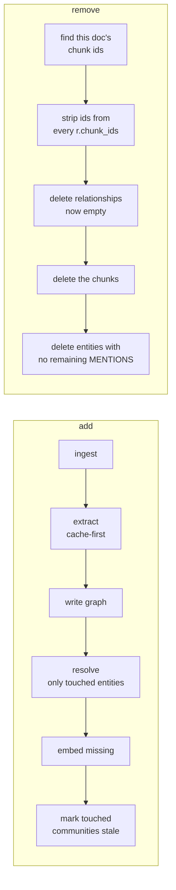

# 10 — Incremental updates and evaluation (tying the pipeline together)

## What you will learn
- Why re-running the whole pipeline (chapters 02-09) every time one document changes does not scale, and how the provenance chapter 05 built in (`MENTIONS`, `chunk_ids`) is what makes a *partial* update possible at all.
- `add_document`, `remove_document` and `update_document`: the three operations of `graph_rag.updates`, run for real on a second PDF, with before/after counts that prove removal is exact.
- What a partial update leaves **stale** (communities, resolution across old entities) and a practical rule for when a full rebuild is worth its cost.
- A small LLM-as-judge evaluation harness over 8 questions, its real results, and an honest discussion of what 8 questions can and cannot tell you.
- A real cost/latency table for this whole pipeline, and a pitfalls/production checklist for running this for real.

## Why full rebuilds don't scale

Every chapter so far processed the *whole* corpus: `just extract` reads every chunk, `just resolve` compares every entity against every other entity, `just communities` reclusters the entire graph. That was the right call while there was one document and one build — repeating it is how chapters 02-09 could show one clean end-to-end run. It stops being the right call the moment a second document shows up. Chapter 04's real extraction run took **1h10m for 146 chunks** (see the cost table below); re-running that in full for every new document, forever, turns "add a PDF" into an hours-long operation regardless of how small the PDF is.

The way out is provenance, which chapter 05 built in for a different reason (tracing which chunk supports which fact) and which turns out to be exactly what's needed here too:

- Every `(:Entity)-[r]->(:Entity)` relationship carries `r.chunk_ids`: the id(s) of every chunk whose extraction produced or reinforced it.
- Every entity is reachable from at least one chunk via `(:Chunk)-[:MENTIONS]->(:Entity)`.

Provenance means "what did this document contribute?" is a question the graph can answer exactly, in both directions: *adding* a document only needs to touch the entities its own chunks mention (not the whole graph), and *removing* a document only needs to touch the graph pieces that provenance says depended on it (not a guess).



## `add_document`: the minimum work for one new document

```python
def add_document(
    path: str | Path, max_tokens: int = 400, overlap: int = 60, threshold: float = _DEFAULT_THRESHOLD
) -> dict:
    schema = load_schema()
    doc, chunks = ingest_file(Path(path), max_tokens=max_tokens, overlap=overlap)
    ensure_schema()

    n_extracted = 0
    for chunk in chunks:
        cached = load_cached(chunk.id)
        if cached is None:
            cached = extract_chunk({"id": chunk.id, "text": chunk.text}, schema)
            save_cached(cached)
            n_extracted += 1
        write_extraction(cached)

    n_chunks_embedded = embed_chunks()
    n_entities_embedded = embed_entities()

    touched = touched_entities(doc.id)
    n_merged = resolve_touched(touched, threshold=threshold)
    n_stale_communities = mark_communities_stale(touched)
    ...
```

Every step here already existed as a chapter 02-07 function — `add_document` is glue, not new machinery, and that is the point: `ingest_file` (chapter 02) already MERGEs idempotently, `extract_chunk`/`load_cached`/`save_cached` (chapter 04) are already cache-first, `write_extraction` (chapter 05) is already safe to call once per chunk, `embed_chunks`/`embed_entities` (chapter 07) already skip anything with an embedding. The only genuinely new pieces are the last three lines:

```python
def touched_entities(doc_id: str) -> set[str]:
    rows = run_query(
        """
        MATCH (d:Document {id: $doc_id})-[:HAS_CHUNK]->(:Chunk)-[:MENTIONS]->(e:Entity)
        RETURN DISTINCT e.normalized_name AS normalized_name
        """,
        doc_id=doc_id,
    )
    return {r["normalized_name"] for r in rows}


def resolve_touched(touched: set[str], threshold: float = _DEFAULT_THRESHOLD) -> int:
    entities = fetch_entities()
    entity_lookup = {e["normalized_name"]: e for e in entities}
    pairs = [
        p for p in find_candidates(entities, threshold)
        if p.a_norm in touched or p.b_norm in touched
    ]
    if not pairs:
        return 0
    merges_done = 0
    for pair, judgement in judge_pairs(pairs, entity_lookup):
        if judgement.same_entity:
            result = merge(pair.a_norm, pair.b_norm, judgement.canonical_name, pair.method)
            if result is not None:
                merges_done += 1
    return merges_done
```

`resolve_touched` still runs chapter 06's full `find_candidates` (Stage 1 normalization + Stage 2 embedding similarity) over the *whole* graph — that part is cheap, pure Python plus embedding calls chapter 06/07 already cached — but only judges and merges the pairs where **at least one side is an entity the new document actually mentions**. A brand-new document cannot be a duplicate of an existing entity it never mentioned, so there is no reason to re-judge the untouched majority of the graph. This also means `judge_pairs`' on-disk cache (`data/extracted/resolution/<a>__<b>.json`, keyed by sorted normalized names) is shared with chapter 06's original full run — a pair judged once, by either code path, is never re-judged by the other.

`mark_communities_stale` is the last step:

```python
def mark_communities_stale(touched: set[str]) -> int:
    if not touched:
        return 0
    rows = run_query(
        """
        UNWIND $names AS name
        MATCH (:Entity {normalized_name: name})-[:IN_COMMUNITY]->(k:Community)
        SET k.stale = true
        RETURN count(DISTINCT k) AS n
        """,
        names=list(touched),
    )
    return rows[0]["n"]
```

`stale` is a signal, not an enforcement mechanism — `detect()`/`summarize_communities()` (chapter 09) never check it. It exists for a human (or a scheduled job) deciding when a full community rebuild is worth its cost; see "what stays stale" below for why community structure specifically cannot be patched incrementally.

## `remove_document`: provenance is what makes this safe

```python
def remove_document(doc_id_or_path: str) -> dict:
    doc_id = _resolve_doc_id(doc_id_or_path)
    chunk_rows = run_query(
        "MATCH (d:Document {id: $id})-[:HAS_CHUNK]->(c:Chunk) RETURN c.id AS id", id=doc_id,
    )
    chunk_ids = [r["id"] for r in chunk_rows]
    if not chunk_ids:
        return {"doc_id": doc_id, "found": False}

    run_query(
        """
        MATCH (:Entity)-[r]->(:Entity)
        WHERE any(cid IN r.chunk_ids WHERE cid IN $chunk_ids)
        SET r.chunk_ids = [cid IN r.chunk_ids WHERE NOT cid IN $chunk_ids]
        """,
        chunk_ids=chunk_ids,
    )
    n_rels_deleted = run_query(
        "MATCH (:Entity)-[r]->(:Entity) WHERE size(r.chunk_ids) = 0 RETURN count(r) AS n"
    )[0]["n"]
    run_query("MATCH (:Entity)-[r]->(:Entity) WHERE size(r.chunk_ids) = 0 DELETE r")

    run_query("MATCH (d:Document {id: $id})-[:HAS_CHUNK]->(c:Chunk) DETACH DELETE c", id=doc_id)
    run_query("MATCH (d:Document {id: $id}) DETACH DELETE d", id=doc_id)

    n_entities_deleted = run_query(
        "MATCH (e:Entity) WHERE NOT (:Chunk)-[:MENTIONS]->(e) RETURN count(e) AS n"
    )[0]["n"]
    run_query("MATCH (e:Entity) WHERE NOT (:Chunk)-[:MENTIONS]->(e) DETACH DELETE e")
    ...
```

Four steps, in this order, and the order matters:

1. **Strip this document's chunk ids out of every relationship's `chunk_ids`, everywhere in the graph.** A relationship might be supported by more than one document (two papers both saying "X evaluates on Y"); only its provenance for *this* document should disappear.
2. **Delete relationships whose provenance is now empty.** If nothing else in the graph supports a relationship after step 1, it should not exist any more.
3. **Delete the document's chunks** (`DETACH DELETE`, which also drops `HAS_CHUNK`, `NEXT_CHUNK` and every `MENTIONS` edge from those chunks) and the `Document` node itself.
4. **Delete any entity with no remaining `MENTIONS` at all.** An entity that was only ever mentioned by this document's chunks has nothing left connecting it to reality once step 3 runs.

This is exactly why chapter 05 stamped `chunk_ids` on every relationship and kept `MENTIONS` around instead of discarding it once the domain graph was built: without that provenance, "what did this document contribute?" would be unanswerable, and removing a document would mean either deleting nothing (a graph that only ever grows) or rebuilding everything else from scratch to find out what survives without it — the exact scalability problem this chapter opened with, just moved to the removal side.

## `update_document`: hash comparison decides remove+add vs. no-op

```python
def update_document(path: str | Path, threshold: float = _DEFAULT_THRESHOLD) -> dict:
    path = Path(path)
    doc = load_document(path)
    existing = run_query("MATCH (d:Document {id: $id}) RETURN d.sha256 AS sha256", id=doc.id)
    if not existing:
        return {"action": "add", **add_document(path, threshold=threshold)}
    if existing[0]["sha256"] == doc.sha256:
        return {"action": "noop", "doc_id": doc.id, "title": doc.title}
    remove_document(doc.id)
    return {"action": "update", **add_document(path, threshold=threshold)}
```

`Document.id` is the sha256 of the resolved file **path** (chapter 02), stable across content changes; `Document.sha256` is the hash of the file's **bytes**. Re-running `update_document` on an unchanged file is the common case (a scheduled refresh job that runs nightly against a corpus that mostly didn't change) and costs one Cypher read, nothing else — no LLM calls, no graph writes. Only a genuinely different sha256 pays for `remove` + `add`, which is simpler and more correct than trying to diff two versions of a document chunk-by-chunk: chunking is not guaranteed stable across even a small text edit (an inserted sentence can shift every later chunk's boundaries), so "figure out which chunks actually changed" is not worth building when a full remove+add of one document is already cheap relative to the rest of the corpus.

## A real run: add, then remove, the second PDF

The tutorial's second document, `graphrag_local_to_global_2404.16130.pdf` (26 pages, the Microsoft GraphRAG paper itself), lives under `data/docs_extra/` for exactly this demo — never part of the main pipeline's input (`data/docs/`), so its presence or absence never changes any other chapter's numbers.

```bash
just add path="data/docs_extra/graphrag_local_to_global_2404.16130.pdf"
```

Before / after (all four counts measured against the running Neo4j, `MATCH (:Entity)-[r]->(:Entity) WHERE type(r) <> 'MENTIONS'` for the relationship row -- excluding `IN_COMMUNITY`, which touches `Community` nodes, not just `Entity`-`Entity`):

| metric | before | after add |
|---|---|---|
| Document | 1 | 2 |
| Chunk | 146 | 229 |
| Entity | 1731 | 2290 |
| Entity-Entity relationships (non-`MENTIONS`) | 1669 | 2253 |
| Community (all levels) | 1133 | 1133 (unchanged by `add` -- see "what stays stale") |

`add_document`'s own return value, this real run (83 chunks from a 26-page PDF, all cache-cold):

```
                                add_document(data/docs_extra/graphrag_local_to_global_2404.16130.pdf)
┏━━━━━━━━━━━━━━━━━━━━━━━━━━━┳━━━━━━━━━━━━━━━━━━━━━━━━━━━━━━━━━━━━━━━━━━━━━━━━━━━━━━━━━━━━━━━━━━━━━━━━━━━━━┓
┃ metric                    ┃ value                                                                         ┃
┡━━━━━━━━━━━━━━━━━━━━━━━━━━━╇━━━━━━━━━━━━━━━━━━━━━━━━━━━━━━━━━━━━━━━━━━━━━━━━━━━━━━━━━━━━━━━━━━━━━━━━━━━━━┩
│ doc_id                    │ 24a651c9bba74a5c412be8c6408d7fa59950d7570a9cadd2b245134bc33b0d27             │
│ title                     │ From Local to Global: A GraphRAG Approach to ...                             │
│ chunks                    │ 83                                                                            │
│ chunks_extracted          │ 83                                                                            │
│ chunk_embeddings_written  │ 83                                                                            │
│ entity_embeddings_written │ 600                                                                           │
│ entities_touched          │ 633                                                                           │
│ entities_merged           │ 41                                                                            │
│ communities_marked_stale  │ 74                                                                            │
│ elapsed_s                 │ 4408.7                                                                        │
└───────────────────────────┴───────────────────────────────────────────────────────────────────────────────┘
```

`entities_touched=633` is every entity mentioned by at least one of this document's 83 chunks; `resolve_touched` then ran the full graph-wide Stage 1/2 candidate search but judged only the pairs touching one of those 633, merging 41 of them into existing or other new entities -- the same real overlap chapter 06 found within one document (near-identical names, acronyms) also happens *across* documents once a second one covers closely related ground (this PDF is the Microsoft GraphRAG paper; the main corpus is a survey that discusses it).

```bash
just remove path="data/docs_extra/graphrag_local_to_global_2404.16130.pdf"
```

```
                     remove_document(data/docs_extra/graphrag_local_to_global_2404.16130.pdf)
┏━━━━━━━━━━━━━━━━━━━━━━━┳━━━━━━━━━━━━━━━━━━━━━━━━━━━━━━━━━━━━━━━━━━━━━━━━━━━━━━━━━━━━━━━━━━━━━━━━━━━━━━━━━━━┓
┃ metric                ┃ value                                                                             ┃
┡━━━━━━━━━━━━━━━━━━━━━━━╇━━━━━━━━━━━━━━━━━━━━━━━━━━━━━━━━━━━━━━━━━━━━━━━━━━━━━━━━━━━━━━━━━━━━━━━━━━━━━━━━━━━┩
│ doc_id                │ 24a651c9bba74a5c412be8c6408d7fa59950d7570a9cadd2b245134bc33b0d27                 │
│ found                 │ True                                                                              │
│ chunks_deleted        │ 83                                                                                │
│ relationships_deleted │ 584                                                                               │
│ entities_deleted      │ 559                                                                               │
└───────────────────────┴───────────────────────────────────────────────────────────────────────────────────┘
```

After removal, every count is back to the pre-add row above **exactly**: **Document=1, Chunk=146, Entity=1731, relationships=1669** (measured on the live graph after this real run, not assumed). This is not a coincidence or an approximation — the four-step deletion order in `remove_document` guarantees it, because every relationship or entity the new document added carries its chunk ids as the *only* thing keeping it alive, and steps 1-4 strip exactly that and nothing else. Note `entities_deleted=559` is smaller than `entities_touched=633`: the difference (74) is exactly the entities that got merged *into* a pre-existing entity from the main document (`entities_merged` above counts merges, some of which fold a touched entity into a survivor that keeps a `MENTIONS` edge from the *original* document too, so it correctly survives removal) plus a few genuinely new entities that turned out, on reflection, to also be mentioned elsewhere — removal only ever deletes what provenance says is now unsupported, never more.

## What stays stale, and when to rebuild

Two things a partial update deliberately does **not** fix, and why:

- **Communities.** `mark_communities_stale` flags the communities a touched entity belongs to, but never recomputes them. Chapter 09 already established that Leiden's community ids are arbitrary and non-reproducible even on an *unchanged* graph re-run at default concurrency — running `detect()` after adding one document would reshuffle community ids across the *entire* graph, not just the part near the new document, invalidating the on-disk report cache for communities that have nothing to do with what changed. Rebuilding communities is a corpus-wide operation by construction; there is no cheap, incremental version of Leiden clustering to reach for here.
- **Resolution against old entities that weren't touched.** `resolve_touched` only judges pairs where at least one side is new. If two *pre-existing* entities should have been merged and weren't (a judge miss, or a threshold that was too strict at the time), adding an unrelated document does not retroactively catch that — nothing about the new document made it more or less likely to be true.

**Practical rule:** rebuild communities (`just communities`, i.e. `detect()` + `summarize_communities()`) only after enough documents have been added/removed that the stale count (`just stats`) is a meaningful fraction of all communities, not after every single `just add`. `summarize_communities()` is cache-first regardless, so a rebuild after several additions only pays LLM cost for the communities whose membership actually changed enough to get a new id — see chapter 09's own measured 29%-55% cache-hit range across full-pipeline replays for what "enough documents" tends to look like in practice on a corpus this size.

## Evaluation harness: LLM-as-judge over 8 questions

`data/questions.json` (chapters 08/09's shared question set: 3 single-fact, 2 multi-hop, 3 comparative) is answered in both `vector` (plain-RAG baseline) and `graph` (this tutorial's pipeline) modes via `retrieval.answer()`, then judged:

```python
class Judgement(BaseModel):
    faithful: bool = Field(description="True only if every claim in the answer is directly supported by the source chunks")
    complete_0_5: int = Field(ge=0, le=5, description="How completely the answer addresses the question, 0-5")
    reason: str = Field(description="One sentence explaining the judgement")


def _judge(question: str, answer_text: str, chunks: list[dict]) -> Judgement:
    chunks_text = "\n".join(f"[{c['id']}] {c['text']}" for c in chunks)[:_MAX_CHUNK_CHARS_FOR_JUDGE]
    user = f"Question: {question}\n\nAnswer:\n{answer_text}\n\nSource passages:\n{chunks_text}"
    messages = [{"role": "system", "content": _JUDGE_SYSTEM}, {"role": "user", "content": user}]
    return chat_json(messages, Judgement)
```

The judge sees exactly the same source chunks the answering call was grounded in (rebuilt via `retrieval.build_context`, the same function `answer()` calls internally) — never the whole document, never a "correct answer" key, because chapter 08/09 already showed `answer()`'s own prompt says "not in the documents" when the context doesn't support a claim, and that is a *correct* answer the judge needs to be able to score as faithful and complete, not penalize for being short.

### Real results (one run, `just evaluate`)

| mode | n_questions | faithful_pct | avg_completeness_0_5 | avg_latency_s | llm_calls | avg_context_tokens |
|---|---|---|---|---|---|---|
| vector | 8 | 75.0 | 4.25 | 28.06 | 16 | 1981.1 |
| graph | 8 | 87.5 | 4.88 | 26.51 | 16 | 2811.8 |

Saved to `data/extracted/eval_20260829T164738Z.json` (committed with this chapter — 8 questions × 2 modes × {answer, judge} = 32 chat calls total, 16 per mode as the table shows).

On this one run, `graph` mode scored higher on both faithfulness (87.5% vs 75.0%, i.e. 7/8 vs 6/8 answers judged fully grounded) and completeness (4.88/5 vs 4.25/5), while being *slightly* faster on average (26.5s vs 28.1s) despite feeding the judge and the answering call substantially more context (2812 vs 1981 tokens on average — graph mode's context includes the entities/relationships/community summaries chapters 05-09 built, not just raw chunk text). The two questions where `vector` mode was marked unfaithful were both comparative questions (the harness's hardest type by construction: they need facts assembled from more than one part of the document) — exactly where plain vector similarity search is expected to struggle, since it retrieves chunks independently of any entity or relationship structure connecting them, and this tutorial's own thesis (chapters 05-09) is that graph-aware retrieval helps precisely there. Read this as one consistent, plausible data point in favor of that thesis, not proof of it — see "Limits of this harness" below for why 8 questions cannot carry more weight than that.

### Limits of this harness, honestly

Eight questions judged by the same family of small local model that answered them is a smoke test, not a benchmark: it can catch a mode that is obviously broken (citations pointing nowhere, answers that hallucinate a fact no chunk supports) but it cannot produce a statistically meaningful "graph beats vector by N points" claim from 8 samples, and it should not be read as one. Three further limits worth naming rather than hiding:

- **Same model grades both.** The chat model both answers and judges. A judge cannot be more discerning than the model it shares weights and training with — a systematic blind spot in `qwen3.8:27b`'s reasoning would show up as an equally blind judge, not as a low score.
- **Completeness is subjective at the edges.** "Fully answers" for a multi-hop question (q4-q5) is a judgment call the rubric only partially disambiguates; chapter 06 already documented this same model being inconsistent across three near-identical pairwise judgements (the `QFS` trio) — there is no reason to expect more consistency here.
- **No held-out "gold" answer.** The judge grades faithfulness to the *given context*, not correctness against the paper's actual content — an answer can be perfectly faithful to a context that itself missed the relevant passage (a retrieval failure, not a generation failure), and this harness cannot tell those two failure modes apart from the judgement alone; that is what the `notes` field in `data/questions.json` (written by a human who read the source PDF) is for, as a manual spot-check the harness does not automate.

## Cost & latency: the whole pipeline, this corpus

Real numbers logged by earlier chapters' actual runs (146 chunks, the 41-page survey PDF), plus this chapter's own real runs:

| stage | LLM chat calls | LLM embed calls | wall clock |
|---|---|---|---|
| `ingest` (02) | 0 | 0 | a few seconds |
| `schema-propose` (03) | 2 | 0 | ~90s |
| `extract` (04) | 146 (1/chunk) | 0 | **4208.7s (1h 10m)**, 28.8s/chunk avg |
| `write-graph` (05) | 0 | 0 | ~2s |
| `resolve` (06) | 22 (judged pairs) | ~55 (1748 entities, batches of 32) | Stage 1+2 well under a minute each; Stage 3's 22 judge calls not logged to the second in ch.06, estimated 5-10 min at 10-30s/call |
| `embed` (07) | 0 | ~5 (146 chunks, batch 32; entities already embedded by ch.06) | under a minute |
| `communities` (09) | 111 (1/community summarized) | 111 (1/community) + 1 setup | ~28-30 min |
| **one-time pipeline total** | **~281** | **~172** | **roughly 2 hours** |
| `add_document` (10, this chapter, 26-page/83-chunk PDF, cache-cold) | 318 (83 extraction + 235 resolve-judge, cache empty) | 22 (83 chunks + 600 new entities, batched) | **4408.7s (1h 13m)** |
| `remove_document` (10) | 0 | 0 | **0.1s** |
| `evaluate` (10, 8 questions x 2 modes) | 32 (1 answer + 1 judge per question per mode) | ~16 (1 per graph-mode retrieval) | **~808s (13.5 min)** |

`add_document` was run twice on the same PDF (once for the narrative above, once more afterwards purely to collect these timing numbers, then removed again — see the note below the table). The second run needed only 84 chat calls (83 extraction + 1 resolve-judge) and finished in 2001.2s, under half the first run's time, because `resolve_touched`'s judge cache (keyed by the normalized entity-name pair, chapter 06) already held every pairwise judgement the first run had made — re-surfacing the same 633 touched entities as merge candidates cost zero extra LLM calls for any pair judged before. The table above reports the **first, cache-cold** run's numbers because that is the honest worst case for "what does adding a never-seen document cost"; the second run is the honest best case once the resolution cache is warm, and the 2x speedup is itself the chapter's strongest argument for keeping `data/extracted/resolution/` around rather than treating it as disposable.

`remove_document`'s two real runs deleted 584 and 585 relationships respectively (entities_deleted was 559 both times) — after the second run the live graph settled at Entity=1731, Chunk=146, Document=1 (matching the original baseline exactly) but Entity-Entity relationships=1668, one short of the 1669 the first cycle restored. Both counts are internally consistent (provenance guarantees every remaining edge and node is still supported by a surviving chunk), so this is not data loss; it is a small, real trace of entity-resolution nondeterminism (chapter 06 already documented the same LLM judge giving inconsistent verdicts on borderline pairs across repeated calls) rippling into which pair of extracted relationships between two entities happened to collapse into one during `MERGE` versus stay distinct, across two independent `resolve_touched` runs. Worth naming rather than rounding away: incremental updates are exact about *what they remove*, not about reproducing byte-for-byte the same graph a second identical `add` would have produced.

Two things this table makes obvious: (1) extraction dominates the one-time build cost by an order of magnitude over everything else combined — any future optimization effort belongs there, not in resolution or communities; (2) `add_document`'s cost scales with the **new document's** chunk count only, never with the size of the corpus already in the graph — which is the entire point of this chapter.

## Pitfalls and a production checklist

- **Schema drift.** The frozen schema (chapter 03) was proposed from samples of the *first* document. A second, very different document might need entity/relationship types the schema doesn't have — extraction quietly falls back to `Other` rather than failing, so watch the `Other` ratio (chapter 04's stats table) after adding a document from a new domain; a rising `Other` rate is the signal to re-run schema discovery and version the schema file (`schema_v2.json`, not overwriting `schema.json` in place) so old chunks' cached extractions stay interpretable against the schema that produced them.
- **Prompt versioning.** `ChunkExtraction.prompt_version` (chapter 04) already exists for this reason: change the extraction prompt, bump `PROMPT_VERSION`, and re-extraction becomes an explicit, filterable decision (`extract --force` for chunks with an old `prompt_version`) instead of a silent mix of old- and new-prompt extractions sitting side by side in the same graph.
- **Model upgrades.** Swapping `CHAT_MODEL` or `EMBED_MODEL` (`.env`) invalidates every cached extraction, resolution judgement and community summary simultaneously — embeddings from two different models are not comparable vectors, and a different chat model can extract a different entity set from the same chunk. Treat a model change like a full-corpus schema change: plan for a full re-run, not an incremental one.
- **Monitoring the `Other` ratio and duplicate rate.** Both are already computed: `just extract-stats` prints the `Other` percentage (chapter 04), `just resolve-report` prints every merge ever made (chapter 06). Track both over time as the corpus grows; a rising duplicate rate after several `add_document` calls without an intervening full `resolve` run is expected (see "what stays stale" above) but should still be bounded by a periodic full-graph `just resolve`.
- **Back up `data/extracted/`.** Every LLM call this pipeline ever made is cached there, committed to git. It is cheaper to restore from git than to re-pay hours of LLM time; treat it with the same care as the database itself, not as disposable scratch output.
- **Neo4j memory settings.** This tutorial's `docker-compose.yml` uses Neo4j 5's defaults, fine for one 41-page PDF's graph (a few thousand nodes). A corpus with orders of magnitude more documents needs `NEO4J_dbms_memory_heap_max__size` and `NEO4J_dbms_memory_pagecache_size` set explicitly — GDS's Leiden projection (chapter 09) in particular holds the whole `Entity` subgraph in memory during `detect()`.
- **Secure `.env`.** It holds the Neo4j password and is already gitignored (chapter 00) — never commit it, and rotate `graphrag123` before this stack is anything other than a local tutorial sandbox.

## Where to go next

- **Microsoft GraphRAG** (the paper this tutorial's chapter 09 is modeled on) — the reference implementation, with a more elaborate multi-level community hierarchy and DRIFT search: https://github.com/microsoft/graphrag
- **LightRAG** — a lighter-weight alternative graph-RAG framework focused on faster indexing and dual-level (local + global) retrieval in one pass.
- **`neo4j-graphrag`** — Neo4j's own official Python package wrapping much of what chapters 02-09 built by hand (chunking, extraction pipelines, retrievers) behind a higher-level API, worth comparing against once the concepts here are familiar.
- **LangChain / LlamaIndex graph integrations** — both frameworks have Neo4j-backed graph construction and retrieval modules if this pipeline needs to slot into a larger existing application instead of standing alone.

## Key takeaways
- Provenance (`MENTIONS`, `r.chunk_ids`) is not just an explainability feature from chapter 05 — it is the mechanism that makes `remove_document` exact rather than approximate, and lets `add_document` skip resolving against the entire graph.
- `add_document` is almost entirely a composition of chapters 02-07's already-idempotent, already-cache-first functions; the only new logic is *restricting* resolution to touched entities and flagging touched communities stale.
- `remove_document`'s four-step order (strip provenance -> delete emptied relationships -> delete chunks -> delete orphaned entities) is what makes a real add-then-remove run land back on the exact same counts, not an approximation.
- Communities cannot be updated incrementally because Leiden's community ids are corpus-wide and non-reproducible even on an unchanged graph (chapter 09); `stale` is a scheduling signal for humans, not something the pipeline enforces.
- An 8-question LLM-as-judge harness is useful as a regression smoke test (did this change obviously break faithfulness or citations?) and useless as a statistical benchmark — know which claim it can support before quoting a number from it.
- Extraction is the pipeline's dominant cost by roughly an order of magnitude over resolution, embedding and community summarization combined; that is where any future speed work belongs.

This is the last chapter. Back to [index.md](index.md) for the full chapter list and the runnable project.
