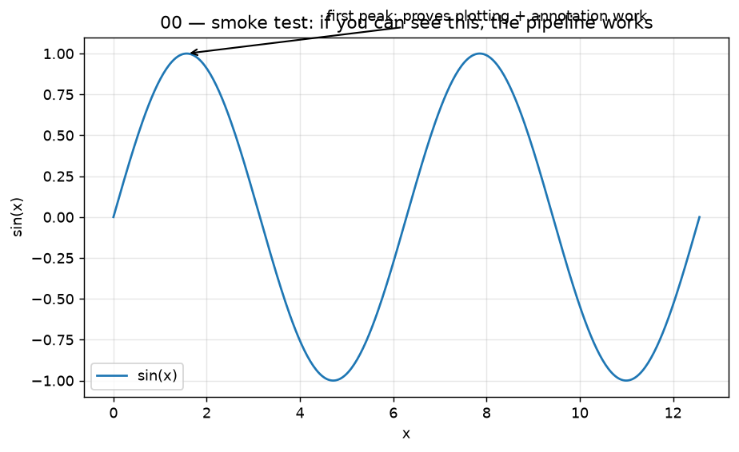

# 00 — Setup: what this tutorial is, and how to run it

## What you will learn
- What this tutorial is (and is not), and how it relates to `../llm_training/`
- The two small real models we use everywhere, and why those two
- How to install the project and run the tests and figures
- The `save()` contract: how a figure gets from Python code into a chapter's markdown
- How a from-scratch block gets checked for correctness against `torch`/`transformers`
- A one-line map of chapters 01–10

## What this tutorial is, and is not

`llm_blocks` is a visual, hands-on tour of the *parts* that make up a modern LLM (large
language model) such as Qwen3.5 or Qwen3.8: tokens and embeddings, attention, positional
encoding, normalization, the feed-forward block, linear attention, and how a model turns
logits (raw scores) into the next token. Every block in this tutorial follows the same
four-step recipe:

1. **Intuition** — a plain-language explanation with an everyday analogy, no equations yet.
2. **Maths** — the actual formula, each one followed by a sentence that says what it means.
3. **Code** — a small, readable `torch.nn.Module` written from scratch (no borrowed
   implementation), copied straight from `project/src/llm_blocks/`.
4. **Verification and plots** — the from-scratch code is checked numerically against the
   reference implementation in `torch` or `transformers`, and a figure shows the idea
   visually.

This tutorial is **not** about training. It never touches a GPU, never computes a
gradient at scale, and never produces a checkpoint you could actually use. Everything here
runs on a laptop CPU in well under a minute per chapter, because the point is to see *how a
block works*, not to train one. If you want to see these blocks assembled into a model that
is actually trained from scratch, fine-tuned, and evaluated — including the tokenizer,
the data pipeline, the training loop, and the GPU — that is the sister tutorial,
[`../llm_training/`](../../../training_and_self_evolution/tutorials/llm_training/00_setup.md). That tutorial's chapter 03
(`../llm_training/03_model_from_scratch.md`) instantiates the same block types this tutorial explains,
at a size that actually trains on one RTX 4090.

Read the chapters in order (01 → 10); each one assumes the vocabulary introduced in the
ones before it. Every abbreviation (LLM, MLP, GQA, RoPE, KV cache, MoE, …) is explained the
first time it appears in a chapter, even if an earlier chapter already explained it — you
should be able to open any single chapter and follow it.

## The two small real models

Two small real models are downloaded once (cached under `~/.cache/huggingface`) and reused
across every chapter that needs a "does this match a real model" check:

| model | size | why this one |
|---|---|---|
| `HuggingFaceTB/SmolLM2-135M` | 135M params, ~270 MB | The simplest real transformer: a plain Llama-style decoder (standard multi-head attention, RoPE — rotary position embedding — RMSNorm — root-mean-square normalization — SwiGLU — SiLU-gated linear unit — MLP), small enough to run a forward pass and draw an attention heat-map in well under a second on a laptop CPU. |
| `Qwen/Qwen3.5-0.8B` | 0.8B params, ~1.6 GB | Uses exactly the same *block types* as Qwen3.8-27B — grouped-query attention (GQA) with QK-norm and an output gate, Gated DeltaNet (linear attention), SwiGLU, RMSNorm, partial RoPE — just fewer layers and smaller dimensions. What you see here generalizes directly to the 27B model; we never need to download 27B of weights to explain how it works. |

Both loaders live in `project/src/llm_blocks/reference.py`: `load_smollm()` and
`load_qwen35_08b()`. Both are lazy (nothing downloads until you call them), CPU-only,
loaded in `float32` for numerical precision (not speed), and wrapped in
`functools.lru_cache` so a chapter that calls one from several plot functions only pays the
download-and-load cost once per process. Only the chapters that need a real model call
these — most chapters use tiny random tensors instead, which is why `just plots` (see
below) takes seconds, not minutes.

## Install and run

This project uses [`uv`](https://docs.astral.sh/uv/), a fast Python package manager, and
[`just`](https://just.systems/), a command runner. Both are already installed if you have
used `../llm_training/`; if not, `just` installs with one line (see Troubleshooting below)
and `uv` with the official installer.

```bash
cd project
uv sync              # creates .venv/, installs torch, transformers, matplotlib, ...
just test            # CPU-only tests, no downloads, well under 2 minutes
just plots           # regenerates every figure this tutorial embeds, into ../assets/
```

`uv sync` reads `pyproject.toml` and resolves exact versions; on this Mac (Apple Silicon,
arm64) every dependency listed there — `torch`, `transformers`, `numpy`, `matplotlib`,
`scikit-learn`, `typer`, `rich`, `safetensors` — has a prebuilt wheel, so `uv sync` finishes
in seconds and never compiles anything.

`just` with no arguments (or `just --list`) prints every recipe with its one-line comment.
The ones you will use most:

| recipe | what it does |
|---|---|
| `just test` | `pytest tests/ -q -m "not slow"` — every test in `tests/`, skipping any marked `slow` (a test is `slow` if it needs a model download or takes more than 30 seconds) |
| `just test-all` | the same, but including the `slow` tests |
| `just plots` | loops over every `src/llm_blocks/ch*.py` module and runs its `plots` command, regenerating every figure this tutorial embeds |
| `just plots-real` | same idea, but only for chapters that define a `plots_real` command (the few figures that need a downloaded model) |
| `just lint` | `ruff check src tests` |
| `just clean-assets` | deletes every PNG in `../assets/`, so you can confirm `just plots` regenerates all of them from nothing |

## The files in `project/`

```
project/
├── pyproject.toml              # dependency list read by uv (torch, transformers, matplotlib, ...)
├── uv.lock                     # exact resolved versions, so every chapter you run matches this one
├── justfile                    # short commands: sync, test, test-all, plots, plots-real, lint, clean-assets
├── .gitignore                  # keeps .venv/, __pycache__/, .pytest_cache/, .ruff_cache/ out of git
├── src/llm_blocks/
│   ├── __init__.py
│   ├── plotting.py             # ASSETS, style(), save(), annotate_arrow() — every chapter's figures go through this
│   ├── reference.py            # load_smollm(), load_qwen35_08b() — the two real models, lazy and cached
│   ├── ch00_setup.py           # this chapter: check, plots
│   └── chNN_<name>.py          # one module per later chapter, each with a `plots` Typer command
└── tests/
    ├── test_00_setup.py        # save()/style() behave correctly, ch00_setup.plots runs
    └── test_NN_<name>.py       # one file per later chapter: from-scratch block vs. reference, assert_close
```

Every later chapter adds exactly one `chNN_<name>.py` module and one `test_NN_<name>.py`
file; nothing about `plotting.py`, `reference.py`, or the `justfile` needs to change,
because `just plots` and `just test` already discover new chapters automatically by
globbing `src/llm_blocks/ch*.py` and `tests/test_*.py` respectively.

## How a figure gets from code to chapter: the `save()` contract

Every figure in this tutorial is produced by code, never hand-drawn, so that the picture
always matches the current implementation. The rule that makes this work is in
`project/src/llm_blocks/plotting.py`:

```python
ASSETS = Path(__file__).resolve().parents[3] / "assets"

def save(fig: plt.Figure, name: str) -> Path:
    """Write `fig` to `ASSETS/{name}.png` (tight bbox, 130 dpi) and close it."""
    ASSETS.mkdir(parents=True, exist_ok=True)
    path = ASSETS / f"{name}.png"
    fig.savefig(path, bbox_inches="tight")
    plt.close(fig)
    return path
```

`ASSETS` always resolves to `llm_blocks/assets/` — the folder next to this file, one level
above `project/` — no matter where you run the command from. Every chapter module has a
`plots` command that calls `save(fig, "NN_name")` once per figure it owns; the chapter's
markdown then embeds it with ``. If a figure appears in a
chapter, it exists because `just plots` produced it — there is no other way for a PNG to
get into `assets/`. `style()` sets the shared look (figure size, DPI, grid transparency, a
fixed colour cycle) once per process, so every figure in every chapter looks like it came
from the same tutorial, not eleven different ones. `annotate_arrow()` is a small helper for
the "look here" arrows you will see throughout — chapter 00's own smoke figure below uses
it.

This chapter's own figure exists to prove the pipeline works before any real block is
implemented on top of it:



If you can see the curve and the arrow, `style()`, `annotate_arrow()`, and `save()` all
work end to end — `just plots` will work for every later chapter too. Its code is
`ch00_setup.py`'s `_smoke_figure()`, and the same code runs from `check` (which also
prints library versions and confirms the assets directory exists) and from `plots`.

## How a from-scratch block is verified

Writing a block "from scratch" only proves something if it is checked against a
trustworthy reference. The pattern every later chapter follows —
`torch.testing.assert_close`, which compares two tensors element-by-element and raises an
assertion error with a readable diff if they differ by more than a tolerance — looks like
this (chapter 05 implements the real thing; this is the shape of the test, not the actual
code):

```python
import torch

class RMSNorm(torch.nn.Module):
    """From-scratch root-mean-square normalization (no mean-centering, unlike LayerNorm)."""

    def __init__(self, dim: int, eps: float = 1e-6):
        super().__init__()
        self.weight = torch.nn.Parameter(torch.ones(dim))
        self.eps = eps

    def forward(self, x: torch.Tensor) -> torch.Tensor:
        rms = x.pow(2).mean(dim=-1, keepdim=True).add(self.eps).rsqrt()
        return x * rms * self.weight


def test_rmsnorm_matches_torch():
    x = torch.randn(4, 16, 64)
    ours = RMSNorm(64)
    reference = torch.nn.RMSNorm(64)
    reference.weight.data.copy_(ours.weight.data)  # same weights, else the numbers can't match

    torch.testing.assert_close(ours(x), reference(x), rtol=1e-4, atol=1e-5)
```

Two details matter here and apply to every verification test in this tutorial: the two
modules must be given **the same weights** before comparing (otherwise you are testing
random initialization, not the maths), and the tolerance (`rtol`/`atol`) is loose enough to
absorb floating-point rounding but tight enough to catch a real bug — `1e-4`/`1e-5` is the
default used throughout. A block that downloads nothing and needs no network — like
`RMSNorm` above — runs in every `just test`. A test that needs a real model (comparing our
attention implementation to `SmolLM2-135M`'s actual weights, for example) is marked
`@pytest.mark.slow` and only runs with `just test-all` or explicitly with `-m slow`;
`plots-real` recipes are allowed to download because generating a figure once and
committing the PNG is a one-time cost, unlike running a test on every `just test`.

## Reading guide

Chapters build on each other in order, but each one is also short enough to read on its
own if you already know the earlier material — jump straight to the chapter that answers
today's question and use the others as reference.

- **01 — Neural networks in one page**: neurons, matrix multiply, activation functions
  (ReLU, GELU, SiLU), loss, gradient descent.
- **02 — Tokens, embeddings, softmax**: text → tokens → vectors; cosine similarity; a 2-D
  map of real embeddings; softmax and temperature.
- **03 — Attention**: Q/K/V, the causal mask, multi-head and grouped-query attention (GQA),
  QK-norm, the output gate; real attention heat-maps; the KV cache.
- **04 — Positional encoding**: why attention alone is blind to word order; sinusoidal
  encoding; RoPE (rotary position embedding) as a rotation; partial RoPE; YaRN intuition.
- **05 — Normalization and residuals**: the residual stream as a highway; LayerNorm vs
  RMSNorm; pre-norm vs post-norm; what breaks without normalization.
- **06 — MLP and MoE**: the feed-forward block as key–value memory; SwiGLU gating; Mixture
  of Experts (MoE): router, top-k, load balancing.
- **07 — Linear attention and DeltaNet**: why attention cost grows with length squared;
  linear attention as a recurrent state; Gated DeltaNet; Qwen3.5/3.8's hybrid stack.
- **08 — Output and sampling**: logits → probabilities → next token; temperature, top-k,
  top-p, min-p, repetition penalty; perplexity.
- **09 — Training dynamics**: loss curves, learning-rate schedules, Adam/AdamW intuition,
  gradient clipping, bf16 vs fp32, scaling laws.
- **10 — Assembling a transformer**: put every block together, load real Qwen3 weights
  into *our* blocks, and match `transformers`' output token-for-token.

## Troubleshooting

| symptom | cause | fix |
|---|---|---|
| `import torch` takes several seconds the first time in a new shell | `torch` is a large package; the OS has to page its shared libraries in from disk | expected — subsequent imports in the same process (e.g. the second test in a `pytest` run) are instant; this is not a hang |
| a figure command exits fine but no window ever appears | on macOS the default matplotlib backend can try to open a GUI window, which fails or hangs outside a full desktop session | `plotting.py` calls `matplotlib.use("Agg")` before importing `pyplot`, forcing the non-interactive backend that renders straight to a PNG file — nothing should ever try to pop up a window; if you see one, you imported `pyplot` before `plotting.py` ran |
| `load_smollm()` or `load_qwen35_08b()` hangs or fails with a connection error | the model is not yet cached and the network is unavailable, or `HF_HUB_OFFLINE=1` is set from another project | unset `HF_HUB_OFFLINE`, or run once with network access so the weights land in `~/.cache/huggingface`; after that, `HF_HUB_OFFLINE=1` works fine since nothing needs to be re-downloaded |
| `just: command not found` | `just` is not installed | `curl --proto '=https' --tlsv1.2 -sSf https://just.systems/install.sh \| bash -s -- --to ~/.local/bin` (make sure `~/.local/bin` is on `$PATH`) |
| `uv: command not found` | `uv` is not installed | see the install instructions at <https://docs.astral.sh/uv/getting-started/installation/> |

## Exercises

1. Run `just clean-assets` then `just plots` and confirm `assets/00_smoke.png` reappears —
   this is the same guarantee every later chapter's figures rely on.
2. Open `project/src/llm_blocks/plotting.py` and change the colour cycle in `style()`;
   re-run `just plots` and check that the smoke figure's line colour changed.
3. Call `load_smollm()` twice in a row inside a Python REPL and time each call (e.g. with
   `time.perf_counter()`) — explain why the second call is instant.
4. Write a test that changes the tolerance in the `RMSNorm` example above to `rtol=0` and
   explain, in one sentence, why it now fails even though the implementation is correct.
5. Add a `slow` test that calls `load_smollm()` and asserts its output vocabulary size
   matches its tokenizer's vocabulary size; run it with `just test-all` and confirm
   `just test` skips it.

Next: [01_neural_networks_in_one_page.md](01_neural_networks_in_one_page.md) — neurons,
matrix multiply, activation functions, loss, and gradient descent, the last stop before
anything in this tutorial is specific to language models.
