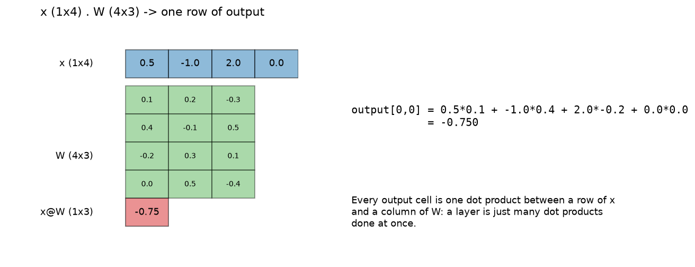
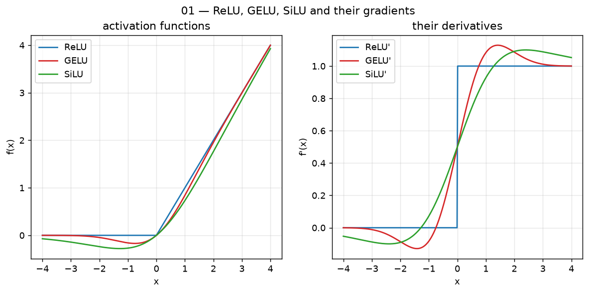
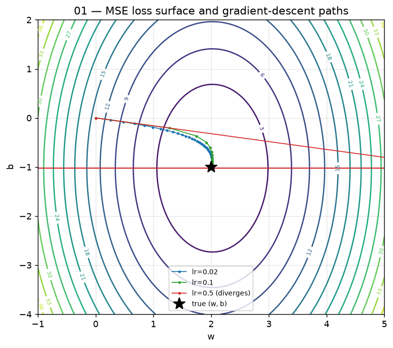
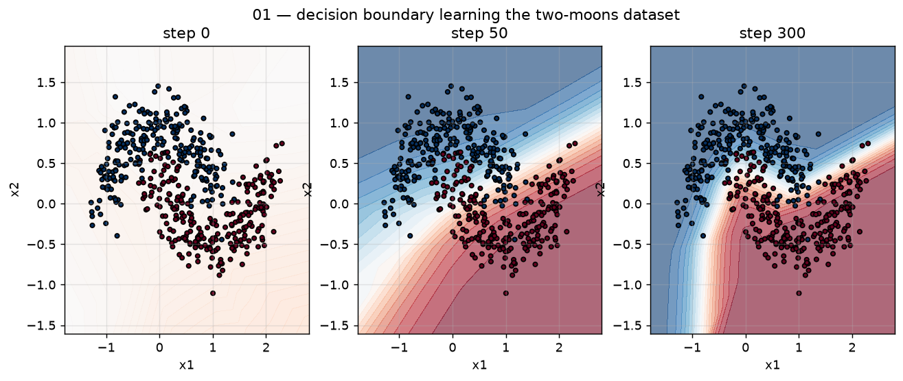
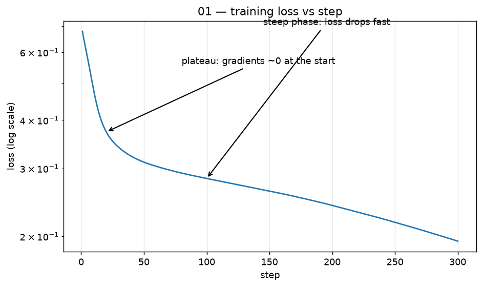

# 01 — Neural networks in one page

## What you will learn
- What a single neuron computes, and why it is just a weighted sum plus a "bend"
- Why a whole layer is one matrix multiplication (matmul), with a picture
- Why you need non-linearity at all — two `Linear` layers back to back collapse into one
- The activation functions used in real LLMs (large language models): ReLU → GELU → SiLU →
  SwiGLU (SiLU-gated linear unit) gating, and why Qwen uses the last one
- What a loss is ("how wrong the model is right now") and what gradient descent does about it
- Backpropagation in one paragraph, and why you almost never write it by hand
- The two-moons demo end to end, with the real numbers this chapter's code produced
- How an LLM like Qwen3.8-27B is "just" this, at a much bigger scale

## 1. What a neuron computes

A single artificial neuron takes a vector of inputs, multiplies each one by a weight, adds
them up, adds one more number (the bias), and then bends the result through a non-linear
function. Think of it like a dimmer switch on a light: each input is a signal, each weight
is how much that particular signal matters to this neuron, the bias shifts the switch's
resting point, and the non-linearity decides how the combined signal actually turns into
brightness — a plain dimmer (no bend) would let you dial brightness up and down forever in
a straight line, but a real bulb has a floor (can't go below off) and often a soft knee near
the top. That "bend" is what the non-linearity is for.

$$z = \sum_i w_i x_i + b, \qquad a = f(z)$$

In words: `z` is the weighted sum of inputs plus a bias, and `a` (the neuron's output,
called its *activation*) is `z` passed through a non-linear function `f`. A layer of a
neural network is just many neurons like this computed side by side, each with its own
weights.

## 2. A layer is a matrix multiply

Stack the weights of every neuron in a layer as rows of a matrix `W`, and computing every
neuron's `z` for one input vector `x` becomes a single matrix multiplication: `x @ W.T + b`
(the `.T` transposes the matrix — swaps its rows and columns — so the shapes line up).
This is the entire reason GPUs matter for deep learning: a matmul is thousands of
independent dot products (a dot product multiplies two vectors element-by-element and
sums the result) that can all run in parallel.



Look at the red cell: it is one dot product between the whole input row and one column of
`W` — every other output cell is the same recipe with a different column. From-scratch
code (`Linear` in `ch01_neural_networks.py`), laid out exactly like `torch.nn.Linear`
(`weight` has shape `(out_features, in_features)`):

```python
class Linear(nn.Module):
    def __init__(self, in_features: int, out_features: int) -> None:
        super().__init__()
        bound = 1 / math.sqrt(in_features)
        self.weight = nn.Parameter(torch.empty(out_features, in_features).uniform_(-bound, bound))
        self.bias = nn.Parameter(torch.empty(out_features).uniform_(-bound, bound))

    def forward(self, x: Tensor) -> Tensor:
        return x @ self.weight.T + self.bias
```

`tests/test_01_neural_networks.py` copies the same weights into a real `torch.nn.Linear`
and checks the two outputs match to `1e-4` — this `Linear` is not a simplification, it
computes exactly what PyTorch's does.

## 3. Why you need non-linearity

If a layer were *only* a matmul, stacking two of them would be pointless: a linear function
of a linear function is still linear, and the whole network — however many layers — would
collapse into a single matrix multiply no bigger than one layer's worth of expressive power.
Here is the four-line proof:

```
layer1(x) = x W1 + b1
layer2(y) = y W2 + b2
layer2(layer1(x)) = (x W1 + b1) W2 + b2 = x (W1 W2) + (b1 W2 + b2) = x W' + b'
```

`W' = W1 W2` and `b' = b1 W2 + b2` are just another single weight matrix and bias — two
`Linear` layers with nothing in between are mathematically identical to one `Linear` layer.
The non-linearity `f` in between (`layer2(f(layer1(x)))`) is what breaks this collapse and
lets depth actually add representational power: without it, a 64-layer network would be no
more expressive than a 1-layer one.

## 4. Activation functions used in LLMs

Four activation functions cover almost every modern LLM. Each is a plain function applied
element-wise (independently to every number in the tensor); the tests in
`tests/test_01_neural_networks.py` check every one of the "from-scratch" versions below
against `torch.nn.functional`.

**ReLU** (rectified linear unit) is the simplest: keep positive numbers, zero out negative
ones.

$$\text{ReLU}(x) = \max(0, x)$$

**GELU** (Gaussian error linear unit) is a smoothed-out ReLU: instead of a hard corner at
zero, it bends gently, so a small negative input isn't necessarily killed outright. There
are two equivalent-ish forms used in practice — the exact one uses the Gaussian error
function `erf`, the tanh approximation is cheaper to compute and is what most LLM code
actually runs:

$$\text{GELU}(x) = x \cdot \Phi(x) = x \cdot \tfrac{1}{2}\left(1 + \text{erf}(x / \sqrt{2})\right)$$

**SiLU** (sigmoid linear unit, also called swish) multiplies `x` by its own sigmoid — a
smooth S-shaped squashing function that maps any number to between 0 and 1:

$$\text{SiLU}(x) = x \cdot \sigma(x), \qquad \sigma(x) = \frac{1}{1 + e^{-x}}$$

```python
def relu(x: Tensor) -> Tensor:
    return torch.clamp(x, min=0.0)

def gelu_tanh(x: Tensor) -> Tensor:
    return 0.5 * x * (1.0 + torch.tanh(math.sqrt(2.0 / math.pi) * (x + 0.044715 * x.pow(3))))

def silu(x: Tensor) -> Tensor:
    return x * torch.sigmoid(x)
```



Look at the left panel: ReLU has a hard corner at zero, GELU and SiLU both bend smoothly
through it (and dip slightly negative just left of zero). The right panel is why that
matters for training: ReLU's derivative jumps from 0 to 1 instantly, while GELU's and
SiLU's derivatives rise smoothly — a smooth derivative gives gradient descent (section 6)
a gentler signal to follow near zero, one reason modern LLMs prefer GELU/SiLU over plain
ReLU.

**SwiGLU** is not a new function but a *gating* pattern used in the feed-forward block of
almost every current LLM (chapter 06 covers the feed-forward block in full; this is the
one-paragraph version). Instead of one matmul then one activation, SwiGLU computes two
matmuls from the same input — a "gate" and a "value" — and multiplies them together:

$$\text{SwiGLU}(x) = \text{SiLU}(x W_{\text{gate}}) \odot (x W_{\text{up}})$$

`⊙` means element-wise multiply. Think of `SiLU(x W_gate)` as a volume knob computed from
the input itself: for every output position, the network learns to compute a number between
roughly 0 and 1 (loosely — SiLU isn't hard-capped at 1) that says "how much of this value
should pass through," and that knob's setting depends on `x`, not on a fixed switch. Qwen
(Qwen3.5 and Qwen3.8) uses exactly this SwiGLU gating in every feed-forward block.

```python
def swiglu(x: Tensor, w_gate: Tensor, w_up: Tensor) -> Tensor:
    gate = silu(x @ w_gate)
    value = x @ w_up
    return gate * value
```

## 5. The loss: "how wrong is the model right now"

A loss function turns "how wrong is the model" into a single number you can take a
derivative of. For the classification problem in this chapter (is a point in the top moon
or the bottom moon?) the standard choice is *cross-entropy*: it compares the model's
predicted probability for the correct class against 1.0, and penalizes confident wrong
answers much more harshly than timid ones (chapters 02 and 08 cover softmax and
cross-entropy in detail — for now, just: lower loss means the model's probabilities line up
with the true labels better).

## 6. Gradients and gradient descent

A gradient is a vector that says, for every parameter, "which direction increases the
loss, and by roughly how much." Gradient descent is: nudge every parameter a small step in
the *opposite* direction, over and over. The everyday picture is a ball rolling downhill on
the loss surface (the loss plotted as a function of the parameters) — the gradient always
points uphill, so subtracting it moves the ball downhill. The learning rate (`lr`) is the
size of each step:

$$p \leftarrow p - \text{lr} \cdot \nabla_p \, \text{loss}$$

Step size matters enormously, and this is the single most common thing to get wrong when
training any neural network. The figure below fits a 2-parameter linear regression
(`y = w·x + b`) — small enough that its loss surface is a 2-D contour plot you can actually
see — and runs plain gradient descent from the same starting point with three learning
rates:



`lr=0.02` crawls toward the minimum (the black star) taking tiny, cautious steps. `lr=0.1`
gets there in a handful of confident steps — this is the "just right" zone. `lr=0.5` is too
big for this surface's curvature: each step overshoots the valley by more than the last one,
and the path spirals out of the frame instead of in — the parameters blow up rather than
converge. This is exactly the "loss goes to NaN (not-a-number)" failure mode in the
Troubleshooting section below: the fix is almost always "lower the learning rate."

## 7. Backpropagation in one paragraph

Computing the gradient of the loss with respect to every parameter in a multi-layer network
by hand would mean applying the chain rule (from calculus: the derivative of a composition
of functions is the product of each function's derivative) layer by layer, back from the
loss to the input. Backpropagation is exactly that chain rule, applied automatically:
PyTorch remembers every operation that produced a tensor (its computation graph) as the
forward pass runs, and `loss.backward()` walks that graph backward once, filling in
`.grad` on every parameter that needed one. You never write backpropagation yourself in
practice — this chapter's training loop uses it in exactly one line, `loss.backward()`,
and the rest is the plain parameter update from section 6 written by hand:

```python
for p in model.parameters():
    p.grad = None          # forgetting this line silently accumulates old gradients
loss.backward()
with torch.no_grad():
    for p in model.parameters():
        p -= cfg.lr * p.grad
```

## 8. Mini-batches and noise

This chapter's demo computes the loss and gradient over *all* 500 points every step (a
"full-batch" update), which is why its loss curve below is almost perfectly smooth. Real
LLM training never does this — the dataset is far too large to fit in memory or compute in
one step — so it computes the loss over a small random subset (a mini-batch) each step
instead. A mini-batch's gradient is a noisy estimate of the true, full-dataset gradient:
it points in roughly the right direction on average, but jitters step to step, which is why
real training-loss curves (chapter 09) look noisier than the smooth curve here. That noise
is not purely a downside — it can help gradient descent escape shallow dips in the loss
surface that a perfectly smooth full-batch gradient would settle into.

## 9. The two-moons demo, end to end

`train_toy()` in `ch01_neural_networks.py` builds the classic "two moons" dataset (500
points forming two interleaved crescents, from `sklearn.datasets.make_moons`) — a problem
that is impossible for a single `Linear` layer to solve (no straight line separates two
interleaved crescents) but easy for `Linear → ReLU → Linear`. It trains an `MLP2` with 2
inputs, 16 hidden units, and 1 output, for 300 steps of plain hand-written SGD (stochastic
gradient descent) at `lr=0.5`, binary cross-entropy loss, no optimizer object — just the
three lines in section 7.



At step 0 the untrained network's boundary is close to a straight, nearly-flat guess — no
better than chance, since the weights start small and random. By step 50 it has already
bent into roughly the right crescent shape. By step 300 it closely traces both moons. This
run's actual numbers, printed by `demo`:

```
MLP2(2 -> 16 -> 1) parameters: 65
  fc1 (Linear 2->16): 48
  fc2 (Linear 16->1): 17
two-moons final train accuracy after 300 steps: 0.934
final loss: 0.1943
```

65 parameters — 48 in the first layer (`2×16` weights + 16 biases) and 17 in the second
(`16×1` weights + 1 bias) — is enough to separate two interleaved crescents with 93.4%
training accuracy. The loss curve over those 300 steps:



The early steps (labelled "plateau") barely move the loss: the network starts near a
symmetric, uninformative guess and the gradient is small. Once the hidden units start
specializing to the moon shapes, the loss drops fast (labelled "steep phase"), then
flattens again as the boundary gets fine-tuned rather than reshaped.

## 10. How an LLM is "just" this, at scale

Every mechanism in this chapter — a matmul, a non-linearity, a loss, a gradient step — is
literally what a large language model is built from; nothing conceptually new gets added
until later chapters (attention, positional encoding, and so on are all still matmuls plus
non-linearities plus gradient descent, just arranged differently). The scale is what
changes. This chapter's `MLP2` has 65 parameters. Qwen3.8-27B (confirmed against its
`transformers` config) has a hidden size of 5120, 64 layers, and roughly 27 billion
parameters in total — about 400 million times more parameters than this chapter's toy
network, trained with the exact same `p -= lr * p.grad` idea (in practice via the AdamW
optimizer, chapter 09) on vastly more data. The next chapters build up, piece by piece, from
this one-page network to that: chapter 02 turns text into the vectors a network like this
one can actually consume.

## Troubleshooting

| symptom | cause | fix |
|---|---|---|
| loss becomes `nan` (not-a-number) partway through training | learning rate too big for the loss surface's curvature — see the `lr=0.5` path in section 6, which overshoots and diverges instead of converging | lower `lr` (try 10x smaller) and/or clip gradients (chapter 09) |
| loss stops improving and every hidden unit outputs exactly 0 | "dead ReLUs": if a ReLU unit's input is always negative, its output and gradient are both permanently 0, so no update can ever revive it | use GELU/SiLU instead (they never fully zero out the gradient), or lower the learning rate so early updates don't push units into the all-negative regime |
| loss looks like it's training on *stale* gradients, or explodes for no visible reason | forgot to reset `.grad` to `None` (or call `optimizer.zero_grad()`) before `loss.backward()` — gradients accumulate (add up) across steps by default in PyTorch | zero every parameter's `.grad` before each `backward()` call, exactly as shown in section 7 |
| the two-moons decision boundary stays a straight line no matter how long you train | the model has no hidden layer (or no non-linearity between two `Linear`s) — see the four-line collapse proof in section 3 | use `MLP2` (or any `Linear → activation → Linear` stack), not a single `Linear` |

## Exercises

1. In `train_toy`, change `lr` to `0.02` and to `2.0` and re-run `plots`; compare the new
   `01_loss_curve.png` and `01_moons_training.png` to the ones in this chapter — which one
   trains slower, and which one fails to converge at all?
2. Swap `MLP2`'s activation from `relu` to `gelu_tanh` or `silu` and re-run `demo` — does
   final accuracy change? Does the loss curve's "steep phase" start earlier or later?
3. Add a third layer (`Linear → activation → Linear → activation → Linear`) to `MLP2` and
   retrain on two-moons — does the decision boundary at step 300 look meaningfully
   different, or was one hidden layer already enough for this dataset?
4. After calling `loss.backward()` in `train_toy`'s loop, print `p.grad.norm()` (the
   gradient's magnitude) for each parameter at steps 1, 50, and 300 — does the gradient
   norm shrink over training, and does that match the loss curve's plateau/steep-phase
   shape?
5. Modify `_fig_loss_surface` to try `lr=0.3` in addition to the three shown — does it
   converge, oscillate without diverging, or diverge like `lr=0.5`? Relate your answer to
   the Hessian (the matrix of the loss surface's curvatures) of this quadratic loss.
