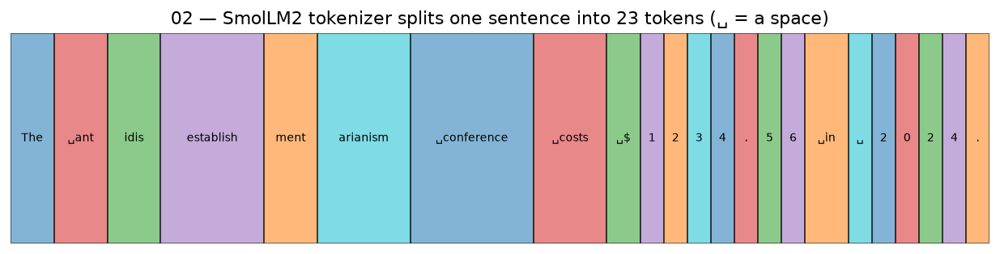
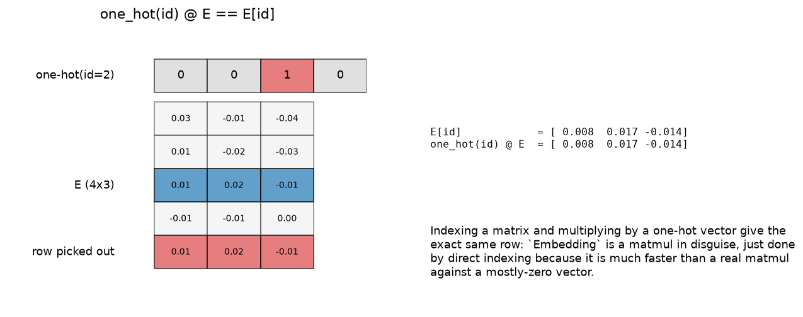
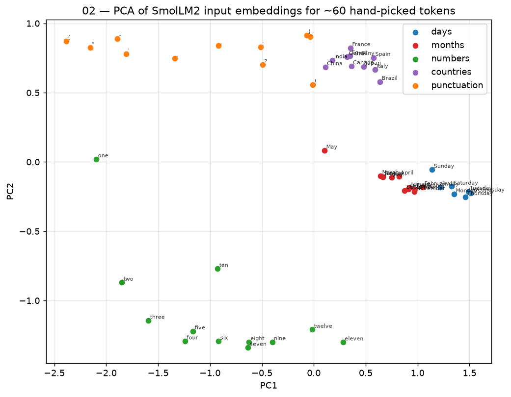
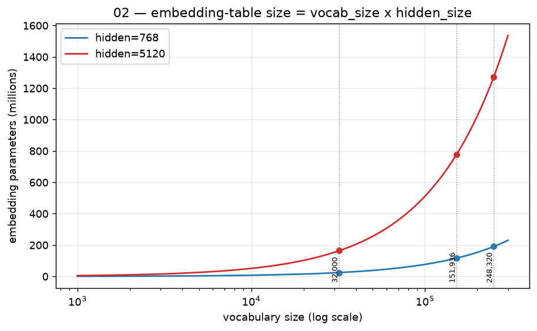
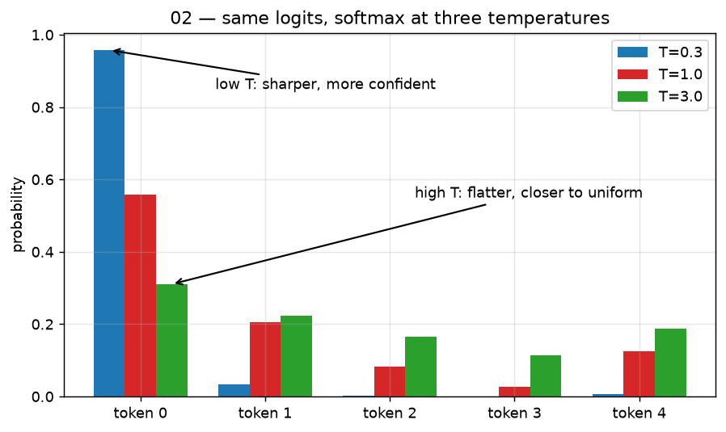
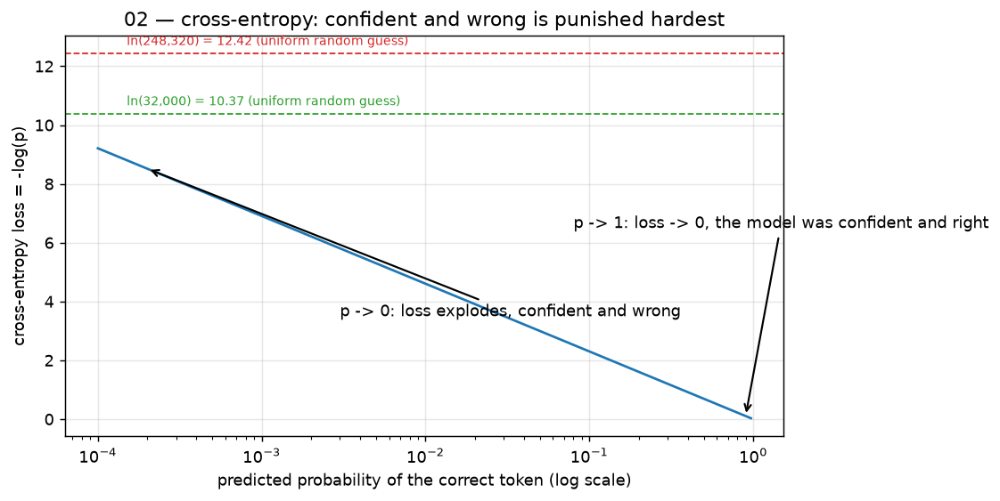

# 02 — Tokens, embeddings, softmax, and the tied LM head

## What you will learn
- Why a model never reads letters: text is first cut into **tokens** by a fixed, non-learned
  tokenizer, and BPE (byte-pair encoding) is how that tokenizer's vocabulary gets built
- The **embedding matrix**: a big lookup table of learned vectors, one row per token id, and
  why "looking up a row" and "multiplying by a one-hot vector" are the same operation
- "The meaning is in the distances": a 2-D picture (PCA) of real embeddings, plus printed
  nearest neighbours, showing that related tokens end up with similar vectors
- Vector size = **hidden size**, and how big the embedding table gets as vocabulary grows
- The **LM head** (language-model head): the reverse lookup that turns a hidden vector back
  into one score per vocabulary entry, and why small models **tie** it to the embedding matrix
- **Softmax** and temperature: turning raw scores into probabilities, and what "temperature"
  does to that distribution
- **Cross-entropy** as "surprise", and why an untrained model's starting loss is `ln(vocab_size)`

## 1. Why models do not read letters

A neural network only ever multiplies matrices of numbers — it has no built-in idea of
"letter" or "word". Before any of that math happens, a **tokenizer** cuts the input text into
a short sequence of integers (**tokens**) from a fixed vocabulary, and the model works
entirely in terms of those integers. `../llm_training/02_tokenizer_and_data.md` covers
training a tokenizer in full; here is the two-sentence version. **BPE (byte-pair encoding)**
starts from raw bytes as the vocabulary, then repeatedly finds the most frequent *pair* of
existing tokens in a training corpus and merges it into one new token, until the vocabulary
reaches its target size. The result is a vocabulary where common whole words get a single
token, rarer words get split into a handful of frequent pieces, and *any* input — emoji,
another language, a typo — still tokenizes, because in the worst case it falls back to
single bytes.

`_fig_tokens_example` in `ch02_tokens_embeddings.py` runs one sentence through the real
SmolLM2-135M tokenizer (`transformers.AutoTokenizer`) and draws every resulting token as a
coloured box:



The sentence was chosen to show two things that trip up a first-time reader of tokenizer
output. First, a rare word — `antidisestablishmentarianism` — splits into five pieces
(`ant`, `idis`, `establish`, `ment`, `arianism`): it never appeared often enough in the
tokenizer's training data to earn its own token, so BPE falls back to smaller, more common
fragments. Second, the number `1234.56` and the year `2024` both split into **individual
digits** (`1`, `2`, `3`, `4`, `.`, `5`, `6` and `2`, `0`, `2`, `4`): most BPE tokenizers
deliberately keep digits as single-character tokens (or close to it) rather than merging
"1234" into one token, because a numeral like that is rare as a whole but its individual
digits are common in every possible combination — merging digits into multi-digit tokens
would blow up the vocabulary for little benefit, and would make it *harder*, not easier, for
the model to do arithmetic digit-by-digit.

## 2. The embedding matrix: a lookup table of learned vectors

A token id is just an integer — say, id `4197`. To do anything useful with it, the model
needs a *vector* (a list of numbers) that carries meaning, not a bare index. The **embedding
matrix** `E` is a `(vocab_size, hidden_size)` table of learned numbers: row `i` of `E` is the
vector for token id `i`. "Embedding" a token is nothing more than reading one row out of this
matrix.



The left panel shows the two equivalent ways to think about this lookup. `one_hot(id)` is a
vector of all zeros except a single `1` at position `id`; multiplying it against `E`
(`one_hot(id) @ E`) zeroes out every row except row `id` and sums what is left — which is
exactly row `id` of `E`. The right panel prints both computations side by side on the same
random `E` and confirms they produce the identical vector. In code, `Embedding` does the
direct-indexing version (`self.weight[ids]`) because it is much cheaper than a real matmul
against a vector that is mostly zero, but the one-hot picture is what justifies calling this
operation "linear" — it is secretly the same kind of matrix multiply as every other layer in
the network:

```python
class Embedding(nn.Module):
    def __init__(self, vocab_size: int, dim: int) -> None:
        super().__init__()
        self.weight = nn.Parameter(torch.randn(vocab_size, dim) * 0.02)

    def forward(self, ids: Tensor) -> Tensor:
        return self.weight[ids]

    def one_hot_lookup(self, ids: Tensor) -> Tensor:
        one_hot = F.one_hot(ids, num_classes=self.weight.shape[0]).to(self.weight.dtype)
        return one_hot @ self.weight
```

`tests/test_02_tokens_embeddings.py` checks `Embedding` against `torch.nn.Embedding` with
copied weights, and separately checks that `forward()` and `one_hot_lookup()` produce
identical outputs for the same ids.

### "The meaning is in the distances"

The numbers inside a single embedding vector are not individually meaningful — what matters
is how a vector's *position* relates to other vectors' positions. Two tokens that behave
similarly in text (two months of the year, two small numbers, two country names) end up with
vectors that point in similar directions, purely because training pushes tokens that appear
in similar contexts toward similar vectors. `_fig_embeddings_pca` picks ~60 tokens by hand —
days, months, numbers, countries, punctuation — reads their real input-embedding vectors out
of SmolLM2-135M, and projects them from `hidden_size` dimensions down to 2 with PCA
(`sklearn.decomposition.PCA`, principal component analysis: the 2-D projection that keeps as
much of the vectors' spread as possible):



Five clean clusters fall out with no supervision at all — the model was never told "these are
months" — purely from how those tokens are used in text. Days and months sit close to each
other (both are calendar words) but form two distinguishable groups; numbers line up in a
rough small-to-large arc; countries cluster together and away from punctuation, which forms
its own separate group in the upper-left. This is what "the meaning is in the distances"
means: nothing about token id `4450` (`" January"`) says "this is a month" — its *neighbours
in vector space* do.

`_write_nearest_neighbours` makes the same point a different way: for a handful of tokens,
it computes cosine similarity (`cos(u, v) = u·v / (‖u‖‖v‖)`, a number from -1 to 1 that
measures how aligned two vectors' directions are, ignoring their length) between that token's
embedding and every other token's embedding, and prints the five closest. Real output on
SmolLM2-135M (`02_nearest_neighbours.txt`):

```
'king' (id=4197) nearest neighbours:
    ' King'         cos=0.838
    'King'          cos=0.733
    ' kings'        cos=0.718
    ' queen'        cos=0.623
    ' Queen'        cos=0.623
'Paris' (id=7042) nearest neighbours:
    'Paris'         cos=0.826
    ' London'       cos=0.597
    ' Berlin'       cos=0.592
    ' Montreal'     cos=0.584
    ' France'       cos=0.582
'eight' (id=4475) nearest neighbours:
    ' seven'        cos=0.886
    ' nine'         cos=0.872
    ' six'          cos=0.865
    ' five'         cos=0.802
    ' four'         cos=0.787
'January' (id=4450) nearest neighbours:
    ' February'     cos=0.913
    ' December'     cos=0.890
    ' November'     cos=0.876
    ' October'      cos=0.860
    ' April'        cos=0.853
'happy' (id=5587) nearest neighbours:
    'happy'         cos=0.736
    ' Happy'        cos=0.692
    ' unhappy'      cos=0.646
    ' happier'      cos=0.630
    ' happiness'    cos=0.628
```

`" king"`'s nearest neighbours are capitalization variants of itself, then `" queen"` — the
model has learned a case-insensitive notion of "king-ness" and, separately, that kings and
queens belong together. `"Paris"`'s neighbours are other national capitals plus `" France"`
itself; `"eight"`'s neighbours are the numbers next to it on the number line; `"January"`'s
neighbours are other months, closest to its actual calendar neighbours (February, December);
and `"happy"`'s neighbours include its own negation (`" unhappy"`) sitting right alongside
its synonyms — a reminder that "nearby in embedding space" means "used in similar contexts",
which is not always the same as "means something similar".

## 3. Vector size = hidden size

Every row of `E` has exactly `hidden_size` numbers — the same width as every hidden vector
that flows through the rest of the network (attention, the feed-forward block, and so on, in
later chapters). This is not a coincidence: the embedding vector for a token is the *input*
to the first transformer layer, so it has to match whatever width that layer expects. A
bigger `hidden_size` gives each token vector more room to encode distinctions, at the cost of
a bigger embedding table (and a bigger model everywhere else too).

## 4. How big the embedding table is

The embedding table has `vocab_size x hidden_size` parameters — one full vector per
vocabulary entry. Both factors matter independently:



Real numbers, printed by `demo`:

```
embedding-table parameters (vocab_size x hidden_size):
  vocab= 32,000  hidden=  768  ->      24,576,000 params  (24.6M, 0.025B)
  vocab=151,936  hidden=  768  ->     116,686,848 params  (116.7M, 0.117B)
  vocab=248,320  hidden=  768  ->     190,709,760 params  (190.7M, 0.191B)
  vocab= 32,000  hidden= 5120  ->     163,840,000 params  (163.8M, 0.164B)
  vocab=151,936  hidden= 5120  ->     777,912,320 params  (777.9M, 0.778B)
  vocab=248,320  hidden= 5120  ->   1,271,398,400 params  (1271.4M, 1.271B)
```

248,320 is the vocabulary size in Qwen's `config.json` (`AutoConfig.from_pretrained` on
`Qwen/Qwen3.5-0.8B` reports `text_config.vocab_size = 248320`; the *live*, actually-usable
vocabulary is 248,044 once you exclude a couple of hundred reserved-but-unused ids — either
number tells the same story, and `../llm_training/02_tokenizer_and_data.md` uses 248,044 for
that reason). At `hidden_size = 5120` (Qwen3.8-27B's width), that vocabulary costs
`248,320 x 5120 = 1,271,398,400` — about **1.27 billion** embedding parameters, roughly 4.7%
of Qwen3.8-27B's total ~27 billion. `../llm_training/02_tokenizer_and_data.md` trains a much
smaller, 32,000-entry tokenizer instead, specifically because its model
(`tiny-qwen35-110m`, ≈110M parameters total) cannot afford to spend nearly two-thirds of its
budget on an embedding table sized for a 27-billion-parameter model — at `hidden_size = 768`
the 32k tokenizer costs 24.6M embedding parameters versus 190.7M for Qwen's full vocabulary,
a 7.75x difference for a tokenizer that is only about 8% less efficient at compressing text.
Bigger models can afford the bigger vocabulary because the embedding table is a smaller slice
of a much bigger total; smaller models cannot.

## 5. From vectors back to words: the LM head

Everything so far turns tokens into vectors. At the *output* end, the model needs the
opposite: a hidden vector `h` (`hidden_size` numbers) has to become one score — a **logit** —
per vocabulary entry, so the model can say "how likely is each possible next token". This
reverse lookup is the **LM head** (language-model head):

$$\text{logits} = h \, E^T$$

In words: multiply the hidden vector by the *transpose* of the embedding matrix. Every column
of `E^T` (= every row of `E`) is one token's embedding vector, so `logits[i] = h · E[i]` — a
dot product between the current hidden state and token `i`'s embedding, which is large when
`h` points in a similar direction to that token's vector. This is exactly the "meaning is in
the distances" idea from section 2, run in reverse: predicting token `i` is likely means
`h` has moved close to where token `i`'s embedding lives.

```python
class TiedLMHead(nn.Module):
    def __init__(self, embedding: Embedding) -> None:
        super().__init__()
        self.embedding = embedding

    def forward(self, h: Tensor) -> Tensor:
        return h @ self.embedding.weight.T
```

`tests/test_02_tokens_embeddings.py` checks this against a real `torch.nn.Linear(hidden,
vocab, bias=False)` with the same weight copied in — `TiedLMHead` computes exactly what an
untied linear head would, just reusing `E` instead of holding a second `(vocab_size,
hidden_size)` matrix of its own.

**Tied vs untied.** "Tying" the LM head means literally reusing the same `E` for both the
input embedding and the output projection — as `TiedLMHead` does above — instead of learning
a second, independent `(vocab_size, hidden_size)` matrix for the output side (an "untied"
head). Tying halves the embedding-related parameter count (one matrix instead of two) at
essentially no quality cost for most models, which is why it is the default for smaller
models where the embedding table is a proportionally larger share of the total parameter
count. Loading `Qwen/Qwen3.5-0.8B`'s config confirms this directly:

```
AutoConfig.from_pretrained("Qwen/Qwen3.5-0.8B").text_config.tie_word_embeddings -> True
```

Qwen3.5-0.8B ties its embeddings. Larger models more often untie, since at that scale a
second embedding-sized matrix is a much smaller fraction of the total and the extra
parameters can buy a small quality improvement.

## 6. Softmax: turning scores into probabilities

Logits are just raw, unbounded numbers — they can be negative, huge, or tiny, and they do not
sum to anything meaningful. **Softmax** turns a vector of logits into a probability
distribution: every output is between 0 and 1, and the whole vector sums to exactly 1.

$$\text{softmax}(x)_i = \frac{e^{x_i}}{\sum_j e^{x_j}}$$

In words: exponentiate every logit (so everything becomes positive, and bigger logits become
*disproportionately* bigger), then divide by the total so everything sums to 1. A
**temperature** `T` can be inserted before the exponential, `softmax(x / T)`: dividing every
logit by `T` before exponentiating stretches or squashes the *differences* between logits
before they get exponentiated, which changes how sharply the resulting distribution favours
the largest logit.

```python
def softmax(x: Tensor, temperature: float = 1.0) -> Tensor:
    z = x / temperature
    z = z - z.max(dim=-1, keepdim=True).values
    exp_z = torch.exp(z)
    return exp_z / exp_z.sum(dim=-1, keepdim=True)
```

Subtracting the row max before exponentiating (the "max-subtraction trick") does not change
the result — it cancels out in the ratio, since dividing numerator and denominator by the
same `exp(max)` leaves the fraction unchanged — but it keeps the largest exponent pinned at
`exp(0) = 1` instead of risking `exp(large_number)` overflowing to `inf`. `softmax` is tested
against `torch.softmax` at several temperatures, including a case with logits in the
thousands, to confirm the trick actually prevents `inf`/`nan`.



At `T=0.3` the highest-scoring token grabs almost all the probability mass — a "sharp",
confident distribution. At `T=1.0` (no rescaling) the distribution is whatever the raw
logits produce. At `T=3.0` the distribution flattens toward uniform — every token gets a more
similar share, so sampling from it produces more varied, less predictable output. Chapter 08
covers sampling strategies (greedy, temperature, top-k, top-p) built on top of exactly this
distribution.

## 7. Cross-entropy: "how surprised was the model"

Once the model has a probability distribution over the vocabulary, **cross-entropy** turns
"the model's predicted probability for the *actual* next token" into a single loss number.

$$\text{loss} = -\log p_{\text{target}}$$

In words: take the probability the model assigned to the correct token, and negate its
logarithm. This is "surprise" in the information-theoretic sense: if the model assigned the
correct token a probability near 1 (very confident and right), `-log(p)` is near 0 — almost
no surprise, almost no loss. If the model assigned it a probability near 0 (confident and
*wrong*), `-log(p)` blows up toward infinity — maximum surprise, maximum loss.

```python
def cross_entropy(logits: Tensor, targets: Tensor) -> Tensor:
    z = logits - logits.max(dim=-1, keepdim=True).values
    log_probs = z - torch.log(torch.exp(z).sum(dim=-1, keepdim=True))
    picked = log_probs.gather(-1, targets.unsqueeze(-1)).squeeze(-1)
    return -picked.mean()
```

This computes everything in log-space (log-softmax) rather than calling `softmax` and then
`log`, for the same numerical-stability reason as section 6: a very wrong prediction could
otherwise make `softmax` underflow to exactly `0.0`, and `log(0.0)` is `-inf` instead of just
"a very large loss". `cross_entropy` is tested against `torch.nn.functional.cross_entropy`.



The curve is steepest near `p=0`: going from `p=0.5` to `p=0.9` barely changes the loss, but
going from `p=0.01` to `p=0.0001` adds several units of loss — cross-entropy punishes
confident wrong answers far more harshly than it rewards confident right ones, which is
exactly the asymmetry you want from a training signal (a model that hedges its bets a little
is safer than one that is confidently, repeatedly wrong).

**The starting loss.** An untrained model, before it has learned anything about which tokens
are likely, effectively guesses uniformly across the vocabulary: every token gets probability
`1 / vocab_size`. Plugging that into the loss formula gives `-log(1/vocab_size) =
log(vocab_size)` — the two dashed horizontal lines in the figure above. `demo` prints the
exact values:

```
ln(32,000) = 10.3735  (starting cross-entropy loss, uniform 32k-vocab guess)
ln(248,320) = 12.4225  (starting cross-entropy loss, uniform 248,320-vocab guess)
```

This is a genuinely useful sanity check, not just a curiosity: `../llm_training/03_model_from_scratch.md`'s
init-loss check trains a fresh, untrained model for a handful of steps and confirms its very
first loss lands close to `ln(vocab_size)` for *that* model's tokenizer — if the measured
initial loss is far from this number, something is wrong before a single useful gradient
step has even been taken (a bad loss function, a label-shift bug, or a broken initialization),
and it is far cheaper to catch that in the first few seconds of training than after an
overnight run.

## Troubleshooting

| symptom | cause | fix |
|---|---|---|
| `softmax` returns `nan` | logits contain `inf` or `nan` already (upstream bug), or `temperature` is 0 (division by zero) | check the logits *before* calling `softmax`; never set `temperature=0` — use greedy argmax instead (chapter 08) |
| `cross_entropy` returns `inf` or a huge number early in training | the model's predicted probability for the correct token underflowed to (or started) very close to 0 — see the steep left side of the cross-entropy figure | expected briefly for a bad batch or a just-initialized model; if it persists for many steps, check the learning rate and the label alignment (are `targets` shifted correctly relative to `logits`?) |
| the from-scratch `Embedding`'s output does not match `torch.nn.Embedding` | forgot to copy `.weight.data` (not `.weight`) between the two, or copied it before construction finished | copy weights via `.data.copy_(...)` after both modules exist, exactly as the tests do |
| initial training loss is far from `ln(vocab_size)` | the tokenizer's actual vocabulary size does not match what you assumed, or the loss/labels are misaligned | print `len(tokenizer)` (or `tokenizer.vocab_size`) and compare against the number used to compute `ln(vocab_size)`; verify `targets` are the *next* tokens, not a copy of the input |
| tying `nn.Linear`'s weight to an embedding silently breaks after `.to(device)` or `.half()` | some conversions replace `.data` with a new tensor instead of modifying it in place, which un-ties two parameters that used to share storage | re-tie explicitly after any dtype/device conversion (`head.weight = embedding.weight`), or use `TiedLMHead` (section 5), which always reads `embedding.weight` directly instead of holding its own copy |

## Exercises

1. Change `token_id` in `_fig_one_hot_lookup` (or call `Embedding.one_hot_lookup` yourself
   with a different id) and confirm by eye that the highlighted row of `E` always matches
   `E[id]` exactly.
2. Add a sixth logit to `_fig_softmax_temperature`'s `logits` tensor and re-run `plots` — does
   a new, very negative logit change the *other* tokens' probabilities much, or barely at all?
   Why (hint: look at what the denominator of softmax does with a tiny `exp(very negative)`).
3. Pick five tokens of your own (proper names, foods, colours) in
   `_NEIGHBOUR_WORDS`/`_PCA_GROUPS` and re-run `plots-real` — do their nearest neighbours and
   PCA placement match your intuition for what should be "close" in meaning?
4. In `cross_entropy`, replace the log-softmax computation with the naive version
   (`-torch.log(softmax(logits))[..., targets]`) and construct a batch of logits with one very
   large value — does the naive version produce `nan` where the log-softmax version does not?
5. Load a different model's config with `AutoConfig.from_pretrained(...).text_config` (or
   `.config` for a plain text model) and check its `tie_word_embeddings` and `vocab_size` —
   does a bigger model in your search tie or untie its head, and does that match section 5's
   "smaller models tie" pattern?
