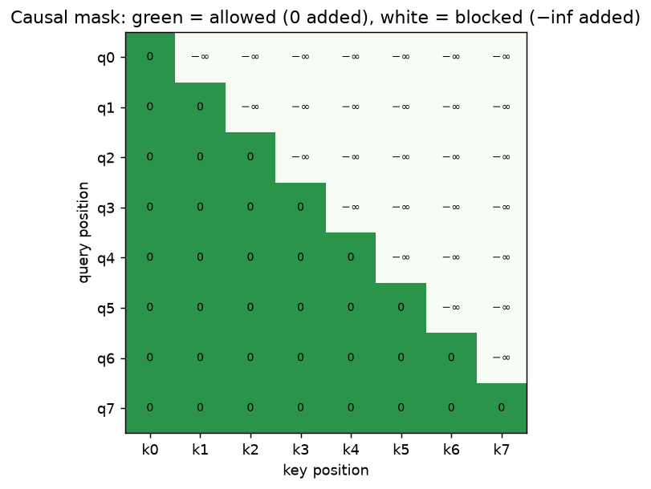
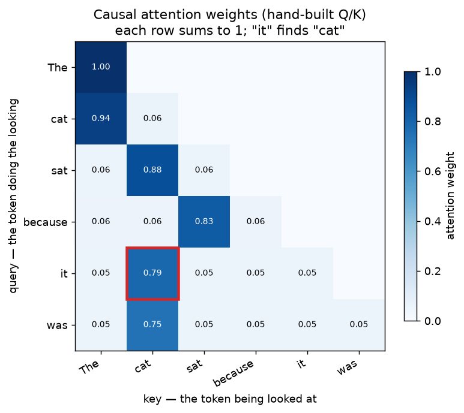
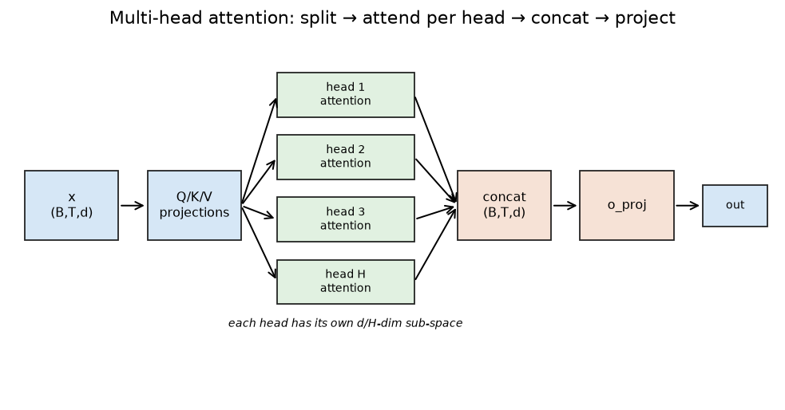
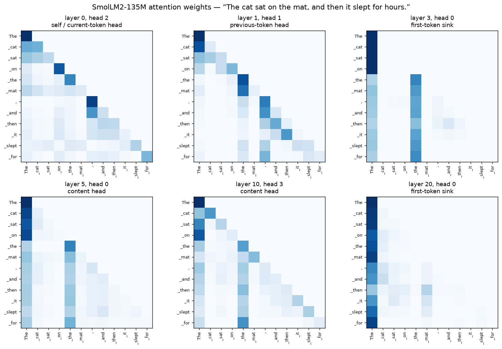
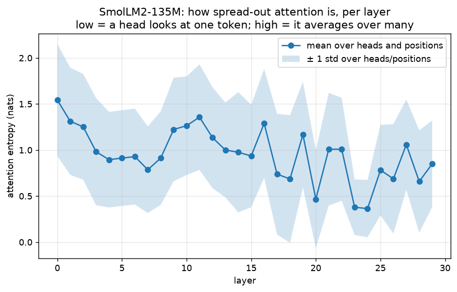
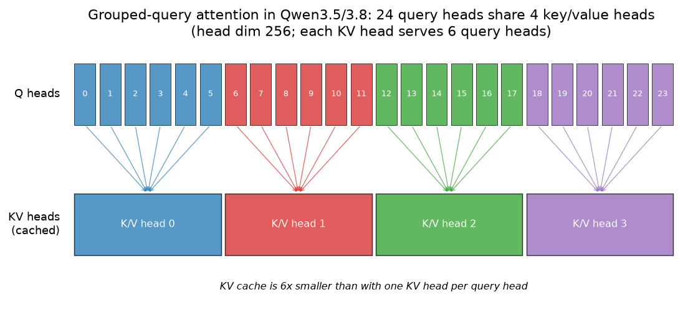
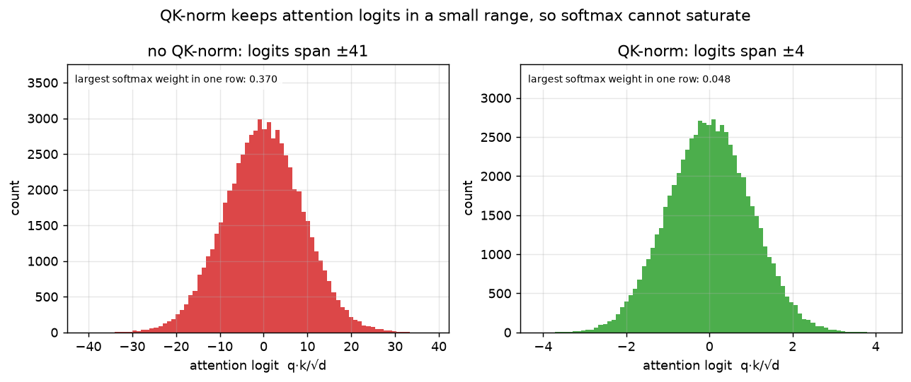
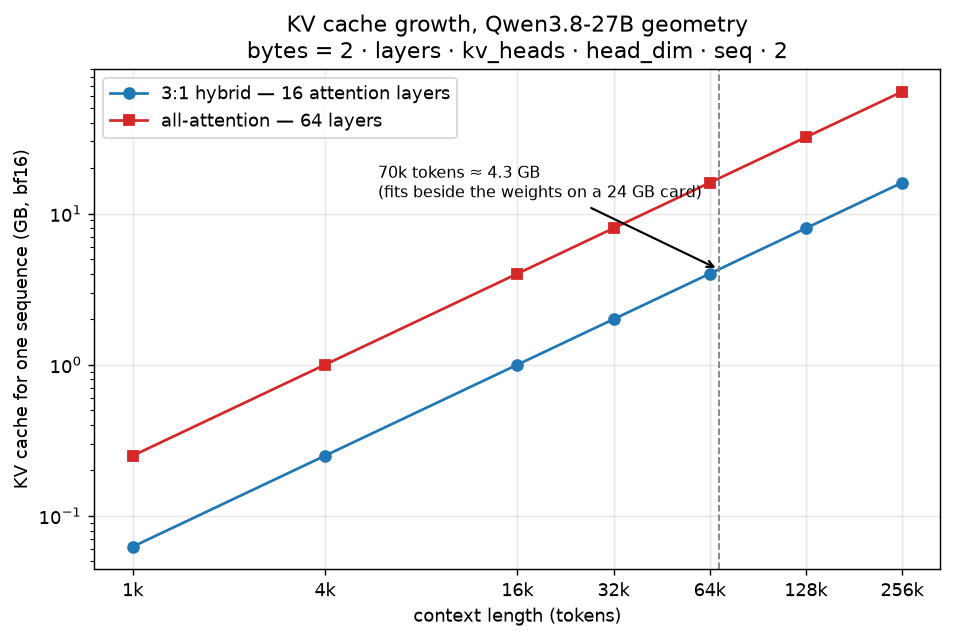

# 03 — Attention: how a token looks at other tokens

Chapter 02 turned text into one vector per token. Those vectors are still isolated: nothing in
them knows what the *other* words in the sentence are. Attention is the block that fixes this.
It is the only place in a transformer where information moves between positions — everything
else (the MLP, or multi-layer perceptron — the feed-forward block from chapter 06 — and the norms)
works on one token at a time.

All the code in this chapter lives in `project/src/llm_blocks/ch03_attention.py`. Regenerate the
figures with:

```bash
cd project
uv run python -m llm_blocks.ch03_attention plots        # the six figures below, no downloads
uv run python -m llm_blocks.ch03_attention plots-real   # the two SmolLM2 figures
uv run python -m llm_blocks.ch03_attention demo         # the FLOP and cache numbers quoted here
```

## What you will learn

- Why a token needs to look at other tokens, and what queries, keys and values are.
- The attention formula, piece by piece, and why it divides by √d.
- The causal mask: how a model is stopped from reading the future.
- Multi-head attention: several independent "questions" per token, and what real heads do.
- GQA (grouped-query attention): fewer key/value heads, a much smaller cache.
- QK-norm and the sigmoid output gate that Qwen3.5 / Qwen3.8 add to the block.
- The KV cache (key–value cache): what it stores, how fast it grows, and why it decides how much
  context fits on your GPU.

---

## 1. The problem: "it" refers to something

Take the sentence *"The cat sat because it was tired."* To predict what comes after *"it"*, the
model has to know that *"it"* means *"the cat"*. After chapter 02 the vector for *"it"* is just
the embedding of the word "it" — the same vector it would have in any other sentence. Something
has to mix in information from *"cat"*.

**The library analogy.** Imagine every token is a drawer in a filing cabinet.

- Each drawer has a **label** on the front: this is its **key**.
- Each drawer has **contents**: this is its **value**.
- A token that wants information writes a **question** on a slip of paper: this is its **query**.

To answer its question, a token compares its query against every label, and then takes a
*blend* of the contents, weighted by how well each label matched. A token asking "which animal
am I about?" matches the label on the *"cat"* drawer, and pulls the contents of that drawer into
itself.

Queries, keys and values are not given to us — each is a learned linear projection of the token's
vector. The same word produces a different question depending on which projection matrix the
layer learned.

## 2. The formula

For one head, with queries `Q`, keys `K` and values `V` (one row per token, `d` numbers each):

```
scores  = Q · Kᵀ / √d
weights = softmax(scores)
output  = weights · V
```

Line by line:

- `Q · Kᵀ` is a dot product between every question and every label. A big number means "this
  label answers this question". The result is a `T × T` grid — one score per (query, key) pair.
- `/ √d` shrinks the scores. Without it, the scores grow with the head dimension: if the entries
  of `q` and `k` are independent with variance 1, their dot product over `d` dimensions has
  variance `d`, so it typically lands around ±√d. Dividing by `√d` puts the scores back in a
  range of roughly ±1, where softmax is still sensitive. Without the division, one score runs
  away, softmax outputs almost exactly 1 for it and 0 for everything else, and the gradient
  through softmax goes to zero — the layer stops learning.
- `softmax` turns each row of scores into fractions that sum to 1: a recipe for a blend.
- `weights · V` is that blend: a weighted average of the drawers' contents.

Here it is in full — this is the whole of attention:

```python
def scaled_dot_product_attention(q, k, v, causal=True):
    """Attention for one set of heads. Returns `(output, weights)`."""
    t_q, t_k = q.shape[-2], k.shape[-2]
    scores = q @ k.transpose(-2, -1) / math.sqrt(q.shape[-1])
    if causal:
        scores = scores + causal_mask(t_q, t_k, dtype=scores.dtype, device=scores.device)
    weights = torch.softmax(scores, dim=-1)
    return weights @ v, weights
```

`tests/test_03_attention.py` checks this against PyTorch's own
`F.scaled_dot_product_attention(q, k, v, is_causal=True)` to `rtol=1e-4` — the fused kernel does
exactly this, it just never materialises the `T × T` weight matrix.

Shapes, once, for the rest of the chapter: everything inside attention is `(B, H, T, D)` — batch,
heads, tokens ("time"), head dimension. Only the block's input and output are `(B, T, d_model)`,
the shape of the residual stream.

## 3. The causal mask: no peeking at the future

A language model is trained to predict the next token at *every* position at once. That only
works if the token at position 5 cannot see positions 6, 7, 8 — otherwise predicting them is
trivial and the model learns nothing.

The fix is one line: before the softmax, add `-inf` to every score that points into the future.
`exp(-inf) = 0`, so those positions get exactly zero weight and the row still sums to 1.

```python
def causal_mask(t_q, t_k, dtype=torch.float32, device=None):
    """Additive `(1, 1, t_q, t_k)` mask: `0` where a token may look, `-inf` where it may not."""
    offset = t_k - t_q
    rows = torch.arange(t_q, device=device).unsqueeze(1) + offset
    cols = torch.arange(t_k, device=device).unsqueeze(0)
    mask = torch.zeros(t_q, t_k, dtype=dtype, device=device)
    return mask.masked_fill(cols > rows, float("-inf")).view(1, 1, t_q, t_k)
```



*Look at:* the mask is added to the scores, not multiplied. Green cells add 0 (no change); white
cells add `−inf`. Row `q3` can see keys `k0…k3` and nothing later. The `offset` matters only when
you feed *new* tokens on top of a cache (section 8): a single new query at position 100 sees all
101 keys, so its mask row is all zeros.

To see what attention actually produces, here is a six-token toy sentence with `q` and `k` built
by hand: each token carries a five-slot topic code (animal / action / cause / filler / pronoun),
its key advertises its own topic and its query says what it is looking for.



*Look at:* the upper triangle is empty — that is the mask. Every row sums to 1. The red box is
the point: the query of *"it"* asks for an animal, the key of *"cat"* advertises one, so *"it"*
puts 0.79 of its attention on *"cat"* and pulls that meaning into itself. Nothing here was
learned — the vectors were written out by hand — but a trained model builds exactly this kind of
match from data.

## 4. Multi-head attention: several questions at once

One query per token means one question per token per layer. That is limiting: at the same moment
a token may want to know "what is the subject?", "what was the previous word?" and "am I inside
a quote?".

Multi-head attention runs several attentions in parallel. The `d_model` numbers of the residual
stream are split into `H` slices of size `d_model / H`; each slice ("head") gets its own
query/key/value sub-space and its own `T × T` weight matrix. The `H` outputs are concatenated
back into one `d_model` vector and passed through a final output projection that decides how to
combine them.



*Look at:* the projections happen **once** for all heads (a single `q_proj` of width `d_model`);
"splitting into heads" is a `view` + `transpose`, not extra parameters. Only `o_proj` at the end
mixes the heads back together.

```python
class MultiHeadAttention(nn.Module):
    def forward(self, x, causal=True):
        b, t, _ = x.shape
        q = self._split_heads(self.q_proj(x))     # (B, T, d) -> (B, H, T, D)
        k = self._split_heads(self.k_proj(x))
        v = self._split_heads(self.v_proj(x))
        out, weights = scaled_dot_product_attention(q, k, v, causal=causal)
        out = out.transpose(1, 2).reshape(b, t, self.d_model)   # merge heads back
        return self.o_proj(out), weights
```

The test copies our four projections into `torch.nn.MultiheadAttention(batch_first=True)` (which
packs Q, K and V into a single `in_proj_weight`) and checks the outputs match with a causal
`attn_mask`.

### What real heads look like

SmolLM2-135M has 30 layers with 9 query heads each. Running it with
`output_attentions=True` and plotting six of those 270 heads on a 12-token sentence:



*Look at:* three patterns show up again and again, in every transformer anyone has looked inside.

1. **Previous-token head** (layer 1, head 1): a bright line one step below the diagonal. It just
   copies the word before. Useful and boring; they appear in the first couple of layers.
2. **First-token sink** (layer 3 head 0, layer 20 head 0): a solid bright *column* on token 0.
   The head is dumping its attention on the first token because it has nothing it wants — but
   softmax rows must sum to 1, so the weight has to go somewhere. This is the well-known
   "attention sink", and it gets more common the deeper you go.
3. **Content head** (layers 5 and 10): a broader spread over earlier meaningful words. These are
   the heads doing the actual language work.

`uv run python -m llm_blocks.ch03_attention head-patterns` prints a label for every head, which
is how the six above were picked.

Averaging over all heads gives a per-layer summary of *how spread out* attention is (entropy in
nats; 0 = all weight on one token, `ln 12 ≈ 2.48` = a flat average over all 12 tokens):



*Look at:* the mean drops from ≈ 1.54 nats in layer 0 to 0.36–1.06 across the last ten layers. Deep heads
are sharper — often because they have collapsed onto the sink. The wide shaded band says heads
inside one layer differ a lot from each other; the average hides most of the story.

## 5. GQA: grouped-query attention

Every key and value has to be *kept around* while the model generates (section 8), and that
memory is the binding constraint on long context. So modern models keep all the query heads but
use far fewer key/value heads, each shared by a group of query heads. This is **GQA**
(grouped-query attention).



*Look at:* the columns. Qwen3.8-27B has 24 query heads and 4 key/value heads with head dimension
256, so each K/V head serves 6 query heads — and the stored cache is 6× smaller than it would be
with one K/V head each. The queries stay diverse; only the "labels and contents" are shared.
(For the small `Qwen/Qwen3.5-0.8B` I can load on this Mac, `AutoConfig` reports hidden size 1024,
24 layers, 8 query heads, 2 K/V heads, head dim 256 — the same 4:1 idea at a smaller size.)

In code the sharing is one call: `repeat_interleave` copies each K/V head across its group so the
shapes line up again.

```python
q = self.q_proj(x).view(b, t, self.n_heads, self.head_dim)
k = self.k_proj(x).view(b, t, self.n_kv_heads, self.head_dim)
v = self.v_proj(x).view(b, t, self.n_kv_heads, self.head_dim)
if self.q_norm is not None:                      # QK-norm, section 6
    q, k = self.q_norm(q), self.k_norm(k)
q, k, v = q.transpose(1, 2), k.transpose(1, 2), v.transpose(1, 2)   # -> (B, H, T, D)

if rope is not None:                             # RoPE (rotary position embedding), chapter 04 — the only place
    q, k = rope(q), rope(k)                      # positions enter the model

if cache is not None:
    k, v = cache.append(k, v)                    # KV cache, section 8

k_rep = k.repeat_interleave(self.n_groups, dim=1)   # share each KV head with its group
v_rep = v.repeat_interleave(self.n_groups, dim=1)

out, weights = scaled_dot_product_attention(q, k_rep, v_rep, causal=causal)
out = out.transpose(1, 2).reshape(b, t, self.n_heads * self.head_dim)
if self.gate_proj is not None:                   # output gate, section 7
    out = out * torch.sigmoid(self.gate_proj(x))
return self.o_proj(out), weights
```

Note that `head_dim` is a free parameter here: it is **not** `d_model / n_heads`. Qwen3.8-27B has
hidden size 5120 and 24 heads of dimension 256, so `24 × 256 = 6144 > 5120`. The projections are
rectangular on purpose.

The test copies weights into `transformers`' own `Qwen3Attention` and checks both the output and
the attention weights match to `rtol=1e-4`. The call signature in transformers 5.16 is:

```python
config._attn_implementation = "eager"                 # otherwise attn_weights is None
attn = Qwen3Attention(config, layer_idx=0)
out, weights = attn(hidden_states,
                    position_embeddings=(cos, sin),   # RoPE; cos=1, sin=0 makes it the identity
                    attention_mask=additive_float_mask)
```

Positional encoding is chapter 04, so the test passes `cos = ones`, `sin = zeros`, which makes
`apply_rotary_pos_emb` the identity and isolates attention itself.

## 6. QK-norm: keeping the logits small

`Qwen3Attention` above applies RMSNorm (root-mean-square normalization, chapter 05) to every
query and key head *before* the dot product.
This is **QK-norm**, and Qwen3 onwards always does it. It normalises across the head dimension
only (256 numbers), with a learned per-dimension gain.

Why: during a long training run there is nothing stopping `q` and `k` from growing in length, and
the score `q·k/√d` grows with the product of those lengths. Once one score is 40 and the rest are
0, softmax outputs ≈ 1 and ≈ 0, the gradient vanishes, and in bf16 you start seeing loss spikes.
Normalising `q` and `k` first fixes their lengths, so the logits stay in a fixed band no matter
what the weights do.



*Look at:* with deliberately large-norm random `q` and `k` (scaled ×3, head dim 64), the raw
logits span roughly ±41 and the sharpest softmax weight in a row is 0.370. After QK-norm the
same tensors give logits inside ±4 and a largest weight of 0.048 — a soft, still-differentiable
distribution. The point is not the exact numbers (they depend on the random draw) but the order
of magnitude: one axis is ten times wider than the other.

## 7. The output gate ("gated attention")

Qwen3.5 and its predecessor Qwen3-Next add one more thing to the block: a parallel projection
`gate_proj` whose sigmoid multiplies the attention output elementwise, just before `o_proj`.

```
out = attention(...)                    # (B, T, n_heads * head_dim)
out = out * sigmoid(gate_proj(x))       # a per-channel volume knob, computed from x
out = o_proj(out)
```

The gate depends on the token's own vector, not on what it attended to. It is a learned volume
knob: values near 0 let a token switch the attention block off for some channels. The motivation
given in the Qwen3-Next / Qwen3.5 model cards and the accompanying reports is training stability
and a reduction of the attention-sink behaviour seen in section 4 — a head that has nothing to
retrieve can now output ≈ 0 instead of being forced to dump its softmax mass on token 0. Treat
this as the designers' stated rationale rather than a proven mechanism; it is one of several
changes shipped together.

Our implementation takes `gated=True` and the test pins the two extremes: driving the gate bias
to +30 (sigmoid ≈ 1) reproduces the ungated block exactly, driving it to −30 (sigmoid ≈ 0) zeroes
the block's contribution.

## 8. The KV cache

When a model generates text it produces one token at a time, and each new token has to attend to
every token before it. Recomputing the keys and values of the whole prefix at every step would be
absurd — they do not change. So we store them. That store is the **KV cache**.

```python
class KVCache:
    def append(self, k, v):
        self.k = k if self.k is None else torch.cat([self.k, k], dim=-2)
        self.v = v if self.v is None else torch.cat([self.v, v], dim=-2)
        return self.k, self.v
```

That is genuinely all it is: the keys and values of every past token, per layer. Queries are
*not* cached — the query of an old token is never needed again.

`demo` generates 256 tokens from an 8-token prompt with a 4-layer toy model (d_model 32, 4 query
heads, 2 K/V heads, head dim 8), both ways, and counts the FLOPs of the matrix multiplies inside
attention:

```
identical output tokens: True
attention matmul FLOPs without cache:     3.975 G
attention matmul FLOPs with    cache:     0.024 G
speed-up factor: 163.9x
```

Identical tokens, 164× fewer attention FLOPs. The saving is the whole reason inference is
practical: without a cache, step `n` redoes the work of steps `1…n−1`, so generating `N` tokens
costs `O(N²)` projections instead of `O(N)`.

### How big does it get?

One sequence, one number:

```
bytes = 2 · layers · kv_heads · head_dim · seq · dtype_bytes
```

The leading `2` is "keys and values". No batch dimension (one sequence), no query heads — thanks
to GQA the query heads share these.

For Qwen3.8-27B in bf16 (2 bytes) that is `2 · 4 · 256 · 2 = 4096` bytes per token per attention
layer, i.e. **64 KiB per token** across its 16 attention layers.



*Look at:* both axes are logarithmic, and both lines are straight with slope 1 — the cache grows
*linearly* with context, not quadratically (it is the compute that is quadratic). The gap between
the lines is the design decision: Qwen3.5/3.8 use a **3:1 hybrid** stack — three Gated DeltaNet
layers for every full-attention layer (chapter 07) — so only 16 of the 64 layers hold a KV cache
at all. Same model, ¼ of the cache.

The numbers `demo` prints:

| context | 3:1 hybrid (16 attn layers) | all-attention (64 layers) | no GQA (64 layers, 24 KV heads) |
|---|---|---|---|
| 4,096 | 0.25 GB | 1.00 GB | 6.00 GB |
| 32,768 | 2.00 GB | 8.00 GB | 48.00 GB |
| **70,000** | **4.27 GB** | 17.09 GB | 102.54 GB |
| 131,072 | 8.00 GB | 32.00 GB | 192.00 GB |
| 262,144 | 16.00 GB | 64.00 GB | 384.00 GB |

The 70,000-token row is the one to remember for a 24 GB RTX 4090: a 4-bit 27B leaves roughly
8 GB free after its weights, and 70K tokens of context asks for 4.3 GB of that — so it fits, with
room for activations. Read the two right-hand columns as what you are being spared: the same
model with attention in all 64 layers would need 17 GB at that length (it does not fit), and
without GQA, 103 GB (not even close). Two design choices — grouped queries and a hybrid stack —
are what make a long context affordable on one consumer card.

## 9. The cost of attention

Memory grows linearly with context; **compute does not**. The score matrix is `T × T`, so
`Q · Kᵀ` and `weights · V` each cost `O(T²·d)` per head. Doubling the context quadruples the
attention work. At 4K tokens this is a small part of a forward pass; at 262K it dominates
everything else. That is the pressure that produced FlashAttention (same maths, better memory
traffic), sliding-window attention, and the linear-attention layers of chapter 07 — which replace
the `T × T` matrix with a fixed-size recurrent state and no cache at all.

## Troubleshooting

**`nan` everywhere after the softmax.** If a whole row of the score matrix is `-inf`, softmax
computes `exp(-inf)/sum(exp(-inf))` = `0/0` = `nan`. This happens when you combine a causal mask
with a padding mask and a padded row ends up with nothing visible. Fix it by never masking the
diagonal, or by masking *after* the softmax for those rows.

**Use an additive float mask, not a boolean one.** Our `causal_mask` returns `0.0` / `-inf`
floats that are *added* to the scores. `transformers` attention modules expect the same. Passing
a `bool` tensor to `Qwen3Attention` will silently add `True`/`False` as 1/0 and produce quiet
nonsense. `torch.nn.MultiheadAttention` accepts either, but flips the convention for booleans
(`True` = masked out).

**Mask dtype must match the scores.** In bf16, `float("-inf")` is fine, but a large finite
sentinel like `-1e9` is *not* representable and can round to `-inf` or lose the ordering. Build
the mask with the scores' own dtype (`causal_mask(..., dtype=scores.dtype)`).

**Shape confusion.** Inside attention everything is `(B, H, T, D)`. The two easy mistakes are
`view`ing to `(B, H, T, D)` directly instead of `view(B, T, H, D).transpose(1, 2)` (which
interleaves the heads wrongly and gives plausible-looking garbage), and forgetting the matching
`transpose(1, 2)` before the final `reshape`.

**`output_attentions=True` returns `None`.** Fused kernels (`sdpa`, `flash_attention_2`) never
build the `T × T` weight matrix, so there is nothing to return. Load the model with
`attn_implementation="eager"` — `reference.load_smollm()` does this — and expect it to be slower
and to use more memory.

**GQA head dim is not `d_model / n_heads`.** Do not compute it; pass it. Qwen3.8-27B's
`24 × 256 = 6144` is deliberately wider than its hidden size of 5120.

## Exercises

1. **Cache vs heads.** Call `kv_cache_bytes` with `n_kv_heads` = 1, 2, 4, 8, 24 for Qwen3.8-27B's
   geometry at 262,144 tokens and re-plot `_fig_kv_cache_growth` with your own lines. At which
   value does 262K context stop fitting in 24 GB? What do you think you lose by going to 1 KV
   head (multi-query attention)?
2. **Remove the scale.** Delete the `/ math.sqrt(q.shape[-1])` in
   `scaled_dot_product_attention`, run it on `torch.randn(1, 1, 16, 256)` inputs, and print
   `weights.max()` and the entropy of each row. How close to a one-hot vector does softmax get,
   and what does that do to the gradient?
3. **Find a punctuation head.** Extend `_classify_head` with a rule for "attends to the previous
   comma or full stop", run `head-patterns` on a sentence with several clauses, and plot the best
   candidate. Does it survive when you change the sentence?
4. **Break the mask.** Set `causal=False` in `ToyLM` and re-run `demo`. The step-by-step cached
   decode and the full forward now disagree — explain why, in terms of what each query is
   allowed to see.
5. **Gate the sink.** Build two `GroupedQueryAttention` blocks with the same weights, one
   `gated=True`, and feed both a sequence where one head has nothing to retrieve. Plot the norm
   of the block output per token for each. Does the gate actually let the block output ≈ 0?

---

Next: [04_positional_encoding.md](04_positional_encoding.md) — attention as written here is
completely blind to word order (shuffle the keys and values together and every output is
unchanged). RoPE is how position gets back in.
