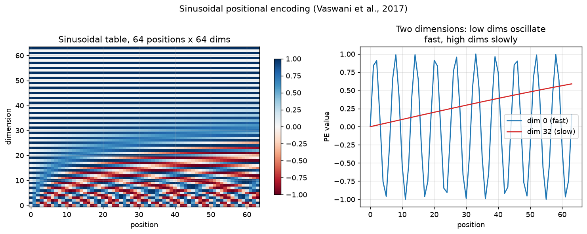
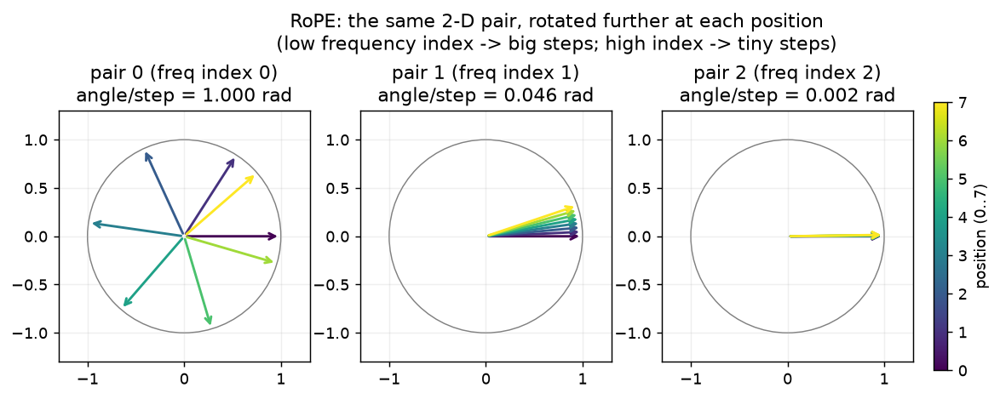
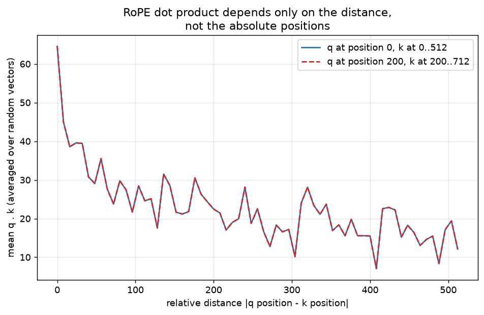
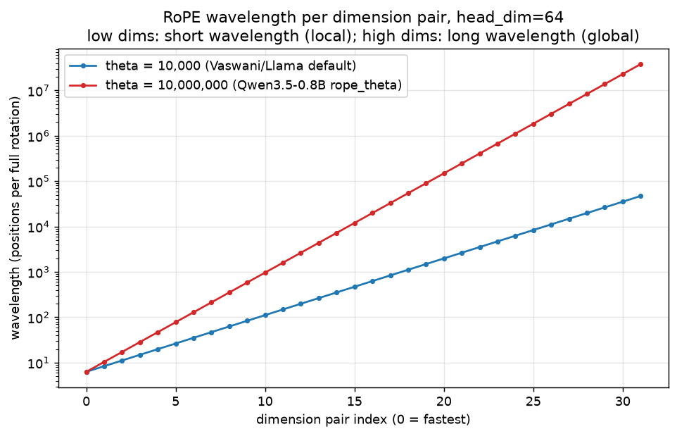
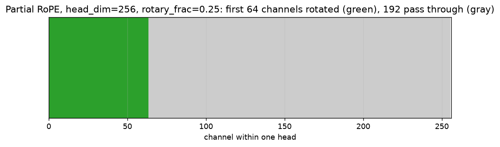
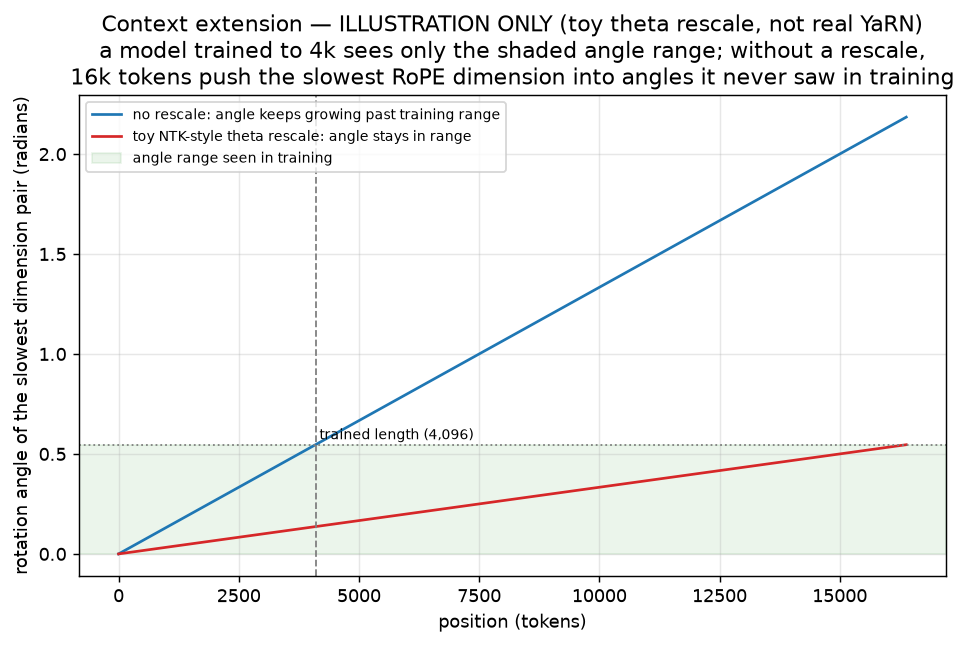

# 04 — Positional encoding: teaching attention about order

Chapter 03 built attention, and ended on a warning: attention as written there is
completely blind to word order. This chapter is about fixing that — first with the
original idea (add a position vector), then with the one almost every current LLM (large
language model) actually uses: RoPE (rotary position embedding), a rotation applied to the
queries and keys themselves.

All the code in this chapter lives in `project/src/llm_blocks/ch04_positional_encoding.py`.
Regenerate the figures with:

```bash
cd project
uv run python -m llm_blocks.ch04_positional_encoding plots   # the six figures below, no downloads
uv run python -m llm_blocks.ch04_positional_encoding demo    # the permutation test + config numbers
```

## What you will learn

- Why attention alone cannot tell word order — the "bag of words" problem, demonstrated
  with a permutation test.
- Absolute sinusoidal positional encoding (Vaswani et al., 2017): what it is and why sines.
- RoPE: rotating queries and keys by an angle proportional to position, so the attention
  score depends only on the *distance* between two tokens.
- Why RoPE's frequencies matter: low dimensions turn fast (local relationships), high
  dimensions turn slowly (long-range relationships), and `rope_theta` controls the whole
  spread.
- Partial RoPE, the variant Qwen3.5/3.8 actually ship: only a quarter of each head is
  rotated.
- Why a model trained at one context length struggles at a much longer one, and the
  intuition behind YaRN (yet another RoPE extension).

---

## 1. The problem: attention cannot tell "cat sat mat" from "mat sat cat"

Take the scaled-dot-product attention from chapter 03. It computes a query, a key and a
value for every token, and mixes values by how well queries match keys. Nowhere in that
computation does a token's *position in the sentence* appear — only its *content* does. If
you shuffle the tokens of a sentence and shuffle the outputs the same way, you get back
exactly the same numbers, just reordered. Attention is a **set function**: it treats its
input as a bag of tokens, not a sequence.

We can show this directly. Build plain, non-causal attention with no position information
at all, and a second version where queries and keys are rotated by RoPE (this chapter's
main topic) before the dot product, then shuffle the input tokens and compare:

```python
def permutation_test(model_fn, seq: int = 8, d: int = 16, seed: int = 0) -> bool:
    """True if model_fn(x)[perm] == model_fn(x[perm]) for a random permutation."""
    torch.manual_seed(seed)
    x = torch.randn(1, seq, d)
    perm = torch.randperm(seq)
    out = model_fn(x)
    return torch.allclose(model_fn(x[:, perm]), out[:, perm], atol=1e-5)
```

`demo` prints:

```
permutation test (shuffle tokens, compare to shuffling the output):
  plain attention, no positions: permutation-equivariant = True
  attention + RoPE:              permutation-equivariant = False
```

Plain attention: shuffle the input, get exactly the shuffled output back — it never
noticed the reorder. Attention with RoPE: the two no longer match, because RoPE ties each
query and key to *where it sits*, not just what it contains. That is the entire job of
positional encoding: give the model a way to tell "the third token" from "the fifth token"
so word order can matter.

## 2. Option 1: add a position vector

The most direct fix is the one used in the original transformer paper (Vaswani et al.,
2017): compute a fixed vector for every position and **add** it to the token embedding
before the first layer. Token identity and position now live in the same vector, so
anything downstream — including attention — can use both.

The vectors are built from sines and cosines at geometrically spaced frequencies:

```
PE(pos, 2i)   = sin(pos / 10000^(2i/d))
PE(pos, 2i+1) = cos(pos / 10000^(2i/d))
```

Even dimensions get a sine, the paired odd dimension the matching cosine, at `d/2`
different frequencies spread between "one full cycle every ~6 positions" (low `i`) and "one
full cycle every ~10,000×2π positions" (high `i`). Read as a plain sentence: dimension `i`
oscillates with period `2π · 10000^(2i/d)`, so early dimensions wiggle fast and late
dimensions barely move within any one sentence.

```python
def sinusoidal_pe(seq: int, d: int) -> Tensor:
    position = torch.arange(seq).unsqueeze(1).float()
    div_term = torch.exp(torch.arange(0, d, 2).float() * (-math.log(10000.0) / d))
    pe = torch.zeros(seq, d)
    pe[:, 0::2] = torch.sin(position * div_term)
    pe[:, 1::2] = torch.cos(position * div_term)
    return pe
```



*Look at:* the left heat-map has 64 positions along the bottom and 64 dimensions up the
side. Near the bottom (fast dimensions) the pattern flips sign every couple of columns —
tight stripes. Near the top (slow dimensions) it barely changes across all 64 positions —
broad bands. The right panel makes the same point with two literal curves: dimension 0
completes many full cycles over 64 positions; dimension 32 has barely started its first
cycle.

**Why sines, specifically?** Three properties matter: (1) *smooth* — neighbouring positions
get similar vectors, so "position 41" and "position 42" are almost interchangeable to the
model, matching the intuition that nearby positions should behave similarly; (2) *unique* —
across `d/2` different frequencies, no two positions inside the trained range produce the
same vector; (3) the paper's own argument — for any fixed offset `k`, `PE(pos+k)` is a
*linear function* of `PE(pos)` (a rotation matrix built from `sin(kω)`/`cos(kω)`), which the
authors hoped would let a linear layer learn to attend by relative position. This add-a-
vector scheme is simple and it is genuinely how the original transformer worked, but it has
a weakness that motivated everything else in this chapter: the vector is added once, at the
bottom of the network, and every layer above has to *remember* it. Nothing in the actual
attention dot product enforces the "linear function of relative offset" property directly —
it is a hope built into the encoding, not a guarantee built into the score.

## 3. Option 2: RoPE — rotate the query and key, not the embedding

RoPE (rotary position embedding) takes a different approach: instead of adding a position
vector once, it **rotates** every query and key vector by an angle proportional to its
position, immediately before the attention dot product, at every layer. Two consecutive
numbers in the vector are treated as the `(x, y)` coordinates of a 2-D point, and that point
is spun around the origin by `position × frequency` radians. A `head_dim`-sized vector is
just `head_dim / 2` independent 2-D points, each spun at its own frequency.



*Look at:* the same starting vector `(1, 0)`, rotated through positions 0–7 (dark to bright
arrows). The leftmost pair (frequency index 0) sweeps almost all the way around the circle
in 8 steps — 1 radian per step. The middle pair barely moves. The rightmost pair
(frequency index 2, so an even lower frequency for this toy 6-dimensional example) is
essentially frozen over these 8 positions. This is the whole mechanism: many independent
clocks, ticking at different speeds, one pair of dimensions per clock.

**Why rotating helps: the dot product becomes a function of distance alone.** Rotating both
`q` (at position `m`) and `k` (at position `n`) by their own angle and then taking the dot
product is equivalent — this is the algebra that makes RoPE work — to rotating `k` by the
*difference* `n − m` and leaving `q` unrotated: `⟨R(m)q, R(n)k⟩ = ⟨q, R(n−m)k⟩`. The score no
longer depends on where in the sequence the pair sits, only on how far apart the two tokens
are. That is exactly the property the sinusoidal scheme was hoping a linear layer would
discover on its own — RoPE bakes it into the maths of the dot product itself.

**The complex-number view, in two sentences.** Pair up `(x_{2i}, x_{2i+1})` as one complex
number `x_{2i} + i·x_{2i+1}`; rotating by angle `θ` is just multiplying by `e^{iθ}`. Rotating
`q` by `θ_m` and `k` by `θ_n` and taking the (real) dot product of the results is the same
as multiplying `q` by `k`'s complex conjugate rotated by `θ_n − θ_m` — distance again, not
position.

```python
def rope_cos_sin(seq: int, head_dim: int, theta: float = 10000.0) -> tuple[Tensor, Tensor]:
    """(cos, sin), each (seq, head_dim), for absolute positions 0..seq-1."""
    inv_freq = 1.0 / (theta ** (torch.arange(0, head_dim, 2).float() / head_dim))
    positions = torch.arange(seq).float()
    freqs = torch.outer(positions, inv_freq)          # (seq, head_dim/2)
    emb = torch.cat([freqs, freqs], dim=-1)            # (seq, head_dim)
    return emb.cos(), emb.sin()


def rotate_half(x: Tensor) -> Tensor:
    x1, x2 = x[..., : x.shape[-1] // 2], x[..., x.shape[-1] // 2 :]
    return torch.cat((-x2, x1), dim=-1)


def apply_rope(x: Tensor, cos: Tensor, sin: Tensor) -> Tensor:
    return x * cos + rotate_half(x) * sin
```

This is the **rotate-half** convention: the two halves of the vector — `x[:d/2]` and
`x[d/2:]` — are treated as the "x" and "y" coordinates of `d/2` pairs, rather than
interleaving even/odd indices as the diagram above suggests. It is mathematically the same
rotation, just with the pairs laid out contiguously instead of interleaved (see
Troubleshooting). `tests/test_04_positional_encoding.py` checks `rope_cos_sin` and
`apply_rope` element-for-element against `transformers`' own implementation:

```python
from transformers.models.qwen3.configuration_qwen3 import Qwen3Config
from transformers.models.qwen3.modeling_qwen3 import Qwen3RotaryEmbedding, apply_rotary_pos_emb

cfg = Qwen3Config(head_dim=32, rope_parameters={"rope_theta": 10000.0, "rope_type": "default"})
rot = Qwen3RotaryEmbedding(cfg)
cos, sin = rot(torch.zeros(1, seq, 32), torch.arange(seq).unsqueeze(0))
```

(`transformers` 5.16; `Qwen3RotaryEmbedding` and `apply_rotary_pos_emb` live in
`transformers.models.qwen3.modeling_qwen3`.) The two functions match to `rtol=1e-4`, and a
separate test confirms rotation preserves each pair's length (`||apply_rope(x)|| == ||x||`
— a rotation never stretches a vector, only turns it) and that the dot product really does
depend only on relative distance, not the absolute positions:



*Look at:* two curves — "q at position 0, k at 0..512" and "q at position 200, k at
200..712" — plotted against the *same* x-axis, relative distance. They sit exactly on top
of each other: whatever the absolute positions, the same relative distance gives the same
expected score. The curve also decays in envelope as distance grows: this is RoPE's
"long-term decay" property. For a fixed vector rotated at two positions, one dimension
pair's contribution to the dot product is `|pair|² · cos(distance × frequency)`; summed
over 32 pairs at different frequencies, the cosines fall out of phase with each other as
distance grows, so nearby tokens correlate more strongly than far ones purely from the
geometry of the rotation — before any weights are even learned.

## 4. Frequencies: low dims local, high dims global

The `head_dim / 2` frequencies are `1 / theta^(2i/head_dim)` for `i = 0 .. head_dim/2 - 1`:
a geometric sequence from 1 (dimension pair 0) down to `1/theta` (the last pair). Small `i`
means a fast-turning, short-wavelength pair — it distinguishes a token 1 position away from
one 2 positions away, but wraps around (aliases) within a few hundred tokens. Large `i`
means a slow-turning, long-wavelength pair — no use for "is this the very next word", but
still meaningfully different at a distance of 10,000 tokens.



*Look at:* both lines grow exponentially (the y-axis is log-scale) from a wavelength of a
few positions up to the millions. The `rope_theta = 10,000,000` line (the value in
`Qwen/Qwen3.5-0.8B`'s config, `verified with transformers.AutoConfig.from_pretrained`) sits
consistently 1,000× above the classic `theta = 10,000` line — every dimension pair turns
1,000× more slowly. **`rope_theta` and long context are directly linked**: to represent
distances out to 262,144 tokens without the *slowest* pair completing so few degrees of
rotation that neighbouring long-range positions become indistinguishable, or the *fastest*
pairs wrapping around so many times that the rotation becomes meaningless noise, a
model trained for a long context needs a larger `theta` than one trained for 2,048 or 4,096
tokens. This is exactly why long-context checkpoints (Llama with `theta=500,000`, Qwen with
`theta` in the millions) all raise `rope_theta` compared to the original `10,000`.

## 5. Partial RoPE: Qwen3.5/3.8 only rotate a quarter of each head

Dense Qwen3 rotates the *entire* head dimension. Qwen3.5 and Qwen3.8 (and their
predecessor, Qwen3-Next) rotate only the first slice of each head and leave the rest
untouched. Loading `Qwen/Qwen3.5-0.8B` with `transformers.AutoConfig` and reading the text
tower's config (`Qwen3_5TextConfig`, verified on this Mac):

```
partial_rotary_factor: 0.25
```

— confirmed also inside `rope_parameters["partial_rotary_factor"]`. With `head_dim = 256`,
that is `256 × 0.25 = 64` rotated channels and `192` untouched ones, per head.

```python
def partial_rope(x: Tensor, cos: Tensor, sin: Tensor, rotary_frac: float = 0.25) -> Tensor:
    """cos/sin are already sized to the rotary slice (rotary_dim = cos.shape[-1])."""
    rotary_dim = cos.shape[-1]
    x_rot, x_pass = x[..., :rotary_dim], x[..., rotary_dim:]
    x_rot = apply_rope(x_rot, cos, sin)
    return torch.cat([x_rot, x_pass], dim=-1)
```

`tests/test_04_positional_encoding.py` checks this against
`transformers.models.qwen3_5.modeling_qwen3_5.apply_rotary_pos_emb`, which uses the exact
same "rotate the first `cos.shape[-1]` channels, concatenate the untouched tail back on"
pattern (`modeling_qwen3_5.py`, adapted from GLM's rotary code) — `rotary_dim` itself is
computed once inside the model's rotary-embedding module as
`int(head_dim * partial_rotary_factor)`, not re-derived at every call.



*Look at:* the first 64 (green) channels get the rotation; the remaining 192 (gray) pass
through the attention block completely unchanged by position — they carry only content, no
position signal from RoPE at all (the model can still, of course, learn to route position
information into them indirectly through other layers). The stated intuition in the
Qwen3-Next / Qwen3.5 reports is to reserve some "pure content" channels that are never
distorted by a rotation, on the hypothesis that not every channel benefits from carrying
positional information — treat this as the designers' rationale, not an exhaustively proven
mechanism.

## 6. Extending context after training

A model is trained at one context length — say 4,096 tokens — and its RoPE frequencies are
tuned for that range: the slowest dimension pair barely turns over 4,096 positions, the
fastest pairs wrap around many times. Simply *running* the same model at 16,384 tokens does
not fail outright (RoPE is defined for any position), but the model starts seeing rotation
angles, especially in the slow dimensions, that never occurred during training — it never
learned what those angles mean.



*Look at (illustration only, not a real trained model):* the shaded band is the range of
angles the slowest dimension pair swept through during 4,096 tokens of training. The blue
line (no rescale) keeps climbing straight past that band once the sequence passes 4,096
tokens — new, never-seen angles. The red line applies a toy NTK ("neural tangent kernel")
-style trick: multiply `theta` by a factor so the slowest pair's angle at the *new*, longer
length lands back inside the *old* trained range. **YaRN** ("yet another RoPE extension")
is the real, published method built on this idea: it rescales different frequency bands by
different amounts (fast dimensions barely touched, since they already wrapped many times
during training and generalise fine; slow dimensions compressed the most) plus a
temperature adjustment to the attention softmax. This chapter implements only the toy
single-`theta` rescale shown above to build the intuition — see the model card for the real
recipe. Per the Qwen3.8 model card, the 0.8B-scale text models are trained natively to a
262,144-token context and Qwen has published YaRN configurations extending some Qwen3
checkpoints to 1,000,000 tokens; treat the exact numbers as what the card states rather than
something this chapter re-derives.

## 7. A layer type that skips RoPE entirely

Not every layer in Qwen3.5/3.8 uses RoPE. The Gated DeltaNet layers introduced in chapter
07 are a linear-attention variant that carries position information through its own
recurrent state instead of rotating vectors — there is no `q`/`k` dot product for RoPE to
modify. Positional encoding is fundamentally a full-attention concept: it is one particular
answer to "how does a token know where it is", and recurrence is a different answer to the
same question. Chapter 07 covers this in full; for now, note that only the attention layers
in Qwen3.5/3.8's hybrid stack (chapter 03's KV-cache section) carry a `rope_theta` and a
`partial_rotary_factor` at all.

## Troubleshooting

**Rotate-half vs interleaved convention mismatch.** There are two mathematically
equivalent but *numerically incompatible* ways to lay out the `head_dim/2` pairs: **rotate-
half** (`transformers`' convention, used throughout this chapter) treats `x[:d/2]` and
`x[d/2:]` as the pairs; **interleaved** (the original RoPE paper and some other codebases)
treats `x[0::2]` and `x[1::2]` as the pairs. Applying `rotate_half`-style `cos`/`sin` to an
interleaved tensor (or vice versa) produces a plausible-looking but wrong rotation — no
error, just silently degraded attention. If you load a checkpoint from one convention into
code written for the other, permute the head dimension to match before comparing outputs.

**`cos`/`sin` dtype.** `Qwen3RotaryEmbedding.forward` deliberately computes `cos`/`sin` in
`float32` and only casts to the model's dtype (e.g. bf16) at the very end, because the
frequency computation `theta ** (arange(...)/dim)` loses precision badly in low precision.
If you compute `rope_cos_sin` directly in bf16, the fastest dimension pairs' angles become
inaccurate; always compute in float32 and cast down only after `.cos()`/`.sin()`.

**Position-ids offset in KV-cached decoding.** During generation (chapter 03's KV cache, the
key–value cache of past tokens),
each new token's RoPE angle must use its true *absolute* position in the full sequence, not
its position within the newly-fed chunk. Passing `position_ids = arange(chunk_len)` on
every decoding step — instead of `arange(cache_len, cache_len + chunk_len)` — rotates every
new token as if it were still at the start of the sequence, which silently corrupts
attention for anything generated after the first chunk.

## Exercises

1. **Interleaved vs rotate-half.** Write an `apply_rope_interleaved` that treats `x[0::2]`
   and `x[1::2]` as the pairs instead of the two halves, using the same `cos`/`sin` shape.
   Confirm it disagrees with `apply_rope` on the same input, then show that permuting the
   head dimension first makes them agree.
2. **Break the KV cache.** In a small decoding loop, feed `position_ids` that always start
   at 0 for each new chunk instead of continuing from the cache length, and plot how the
   attention score between the newest token and the first token changes as more tokens are
   generated incorrectly versus correctly.
3. **Your own theta sweep.** Extend `_fig_frequencies` with a third `theta` between the two
   shown, and describe in one sentence what changes and does not change about the plot.
4. **Partial RoPE ablation.** Modify `partial_rope` to take `rotary_frac=1.0` (rotate the
   whole head) and `rotary_frac=0.0` (rotate nothing) and re-run the permutation test from
   section 1 with each. At what fraction does the model regain the ability to tell token
   order apart?
5. **Toy YaRN band-splitting.** The single-`theta` rescale in `_fig_context_extension`
   moves every dimension pair by the same factor. Split the pairs into "fast" (wavelength
   under the trained length) and "slow" (wavelength over it), leave the fast pairs
   unscaled, and rescale only the slow ones — plot the result next to the single-factor
   version. This is one step closer to how YaRN actually treats frequency bands
   differently.

---

Next: [05_normalization_and_residuals.md](05_normalization_and_residuals.md) — the residual
stream that carries token content and position through every layer, and the normalization
that keeps it numerically stable across the depth of the network.
