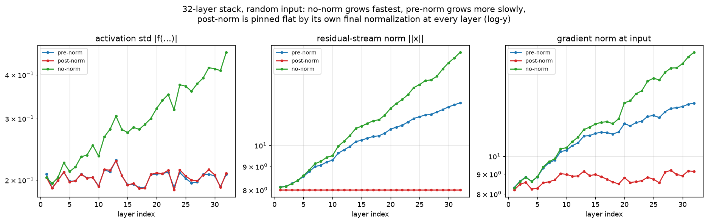
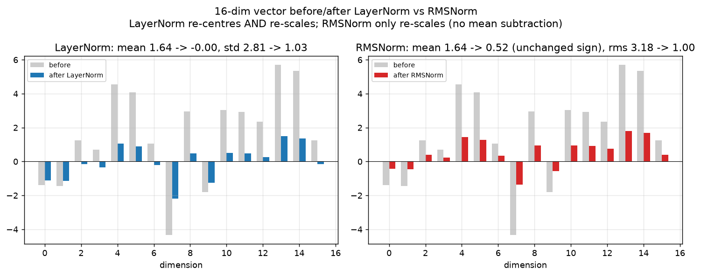
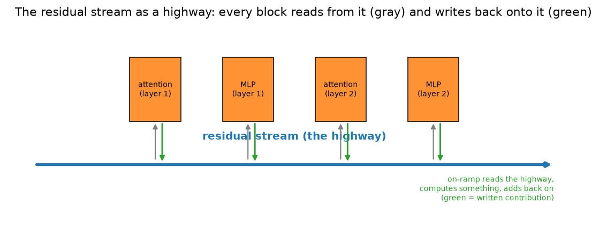
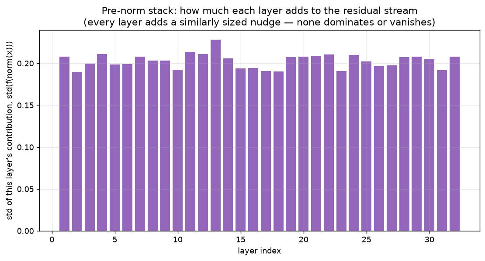
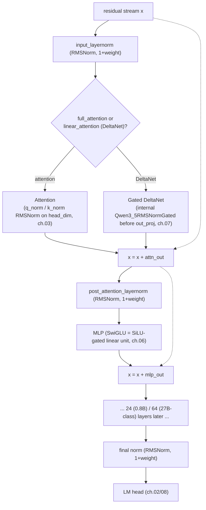
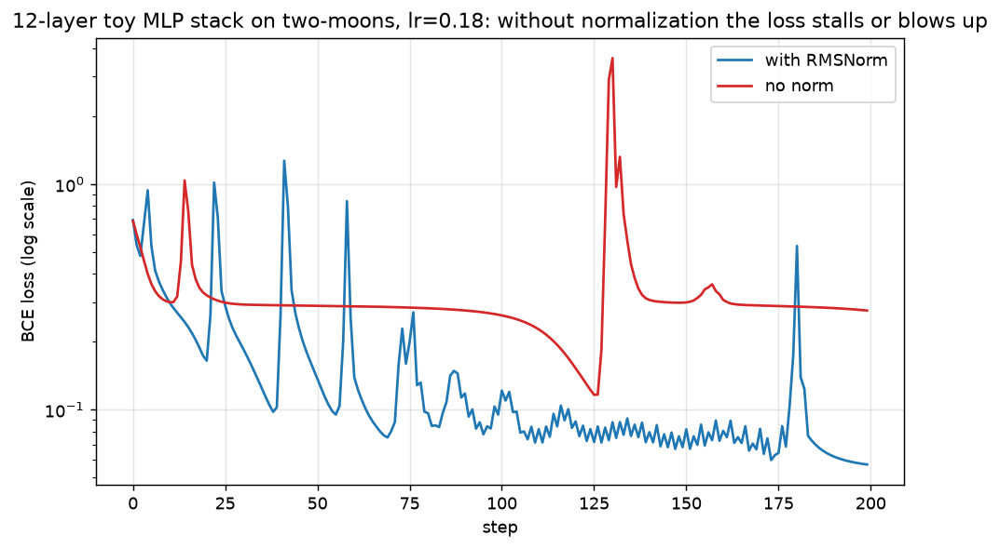

# 05 — Normalization and the residual stream

Chapters 03 and 04 built attention and taught it about position. Stack 64 copies of that
block on top of each other (`Qwen/Qwen3.5-0.8B`'s text tower has 24 decoder layers; the
27B-class Qwen3.5/3.8 models have 64) and a new problem appears that has nothing to do with
attention specifically: signals passed through many layers in a row tend to shrink toward
zero or blow up toward infinity, purely from repeated multiplication. This chapter covers
the two ideas every modern LLM (large language model) uses to keep a deep network trainable:
**normalization** (re-centre and re-scale a vector before each block) and the **residual
stream** (a running total that every block reads from and adds to, rather than replaces).

All the code in this chapter lives in `project/src/llm_blocks/ch05_norm_residual.py`.
Regenerate the figures with:

```bash
cd project
uv run python -m llm_blocks.ch05_norm_residual plots   # the five figures below, no downloads
uv run python -m llm_blocks.ch05_norm_residual demo     # the numbers quoted in this chapter
```

## What you will learn

- Why depth alone makes a network hard to train — activations, the residual-stream norm, and
  gradients drift across layers, demonstrated with a 32-layer stack.
- LayerNorm vs RMSNorm (root-mean-square norm): what each computes, why RMSNorm is cheaper
  and is what Llama/Qwen use, and the two different ways Qwen3 (dense) and Qwen3.5
  parameterise RMSNorm's learnable scale.
- Pre-norm vs post-norm: two ways to combine a block with the residual stream, and why every
  current LLM uses pre-norm.
- The residual stream as a shared highway that every attention/MLP (multi-layer perceptron,
  the feed-forward block from chapter 06) block reads from and
  writes back onto — the mental model behind the rest of this tutorial.
- Where normalization sits inside one Qwen3.5 decoder layer, end to end.
- A hands-on demo: a normless network that stalls or spikes during training, next to the
  same network with RMSNorm added, at the same learning rate.

---

## 1. Why depth alone makes training hard

A single linear layer `y = xW` with a well-scaled `W` keeps `y`'s magnitude close to `x`'s.
Stack 32 of them and the tiny per-layer drift compounds: multiply a scalar close to `1.05` by
itself 32 times and you get `~4.8`; multiply `0.95` by itself 32 times and you get `~0.19`.
Real networks are not literally repeated scalar multiplication, but the same compounding
shows up in three places at once — how big each layer's output is, how big the running total
(the residual stream, introduced properly in section 4) gets, and how big the gradient is
when it is backpropagated to the very first layer.

```python
def stack_stats(depth: int = 32, pre_norm: bool = True, use_norm: bool = True,
                 dim: int = 64, seed: int = 0) -> dict:
    """Run one random input through `depth` stacked Blocks; record, per layer, the
    activation std, the residual-stream norm, and the gradient norm at the input."""
```



*Look at:* three panels, log-y, all against layer index, for three otherwise identical
32-layer stacks that differ only in normalization: **pre-norm** (blue, this chapter's
recommended recipe), **post-norm** (red), and **no norm at all** (green). The **no-norm**
stack drifts the most in every panel — by layer 32 its residual norm and gradient norm are
both roughly double their layer-1 values (gradient norm `8.29 -> 18.5` below), and its
activation std visibly trends upward with layer index. **Pre-norm** grows more slowly
(gradient norm `8.3 -> 13.7`) but each individual layer's own contribution (left panel) stays
in a narrow, flat band regardless of depth — the norm resets the *input* to each block to a
consistent scale every time, even while the residual stream itself keeps accumulating.
**Post-norm** is pinned almost perfectly flat (residual norm `8.0 -> 8.0`) in the middle
panel, because its normalization is the very last operation inside every block — by
definition, `||x||` right after a post-norm block is whatever that block's own RMSNorm
produces, so it cannot drift with depth at all; the cost of that flatness shows up later, in
section 3.

`demo` prints the exact numbers:

```
  pre-norm: residual norm layer 1 = 8.13, layer 32 = 12.4, gradient norm layer 1 = 8.3, layer 32 = 13.7
 post-norm: residual norm layer 1 = 8, layer 32 = 8, gradient norm layer 1 = 8.19, layer 32 = 9.14
   no-norm: residual norm layer 1 = 8.11, layer 32 = 15.9, gradient norm layer 1 = 8.29, layer 32 = 18.5
```

## 2. Normalization: re-centre and re-scale before each block

The fix for "every layer's input has a slightly different scale" is to force it back to a
known scale before it goes into the next block. **LayerNorm** (layer normalization) does
this the most direct way: subtract the mean and divide by the standard deviation, both
computed over the vector's own features, then apply a learnable per-feature scale and shift.

```
LayerNorm(x) = (x - mean(x)) / sqrt(var(x) + eps) * weight + bias
```

In words: take one token's vector, make it zero-mean and unit-variance, then let the network
learn its own preferred mean and variance back (`weight`, `bias`) if zero-mean/unit-variance
is not actually what that layer wants.

```python
class LayerNorm(nn.Module):
    def __init__(self, dim: int, eps: float = 1e-5) -> None:
        super().__init__()
        self.weight = nn.Parameter(torch.ones(dim))
        self.bias = nn.Parameter(torch.zeros(dim))
        self.eps = eps

    def forward(self, x: Tensor) -> Tensor:
        mean = x.mean(dim=-1, keepdim=True)
        var = x.var(dim=-1, keepdim=True, unbiased=False)
        x_norm = (x - mean) / torch.sqrt(var + self.eps)
        return x_norm * self.weight + self.bias
```

`tests/test_05_norm_residual.py` checks this against `torch.nn.LayerNorm` with copied
weights (`rtol=1e-4`).

**RMSNorm** (root-mean-square norm), used by Llama and every Qwen model, drops the
re-centring step entirely and only re-scales:

```
RMSNorm(x) = x / sqrt(mean(x^2) + eps) * weight
```

In words: measure the vector's "typical size" (`sqrt(mean(x^2))`, the root-mean-square, not
the standard deviation — no mean is ever subtracted), divide by it, then apply a learnable
scale. There is no bias term either. This is *cheaper* (no mean reduction, no bias add — one
fewer pass over the vector, one fewer parameter tensor) and, empirically, works just as well
for transformers, which is why essentially every current LLM uses RMSNorm instead of
LayerNorm.

```python
class RMSNorm(nn.Module):
    def __init__(self, dim: int, eps: float = 1e-6, qwen_variant: bool = False) -> None:
        super().__init__()
        self.eps = eps
        self.qwen_variant = qwen_variant
        self.weight = nn.Parameter(torch.zeros(dim) if qwen_variant else torch.ones(dim))

    def forward(self, x: Tensor) -> Tensor:
        input_dtype = x.dtype
        x = x.to(torch.float32)
        variance = x.pow(2).mean(dim=-1, keepdim=True)
        x_norm = x * torch.rsqrt(variance + self.eps)
        scale = (1.0 + self.weight.float()) if self.qwen_variant else self.weight.float()
        return (x_norm * scale).to(input_dtype)
```



*Look at:* the same random 16-dim vector (grey bars, both panels) run through each norm with
an untrained (`weight=1`, no bias) LayerNorm and RMSNorm. LayerNorm's output (blue) is
centred on zero — its mean moved from `1.64` to `-0.00` — and has unit standard deviation.
RMSNorm's output (red) keeps the *same sign* on every single bar (positive bars stay
positive, the one negative bar stays negative) because it never subtracts a mean; it only
rescales every value by the same constant, `1 / rms(x)`, so the root-mean-square goes from
`3.18` to exactly `1.00` while the mean only incidentally shrinks along with everything else.

**Two ways to parameterise the learnable scale.** `RMSNorm` above takes a `qwen_variant`
flag because Qwen3 (the dense model) and Qwen3.5 initialise and apply their scale
differently — verified directly in `transformers` 5.16:

```python
# transformers.models.qwen3.modeling_qwen3.Qwen3RMSNorm  (dense Qwen3, "Llama style")
self.weight = nn.Parameter(torch.ones(hidden_size))
...
return self.weight * hidden_states.to(input_dtype)

# transformers.models.qwen3_5.modeling_qwen3_5.Qwen3_5RMSNorm  (Qwen3.5)
self.weight = nn.Parameter(torch.zeros(dim))
...
output = output * (1.0 + self.weight.float())
return output.type_as(x)
```

Qwen3 initialises `weight` to ones and multiplies directly; an untrained norm is the
identity rescale because `weight = 1`. Qwen3.5 initialises `weight` to *zeros* and multiplies
by `1 + weight`; an untrained norm is *also* the identity rescale, because `1 + 0 = 1` — same
starting behaviour, different parameterisation. The practical reason (`transformers` PR
#29402, referenced in the Qwen3.5 source) is that a scale centred at zero makes weight decay
and small-gradient-update behaviour more predictable: nudging `weight` by a small amount
moves the effective scale by the same small amount either way, but a `1 + weight`
parameterisation keeps the *stored* number close to zero, which is friendlier to
low-precision (bf16) storage and to weight-decay regularisation that assumes parameters are
naturally centred near zero. `tests/test_05_norm_residual.py` checks `RMSNorm` against both
`Qwen3RMSNorm` and `Qwen3_5RMSNorm` with copied weights, and separately against
`torch.nn.RMSNorm` (which uses the Qwen3/Llama convention).

## 3. Pre-norm vs post-norm

Normalization has to be combined with the block that does the actual work (attention or the
MLP feed-forward network from chapter 06). There are two orders, and the order matters far
more than it looks:

```
pre-norm:   x_out = x + f(norm(x))       (Qwen3, Qwen3.5, GPT-2 onward)
post-norm:  x_out = norm(x + f(x))       (the original 2017 transformer)
```

```python
class Block(nn.Module):
    def forward(self, x: Tensor) -> Tensor:
        if self.pre_norm:
            return x + self.f(self.norm(x))
        return self.norm(x + self.f(x))
```

The difference is where the "identity path" sits. In **pre-norm**, `x` reaches `x_out` via a
completely unmodified `+ x` term — normalization only touches the *copy* fed into `f`, never
the running total itself. That unmodified path is what makes pre-norm stable at large depth:
gradients can flow all the way back to layer 1 along the `+ x` shortcuts without passing
through a single normalization's derivative, so a 64-layer stack is not much harder to
train, gradient-wise, than a 6-layer one. In **post-norm**, the normalization sits *after*
the addition, on the direct path back to every earlier layer — every single gradient that
reaches an early layer has been rescaled by every subsequent norm's derivative, and those
derivatives compound with depth. This matches section 1's plot: post-norm's residual norm
stays flat only because the norm forcibly resets it every layer, not because the network
found a stable equilibrium on its own — and the original transformer paper's own post-norm
architecture is well known to need a learning-rate warmup and careful initialization to
train at all past a few dozen layers. This is why **every** production LLM referenced in
this tutorial (Qwen3, Qwen3.5, Qwen3.8, Llama, and effectively every open model since GPT-2)
uses pre-norm.

## 4. The residual stream: a shared highway

Zoom out from any one block and a clean mental model appears: think of the vector that flows
from the embedding layer (chapter 02) to the final layer as a **highway** — a running total
that starts as the token's embedding and is only ever *added to*, never replaced, by every
attention and MLP block along the way. Each block is an **on-ramp**: it reads the current
state of the highway (`norm(x)`), computes something using that snapshot, and merges its
result back in (`x + ...`). No block ever overwrites what came before; it only contributes an
increment.



*Look at:* the thick blue arrow is the residual stream running left to right, unbroken, from
input to output. Each orange box (an attention or MLP block) is an on-ramp: a gray arrow
shows it *reading* the highway's current value, a green arrow shows it *writing* its
computed increment back on. This is the single most useful picture for the rest of this
tutorial — the MLP block (chapter 06), the linear-attention/DeltaNet block (chapter 07), and
the final LM head (chapter 08) are all just more on-ramps merging into, or reading from, the
same highway.

Because the highway is a sum, it is meaningful to ask how much of the final vector any one
layer actually contributed:

```python
stats = stack_stats(depth=32, pre_norm=True, use_norm=True)
contributions = stats["activation_std"]  # std(f(norm(x))) at every layer
```



*Look at:* 32 bars, one per layer, all close to the same height (roughly `0.19`–`0.23` here).
In a healthy pre-norm stack no single layer dominates the sum and no layer's contribution
vanishes to nothing — every block adds a similarly sized nudge to the highway. (In a real,
trained LLM the picture is not perfectly flat like this untrained toy stack — some layers
genuinely learn to contribute more than others — but the *order of magnitude* staying
consistent across depth, rather than exploding or vanishing, is exactly the property
normalization exists to protect.)

## 5. Where norms sit in a Qwen3.5 decoder layer

Putting sections 2–4 together, here is the actual layer used by `Qwen/Qwen3.5-0.8B` and the
27B-class Qwen3.5/3.8 models (`transformers.models.qwen3_5.modeling_qwen3_5.Qwen3_5DecoderLayer`,
verified in `transformers` 5.16):



Each `Qwen3_5DecoderLayer` is pre-norm, exactly as in section 3:

```python
residual = hidden_states
hidden_states = self.input_layernorm(hidden_states)
hidden_states = self.linear_attn(...) if linear else self.self_attn(...)
hidden_states = residual + hidden_states

residual = hidden_states
hidden_states = self.post_attention_layernorm(hidden_states)
hidden_states = self.mlp(hidden_states)
hidden_states = residual + hidden_states
```

Three more RMSNorms exist that are *inside* other blocks rather than on the main highway:

- **QK-norm** (chapter 03): `Qwen3_5Attention.q_norm` / `.k_norm` are `Qwen3_5RMSNorm`
  applied to the query/key vectors on `head_dim` only, right after the projection and before
  RoPE (rotary position embedding, chapter 04) — stabilising the attention *score*, not the
  residual stream.
- **Gated DeltaNet's output norm** (chapter 07): `Qwen3_5GatedDeltaNet.norm` is a
  `Qwen3_5RMSNormGated` — RMSNorm fused with a SiLU-activated output gate — applied to the
  recurrent state's output before `out_proj`, inside the linear-attention block.
- **The final norm**: `Qwen3_5TextModel.norm`, one more `Qwen3_5RMSNorm` applied once, after
  every decoder layer, right before the vector is fed to the LM head (chapter 02/08) — the
  last thing that happens to the residual stream.

## 6. `eps` and dtype: computed in fp32 even in a bf16 model

Both `Qwen3RMSNorm.forward` and `Qwen3_5RMSNorm.forward` cast their input to `float32` before
computing `mean(x^2)` and the `rsqrt`, and only cast the *result* back to the model's
original dtype (e.g. `bfloat16`) at the very end:

```python
input_dtype = hidden_states.dtype
hidden_states = hidden_states.to(torch.float32)
variance = hidden_states.pow(2).mean(-1, keepdim=True)
hidden_states = hidden_states * torch.rsqrt(variance + self.variance_epsilon)
return self.weight * hidden_states.to(input_dtype)
```

`bfloat16` has roughly 3 decimal digits of precision; squaring a value and then averaging
many squared values compounds rounding error badly in that precision, and `rsqrt` of a
poorly rounded variance can shift every output value by a visible amount. Running the whole
norm in `float32` and only rounding the final answer keeps that error negligible, at the
cost of one extra up-cast and down-cast per norm call — cheap compared to the cost of a
mis-scaled RMSNorm feeding every downstream block. `rms_norm_eps` itself defaults to `1e-6`
in `Qwen3_5TextConfig` (verified with `transformers.AutoConfig`); `eps` exists purely to stop
`rsqrt` from producing `inf` on a token whose `mean(x^2)` happens to land at (or extremely
near) zero.

## 7. Demo: training without normalization

To see the training-time consequence of section 1's forward-pass drift, not just its static
snapshot, `train_deep_stack` trains the same 12-layer pre-norm stack — a tiny MLP embedding,
12 residual blocks, a linear classifier head — on chapter 01's two-moons dataset, once with
an `RMSNorm` inside every block and once with `norm=None` (a plain identity, i.e. no
normalization at all), both with plain SGD at `lr=0.18`:

```python
model = DeepStack(in_features=2, dim=cfg.dim, depth=cfg.depth, use_norm=use_norm)
for _ in range(cfg.steps):
    loss = nn.functional.binary_cross_entropy_with_logits(model(x), y)
    ...
    p -= cfg.lr * p.grad
```



*Look at:* the normed run (blue) is noisy — this is a genuinely deep, un-tuned toy network,
not a smooth textbook curve — but its noise oscillates around a steadily falling floor,
reaching a final loss of `0.057`. The no-norm run (red) spikes early, then **stalls** on a
long flat plateau around loss `0.29` for roughly 100 steps — the classic no-norm symptom:
without a per-layer reset, this depth and learning rate combination pushes some layers'
activations into a regime where gradients are too small to make further progress — before a
late, sharp instability spike (loss briefly above `3.6`) and only a partial recovery, ending
at a substantially worse final loss of `0.275`, roughly 4.8× the normed run's. At the
`lr=0.1` a reader might expect from a "typical" SGD run, the same no-norm network only
stalls mildly rather than spiking; `lr=0.18` was chosen specifically so the failure mode is
visible in a 200-step demo rather than requiring many thousands of steps to show up.

`demo` prints the exact final losses:

```
12-layer toy stack on two-moons, lr=0.18, 200 steps:
  with RMSNorm: final loss = 0.0572
  no norm:      final loss = 0.2752
```

## Troubleshooting

**RMSNorm variance blow-up in low precision.** If you write your own RMSNorm without the
fp32 upcast from section 6 and run it in `bfloat16`, watch for outputs that are subtly wrong
(not `NaN`, just numerically off from a reference implementation by more than `bfloat16`'s
own rounding would predict) — that is almost always a `mean(x^2)` computed entirely in
`bfloat16`. Cast to `float32` before squaring, and only cast back to the target dtype after
`rsqrt` and the final multiply.

**Confusing the two RMSNorm weight conventions.** Loading a Qwen3.5 checkpoint's RMSNorm
`weight` tensor into code that expects the Qwen3/Llama convention (`weight * x`, not
`(1 + weight) * x`) silently produces a wrong, "off by one" scale for every channel — no
shape mismatch, no error, just a model whose norms are all quietly wrong from the first
layer on. If activations look scaled incorrectly right after loading a checkpoint's weights
into custom code, check which convention that checkpoint's original `modeling_*.py` uses.

**Post-norm training instability.** If a from-scratch transformer trains fine for a few
layers and then destabilises (loss spikes, `NaN`s) as more layers are added, check whether
the residual add happens *before* or *after* the block's own normalization — accidentally
writing post-norm's `norm(x + f(x))` when you intended pre-norm's `x + f(norm(x))` is one of
the easiest bugs to introduce when copying formulas from a paper, and it reproduces exactly
the depth-sensitivity in section 3's plot.

**No-norm demo not diverging at a chosen learning rate.** The failure mode in section 7 is
sensitive to `lr`, `depth`, and the random seed — too low an `lr` and the no-norm run merely
trains a bit worse; too high and *both* runs diverge, including the normed one, which makes
for a less informative plot. If you change `NoNormTrainConfig`, re-run `demo` first and
check the printed final losses before regenerating the figure.

## Exercises

1. **LayerNorm on RMSNorm's inputs.** Feed the same 16-dim vector from
   `_fig_layernorm_vs_rmsnorm` through both `LayerNorm` and `RMSNorm` with a *trained-looking*
   random `weight`/`bias` (not the identity) and compare how differently the two norms
   respond to the same learnable parameters.
2. **A third normalization convention.** `RMSNorm` currently supports `weight` and
   `1 + weight`. Add a third variant that mimics `torch.nn.LayerNorm`'s default (`weight`
   initialised to ones, no `+1`) but with the RMSNorm math instead of LayerNorm's — is it
   the same as the existing `qwen_variant=False` path, or different?
3. **Deeper no-norm stack.** Increase `NoNormTrainConfig.depth` to 24 and find an `lr` where
   the no-norm run diverges to `NaN` rather than merely stalling. At what depth/`lr`
   combination does the *normed* run start to struggle too?
4. **Gradient norm, not just activation norm.** Extend `stack_stats` to also record the
   gradient norm at the *output* of each individual block (not just the whole stack up to
   that block), and plot it alongside the existing three panels — does any layer's own
   gradient shrink even while the cumulative gradient in the existing plot grows?
5. **Sandwich norm.** Some models (e.g. Gemma) apply a norm both before *and* after each
   sub-block (`x + norm2(f(norm1(x)))`), called a "sandwich" or "dual" norm. Implement this
   as a third `Block` mode and add it to the `05_depth_stats.png` comparison.

---

Next: [06_mlp_and_moe.md](06_mlp_and_moe.md) — the feed-forward block itself: what one of the
"MLP" on-ramps in this chapter's highway picture actually computes, SwiGLU gating, and where
most of an LLM's parameters actually live.
