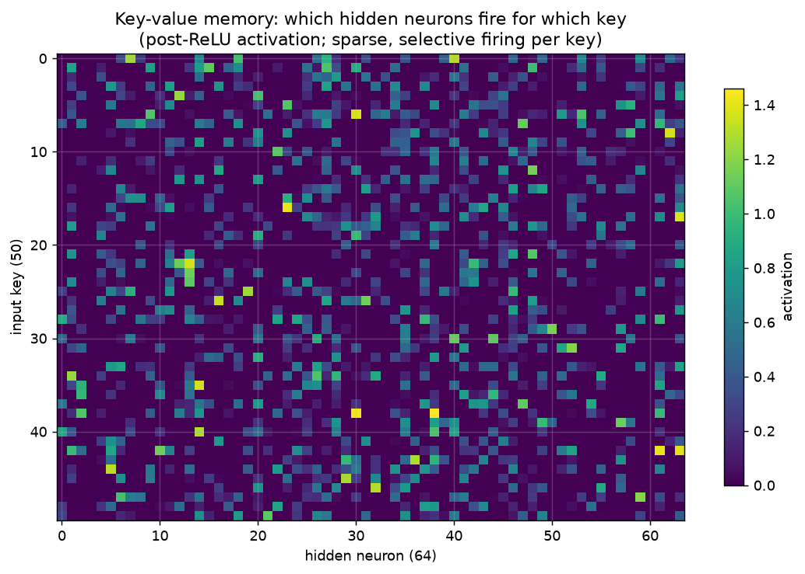
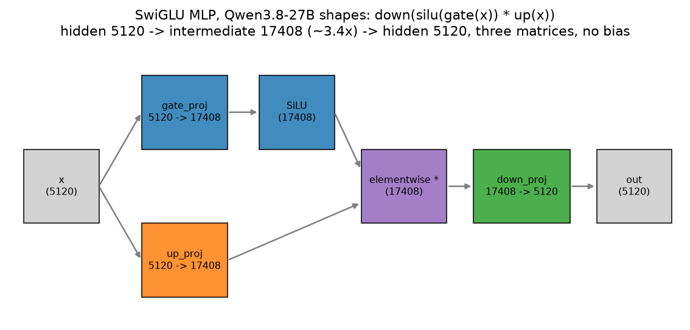
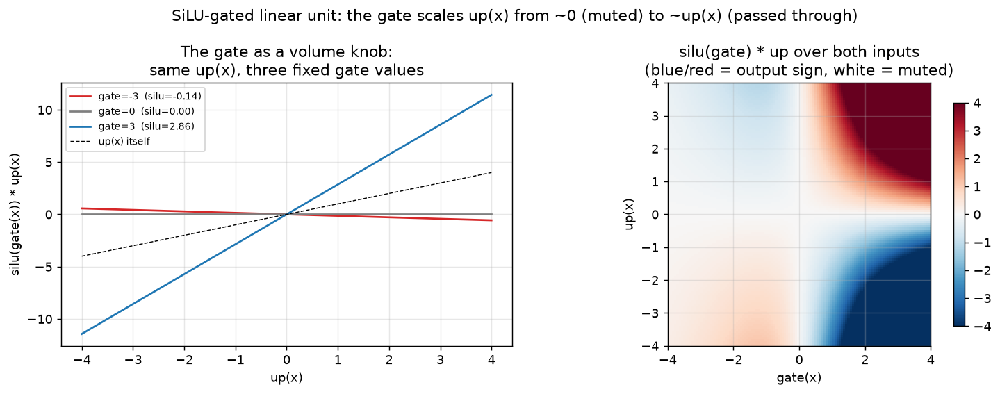
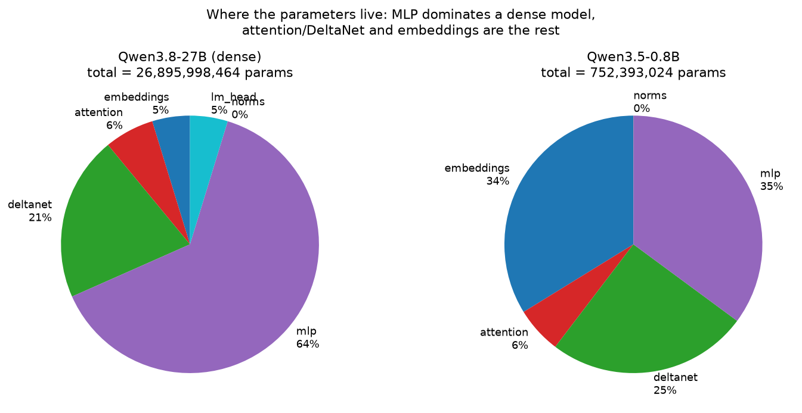
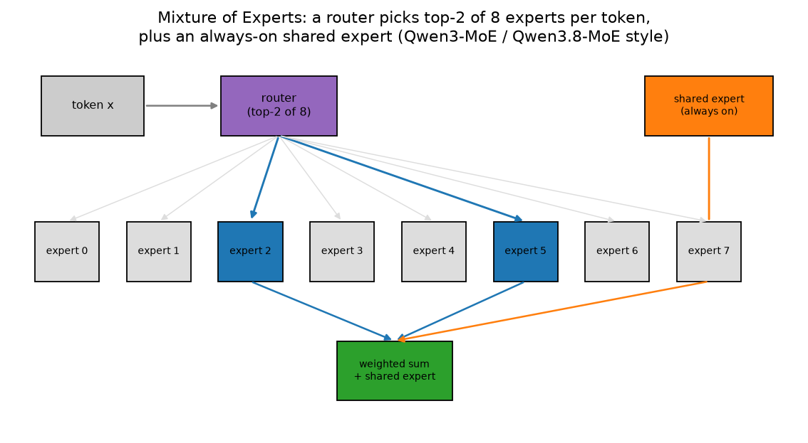
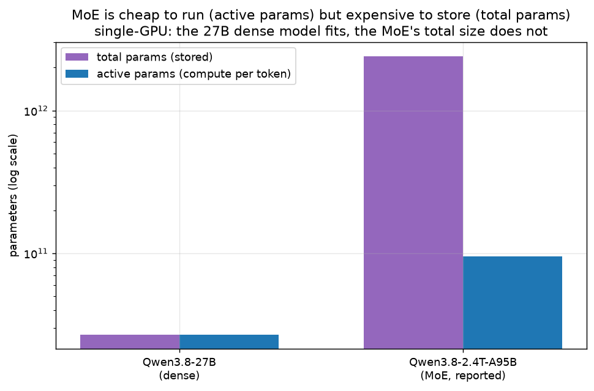
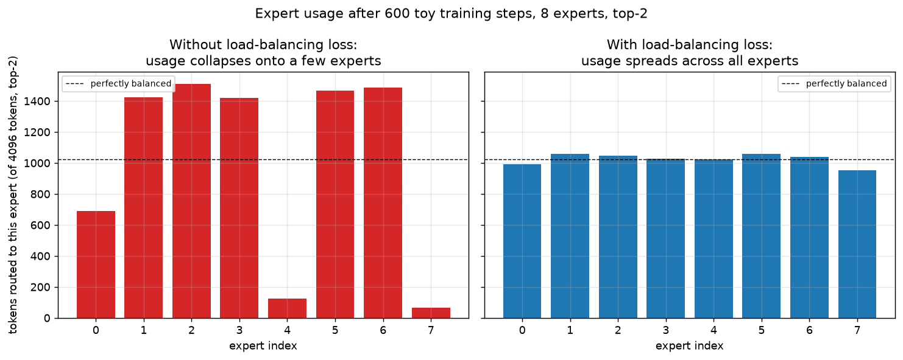

# 06 — The MLP block (SwiGLU) and Mixture of Experts

Chapters 03–05 built the part of a decoder layer that mixes information *between* tokens:
attention lets token 10 look at token 3, RoPE (rotary position embedding) tells it how far
away token 3 is, and the residual stream carries the running total forward. This chapter
covers the *other* half of every decoder layer — the MLP (multi-layer perceptron, also
called the feed-forward network or FFN) — which does the opposite job: it processes every
token completely independently, with no mixing between positions at all, and turns out to
hold the majority of a modern LLM (large language model)'s parameters. It also covers
Mixture of Experts (MoE), the trick that lets a model have far more of those parameters
without paying for all of them on every token.

All the code in this chapter lives in `project/src/llm_blocks/ch06_mlp_moe.py`. Regenerate
the figures with:

```bash
cd project
uv run python -m llm_blocks.ch06_mlp_moe plots   # the seven figures below (config download only)
uv run python -m llm_blocks.ch06_mlp_moe demo     # the parameter table quoted in this chapter
```

## What you will learn

- What the MLP block computes, and why "no mixing between tokens" is the point, not a
  limitation — that job belongs to attention.
- The key-value memory intuition (Geva et al. 2021): an MLP's hidden neurons behave like
  pattern detectors, each firing for a specific kind of input and each associated with its
  own "what to add back" direction, demonstrated with a tiny 50-key lookup task.
- SwiGLU (SiLU-gated linear unit): three matrices instead of two, the gate as a per-feature
  volume knob, and the real 5120 → 17408 → 5120 shape used by Qwen3.8-27B.
- Why roughly two-thirds of a dense 27B-class model's parameters live in its MLPs (verified
  with the real config, not an estimate).
- Mixture of Experts (MoE): many small MLPs ("experts"), a router that picks only `k` of
  them per token, and an optional always-on "shared expert".
- Total parameters vs *active* parameters, and why that distinction is the whole point of
  MoE — cheap to run, expensive to store.
- Load balancing: why an untrained router tends to collapse onto a handful of favourite
  experts, and the auxiliary loss that spreads usage back out (a toy training demo showing
  both outcomes side by side).

---

## 1. The MLP: the same computation, applied to every token independently

Look back at chapter 05's residual-stream picture: every decoder layer is `attention` then
`MLP`, each reading the highway and adding something back. Attention's whole purpose is to
let information flow *between* token positions (token 10 reads what token 3 wrote). The MLP
does the opposite: given one token's vector, it computes something new about that token and
adds it back — the *same* function, with the *same* weights, applied to every position, one
at a time, with zero information crossing between positions. If attention is "look around and
gather," the MLP is "now sit and think about what you gathered" — using knowledge baked into
its weights during training, not information from other tokens.

A classic (pre-SwiGLU) MLP is two matrices and a nonlinearity:

```
MLP(x) = down(activation(up(x)))
```

In words: project `x` up to a bigger hidden size (`up`), squash it through a nonlinearity so
the whole thing isn't just one big linear map (chapter 01), then project back down (`down`)
to the model's normal size so it can be added to the residual stream.

## 2. Key-value memory: what a hidden neuron actually does

Geva et al. (2021), "Transformer Feed-Forward Layers Are Key-Value Memories," made a simple
but influential observation: split the two-matrix MLP above at its hidden layer, and the
first matrix's rows behave like **keys** — each hidden neuron is a pattern detector that
lights up for a specific kind of input — while the second matrix's corresponding columns
behave like **values** — whatever that neuron contributes back once it fires, weighted by how
strongly it fired.

`KeyValueMemoryDemo` makes this concrete with a task deliberately too small to solve any way
other than memorising: 50 random "keys" (vectors), each with a random 50-way-distinct
"value" it should map to.

```python
class KeyValueMemoryDemo:
    def __post_init__(self) -> None:
        self.keys = F.normalize(torch.randn(self.n_keys, self.d_model), dim=-1)
        self.values = torch.randn(self.n_keys, self.d_model)
        self.model = nn.Sequential(
            nn.Linear(self.d_model, self.d_hidden),
            nn.ReLU(),
            nn.Linear(self.d_hidden, self.d_model),
        )
```

After training this 1-hidden-layer MLP to map every key to its value (Adam, MSE loss),
`firing_matrix()` records the post-ReLU hidden activations for all 50 keys at once — a
`(50, 64)` matrix where row *i* is "which of the 64 neurons fired for key *i*."



*Look at:* a mostly-dark grid with scattered bright spots, not a uniform haze. Each key
lights up only a handful of the 64 neurons (dark purple = 0, the rest of that row), and
different keys light up different, mostly non-overlapping neurons — exactly the "key
detector" behaviour Geva et al. describe: a trained hidden neuron is not a generic feature,
it is closer to a specific pattern with its own specific payload.

## 3. SwiGLU: three matrices and a volume knob

Every current LLM (Llama, Qwen3, Qwen3.5, Qwen3.8, and effectively everything since roughly
2020) replaces the plain two-matrix MLP with **SwiGLU** (SiLU-gated linear unit — a gated
linear unit that uses SiLU, chapter 01's smooth activation, as the gating function):

```
SwiGLU-MLP(x) = down(silu(gate(x)) * up(x))
```

In words: compute two independent projections of the same input, `gate(x)` and `up(x)`; pass
`gate(x)` through SiLU to turn it into a smooth "how much of `up(x)` should pass through,
per feature" signal between roughly 0 and 1 (with a small negative dip, per chapter 01's SiLU
curve); multiply the two element-wise; project back down. `gate` and `up` are the same shape
and read the same input — the only difference is what happens to each afterward.

```python
class SwiGLUMLP(nn.Module):
    def __init__(self, d_model: int, d_ff: int) -> None:
        super().__init__()
        self.gate_proj = nn.Linear(d_model, d_ff, bias=False)
        self.up_proj = nn.Linear(d_model, d_ff, bias=False)
        self.down_proj = nn.Linear(d_ff, d_model, bias=False)

    def forward(self, x: Tensor) -> Tensor:
        return self.down_proj(F.silu(self.gate_proj(x)) * self.up_proj(x))
```

`tests/test_06_mlp_moe.py` checks this against
`transformers.models.qwen3.modeling_qwen3.Qwen3MLP` (tiny `Qwen3Config`, copied weights,
`rtol=1e-4`) — the two implementations are the exact same formula.



*Look at:* the shapes on each box. Qwen3.8-27B's hidden size is 5120 (`hidden_size`); the
intermediate size is 17408 (`intermediate_size`, both verified with
`AutoConfig.from_pretrained("Qwen/Qwen3.8-27B").get_text_config()`) — roughly **3.4x** the
hidden size, not the "4x" figure quoted for older, non-gated MLPs (SwiGLU's extra `gate`
matrix costs parameters, so implementations shrink the intermediate size to keep the total
FLOP budget comparable to a 4x plain MLP).

**The gate as a volume knob.** The most useful way to think about `silu(gate(x))` is a
per-feature knob between "off" and "fully open," computed fresh for every token:



*Look at:* the left panel fixes `gate(x)` at three values and sweeps `up(x)` — a very
negative gate (red) nearly flattens the line to zero regardless of `up(x)` ("muted"), gate=0
(gray) mutes it entirely just past the origin, and a positive gate (blue) lets `up(x)` through
scaled up. The right panel shows the full 2-D surface: white is "muted" (output near zero
regardless of `up(x)`), and the blue/red regions in the upper-right and lower-right show the
gate passing `up(x)` through with its original sign once `gate(x)` is clearly positive. This
is *learned*, per-feature, per-token behaviour — the network decides at training time which
input patterns should open which gates.

## 4. Where the parameters actually live

`param_breakdown(config)` builds the real model architecture on the `"meta"` device — every
parameter gets a shape but no actual memory — so it can count parameters exactly, even for a
27-billion-parameter config, without downloading a single weight:

```python
def param_breakdown(config) -> dict[str, int]:
    with torch.device("meta"):
        model = AutoModelForCausalLM.from_config(config)
    ...  # bucket every named parameter by "embeddings" / "attention" / "deltanet" / "mlp" / "norms" / "lm_head"
```

`demo` prints the exact numbers for `Qwen/Qwen3.8-27B`'s text config
(`Qwen3_5TextConfig`, hidden 5120, 64 layers) and `Qwen/Qwen3.5-0.8B`:

```
Qwen3.8-27B (dense): total = 26,895,998,464 params
    embeddings:   1,271,398,400  (4.7%)
     attention:   1,677,721,600  (6.2%)
      deltanet:   5,562,044,928  (20.7%)
           mlp:  17,112,760,320  (63.6%)
         norms:         674,816  (0.0%)
       lm_head:   1,271,398,400  (4.7%)

Qwen3.5-0.8B: total = 752,393,024 params
    embeddings:     254,279,680  (33.8%)
     attention:      44,040,192  (5.9%)
      deltanet:     189,776,448  (25.2%)
           mlp:     264,241,152  (35.1%)
         norms:          55,552  (0.0%)
```



*Look at:* the 27B pie is dominated by `mlp` at **64%** — the "roughly two-thirds" figure
this chapter promised, confirmed on the real config rather than assumed. The 0.8B pie looks
very different: `embeddings` jumps to **34%**, because a 248,320-token vocabulary
(`vocab_size`, same for both models) costs the same number of parameters
(`vocab_size * hidden_size`) whether `hidden_size` is 5120 or 1024 — a small model's
embedding table is a much bigger fraction of its total size. This is chapter 02's tied vs
untied embeddings question showing up again from a different angle: at small scale, the
vocabulary itself is expensive.

Chapter 07 covers the ~21–25% `deltanet` slice (Gated DeltaNet, the linear-attention layers
in the 3:1 hybrid stack) and the ~6% `attention` slice (the full-attention layers) in detail;
this chapter only needs the MLP row.

## 5. Mixture of Experts: many MLPs, a router picks a few

A dense MLP runs every parameter for every token. **Mixture of Experts (MoE)** breaks the
single MLP into `n_experts` separate, smaller MLPs ("experts") and adds a small **router**
that looks at each token and decides which `k` experts (with `k` much smaller than
`n_experts`) actually get to process it. The rest of the experts, for that token, do nothing
— no compute, no gradient, as if they were not part of the model at all *this step*.

```python
class TopKRouter(nn.Module):
    def forward(self, x: Tensor) -> tuple[Tensor, Tensor, Tensor]:
        router_logits = self.weight(x)
        router_probs = F.softmax(router_logits, dim=-1)
        topk_weights, topk_indices = torch.topk(router_probs, self.k, dim=-1)
        topk_weights = topk_weights / topk_weights.sum(dim=-1, keepdim=True)
        return router_probs, topk_weights, topk_indices
```

`softmax` turns the router's raw scores into a proper probability distribution over experts;
`topk` keeps only the `k` largest; renormalising the kept weights to sum to 1 makes the final
combination a proper weighted average of just those `k` experts' outputs (matching
`norm_topk_prob=True` in `transformers.models.qwen3_moe.modeling_qwen3_moe.Qwen3MoeTopKRouter`).

`MoELayer` combines the router with `n_experts` independent `SwiGLUMLP`s and, optionally, an
always-on **shared expert** that every token goes through regardless of routing — a pattern
used by Qwen3-MoE and Qwen3.8-MoE so some general-purpose computation does not have to
compete with specialised experts for a router slot:

```python
class MoELayer(nn.Module):
    def forward(self, x: Tensor) -> tuple[Tensor, Tensor, Tensor]:
        ...
        for expert_idx, expert in enumerate(self.experts):
            slot_mask = topk_indices == expert_idx
            token_mask = slot_mask.any(dim=-1)
            weight = (topk_weights * slot_mask).sum(dim=-1, keepdim=True)[token_mask]
            out[token_mask] += weight * expert(x_flat[token_mask])
        if self.shared_expert is not None:
            out = out + self.shared_expert(x_flat)
```

Two sanity checks in `tests/test_06_mlp_moe.py` pin this down: with `n_experts=1, k=1` and no
shared expert, `MoELayer` reduces to exactly one dense `SwiGLUMLP` (there is only one expert
to route to, so nothing about the routing changes the result); and with copied weights,
`MoELayer` matches `transformers.models.qwen3_moe.modeling_qwen3_moe.Qwen3MoeSparseMoeBlock`
(importable directly in `transformers` 5.16) to `rtol=1e-4` — that reference class stores its
experts as fused 3-D tensors (`experts.gate_up_proj`, shape `(n_experts, 2*d_ff, d_model)`)
rather than a list of separate `Linear` layers, purely as a batching optimisation; the
underlying math and the weight values themselves are identical, so the two are directly
comparable once `gate_up_proj[e]` is split in half into `gate` and `up`.



*Look at:* the router (purple) scores all 8 experts but only lights up 2 (blue, "expert 2"
and "expert 5" here) — the other 6 (gray) do no work for this token. The shared expert
(orange) is separate from the router entirely: every token passes through it regardless.

## 6. Total parameters vs active parameters

MoE's whole value proposition is a split between two very different numbers:

- **Total parameters**: every expert's weights, added up — what has to be *stored* (on disk,
  in RAM/VRAM if the whole model is loaded).
- **Active parameters**: only the experts actually used for a *given token* — what has to be
  *computed* on the GPU (graphics processing unit) for that token's forward pass.

As reported on its model card, **Qwen3.8-2.4T-A95B** has 512 experts total, of which 10
routed experts plus 1 shared expert are active per token — 2.4 trillion total parameters,
but only 95 billion active per token (the "A95B" in its name). A token pays roughly the
compute cost of a 95B-parameter dense model, while the model as a whole has the *capacity*
of a 2.4T-parameter one.



*Look at:* log-scale y-axis, because the numbers span three orders of magnitude. For the
dense Qwen3.8-27B (left), the two bars are identical — every parameter is active on every
token, by definition of "dense." For the MoE (right), the "total params" bar towers over the
"active params" bar — the model stores roughly 25x more than it computes per token.

## 7. Load balancing: why an untrained router collapses

Left to train on its own, a router tends toward **expert collapse**: once a handful of
experts happen to get picked slightly more often early in training, they receive more
gradient updates, get slightly better at the task, and become even more likely to be picked
next time — a rich-get-richer feedback loop that can leave some experts almost never used
(wasted capacity) while a few do all the work (no speed benefit over a smaller dense model).

The standard fix (Switch Transformer, Fedus et al. 2021) is an auxiliary **load-balancing
loss** added to the training objective, computed purely from routing statistics:

```
loss = n_experts * sum_e ( f_e * P_e )
```

`f_e` is the fraction of (token, top-k-slot) assignments that went to expert `e`; `P_e` is
that expert's average router probability across the batch. Both hit their minimum
simultaneously only when every expert gets an equal *share of tokens* and an equal *average
score* — at perfect balance, `f_e = P_e = 1/n_experts` for every expert, and the loss reaches
exactly 1.

```python
def load_balancing_loss(router_probs: Tensor, expert_indices: Tensor, n_experts: int) -> Tensor:
    n_tokens, k = expert_indices.shape
    avg_prob = router_probs.mean(dim=0)
    one_hot = F.one_hot(expert_indices, num_classes=n_experts).float()
    assignment_frac = one_hot.sum(dim=(0, 1)) / (n_tokens * k)
    return n_experts * (assignment_frac * avg_prob).sum()
```

`train_toy_moe` trains a small `MoELayer` (8 experts, top-2, no shared expert so every token
depends entirely on routing) on a fixed random regression task for 600 steps, once with only
the task loss and once with the load-balancing loss added, then measures usage on a fresh
batch of 4096 tokens:

```
without balancing loss: [691, 1425, 1512, 1419, 125, 1468, 1487, 65]
   with balancing loss: [991, 1057, 1045, 1026, 1024, 1058, 1038, 953]
```



*Look at:* without the balancing loss (left, red), usage ranges from 65 tokens (expert 7,
almost entirely ignored) to 1512 (expert 2) — a 23x spread despite every expert starting from
an identical random initialisation. With the loss added (right, blue), every expert lands
within about 7% of the perfectly-balanced line (dashed, 1024 tokens each) — the same
architecture, same task, same number of steps, dramatically different outcome purely because
of one extra term in the loss.

## Troubleshooting

**Shape mismatches in `MoELayer`.** `TopKRouter.weight` must be `nn.Linear(d_model,
n_experts)` — a common mistake is transposing this and ending up with a router that scores
*hidden features* instead of *experts*. If `router(x)` raises a shape error or produces
`n_experts`-length output that does not sum to 1 after softmax, check that dimension first.

**`top_k` gradients flow through weights only, not through which experts get picked.**
`torch.topk` is not differentiable through *which indices* it selects — only through the
*values* at those indices. This means gradients reach an expert's own weights only when that
expert is actually selected for a token (via the multiplication by `topk_weights`), and
gradients reach the router's weights only through the *combining weight* of experts that
were already selected, never as a signal saying "you should have picked a different expert
here." `test_load_balancing_gradient_flows_only_through_router_scores` pins this down
directly: after computing `load_balancing_loss` and calling `.backward()`, the router's
weight has a nonzero gradient but every expert's own weights have `grad is None` — the
balancing loss only ever pushes on routing *scores*, never on what an expert computes.

**Expert collapse looks like a bug but is not.** If a from-scratch MoE trains fine on the
task loss but ends up using only 1–2 experts, that is very often *not* a code bug — it is the
expected default behaviour described in section 7. Before debugging the routing code, check
whether a load-balancing loss (or a comparable auxiliary term) is present at all; adding one
and re-running `train_toy_moe`-style usage statistics is a faster diagnostic than reading
through the router's forward pass line by line.

**Fused expert weights vs a list of `Linear` layers.** When loading real MoE weights (not
covered by this chapter's from-scratch tests — no MoE weights are downloaded here) into code
structured like `MoELayer`'s `nn.ModuleList` of separate experts, remember that
`transformers`' `Qwen3MoeExperts` stores all experts as one fused 3-D tensor per projection.
Splitting `gate_up_proj[e]` in half along the intermediate dimension gives `gate` first, `up`
second — get that split backwards and every expert silently computes a different (still
shape-valid, still numerically plausible) function.

## Exercises

1. **A fourth activation.** `SwiGLUMLP` uses SiLU as the gate. Swap in GELU (chapter 01) to
   build a "GeGLU" MLP and compare its `06_gate_behaviour.png`-style curve to SiLU's — where
   do the two gates disagree most?
2. **Capacity factor.** Real MoE implementations often drop tokens that would overflow an
   expert's fixed processing capacity per batch, rather than letting every selected expert
   process an unbounded number of tokens (as `MoELayer` currently does). Add a `capacity`
   parameter to `MoELayer` that drops excess tokens for an overloaded expert and measure how
   much task loss that costs at different levels of imbalance.
3. **`k` sweep.** Rerun `_fig_expert_usage`-style training with `k=1` and `k=4` instead of
   `k=2` (same `n_experts=8`, same `balance_weight`) — does collapse get worse or better as
   `k` grows, and why might that be?
4. **Shared expert ablation.** `test_moe_shared_expert_always_contributes` only checks that
   the shared expert changes the output. Extend `train_toy_moe` to support
   `shared_expert=True` and check whether adding one changes how *balanced* the router's
   usage of the remaining experts becomes.
5. **Parameter breakdown for a from-scratch MoE config.** `param_breakdown` currently only
   works for dense text configs. Sketch (in a comment or docstring, no need to implement) how
   you would extend it to a `Qwen3MoeConfig`-style model, where `mlp` splits further into
   `router`, `experts`, and `shared_expert` sub-buckets.

---

Next: [07_linear_attention_and_deltanet.md](07_linear_attention_and_deltanet.md) — the other
21–25% of a Qwen3.5/3.8 model's parameters from section 4's pie chart: linear attention as a
recurrent state, the delta rule, and the 3:1 hybrid stack that mixes DeltaNet layers with the
full-attention layers from chapter 03.
