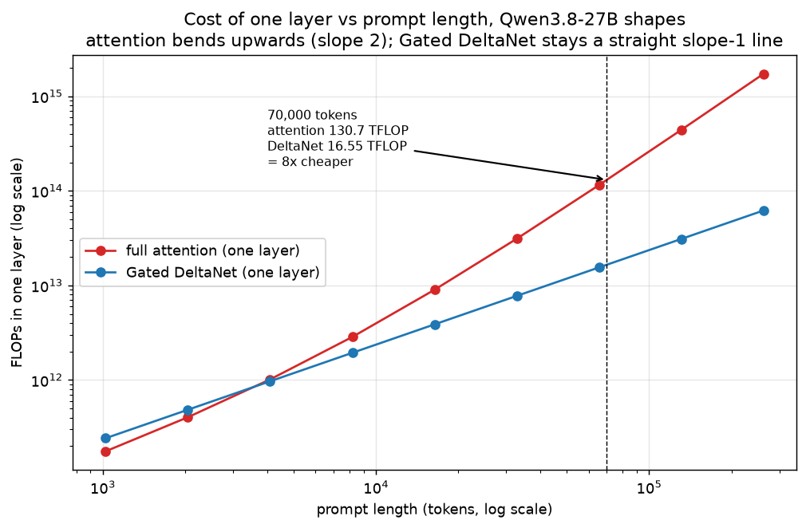
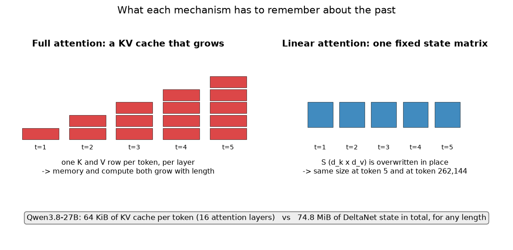
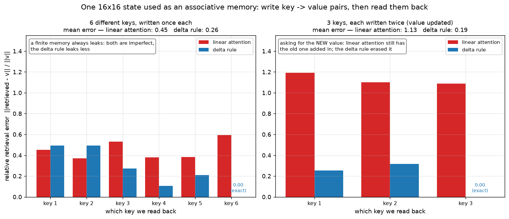
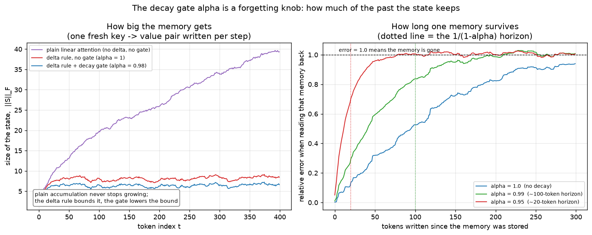
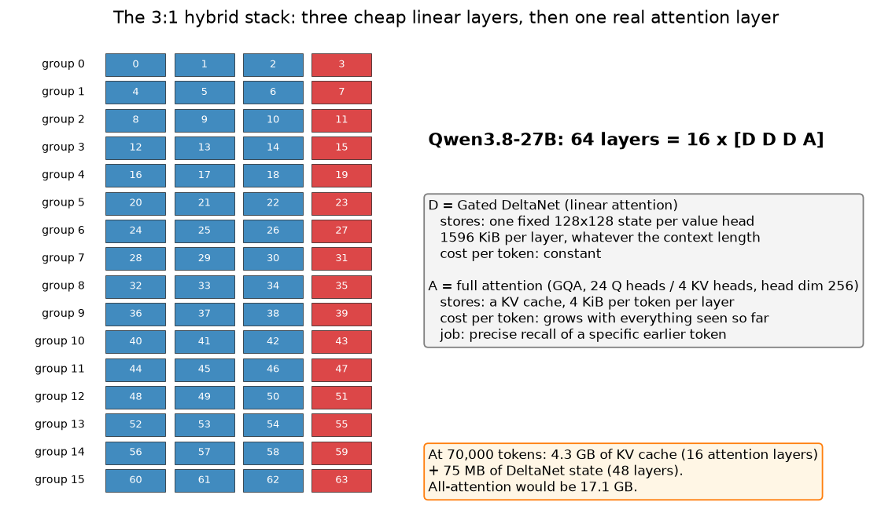
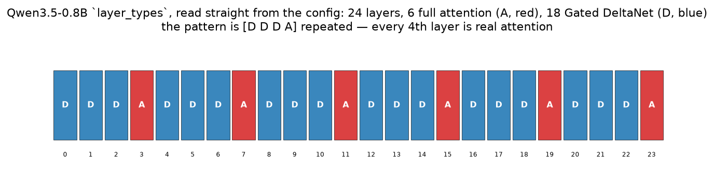
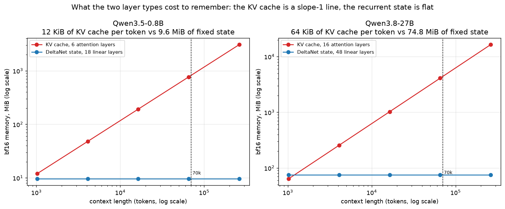
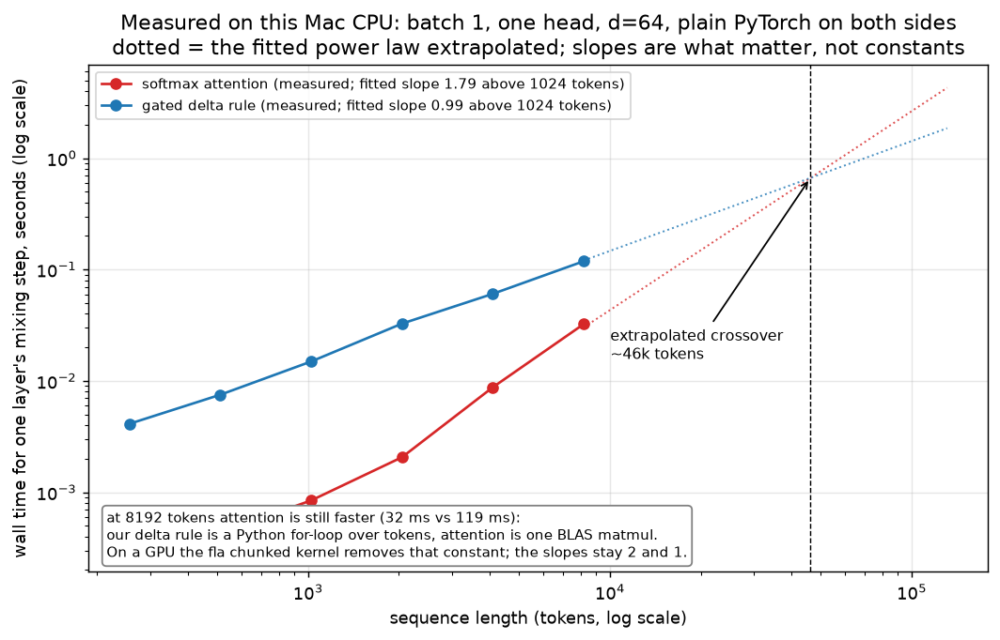

# 07 — Linear attention, the delta rule, Gated DeltaNet and the 3:1 hybrid

Chapter 03 built attention and ended on an uncomfortable number: the score matrix is
`T × T`, so doubling the prompt quadruples the work, and the KV cache (key–value cache — the
stored keys and values of every past token) grows one row per token per layer for ever. That
is fine at 4,000 tokens and painful at 262,144.

This chapter is about the mechanism modern models use to get out from under that number.
The idea is old and simple: drop the softmax, and the entire past collapses into a single
fixed-size matrix — a **state**. The model stops being a thing that looks back over a list
and becomes an RNN (recurrent neural network — a loop that carries a memory forward one step
at a time). The rest of the chapter is about the two repairs that make that memory actually
usable: the **delta rule** (erase before you write) and the **decay gate** (let old memories
fade). Put them together with a short convolution and an output gate and you have **Gated
DeltaNet**, which is what three out of every four layers of Qwen3.5 and Qwen3.8 are.

All the code lives in `project/src/llm_blocks/ch07_linear_attention.py`:

```bash
cd project
uv run python -m llm_blocks.ch07_linear_attention plots        # the six figures below
uv run python -m llm_blocks.ch07_linear_attention plots-real   # two figures from the real configs
uv run python -m llm_blocks.ch07_linear_attention demo         # the numbers quoted here
```

## What you will learn

- Why full attention gets expensive with length, in FLOPs (floating-point operations) and in
  KV-cache bytes, with the real Qwen3.8-27B shapes.
- Linear attention: what dropping the softmax buys you, and why the same maths can be written
  either as a `T × T` matrix (fast to train) or as a loop carrying one state matrix (cheap to
  generate with).
- The catch: a fixed-size memory is a finite associative memory, and old entries interfere.
- The **delta rule**: `S_t = S_{t-1}(I − β_t k_t k_tᵀ) + β_t k_t v_tᵀ` — read what is stored
  under this key, subtract it, write the difference.
- The **decay gate** `α_t`: a forgetting knob that sets roughly a `1/(1−α)`-token horizon.
- `GatedDeltaNetBlock`: our from-scratch version of `Qwen3_5GatedDeltaNet`, matching
  `transformers` to `1e-5` on a real forward pass.
- Why Qwen3.5/3.8 use a **3:1 hybrid** stack rather than going all-linear, and what that
  costs and saves at 70,000 tokens.
- What changes on a GPU (spoiler: the constants, not the slopes).

---

## 1. The problem, in one figure

One full-attention layer's cost has two parts: the four projections (`q`, `k`, `v`, `o`),
which are linear in the number of tokens `T`, and the two attention matmuls (`q @ kᵀ` and
`weights @ v`), which are quadratic. `softmax_attention_cost` counts both, using
`2·m·n·k` FLOPs for an `(m, k) @ (k, n)` matrix product:

```python
def softmax_attention_cost(seq: int, geom: LayerGeometry = QWEN38_27B) -> int:
    d, h, kv, hd = geom.hidden_size, geom.n_heads, geom.n_kv_heads, geom.head_dim
    proj = 2 * seq * d * (h * hd)                 # q_proj
    proj += 2 * 2 * seq * d * (kv * hd)           # k_proj + v_proj
    proj += 2 * seq * (h * hd) * d                # o_proj
    quadratic = 2 * (2 * h * seq * seq * hd)      # scores + weighted sum of values
    return proj + quadratic
```

`linear_attention_cost` does the same for a Gated DeltaNet layer. Every one of its terms is
linear in `seq`, including the recurrence itself, which touches a fixed `128 × 128` state a
constant number of times per token.



*Look at:* both axes are logarithmic, so a straight line is a power law and its steepness is
the exponent. The blue line has slope 1 all the way. The red line starts *below* blue —
a DeltaNet layer has more projection weights, so it is more expensive on short prompts — and
then bends up to slope 2 and never comes back. At the dashed line, 70,000 tokens, one
attention layer costs 130.7 TFLOP and one DeltaNet layer 16.55 TFLOP: **8× cheaper**. At
262,144 tokens the gap is 28×.

The memory side was chapter 03's table. For Qwen3.8-27B in bf16 (2 bytes per number) the KV
cache is 4 KiB per token per attention layer; at 70,000 tokens across its 16 attention layers
that is **4.27 GB**, and it would be 17.09 GB if all 64 layers were attention.

## 2. Drop the softmax and the past collapses into a matrix

Write out one row of attention without the scaling, for a query at position `t`:

```
o_t = Σ_{i ≤ t}  softmax_i( q_t · k_i ) · v_i
```

The softmax is what forces you to compute *all* the scores `q_t · k_i` before you can
normalise any of them. Remove it and replace it with a positive feature map `φ` (we use
`φ(x) = elu(x) + 1`, which is always > 0, standing in for the "weights must be non-negative"
property softmax gave us):

```
o_t = Σ_{i ≤ t}  (φ(q_t) · φ(k_i)) · v_i
    = φ(q_t)ᵀ · ( Σ_{i ≤ t} φ(k_i) v_iᵀ )
```

In plain words: because there is no softmax in the way, the sum over the past can be pulled
*inside*, and everything the past contributes is a single matrix
`S_t = Σ_{i ≤ t} φ(k_i) v_iᵀ` of shape `d_k × d_v`. That matrix does not depend on the query
at all. So you can build it once, incrementally, and each new token just reads from it:

```
S_t = S_{t-1} + k_t v_tᵀ        (write)
o_t = S_tᵀ q_t                  (read)
```

That is an RNN. `S` is its hidden state, and it happens to be a matrix rather than a vector.
Both forms are in the module and the tests check they agree:

```python
def linear_attention_recurrent(q, k, v):
    """S_t = S_{t-1} + k_t v_t^T ;  o_t = S_t^T q_t"""
    qh, kh, vh = elu_feature_map(q.transpose(1, 2)), elu_feature_map(k.transpose(1, 2)), v.transpose(1, 2)
    b, h, t, d_k = kh.shape
    d_v = vh.shape[-1]
    state = torch.zeros(b, h, d_k, d_v, dtype=vh.dtype, device=vh.device)
    out = torch.zeros(b, h, t, d_v, dtype=vh.dtype, device=vh.device)
    for i in range(t):
        state = state + kh[:, :, i].unsqueeze(-1) * vh[:, :, i].unsqueeze(-2)
        out[:, :, i] = (state * qh[:, :, i].unsqueeze(-1)).sum(dim=-2)
    return out.transpose(1, 2), state
```

The two forms exist for two different jobs. **Training** and prompt processing use the
parallel form — `((φ(q) φ(k)ᵀ) ⊙ causal_mask) @ v` — because a GPU would rather do one big
matmul than a `T`-step Python loop. **Generation** uses the recurrent form, because then each
new token is a constant amount of work and a constant amount of memory. Same numbers, two
schedules.



*Look at:* the left stack gets taller with every token — that is the KV cache. The right one
never changes size. Qwen3.8-27B carries 64 KiB of KV cache **per token**, versus 74.8 MiB of
DeltaNet state **in total, at any length whatsoever**. At 70,000 tokens the KV cache is
4.27 GB and the DeltaNet state is still 75 MB.

## 3. The catch: a finite memory interferes with itself

Nothing is free. `S` is a fixed `d_k × d_v` matrix that has to hold everything, and reading
it back is not exact. Read key `k_i` out of `S = Σ_j k_j v_jᵀ` (with unit-length keys, so
`k_i · k_i = 1`):

```
Sᵀ k_i  =  v_i  +  Σ_{j ≠ i} (k_j · k_i) v_j
```

The first term is what you wanted. The second is every *other* stored value, weighted by how
similar its key is to yours. Unless the keys are exactly orthogonal — and in a `d`-dimensional
space you only get `d` mutually orthogonal directions — that second term is real interference,
and it grows as you store more.

There is a worse case, and it is the common one in language. What if the *same* key is
written twice, because the text updated a fact? "Alice's phone number is 555-1234 … [200
tokens] … Alice's new number is 555-9999." Plain linear attention has no subtraction anywhere
in it. It adds the second value on top of the first, and reading the key back returns roughly
`old + new` — neither answer.

## 4. The delta rule: erase, then write

The fix is one line, and it is 30 years old (the Widrow–Hoff or "delta" rule, brought to
linear attention by Schlag et al., 2021):

```
S_t = S_{t-1} (I − β_t k_t k_tᵀ) + β_t k_t v_tᵀ
```

which rearranges to the form the code actually uses:

```
S_t = S_{t-1} + β_t k_t (v_t − S_{t-1}ᵀ k_t)ᵀ
```

In plain words: **before writing, read what is currently stored under this key, and write only
the difference.** If the slot already holds the right answer, nothing changes. If it holds the
old phone number, that old number is subtracted out and the new one goes in. `β_t ∈ (0, 1)` is
the *write strength*: `β = 0` writes nothing, `β = 1` overwrites completely (with unit-length
keys, `I − k kᵀ` is exactly the projection that deletes the `k` direction).



*Look at:* two experiments, one 16×16 state each. **Left**, six different keys written once:
both writers are imperfect because a finite memory always leaks, but the delta rule's mean
error is 0.26 against 0.45 — and the last key written comes back exactly (error 0). **Right**
is the case the rule exists for: three keys, each written twice with a new value, then asked
for the new value. Linear attention's mean error is **1.13** — it is returning roughly
`old + new`, which is worse than useless — while the delta rule's is **0.19**.

## 5. Gating: let old memories fade

The delta rule fixes *overwriting*. It does not give the model any way to say "that whole
topic is over, forget it." For that, Gated DeltaNet (Yang et al., ICLR 2025) borrows Mamba2's
scalar forget gate `α_t ∈ (0, 1)`, applied to the whole state before each write:

```
S_t = S_{t-1} · α_t · (I − β_t k_t k_tᵀ) + β_t k_t v_tᵀ
```

Plain sentence: every step, shrink everything already in memory a little, then do the delta
write. A memory stored `n` steps ago has been multiplied by `α` `n` times, so it survives for
roughly `1/(1 − α)` tokens. `α = 0.99` is a ~100-token horizon; `α = 1` is "never forget."
Crucially `α_t` is predicted per token and per head, so the model chooses its own horizon
moment by moment — and the two knobs are complementary: `α` fades everything, `β` targets one
key.

Our implementation is the whole mechanism in one loop:

```python
for i in range(t):
    k_t, v_t, q_t = kh[:, :, i], vh[:, :, i], qh[:, :, i]
    state = state * alpha_h[:, :, i, None, None]        # let old memories fade
    stored = (state * k_t.unsqueeze(-1)).sum(dim=-2)    # S^T k_t: what is there now
    delta = (v_t - stored) * beta_h[:, :, i, None]      # the correction to write
    state = state + k_t.unsqueeze(-1) * delta.unsqueeze(-2)
    out[:, :, i] = (state * q_t.unsqueeze(-1)).sum(dim=-2)
```

`delta_rule_recurrent` is just this with `α = 1`.



*Look at:* **left**, how big the state gets when you write one fresh pair per token. Plain
accumulation (purple) never stops growing — that is the un-repaired linear attention of
section 2. The delta rule alone (red) already bounds it, because subtracting before writing
stops the same directions piling up. The gate (blue) lowers the bound further. **Right**, how
long a single stored memory lasts: the dotted vertical lines are the predicted `1/(1−α)`
horizons (20 tokens for `α = 0.95`, 100 for `α = 0.99`) and the curves cross into "mostly
forgotten" right about there.

## 6. Gated DeltaNet, the whole block

The real layer wraps the rule in four more pieces. From
`transformers.models.qwen3_5.modeling_qwen3_5.Qwen3_5GatedDeltaNet`:

1. **One projection for q, k and v together** (`in_proj_qkv`), plus small projections
   `in_proj_a` and `in_proj_b` that produce one number per value head per token:
   `β = sigmoid(b)` and `α = exp(−exp(A_log) · softplus(a + dt_bias))`. That formula looks
   fussy but only guarantees `α ∈ (0, 1)` with a learnable per-head range.
2. **A short causal convolution**, kernel 4, depthwise (each channel convolved separately),
   over q/k/v followed by SiLU. It lets each token mix with its 3 predecessors — cheap local
   context that a purely recurrent state is bad at, and it measurably helps.
3. **L2-normalised keys and queries.** `l2norm(x) = x / sqrt(Σx² + 1e-6)` makes every key a
   unit vector, which is what makes `I − β k kᵀ` a well-behaved projection. `q` is then
   scaled by `1/sqrt(d_k)` as usual.
4. **The gated delta rule**, then **RMSNorm (root-mean-square normalization, chapter 05) with
   an output gate** — `w · rms_norm(out) ·
   silu(z)`, where `z` comes from its own projection `in_proj_z` — and finally `out_proj`.

Our version mirrors it one-to-one:

```python
mixed = self.in_proj_qkv(x).transpose(1, 2)                    # (B, conv_dim, T)
mixed = F.silu(self.conv1d(mixed)[:, :, :t]).transpose(1, 2)   # causal: drop the tail
q, k, v = torch.split(mixed, [self.key_dim, self.key_dim, self.value_dim], dim=-1)
beta = self.in_proj_b(x).sigmoid()
alpha = torch.exp(-self.A_log.exp() * F.softplus(self.in_proj_a(x) + self.dt_bias))
if self.num_v_heads > self.num_k_heads:                        # value heads share key heads
    repeat = self.num_v_heads // self.num_k_heads
    q, k = q.repeat_interleave(repeat, dim=2), k.repeat_interleave(repeat, dim=2)
q, k = l2norm(q) / math.sqrt(self.head_k_dim), l2norm(k)
core, _ = gated_delta_rule_recurrent(q, k, v, beta, alpha)
z = self.in_proj_z(x).reshape(b, t, self.num_v_heads, self.head_v_dim)
return self.out_proj(self.norm(core, z).reshape(b, t, self.value_dim))
```

**The equivalence test result.** `tests/test_07_linear_attention.py` builds a tiny
`Qwen3_5TextConfig`, instantiates the real `Qwen3_5GatedDeltaNet`, copies all nine weight
tensors into our block, and compares one forward pass on `(2, 11, 32)` input with
`torch.testing.assert_close(..., rtol=1e-4, atol=1e-5)`. It passes — for both the "one value
head per key head" case and the `repeat_interleave` case. The rule functions are checked
separately against *both* of the reference kernels, `torch_recurrent_gated_delta_rule` and
the chunked `torch_chunk_gated_delta_rule`, and match both. All 20 tests pass in about 3
seconds, no downloads.

That the chunked kernel and the token-by-token loop agree is worth pausing on: the chunked
version is not an approximation, it is the same recurrence rewritten so that 64 tokens at a
time become a handful of matmuls. That is how this runs fast on a GPU while staying an RNN.

### The real numbers

Verified with `AutoConfig.from_pretrained`:

| | Qwen3.5-0.8B | Qwen3.8-27B |
|---|---|---|
| hidden size / layers | 1024 / 24 | 5120 / 64 |
| attention: Q heads : KV heads, head dim | 8 : 2, 256 | 24 : 4, 256 |
| DeltaNet: QK heads / V heads / head dim | 16 / 16 / 128 | 16 / 48 / 128 |
| conv kernel | 4 | 4 |
| RMSNorm eps / max context | 1e-6 / 262,144 | 1e-6 / 262,144 |
| `layer_types` | `[D D D A] × 6` | `[D D D A] × 16` |

Note the 27B's DeltaNet has 48 value heads sharing 16 key heads — the same
"several queries per key" idea as GQA (grouped-query attention), applied to the state.

## 7. Why hybrid, and why 3:1

If linear layers are so much cheaper, why keep any attention at all? Because the two
mechanisms are good at different things. A fixed `128 × 128` state is a *lossy summary*: it
is excellent at "what has this document been about", and structurally incapable of "quote me
the exact 40-digit number that appeared 60,000 tokens ago." Attention keeps every key and
value verbatim, so it can do exact recall — that is what you pay the `T²` and the KV cache
for. Every strong long-context model published in the last two years is a hybrid for this
reason.

Qwen3.5 and Qwen3.8 use a ratio of 3:1. `Qwen3_5TextConfig.__post_init__` generates it:

```python
self.layer_types = [
    "linear_attention" if bool((i + 1) % interval_pattern) else "full_attention"
    for i in range(self.num_hidden_layers)
]
```

with `interval_pattern = 4` — so layers 0, 1, 2 are DeltaNet, layer 3 is attention, and
repeat.





*Look at:* the strip is the 0.8B's `layer_types` list read straight off the config — no
hand-drawing, the pattern is really `[D D D A]`. The 27B is the same pattern, 16 groups deep.



*Look at:* in both panels the red KV-cache line is a slope-1 straight line and the blue
DeltaNet-state line is flat. For the 27B they cross at about 1,200 tokens — below that the
recurrent state is the more expensive of the two! — and after that the KV cache runs away.
At the dashed 70,000-token mark: 4.27 GB of KV cache and 75 MB of state.

The compute side, from `demo`, for a 70,000-token prompt on the 27B:

| | one layer | whole 64-layer stack |
|---|---|---|
| full attention | 130.70 TFLOP | 8,364.70 TFLOP (if all 64 were attention) |
| Gated DeltaNet | 16.55 TFLOP | — |
| **3:1 hybrid (16 A + 48 D)** | — | **2,885.72 TFLOP** |

2.9× less compute and 4× less KV cache, for the price of three quarters of the layers being
unable to do exact recall on their own. In practice the attention layers are enough to carry
the recall, and the DeltaNet layers carry the cheap long-range context around it.

For a 24 GB card the arithmetic from chapter 03 still holds: a 4-bit 27B leaves roughly 8 GB
free, and 70K tokens of hybrid context asks 4.3 GB of it. All-attention would ask 17 GB and
simply not fit.

## 8. What changes on a GPU

Our benchmark is honest and slightly humbling.



*Look at:* the slopes are exactly what the theory says — a fitted 1.85 for attention and 1.00
for the delta rule (fitted above 1024 tokens, where call overheads stop dominating). But the
blue line is *above* the red one everywhere we can measure. At 8192 tokens attention takes
about 35 ms and our delta rule about 115 ms. Extrapolating the two fits, they would cross
around 40,000 tokens.

The reason is the constant factor, not the maths: attention is one BLAS matrix multiply, our
delta rule is a Python `for` loop doing ten tiny tensor operations per token. Real
implementations use the **chunked** form — `torch_chunk_gated_delta_rule` in `transformers`,
and the Triton kernels in the [`fla`](https://github.com/fla-org/flash-linear-attention)
package (`chunk_gated_delta_rule`, `fused_recurrent_gated_delta_rule`) when it is installed.
`fla` is *not* installed on this Mac, which is exactly why our tests can compare against the
pure-torch fallbacks — `transformers` uses them automatically when the kernel package is
missing.

On a GPU with `fla`, the delta rule's constant drops by orders of magnitude and it wins from
a few thousand tokens on. What does *not* change is the slope: attention is quadratic and the
delta rule is linear, on any hardware. For measured GPU numbers on an RTX 4090, see the
hybrid-vs-dense benchmark in `../llm_training/03_model_from_scratch.md`.

## Troubleshooting

**Our delta rule and `transformers`' disagree by a lot.** The reference kernels do two things
to `q` and `k` before the recurrence when `use_qk_l2norm_in_kernel=True` (which Qwen3.5 always
passes): they L2-normalise both, *and* they scale `q` by `1/sqrt(d_k)`. Our
`gated_delta_rule_recurrent` does neither — the caller decides. If you compare them directly,
replicate both steps, as `_normalised()` in the test file does.

**`g` is not `α`.** `transformers` passes `g = log(α)` and does `α = g.exp()` inside. Feeding
`α` where `g` is expected gives a state that decays far too slowly (since `exp(0.98) ≈ 2.66`,
it actually *grows*). Our function takes `α` directly.

**`fla` is not installed and everything is slow.** That is expected and fine on CPU;
`transformers` falls back to `torch_chunk_gated_delta_rule` automatically. Do not try to
`pip install flash-linear-attention` on the Mac — it is Triton/CUDA only.

**The convolution output is one token too long.** `nn.Conv1d` with `padding=kernel-1` returns
`T + kernel - 1` positions; the last `kernel-1` of them peek at padding, not at real future
tokens, but they are not part of the sequence. You must slice `[:, :, :T]`. Forgetting this
does not throw — it silently shifts everything.

**Shapes: `(B, T, H, D)`, not `(B, H, T, D)`.** This chapter's module keeps the
`transformers` convention (heads in dimension 2) so our functions and the reference ones take
the same tensors. Chapter 03's attention code uses `(B, H, T, D)` internally. Transposing in
the wrong place produces plausible-looking garbage rather than an error.

**More value heads than key heads.** When `num_v_heads > num_k_heads`, `q` and `k` are
`repeat_interleave`d (not `repeat`ed) along the head dimension. `repeat` would pair the heads
up differently and quietly produce the wrong answer.

## Exercises

1. **Set β to 1 everywhere.** In `GatedDeltaNetBlock.forward`, replace
   `beta = self.in_proj_b(x).sigmoid()` with `beta = torch.ones_like(...)` and rerun
   `test_block_output_shape_and_causality`. Then run `overwrite_errors` with `n_keys=8` in a
   16-dim state. Full overwriting is perfect for the most recent key — but what happens to
   the other seven, and why might a model prefer a *partial* write?
2. **Remove the convolution.** Delete the `conv1d` line from `GatedDeltaNetBlock.forward` and
   check that the block still runs and stays causal. The equivalence test will now fail —
   by how much? What kind of information do you think those 3 preceding tokens carry that the
   recurrent state finds hard to hold?
3. **Change the ratio to 7:1.** Build a `Qwen3_5TextConfig` with
   `full_attention_interval=8` and 64 layers, pass it through `geometry_from_config`, and
   recompute the 70,000-token KV cache and total FLOPs. How much do you save against 3:1, and
   how much against all-attention? At what point do you think you would start losing recall
   quality, and how would you test that rather than guess?
4. **Find the real crossover.** Extend `BENCH_LENGTHS` to include 16384 (watch your RAM: the
   score matrix alone is about 1 GB at fp32) and see whether the measured curves meet the
   ~40,000-token extrapolation. Where does the fitted attention slope end up?
5. **Break the state.** Run `associative_memory_errors(n_pairs=n, dim=16)` for `n` = 2, 4, 8,
   16, 32 and plot the mean error against `n` for both writers. Where does a 16×16 state
   saturate, and how does that number relate to `dim`?
