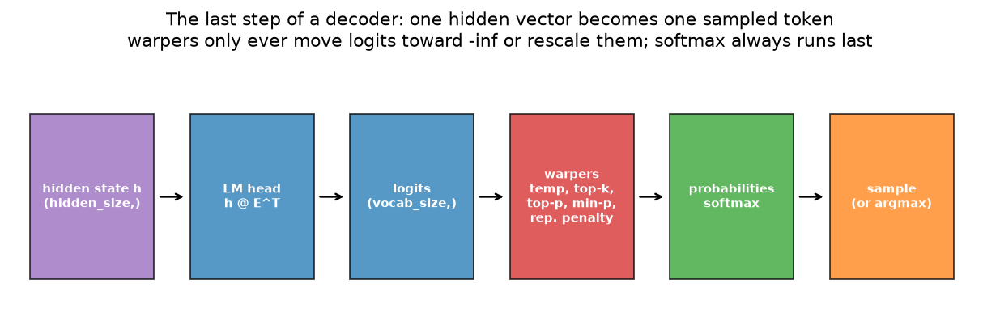
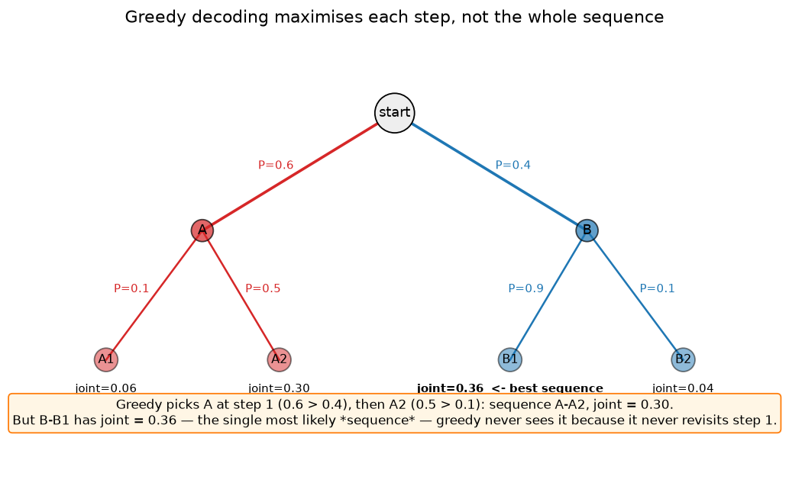
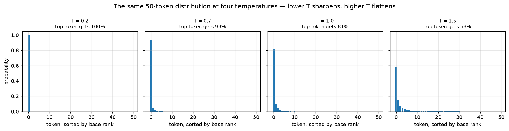
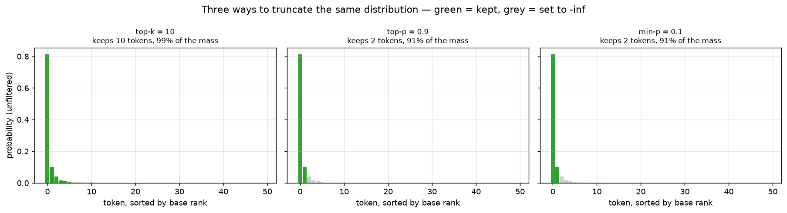
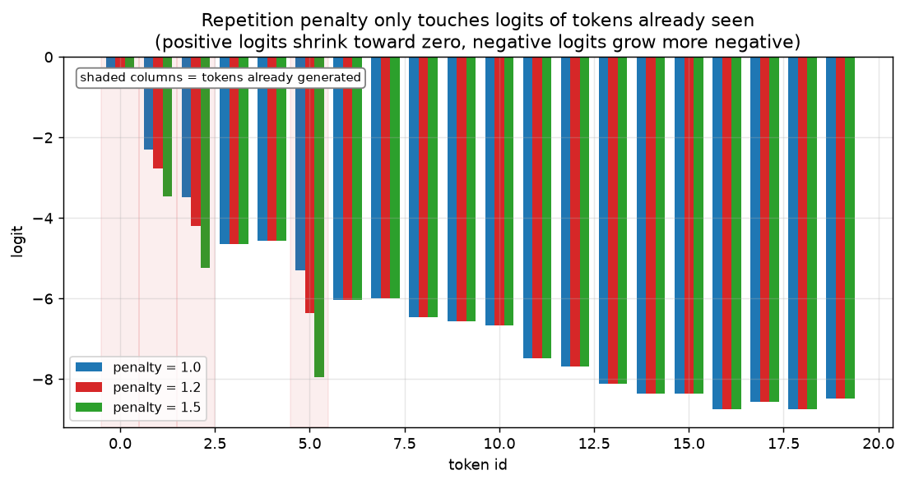
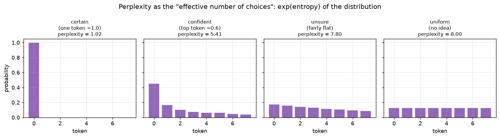
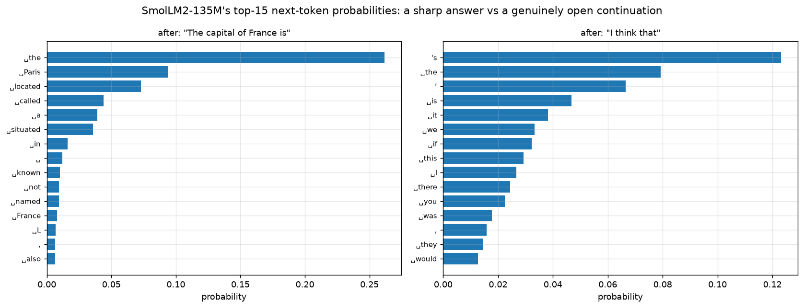
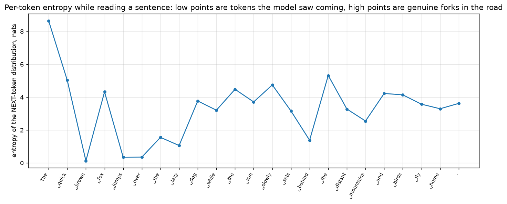

# 08 — From logits to text: decoding strategies, perplexity, thinking tokens

Every chapter so far has built machinery that turns tokens into hidden vectors: embeddings,
attention, MLPs (multi-layer perceptrons, the feed-forward blocks from chapter 06), normalization.
This chapter is about the very last step — the one that turns
the model's output back into a single token, over and over, until you have a sentence. It is a
much smaller amount of math than attention or the MLP, but it is the part every user-facing
knob (`temperature`, `top_p`, "creativity") actually controls, and it is where a perfectly
good model can still produce garbage or infinite loops if the knobs are set badly.

All the code lives in `project/src/llm_blocks/ch08_sampling.py`:

```bash
cd project
uv run python -m llm_blocks.ch08_sampling plots        # the six figures below
uv run python -m llm_blocks.ch08_sampling plots-real    # two figures from SmolLM2-135M
uv run python -m llm_blocks.ch08_sampling demo          # the numbers quoted here
uv run python -m llm_blocks.ch08_sampling demo-real     # 3 real completions + one perplexity
```

## What you will learn

- The last half-step of the network: hidden vector → logits (via the LM head from chapter 02)
  → probabilities → one sampled token, and why every "decoding strategy" only ever touches the
  middle of that pipeline.
- **Greedy decoding** and why always taking the locally-best token can still miss the
  best-scoring *sequence*.
- **Temperature**, **top-k**, **top-p** (nucleus), and **min-p**: four different ways to
  reshape or truncate the next-token distribution before sampling from it, and when each one
  is the right tool.
- **Repetition penalty**: why models loop, and the one-line fix.
- How Ollama's generation parameters (`temperature`, `top_k`, `top_p`, `min_p`,
  `repeat_penalty`, `num_ctx`) map onto exactly the functions in this chapter.
- **Perplexity**: "how surprised was the model, on average", turned into an "effective number
  of choices" you can read at a glance — and the metric `../llm_training/07_export_to_ollama.md`
  uses to compare quantised models.
- Why "thinking" (`<think>...</think>`) is not a different network mode — it is the exact same
  sampling loop, just producing tokens the chat template treats as scratch space.

## 1. The last half-step: logits → probabilities → one token

Chapter 02 covered how a hidden vector `h` becomes a vector of **logits** — one raw score per
vocabulary entry — via the LM head, `logits = h @ E^T`. Chapter 02 also covered **softmax**,
which turns those logits into a probability distribution. This chapter is about everything
that happens *between* those two things and the final choice of one token id:



The middle box — "warpers" — is the only place decoding strategies live. A **warper** (the
name `transformers` uses, and the one this chapter keeps) takes a logits vector and returns
another logits vector of the same shape: it never picks a token itself, it only makes some
tokens more or less likely to be picked afterwards, usually by setting unwanted logits to
`-inf` (so they get exactly probability 0 once softmax runs) or by rescaling every logit by
the same factor. Every function below has this same shape: `(vocab,) -> (vocab,)`, which is
also why the tests in `tests/test_08_sampling.py` can compare them directly, token for token,
against `transformers.generation.logits_process`'s reference implementations.

## 2. Greedy decoding: always take the best next token

The simplest possible strategy is to always pick the single highest-scoring token:

$$\text{next} = \arg\max_i \; \text{logits}_i$$

```python
def greedy(logits: Tensor) -> Tensor:
    return logits.argmax(dim=-1)
```

Greedy decoding is deterministic (the same prompt always produces the same output) and cheap,
which makes it the right default for anything that needs a single, reproducible answer — code
completion, a factual lookup, a classification-style prompt. Its weakness is that maximizing
*each step* is not the same as maximizing the *whole sequence*:



At step 1, greedy takes branch A (probability 0.6) over branch B (0.4) because 0.6 is bigger —
a perfectly reasonable, purely local decision. But once you multiply through both steps, the
sequence A→A2 has a joint probability of 0.30, while B→B1 — a branch greedy never even looks
at, because it already committed to A — has a joint probability of 0.36. Greedy is blind to
this because it never reconsiders step 1 in light of what step 2 could have offered. Beam
search (keeping several candidate sequences alive at once instead of one) is the classic fix
for this specific problem, but it is expensive and, for open-ended text, tends to produce
bland, repetitive output — which is why most chat models default to *sampling* instead, the
subject of the next three sections.

## 3. Temperature: sharpening or flattening the distribution

Chapter 02 already introduced temperature (`softmax(logits / T)`); this chapter uses it as the
first knob in the decoding pipeline, applied to logits *before* any of the truncation
strategies below:

```python
def temperature(logits: Tensor, temp: float) -> Tensor:
    return logits / temp
```

Dividing by `temp < 1` stretches the *differences* between logits before they hit the
exponential in softmax, so the biggest logit ends up disproportionately bigger — a sharper,
more confident distribution. `temp > 1` does the opposite: it squashes the differences,
flattening the distribution toward uniform.



The distribution used here (`zipfian_logits` in the code) is a synthetic but realistic
next-token shape: a handful of tokens with real mass and a long tail that trails off, which is
close to what a real model actually outputs (see the real next-token figure in section 6). At
`T=0.2` the top token gets essentially all the probability — sampling from this is nearly
identical to greedy. At `T=1.5` the top token's share drops to 58%, and the tail tokens — which
were nearly invisible at `T=1.0` — become real possibilities. `T=0` is a division by zero and
is not a valid temperature; if you want fully deterministic output, use `greedy` instead.

## 4. Top-k, top-p, and min-p: which tokens are even allowed

Temperature reshapes the *whole* distribution but never removes a token entirely — even a
token with 0.0001% probability keeps a tiny chance of being sampled, and over a long enough
generation, tiny chances add up to visibly weird tokens appearing. Top-k, top-p, and min-p all
solve this by masking out the tokens they don't want (`-inf`, so probability becomes exactly
0) — they differ only in *how they decide the cutoff*:

**Top-k** keeps a fixed number of the highest-scoring tokens, however much or little
probability they add up to:

```python
def top_k(logits: Tensor, k: int, filter_value: float = NEG_INF) -> Tensor:
    k = min(k, logits.shape[-1])
    threshold = torch.topk(logits, k, dim=-1).values[..., -1, None]
    return logits.masked_fill(logits < threshold, filter_value)
```

**Top-p** (nucleus sampling) instead keeps however many tokens are needed to reach a target
amount of *cumulative probability* `p` — a variable number of tokens, but a fixed amount of
mass:

$$\text{keep the smallest set } S \text{ such that } \sum_{i \in S} p_i \geq p$$

```python
def top_p(logits: Tensor, p: float, filter_value: float = NEG_INF) -> Tensor:
    sorted_logits, sorted_idx = torch.sort(logits, dim=-1, descending=False)
    cumulative_probs = sorted_logits.softmax(dim=-1).cumsum(dim=-1)
    sorted_remove = cumulative_probs <= (1 - p)
    sorted_remove[..., -1] = False  # always keep the single best token
    remove = sorted_remove.scatter(-1, sorted_idx, sorted_remove)
    return logits.masked_fill(remove, filter_value)
```

**Min-p** keeps every token whose probability is at least some fraction of the *top* token's
probability — the cutoff adapts to how confident the model already is, instead of being a
fixed count or a fixed cumulative mass:

```python
def min_p(logits: Tensor, p: float, filter_value: float = NEG_INF) -> Tensor:
    probs = logits.softmax(dim=-1)
    threshold = p * probs.amax(dim=-1, keepdim=True)
    remove = probs < threshold
    remove.scatter_(-1, probs.argmax(dim=-1, keepdim=True), False)
    return logits.masked_fill(remove, filter_value)
```



On this particular (quite peaked) distribution, top-k=10 keeps 10 tokens covering 99% of the
mass — generous, because most of those 10 tokens have almost no probability anyway. Top-p=0.9
and min-p=0.1 both happen to keep only the top 2 tokens here, because the distribution is
dominated by one token: top-p stops as soon as 90% of the mass is covered (2 tokens already
clear that bar), and min-p's threshold (10% of the top token's own probability) is already
higher than everything past rank 2. The practical difference between top-p and min-p shows up
on a *flatter* distribution: top-p's cutoff still depends only on the sorted cumulative curve,
while min-p's adapts directly to how much bigger the best token is than the rest — on a flat
distribution min-p keeps far more tokens than it does here, while top-p's behavior changes less.
All three functions always keep at least the single best token, matching
`transformers`'s `min_tokens_to_keep=1` default, so none of them can accidentally remove every
token and leave nothing to sample from.

## 5. Repetition penalty: the fix for "the the the the"

A model sampling at low temperature (or a model that is simply uncertain) can fall into a loop
— the same phrase, or the same token, repeated many times — because whatever made a token
likely once tends to keep making it likely on the next step too. **Repetition penalty** breaks
this by directly discouraging tokens that already appeared in the generated text:

```python
def repetition_penalty(logits: Tensor, prev_ids: Sequence[int], penalty: float) -> Tensor:
    logits = logits.clone()
    if not prev_ids:
        return logits
    idx = torch.as_tensor(sorted(set(prev_ids)), dtype=torch.long)
    vals = logits[idx]
    vals = torch.where(vals < 0, vals * penalty, vals / penalty)
    logits[idx] = vals
    return logits
```

The `penalty` divides positive logits (pushing them toward zero) and multiplies negative
logits (pushing them further negative) — both operations move the score *down*, whichever
side of zero it started on, which is why the rule needs the `if/else` instead of always
dividing:



`penalty = 1.0` is a no-op (the two operations above cancel out); typical useful values are
1.1–1.3. Push it much higher and the model gets actively forced *away* from natural repeats
like "the" or punctuation, which can make the text worse in a different way — this is a knob
to nudge, not to maximize. `presence_penalty` and `frequency_penalty` in the code are two
simpler, additive variants from the OpenAI API convention (subtract a flat amount per token
that appeared at all, or subtract more the more times it appeared); Ollama does not expose
these, so the chapter's Ollama mapping below only covers `repeat_penalty`.

## 6. Ollama's knobs, mapped to this chapter

Ollama (and most other local-inference servers) expose generation settings by name in a
`Modelfile` or API call. Every one of them is one of the functions above:

| Ollama parameter | this chapter | what it does |
|---|---|---|
| `temperature` | `temperature(logits, temp)` | sharpen (`<1`) or flatten (`>1`) the distribution |
| `top_k` | `top_k(logits, k)` | keep only the `k` best tokens |
| `top_p` | `top_p(logits, p)` | keep the smallest set covering probability `p` |
| `min_p` | `min_p(logits, p)` | keep tokens at least `p` × the best token's probability |
| `repeat_penalty` | `repetition_penalty(logits, prev_ids, penalty)` | push down tokens already generated |
| `num_ctx` | — | not a decoding strategy at all; it is the **context window** (chapter 03's KV cache, the key–value cache of past tokens) — how many past tokens the model can see, unrelated to how the next token is chosen |

`sampling_strategy` in the code composes several of these into one `Strategy` function used by
`generate` (section 7), applying them in a fixed order — repetition penalty, then temperature,
then top-k/top-p/min-p, then sample — because temperature has to run *before* top-p or min-p:
both of those read *probabilities*, and temperature changes what those probabilities are.
Apply top-p first and then temperature, and the "90% of the mass" top-p computed no longer
matches the distribution you actually sample from.

## 7. `generate`: the whole decoding loop, five lines long

Put a warper (or several) together with a model and you have text generation:

```python
def generate(model_fn: ModelFn, prompt_ids: list[int], strategy: Strategy, max_new: int) -> list[int]:
    ids = list(prompt_ids)
    for _ in range(max_new):
        logits = model_fn(ids)
        ids.append(strategy(logits, ids))
    return ids
```

`model_fn` is anything that maps "tokens so far" to "next-token logits" — in the tests it is
`make_bigram_model`, a fixed, deterministic lookup table standing in for a real model (a
proper order-1 bigram language model: the next-token distribution depends only on the most
recent token), which is what makes `tests/test_08_sampling.py::test_generate_greedy_...`
reproducible without downloading anything. In `plots_real` and `demo_real`, `model_fn` instead
runs an actual forward pass through SmolLM2-135M and reads the last position's logits — same
`generate` function, same `Strategy` objects, just a different `model_fn`:

```
prompt: 'The best way to learn a new skill is'

[greedy]
  ' to practice it.\n\nThe best way to learn a new skill is to practice it.\n'

[T=0.7, top-p=0.9]
  ' to use it in everyday life. This is especially true for those who are starting to use their new'

[T=1.5]
  ' book. «Although take breaks » happens in absent\r\n    listiform conductra proud fin knots, follow'
```

Three things worth noticing here. Greedy is fluent but falls into exactly the repetition loop
section 5 warned about ("to practice it" twice in 20 tokens) — this is SmolLM2-135M, a small
model, so it happens fast; bigger models loop less often but never never. `T=0.7, top-p=0.9`
is the sweet spot most chat UIs default near: varied but still coherent. `T=1.5` with no
truncation at all is close to gibberish — a reminder that temperature alone, without a
top-k/top-p/min-p floor under it, can sample tokens that were only ever assigned a tiny
probability because the model's logits happened to have long tails, not because they were
ever reasonable continuations.

## 8. Perplexity: how surprised was the model, on average

Chapter 02 introduced cross-entropy loss, `-log p_target`, as "surprise" for a single token.
**Perplexity** is the same idea turned into a number that reads more intuitively: take the
average surprise across a whole sequence, undo the logarithm.

$$\text{perplexity} = \exp\left(\frac{1}{n}\sum_{i=1}^n -\log p(\text{target}_i)\right)$$

```python
def perplexity(logits: Tensor, targets: Tensor) -> float:
    log_probs = F.log_softmax(logits, dim=-1)
    nll = -log_probs.gather(-1, targets.unsqueeze(-1)).squeeze(-1)
    return torch.exp(nll.mean()).item()
```

The exponential undoes the logarithm from cross-entropy, which turns "average log-probability"
into something with a much more concrete reading: **the effective number of equally-likely
choices the model was facing**. A model that assigns probability 1 to every correct token has
perplexity `exp(0) = 1` — no surprise, no choice at all. A model that guesses uniformly over
`V` tokens gets perplexity exactly `V` (this is exactly chapter 02's `ln(vocab_size)` starting
loss, exponentiated). A real, trained model scoring real text lands somewhere in between:

```
perplexity of 'Paris is the capital of France.': 6.58
```

SmolLM2-135M finds this sentence roughly as surprising, on average, as choosing uniformly
among about 6–7 options at each step — much better than guessing among its full ~49,000-token
vocabulary, far from perfect, which is exactly what you would expect from a small, fluent-but-
not-perfect model on an easy, common sentence. `../llm_training/07_export_to_ollama.md` uses
this exact same formula to compare a model before and after quantisation (shrinking its
weights to fewer bits to save memory) — if perplexity on a held-out set barely moves, the
quantised model lost little; if it jumps noticeably, the quantisation was too aggressive.

**Perplexity of a single distribution.** The formula above needs a known correct `target` for
every position. `distribution_perplexity` in the code applies the identical idea
(`exp(entropy)`) to a single distribution with no target at all — "how many effective choices
does *this* distribution offer, regardless of which one turns out to be right":



A near-certain distribution has a perplexity near 1; a fully uniform 8-way distribution has a
perplexity of exactly 8.00 — reading the number off the chart is a direct, model-agnostic
sense of "how many options were realistically on the table here", which is exactly the
question the entropy figure in the next section answers token by token for a real sentence.

## 9. What the real model actually does

Two figures, both from SmolLM2-135M (`plots_real`), connect everything above back to a real
model's actual output.



After `"The capital of France is"`, the model is fairly confident (`" the"` leads, `" Paris"`
close behind, both grammatically compatible continuations) — a distribution shaped roughly
like the "confident" panel above. After the much vaguer `"I think that"`, probability spreads
thinly across a dozen plausible continuations (`'s`, `" the"`, `,`, `" is"`, `" it"` …) — no
single token dominates, because genuinely many continuations are equally reasonable English.



Entropy (section 8's ingredient for perplexity, computed per token instead of averaged) makes
"the model knows when it is sure" visible directly: right after `"The"` almost anything could
follow (high entropy), but after `"quick brown"` the model is nearly certain the next word is
`" fox"` (entropy near 0, a well-known fixed phrase) — and it stays low through the rest of
that idiom before rising again into the more open second half of the sentence. This is the
same signal a model actually uses internally to decide how much it "commits" to a guess; a
UI that shows token-level confidence is reading exactly this number.

## 10. Stop tokens, chat templates, and "thinking" is just more tokens

**Stop tokens and the chat template.** `generate` above loops for a fixed `max_new` tokens, but
a real chat model needs to know *when to stop talking*. Chat models are fine-tuned to produce
a specific **stop token** (often called an end-of-turn or end-of-text token) as soon as their
reply is complete; a generation server simply checks the newest token id against a stop-token
set and ends the loop early when it matches, well before `max_new` is reached. The **chat
template** is the (usually Jinja) text format that wraps a raw conversation into the exact
token sequence the model was fine-tuned to expect — turn markers like `<|im_start|>` (start of
one message) and `<|im_end|>` (end of one message, often the stop token itself) are not magic
to the model; they are ordinary vocabulary tokens that happened to appear, in that role, tens
of millions of times during fine-tuning, which is why sending raw un-templated text to a chat
model produces confused or broken output — the model has simply never seen a conversation
formatted that way.

**"Thinking" is more sampled tokens, nothing else.** Reasoning models emit a block like
`<think>` … reasoning text … `</think>` before their real answer. It is tempting to imagine
this uses some different internal mode of the network, but nothing in this chapter's pipeline
changes: `<think>` is one more token sampled by exactly the same `generate` loop, the
"reasoning" text inside is ordinary tokens sampled the same way as any other output, and
`</think>` is one more sampled token that happens to signal "now answer for real". Qwen3.8's
`enable_thinking` switch is a **chat-template change**, not a network change: with it off, the
template never inserts the opening `<think>` prompt that invites the model to produce a
reasoning block at all, so the same network, given a different templated prompt, simply never
starts one. Everything this chapter covers — temperature, top-p, repetition penalty,
perplexity — applies identically to tokens inside `<think>...</think>` as to tokens outside it.

## Troubleshooting

| symptom | cause | fix |
|---|---|---|
| output is almost all `<unk>` or garbled special-token text | the raw prompt was not passed through the model's chat template (section 10) — the model is seeing token sequences it never trained on | use `tokenizer.apply_chat_template(...)`, never hand-format `<|im_start|>`-style strings yourself |
| the model repeats the same phrase or token forever | temperature too low (near-greedy) with no repetition penalty, or a genuinely degenerate prompt | add `repeat_penalty` around 1.1-1.3 (section 5), or raise temperature slightly; check the prompt is not itself repetitive |
| output looks like noise / random tokens | temperature too high with no top-k/top-p/min-p floor underneath it (section 7's `T=1.5` example) | always pair a high temperature with a top-p (e.g. 0.9) or min-p (e.g. 0.05) filter |
| `top_p` seems to do nothing, or removes almost everything | applied before temperature instead of after (section 6) — top-p reads probabilities, and temperature changes them | always apply temperature first, then top-k/top-p/min-p, exactly as `sampling_strategy` in the code does |
| perplexity is `inf` or `nan` | the model assigned the actual target token a probability that underflowed to exactly 0.0 (see chapter 02's cross-entropy section) | use `log_softmax` (as `perplexity` does), never `log(softmax(...))`; check for a label/shift bug if it persists |

## Exercises

1. In `_fig_greedy_vs_sampling_tree`'s two branch probabilities, change `A2`'s probability from
   0.5 to 0.9 and recompute the joint probabilities by hand — does greedy now find the best
   sequence? At what value of `A2`'s probability does the answer flip?
2. Call `top_k(logits, 5)`, `top_p(logits, 0.5)`, and `min_p(logits, 0.3)` on
   `zipfian_logits(seed=2)` and print how many tokens each keeps — which one is most sensitive
   to changing the random seed, and why (hint: think about what each cutoff depends on)?
3. In `demo_real`, add a fourth strategy, `sampling_strategy(temp=1.0, k=40)` (plain top-k
   sampling, Ollama's historic default), and compare its output to the three already there —
   where does it sit between `T=0.7, top-p=0.9` and `T=1.5`?
4. Compute `perplexity` of the same sentence under SmolLM2-135M and under a uniform-guess
   "model" (`torch.zeros(len(ids), vocab_size)`) — by how many times higher is the uniform
   model's perplexity, and does that ratio match your intuition for "how much the model
   actually learned"?
5. Set `enable_thinking` differently in Qwen3.8's chat template (see the `transformers`
   tokenizer's `apply_chat_template(..., enable_thinking=True/False)`) and print the resulting
   token sequences side by side — confirm section 10's claim that the only difference is the
   presence of an opening `<think>` prompt, not any change to the token ids that come before it.
