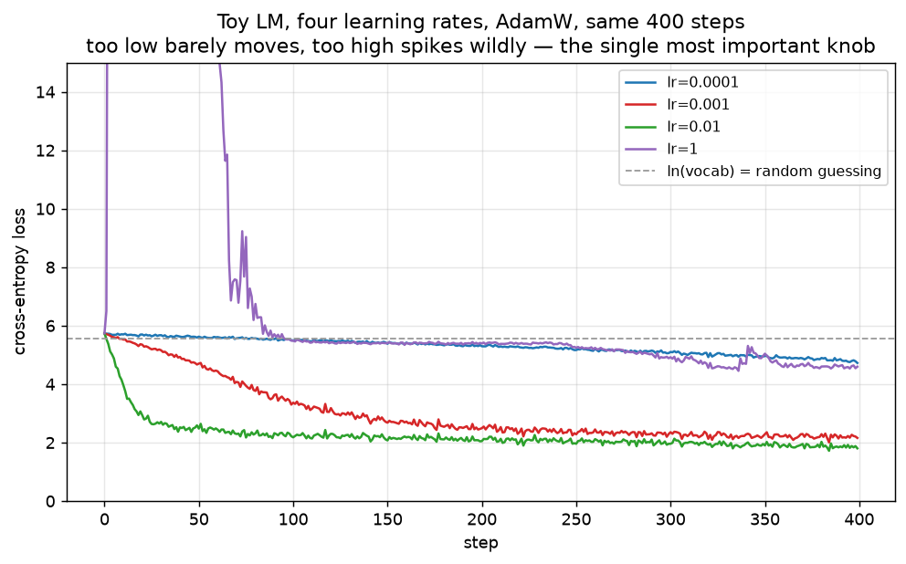
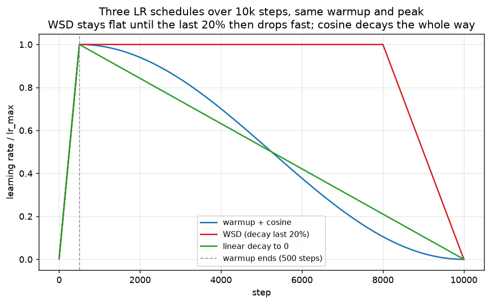
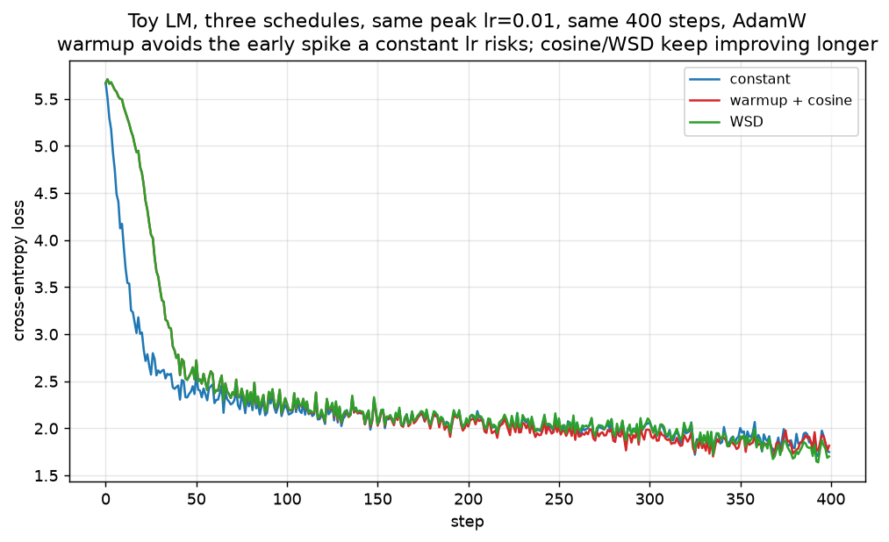
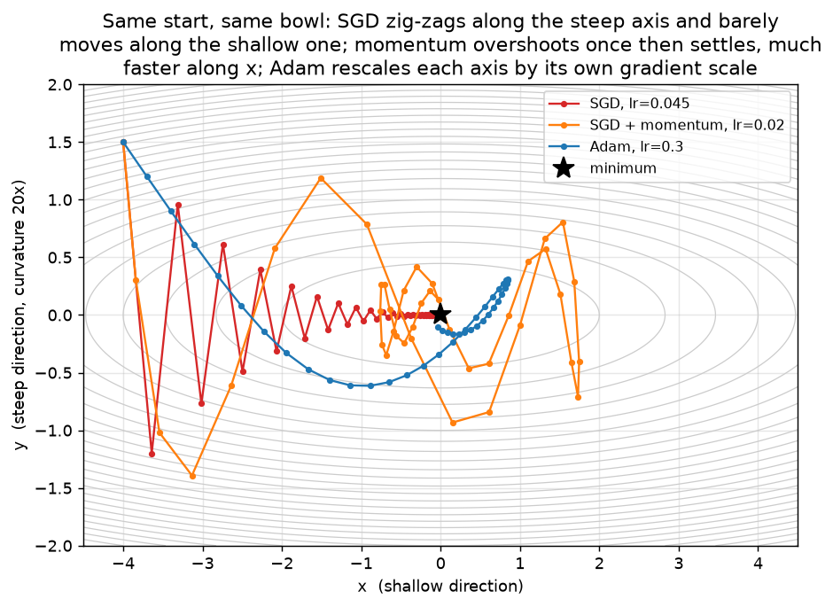
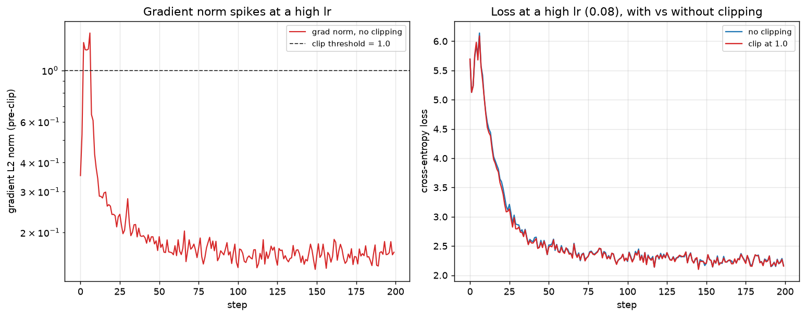
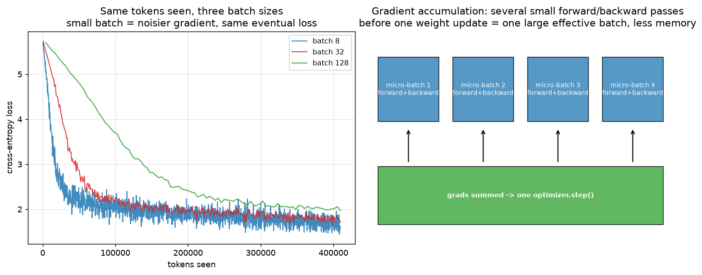
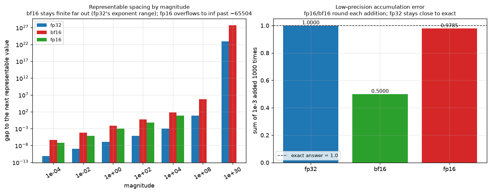
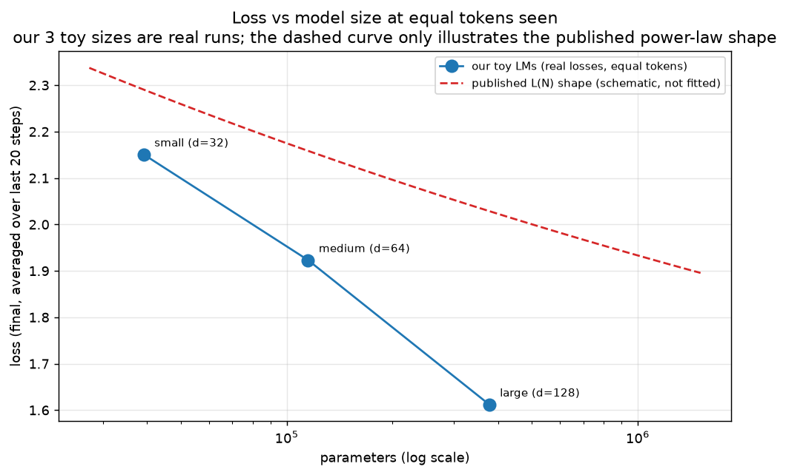

# 09 — Training dynamics: how a loss curve actually falls

Every chapter so far has been about the *shape* of a network — attention, normalization, the
MLP (multi-layer perceptron, the feed-forward block from chapter 06), the output. This chapter is about what happens while that network is being trained: the
knobs that decide whether a loss curve falls smoothly, stalls, or blows up. None of it is
specific to LLMs (large language models) — the same optimizers, schedules, and precision
tricks train image classifiers too — but the specific numbers quoted here (learning rates,
β values, batch sizes) are the ones modern LLM pre-training actually uses.

All the code lives in `project/src/llm_blocks/ch09_training_dynamics.py`, and it reuses three
blocks from earlier chapters completely unchanged: `GroupedQueryAttention` (chapter 03),
`RMSNorm` (chapter 05), `SwiGLUMLP` (chapter 06), wired into a 2-layer, 64-wide toy transformer
that is small enough to train on a CPU in a few seconds.

```bash
cd project
uv run python -m llm_blocks.ch09_training_dynamics plots   # the nine figures below (~1 min)
uv run python -m llm_blocks.ch09_training_dynamics demo    # the numbers quoted here (~1 min)
```

## What you will learn

- What one training step actually does (forward, loss, backward, update) and how to read a
  loss curve — the steep phase, the plateau, and a spike.
- **Learning rate** as the single most important knob, and why: too low barely moves the
  loss, too high makes it spike (the lr-sweep figure).
- **Warmup**, **cosine decay**, and **WSD** (warmup-stable-decay) — what each does and why
  Adam specifically needs warmup.
- **Momentum** and **Adam/AdamW** as two different fixes for the same problem — "a ball with
  memory" vs "a per-parameter step size" — and why AdamW's weight decay is *decoupled*.
- **Gradient clipping**: capping the one bad step before it undoes a hundred good ones.
- **Batch size**, **gradient accumulation**, and tokens per step — what changes and what
  doesn't when you make the batch bigger.
- **Mixed precision** (bf16): why it needs no loss scaling, and why the optimizer's master
  weights stay in fp32 even when the forward pass runs in bf16.
- **Chinchilla's 20 tokens/parameter** rule, why modern LLMs train far past it, and what a
  scaling-law plot (loss vs model size) looks like.

## 1. One training step, recapped

Chapters 01–08 built the pieces; a training step just runs them in a loop:

1. **Forward**: feed a batch of token ids through the model, get logits (chapter 02's
   `h @ E^T`, chapter 03's attention, chapter 06's MLP, all stacked).
2. **Loss**: cross-entropy between the logits and the *next* token at every position
   (chapter 02) — a single number, "how surprised was the model".
3. **Backward**: `loss.backward()` walks the computation graph in reverse and fills every
   parameter's `.grad` with the loss's gradient with respect to that parameter.
4. **Update**: an **optimizer** turns each gradient into an actual change to the parameter.

This chapter is entirely about step 4, plus the practical details (loss curves, clipping,
batch size, precision) that decide whether repeating this loop thousands of times actually
converges.

## 2. Reading a loss curve

```python
def lm_loss(model: ToyTransformerLM, batch: Tensor) -> Tensor:
    inputs, targets = batch[:, :-1], batch[:, 1:]
    logits = model(inputs)
    return F.cross_entropy(logits.reshape(-1, logits.shape[-1]), targets.reshape(-1))
```

The toy LM is trained on a synthetic token stream with real structure: `make_bigram_grammar`
builds a `(vocab_size, vocab_size)` table where 200 of 256 "words" each have 3 strongly
preferred successors, and `sample_token_stream` draws a long sequence from that table — a
tiny but genuine language for the model to learn.



*Look at:* the dashed line at `ln(vocab_size) ≈ 5.55` — a model that has learned nothing
scores exactly this (chapter 02's "uniform guessing" loss). `lr=1e-4` (blue) barely leaves that
line in 400 steps: too slow. `lr=1e-2` (green) falls fastest and cleanly to `1.80`: about right
for this model. `lr=1` (purple) spikes to over 15 within the first 10 steps — a real, visible
instability — then partially recovers only because AdamW's per-parameter scaling eventually
reins it back in; a plain SGD run at a comparably "too high" lr would not recover at all. This
is the shape to recognize in a real loss curve: a **steep phase** while the easy structure gets
learned, a **plateau** as only the harder patterns remain, and — if the lr is wrong — a
**spike**.

## 3. Learning rate: the one knob that matters most

Every other setting in this chapter (which optimizer, what schedule, how big a batch) changes
*how well* a given learning rate works; the learning rate itself decides whether training works
*at all*. Section 2's sweep is the entire argument: four otherwise-identical runs, one number
changed, and the outcomes range from "learns nothing" to "learns well" to "spikes". Real
pre-training runs a much smaller sweep than this (often just 2-3 short trial runs at different
peak learning rates) precisely because getting this one number roughly right matters more than
tuning anything else in this chapter.

## 4. Warmup, cosine decay, and WSD

```python
def warmup_cosine(step: int, total: int, warmup: int, lr_max: float, lr_min: float = 0.0) -> float:
    if warmup > 0 and step < warmup:
        return lr_max * (step + 1) / warmup
    span = max(total - warmup, 1)
    progress = min((step - warmup) / span, 1.0)
    cosine = 0.5 * (1 + np.cos(np.pi * progress))
    return lr_min + (lr_max - lr_min) * cosine
```

**Warmup** — a short linear ramp from 0 up to the peak learning rate — exists mainly because of
*Adam's* running statistics (section 5): at step 1, Adam's mean-square estimate `v` has seen a
single gradient, so dividing by `sqrt(v)` can produce a huge, noisy effective step; a few
hundred warmup steps let `v` average over enough gradients to be a trustworthy estimate before
the learning rate reaches its peak. **Cosine decay** then lowers the learning rate smoothly
from that peak down to (near) zero over the rest of training — slowing down late, when the
model is closer to a good solution and large steps risk overshooting it.

```python
def wsd(step: int, total: int, warmup: int, decay_frac: float, lr_max: float) -> float:
    if warmup > 0 and step < warmup:
        return lr_max * (step + 1) / warmup
    decay_steps = int(total * decay_frac)
    decay_start = max(total - decay_steps, warmup)
    if step < decay_start:
        return lr_max
    progress = min((step - decay_start) / max(total - decay_start, 1), 1.0)
    return lr_max * (1 - progress)
```

**WSD** (warmup-stable-decay) instead holds the learning rate flat at its peak for most of
training and only decays (usually linearly) over the last 10-20%. The point is not the curve's
shape but *when you have to commit to a total step count*: cosine decay needs `total` fixed in
advance, because the whole curve is stretched across it — stop early and you are left at a
learning rate nowhere near zero. WSD lets training run at a flat peak lr for as long as
resources allow, and only the short decay phase (which can be re-run cheaply) needs a fixed
end point. This is why MiniCPM, Llama-3.1, and DeepSeek-V2 use WSD when the token budget isn't
pinned down ahead of time.



`../llm_training/specs/04_pretraining.md` (and its code, `pretrain.py`) defaults to `cosine`
with 300 warmup steps and peak lr `6e-4`, but implements `wsd` as a config option too
(`schedule: wsd`, `decay_fraction: 0.2`) — matching the "cosine as the safe baseline, WSD for
an open-ended budget" guidance above.



*Look at:* the very start of each curve — `constant` (blue) jumps straight to its peak lr and
its first few steps are visibly the noisiest of the three; `warmup + cosine` (red) and `WSD`
(green) ramp up over the first 40 steps and never show that early jitter. On this particular
400-step toy run the three end up close together (final losses `1.75`, `1.82`, `1.70`) —
warmup's benefit here is stability early on, not necessarily a lower final loss on a run this
short; the difference becomes much more consequential at the scale (and higher peak learning
rates) of real pre-training, where an un-warmed-up Adam step early on can spike badly enough
to derail the whole run, not just add noise.

## 5. Momentum and Adam(W): two different fixes for the same problem

Plain gradient descent (`p -= lr * grad`) treats every parameter and every step identically,
which is a problem on a loss surface that is much steeper in some directions than others — the
optimizer either takes tiny steps everywhere (safe on the steep direction, glacial on the
shallow one) or it zig-zags.

**Momentum** is "a ball rolling down the bowl with memory": it keeps a running, decaying
average of past gradients (`v`) and steps in that direction instead of the raw gradient, so a
direction that has been consistently downhill keeps accumulating speed even after the local
gradient there shrinks.

```python
class SGDMomentum:
    def __init__(self, params, lr, momentum=0.9):
        self.velocity = [torch.zeros_like(p) for p in params]
        ...
    def step(self):
        for p, v in zip(self.params, self.velocity):
            v.mul_(self.momentum).add_(p.grad)
            p.add_(v, alpha=-self.lr)
```

**Adam** solves the same problem a different way: instead of one shared learning rate, every
*parameter* gets its own effective step size, shrunk by that parameter's own recent gradient
scale (`v`, a running mean square) — a parameter with a small, consistently noisy gradient
still gets a normal-sized step, because dividing by `sqrt(v)` scales it back up.

```python
class Adam:
    def step(self):
        self.t += 1
        for p, m, v in zip(self.params, self.m, self.v):
            g = p.grad
            m.mul_(self.beta1).add_(g, alpha=1 - self.beta1)
            v.mul_(self.beta2).addcmul_(g, g, value=1 - self.beta2)
            m_hat, v_hat = m / (1 - self.beta1**self.t), v / (1 - self.beta2**self.t)
            p.add_(m_hat / (v_hat.sqrt() + self.eps), alpha=-self.lr)
```



*Look at:* all three start at the same point on a bowl that is 20x steeper along `y` than `x`.
Plain SGD (red) is dominated entirely by the steep direction — it zig-zags back and forth
across `y` while barely moving along the shallow `x` axis at all. Momentum (orange) builds up
enough speed along `x` to actually get somewhere, at the cost of overshooting the minimum
once before settling. Adam (blue) rescales each axis by its own gradient's typical size, so it
heads almost straight for the minimum without either zig-zagging or overshooting.

**AdamW** adds decoupled weight decay: instead of folding an L2 penalty into the gradient
before it feeds Adam's `m`/`v` (where the adaptive step size would warp how much decay actually
happens), the decay is applied directly to the parameter, at the plain learning rate:

```python
p.add_(p, alpha=-self.lr * self.weight_decay)   # decoupled: separate from the Adam step
m.mul_(self.beta1).add_(g, alpha=1 - self.beta1)
...
p.add_(m_hat / (v_hat.sqrt() + self.eps), alpha=-self.lr)
```

AdamW is the default optimizer for nearly every current LLM pre-training run, typically with
`β1=0.9`, `β2=0.95` (slightly more history than Adam's usual `0.999`, since LLM batches are
already huge and noisy gradients are less of a concern), `weight_decay=0.1`, `eps=1e-8`.

## 6. Gradient clipping

A single unusually bad batch (a repeated token, a corrupted document, or just an unlucky
combination) can produce a gradient far larger than every other step's — one huge update can
undo a hundred good small ones. **Gradient clipping** caps the *combined* size (L2 norm) of
every gradient at once, rescaling all of them by the same factor so the update's direction is
unchanged, only its length is capped:

```python
def clip_grad_norm_(params: list[Tensor], max_norm: float, eps: float = 1e-6) -> float:
    grads = [p.grad for p in params if p.grad is not None]
    total_norm = torch.sqrt(sum(g.pow(2).sum() for g in grads))
    clip_coef = max_norm / (total_norm + eps)
    if clip_coef < 1:
        for g in grads:
            g.mul_(clip_coef)
    return total_norm.item()
```



*Look at:* the left panel — at a deliberately high lr (`8e-2`), the gradient norm spikes above
the `1.0` clip threshold in the first ~10 steps, exactly the unstable region the lr-sweep
figure warned about, then settles well under it. The right panel shows the loss curve is
nearly identical with and without clipping here (`2.165` vs `2.156` final loss) — this toy
model's instability is mild enough that AdamW's own per-parameter scaling already absorbs most
of it; clipping earns its keep in real pre-training runs precisely on the rarer, much larger
spikes that a small toy model rarely produces, which is also why "clip at 1.0" is closer to
cheap insurance than a knob you tune per run.

## 7. Batch size, gradient accumulation, and tokens per step

A bigger batch averages the loss (and its gradient) over more examples, giving a less noisy
estimate of "which way is downhill" at the cost of more compute per step.



*Look at:* the x-axis is **tokens seen**, not steps — batch 8 needed 1,600 steps, batch 32
needed 400, batch 128 needed 100, all to see the same `409,600` tokens. Batch 8 (blue) is
visibly noisier step to step but reaches the lowest final loss here (`1.57`) with this many
tokens; batch 128 (green) is the smoothest curve but the slowest to fall, still at `1.97` by
the same point — a smaller batch's noisier gradient acts a little like extra regularization at
a fixed token budget, though a large enough training run typically lets a bigger batch use a
correspondingly bigger learning rate to close the gap.

**Gradient accumulation** is how you get a large *effective* batch without the memory a single
huge forward/backward pass would need: run several small "micro-batches" forward and backward,
summing their gradients, and only call the optimizer once every few micro-batches — the
right-hand panel of the figure above sketches this: four micro-batches, each its own
forward+backward, before one shared `optimizer.step()`.

The **critical batch size** is the batch size beyond which making it even bigger stops helping:
below it, a bigger batch reduces gradient noise enough to let you take a proportionally bigger
learning rate and finish in fewer steps for the same wall-clock cost; above it, the gradient
is already accurate enough that a bigger batch mostly just burns more compute per step for a
diminishing reduction in noise — real LLM pre-training runs pick a batch size near this point
(often hundreds of thousands to millions of tokens for large runs), not the biggest batch that
fits in memory.

## 8. Mixed precision: bf16

Real pre-training runs the forward and backward pass in **bf16** (bfloat16: a 16-bit float with
the same 8-bit exponent as fp32 but only 7 mantissa bits, versus fp16's 5-bit exponent and 10
mantissa bits) instead of fp32, roughly halving memory and often the wall-clock time.



*Look at:* the left panel — bf16 (red) and fp32 (blue) both stay finite out to `1e30`, because
they share the same 8-bit exponent range; fp16 (green) simply has no bar there because it
overflowed to `inf` past its ~65,504 limit, which is exactly why fp16 training historically
needed **loss scaling** (multiply the loss by a large constant before `backward()` so small
gradients don't underflow to 0, then divide the gradients back down before the optimizer step)
and bf16 training does not — its exponent range already covers the same magnitudes fp32 does,
so nothing overflows or underflows in the first place; the tradeoff instead shows up in the
right panel, where adding `1e-3` a thousand times gives fp32 `1.0000` (~exact), bf16 `0.5000`
(badly wrong — bf16's coarse mantissa rounds many of the additions to no change at all once the
running sum grows past a point), and fp16 `0.9785` (closer, thanks to its finer mantissa, at
the cost of the overflow risk shown on the left). This is precisely why the **optimizer's
master weights stay in fp32** even during bf16 training: the *forward pass* can tolerate bf16's
coarser precision because each individual computation only needs to be roughly right, but the
*weight update* is exactly this kind of repeated-small-addition accumulation, where a value
close to convergence (large) plus a tiny gradient step (small) is exactly the pattern the right
panel shows bf16 corrupting silently.

## 9. Overfitting vs undertraining, and the scaling law

LLM pre-training almost never overfits in the classic sense — most large runs see each token at
most once (or a few times), so there is no repeated exposure to memorize against, and the
usual overfitting signal (train loss keeps falling, validation loss turns back up) rarely
appears. The more common failure mode is the opposite: **undertraining**. Chinchilla (Hoffmann
et al., 2022) found the compute-optimal ratio is close to **20 tokens per parameter** — train a
model with fewer tokens than that per parameter and, for the same compute budget, a *smaller*
model trained longer would have reached a lower loss. Modern frontier models routinely train
far past 20x (`../llm_training/specs/research/training_stack.md` notes Llama-2-7B at roughly
290 tokens/parameter and Gemma-7B at roughly 857), because Chinchilla optimizes purely for
*training* compute, while a model that will be served at massive *inference* volume is worth
over-training past that point in exchange for a smaller (cheaper to serve) model at the same
quality.



*Look at:* the blue points are three real toy-LM sizes (39k, 115k, and 378k parameters) trained
on the *same* number of tokens each, with final losses `2.15`, `1.92`, and `1.61` respectively —
a real, if tiny, demonstration that more parameters at a fixed token budget keeps helping. The
dashed red curve is explicitly **schematic**, not fitted to any data — it only illustrates the
shape published scaling-law papers report (a power law, meaning loss keeps falling but with
diminishing returns as parameters grow), included so the "same declining-slope shape" is
visible at both a toy scale and, qualitatively, at the scale those papers actually measure.

## Troubleshooting

| symptom | likely cause | fix |
|---|---|---|
| loss becomes `NaN` or `inf` | learning rate too high, a bad batch, or fp16 overflow (section 8) | lower the lr, add/lower gradient clipping (section 6), switch fp16 -> bf16, skip the offending batch |
| loss stuck near `ln(vocab_size)` | learning rate far too low, or a bug feeding the wrong targets | check the lr-sweep figure's shape for your run; verify inputs/targets are shifted by exactly one position |
| loss falls, then suddenly spikes upward | one bad batch produced an outsized gradient (section 6) | add gradient clipping if absent, or lower the clip threshold; some frameworks also just skip a batch whose grad norm exceeds a hard limit |
| loss is noisy but never really spikes | small batch size (section 7) at a lr tuned for a bigger one | either accept the noise (it often still converges fine) or increase the batch size / lower the lr to match |
| loss looks fine in bf16 training but degrades after a checkpoint reload | master weights were saved in bf16 instead of fp32 (section 8) | always keep and checkpoint the optimizer's master weights in fp32 |

## Exercises

1. In `_fig_toy_lm_lr_sweep`, add a fifth learning rate between `1e-2` and `1` (e.g. `3e-1`) —
   does it fall between the two neighboring curves, or does it also visibly spike?
2. Change `AdamW`'s `weight_decay` from `0.1` to `0.0` in a training run and compare the final
   loss — on this small toy LM and this few steps, does decoupled weight decay visibly change
   anything? At what training length would you expect it to start mattering?
3. `wsd`'s `decay_frac` controls how much of training is spent decaying. Plot the schedule at
   `decay_frac=0.05` and `decay_frac=0.5` next to the `0.2` used in this chapter — which one
   looks most like plain cosine decay?
4. Compute `clip_grad_norm_`'s return value (the *pre-clip* norm) for every step of a training
   run at `lr=1` (the diverging run from section 2) and find the step with the largest spike —
   does it line up with the loss spike in the lr-sweep figure?
5. In `_fig_scaling_law`, add a fourth toy-LM size (e.g. `d_model=256`) trained on the same
   token budget — does its loss keep falling along the same roughly power-law trend as the
   other three, or does it start to plateau?
