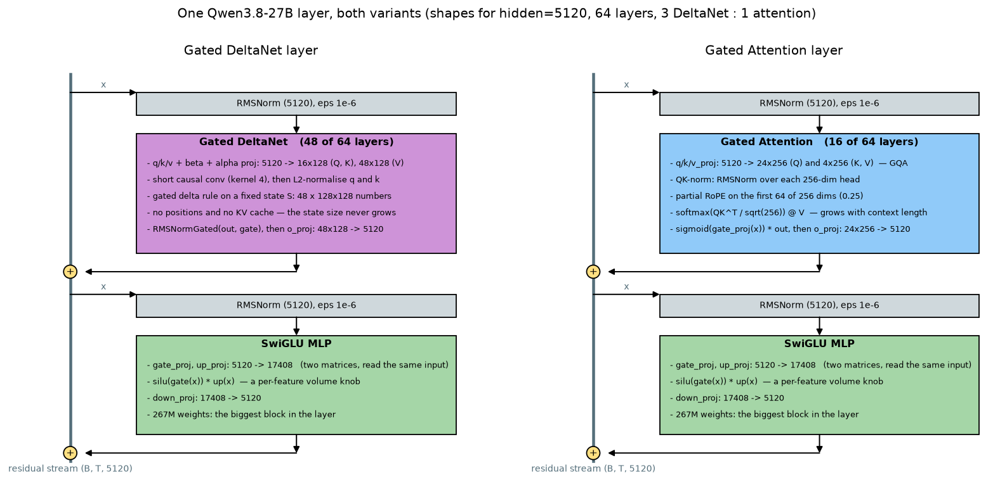
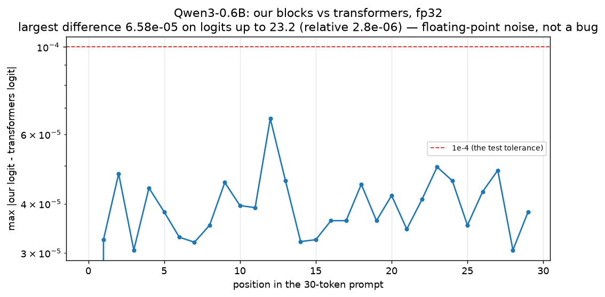
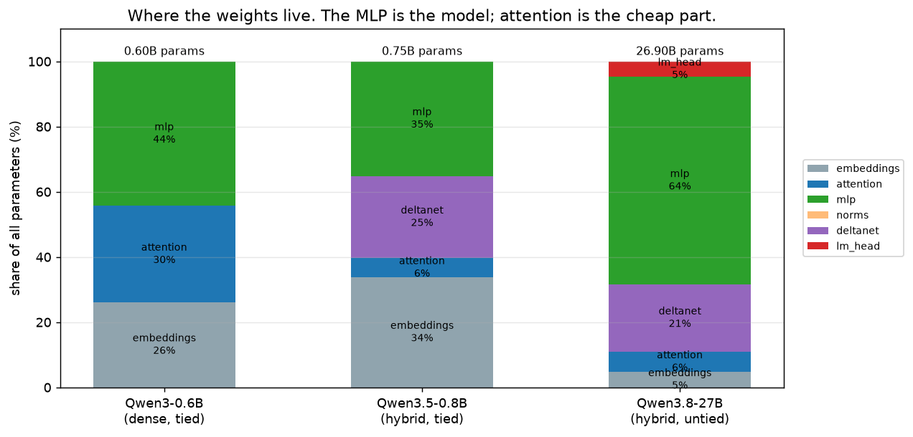
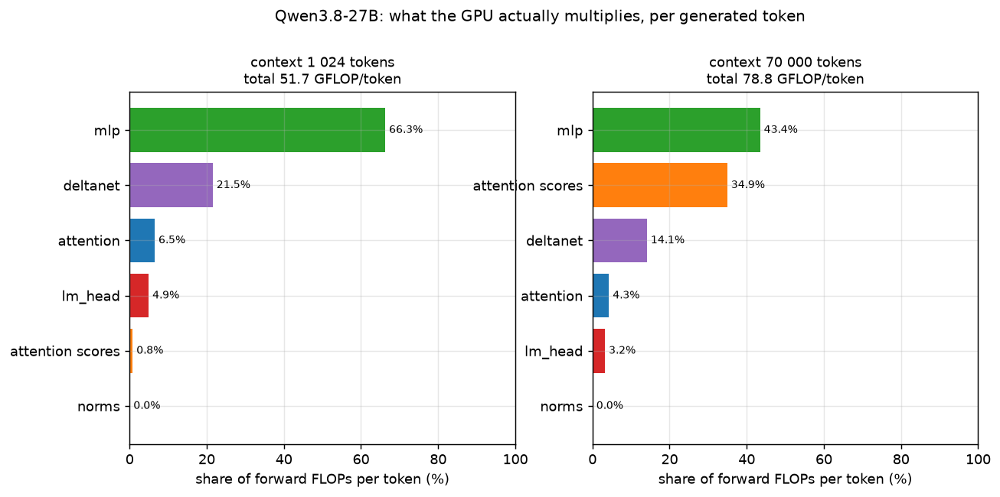
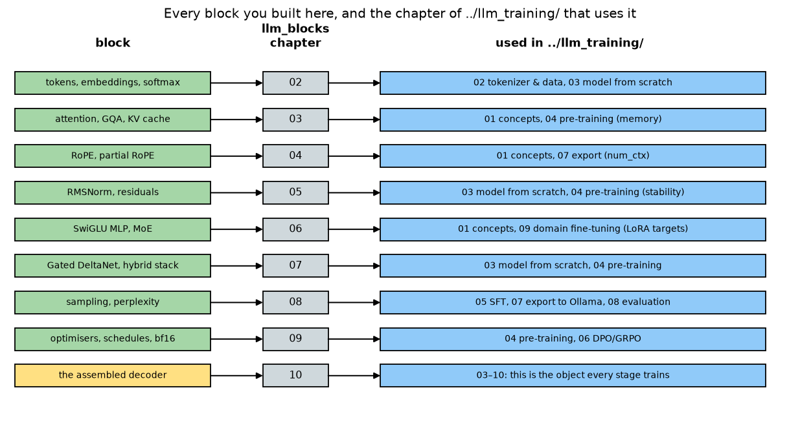

# 10 — Assembling a transformer: our blocks *are* Qwen3

Nine chapters, nine piles of small PyTorch modules. This chapter bolts them together into a
working **LLM** (large language model — a network that predicts the next token of text), pours
the real weights of `Qwen/Qwen3-0.6B` into it, and checks that it produces the *same tokens* as
the `transformers` implementation. Not "similar". The same.

That check is the point of the whole tutorial. A from-scratch implementation that only *looks*
right is a nice exercise; one that reproduces a shipped model bit-for-bit means every
explanation in chapters 02–09 was literally true.

## What you will learn

- How the blocks stack into one layer, and how layers stack into a model — with a diagram where
  every arrow has a sentence.
- `DecoderLayer` and `Decoder`: about 40 lines, all of it wiring, nothing new.
- How to port weights between two implementations (it is a rename table, not a conversion) and
  how to prove the port is exact.
- What a Qwen3.5/3.8 layer adds on top of what we built: Gated DeltaNet in 3 of every 4 layers,
  an output gate, partial **RoPE** (rotary position embedding — chapter 04), and a training-only
  **MTP** (multi-token prediction) head.
- Where the parameters and the **FLOPs** (floating-point operations — multiplies and adds) go,
  and why "27B" tells you 54 GB in **bf16** (brain float 16, a 2-byte number format) and
  ~15 GB at 4 bits.
- Which chapter of `../llm_training/` uses which block.

Run everything in this chapter with:

```bash
cd project
uv run python -m llm_blocks.ch10_transformer demo        # tiny-model equivalence + 27B counts
uv run python -m llm_blocks.ch10_transformer plots       # the four figures
uv run python -m llm_blocks.ch10_transformer plots-real  # the Qwen3-0.6B match (1.2 GB download)
uv run python -m llm_blocks.ch10_transformer demo-real   # the identical 20-token continuation
```

---

## 1. The full picture: one layer, every arrow explained



*Look at:* the two panels are the *same layer skeleton*. Only the middle box differs — a Gated
DeltaNet mixer (48 of the 64 layers) or a Gated Attention mixer (16 of them). Everything else —
the residual stream, the two `RMSNorm`s (root-mean-square normalization, chapter 05), the
`SwiGLU` (SiLU-gated linear unit, chapter 06) **MLP** (multi-layer perceptron, the
per-token feed-forward block of chapter 06), the two `+` circles — is identical.

Arrow by arrow, top to bottom:

1. **The vertical line is the residual stream** (chapter 05). It is a `(batch, tokens, 5120)`
   tensor that starts as the embedding of the input tokens and ends at the output head. Nothing
   ever *replaces* it; every block only adds to it.
2. **stream → RMSNorm.** Each block reads a *copy* of the stream, normalised to a known length
   so its input statistics do not drift as the model gets deeper. The normalisation is on the
   branch, never on the highway — that is what "pre-norm" means.
3. **RMSNorm → mixer.** The mixer is the only place where tokens talk to each other. In the
   attention variant: project to queries/keys/values, normalise each head (QK-norm), rotate by
   position (RoPE), compare every query with every key, average the values. In the DeltaNet
   variant: run a recurrent state forward over the sequence (chapter 07).
4. **mixer → `+`.** The mixer's output is *added* back onto the stream. If you zeroed the
   mixer's output projection, the layer would be the identity — that is the property that lets
   you stack 64 of them without the signal exploding (there is a test for exactly this).
5. **stream → RMSNorm → SwiGLU MLP → `+`.** The second half of the layer works on each token
   on its own: no token looks at any other. It is the model's memory (chapter 06), and it holds
   most of the weights: 3 × 5120 × 17408 = 267M per layer.

Stack 64 of those, put an embedding table in front and one more RMSNorm plus a linear layer at
the end, and you have Qwen3.8-27B. There is nothing else in the file.

---

## 2. The code: two classes, no new maths

Our decoder imports every part. `DecoderLayer` is the diagram, transcribed:

```python
class DecoderLayer(nn.Module):
    def __init__(self, cfg: DecoderConfig) -> None:
        super().__init__()
        self.input_layernorm = RMSNorm(cfg.d_model, eps=cfg.rms_norm_eps)            # ch05
        self.self_attn = GroupedQueryAttention(                                       # ch03
            d_model=cfg.d_model, n_heads=cfg.n_heads, n_kv_heads=cfg.n_kv_heads,
            head_dim=cfg.head_dim, qk_norm=True, gated=False,
            eps=cfg.rms_norm_eps, bias=False,
        )
        self.post_attention_layernorm = RMSNorm(cfg.d_model, eps=cfg.rms_norm_eps)
        self.mlp = SwiGLUMLP(cfg.d_model, cfg.d_ff)                                   # ch06

    def forward(self, x, cos, sin, cache=None):
        attn_out, _ = self.self_attn(
            self.input_layernorm(x), causal=True, cache=cache,
            rope=lambda t: apply_rope(t, cos, sin),                                    # ch04
        )
        h = x + attn_out
        return h + self.mlp(self.post_attention_layernorm(h))
```

`GQA` (grouped-query attention, chapter 03) takes the rotation as a callable rather than
computing it itself, because chapter 04 is *built on top of* chapter 03 and cannot be imported
from it. That is also the honest picture of the model: position information enters at exactly
one place, on `q` and `k`, just before the keys go into the **KV cache** (the stored keys and
values of every past token, chapter 03).

`Decoder` is the rest of the model:

```python
class Decoder(nn.Module):
    def __init__(self, cfg: DecoderConfig) -> None:
        super().__init__()
        self.cfg = cfg
        self.embed_tokens = Embedding(cfg.vocab_size, cfg.d_model)                     # ch02
        self.layers = nn.ModuleList(DecoderLayer(cfg) for _ in range(cfg.n_layers))
        self.norm = RMSNorm(cfg.d_model, eps=cfg.rms_norm_eps)
        self.lm_head = (TiedLMHead(self.embed_tokens) if cfg.tie_word_embeddings       # ch02
                        else nn.Linear(cfg.d_model, cfg.vocab_size, bias=False))

    def forward(self, ids, caches=None):
        h = self.embed_tokens(ids)
        past = 0 if caches is None else len(caches[0])
        cos, sin = rope_cos_sin(past + ids.shape[1], self.cfg.head_dim, theta=self.cfg.rope_theta)
        cos, sin = cos[past:].to(h.dtype), sin[past:].to(h.dtype)
        for i, layer in enumerate(self.layers):
            h = layer(h, cos, sin, cache=None if caches is None else caches[i])
        return self.lm_head(self.norm(h))
```

The `past` bookkeeping is the only fiddly bit: when you decode token 501 with a cache, you feed
in one token but its position is 500, so the cosines and sines have to be sliced from the right
offset. Get that wrong and the model still runs, still produces fluent-looking text, and is
subtly wrong — a classic bug, which is why there is a test comparing cached and uncached
decoding.

`tie_word_embeddings` decides whether the output layer is a fresh matrix or the transposed
embedding table. Qwen3-0.6B ties (its 151936 × 1024 table is 26% of the model, and paying for it
twice would be silly); Qwen3.8-27B does not (1.27B weights each way, affordable at that size).

---

## 3. The weight map, and the proof

Porting a model between two implementations sounds like a research project. It is a rename
table. Every tensor is copied with **no transpose and no reshape**, because our blocks use the
same conventions `transformers` uses: `nn.Linear` stores `(out_features, in_features)`, RMSNorm
has one gain per channel, the embedding matrix is `(vocab, d_model)`.

| our name | `transformers` name (`Qwen3ForCausalLM`) | what it is |
|---|---|---|
| `embed_tokens.weight` | `model.embed_tokens.weight` | the token table, `(vocab, d_model)` |
| `layers.{i}.input_layernorm.weight` | `model.layers.{i}.input_layernorm.weight` | RMSNorm gain before the mixer |
| `layers.{i}.self_attn.q_proj.weight` | `model.layers.{i}.self_attn.q_proj.weight` | queries, `(n_heads·head_dim, d_model)` |
| `layers.{i}.self_attn.k_proj.weight` | `model.layers.{i}.self_attn.k_proj.weight` | keys, `(n_kv_heads·head_dim, d_model)` |
| `layers.{i}.self_attn.v_proj.weight` | `model.layers.{i}.self_attn.v_proj.weight` | values |
| `layers.{i}.self_attn.q_norm.weight` | `model.layers.{i}.self_attn.q_norm.weight` | QK-norm gain, one per `head_dim` |
| `layers.{i}.self_attn.k_norm.weight` | `model.layers.{i}.self_attn.k_norm.weight` | QK-norm gain |
| `layers.{i}.self_attn.o_proj.weight` | `model.layers.{i}.self_attn.o_proj.weight` | back to `d_model` |
| `layers.{i}.post_attention_layernorm.weight` | `model.layers.{i}.post_attention_layernorm.weight` | RMSNorm gain before the MLP |
| `layers.{i}.mlp.gate_proj.weight` | `model.layers.{i}.mlp.gate_proj.weight` | SwiGLU gate |
| `layers.{i}.mlp.up_proj.weight` | `model.layers.{i}.mlp.up_proj.weight` | SwiGLU value path |
| `layers.{i}.mlp.down_proj.weight` | `model.layers.{i}.mlp.down_proj.weight` | back to `d_model` |
| `norm.weight` | `model.norm.weight` | the final RMSNorm |
| `lm_head.weight` | `lm_head.weight` | untied output head (skipped when tied) |

`load_qwen3_weights` walks that table, checks every shape, and — importantly — **fails if any
checkpoint tensor is left unclaimed**. A port that silently ignores a tensor is how you end up
with a model that is 95% right and mysteriously bad.

### The tiny check (runs in the test suite, no download)

A random `Qwen3Config` with 2 layers, hidden 64, 4 query heads / 2 key-value heads, head dim 16,
vocabulary 128 — small enough that a bug anywhere shows up:

```
tiny random Qwen3 (2 layers, hidden 64, 4 heads / 2 KV heads, head dim 16, vocab 128)
  max |delta logit|          1.490e-07
  logit scale                0.573
  10 greedy tokens, theirs   [78, 108, 108, 108, 108, 108, 108, 108, 108, 108]
  10 greedy tokens, ours     [78, 108, 108, 108, 108, 108, 108, 108, 108, 108]
  identical                  True
  our parameters             90,496
  their parameters           90,496
```

1.5e-07 on logits of size 0.57 is the noise floor of `float32` addition — the two
implementations sum the same numbers in a slightly different order. The test asserts
`rtol=1e-4`, which is generous by three orders of magnitude.

### The real check: Qwen3-0.6B

`plots-real` loads the actual 0.6B-parameter checkpoint (28 layers, hidden 1024, 16 query heads
/ 8 key-value heads, head dim 128, SwiGLU 3072, vocab 151936, tied embeddings, RoPE base 1e6),
copies it into our decoder and compares logits on a 30-token prompt:



*Look at:* the y-axis is logarithmic and the whole curve sits between 3e-5 and 7e-5, on logits
whose magnitude reaches 23. Relative error ≈ 3e-6. Position 0 is off the bottom of the plot: its
difference is exactly zero, because with a single key there is nothing to sum in a different
order.

And the thing that actually matters — the tokens (`demo-real`, saved to
`assets/10_real_generation.txt`):

```
model:  Qwen/Qwen3-0.6B (fp32, CPU), 20 greedy tokens
prompt: 'The capital of France is'

transformers ids: [12095, 13, 576, 6722, 315, 15344, 374, 21718, 13, 576, 6722, 315, 17689, 374, 24081, 13, 576, 6722, 315, 5616]
our decoder  ids: [12095, 13, 576, 6722, 315, 15344, 374, 21718, 13, 576, 6722, 315, 17689, 374, 24081, 13, 576, 6722, 315, 5616]
identical:        True

transformers text: 'The capital of France is Paris. The capital of Italy is Rome. The capital of Spain is Madrid. The capital of China'
our decoder text : 'The capital of France is Paris. The capital of Italy is Rome. The capital of Spain is Madrid. The capital of China'
```

We did not approximate anything. Given the same weights, our `Embedding`, `RMSNorm`,
`GroupedQueryAttention`, `apply_rope` and `SwiGLUMLP` **are** Qwen3. The `transformers` file is
longer only because it also handles batching edge cases, six attention kernels, quantisation,
device placement and a dozen cache classes — not because it knows something we do not.

---

## 4. What a Qwen3.5 / Qwen3.8 layer adds

Our `Decoder` is *dense*: every layer is a full-attention layer. That is exactly Qwen3 (and
Llama, and Mistral). Qwen3.5 and Qwen3.8 keep the skeleton and change four things, all of them
covered in earlier chapters:

- **Gated DeltaNet in 3 of every 4 layers** (chapter 07). `full_attention_interval` is 4, so the
  27B model has 48 DeltaNet layers and 16 attention layers. DeltaNet carries a fixed-size
  recurrent state instead of a growing cache, so it costs the same at token 1 and token 200000.
- **An output gate on attention** (`attn_output_gate: true`, chapter 03, section 7):
  `sigmoid(gate_proj(x))` multiplies the attention output before `o_proj`. Our
  `GroupedQueryAttention` supports it (`gated=True`); we leave it off because Qwen3-0.6B does not
  have it.
- **Partial RoPE** (chapter 04): only the first `0.25 × 256 = 64` dimensions of each head are
  rotated; the other 192 carry position-independent content. Attention layers are the only place
  positions appear at all — the DeltaNet layers have no positional encoding whatsoever, because a
  recurrence is already ordered.
- **An MTP head** (`mtp_num_hidden_layers: 1`). MTP = multi-token prediction: during training the
  model also predicts token *t+2*, which sharpens the representations. It is not used when you
  generate text (except as a speculative-decoding draft head), so it does not appear in our
  decoder or in the parameter counts a model card quotes.

The `RMSNorm` also differs cosmetically: Qwen3.5 parameterises the gain as `1 + weight` with
`weight` initialised to zero (chapter 05, `qwen_variant=True`). A trained model computes the same
function either way; only the optimiser sees a difference.

---

## 5. Where the weights and the compute go



*Look at:* the embedding table dominates small models (26% at 0.6B, 34% at 0.8B) and almost
vanishes at 27B (5%), because the vocabulary is a fixed cost and everything else scales. At 27B
the MLP is 64% of the model. **If you want to know what an LLM is mostly made of, the answer is
"feed-forward matrices".** Attention is 6%.

Now compute. One rule covers almost everything:

> A weight matrix is used once per token, in one multiply and one add.
> **A matmul costs 2 FLOPs per weight per token.**

That gives the famous "forward pass ≈ 2·N FLOPs per token" (N = parameter count). The one term
that is *not* proportional to a weight count is the attention score/value pair, which touches
every key in the context:

```
4 · n_heads · head_dim · seq   FLOPs per token per full-attention layer
```

(2 for `q @ kᵀ`, 2 for `weights @ v`.) So attention's share grows with the context while
everything else stays flat:



*Look at:* at a 1024-token context the score/value term is 0.8% of the work and the MLP is 66%.
At 70000 tokens the same model spends 34.9% of its per-token compute on attention scores alone,
and the total rises from 51.7 to 78.8 GFLOP per token. This is why long context is expensive,
why the KV cache matters, and why Qwen3.5/3.8 replaced 3 of every 4 attention layers with
DeltaNet.

The `demo` command prints the arithmetic:

```
Qwen3.8-27B, per generated token:
  context   1024:    51.7 GFLOP/token (2N = 53.8), attention scores   0.8% of it
  context  70000:    78.8 GFLOP/token (2N = 53.8), attention scores  34.9% of it
  parameters                 26,895,998,464 (26.90B)
    fp32 (4 bytes)              107.6 GB
    bf16 (2 bytes)               53.8 GB
    int8 (1 byte)                26.9 GB
    4-bit (0.5 byte + scales)    14.8 GB
  training on D tokens       6*N*D FLOPs; D = 36e12 -> 5.81e+24 FLOPs
```

Three numbers worth memorising:

- **"27B" means 26.9e9 weights.** In bf16 that is **53.8 GB** — which is why a 24 GB RTX 4090
  cannot hold it, and why 4-bit quantisation (≈14.8 GB plus a little for the scale factors, so
  15–17 GB in practice) is the only way to run it on one consumer card.
- **Forward ≈ 2·N per token.** Our number is slightly *below* 2N at short context because the
  embedding lookup is a table read, not arithmetic.
- **Training ≈ 6·N·D FLOPs** for D training tokens: 2·N for the forward pass and about 4·N for
  the backward pass, which computes two gradients (with respect to the inputs and to the weights)
  per matmul. Qwen was trained on roughly 36 trillion tokens, so 6 × 26.9e9 × 36e12 ≈ **5.8e24
  FLOPs** — about 1200 years of one RTX 4090 running flat out. That single line is why nobody
  pre-trains a 27B model at home, and why `../llm_training/` pre-trains a 110M one instead.

---

## 6. The map to `../llm_training/`



*Look at:* nothing in the training tutorial is a new *component*. Training changes the *values*
in the boxes you built here; fine-tuning changes a small subset of them; exporting rewrites them
in a different file format.

| block (here) | chapter of `../llm_training/` that uses it |
|---|---|
| tokens & embeddings (02) | `02_tokenizer_and_data` trains a 32k tokenizer and packs training blocks; `03_model_from_scratch` sizes the embedding table |
| attention, GQA, KV cache (03) | `01_concepts` counts parameters; `04_pretraining` budgets memory |
| RoPE (04) | `01_concepts`; `07_export_to_ollama` sets `num_ctx`, which is a RoPE decision |
| RMSNorm & residuals (05) | `03_model_from_scratch`; `04_pretraining` when the loss goes unstable |
| SwiGLU MLP, MoE (06) | `09_domain_finetuning` — `gate_proj`/`up_proj`/`down_proj` are the LoRA target modules |
| Gated DeltaNet, hybrid stack (07) | `03_model_from_scratch` builds the tiny 110M model with the same 3:1 pattern |
| sampling & perplexity (08) | `05_sft`, `07_export_to_ollama`, `08_evaluation` |
| optimisers, schedules, bf16 (09) | `04_pretraining`, `06_preference_and_rl` |
| the assembled decoder (10) | every stage from `03` onward — this is the object being trained |

LoRA, mentioned above, is "low-rank adaptation": instead of updating a weight matrix you add a
thin correction to it and train only that. QLoRA is the same trick with the frozen base weights
kept in 4-bit — the 15–17 GB from section 5 is exactly what makes it fit in 24 GB.

---

## 7. How to read a model card now

Next time you open a model page, these lines should all mean something concrete:

- [ ] **Parameters (N).** Multiply by 2 for bf16 gigabytes, by 0.55 for 4-bit. That is whether it
      runs on your machine.
- [ ] **`hidden_size`, `num_hidden_layers`.** The width and height of the residual stream.
- [ ] **`num_attention_heads` / `num_key_value_heads`.** The GQA ratio. The second number, not the
      first, sets your KV cache size.
- [ ] **`head_dim`.** Not necessarily `hidden_size / num_heads` — Qwen3.8 has 24 × 256 = 6144 from
      a 5120-wide stream.
- [ ] **`intermediate_size`.** The MLP width; with `hidden_size` it accounts for most of N.
- [ ] **`vocab_size` and `tie_word_embeddings`.** Together they say whether the token table is
      counted once or twice.
- [ ] **`layer_types` / `full_attention_interval`.** Dense or hybrid, and in what ratio.
- [ ] **`rope_parameters` (`rope_theta`, `partial_rotary_factor`, any scaling) and
      `max_position_embeddings`.** How far the context can be pushed.
- [ ] **`rms_norm_eps`, `attention_bias`, `attn_output_gate`.** The small architectural switches
      that decide whether someone else's loader will reproduce the model exactly.
- [ ] **KV cache per token** = `2 · n_attention_layers · n_kv_heads · head_dim · bytes`. For
      Qwen3.8-27B in bf16 with its 16 attention layers: 2 × 16 × 4 × 256 × 2 = **64 KB per
      token**, so a 70k-token conversation costs ≈ 4.6 GB *on top of* the weights. (Had all 64
      layers been attention layers it would be 256 KB per token — 18.4 GB. That is what the
      hybrid stack buys.)

---

## Troubleshooting

**`KeyError: checkpoint tensors nobody claimed`.** Your rename table missed something. Print
`set(hf_model.state_dict()) - set(claimed)` and look at the first entry: usually a norm you
forgot (`q_norm`/`k_norm` are easy to miss — they are Qwen3-specific) or a biased projection.

**Logits match at position 0 and drift after that.** Positions. Either RoPE is not applied, or
it is applied with the wrong convention, or the cache offset is wrong. `transformers` uses the
"rotate half" convention — `cat(freqs, freqs)` so that dimension *i* pairs with *i + head_dim/2*
— not the interleaved `(x0,x1), (x2,x3)` convention some papers and GGUF exporters use. Both are
valid rotations; they are not compatible with the same weights.

**Everything matches except the last layer.** `tie_word_embeddings`. If the checkpoint ties and
you built an untied head, `lm_head.weight` is missing from the state dict and your randomly
initialised head produces confident nonsense. Our loader raises rather than allowing that.

**Logits are off by a constant factor.** Attention scaling. It is `head_dim ** -0.5`, and
`head_dim` is a config field — not `hidden_size / num_heads`. For Qwen3.8 those differ (256 vs
213.3), so guessing gives you a model that is subtly wrong everywhere.

**Off by ~1e-2 instead of ~1e-5.** Dtype. Load both models with `dtype=torch.float32`. In bf16,
which has 8 bits of mantissa, a "perfect" port disagrees in the third decimal place and greedy
decoding can genuinely diverge after a few dozen tokens when two logits are nearly tied. That is
not a bug in either implementation; it is what bf16 costs.

**`AttributeError: 'Qwen3Config' object has no attribute 'rope_theta'`.** In `transformers` 5.16
the RoPE base moved into `config.rope_parameters["rope_theta"]`. `decoder_config_from_hf` reads
the dict first and falls back to the old attribute.

**The `plots` command wants the network.** It downloads three small `config.json` files (no
weights) to read the real shapes. `load_text_config` falls back to `Qwen/Qwen3.5-0.8B` if a
config cannot be fetched; the numbers in the figures then refer to that model.

---

## Exercises

1. **Build the `HybridDecoder`.** Add a `layer_types` field to `DecoderConfig` and use chapter
   07's `GatedDeltaNetBlock` for every layer that is not a `full_attention` one, in the 3:1
   pattern. Then write `load_qwen35_weights` and match `Qwen/Qwen3.5-0.8B` the same way. You will
   need the output gate (`gated=True`), partial RoPE, and the `1 + weight` RMSNorm variant —
   every one of those is already implemented in an earlier chapter.
2. **Count the KV cache yourself.** For Qwen3-0.6B (28 layers, 8 key-value heads, head dim 128,
   bf16), how many bytes per token? How long a conversation fits in 1 GB? Compare with
   Qwen3.8-27B's 64 KB per token and explain, in one sentence, why the smaller model's cache is
   *bigger per layer*.
3. **Break the norm on purpose.** Swap `RMSNorm` for chapter 05's `LayerNorm` in `DecoderLayer`,
   reload the same weights, and measure the max |Δlogit|. It goes from 1e-7 to order 1. Then
   check whether the greedy tokens still match — early on they often do, which is a good lesson
   about how weak "the output looks fine" is as evidence.
4. **Make the cache lie.** Delete the `cos[past:]` slice in `Decoder.forward` so every decoded
   token thinks it is at position 0, and generate 40 tokens. The text stays grammatical for a
   while. Write down what you would have concluded if you had no reference implementation.
5. **Estimate a training budget.** Using 6·N·D, how many tokens could you train a 110M-parameter
   model on in 2 hours on one RTX 4090 at a realistic 1.5e14 FLOP/s and 40% utilisation? Compare
   with the Chinchilla-optimal 20 tokens per parameter.
