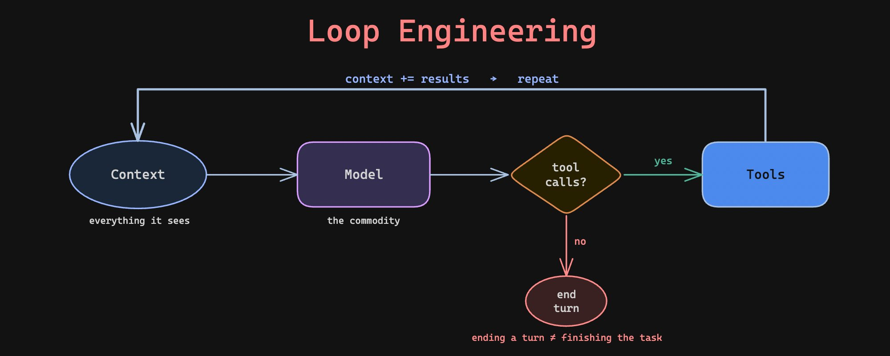
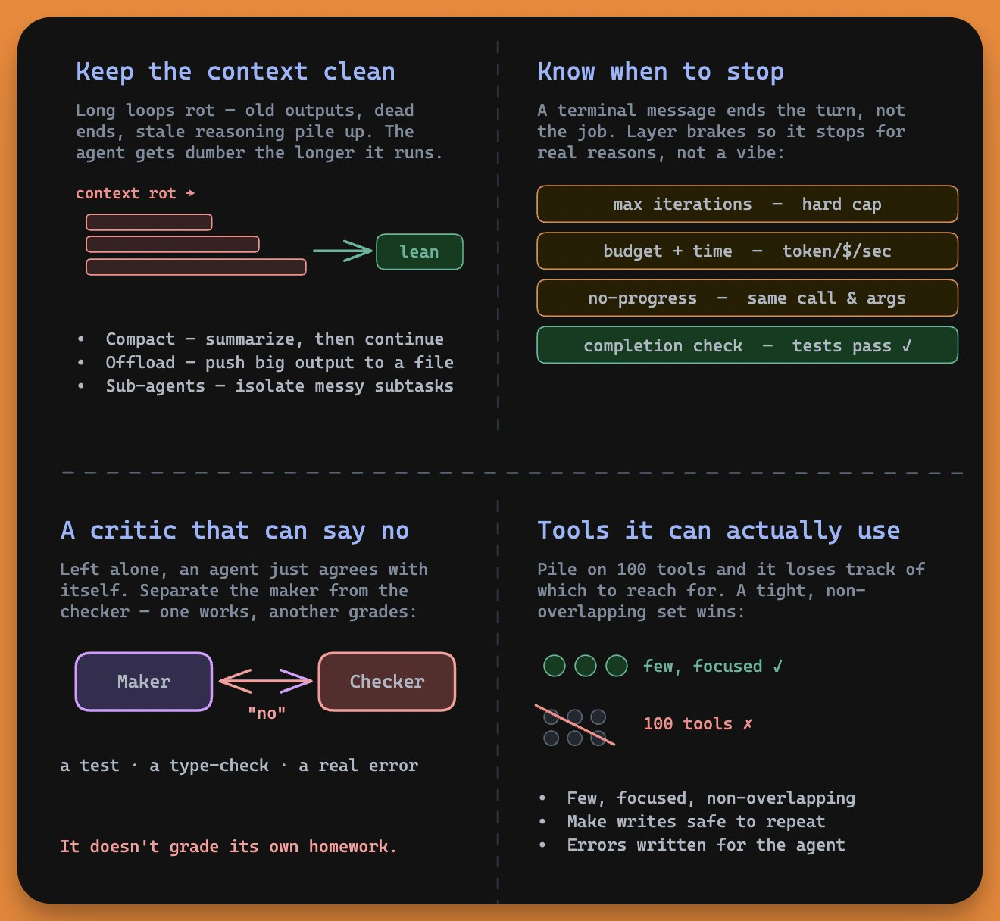

# Loop Engineering Clearly Explained

**Source:** [Loop Engineering Clearly Explained (Akshay Pachaar, 2026)](https://x.com/akshay_pachaar/status/2069118430582866051)
**Type:** X (Twitter) longform Article
**Author:** Akshay Pachaar ([@akshay_pachaar](https://x.com/akshay_pachaar)) -- Co-founder @dailydoseofds_, ex-AI Engineer @ Lightning AI
**Date:** 2026-06-22

## Human Readable TL;DR

Imagine you stop typing instructions to a smart assistant one at a time, and instead build a self-running machine that keeps working toward a goal while you walk away. That machine is a "loop": it thinks, uses a tool, checks the result, and repeats until the job is done. The hard part isn't the loop itself (it's six lines of code), it's knowing when to stop, keeping the assistant from getting confused by its own clutter, giving it good tools, and putting in a referee that can say "no, not done yet." The new skill is designing that machine, not babysitting it.

## TL;DR

"Loop engineering" reframes agent building: the core agent loop (model -> tools -> context -> repeat) is trivially solved and nobody competes on it. The real engineering moved to the harness around the model -- and the harness now matters more than the model itself (same model, better loop, jumps benchmark rank). The article enumerates four hard parts of loop engineering: (1) reliable stop conditions, (2) context hygiene against "context rot," (3) a tight, idempotent, agent-readable tool set, and (4) an independent verifier/critic. The shift: from prompting move-by-move to designing goal + loop + verifier, then stepping back.

---

## Problem & Motivation

Half the AI feed converged on the same message: "stop prompting your agents, start engineering loops." The hook is Boris Cherny (builder of Claude Code): *"I don't prompt Claude anymore. I have loops that are running. My job is to write loops."* If the person who built one of the most popular coding agents doesn't prompt it, the discipline of agent building has moved somewhere else. The article explains where -- and why building good loops is harder than the six-line core suggests.

---

## Main Original Ideas

1. **The loop is already solved.** Every serious agent framework lands on roughly the same six lines. Nobody competes on the `while` statement -- so engineering effort lives entirely outside it.

   ```python
   while True:
       response = model(context)
       if response.has_tool_calls():
           results = run_tools(response.tool_calls)
           context += results
       else:
           break
   ```

2. **The center of gravity drifted outward, layer by layer.** Prompt engineering (the words you send) -> Context engineering (everything the model sees) -> Harness engineering (code that runs tools, tracks state, handles errors) -> Loop engineering (the autonomous cycle driving toward a goal). Each layer wraps the prior one; the prompt is now one small piece of a bigger system.

3. **Agent = Model + Harness; the harness now outweighs the model.** (LangChain framing.) Teams held the model fixed, changed only surrounding code, and jumped from mid-benchmark into the top five. Same brain, different loop. "If you're not the model, you're the harness."

4. **Ending a turn != finishing the task.** A terminal message (agent stops asking for tools) ends the turn, not the job. Conflating the two is the most common loop failure.

5. **The verifier is half the job.** An agent left alone agrees with itself. The other half of loop design is "putting something in the loop that can say no" -- a test, type check, or real error. Separate the maker from the checker; the worker doesn't grade its own homework.

---

## Key Findings -- The Four Hard Parts

| # | Hard part | Failure mode | Mitigations |
|---|-----------|--------------|-------------|
| 1 | **Knowing when to stop** | Agent declares victory while tests still fail | Max iterations cap; budget/time limits; no-progress detection (same call + same args = spinning); **a real automated completion check** ("done" = tests pass, not vibes) |
| 2 | **Keeping context clean** | **Context rot** -> **doom loop**: rotted context -> worse decision -> more noise -> rots further; agent gets dumber the longer it runs | Treat context as a budget, not a bucket: **compaction** (summarize then continue), **offloading** (push big outputs to file, keep the slice), **sub-agents** (isolate messy subtask, return only clean result) |
| 3 | **Tools the agent can actually use** | 100 tools -> agent loses track; retried writes create duplicates (double billing); human-style errors give agent no next move | Tight, focused, non-overlapping set (Anthropic: if a human engineer can't say which tool fits, the agent can't either); **make writes idempotent** (safe to call twice); **write errors for the agent** -- a good error is the next instruction |
| 4 | **Something that can say no** | Autonomous agent nods along to its own work | Separate maker from checker: one model works, a different model or hard test grades it |

---

## The Actual Shift

Prompting = steering the agent move by move. Loop engineering = building the system that steers it, then stepping back. The job changes to designing three things:

1. **The goal** -- written as success criteria the agent can check itself against.
2. **The loop** -- with sane brakes so it stops well.
3. **The verifier** -- so "done" is proven, not claimed.

Karpathy's mindset cited: don't tell the model what to do, give it success criteria and watch it go. He runs overnight research loops (tweak script -> test -> keep what works -> discard the rest) with himself nowhere in the loop -- arrange once, hit go.

---

## Suggestions & Future Directions -- Where to Start

You don't need an overnight autonomous agent on day one. Build up:

1. Start with the basic loop; add max-iteration cap, timeout, and cost ceiling immediately.
2. Define "done" as an automated check *before* you begin, not a vibe afterward.
3. Protect context: compact long runs, offload big outputs, isolate messy subtasks.
4. Audit tools: keep them few and focused, make writes safe to repeat, rewrite errors so an agent can act on them.
5. Put a critic in the loop; go fully hands-off only once you trust the thing that says no.

**Takeaway:** Loop engineering isn't a framework you install -- it's a shift in where you aim effort. The model is becoming a commodity; the loop around it is where the real engineering lives. Best builders stopped asking "what should I tell the agent to do?" and started asking "what system would do this without me?"

---

## People & Sources Cited

- **Boris Cherny** -- builder of Claude Code ("I don't prompt Claude anymore... My job is to write loops").
- **Andrej Karpathy** -- overnight self-running research loops; "give it success criteria and watch it go."
- **LangChain** -- "Agent = Model + Harness."
- **Anthropic** -- tool-design rule of thumb (if a human can't pick the tool, neither can the agent).

## Figures




