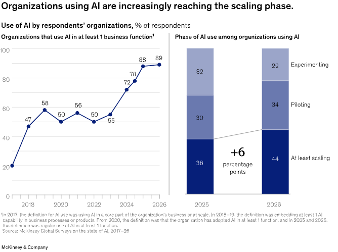

> [[../index|Wiki]] | [[../summary|Summary]] | [[../digest|Digest]]

# Use of AI Is Deepening

**In one sentence:** Organizations are moving from scattered AI experiments to enterprise-wide scaling — led decisively by large enterprises — with chatbots most mature, agentic AI and coding agents catching up fast, and coding agents already displacing buy decisions in favor of in-house builds.

## Key points

- 44% of respondents now say AI is scaling across their enterprise, up from 38% a year ago.
- Nearly nine in ten respondents (about 90%) report regular use of AI in at least one business function.
- The share of respondents using AI in three or more functions rose from 51% to 56%.
- 54% of respondents from organizations with at least $1 billion in annual revenue report scaling AI enterprise-wide, versus one-third (33%) of respondents from smaller organizations.
- Large organizations' scaling of agentic AI jumped from 27% to 40% year-over-year, while smaller organizations stayed flat at 22%.
- Chatbots are the most widely scaled AI tool, with 47% of respondents scaling them across the enterprise; roughly two in ten report enterprise-wide scaling of AI agents and a similar share for software coding agents (about 31% at larger enterprises).
- 32% of respondents say their organization decided against purchasing at least one software product or feature because they could build the functionality in-house using agentic coding tools — most common in technology and healthcare, then professional services and energy and materials.

---

## From experimentation to enterprise-scale adoption

Organizations continue to move beyond AI experimentation. Nearly nine in ten respondents report regular use of AI in at least one business function, but more organizations are moving from isolated deployments to enterprise-scale adoption: 44 percent now report that AI is scaling across their enterprise, up from 38 percent a year ago (Exhibit 1).

AI is also reaching more parts of the enterprise, with the share of respondents saying their organizations use AI in three or more functions increasing from 51 percent to 56 percent.

## Large organizations continue to outpace smaller ones

As seen in previous years, AI deployment by larger organizations continues to outpace deployment by smaller organizations. Fifty-four percent of respondents from organizations with at least $1 billion in annual revenue report scaling AI across the enterprise, compared with one-third of those from smaller organizations.

## Agentic AI: large enterprises pulling further ahead (Exhibit 2)

These larger organizations have moved more quickly than smaller ones over the past year in their use of agentic AI. The share scaling agents in one or more functions increased from 27 percent to 40 percent, while adoption among smaller organizations remained essentially flat, at 22 percent.

From the article's key takeaways: "Use of agentic AI is increasing, mostly accounted for by large enterprises. Forty percent of respondents from large organizations (those with annual revenues of more than $1 billion) report scaling AI agents, up from 27 percent last year. The share of respondents from smaller organizations reporting scaling remained flat at 22 percent. Many organizations are already scaling software coding agents. About two in ten are scaling them (31 percent at larger enterprises)."

## Which tools are scaling fastest (Exhibit 3)

Among AI tools, chatbots are the most widely scaled, with 47 percent of respondents saying their organizations are scaling them across the enterprise. About two in ten respondents report reaching the scaling phase across their organization with AI agents, and a similar share report the same with software coding agents. The results show that larger organizations are ahead in scaling across different types of AI tools.

## Coding agents are shifting build-vs-buy decisions (Exhibit 4)

Coding agents are emboldening companies to build their own software rather than purchase it. Nearly one-third of respondents (32 percent) report that their organizations have decided against purchasing at least one software product or feature because they were able to build the functionality in-house using agentic coding tools. These decisions are most commonly reported by respondents working in technology and healthcare, followed by those in professional services and energy and materials.

## McKinsey commentary — Lieven Van der Veken (Senior partner)

Not only are larger organizations scaling AI faster, but many are beginning to take greater ownership of their technology and change agendas. Until recently, many leaders assumed that AI was beyond the capabilities of their own technology teams, and that moving quickly meant securing the right external partnership. Now, the tone is changing. Leaders are asking what their organizations need to build AI tools themselves. The rise of software coding agents and in-house development is one clear sign of this broader shift. This, of course, does not mean companies should build everything themselves or turn away from forging partnerships. It means that leading organizations are engaging partners from a position of agency. The organizations moving fastest are becoming more deliberate about where to buy, where to build, and where to develop enough internal capability to integrate and scale what works. They are also treating operating costs as a design constraint, not an afterthought, and making the deeper changes in workflows required for value realization.

**Covers:** "Use of AI is deepening as organizations move beyond experimentation" section, Exhibits 1-4, from McKinsey's "The state of AI in 2026: On the road to ROI" (Aug 25, 2026 survey).
