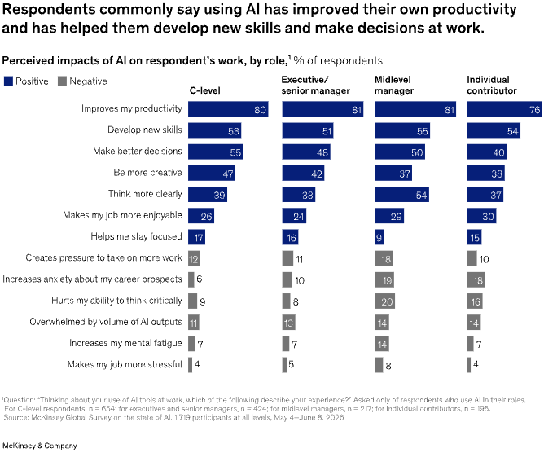

> [[../index|Wiki]] | [[../summary|Summary]] | [[../digest|Digest]]

# AI Impact Remains Concentrated

**In one sentence:** Individual employees are experiencing real, consistent gains from AI—productivity, skills, decision-making—but these gains have not translated into broad enterprise-level financial impact, which has stayed essentially flat year over year.

## Key points

- 80 percent of respondents say AI has improved their individual productivity, and these gains are remarkably consistent across organizational levels.
- About half (50 percent) of respondents say AI has helped them develop new skills and make better decisions at work.
- The experience is not universally positive: 47 percent of mid-level managers and individual contributors report AI-related strains, compared with 31 percent of executives and senior managers.
- Only 37 percent of respondents report that AI has contributed positively to their organization's EBIT (earnings before interest and taxes)—essentially unchanged from 2025, despite more organizations scaling AI technologies.
- The share of "AI high performers"—respondents who attribute at least 5 percent of EBIT to AI and describe its impact as "significant"—has remained flat at about 6 percent of all respondents.
- Beyond EBIT, respondents cite organization-wide benefits from AI, most notably improvements in innovation, competitive differentiation, customer satisfaction, and employee satisfaction.
- Cost reductions from AI are most frequently reported in supply chain management, service operations, and manufacturing.
- Revenue gains are most often attributed to AI use in marketing and sales, followed by product and service development and software engineering.

---

## Individual gains are real and consistent

The survey results show that individual employees are seeing meaningful benefits from AI. Eight in ten respondents say AI has improved their productivity, and about half say it has helped them develop new skills and make better decisions. These impacts are remarkably consistent across organizational levels (Exhibit 5).

However, the experience is not universally positive: mid-level managers and individual contributors are more likely than executives to report AI-related strains. Among mid-level managers and individual contributors, 47 percent say they have experienced one of these negative effects, compared with 31 percent of executives and senior managers.

## Enterprise financial impact has not moved

These individual gains have yet to translate into broad financial impact for organizations. About four in ten respondents (37 percent) report that AI has contributed positively to their organizations' EBIT, essentially unchanged from 2025—despite growth in the share of organizations scaling AI technologies. But respondents do cite other organization-wide benefits: most notably, improvements in innovation, competitive differentiation, customer satisfaction, and employee satisfaction.

From the article's key takeaways: the share of respondents reporting enterprise-level financial impact from AI use has not changed since last year. Thirty-seven percent of respondents attribute at least some EBIT impact to AI use (about the same share as last year). And the proportion of AI high performers (those who attribute at least 5 percent of EBIT to their use of AI and describe the technology's impact as "significant") has remained flat at about 6 percent of all respondents.

## Where cost reductions show up

Yet even respondents who don't report enterprise-level EBIT impact do say their organizations are seeing financial impact from specific business functions' use of AI. Respondents most frequently report cost reductions from AI use in supply chain management, service operations, and manufacturing (Exhibit 6).

## Where revenue gains show up

Revenue gains, meanwhile, are most often attributed to the use of AI in marketing and sales, followed by product and service development and software engineering (Exhibit 7).

## McKinsey commentary — Dan Tinkoff (Senior partner)

A striking finding this year is the gap between individual gains and enterprise impact. At the individual level, AI is clearly a boon: 80 percent of survey respondents say it has improved their productivity and half say it helps them make better decisions. Yet, only 37 percent of organizations report any positive EBIT contribution, essentially flat compared with last year. What has changed, however, is the human foundation available to close that gap. Employees are building AI fluency—on their own or with assistance from company rollouts of general-purpose AI tools—and that shift matters. The opportunity for business leaders is to harness the energy created by growing employee literacy and to establish an operating model that enables them to lead the end-to-end reimagining of workflows in their areas of responsibility at speed and at scale.

---

**Covers:** "Despite broader use and individual results, AI impact remains concentrated" section, Exhibits 5-7, from McKinsey's "The state of AI in 2026: On the road to ROI" (Aug 25, 2026 survey).
