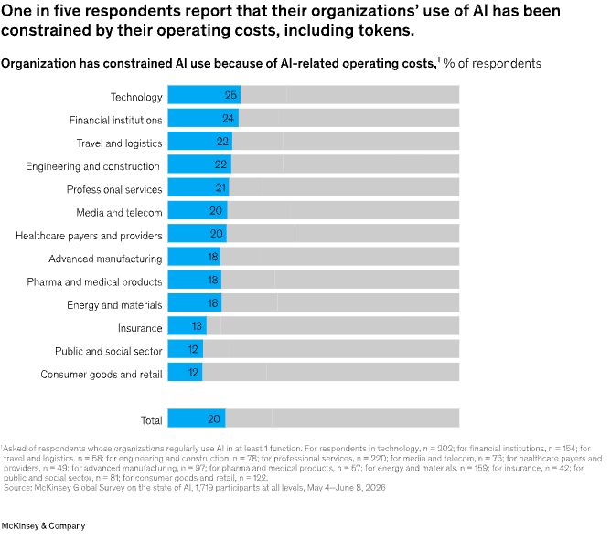

> [[../index|Wiki]] | [[../summary|Summary]] | [[../digest|Digest]]

# Operating Costs Are Constraining AI Use for Some

**In one sentence:** Roughly one in five organizations now say AI operating costs (including token costs) are limiting their AI use, but this hasn't dampened investment — 28% already spend over 10% of their IT budget on AI, and 60% plan to spend even more next year.

## Key points

- One in five respondents says their organization is limiting AI use because of operating costs — a share that is broadly consistent across organization sizes and many industries.
- For each of three tool types — AI chatbots, AI agents, and software coding agents — about one in ten respondents say costs have constrained their organization's use.
- 28% of respondents say their organization spends more than 10% of its total enterprise-wide IT (information and communication technology) budget on AI technologies.
- 60% of respondents expect their organization to increase AI investment over the next year.
- Pharmaceuticals and medical products, insurance, and banking and other financial institutions are the industries most likely to expect increasing AI investment.
- Per-token costs have declined, but token consumption has grown even faster, especially for agentic software development and complex reasoning tasks that rely on frontier models — making "tokenomics" and AI ROI a growing focus for CFOs (chief financial officers) and chief AI officers.
- Spend on horizontal, chatbot-style AI tools is increasingly treated as a routine cost of doing business, similar to office productivity and communications software.
- Agentic coding tools are pulling more software development in-house, shifting IT budget away from buying packaged software.

---

## Cost is a growing but not yet widespread constraint

As organizations expand deployment, AI operating costs (including for tokens) are becoming a meaningful consideration — but not yet a widespread constraint. One in five respondents says their organization is limiting AI use because of operating costs, a share that is broadly consistent across organizations of different sizes and across many industries (Exhibit 8).

Those cost constraints are being reported across the full range of AI tools. For each of three tools — AI chatbots, AI agents, and software coding agents — about one in ten respondents say their organizations' use has been constrained by costs.

## Investment keeps rising despite cost pressure (Exhibit 9)

Despite emerging cost pressures, organizations are still investing meaningfully in AI. Twenty-eight percent of respondents say their organizations are spending more than 10 percent of their total enterprise-wide budget for information and communication technology on AI technologies. And looking ahead, 60 percent of respondents expect their organizations to increase their AI investments over the next year. Respondents in pharmaceuticals and medical products, insurance, and banking and other financial institutions are the most likely to expect increasing investment.

## McKinsey commentary — Michael Chui (Senior fellow)

CFOs and chief AI officers are increasingly talking about "tokenomics" and the ROI of AI. They've discovered that AI isn't "too cheap to meter" when it comes to agentic software development and complex reasoning tasks that benefit most from frontier models: even as per-token costs have declined, the number of tokens consumed and generated has increased even faster. But these use cases have demonstrated value, so organizations are planning to invest more, even as they develop new disciplines for optimizing ROI from their AI expenditures. Spend on horizontal AI-enabled tools, such as chatbots, is increasingly managed as a necessary cost of doing business, similar to office productivity and communications tools. AI influences other parts of the IT budget, too: agentic coding tools are creating a more capable option for moving some software development in-house, rather than buying packaged software.

## Key takeaway

The cost of AI is constraining usage in some organizations. About 20 percent of respondents report that AI-related operating costs (including token costs) constrained their AI use. But the majority plan to increase their AI investments.

**Covers:** "While AI investments are increasing, operating costs are constraining AI use for some" section, Exhibits 8-9, from McKinsey's "The state of AI in 2026: On the road to ROI" (Aug 25, 2026 survey).
