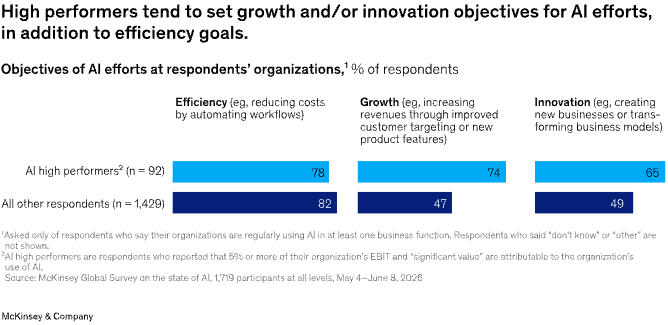

> [[../index|Wiki]] | [[../summary|Summary]] | [[../digest|Digest]]

# High-Performing Organizations Are Transforming With AI

**In one sentence:** The roughly 6% of respondents who qualify as AI "high performers" (5%+ EBIT impact plus self-reported "significant" value) stand apart not primarily because of bigger budgets, but because they pursue growth and innovation alongside efficiency, fundamentally redesign workflows around AI, back deployments with sustained leadership and operational rigor, and manage AI risk more broadly than their peers.

## Key points

- AI high performers—defined as respondents attributing 5%+ EBIT impact to AI and reporting "significant" organizational value from AI—remain just 6% of survey respondents, unchanged from 2025.
- About 80% of both high performers and other respondents pursue efficiency gains from AI, but most high performers additionally pursue growth and/or innovation objectives, a much broader aspiration set than their peers.
- High performers are 3.3 times more likely than others to intend to fundamentally transform their business with AI within the next three years.
- Nearly three-quarters (about 74%) of high performers report fundamentally redesigning workflows because of AI, up sharply from 55% last year, versus just one-quarter of other respondents.
- High performers are twice as likely as others to report senior-leader commitment to AI initiatives and to have defined processes for measuring AI's impact.
- High performers invest more aggressively: they are more than twice as likely to spend over 15% of their enterprise IT budget on AI, and more than half plan to increase AI investment by 10%+ in the next year, versus 36% of other respondents.
- High performers are more than three times as likely as others to be scaling agents across most business functions, twice as likely to be scaling software coding agents, and 2.7 times more likely to be scaling other agentic AI.
- High performers manage AI risk more broadly, being much more likely than others to actively mitigate exploitation of AI-driven technical vulnerabilities and unauthorized or unintended AI actions.

---

### Overview: a small group points to a path forward

High performers—just 6% of respondents, flat versus 2025—are distinguished less by scale of spend than by coherence of approach. Compared with other organizations, they are more likely to use AI to transform the organization itself (not just bolt AI onto existing processes), adopt a broader set of best practices, deploy a wider range of AI technologies, and actively manage the risks that come with broader AI use. McKinsey frames their experience as a lesson for the majority of organizations still trying to move from individual productivity gains to real financial impact: pursue growth/innovation alongside efficiency, redesign workflows end-to-end rather than inserting AI into old ones, and back deployment with leadership commitment and operational rigor.

### High performers have bigger AI aspirations

High performers set broader goals for AI than other organizations do. While roughly 80% of both groups say they're pursuing efficiency gains, most high performers also report using AI to pursue growth and/or innovation objectives (Exhibit 10)—a combination other respondents pursue far less often.

High performers are 3.3 times more likely than others to say they intend to fundamentally transform their business using AI within the next three years. This ambition is already showing up in practice: nearly three-quarters of high performers report they have fundamentally redesigned workflows as a result of AI use, up from 55% just a year ago. Only about a quarter of other respondents report the same kind of workflow redesign, suggesting most non-high-performers are still layering AI onto existing processes rather than rethinking them.

Beyond redesigning workflows, high performers more consistently follow a set of organizational practices that help "rewire" the business to capture AI value (Exhibit 11). They are twice as likely as others to report that senior leaders visibly demonstrate commitment to AI initiatives, and twice as likely to have defined processes in place for measuring the impact of those initiatives—turning ambition into something that is actually tracked and reinforced from the top.

Investment levels back up the ambition. High performers are more than twice as likely as other respondents to devote over 15% of their enterprise-wide IT budget to AI. They also plan to keep accelerating: more than half of high performers expect to increase AI investment by 10% or more over the next year, compared with only 36% of other respondents.

### High performers use AI—and manage the associated risks—more broadly

High performers deploy AI across more business functions and more commonly report scaling it rather than just piloting it. They are more than three times as likely as other respondents to be scaling agents across most of the business functions covered in the survey (Exhibit 12).

Within agentic AI specifically, high performers are twice as likely as others to report scaling software coding agents, and 2.7 times more likely to report scaling other forms of agentic AI (Exhibit 13). They're also using coding agents as a substitute for buying software: nearly half of high performers say their organization has decided against purchasing one or more software products or features because equivalent functionality could be built in-house with coding agents, compared with 31% of other respondents.

That heavier reliance on coding agents comes with a distinct cost pressure: high performers report being constrained by cost in their use of software coding agents about three times as often as other respondents do, even though the two groups report similar cost constraints for other categories of AI tools (Exhibit 14).

Finally, broader use comes with broader risk management. High performers are considerably more likely than others to report actively working to mitigate exploitation of AI-driven technical vulnerabilities and to guard against unauthorized or unintended AI actions (Exhibit 15)—treating risk management as a scaling prerequisite rather than an afterthought.

**McKinsey commentary (Tara Balakrishnan, Associate Partner):** High performers' advantage isn't reducible to budget. What sets them apart is coherence: pursuing growth/innovation alongside efficiency, redesigning workflows rather than layering AI onto old ones, and embracing mutually reinforcing practices—senior-leadership role modeling, human-in-the-loop design, impact measurement, and risk management. The persistent challenge for all organizations is avoiding a pileup of disconnected tools and pilots, and instead building a repeatable capability to turn AI efforts into genuinely new ways of working—reimagining end-to-end workflows, shifting roles and capacity, and building the cross-functional muscle to scale what works. That organizational absorption capacity, more than the technology itself, is increasingly the real bottleneck.

---

**Covers:** "High-performing organizations are transforming with AI" section, Exhibits 10-15, from McKinsey's "The state of AI in 2026: On the road to ROI" (Aug 25, 2026 survey).
