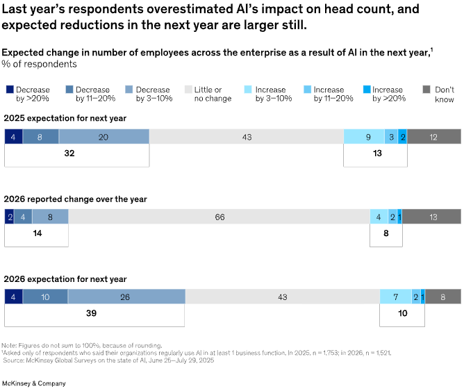

> [[../index|Wiki]] | [[../summary|Summary]] | [[../digest|Digest]]

# AI-Driven Workforce Reductions Were Overstated

**In one sentence:** Last year's workforce-decline expectations were much larger than what actually happened, but expectations for the coming year are rising again.

## Key points

- Just 14% of respondents from organizations using AI report that AI contributed to an overall decline in workforce size in the past year — less than half the 32% who, in last year's survey, expected workforce reductions over that same period.
- Two-thirds of respondents report little or no AI-related change in their organizations' total employment in the past year.
- Looking ahead, 39% of respondents now expect AI to decrease their organizations' overall head count over the next year, up from 32% last year, while a similar share (43%) expects little or no change.
- The same overestimation pattern holds function by function: in every business function asked about, the share reporting actual workforce reductions is smaller than the share that predicted reductions last year.
- In marketing and sales, manufacturing, strategy and corporate finance, and knowledge management, the share reporting actual decreases is about half the share that predicted such decreases in 2025.
- Service operations and supply chain management remain the functions where the largest shares of respondents expect reductions over the coming year, consistent with last year's pattern.
- Despite rising expectations of workforce declines at the organizational level, only 13% of respondents say "AI makes me feel anxious about my career prospects."

---

## Realized reductions fell well short of last year's expectations

Respondents increasingly expect AI use to result in reductions in their workforce. That said, the organizational changes realized over the past year fell well short of what respondents had anticipated a year ago. Just 14 percent of respondents from organizations using AI report that AI contributed to an overall decline in workforce size in the past year — less than half the 32 percent who, in last year's survey, expected workforce reductions over the same period. Two-thirds of respondents report little or no AI-related change in their organizations' total employment in the past year.

## Expectations for the coming year are rising again

In this year's survey, 39 percent of respondents expect AI to decrease their organizations' overall head count over the next year, while a similar share (43 percent) expects little or no change (Exhibit 16).

From the article's key takeaways: "Respondents increasingly expect AI to spark workforce declines. Thirty-nine percent of respondents expect AI-related declines in their organizations' total employment in the coming year, compared with 32 percent last year. (Forty-three percent expect no AI-related change.) But the share expecting workforce declines in last year's survey was about double the share now reporting actual declines over the past year."

## The same overestimation pattern shows up by function (Exhibit 17)

A similar pattern emerges across individual business functions. In every function asked about, the share of respondents reporting workforce reductions is smaller than the share that predicted workforce declines last year. In 2025, respondents most often expected to see head count reductions in service operations, supply chain management, marketing and sales, and software engineering. In the latest survey, smaller shares of respondents report actual reductions in each of these functions than the shares that expected reductions last year.

The share reporting decreases in the number of employees in marketing and sales, manufacturing, strategy and corporate finance, and knowledge management is about half the share that predicted such decreases in 2025.

Looking at expected changes over the coming year, the largest share of respondents predicts reductions within service operations and supply chain management, as was true last year. In many functions, respondents remain more likely to expect no change than a reduction.

## Career anxiety remains low despite rising expectations

Despite increasing expectations for reduced workforces, most respondents do not see AI as a threat to their own careers. Just 13 percent say "AI makes me feel anxious about my career prospects."

---

**Covers:** "Previous expectations of AI-driven workforce reductions were overstated..." section, Exhibits 16-17, from McKinsey's "The state of AI in 2026: On the road to ROI" (Aug 25, 2026 survey).
