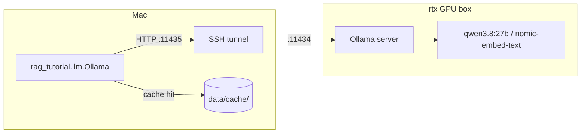

# 00 — Setup: project skeleton, cached Ollama client, Qdrant, corpus download

## What you will learn
- The tools every later chapter relies on: `uv`, `just`, Docker, Ollama, and an SSH (Secure Shell) tunnel to a
  remote GPU (Graphics Processing Unit).
- Why the LLM (Large Language Model) lives on a different machine, and how the Mac reaches it.
- The `project/` layout and what each file does.
- How the **on-disk cache** in `rag_tutorial.llm` makes the whole tutorial reproducible and free to
  re-run — and what to delete if you ever need to invalidate it.
- The task-prefix convention `nomic-embed-text` needs for good retrieval quality.
- The GPU-sharing rule this tutorial follows so it does not starve a training job running elsewhere.
- How to download and parse the 12-paper corpus, and how to run `just check`.

## Why these tools

- **uv** — a fast Python package manager and project runner. `uv sync` creates a `.venv` and installs
  exactly the versions pinned in `uv.lock`; `uv run <cmd>` runs a command inside that environment
  without you having to activate it. Every command below assumes you're in `project/`.
- **just** — a command runner (think `make`, but with saner syntax). `just --list` shows every
  recipe; `just <recipe>` runs one. It reads `.env` automatically (`set dotenv-load := true` at the
  top of the `justfile`), so recipes see `OLLAMA_URL`, `QDRANT_URL`, etc. without extra plumbing.
- **Docker** — runs Qdrant (a vector database, used from chapter 03 on) in a container so it does not
  pollute the Mac with a system service. `docker-compose.yml` uses **profiles** so `just up qdrant`
  starts only what is needed; later chapters add more services (pgvector, Open WebUI, kotaemon) behind
  their own profile names, without ever starting all of them at once.
- **Ollama** — a program that serves open-weight LLMs and embedding models over a small HTTP API
  (`/api/chat`, `/api/embed`). Instead of paying a hosted API per token, every model runs locally.
- **The SSH tunnel** — Ollama does not run on this Mac. It runs on `rtx`, a machine with an RTX 4090
  GPU (Graphics Processing Unit, 24 GB of video memory), because a 27-billion-parameter chat model like `qwen3.8:27b` needs
  more GPU memory than a laptop has. `fleet tunnel` (a small wrapper around `ssh -N -L
  11435:127.0.0.1:11434 rtx`) forwards local port `11435` to Ollama's port `11434` on `rtx`, so from
  the Mac's point of view Ollama is just `http://127.0.0.1:11435` — the client code in this tutorial
  never needs to know a remote machine is involved at all.



## Project layout

```
project/
├── pyproject.toml            # uv project: package rag_tutorial, deps, pytest markers
├── uv.lock                   # exact dependency versions, committed
├── .env.template             # settings with tutorial defaults; copy to .env
├── .gitignore                # PDFs, venv, vector indexes, Qdrant data — never committed
├── docker-compose.yml        # qdrant service, behind the "qdrant" profile
├── justfile                  # sync/up/down/check/tunnel/gpu-check/corpus-*/cache-stats
├── src/rag_tutorial/
│   ├── config.py              # Settings (pydantic-settings), loaded once from .env
│   ├── llm.py                 # Ollama: cached chat() + embed(), count_tokens(), cache_stats()
│   ├── testing.py             # FakeLLM / FakeEmbedder — offline stand-ins for every test
│   ├── corpus.py               # Typer CLI: download / parse / stats for the 12-paper corpus
│   ├── check.py                # `just check` — one status table
│   └── gpu.py                  # `just gpu-check` — is the shared RTX GPU polite to use right now?
├── data/
│   ├── corpus/
│   │   ├── papers.yaml          # the fixed 12-paper list (id, title, year, license, page count)
│   │   ├── pdf/                 # downloaded PDFs (gitignored)
│   │   └── md/                  # parsed Markdown, one file per paper (committed)
│   └── cache/                   # Ollama response + embedding cache (committed)
└── tests/
    └── test_00_setup.py         # offline: cache round-trip, FakeEmbedder, token count, PDF parse
```

Every later chapter adds one module under `src/rag_tutorial/`, its own `just` recipes, and (from
chapter 03 on) writes `runs/<experiment>/metrics.json` — but this skeleton does not change.

## Settings and `.env`

`config.py` defines a `pydantic-settings` model that reads `project/.env` (copied once from
`.env.template`, then never committed — see `.gitignore`):

```python
class Settings(BaseSettings):
    model_config = SettingsConfigDict(env_file=PROJECT_ROOT / ".env", extra="ignore")

    ollama_url: str = "http://127.0.0.1:11435"
    chat_model: str = "qwen3.8:27b"
    embed_model: str = "nomic-embed-text"
    embed_dim: int = 768
    qdrant_url: str = "http://localhost:6343"
    cache_dir: str = "data/cache"
```

A module-level `settings = Settings()` singleton is imported everywhere else, plus a `settings.path(rel)`
helper that resolves a path relative to the project root (`project/`), regardless of the current
working directory the command was run from.

## The cached Ollama client — the most important file of this tutorial

`rag_tutorial.llm.Ollama` wraps two Ollama endpoints:

- `chat(messages, *, model=None, temperature=0.0, seed=42, num_ctx=16384, max_tokens=1024,
  json_schema=None) -> str` — POSTs to `/api/chat` with `stream: false`. Temperature 0 and a fixed
  seed mean the same prompt always asks for the same answer, which matters once results feed the
  scoreboard.
- `embed(texts, *, model=None, prefix="") -> list[list[float]]` — POSTs to `/api/embed` in batches of
  32, `truncate: true`, returns one vector per text.

**Both go through a disk cache first.** The cache key is a SHA-256 hash of a canonical JSON encoding
of `(endpoint, model, options, input)`:

```python
def _cache_key(endpoint: str, model: str, options: dict, payload_input) -> str:
    blob = _canonical_json({"endpoint": endpoint, "model": model, "options": options, "input": payload_input})
    return hashlib.sha256(blob.encode("utf-8")).hexdigest()
```

For chat, `input` is the message list plus the JSON schema (if any) and the `think: false` flag (see
below); for embeddings, **the key is computed per text, not per batch** — `data/cache/embed/<model>/<key[:2]>/<key>.json`
holds one embedding. That is deliberate: chapter 04 re-chunks the same papers many times with
different chunk sizes, and most chunks are unaffected by a chunk-size change; embedding cache reuse at
the *text* level means only the actually-new text gets a fresh LLM call. Chat responses live at
`data/cache/chat/<key[:2]>/<key>.json`. Splitting on the first two hex characters (`<key[:2]>`) keeps
any one directory from accumulating tens of thousands of files.

Each cache entry stores the request, the response, and Ollama's own `usage` numbers
(`prompt_eval_count`, `eval_count`, `total_duration`), and `Ollama().stats` accumulates hits, misses,
tokens and seconds across a run — `just cache-stats` prints the on-disk totals:

```
$ just cache-stats
    rag_tutorial cache
┏━━━━━━━┳━━━━━━━━━┳━━━━━━━┓
┃ kind  ┃ entries ┃ bytes ┃
┡━━━━━━━╇━━━━━━━━━╇━━━━━━━┩
│ chat  │       1 │   477 │
│ embed │       1 │ 13582 │
└───────┴─────────┴───────┘
```

**Why this matters for the whole tutorial:** the corpus and golden question set are fixed from
chapter 02 on, so once a chunk has been embedded once, or a question answered once at temperature 0,
that exact call is free forever after — `just check`, the test suite, and `just scoreboard` never
have to wait on the GPU again unless something about the input actually changed. The cache is
committed to git for the same reason `data/corpus/md/` is: a fresh clone of this repo can reproduce
every documented number without a working Ollama connection at all.

**Invalidating the cache** is just deleting files: `rm -rf data/cache/chat` forces every chat call to
re-run (e.g. after changing a prompt template); `rm -rf data/cache/embed/<model>` forces re-embedding
with one model without touching another's cache; deleting a single `<key>.json` forces exactly one
call to re-run. There is no cache-busting flag — the key already encodes every input that affects the
output, so if you change a prompt, a model, or an option, you automatically get a fresh cache entry
instead of a stale one.

**Retries and errors:** `_post` retries 3 times with exponential backoff (2s, 4s) on connection
errors, read timeouts, and HTTP 5xx; if all retries fail, the error message names the likely cause
directly:

```
Could not reach Ollama at http://127.0.0.1:11435/api/chat after 3 attempts (...).
Is the SSH tunnel to rtx up? Try `just tunnel`.
```

**A gotcha we hit while writing this chapter:** `qwen3.8:27b` is a "thinking" model — by default it
writes a chain-of-thought into a separate `thinking` field *before* the visible `content`, and both
draw from the same `num_predict` (max output tokens) budget. With a small `max_tokens` (we first
tried 8, to check for the single word "OK"), the model spent its whole budget thinking and returned
an **empty** `content`. The fix is one field: every chat request sends `"think": false` at the top
level of the payload, which this client always sets and includes in the cache key.

## Embedding task prefixes

`nomic-embed-text` was trained with instruction prefixes and expects them at inference time too —
without a prefix, retrieval quality drops. From the model's Hugging Face card: `search_document: ` in
front of anything you are going to *store and search over*, `search_query: ` in front of a question
you are searching *with*. This client keeps a small per-model table and two convenience methods:

```python
_EMBED_PREFIXES = {
    "nomic-embed-text": {"document": "search_document: ", "query": "search_query: "},
}

def embed_documents(self, texts): ...   # adds "search_document: "
def embed_query(self, text): ...        # adds "search_query: "
```

Other embedding models compared in chapter 06 (`bge-m3`, `mxbai-embed-large`, `qwen3-embedding`) get
an empty entry (or their own prefix) added to the same table when they're introduced — the rest of the
tutorial always calls `embed_documents` / `embed_query`, never the low-level `embed`, so swapping
models never means hunting down raw prefix strings in retrieval code.

## Token counting

`count_tokens(text)` uses `tiktoken`'s `cl100k_base` encoding. This is **not** the real tokenizer for
`qwen3.8:27b` or `nomic-embed-text` — Ollama does not expose a public tokenizer endpoint for either —
so treat every token count in this tutorial as an approximation good enough for chunk-size budgeting
and reporting, not an exact bill.

## `FakeLLM` and `FakeEmbedder` — testing without the network

`rag_tutorial.testing` provides two offline stand-ins with the same method names as `Ollama`:

- `FakeLLM(canned={...})` — `chat()` returns a canned answer if the last user message contains a
  matching substring, otherwise echoes the message back (prefixed `"echo: "`), so a test can assert
  on predictable output.
- `FakeEmbedder(dim=32)` — `embed()` hashes each word of the input into one of `dim` buckets and
  L2-normalises the result: same text always gives the same vector, different texts are very likely
  to differ, and there is no model, network, or randomness involved.

Every later chapter's tests build on these two instead of talking to Ollama, which keeps the whole
suite (`uv run pytest tests/ -q -m "not slow"`) under two minutes and runnable with no network.

## The corpus

`data/corpus/papers.yaml` fixes the 12 arXiv papers this whole tutorial is about — the golden question
set (chapter 02) and every retrieval experiment after it use exactly this set and never change it:

| id | short name | pages | license |
|---|---|---|---|
| 2005.11401 | rag | 19 | arXiv non-exclusive |
| 2004.04906 | dpr | 13 | arXiv non-exclusive |
| 2112.01488 | colbertv2 | 20 | CC BY 4.0 |
| 2212.10496 | hyde | 11 | arXiv non-exclusive |
| 2307.03172 | lost_in_the_middle | 18 | arXiv non-exclusive |
| 2309.15217 | ragas | 8 | CC BY 4.0 |
| 2310.11511 | self_rag | 30 | CC BY 4.0 |
| 2312.10997 | rag_survey | 21 | arXiv non-exclusive |
| 2401.05856 | seven_failure_points | 6 | CC BY 4.0 |
| 2401.15884 | crag | 16 | arXiv non-exclusive |
| 2401.18059 | raptor | 23 | CC BY 4.0 |
| 2404.16130 | graphrag | 26 | CC BY 4.0 |

211 real pages total (page counts are read from the downloaded PDFs with `pypdf`, not estimated).
`rag_tutorial.corpus download` fetches each `https://arxiv.org/pdf/<id>` to `data/corpus/pdf/<id>.pdf`
(skipping files already on disk, sending a descriptive `User-Agent`, sleeping 3 seconds between
requests to be polite to arXiv), then writes the real page count back into `papers.yaml`.
`rag_tutorial.corpus parse` converts each PDF to Markdown with `pypdf` — one `# <title>` heading, then
each page's text behind an `<!-- page N -->` marker, with end-of-line hyphenation joined back together
(`infor-\nmation` → `information`); chapter 02 compares this against `pymupdf4llm` and Docling on
tables and headings. The real output of `just corpus-parse`:

```
                        rag_tutorial corpus
┏━━━━━━━━━━━━┳━━━━━━━━━━━━━━━━━━━━━━┳━━━━━━━┳━━━━━━━━━━━━┳━━━━━━━━┓
┃ id         ┃ short_name           ┃ pages ┃ characters ┃ tokens ┃
┡━━━━━━━━━━━━╇━━━━━━━━━━━━━━━━━━━━━━╇━━━━━━━╇━━━━━━━━━━━━╇━━━━━━━━┩
│ 2005.11401 │ rag                  │    19 │      69383 │  18494 │
│ 2004.04906 │ dpr                  │    13 │      55764 │  14424 │
│ 2112.01488 │ colbertv2            │    20 │      85865 │  23034 │
│ 2212.10496 │ hyde                 │    11 │      41155 │  11806 │
│ 2307.03172 │ lost_in_the_middle   │    18 │      65311 │  17131 │
│ 2309.15217 │ ragas                │     8 │      31881 │   7851 │
│ 2310.11511 │ self_rag             │    30 │     106262 │  26804 │
│ 2312.10997 │ rag_survey           │    21 │     109992 │  28590 │
│ 2401.05856 │ seven_failure_points │     6 │      31923 │   7227 │
│ 2401.15884 │ crag                 │    16 │      61539 │  15930 │
│ 2401.18059 │ raptor               │    23 │      77586 │  20083 │
│ 2404.16130 │ graphrag             │    26 │      90058 │  23314 │
│ total      │                      │   211 │     826719 │ 214688 │
└────────────┴──────────────────────┴───────┴────────────┴────────┘
```

211 pages, ~827K characters, ~215K tokens (`cl100k_base` approximation) — the parsed Markdown is
about 844 KB and is committed to git (`rag_tutorial.corpus stats` reproduces the same table from the
Markdown alone, no PDFs or network needed).

## Qdrant in Docker

`docker-compose.yml` defines one service behind the `qdrant` profile:

```yaml
name: rag-tutorial

services:
  qdrant:
    image: qdrant/qdrant:v1.19.0
    container_name: rag-qdrant
    profiles: ["qdrant"]
    ports:
      - "6343:6333"   # REST
      - "6344:6334"   # gRPC
    volumes:
      - ./data/qdrant:/qdrant/storage
    healthcheck:
      test: ["CMD-SHELL", "bash -c 'exec 3<>/dev/tcp/127.0.0.1/6333 && printf \"GET /readyz HTTP/1.0\r\n\r\n\" >&3 && grep -q \"200 OK\" <&3'"]
      interval: 5s
      timeout: 5s
      retries: 20
```

Two things worth calling out:

- The top-level `name: rag-tutorial` is not decoration. Docker Compose derives a default project name
  from the current directory, and every tutorial's compose file lives in a folder literally called
  `project/` — the sibling `graph_rag2` tutorial documented an incident where that default caused one
  `docker compose up` to silently recreate (and briefly delete) *another* tutorial's running
  container. An explicit `name:` avoids the collision entirely.
- The `qdrant/qdrant` image ships neither `curl` nor `wget`, and Docker's `CMD-SHELL` healthcheck runs
  under `/bin/sh` (`dash` in this image), which has no `/dev/tcp` support. Bash **is** present at
  `/usr/bin/bash`, so the healthcheck invokes it explicitly to open a raw TCP socket and send a bare
  `GET /readyz HTTP/1.0` request — confirmed working (`docker inspect --format '{{.State.Health.Status}}' rag-qdrant` → `healthy` within ~10 seconds of `just up qdrant`).

`just up qdrant` runs `docker compose --profile qdrant up -d` and then polls every container's health
status until all report `healthy`; `just down qdrant` stops them, keeping the `./data/qdrant` volume.

## The GPU-sharing rule

The RTX 4090 on `rtx` is shared with the `llm_training` tutorial, which runs its own training jobs on
the same GPU. `rag_tutorial.gpu` implements the check from the tutorial-wide rule in `specs/COMMON.md`:
before a batch of more than ~100 LLM calls, look at what else is using the GPU and back off if a
non-Ollama process holds more than 6 GB.

```
$ just gpu-check
pid=219819 process=python used_memory=704 MiB
pid=220141 process=/usr/local/lib/ollama/llama-server used_memory=19030 MiB
pid=220233 process=/usr/local/lib/ollama/llama-server used_memory=318 MiB
GPU is polite to use
```

Note the process name check: Ollama's actual GPU worker is not literally called `ollama` — it shows
up as a path, `/usr/local/lib/ollama/llama-server` — so `is_gpu_free_for_us` matches `"ollama"`
anywhere in the process name rather than requiring an exact match; otherwise Ollama's own 19 GB would
be (wrongly) counted against the budget. `wait_for_gpu(max_hours=6)` polls every 10 minutes and is
meant to be called by any later batch job before it starts; single calls and embeddings are always
fine, no matter what else is running.

## Running `just check`

```
$ just check
                     rag_tutorial check
┏━━━━━━━━━━━━━━━━━━━━━━━━━━━━━━━━━━┳━━━━━━━━━━━━━━━━━━━━━━━┓
┃ check                            ┃ result                ┃
┡━━━━━━━━━━━━━━━━━━━━━━━━━━━━━━━━━━╇━━━━━━━━━━━━━━━━━━━━━━━┩
│ Ollama reachable                 │ yes (version 0.32.12) │
│ chat model qwen3.8:27b answers   │ 'OK'                  │
│ embedding dim (nomic-embed-text) │ 768                   │
│ Qdrant /readyz                   │ ok                    │
│ corpus present                   │ 12/12 papers parsed   │
│ cache size                       │ 2 entries, 13.7 KB    │
└──────────────────────────────────┴───────────────────────┘
```

`check.py` exits non-zero if Ollama is unreachable or the chat model fails to answer (those two are
required for every later chapter); Qdrant-not-started and an empty corpus are reported but do not
fail the check, since a fresh clone reaches this state before running `just up qdrant` / `just corpus`.

## Verified on

| component | version |
|---|---|
| Python | 3.14.6 (project requires `>=3.12`) |
| uv | project-managed `.venv`, `uv.lock` committed |
| Ollama server | 0.32.12 (`/api/version`) |
| `qwen3.8:27b` | digest `5f86f5def443...` |
| `nomic-embed-text:latest` | digest `0a109f422b47...` |
| Qdrant | `qdrant/qdrant:v1.19.0` |
| httpx | 0.28.1 |
| pydantic / pydantic-settings | 2.13.5 / 2.15.0 |
| typer | 0.27.2 |
| rich | 15.0.0 |
| pyyaml | 6.0.3 |
| tiktoken | 0.14.0 |
| pypdf | 6.16.2 |
| numpy / pandas | 2.5.2 / 3.0.5 |
| orjson | 3.12.0 |
| pytest / pytest-timeout | 9.1.1 / 2.4.0 |

## Troubleshooting

| symptom | cause | fix |
|---|---|---|
| `just check` says "Ollama reachable: NO" | the SSH tunnel to `rtx` is down | run `just tunnel` (or `ssh -N -L 11435:127.0.0.1:11434 rtx` in another terminal), then retry |
| chat model returns an empty answer | `qwen3.8:27b` spent its whole `num_predict` budget on `thinking` before writing `content` | already handled — this client always sends `"think": false`; if you call the raw Ollama API yourself, do the same |
| `docker compose up` fails to bind port 6343/6344 | another process (or a stale `rag-qdrant` container) already holds the port | `docker ps -a \| grep qdrant`, remove or reuse the old container; if the port is permanently taken, change it in both `.env.template`/`.env` and `index.md` and say so in this chapter |
| Ollama is slow (many seconds) even for a one-line reply | the model is being loaded into VRAM (Video RAM, the GPU's own memory) for the first time, or another job on `rtx` is using the GPU | first-call latency is expected; `just gpu-check` shows what else is running |
| `arxiv.org` returns HTTP 403 during `just corpus-download` | arXiv rate-limits or blocks requests without a descriptive User-Agent, or too many requests too fast | this client already sets a `User-Agent` and sleeps 3s between downloads; if it still 403s, wait a few minutes and retry, or fetch the PDF manually into `data/corpus/pdf/<id>.pdf` |
| Qdrant healthcheck stuck on "starting" | the container's `/bin/sh` has no `/dev/tcp` support | the fix (invoking `bash` explicitly) is already in `docker-compose.yml`; if you changed the healthcheck, keep the explicit `bash -c '...'` |

## Exercises

1. Delete one file under `data/cache/chat/` and run `just check` again — confirm from the printed
   cache-size numbers that exactly one new cache entry was written.
2. Change `chat_model` in `.env` to a model you don't have (e.g. `does-not-exist:1b`) and run
   `just check` — read the error message and undo the change.
3. Run `uv run python -m rag_tutorial.corpus stats` with `data/corpus/pdf/` deleted — confirm it still
   works from the committed Markdown alone, with no network.
4. Add a fake "embarrassingly large" GPU process to `parse_compute_apps`'s input in a Python shell and
   confirm `is_gpu_free_for_us` returns `False` for it but `True` for an Ollama-named process of the
   same size.

---
Previous: [index.md](index.md) · Next: [01_concepts.md](01_concepts.md)
