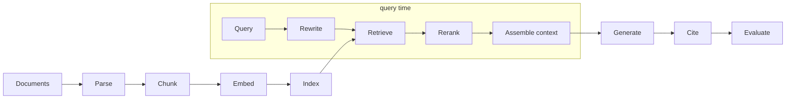

# 01 — Concepts: what RAG is, its anatomy, the open-source landscape, and how we measure

## What you will learn
- What RAG (Retrieval-Augmented Generation) is and the concrete problems it solves — with two real
  runnable demos, not just an argument.
- The anatomy of a RAG system as a pipeline of named stages, and which later chapter tunes each knob.
- Sparse vs dense retrieval in plain words, and why "retrieve more" is not automatically better.
- A map of the open-source landscape (orchestration libraries, RAG engines, end-user apps, retrieval
  infrastructure) with what each *kind* is for, before chapters 08–12 run the concrete projects.
- When RAG wins over long context or fine-tuning, and when it does not.
- Exactly how this tutorial measures every experiment from chapter 03 onward, so the numbers on the
  scoreboard mean the same thing every time.

## The problem RAG solves

An LLM (Large Language Model) like `qwen3.8:27b` only "knows" what was in its training data, frozen at
some point in the past — its **knowledge cutoff**. Ask it about a paper published last week, or about
your own company's internal wiki, and it has three options: say "I don't know" (rare), guess and be
wrong with total confidence (a **hallucination** — a fluent, plausible-sounding answer that is not
grounded in any real source), or, if the paper title is famous enough, echo back a *vague and
sometimes wrong* summary from memory. None of those are good enough for a system you want to trust.

RAG fixes this by **retrieval**: before asking the LLM to answer, first search a document collection
you control for the passages most relevant to the question, and paste them into the prompt alongside
the question. The LLM is not asked to *recall* facts from training — it is asked to *read* the
passages you just handed it and answer from those. This buys three things at once: **fresh
information** (index a new document, and the next question can use it — no retraining), **private
data** (your own PDFs, wiki pages, or tickets never need to leave your infrastructure to answer
questions about them), and **citations** (because you know exactly which passage the answer came
from, you can show it — turning "trust me" into "here is the paragraph").

### Demo 1 — the model with and without the paragraph it needs

`project/src/rag_tutorial/demo_concepts.py` (`just demo-concepts`, or `why-retrieval` on its own) asks
`qwen3.8:27b` three questions whose answers live in our 12-paper corpus and are specific enough that a
model is unlikely to have memorised them precisely from pretraining — first with nothing but the
question, then with the one relevant paragraph (found by hand with `grep` in `data/corpus/md/`) pasted
in front of it:

```python
WHY_RETRIEVAL_QUESTIONS = [
    {
        "question": "In the RAPTOR paper, what accuracy did GPT-4 reach on the QuALITY "
        "benchmark when paired with RAPTOR?",
        "context": (
            "In the QuALITY dataset, as shown in Table 7, RAPTOR paired with GPT-4 sets a new "
            "state-of-the-art with an accuracy of 82.6%, surpassing the previous best result of "
            "62.3%. In particular, it outperforms CoLISA by 21.5% on QuALITY-HARD."
        ),
    },
    # ... two more, on "Seven Failure Points" and CRAG's confidence thresholds
]
```

Real output, verbatim (truncated where noted):

> **Q: In the RAPTOR paper, what accuracy did GPT-4 reach on the QuALITY benchmark when paired with
> RAPTOR?**
>
> *Without context:* "...the authors compare RAPTOR against standard RAG baselines (like BM25 + GPT-4)
> ... Standard RAG (BM25 + GPT-4): Achieved an accuracy of approximately **40.0%** (exact match) or
> **45.0%** (F1 score...)" — invented numbers, invented baseline, and it never states RAPTOR's own
> figure (truncated at 256 tokens without reaching the number).
>
> *With context:* "Based on the context provided, RAPTOR paired with GPT-4 reached an accuracy of
> **82.6%** on the QuALITY benchmark." — correct, and it says so.

> **Q: How many failure points does the 'Seven Failure Points' paper list, and name two of them?**
>
> *Without context:* "The paper titled 'Seven Failure Points' (often associated with ... **Barry
> Boehm** or similar reliability engineering frameworks) ... 1. Requirements Errors ... 2. Design
> Errors ..." — the count (7) happens to be right, but every single named failure point is fabricated;
> the model latched onto a different, more famous "seven X" framework instead of retrieving nothing.
>
> *With context:* "the paper lists **7** failure points (FP1 through FP7). Two of them are: 1. **FP1
> Missing Content** ... 2. **FP2 Missed the Top Ranked Documents** ..." — correct and specific.

> **Q: In the CRAG paper, what upper and lower confidence thresholds were used on PopQA?**
>
> *Without context:* "1. Corrective Action (Retrieve): ... 2. Corrective Action (Correct): ... 3.
> Corrective Action (Correct): *Wait, let's clarify the three actions.*" — the model visibly gets
> confused about its own invented category names and never produces a number.
>
> *With context:* "the confidence thresholds set for the PopQA dataset are **(0.59, -0.99)**." —
> correct, exact match to the paper.

Two patterns worth internalising from this single run: the model's failure mode is not always "I don't
know" — it is often a fluent, structured, *wrong* answer that would look entirely credible to a reader
who had not read the source paper (the "Barry Boehm" fabrication is the clearest case: a real name
attached to a fake attribution). And the fix, in every case, is the same three lines of context, not a
bigger model or a cleverer prompt.

### Demo 2 — what an embedding actually captures

An **embedding** is a vector (a fixed-length list of numbers) produced by a model such that pieces of
text with similar *meaning* end up as vectors pointing in similar directions — even when they share
few or no words. `embeddings` (`just demo-concepts`) embeds six short sentences with `nomic-embed-text`
(two pairs restate the same idea in different words; two are unrelated to everything) and prints the
full pairwise **cosine similarity** matrix — the cosine of the angle between two vectors, 1.0 for
identical direction, 0.0 for unrelated, -1.0 for opposite:

```python
def cosine_similarity(a: list[float], b: list[float]) -> float:
    dot = sum(x * y for x, y in zip(a, b))
    norm_a = sum(x * x for x in a) ** 0.5
    norm_b = sum(y * y for y in b) ** 0.5
    return dot / (norm_a * norm_b)
```

Real output:

```
   cosine similarity (nomic-embed-text, 768 dims)
┏━━━┳━━━━━━━┳━━━━━━━┳━━━━━━━┳━━━━━━━┳━━━━━━━┳━━━━━━━┓
┃ # ┃     0 ┃     1 ┃     2 ┃     3 ┃     4 ┃     5 ┃
┡━━━╇━━━━━━━╇━━━━━━━╇━━━━━━━╇━━━━━━━╇━━━━━━━╇━━━━━━━┩
│ 0 │ 1.000 │ 0.809 │ 0.624 │ 0.615 │ 0.564 │ 0.533 │
│ 1 │ 0.809 │ 1.000 │ 0.667 │ 0.665 │ 0.603 │ 0.527 │
│ 2 │ 0.624 │ 0.667 │ 1.000 │ 0.930 │ 0.546 │ 0.535 │
│ 3 │ 0.615 │ 0.665 │ 0.930 │ 1.000 │ 0.517 │ 0.495 │
│ 4 │ 0.564 │ 0.603 │ 0.546 │ 0.517 │ 1.000 │ 0.520 │
│ 5 │ 0.533 │ 0.527 │ 0.535 │ 0.495 │ 0.520 │ 1.000 │
└───┴───────┴───────┴───────┴───────┴───────┴───────┘
[0] BM25 ranks documents by term frequency and inverse document frequency.
[1] Sparse lexical retrieval like BM25 scores matches using how often a word appears
    and how rare it is across the collection.
[2] HNSW builds a multi-layer graph of vectors to find approximate nearest neighbours quickly.
[3] Approximate nearest-neighbour search with HNSW navigates a layered vector graph
    instead of comparing against every point.
[4] Sourdough bread needs a long, slow fermentation to develop its flavour.
[5] The Eiffel Tower was completed in 1889 for the World's Fair in Paris.
```

The two "same idea, different words" pairs score highest — (0,1) at 0.809 and (2,3) at 0.930 — clearly
above any cross-pair or unrelated-sentence score (0.49–0.67). Retrieval works by finding a question's
nearest neighbours in exactly this vector space: it does not need the question to share vocabulary
with the right passage, only *meaning*.

### Demo 3 — why "just paste everything" does not scale

`tokens` (`just demo-concepts`) counts **tokens** — the sub-word units an LLM actually reads, roughly
¾ of a word each — in one paper, the whole 12-paper corpus, and compares both against the
`num_ctx` (**context window**, the maximum tokens a single request can contain) this tutorial uses and
the maximum the Ollama server allows:

```
                      tokens vs context
┏━━━━━━━━━━━━━━━━━━━━━━━━━━━━━┳━━━━━━━━━━━━━━━━━━━━━━━━━━━━━━┓
┃ what                        ┃ tokens (cl100k_base approx.) ┃
┡━━━━━━━━━━━━━━━━━━━━━━━━━━━━━╇━━━━━━━━━━━━━━━━━━━━━━━━━━━━━━┩
│ one paper (2005.11401)      │                        18494 │
│ whole corpus (12 papers)    │                       214688 │
│ Ollama num_ctx we use       │                        16384 │
│ Ollama server max (num_ctx) │                        98304 │
└─────────────────────────────┴──────────────────────────────┘

The whole corpus is ~13.1x our configured context window and ~2.2x the server's
maximum — 'just paste everything' does not fit even at the server's largest setting.
```

Even a *single* paper (18,494 tokens) is bigger than our 16,384-token `num_ctx`; the whole corpus is
over twice the server's absolute maximum of 98,304. Retrieval is not an optimisation on top of "paste
everything" — for any real document collection it is a hard requirement, because the collection simply
does not fit. Chapter 13 revisits this with a genuinely long-context model to ask a sharper question:
even where "paste everything" *does* technically fit, is it still worse than retrieving the right five
paragraphs? (Spoiler, from the research literature cited there: often yes, because of the
lost-in-the-middle effect below — but "often" is not "always," and chapter 13 measures it on our own
corpus instead of citing someone else's number.)

## Anatomy of a RAG system



Every later chapter is one paragraph of this diagram, made concrete:

- **Parse** — turn a PDF, HTML page, or Word document into clean text with structure (headings,
  tables) preserved well enough to chunk sensibly. Chapter 00 does this with plain `pypdf`; chapter 02
  compares it against `pymupdf4llm` and Docling on tables and headings, since a badly parsed table
  poisons every chunk that touches it.
- **Chunk** — cut the parsed text into pieces small enough to embed and retrieve precisely, but large
  enough to keep an answer's supporting sentences together. Chapter 04 is the whole chapter on this
  knob: fixed/recursive/token/sentence/Markdown-aware/semantic chunking, size and overlap, and
  fancier schemes (parent–child, sentence-window, contextual chunk headers, late chunking).
- **Embed** — turn each chunk into a vector with an embedding model (`nomic-embed-text` by default;
  chapter 06 compares several). The vector is what makes "find chunks about the same *idea*, not the
  same *words*" possible — see Demo 2 above.
- **Index** — store the vectors (and, for hybrid search, a keyword index too) so a query can be
  compared against every chunk fast, without a linear scan. Chapter 06 compares Chroma, Qdrant,
  pgvector, FAISS, and LanceDB on ingest time, latency, and recall.
- **Query rewrite** — the user's literal question is not always the best search query. Chapter 07
  covers multi-query expansion, HyDE (Hypothetical Document Embeddings — embed a hypothetical answer instead of the question), and
  step-back/decomposition for multi-hop questions.
- **Retrieve** — run the (rewritten) query against the index and get back a ranked list of candidate
  chunks. Chapter 05 is dense vs BM25 vs hybrid (Reciprocal Rank Fusion), metadata filtering, and
  top-k sweeps.
- **Rerank** — retrieval's ranking function (cosine similarity, or BM25's term statistics) is cheap
  but approximate; a reranker re-scores the top candidates with a more expensive, more accurate model
  before generation sees them. Chapter 07 covers cross-encoders, LLM-as-reranker, and ColBERT.
- **Assemble context** — decide how many chunks to keep, in what order, and with what surrounding
  text (chunk headers, neighbouring chunks). Chapter 07 also covers lost-in-the-middle-aware
  reordering (see below) and context compression.
- **Generate** — the LLM produces the answer from the question plus the assembled context. Chapter 03
  writes the first, deliberately minimal prompt for this; nothing in this tutorial changes the model
  itself (no fine-tuning) — chapter's `llm.py` is used as-is throughout.
- **Cite** — every generated claim should be traceable back to the chunk(s) it came from. This
  tutorial's chunk-id scheme (below) exists specifically so citations are cheap to check.
- **Evaluate** — score the whole pipeline against the golden question set. Chapter 02 builds the
  metrics module; every experiment chapter from 03 on reports the same columns.

## Retrieval basics in plain words

Two fundamentally different ways to decide "how relevant is this chunk to this query":

**Sparse (lexical) retrieval — BM25 (Best Match 25).** Represent both the query and every chunk as a bag of words, and
score a chunk by how many query words it contains, weighted by two ideas: **term frequency** (a word
that appears five times in a chunk probably matters more to that chunk than a word that appears once)
and **inverse document frequency**, **IDF** (a word that appears in every chunk in the collection, like
"the" or "system," tells you nothing about *which* chunk is relevant, so it is down-weighted; a rare
word like "QuALITY-HARD" is a strong, specific signal). BM25 is exact-match by nature: it cannot tell
that "car" and "automobile" mean the same thing.

**Dense retrieval — embeddings.** Represent the query and every chunk as embedding vectors (Demo 2)
and score by cosine similarity. This is exactly the strength BM25 lacks: it captures meaning, not
just shared vocabulary, so a query about "automobiles" can retrieve a chunk that only ever says "car."
Its weakness is the mirror image: dense retrieval can be *worse* than BM25 at precise, unusual terms
(an exact model name, an error code, an acronym like "FP7") because those get blurred into an average
in the same way an unusual chunk topic does — this is one of the concrete findings the BEIR (Benchmarking Information Retrieval) benchmark
reports (cited in `specs/research/models_eval_papers.md`), and part of why chapter 05 builds hybrid
search rather than picking one.

**Why both.** BM25 and dense retrieval fail on different queries, so combining their two ranked lists
(chapter 05's Reciprocal Rank Fusion) tends to beat either alone — a robustness argument, not a "dense
is old news" argument; production systems overwhelmingly run both.

**Approximate nearest neighbour search (HNSW), in one paragraph.** Once a collection has more than a
few thousand chunks, comparing a query's vector against *every* stored vector (exact nearest-neighbour
search) becomes too slow to do on every query. **HNSW** (Hierarchical Navigable Small World) builds a
multi-layer graph over the stored vectors at index time — coarse, long-range links at the top layers
for fast rough navigation, dense short-range links at the bottom layer for precision — so a query only
has to visit a small fraction of the graph to find vectors that are *very likely* the true nearest
neighbours, trading a small, tunable amount of recall for a large speedup. Qdrant, Chroma, and most
production vector stores use HNSW (or a close relative) under the hood; chapter 06 measures the actual
recall-vs-exact-search gap on our corpus instead of taking that "very likely" on faith.

**Top-k and why "more context" is not free.** Retrieving more chunks (a higher `k`) monotonically
increases the chance the right passage is *somewhere* in the context — but it does not monotonically
increase answer quality. Liu et al., "Lost in the Middle: How Language Models Use Long Contexts"
(2307.03172, in our corpus), show that LLMs use long context non-uniformly: accuracy is highest when
the relevant fact sits at the very start or very end of the prompt, and drops noticeably when it is
buried in the middle of a long context — so packing in ten mediocre chunks around the one good chunk
can make the model *less* likely to use the good one than three chunks with the good one first.
Chapter 05 sweeps `k` on our own scoreboard to show exactly where the curve turns over for this
corpus and this model, and chapter 07 tests reordering the assembled context to put the strongest
chunk first or last.

## The open-source landscape

Free/open-source RAG tooling splits into four different *kinds*, each solving a different layer of the
problem — conflating them is the single most common confusion for someone new to the space:

| Kind | What it is | Example decision it makes for you | Chapters |
|---|---|---|---|
| Orchestration libraries | Python code you assemble into a pipeline yourself; no opinion about UI or storage | Which retriever class to call, in what order | 08, 09, 10 |
| RAG engines / frameworks with their own pipeline model | A more opinionated, higher-level pipeline abstraction, often index-centric | How documents become an index and how a query becomes an answer | 09, 11, 12 |
| End-user apps with a UI | A complete product: upload documents, ask questions, no code | Everything — you configure settings, not code | 12 |
| Retrieval infrastructure | The storage/search layer everything else is built on | How vectors and keywords are actually stored and searched | 05, 06 |

Every one of these is "free" in the sense of open-source-licensed and self-hostable, and every one of
them also sells a paid cloud product on top: LangSmith (LangChain's hosted tracing/evals), LlamaCloud
(LlamaIndex's hosted parsing/indexing), Qdrant Cloud (managed Qdrant), and similar for several others
below. Nothing in this tutorial uses any of those — everything here runs on your own machine and the
`rtx` GPU box — but readers taking this into production should budget for the fact that "open-source
core" and "the vendor's actual business model" are not the same thing.

### Orchestration libraries

| Project | License | Stars (2026-08-30) | Best at | Main drawback | Chapter |
|---|---|---|---|---|---|
| LangChain + LangGraph | MIT | 145.3k | Huge ecosystem (350+ integrations); LangGraph gives real stateful/agentic control (Self-RAG/CRAG/Adaptive-RAG templates) | Frequent breaking changes — v1 moved most "advanced RAG" retrievers into a second package, `langchain-classic`; some documented features (HyDE, sub-question decomposition) have no first-class class currently | 08 |
| LlamaIndex | MIT | 51.9k | Cleanest developer experience for pure RAG; deepest retrieval-specific feature set (fusion retrieval, HyDE, auto-merging, sentence-window, free local evaluators) | Several advanced classes' exact import paths move across versions; the once-flagship RAPTOR pack is now deprecated/unmaintained | 09 |
| Haystack 2.x | Apache 2.0 | 26.4k | Explicit, typed, testable `Pipeline` graphs; many built-in rerankers; enterprise/production posture | Fewer named "advanced RAG" retriever classes than the other two; smallest community of the three | 10 |
| DSPy | MIT | 37.7k | Turns prompt engineering into an optimisable, measured process (`MIPROv2`, `BootstrapFewShot*` against our own golden set) — not a retrieval framework at all | No built-in vector-store or document-loader ecosystem; retrieval is fully DIY, wired in as "just a Python function" | 10 |

### RAG engines / frameworks with their own pipeline model

| Project | License | Stars | Best at | Main drawback | Chapter |
|---|---|---|---|---|---|
| LightRAG | MIT | 39.3k | Lightweight knowledge-graph + vector dual retrieval with four query modes (`local`/`global`/`hybrid`/`naive`/default `mix`); genuinely fast to index compared to full GraphRAG | Newer, thinner docs than the bigger apps; no numeric version was even findable on its own repo page during research | 11 |
| RAPTOR (as a technique/pack) | CC BY 4.0 (paper) | — | Recursive tree of clustered summaries, so both fine-grained facts and broad themes are retrievable | The maintained implementation (LlamaIndex's `llama-index-packs-raptor`) is deprecated; this tutorial re-implements the core idea directly instead | 11 |
| Microsoft GraphRAG | MIT | 35.7k | The original global/local community-summary search idea for corpus-wide "what are the themes" questions | Microsoft describes it as "in maintenance mode... a demonstration methodology rather than an officially supported product"; heavier indexing cost than vector RAG | 11, and see `../graph_rag/index.md` for the full Neo4j-based tutorial |
| RAGFlow | Apache 2.0 | 89.6k | Deep document-layout understanding (tables, figures, multi-column PDFs), hybrid multi-recall + fused reranking, agent/MCP workflows | No official ARM64 image (Apple Silicon needs slow x86 emulation); ≥16 GB RAM minimum — the entire Docker budget on this laptop | 12, optional/time-boxed |

### End-user apps with a UI

| Project | License | Stars | Best at | Main drawback | Chapter |
|---|---|---|---|---|---|
| Open WebUI | Source-available (not OSI MIT/Apache) | 150.4k | Lightest footprint (one container), documented `OLLAMA_BASE_URL` for an external Ollama, hybrid search + reranking + 30+ web-search providers | Branding-preservation license clause, not a standard permissive license | 12 |
| kotaemon | Apache 2.0 | 25.7k | Only app here with official native arm64 Docker images; hybrid retrieval + reranking + citations with in-browser PDF preview; pluggable GraphRAG backends | Smaller community than Open WebUI/RAGFlow; fewer third-party guides | 12 |
| R2R, AnythingLLM, Onyx, PrivateGPT, txtai, Quivr, Khoj | mostly MIT/Apache (Khoj: AGPL-3.0) | 8.0k–65.4k | Each has a real niche (R2R: agentic API-first; AnythingLLM: all-in-one desktop chat; Onyx: enterprise search; txtai: library not app; Khoj: personal assistant) | Thinner officially-documented Ollama/API/resource specifics than the three above, or (Khoj) heavier setup for what this tutorial needs | 12, survey only |

### Retrieval infrastructure

| Project | License | Best at | Main drawback | Chapter |
|---|---|---|---|---|
| Chroma | Apache 2.0 | Simplest embedded mode — `import chromadb`, no server; native dense/sparse/hybrid search | Fewer production-scale knobs (quantization, sharding) than Qdrant | 03, 06 |
| Qdrant | Apache 2.0 | Native hybrid (dense+sparse+RRF/DBSF fusion), payload filtering, quantization ("cuts RAM up to 97%"), multi-arch images | A real service to run (Docker), not embedded | 05, 06 |
| pgvector | PostgreSQL License | If you already run Postgres, one extension away from vector search; exact HNSW/IVFFlat defaults are documented and tunable | No native hybrid search — pair manually with Postgres full-text search | 06 |
| FAISS, LanceDB | MIT / Apache 2.0 | Zero-infra, embedded, native Apple Silicon wheels | FAISS: no metadata filtering built in; LanceDB hybrid search claims are less independently verified | 06, survey only |
| BM25 (`bm25s`) | MIT | Fast, dependency-light keyword half of hybrid search | Not a full retrieval system on its own — always paired with a dense index | 03, 05 |

## RAG vs long context vs fine-tuning

Three different answers to "how do I get an LLM to use knowledge it wasn't trained with":

- **RAG** — retrieve relevant text at query time, generation model stays unchanged. Wins when the
  knowledge base is large, changes often (index a new document, done — no retraining), needs
  per-query source citations, or must never leave your infrastructure for training. Cost is mostly
  engineering (chunking, indexing, retrieval quality) plus a small amount of extra context per query.
- **Long context** — skip retrieval and paste the whole (or a much larger slice of the) corpus into
  every prompt, relying on the model's larger context window instead. Wins when the corpus is small
  enough to fit (Demo 3 shows ours does not, at 214,688 tokens against a 98,304-token server maximum)
  and when the lost-in-the-middle effect is not a big factor for your questions. Cost is much higher
  per-query compute (and, on a hosted API, money) since every request re-reads the whole context; the
  Databricks "Long Context RAG Performance of LLMs" study cited in our research notes found the two
  approaches are more often *synergistic* than competing — chapter 13 measures this directly on our
  corpus rather than only citing that finding.
- **Fine-tuning** — bake new knowledge or behaviour into the model's weights via further training.
  Wins for teaching a *skill* or *style* (structured output format, domain jargon, a specific
  reasoning pattern) that should apply to every future query regardless of what is retrieved; it does
  not naturally solve "knowledge changes daily" (every update means retraining) or "cite your source"
  (facts get compressed into weights with no pointer back to the original document). See
  `../llm_training/index.md` for a from-scratch treatment of what fine-tuning actually costs and does.
  Fine-tuning and RAG are not mutually exclusive — a fine-tuned model can also be the generator in a
  RAG pipeline — but this tutorial deliberately keeps the generation model untouched throughout so
  every scoreboard row isolates the effect of *retrieval and pipeline* changes, not model changes.

## How this tutorial measures

Chapter 02 builds the golden question set and the metrics module this section describes; every
experiment from chapter 03 onward reports the same columns, against the same golden set, so rows are
comparable no matter which chapter or which library produced them.

**The golden set** has ≈40 questions in five kinds (`project/data/golden/qa.jsonl`): `single_hop`
(answer in one passage), `multi_hop` (answer needs two or more passages across papers), `comparative`
("how does X differ from Y"), `global` ("what are the themes across the corpus" — the kind vector RAG
is structurally bad at, see chapter 11), and `unanswerable` (deliberately has no answer in the
corpus, to check the system says so instead of inventing one).

**Retrieval metrics** — computed against each question's labelled evidence passages, not the final
answer text, so retrieval quality can be judged independently of generation quality:

- **hit@k** — did *at least one* relevant chunk appear in the top-k retrieved results? Binary per
  question, averaged over the set. *Worked example*: evidence chunk is `c7`; retrieved top-5 is
  `[c3, c7, c9, c1, c2]` → hit@5 = 1 for this question (`c7` is in the top 5).
- **recall@k** — of *all* relevant chunks for a question, what fraction were retrieved in the top-k?
  *Worked example*: evidence = `{c7, c12}`; retrieved top-5 = `[c3, c7, c9, c1, c2]` → recall@5 = 1/2
  = 0.5 (only `c7` was found, `c12` was missed).
- **MRR (Mean Reciprocal Rank)** — average of `1 / rank_of_first_relevant_result` across questions;
  rewards finding *a* relevant chunk early, regardless of how many others also matter. *Worked
  example*: the first relevant chunk (`c7`) is rank 2 in `[c3, c7, c9, c1, c2]` → reciprocal rank =
  1/2 = 0.5 for this question.
- **nDCG@k (normalized Discounted Cumulative Gain)** — like recall, but position-weighted and able to
  use graded (not just binary) relevance: `DCG@k = Σ rel_i / log2(i+1)` summed over the top-k, divided
  by the best-possible ordering's DCG (`IDCG@k`) to land in [0, 1]. *Worked example*: with binary
  relevance and evidence `{c7}` at rank 2, `DCG@5 = 1/log2(3) ≈ 0.631`; the ideal ordering puts `c7`
  at rank 1, `IDCG@5 = 1/log2(2) = 1.0`; nDCG@5 = 0.631.

**Answer metrics** — an LLM-judge (`qwen3.8:27b`, the same model as the generator, at temperature 0)
scores the *generated answer*, not the retrieved chunks:

- **Correctness** — does the answer match the reference answer's factual content? The judge sees the
  question, the reference answer, and the generated answer (not the retrieved context) — it is
  checking "is this the right answer," not "is this consistent with what was retrieved."
- **Faithfulness** — is every claim in the generated answer actually supported by the retrieved
  context handed to the generator? The judge sees the question, the retrieved context, and the
  generated answer (not the reference answer) — it is checking "did the model stick to its sources,"
  which catches a subtly different failure: an answer can be faithful to bad context (and therefore
  still wrong) or unfaithful despite good context (the model ignored what it was given and guessed).
- **Known judge biases** (from the RAGAS (Retrieval-Augmented Generation Assessment) paper and the RAGChecker/ARES literature in our research
  notes): a judge tends to favour longer, more detailed answers regardless of correctness; using the
  *same* model as both generator and judge risks self-preference bias (it may rate its own phrasing
  style more favourably); small local judges can be inconsistent without an explicit rubric or a
  JSON-schema-constrained output format — chapter 13 checks judge reliability with a human spot-check
  before trusting it for the final scoreboard analysis.

**Cost columns** — LLM calls per question and seconds per question, logged from `Ollama().stats` (see
`00_setup.md`) — so a technique that improves correctness by two points at the cost of eight extra LLM
calls per question is visible as a cost, not hidden inside a single "better" number.

**The three anchors** every scoreboard row is judged against: **no retrieval** (the LLM answers from
memory alone — the lower bound, and exactly what Demo 1's "without context" column showed above),
**naive RAG** (chapter 03 — fixed-size chunks, one embedding model, top-k, one prompt, no tricks), and
**oracle context** (the gold evidence passages handed directly to the generator, skipping retrieval
entirely — the upper bound of what *generation* can achieve on this corpus, isolating retrieval
quality as the gap between naive RAG and oracle).

**Why every experiment must use the same chunk-id scheme.** A chunk's id is a deterministic hash of
`(paper, start, end)` (see `specs/COMMON.md`) — not a random UUID and not a row number. Retrieval
metrics are computed by comparing *retrieved chunk ids* against *evidence chunk ids* from the golden
set; if two experiments chunked the same paper differently but ended up with a chunk that happens to
sit at the same byte range, its id must be the same value both times, or `hit@k`/`recall@k` would
silently compare against the wrong set and produce numbers that look comparable across scoreboard rows
but are not. Every chapter that changes chunking (04 above all) has to keep re-deriving ids from the
same `(paper, start, end)` rule rather than inventing a new one, precisely so chapter 13's final
scoreboard comparison is a fair one.

## A first pros/cons view

**RAG in general — pros:**
- Keeps the LLM's knowledge current without retraining, as long as the index is kept current.
- Keeps private/proprietary documents out of model training entirely.
- Produces citable, checkable answers instead of an opaque assertion.
- Scales to document collections far larger than any context window (Demo 3).
- Composes with fine-tuning and long context rather than excluding either.

**RAG in general — cons:**
- Retrieval quality caps answer quality — a perfect generator fed the wrong chunk still answers
  wrong; "the model hallucinated" is very often actually "retrieval failed" (see Troubleshooting).
- Adds real engineering surface area: chunking, embedding, indexing, and reranking all need tuning
  and re-tuning as the document set changes, unlike a single fine-tuned checkpoint that "just runs."
- Extra latency and LLM calls per query (retrieval, sometimes rewriting and reranking too) compared
  to a bare chat completion.
- "More context" is not automatically better — the lost-in-the-middle effect means naively increasing
  `k` can hurt as often as it helps.
- Evaluation is genuinely harder than for a normal ML model: there is no single ground truth for "was
  this the best possible retrieval," which is exactly why this tutorial spends chapter 02 building a
  golden set instead of eyeballing a handful of examples.

## Troubleshooting

| symptom | cause | fix |
|---|---|---|
| The model still hallucinates even with retrieval turned on | Retrieval returned no relevant chunk, or an irrelevant one; the model answered from parametric memory anyway instead of saying so | Check faithfulness, not just correctness — a low-faithfulness, wrong answer with irrelevant context is a retrieval bug, not a generation bug; look at what was actually retrieved (`predictions.jsonl` from chapter 02 onward logs it) |
| Retrieval found the right chunk but the answer is still wrong | The right chunk was retrieved but not *used* correctly — lost in the middle, too much competing context, or the model misreading a table/number | Check correctness *and* faithfulness together: high faithfulness + wrong answer usually means the context itself didn't actually contain the answer (a mis-labelled golden-set evidence chunk) or the answer requires reasoning the model got wrong, not a retrieval problem |
| Two experiments claim different hit@5 for chunks that look like "the same passage" | Different chunking produced different `(start, end)` ranges, so the deterministic chunk ids differ even though the text overlaps | This is expected, not a bug — chunk ids are defined per experiment's own chunking; only compare hit@k/recall@k across rows that used the *same* golden-set evidence-chunk mapping (chapter 02 fixes this once and for all) |
| A demo question's "without context" answer looks suspiciously *correct* | The fact may genuinely be well-represented in the model's training data (common for the most-cited research/numbers) — retrieval helps least on exactly the questions everyone already asks | Pick harder, more specific questions (exact thresholds, table numbers, secondary findings) — the demo's three questions were chosen for this reason; try swapping in a different specific number from the corpus and see the gap reappear |
| The embedding similarity matrix looks flat (all values close together) | Very short, similarly-worded, single-topic sentences compress into a narrow similarity band, as chapter's Demo 2 output itself shows (0.49–0.93 range) | This narrows further with real chunk-length text (a few hundred words) and widens with genuinely unrelated topics — don't over-interpret similarity differences of a few hundredths on short test sentences |

## Exercises

1. Re-run `just demo-concepts why-retrieval` and read the "without context" answers carefully — find
   a specific fabricated fact (a wrong number, a wrong name, a wrong attribution like the "Barry
   Boehm" one above) and note which exact word or phrase in the "with context" version corrects it.
2. Pick one more specific fact from a paper you haven't looked at yet in `data/corpus/md/` (a
   parameter count, a benchmark score, a named component) and add it as a fourth question to
   `WHY_RETRIEVAL_QUESTIONS` in `demo_concepts.py`. Does the model hallucinate on it too?
3. Change one sentence in `EMBED_SENTENCES` to something on a completely different topic and re-run
   `just demo-concepts embeddings` — check the new sentence's similarity to the other five drops
   below the "same idea" pairs' similarity.
4. Using the CRAG paper's PopQA thresholds `(0.59, -0.99)` from Demo 1, and given a document
   confidence score of `0.2`, work out by hand which of CRAG's three actions (Correct / Incorrect /
   Ambiguous) would be triggered — then check your answer by reading the "Action Trigger" section in
   `data/corpus/md/2401.15884.md`.

---
Previous: [00_setup.md](00_setup.md) · Next: [02_corpus_and_golden_set.md](02_corpus_and_golden_set.md)
