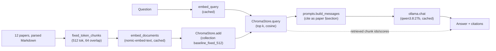

# 03 — Baseline: naive RAG from scratch, and where it fails

## What you will learn
- How to build a complete RAG (Retrieval-Augmented Generation) pipeline — chunk, embed, index,
  retrieve, generate, cite — in about 150 lines of plain Python, with no orchestration library.
- How **Chroma** (an embedded vector database — a program that stores text as high-dimensional
  vectors so "find the most similar text" becomes a fast nearest-neighbour search instead of a
  linear scan) stores a collection: ids, vectors, metadata, and the cosine similarity space.
- What one real question looks like end-to-end: the retrieved chunks, their similarity scores, and
  the cited answer, printed verbatim.
- The first three real rows on the scoreboard (k=3, k=5, k=10) sitting between the two chapter-02
  anchors — and what the gap between "naive RAG" and "oracle" retrieval tells you.
- A worked failure analysis: every question this pipeline got fully wrong, classified into
  *why* it failed, with pointers to which later chapter is designed to fix each class.
- The trade-off of hand-rolling this yourself versus reaching for a framework (chapters 08-10).

This is the pipeline every later experiment is compared against. Chapters 04-07 change one piece
of it at a time (chunking, retrieval, reranking) while chapter 03's prompt (`prompts.py`) stays
frozen, so a scoreboard difference is always attributable to the piece that changed.

## The pipeline



### 1. Chunking (`chunkers.py`)

```python
def fixed_token_chunks(doc: Document, size: int = 512, overlap: int = 64) -> list[Chunk]:
    """Split `doc.text` into fixed-size, overlapping windows of `size` tokens.

    Boundaries are computed in tiktoken's `cl100k_base` token space, then mapped
    back to character offsets by decoding token prefixes — decoding a *prefix of
    whole tokens* is always valid UTF-8 (unlike slicing raw bytes mid-token), so
    the character offsets line up exactly with `text[start:end]`.
    """
    text = doc.text
    token_ids = _encoding.encode(text)
    n_tokens = len(token_ids)
    step = size - overlap
    chunks: list[Chunk] = []
    start_tok = 0
    while start_tok < n_tokens:
        end_tok = min(start_tok + size, n_tokens)
        start_char = len(_encoding.decode(token_ids[:start_tok])) if start_tok else 0
        end_char = len(_encoding.decode(token_ids[:end_tok]))
        chunk_text = text[start_char:end_char]
        section = section_at(doc.sections, start_char)
        chunks.append(Chunk(id=chunk_id(doc.paper, start_char, end_char), paper=doc.paper,
                             section=section, text=chunk_text, start=start_char, end=end_char))
        if end_tok >= n_tokens:
            break
        start_tok += step
    return chunks
```

This is deliberately the dumbest possible chunker: it does not look at sentence or paragraph
boundaries at all, only a token count. `size=512, overlap=64` on all 12 papers (226,448 tokens
total) produces **509 chunks** — from 17 chunks for the shortest paper (Seven Failure Points, 6
pages) to 69 for the longest (the RAG survey, 21 pages). Every chunk still gets a `section` field
(the heading path active at its *start* offset) even though the chunker itself is
heading-unaware — many chunks near the top of a paper simply inherit the paper's title as their
"section" until the chunk boundary crosses into the first real heading. `CHUNKERS = {"fixed":
fixed_token_chunks}` is the registry chapter 04 will add `"recursive"`, `"sentence"`,
`"markdown"`, `"semantic"`, ... to.

### 2. The vector store (`stores.py`)

```python
class ChromaStore:
    def __init__(self, collection_name: str, persist_dir=None):
        self.client = chromadb.PersistentClient(path=str(self.persist_dir))
        self.collection = self.client.get_or_create_collection(
            collection_name, metadata={"hnsw:space": "cosine"}
        )

    def add(self, chunks: list[Chunk], embeddings: list[list[float]]) -> None:
        self.collection.add(
            ids=[c.id for c in chunks],
            embeddings=embeddings,
            documents=[c.text for c in chunks],
            metadatas=[{"paper": c.paper, "section": c.section, "start": c.start, "end": c.end}
                       for c in chunks],
        )

    def query(self, embedding, k=5, where=None) -> list[tuple[Chunk, float]]:
        result = self.collection.query(query_embeddings=[embedding], n_results=k, where=where,
                                        include=["documents", "metadatas", "distances"])
        # ... zip ids/documents/metadatas/distances back into (Chunk, 1 - distance) pairs
```

Chroma's `PersistentClient` needs no Docker container and no server process — it writes its
index straight to a directory (`data/indexes/chroma/`, gitignored: vector indexes are exactly the
kind of big, regenerable binary this tutorial does not commit). One **collection** is one named
table of vectors; we use one collection per experiment (`baseline_fixed_512`), so chapter 04's
chunking variants each get their own collection without clobbering this one. A chunk's `text` is
stored as Chroma's `document` field (used only for display — Chroma's own BM25 (Best Match 25)
is not used here, chapter 05 does that separately), and every other `Chunk` field (`paper`,
`section`, `start`, `end`) is stored as `metadata`, a flat dict Chroma indexes for exact-match
filtering (the `where=` parameter, unused in this chapter — chapter 05 filters by paper).
`metadata={"hnsw:space": "cosine"}` tells Chroma's HNSW (Hierarchical Navigable Small World, the
approximate-nearest-neighbour index Chroma builds under the hood) to compare vectors by cosine
distance rather than its default L2 (Euclidean); `query()` returns `1 - distance` so 1.0 means a
perfect match, consistent with how everyone talks about cosine *similarity*.

### 3. The prompt (`prompts.py`) — frozen from here on

```python
SYSTEM_PROMPT = (
    "Answer only from the provided excerpts. Cite as [paper_short_name §section]. "
    "If the excerpts do not contain the answer, say: I cannot answer this from the "
    "provided documents."
)

def build_messages(question: str, chunks: list[tuple[str, str, str]]) -> list[dict]:
    context = format_context(chunks)  # "[short_name §section]\n<text>" per chunk, blank-line joined
    user = f"Excerpts:\n{context}\n\nQuestion: {question}"
    return [{"role": "system", "content": SYSTEM_PROMPT}, {"role": "user", "content": user}]
```

Every later retrieval experiment (chunking, hybrid search, reranking, query rewriting) calls this
same function with a different list of `(short_name, section, text)` triples. If a later
scoreboard row's correctness changes, it changed because retrieval handed the model a different
set of excerpts — not because the instructions changed.

### 4. Wiring it together (`baseline.py`)

```python
def retrieve(question: str, k: int, store: ChromaStore) -> list[Chunk]:
    query_embedding = ollama.embed_query(question)
    return [chunk for chunk, _score in store.query(query_embedding, k=k)]

def answer(question: str, retrieved: list[Chunk]) -> tuple[str, list[str]]:
    triples = _as_triples(retrieved)          # (short_name, section, text)
    reply = ollama.chat(build_messages(question, triples), max_tokens=384)
    contexts = [f"[{short_name}] {text}" for short_name, _section, text in triples]
    return reply, contexts
```

`index`, `ask`, and `eval` (below) are the three Typer subcommands; `evaluate_run` from chapter 02
is called with `retrieve_fn`/`answer_fn` built from exactly these two functions, so the CLI's
interactive `ask` and the batch `eval` run the identical retrieval and generation code path.

## One real question, end to end

`uv run python -m rag_tutorial.baseline ask "What specific loss function does ColBERTv2 use to
distill cross-encoder scores into the ColBERT architecture?"` — real output:

```
Question: What specific loss function does ColBERTv2 use to distill
cross-encoder scores into the ColBERT architecture?

                                retrieved (k=5)
┏━━━━━━┳━━━━━━━━━━━━━━━━━━┳━━━━━━━━━━━━┳━━━━━━━━━━━━━━━━━━━━━━━━━━━━━━━┳━━━━━━━┓
┃ rank ┃ chunk id         ┃ paper      ┃ section                       ┃ score ┃
┡━━━━━━╇━━━━━━━━━━━━━━━━━━╇━━━━━━━━━━━━╇━━━━━━━━━━━━━━━━━━━━━━━━━━━━━━━╇━━━━━━━┩
│    1 │ 88965927a68a8656 │ 2112.01488 │ ColBERTv2: Effective and ...  │ 0.771 │
│    2 │ d9bbc470c22492ca │ 2112.01488 │ ColBERTv2: Effective and ...  │ 0.745 │
│    3 │ c4d3fe7efa6955e5 │ 2112.01488 │ ColBERTv2: Effective and ...  │ 0.706 │
│    4 │ c82f922c61ce69a6 │ 2112.01488 │ ColBERTv2: Effective and ...  │ 0.701 │
│    5 │ 0412cc3573d7999b │ 2112.01488 │ ColBERTv2: Effective and ...  │ 0.691 │
└──────┴──────────────────┴────────────┴───────────────────────────────┴───────┘

Answer:
ColBERTv2 uses **KL-Divergence loss** to distill the cross-encoder's scores into
the ColBERT architecture.
```

All five retrieved chunks came from the right paper (2112.01488, ColBERTv2) and none from any
other — a genuinely easy single-hop question, and the naive pipeline handled it cleanly, citing
correctly and matching the golden answer exactly. Every retrieved chunk's `section` prints as the
paper's own title, because this particular chunk sits early in the paper, before the chunker
crosses the first `##`-level heading — a visible, honest artifact of a chunker that only counts
tokens (see "Advantages and disadvantages" below).

## The k sweep

`uv run python -m rag_tutorial.baseline eval` runs k=5 (the primary anchor,
`03_naive_fixed_512_k5`), then k=3 and k=10, all on the 27-question `test` split:

| experiment | hit@5 | recall@5 | MRR | nDCG@10 | correctness | faithfulness | unanswerable-abstain | LLM calls/q | s/q |
|---|---|---|---|---|---|---|---|---|---|
| 03_naive_fixed_512_k3 | 0.391 | 0.283 | 0.290 | 0.316 | 0.370 | 0.911 | 1.000 | 1.000 | 0.274 |
| **03_naive_fixed_512_k5** | **0.478** | **0.370** | **0.307** | **0.349** | **0.435** | **0.937** | **1.000** | **1.000** | **0.006** |
| 03_naive_fixed_512_k10 | 0.478 | 0.370 | 0.316 | 0.366 | 0.435 | 0.956 | 1.000 | 1.000 | 0.004 |

(The `hit@5`/`recall@5` columns are the scoreboard's fixed columns; for the k=3 run they are
computed over only the 3 chunks that were actually retrieved, so they read low not because
retrieval got worse but because there were fewer chances to hit — `s/q` also collapses to
near-zero for k=5/k=10 here because a second run of `eval` reused the disk cache almost
entirely, see "Everything is cached" in `specs/COMMON.md`; the *first* run's `llm.py` cache
stats show real work: 39 cache misses / 131s at k=5, 76 misses / 243s at k=3, 113 misses / 397s
at k=10 — more retrieved chunks means longer contexts, which means longer judge and generation
calls (LLM (Large Language Model) calls), which is exactly the "cost" a bigger k buys.) Going from k=3 to k=5 helps everything;
going from k=5 to k=10 only nudges nDCG@10 and MRR very slightly while paying for meaningfully
longer prompts — the extra 5 chunks past rank 5 rarely contain evidence this golden set's
questions did not already have covered. **k=5 is the anchor this chapter reports on the
scoreboard.**

## What changed on the scoreboard

| experiment | chapter | hit@5 | recall@5 | MRR | nDCG@10 | correctness | faithfulness | unanswerable-abstain | LLM calls/q | s/q |
|---|---|---|---|---|---|---|---|---|---|---|
| **02_no_retrieval** | **02** | **0.000** | **0.000** | **0.000** | **0.000** | **0.174** | **1.000** | **1.000** | **1.000** | **0.000** |
| **03_naive_fixed_512_k5** | **03** | **0.478** | **0.370** | **0.307** | **0.349** | **0.435** | **0.937** | **1.000** | **1.000** | **0.006** |
| **02_oracle** | **02** | **1.000** | **0.988** | **1.000** | **1.000** | **0.543** | **0.865** | **1.000** | **1.000** | **0.000** |

Naive RAG lands exactly where chapter 02 predicted a real retriever should: strictly between
no-retrieval (0.174) and oracle (0.543) on correctness, closing about **63% of the gap** between
them ((0.435-0.174)/(0.543-0.174) ≈ 0.63) using only a hand-rolled fixed-size chunker and flat
top-5 cosine search. Naive RAG's faithfulness (0.937) is actually *higher* than oracle's own
(0.865), which looks backwards until you remember faithfulness only asks "is every claim in the
answer supported by the given context," not "is the context correct" — oracle sometimes hands the
model two long, dense evidence quotes for a multi-hop question and the model volunteers a
connecting claim the judge cannot verify word-for-word in either quote; naive RAG's shorter 512-token chunks, when they do contain the
answer, tend to produce shorter, more conservative answers the judge can verify claim-by-claim.
`unanswerable-abstain` stays at a perfect 1.0 — this run never hallucinated an answer to one of
the 6 unanswerable test questions, i.e. **0 examples of failure class (d)** below.

One concrete success example, from the k-sweep run above: `single_hop_000` ("what human input
does Ragas allow users to avoid") — hit@5 = 1.0, correctness = 1.0, cited `[ragas §Abstract]`
correctly. One concrete failure example (detailed below): `single_hop_006`, where the exact
evidence chunk *was* retrieved (hit@5 = 1.0) yet the model refused to answer anyway.

## Failure analysis (`runs/03_naive_fixed_512_k5/analysis.md`)

Every one of the 9 questions judged fully wrong (`correctness = 0`, out of 27 test questions),
classified by cause:

| class | count | addressed by |
|---|---:|---|
| (a) retrieval miss — evidence not in top 5 | 6 | ch. 04 (chunking) + ch. 05 (hybrid search) |
| (b) generation/reading failure — evidence retrieved, answer still wrong | 3 | ch. 07 (reranking, ordering) |
| (c) chunk-boundary split | 0 (see analysis for why) | ch. 04 (chunk size, small-to-big) |
| (d) unanswerable answered anyway (hallucination) | 0 | ch. 07 / ch. 13 |
| (e) judge error (I disagree) | 0 | ch. 13 |

Two worked examples (full write-up, with the model's actual output, in `analysis.md`):

- **Retrieval miss** (`single_hop_008`): *"According to the survey, what specific mechanism does
  the ITERRETGEN model use..."* — the evidence sentence exists in the RAG survey, but none of the
  5 retrieved chunks covered it; a single dense query embedding of the whole question lost to
  chunks about other named methods in the same 21,000-token survey.
- **Generation/reading failure** (`single_hop_006`): *"In the FEVER task analysis, what
  percentage of cases had the top retrieved document from a gold article?"* — the exact evidence
  chunk (*"...71% of cases"*) **was** retrieved at hit@5 = 1.0, and the model still answered *"I
  cannot answer this from the provided documents."* The fact was in the context window; the model
  declined to use it.

This table is the reason chapters 04-07 exist: chapter 04 attacks class (a)/(c) by changing how
text is cut into chunks in the first place; chapter 05 attacks class (a) by adding BM25 (a
keyword-matching retrieval algorithm) alongside dense search, so a literal term like "ITERRETGEN"
that a dense embedding under-weights still gets found; chapter 07 attacks class (b) by reranking
the already-retrieved chunks so the single most relevant one is unambiguously first, and by
trying query rewriting for multi-hop questions that need two separate searches, not one.

## Advantages and disadvantages of a hand-rolled pipeline

| | hand-rolled (this chapter) | a framework (LangChain/LlamaIndex/Haystack, ch. 08-10) |
|---|---|---|
| **Advantages** | Every line is visible and debuggable — the `analysis.md` above required nothing but reading `predictions.jsonl`, no framework internals to trace through. Zero dependency surface beyond `chromadb`/`tiktoken`/`httpx`. Total control over the prompt, chunking, and caching (this tutorial's whole-project disk cache would be awkward to bolt onto most frameworks' own retriever abstractions). | Battle-tested retriever/splitter implementations (parent-document, sentence-window, auto-merging) that would each be real engineering effort to hand-roll well. Consistent abstractions once you need to swap 4-5 pieces at once. Built-in integrations (loaders, evaluators, agents). |
| **Disadvantages** | Every feature chapters 04-07 add (hybrid search, reranking, query rewriting) is code *you* write and test — chapter 04's semantic chunker, chapter 05's Reciprocal Rank Fusion, are each their own implementation, not a one-line swap. No community-vetted edge-case handling (encoding quirks, retry logic beyond what `llm.py` already does). | An abstraction to learn before you can be productive; a bug can be in *your* code or *the framework's*, and framework version churn (this tutorial's own research notes had to verify current APIs rather than trust memory) is a real, recurring cost. Harder to point to "the exact 150 lines that run" the way this chapter can. |
| **When to choose which** | Learning how RAG actually works, a small and stable pipeline, or when you need something a framework does not expose (this tutorial's disk-cached, git-committed reproducibility). | A production system that needs several of parent-document retrieval + hybrid search + reranking + agents at once, or a team that values a shared abstraction over bespoke code. |

## Troubleshooting

| symptom | cause | fix |
|---|---|---|
| `judge_faithfulness` crashes with `JSONDecodeError: Unterminated string` | the claims-splitting judge call truncated mid-JSON because `max_tokens` was too small for a long, multi-paper answer (seen at k=10 on `global` questions) | fixed in this chapter: `evaluate.py`'s two internal judge calls now use `max_tokens=1536`/`2048`; since this changes the `ollama.chat` cache key, the chapter-02 anchors were re-run (numbers unchanged) |
| `ChromaStore(...).reset()` raises on the very first run | `delete_collection` was called before the collection existed | not actually reachable here — `__init__` always calls `get_or_create_collection` first, so the collection exists by the time `reset()` runs; if you see this, check you did not construct `ChromaStore` with two different `persist_dir`s |
| a chunk's `section` is just the paper title, not a real heading | `fixed_token_chunks` only counts tokens; a chunk that starts before the paper's first heading (or before its next heading) inherits whatever section was open at its *start* offset | expected for this chapter's naive chunker; chapter 04's Markdown-structure chunker starts and ends chunks at heading boundaries specifically to fix this |
| `hit@5` looks unfairly low for the k=3 experiment | `hit@5`/`recall@5` are computed over however many chunks `retrieve_fn` actually returned, and k=3 only returns 3 | compare experiments by their own `k`, or look at `nDCG@10`/`MRR`, which account for rank regardless of how many chunks were retrieved |

## Exercises

1. Run `just baseline-ask "<a global question from data/golden/qa.jsonl>"` yourself and check
   whether the 5 retrieved chunks span more than 2 of the papers the reference answer cites —
   this is the same structural limitation `global_000` hits in the failure analysis.
2. Read `runs/03_naive_fixed_512_k5/predictions.jsonl` for one of the 8 questions judged `0.5`
   (partially correct) and decide, in your own words, whether you would classify it into one of
   the five failure classes above or whether it needs a sixth.
3. Reduce `size` to 128 tokens and re-run `just baseline-index && just baseline-eval` (a fresh
   collection, since `COLLECTION_NAME` is fixed — pass a different name if you want to keep both).
   Does class (c) — chunk-boundary splits — appear now that chunks are much shorter?
4. `chunk_covers_quote` (chapter 02) forgives a quote cut short by up to 20% of its tokens. Pick
   one retrieved chunk from this chapter's run and manually check whether it would still "cover"
   its evidence quote if that tolerance were tightened to 95%.

---
Previous: [02_corpus_and_golden_set.md](02_corpus_and_golden_set.md) · Next: [04_chunking.md](04_chunking.md)
