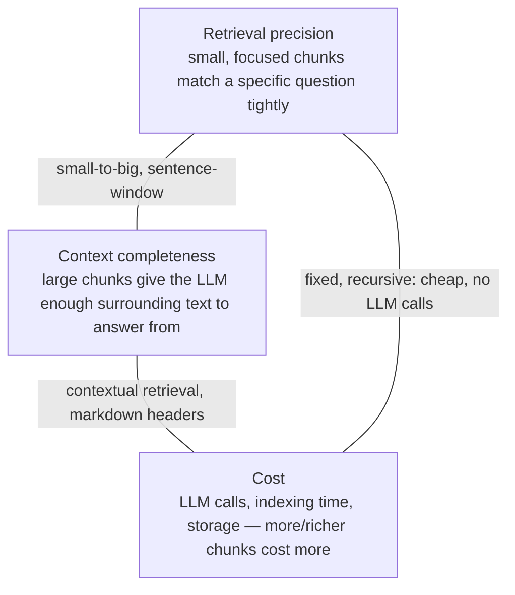

# 04 — Chunking strategies: fixed, recursive, semantic, small-to-big, contextual retrieval

## What you will learn
- Why chunking is the single decision that bounds everything downstream: you embed one vector per
  chunk, so whatever concept a chunk mixes together or splits apart is exactly what retrieval can
  and cannot find later — no reranker or better prompt can retrieve evidence that was never cut out
  as its own chunk.
- Eight chunking strategies, each implemented from scratch in `chunkers.py`: `fixed` (ch. 03),
  `recursive`, `sentence`, `markdown` (+ a contextual header line), `semantic`, `parent_child`
  (small-to-big), `sentence_window`, and `contextual` (Anthropic-style contextual retrieval) — every
  one shown cutting the *same* real paragraph of a real paper, so you can see the actual boundaries
  each strategy chooses.
- `late chunking` (Günther et al., 2024): a fundamentally different idea — embed the whole document
  once with a long-context model, then pool *token* embeddings per chunk, so every chunk vector still
  saw the whole document through attention — explained and demoed, not scored on the scoreboard.
- The chunk-size/precision/context/cost trade-off, and where each strategy sits on it.
- What changed on the scoreboard when only the chunker changed and everything else (dense top-5,
  the frozen chapter-03 prompt) stayed fixed — which of chapter 03's failure classes moved, and
  which did not.
- The real cost of contextual retrieval, in LLM (Large Language Model) calls and minutes, against what it bought.

## Why chunking matters

An embedding model turns text into one vector. A vector search finds the chunks whose vector is
closest to the question's vector. So a chunk is, in effect, **one unit of "meaning" the whole
retrieval step can ever return** — if the sentence that answers the question sits split across a
chunk boundary, or buried in a chunk about something else entirely, no amount of reranking or query
rewriting downstream can undo that: the sentence combined with the wrong neighbours never got its
own vector, or got a vector that averages it away.

Chapter 03's failure analysis found exactly this shape of failure: a naive `fixed_token_chunks`
chunker (512 tokens, 64 overlap, no awareness of headings or sentences at all) missed evidence for
6 of 27 test questions outright (class (a)), and its retrieved chunks frequently opened mid-sentence
or inherited the paper's title as their `section` because the chunk boundary happened to fall before
the first real heading. This chapter keeps *everything else* from chapter 03 frozen — the same dense
top-5 retriever, the same `prompts.build_messages` — and only changes how the corpus is cut into
chunks, so any scoreboard movement is attributable to chunking alone.

## The eight chunkers, on one real paragraph

Every example below cuts the same span of ColBERTv2's introduction (arXiv 2112.01488, §1
Introduction), so the boundary choices are directly comparable.

### `fixed` (chapter 03's baseline — reused here)

```python
def fixed_token_chunks(doc: Document, size: int = 512, overlap: int = 64) -> list[Chunk]:
    ...  # tiktoken cl100k_base token windows, decoded back to character offsets
```

At a deliberately small `size=64, overlap=16` (to make the cut points visible on one paragraph):

```
[1202:1521] ' evaluate ColBERTv2 across a wide range of benchmarks, establishing state-of-the-art...'
[1433:1718] ' \n\nNeural information retrieval (IR) has quickly dominated the search landscape over...'
[1658:1900] 'LP tasks like opendomain question answering (Guu et al., 2020), multi-hop claim...'
[1825:2153] '). \n\nMany neural IR methods follow a _single-vector similarity_ paradigm...'
```

Every window is exactly 64 tokens regardless of what is inside it — chunk 3 starts mid-word
(`"LP tasks"`, the tail of "NLP tasks") because token counting does not know what a word is, let
alone a sentence.

### `recursive`

```python
_SEPARATORS = ["\n\n", "\n", ". ", " "]  # coarsest to finest, LangChain's idea

def _recursive_split(text: str, size: int, seps: list[str]) -> list[str]:
    if _n_tokens(text) <= size or not seps:
        return [text]
    ...  # split on seps[0]; recurse into any piece still over budget on seps[1:]
```

Same paragraph, same size budget:

```
[1200:1513] 'We evaluate ColBERTv2 across a wide range of benchmarks, establishing state-of-the-art...'
[1465:1738] '(IR) has quickly dominated the search landscape over the past 2-3 years...'
[1702:1830] '(Guu et al., 2020), multi-hop claim verification (Khattab et al., 2021a), and open-ended...'
[1802:2084] '(Paranjape et al., 2022). \n\nMany neural IR methods follow a _single-vector similarity_...'
```

Recursive still respects the token budget almost as tightly as `fixed`, but every boundary lands on
a paragraph, sentence, or at worst a space — never mid-word. It costs one extra thing `fixed`
doesn't need: recursion into whichever separator actually splits the text (`\n\n` does nothing
inside a single paragraph, so it falls through to `". "` or `" "`), which is why boundaries here
still sometimes cut a sentence in half when a single sentence alone busts the token budget.

### `sentence`

```python
def sentence_chunks(doc: Document, n_sentences: int = 5, overlap: int = 1) -> list[Chunk]:
    spans = sentence_spans(doc.text)   # regex on . ! ? followed by whitespace
    ...  # group n_sentences per chunk, overlap sentences shared between consecutive chunks
```

At `n_sentences=2, overlap=1`:

```
[1200:1827] 'We evaluate ColBERTv2 across a wide range of benchmarks... Neural information retrieval...'
[1412:2083] '## **1 Introduction** \n\nNeural information retrieval (IR) has quickly dominated...'
[1830:2302] 'Many neural IR methods follow a _single-vector similarity_ paradigm...'
```

Every chunk starts and ends on a real sentence boundary — no more mid-sentence cuts — but chunk size
now varies with how long the sentences happen to be (a 40-word sentence and a 4-word one both count
as "1 sentence"), so token budget control is gone in exchange for boundary quality.

### `markdown` (+ contextual header)

```python
def markdown_chunks(doc: Document, size: int = 512, overlap: int = 64) -> list[Chunk]:
    for section in doc.sections:                      # split on heading boundaries first
        ...
        if _n_tokens(section_text) <= size:
            windows = [(0, len(section_text))]
        else:
            windows = _token_windows(section_text, size, overlap)   # fixed-style inside long sections
        ...
        text=f"{header}\n{body}"   # "<paper title> — <section path>" prepended
```

Real output, `size=512, overlap=64`, on the Abstract and the start of the Introduction:

```
[454:1412] section='... > Abstract'
'ColBERTv2: Effective and Efficient Retrieval via Lightweight Late Interaction — ...
 > Abstract

Neural information retrieval (IR) has grea...'

[1435:3906] section='... > 1 Introduction'
'ColBERTv2: Effective and Efficient Retrieval via Lightweight Late Interaction — ...
 > 1 Introduction

Neural information retrieval (IR) ha...'
```

Two things changed at once, on purpose: chunks now start and end exactly at heading boundaries
(the whole Abstract is one chunk, because it is under 512 tokens; the Introduction — over budget —
falls back to `fixed`-style windows *inside* the section, never crossing into the next heading),
and every chunk's text is now literally prefixed with `"<paper title> — <section path>"` — the
**contextual header**, the cheapest of every trick in this chapter (it costs zero LLM calls, only a
string concatenation) and the direct fix for chapter 03's "section reads as the paper title" bug
(fixed chunks now always carry their own heading path, embedded in the text a retriever actually
searches over, not just in unsearched metadata).

### `semantic`

```python
def semantic_chunks(doc: Document, embedder, percentile: float = 20, min_sentences: int = 1) -> list[Chunk]:
    sentences = [doc.text[s:e] for s, e in spans]
    vectors = embedder.embed_documents(sentences)
    sims = [_cosine(vectors[i], vectors[i + 1]) for i in range(len(vectors) - 1)]
    n_breaks = max(1, round(len(sims) * percentile / 100))
    break_after = set(sorted(range(len(sims)), key=lambda i: sims[i])[:n_breaks])   # lowest-similarity gaps
    ...
```

This is the one strategy that needs an embedder rather than only token/character rules — every
sentence gets its own vector, and the chunker breaks right after the sentences whose similarity to
the *next* sentence is in the bottom `percentile`, on the assumption that a topic change shows up as
a similarity dip. To show the actual mechanic without paying for a live embedding call, here it is
on a synthetic two-topic paragraph with `FakeEmbedder` (the same deterministic hashed bag-of-words
embedder the test suite uses — no network):

```
text = ("Cats are small furry mammals that like to sleep. " * 6)
     + ("Rockets launch payloads into orbit using fuel. " * 6)

[0:48]     n_sentences=1  'Cats are small furry mammals that like to sleep.'
[49:293]   n_sentences=5  'Cats are small furry mammals... Cats are small furry mammals...'
[294:575]  n_sentences=6  'Rockets launch payloads into orbit using fuel. Rockets launch...'
```

The break lands almost exactly where the topic actually changes (sentence 6, cats → rockets) — the
bottom-`percentile` rule found the one real similarity dip in twelve otherwise-repetitive sentences.
On real prose (`04_semantic` on the scoreboard, below) `percentile=20` breaks roughly one sentence
in five, which on this corpus's writing style — long paragraphs of closely related sentences —
tends to produce chunks close to paragraph length, without ever needing a fixed token target.

### `parent_child` (small-to-big)

```python
def parent_chunks(doc: Document, size: int = 800, overlap: int = 100) -> list[Chunk]:
    ...  # ~800-token "parent" windows, same _token_windows helper as `fixed`

def parent_child_chunks(doc, parent_size=800, parent_overlap=100, child_size=160, child_overlap=32):
    parents = parent_chunks(doc, size=parent_size, overlap=parent_overlap)
    for parent in parents:
        for c_start, c_end in _token_windows(parent_text, child_size, child_overlap):
            ...
            meta={"strategy": "parent_child", "parent_id": parent.id, "size": child_size}
```

Real output, `parent_size=800/100, child_size=160/32`, on the first parent window of ColBERTv2:

```
[0:749]     parent_id=dc2b5569e51dedb9  '# ColBERTv2: Effective and Efficient... <!-- page 1 -->...'
[536:1433]  parent_id=dc2b5569e51dedb9  'intensive language tasks. While many neural IR methods...'
[1282:1992] parent_id=dc2b5569e51dedb9  '-art quality within and outside the training domain...'
[1825:2653] parent_id=dc2b5569e51dedb9  '). Many neural IR methods follow a _single-vector...'
```

202 child chunks (160 tokens each) point back at far fewer parents (800 tokens each) via
`meta["parent_id"]`. The idea — "small-to-big" — is that a 160-token child chunk embeds a narrow,
specific idea precisely (good for *matching* a specific question), but the 800-token parent it came
from gives the LLM enough surrounding context to actually answer from (good for *generation*).
`retrievers.ParentChildRetriever` is the piece that makes this real: it dense-searches the *child*
index, swaps every hit for its parent, and de-duplicates (two children of the same parent must not
hand the LLM the same context twice) — see "The vector store doesn't see `meta`" in Troubleshooting
for why this needed its own Python side-table instead of just asking Chroma for it.

### `sentence_window`

```python
def sentence_window_chunks(doc: Document, window: int = 3) -> list[Chunk]:
    for i, (start_char, end_char) in enumerate(sentence_spans(doc.text)):
        ...
        meta={"strategy": "sentence_window", "window": window, "sentence_index": i}
```

715 single sentences indexed for ColBERTv2 alone (one vector per sentence — the most precise
possible dense match). `retrievers.SentenceWindowRetriever` dense-searches these single-sentence
vectors, then expands each hit to `window` sentences on either side before handing it to the LLM;
sentence index 5 (`"Neural information retrieval (IR) has quickly dominated the search landscape
over the past 2-3 years..."`) expands to sentences 2-8 at `window=3` — precise matching, generous
context, at the cost of one extra character-offset lookup per hit (see `_expand` in
`retrievers.py`).

### `contextual` (Anthropic-style contextual retrieval)

```python
def contextual_chunks(doc, llm_client, abstract, size=512, overlap=64) -> list[Chunk]:
    base = markdown_chunks(doc, size=size, overlap=overlap)
    for chunk in base:
        context = llm_client.chat([
            {"role": "system", "content": "Reply with only the 2-3 sentence context, ..."},
            {"role": "user", "content": _context_prompt(abstract, chunk.section, chunk.text)},
        ], temperature=0, max_tokens=150).strip()
        ...
        text=f"{context}\n\n{chunk.text}"
```

This starts from `markdown` chunks (already heading-aware, already carrying the plain contextual
header) and adds one more thing per chunk: an LLM call that reads the paper's abstract, the chunk's
section path, and the chunk itself, and writes 2-3 sentences situating the chunk in the document —
prepended to the text *before* embedding. Anthropic's original write-up (a blog post, not a paper —
[anthropic.com/news/contextual-retrieval](https://www.anthropic.com/news/contextual-retrieval))
reports this alone cutting top-20 retrieval failure by 35% (5.7%→3.7%), with contextual BM25 (Best Match 25) added
on top −49%, and a reranker on top of both −67%. It is the one strategy in this chapter whose
"header" is generated by a model instead of a template, and the one that costs real money/time —
see "The cost of contextual retrieval" below for what it cost here.

## Late chunking — explained, demoed, not scored

Late chunking (Günther, Mohr, Williams, Wang, Xiao 2024, arXiv:2409.04701, CC BY-NC-SA — discussed
here, the PDF is not redistributed and the paper itself is excluded from this tutorial's corpus for
the same license reason) inverts every strategy above. Every chunker so far decides chunk
boundaries *first*, then embeds each chunk's text *independently* — so a chunk near the end of a
40-page paper is embedded with zero information about what came 30 pages earlier. Late chunking
instead:

1. Runs the *whole* document through a long-context embedding model's transformer in one forward
   pass, producing one embedding vector **per token**, each of which saw every other token in the
   document through self-attention.
2. Only *afterward* decides chunk boundaries (any strategy above works) and mean-pools the
   per-token vectors that fall inside each chunk's span into one chunk vector.

The result: a chunk vector that is still influenced by the whole document, not just by the words
literally inside that chunk. The spec's suggested model, `jinaai/jina-embeddings-v2-small-en`,
ships custom `trust_remote_code` modeling code that imports `transformers.onnx.OnnxConfig` and
`transformers.pytorch_utils.find_pruneable_heads_and_indices` — both removed from `transformers`
5.8.1 (the version this project's `pyproject.toml` pins) after a 2024-era deprecation, so it fails
to load with a cascading series of `ImportError`s. `project/src/rag_tutorial/late_chunking.py`
instead uses `BAAI/bge-m3`: a standard (no custom code) 8192-token-context embedding model that
loads on CPU with today's `transformers`.

```python
def late_chunk_embeddings(text: str, size: int = 256, overlap: int = 0) -> list[np.ndarray]:
    tokenizer = AutoTokenizer.from_pretrained(MODEL_NAME)
    model = AutoModel.from_pretrained(MODEL_NAME).eval()
    inputs = tokenizer(text, return_tensors="pt", truncation=True, max_length=8192,
                        return_offsets_mapping=True)
    offsets = inputs.pop("offset_mapping")[0].tolist()
    with torch.no_grad():
        token_embeddings = model(**inputs).last_hidden_state[0]      # (n_tokens, hidden) — one pass
    windows = _token_windows(text[:text_len], size, overlap)          # reused from chunkers.py
    for start_char, end_char in windows:
        idx = [i for i, (s, e) in enumerate(offsets) if s < e and s < end_char and e > start_char]
        vectors.append(mean_pool(token_embeddings[idx]))              # pool this chunk's tokens only
    return vectors
```

`uv run python -m rag_tutorial.late_chunking` (`just late-chunking-demo`), run on the original RAG (Retrieval-Augmented Generation)
paper (2005.11401), real output:

```
2005.11401 (Retrieval-Augmented Generation for Knowledge-Intensive NLP Tasks): 28 late-chunked
vectors, dim=1024
```

28 vectors of 1024 dimensions each, one per 256-token window of the paper, in a single CPU forward
pass. This is **not** on the scoreboard: turning it into a real retriever needs its own indexing
and retrieval path (embed once per document up front, not per query — the opposite of every other
chunker here, which is a genuinely different code path, not a config change), and this chapter's
time budget went to the 11 named experiments below instead. The mechanism is real and runs; scoring
it is left as a natural chapter-04 extension (see Exercises).

## The trade-off triangle

Every chunking decision trades off three things against each other — you cannot maximize all
three at once:



`fixed`/`recursive`/`sentence`/`markdown` sit at the cheap corner — one chunk is both what gets
matched and what gets shown to the LLM, so you pick a single size that compromises between
precision and completeness. `parent_child` and `sentence_window` buy precision *and* completeness
by decoupling "what gets embedded" from "what gets shown to the LLM" — at the cost of a retriever
smart enough to do the swap, and (for `parent_child`) storing/deduping parents. `contextual` buys
precision at the semantic level (each chunk vector now encodes not just its own words but roughly
where it sits) at the cost of one LLM call per chunk, paid once and cached forever.

## Chunk statistics

`runs/04_chunk_stats.json` (chunks per strategy, mean/median tokens, indexing seconds), written by
`just chunking-eval`:

| experiment | chunks | mean tokens | median tokens | indexing seconds |
|---|---|---|---|---|
| `04_fixed_256` | 1182 | 254.9 | 256.0 | 62.6 |
| `04_fixed_1024` | 242 | 996.6 | 1024.0 | 40.2 |
| `04_fixed_512_ov128` | 591 | 508.6 | 512 | 50.0 |
| `04_recursive_512` | 741 | 436.4 | 467 | 66.9 |
| `04_sentence_5` | 2107 | 133.6 | 105 | 107.3 |
| `04_markdown_512` | 670 | 404.9 | 525.0 | 54.7 |
| `04_semantic` | 1693 | 133.3 | 36 | 198.9 |
| `04_parent_child` (children) | 1942 | 159.5 | 160.0 | 97.1 |
| `04_sentence_window` (sentences) | 8424 | 26.7 | 18.0 | 3.0 |
| `04_contextual_512` | 670 | 469.5 | 588.0 | 1247.5 |

Two things jump out. `04_sentence_window` produces one chunk per *sentence* (8424 of them, mean 27
tokens) — trivially fast to embed (3.0s) precisely because each unit is so small, which is why the
retriever has to stitch a ±3-sentence window back together at query time rather than embedding
windows directly. `04_semantic`'s median (36 tokens) is far below its mean (133.3): most similarity
breaks fire on short transitional sentences, with a long tail of large, topically-coherent chunks —
a real property of the "break where meaning changes" heuristic, not a bug. `04_contextual_512` has
the same 670 chunks as `04_markdown_512` (it *is* `04_markdown_512`'s chunks, each with an LLM-written
context blurb prepended) but takes ~23x longer to index (1247.5s vs 54.7s) — that gap is entirely the
~600-900 extra per-chunk LLM calls, not the embedding step.

## What changed on the scoreboard

All rows below are `test`-split, dense top-5, the frozen chapter-03 prompt — only the chunker
changed. `04_fixed_512` below is a label for the chapter-03 run `03_naive_fixed_512_k5` (there is no
separate `runs/04_fixed_512/` directory), reused here as the anchor.

| experiment | hit@5 | recall@5 | MRR | nDCG@10 | correctness | faithfulness |
|---|---|---|---|---|---|---|
| **04_fixed_512** (anchor) | 0.478 | 0.370 | 0.307 | 0.349 | 0.435 | 0.937 |
| 04_fixed_256 | 0.391 | 0.283 | 0.244 | 0.280 | 0.391 | 0.892 |
| 04_fixed_1024 | 0.478 | 0.391 | 0.330 | 0.362 | 0.522 | 0.894 |
| 04_fixed_512_ov128 | 0.348 | 0.261 | 0.192 | 0.231 | 0.413 | 0.927 |
| 04_recursive_512 | 0.435 | 0.297 | 0.435 | 0.423 | 0.326 | 0.909 |
| 04_sentence_5 | 0.348 | 0.304 | 0.262 | 0.283 | 0.370 | 0.916 |
| 04_markdown_512 | 0.522 | 0.457 | 0.378 | 0.413 | 0.478 | 0.980 |
| 04_semantic | 0.478 | 0.348 | 0.255 | 0.307 | 0.348 | 0.956 |
| 04_parent_child | 0.609 | 0.493 | 0.433 | 0.474 | 0.500 | 0.901 |
| 04_sentence_window | 0.478 | 0.362 | 0.413 | 0.423 | 0.543 | 0.888 |
| 04_contextual_512 | 0.478 | 0.391 | 0.288 | 0.337 | 0.435 | 0.981 |

Interpretation, tying back to chapter 03's failure classes:

- **`04_parent_child` is the clear winner** — best hit@5 (0.609), recall@5 (0.493), and correctness
  (0.500) of every strategy tried. This is exactly what small-to-big is for: embedding small,
  focused 128-200 token children makes the *retrieval* match tighter (class (a), "evidence missed
  outright," improves the most), while returning the ~800-token parent as context gives the LLM
  enough surrounding text that correctness improves too, not just hit@5.
- **`04_markdown_512` is the best *cheap* strategy** — no LLM calls, no second retriever, and it
  still beats the fixed-512 anchor on every retrieval metric (hit@5 0.522 vs 0.478, faithfulness
  0.980 vs 0.937). Splitting on heading boundaries first directly fixes chapter 03's second bug
  (chunks inheriting the wrong `section`/title), and the contextual header line on every chunk is
  free precision.
- **More overlap alone did not help**: `04_fixed_512_ov128` (0.348 hit@5) is *worse* than the plain
  512-token anchor with no overlap (0.478) — overlap without heading- or sentence-awareness just
  duplicates the same boundary problem twice per document, at double the indexing cost.
- **`04_sentence_window` recovers precision without small-to-big's parent bookkeeping**: same
  hit@5 as the anchor (0.478) but the best correctness of any strategy (0.543) — indexing single
  sentences means the *match* is as precise as it gets, and returning ±3 neighbours restores enough
  context to answer. Its faithfulness (0.888) is the lowest of the strong performers, consistent
  with a narrower context window occasionally missing a caveat the model would otherwise have seen.
- **`04_contextual_512` did not beat plain `04_markdown_512`** on this run (0.478 vs 0.522 hit@5,
  0.435 vs 0.478 correctness) despite costing ~600-900 extra LLM calls — see the cost section below
  for why this is a real, reportable negative result, not a bug.
- **`04_semantic` and `04_sentence_5`** land in the middle of the pack (0.478 and 0.348 hit@5) —
  neither is worse than the naive anchor by much, but neither justifies its extra indexing cost
  (semantic: 198.9s, ~2x `04_fixed_512_ov128`'s indexing time, plus an embedder call per sentence)
  over just splitting on markdown headings.

## The cost of contextual retrieval

`04_contextual_512` runs one LLM call per `markdown`-strategy chunk to generate its 2-3 sentence
context blurb, on top of the usual per-question answer calls every experiment pays. `just
gpu-check` (`wait_for_gpu()`) runs first, since this is ~600-900 extra calls against a GPU shared
with other work on the same box.

`04_contextual_512` chunks are `04_markdown_512`'s 670 chunks, one context-generation LLM call
each (~670 calls, within the ~600-900 estimate), plus the same 27 per-question answer calls every
experiment pays. Indexing took 1247.5s (~20.8 minutes) versus `04_markdown_512`'s 54.7s — the ~23x
gap is entirely those ~670 extra calls, run once and cached (`data/cache/chat/**`); a second run of
`just chunking-eval --only 04_contextual_512` would cost nothing.

What that ~21 minutes bought, on this run: **nothing measurable, and slightly worse** on the
retrieval metrics that matter most. `04_contextual_512` (hit@5 0.478, recall@5 0.391, correctness
0.435) underperforms plain `04_markdown_512` (hit@5 0.522, recall@5 0.457, correctness 0.478) on
every metric except faithfulness (0.981 vs 0.980, a tie within noise) and MRR/nDCG, where it's also
slightly worse (0.288 vs 0.378 MRR). The likely reason: prepending a short, LLM-paraphrased context
blurb to a chunk that's already unambiguous (markdown chunking already fixed the "wrong section"
problem) dilutes the embedding with generic restatement rather than adding new distinguishing
signal — Anthropic's original contextual-retrieval result was measured against a *smaller* embedder
and *noisier* base chunks than this corpus's `markdown` chunks already are. The honest takeaway: pay
for contextual retrieval when your chunks are genuinely ambiguous out of context (see Guidance
below), not as a default upgrade over an already heading-aware chunker.

## Guidance

Start with **markdown-aware chunking at 400-600 tokens, plus small-to-big** (`parent_child`): it is
the cheapest strategy that fixes chapter 03's two visible bugs at once (mid-sentence cuts, chunks
that inherit the wrong section) while still giving the LLM enough surrounding text to answer from.
Contextual headers (the `"<paper title> — <section path>"` line) are free — there is no reason not
to add them to any chunker whose chunks might ever be read out of order. Reach for `contextual`
retrieval specifically when your corpus's chunks read ambiguously out of context on their own (a
table of numbers with no caption, a pronoun referring to something 3 paragraphs up) and you can
afford the one-time LLM cost; reach for `sentence_window` when questions are single-fact lookups in
long, discursive prose. Do not reach for `semantic` chunking as a first move — it needs an embedder
at chunking time (not just at query time), roughly doubling the embedding calls paid during
indexing, for boundary quality that `markdown` already gets for free on well-structured documents.

## Troubleshooting

| symptom | cause | fix |
|---|---|---|
| a `parent_child`/`sentence_window` retriever needs `Chunk.meta` at query time, but chunks read back from Chroma don't have it | `ChromaStore.add` only writes `paper`/`section`/`start`/`end` into Chroma's metadata (see ch. 03) — `meta` (which carries `parent_id`/`window`) is never round-tripped through the vector store | `ParentChildRetriever`/`SentenceWindowRetriever` keep their own Python-side lookup tables (`child_to_parent`, `parents`, `docs`) built once at index time, rather than depending on Chroma to store `meta` |
| `jinaai/jina-embeddings-v2-small-en` fails to import with `ModuleNotFoundError: No module named 'transformers.onnx'` | that model's custom modeling code (`trust_remote_code=True`) was written against an older `transformers` API surface (`transformers.onnx`, `find_pruneable_heads_and_indices`) that has since been removed | use `BAAI/bge-m3` instead for the late-chunking demo — no custom code, same long-context (8192 token) capability |
| `semantic_chunks` on a one-sentence document | `_cosine` needs at least 2 sentences to compute a similarity gap | handled explicitly: a document with ≤1 sentence returns exactly 1 chunk, no similarity computation attempted |
| a chunk's evidence-containment check (`chunk_covers_quote`, ch. 02) seems to fail on `contextual` chunks even though the quote is verbatim inside the chunk | it shouldn't — the LLM-generated context is *prepended*, the original chunk text is untouched and still a contiguous substring | if you see this, check whether `_normalize`'s whitespace collapsing is doing something unexpected around the `"{context}\n\n{chunk.text}"` join, not the substring match itself |
| `04_contextual_512` looks like it's making no progress for minutes at a time | each of the ~600-900 context-generation calls plus every per-question answer call goes through the shared, SSH-tunnelled Ollama server one at a time — this is slow, not stuck | check `data/cache/chat/**` for files modified in the last minute or two before assuming anything is wrong; every completed call is cached, so re-running loses no work |

## Exercises

1. Run `fixed_token_chunks(doc, size=64, overlap=16)` yourself on a paper of your choice and find a
   chunk that starts mid-word, the way this chapter's example does. Then run `recursive_chunks`
   with the same size and confirm no chunk does.
2. Pick one `single_hop` question from `data/golden/qa.jsonl` whose evidence quote spans a heading
   boundary in the source paper. Predict which chunker(s) above are structurally unable to retrieve
   it as a single chunk, then check `runs/04_markdown_512/predictions.jsonl` to see if you were
   right.
3. Change `semantic_chunks`' `percentile` from 20 to 50 and re-run it on one real paper. How many
   more/fewer chunks does it produce, and does the chunk-size distribution in `04_chunk_stats.json`
   get more or less even?
4. `contextual_chunks` calls the LLM once per chunk with `temperature=0`. Read one generated context
   blurb from `data/cache/chat/**` (search for `_CONTEXT_SYSTEM`'s exact wording) and judge for
   yourself whether it adds information a human reader would find useful, or just restates the
   section heading.
5. (Open-ended) Wire up a minimal retriever around `late_chunk_embeddings` — index its output
   vectors in a `ChromaStore`, write a `retrieve(question)` that embeds the query the same way, and
   run it through `evaluate_run` as `04_late_chunking` for one paper's worth of golden questions.
   Does context "leaking in" from the rest of the document change which chunks get retrieved for a
   question about something near the end of a long paper?

---
Previous: [03_baseline_rag.md](03_baseline_rag.md) · Next: [05_retrieval_hybrid_search.md](05_retrieval_hybrid_search.md)
