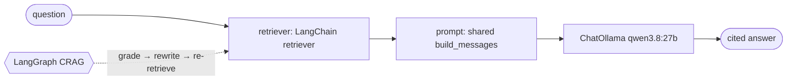
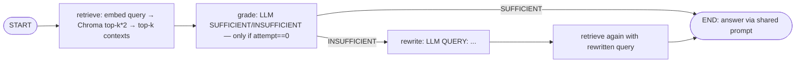

# 08 — LangChain & LangGraph: the Same Pipeline in a Framework, Plus Agentic RAG

## What you will learn

- What **LangChain** is — **Runnables** (small steps with one shared call shape), **LCEL** (LangChain Expression Language — the `|` pipe operator that chains steps), and the ecosystem of ready-made integrations — and what it looks like next to our ~150-line chapter-03 code.
- The **retriever zoo**: one-paragraph explanations of the vector, parent-document, multi-query, ensemble (dense + BM25 (Best Matching 25)) and compression retrievers, and which of our earlier chapters (03, 04, 05, 07) each one corresponds to.
- What **LangGraph** adds — **state** (the shared notepad every step reads and writes), **nodes** (the steps), **edges** (the rules for what runs next) — and why an agentic loop (a loop that decides for itself whether to try again) is naturally a graph, not a straight line.
- A **real trace** of one golden question through our Corrective-RAG (CRAG) graph: retrieve → grade → rewrite → retrieve → answer.
- **What changed on the scoreboard**: all six framework rows next to our chapter-07 best and the three anchors — including the honest story that the framework ensemble+rerank *loses* to our own chapter-07 pipeline, and why.
- When to reach for LangChain versus writing it yourself, and troubleshooting for the three traps we actually hit (deprecation warnings, the `langchain-classic` split, Ollama JSON mode in `with_structured_output`).

All numbers below come from `project/runs/08_findings.md` and the committed `project/runs/08_*/metrics.json`, on the test split (n=27 questions: 8 single-hop, 7 multi-hop, 5 global, 4 unanswerable, 3 comparative; 23 carry evidence, so hit/recall are averaged over 23). No new experiments were run for this chapter.



---

## 1. What LangChain is (in one page)

**LangChain** is the most popular open-source framework for building LLM (Large Language Model) applications. Three ideas carry most of it:

- **Runnables.** Every building block — a chat model, a retriever, a prompt template, a parser — implements one shared call shape (`invoke` / `batch` / `stream`: give it an input, get an output). Because the shape is uniform, blocks snap together without glue code.
- **LCEL (`|`).** The LangChain Expression Language is just the pipe operator: `chain = retriever | format_docs | prompt | model | parser`. Reading left to right tells you the data flow. Each `|` hands the previous step's output to the next step's input, and the whole chain is itself a Runnable you can call, stream, or put inside a bigger chain.
- **Integrations.** The ecosystem is the real product: chat models (`langchain-ollama`), vector stores (`langchain-chroma`), dozens of retrievers (`langchain-classic`, `langchain-community`), text splitters, and graph loops (`langgraph`). You assemble rather than implement.

What we measured (installed versions, via `uv pip list`): `langchain 1.3.18`, `langchain-core 1.6.1`, `langchain-classic 1.0.8`, `langchain-community 0.4.2`, `langchain-ollama 1.1.0`, `langgraph 1.2.11` — inside an environment of **218 packages** total. Keep that number in mind for the weight discussion in §6.

**How our chapter is wired.** The validated pieces stay ours — chunking, `nomic-embed-text` embeddings, the chapter-03 Chroma collection (`baseline_fixed_512`), the golden set, the judges. The file `project/src/rag_tutorial/fw_langchain.py` adds only the framework *glue*: `ChatOllama` + `OllamaEmbeddings` pointed at the same Ollama server (`http://127.0.0.1:11435`, model `qwen3.8:27b`), a read-only `VectorStore` adapter over our Chroma collection, the shared prompt (`build_messages` — identical for every pipeline, so answer quality tracks retrieval, not wording), and six pipelines (five LangChain retrievers + one LangGraph loop). There were no `just` recipes for these; all six runs went through the CLI (`uv run python -m rag_tutorial.fw_langchain eval --pipeline <name> --name <run>`). To reproduce or explore:

```bash
cd project
uv sync --group langchain
uv run python -m rag_tutorial.fw_langchain index                                  # reuse the ch03 collection
uv run python -m rag_tutorial.fw_langchain ask "..." --pipeline lc_ensemble      # one question, see chunks + answer
uv run python -m rag_tutorial.fw_langchain eval --pipeline lg_crag --name 08_lg_crag
```

### 1.1 Side-by-side: our chapter-03 code vs the LCEL version

Our chapter-03 pipeline is three explicit functions (`baseline.py`):

```python
# chapter 03 — no framework: you see every step
query_embedding = ollama.embed_query(question)          # 1. embed
retrieved = [c for c, _ in store.query(query_embedding, k=k)]  # 2. retrieve
messages = build_messages(question, _as_triples(retrieved))    # 3. prompt
reply = ollama.chat(messages, max_tokens=384)           # 4. generate
```

The LCEL equivalent says the same thing as a chain:

```python
# LCEL — the same four steps as composable Runnables
chain = retriever | format_docs | prompt | ChatOllama(model="qwen3.8:27b") | StrOutputParser()
reply = chain.invoke(question)
```

Line for line: `retriever` hides steps 1–2 (embed + search) behind `.invoke(question)`; `format_docs` + `prompt` are step 3; `ChatOllama` is step 4. Our `fw_langchain.py` keeps an equivalent split for a practical reason — the shared evaluator calls `retrieve_fn` then `answer_fn` and counts generator calls — so each pipeline exposes those two functions, with `make_answer()` wrapping `ChatOllama` + the shared prompt. Same data flow as the LCEL chain, cut at the point the harness needs to observe.

---

## 2. The retriever zoo (and which of our chapters each maps to)

| retriever | one paragraph | our chapter |
|---|---|---|
| **Naive vector** (`08_lc_naive`) | Embed the question, take the top-k nearest chunks from Chroma. This is the baseline everything else is measured against — no tricks, just similarity search. | 03 (naive RAG) |
| **Parent-document** (`08_lc_parent`) | Search over small child fragments, then fetch the full parent passage each hit belongs to. The idea: small units match precisely, big units read coherently. Implemented here via the two-collection `MultiVectorRetriever` (child search + id→text parent lookup). | 04 (small-to-big / parent–child chunking) |
| **Multi-query** (`08_lc_multiquery`) | Ask the LLM to rewrite the question into several variants, search with each in parallel, and union the results (reciprocal-rank union inside `MultiQueryRetriever`). More vocabulary coverage at the price of extra calls. | 07 (multi-query transform) |
| **Ensemble dense + BM25** (`08_lc_ensemble`) | Run dense search and BM25 (Best Matching 25 — a classic word-overlap ranking formula) side by side and fuse the two lists with weighted RRF (Reciprocal Rank Fusion — a way to combine rankings that rewards chunks appearing high in *either* list), weights 0.7/0.3. | 05 (hybrid search + RRF) |
| **Ensemble + cross-encoder rerank** (`08_lc_ensemble_rerank`) | Take the ensemble's pool and re-order it with our own `CrossEncoderReranker` (`BAAI/bge-reranker-v2-m3` — the chapter-07 workhorse, which reads question and chunk together and scores the pair). Retrieval proposes, the reranker disposes. | 07 (bge cross-encoder) |
| **CRAG loop** (`08_lg_crag`, LangGraph) | Not a retriever but an *agent*: retrieve, ask the LLM whether the passages suffice, and if not, rewrite the query and retrieve once more before answering. See §3. | new (agentic RAG) |

---

## 3. LangGraph: state, nodes, edges — and one real trace

A straight pipeline never looks back: retrieve → answer, done. An **agentic** loop needs to *decide at runtime* whether to try again — and "decide what runs next" is exactly what a graph expresses. LangGraph's three concepts:

- **State** — a shared, mutable notepad (here `_CragState`: `question`, `attempt`, `query`, `contexts`, `chunks`, `_sufficient`) that flows through every step.
- **Nodes** — the steps themselves (`retrieve`, `grade`, `rewrite`).
- **Edges** — the routing rules: fixed edges (`START → retrieve → grade`, `rewrite → retrieve`) plus one *conditional* edge (`route_after_grade`: if sufficient or already retried once → `END`, else → `rewrite`).

Our CRAG (Corrective Retrieval-Augmented Generation (RAG) — retrieve, check, fix, retrieve again) graph is a **2-hop** loop capped at **one** rewrite (`do_grade` short-circuits once `attempt >= 1`):



**A real trace** — golden question `single_hop_000` (*"According to the paper, what specific type of human input does Ragas allow users to avoid when evaluating RAG architectures?"*), as it flows through `pipeline_crag` (`fw_langchain.py`):

1. **retrieve** — the original question is embedded (`nomic-embed-text`) and searched against the same Chroma collection; top-k contexts are formatted with the shared `[short_name] text` wrapper.
2. **grade** — the LLM sees the system instruction *"Decide if the passages can answer the question. Reply with SUFFICIENT or INSUFFICIENT on the first line"* plus the question and the top-3 passages, and returns its verdict as plain text (see §7 for why plain text, not structured output).
3. **rewrite → retrieve** (only on INSUFFICIENT) — the LLM is asked to *"Rewrite the question as a better search phrase. Reply with QUERY: \<query\> on the first line"*; the new query is embedded and searched once more (`attempt` becomes 1, so no second grading pass).
4. **answer** — outside the graph, `answer_fn` builds the shared prompt over the final top-k chunks and `ChatOllama` produces the cited answer. For this question the recorded run retrieved 5 chunks with hit@5 1.0 and answered: *"the framework allows users to avoid **ground truth human annotations** … 'without having to rely on ground truth human annotations' [ragas §Abstract]"* — correctness 1.0, faithfulness 1.0 (`runs/08_lg_crag/predictions.jsonl`).

---

## 4. What changed on the scoreboard

| experiment | hit@5 | recall@5 | MRR | nDCG@10 | correctness | faith | LLM/q | s/q |
|---|---:|---:|---:|---:|---:|---:|---:|---:|
| **02_no_retrieval** (anchor) | 0.000 | 0.000 | 0.000 | 0.000 | 0.174 | 1.000 | 1.0 | 0.000 |
| **03_naive_fixed_512_k5** (anchor) | 0.478 | 0.370 | 0.307 | 0.349 | 0.435 | 0.937 | 1.0 | 0.006 |
| **02_oracle** (anchor) | 1.000 | 0.988 | 1.000 | 1.000 | 0.543 | 0.865 | 1.0 | 0.000 |
| 07_hybrid_k20_ce_bge_k5 (ch07 best) | 0.739 | 0.558 | 0.667 | 0.680 | 0.674 | 0.957 | 1.0 | 0.155 |
| **08_lc_naive** | 0.435 | 0.348 | 0.338 | 0.356 | 0.500 | 0.871 | 1.0 | 8.257 |
| **08_lc_parent** | 0.435 | 0.348 | 0.338 | 0.356 | 0.500 | 0.872 | 1.0 | 8.368 |
| **08_lc_multiquery** | 0.435 | 0.348 | 0.349 | 0.367 | 0.435 | 0.902 | 1.0 | 13.179 |
| **08_lc_ensemble** | 0.435 | 0.348 | 0.299 | 0.334 | 0.478 | 0.892 | 1.0 | 8.768 |
| **08_lc_ensemble_rerank** | 0.435 | 0.348 | 0.289 | 0.318 | 0.478 | 0.882 | 1.0 | 9.506 |
| **08_lg_crag** | 0.435 | 0.326 | 0.337 | 0.357 | 0.435 | 0.897 | 1.0 | 17.340 |

Read in one breath: **all six framework pipelines tie on hit@5 (0.435)** — on this small, self-contained corpus every retriever strategy converges to the same top-5 chunks, and only the *ordering* (MRR, Mean Reciprocal Rank; nDCG@10, normalized Discounted Cumulative Gain) separates them. The parent pipeline is numerically identical to naive (same chunk ids, faithfulness 0.872 vs 0.871) because our chunks are already self-contained — parent-document retrieval only pays off when child fragments are not standalone. CRAG is the slowest (17.34 s/q) for the smallest retrieval gain: its grade+rewrite calls buy 0 hit@5 and *cost* 0.022 recall@5 versus naive (0.326 vs 0.348 — the re-rewrite drops an evidence chunk on some questions). Unanswerable-abstain is 1.000 on every 08 run (all 4 unanswerable questions correctly declined) — same as the anchors.

**A warning about the `LLM/q = 1.0` column:** it counts only the single *answer-generation* call (the harness contract, same as chapters 03–07 — even `07_multi_query` reads 1.0). The real generator-side totals, measured by wrapping the call counter: naive/parent **1**, multiquery **2** (1 rewrite + answer), ensemble and ensemble+rerank **1** (BM25/RRF/cross-encoder are local, non-LLM calls), CRAG **2–3** (mean ≈2.5 over 8 sampled questions: 1 grade + answer, plus 1 rewrite + re-retrieve when the grade says INSUFFICIENT). CRAG does *not* hit the 8–15 calls one might expect from the literature — the graph here is a bounded 2-hop with a single rewrite, not an open-ended loop. Do not read the scoreboard column as "all pipelines cost the same."

Per-pipeline notes (all deltas vs the `08_lc_naive` row unless stated):

- **lc_naive (8.257 s/q, corr 0.500, faith 0.871)** — the framework baseline. Note it already beats the chapter-03 anchor on correctness (0.500 vs 0.435) at slightly lower faithfulness (0.871 vs 0.937): same store and prompt, but the `ChatOllama` generation path and the re-scored judge runs shift the answer metrics. Retrieval (0.435/0.348) sits just under the 03 anchor (0.478/0.370).
- **lc_parent (8.368 s/q)** — identical chunk ids to naive, faithfulness 0.872 vs 0.871. The parent fetch is a no-op here because each child *is* a self-contained passage.
- **lc_multiquery (13.179 s/q, corr 0.435, faith 0.902)** — highest faithfulness of the six, but correctness falls back to the anchor (0.435). The rewrites broaden the pool's *wording* without changing its top-5 membership on this corpus — ranking shifts slightly (MRR 0.349, the best of the six) while membership doesn't.
- **lc_ensemble (8.768 s/q, corr 0.478)** — mid-pack on everything: just under naive on correctness (0.478 vs 0.500), and second-worst on ordering (MRR 0.299, nDCG@10 0.334). The blend neither finds new chunks nor orders them better at this pool size.
- **lc_ensemble_rerank (9.506 s/q)** — re-ranking the small pool *hurts* ordering further (MRR 0.289, nDCG@10 0.318 — the lowest of all six). A reranker can only order what it is given; given a small pool, it has nothing to work with. See §4.1.
- **lg_crag (17.340 s/q, corr 0.435, faith 0.897)** — slowest per question, correctness at the anchor, recall@5 the only one below the tie (0.326). The grade+rewrite loop costs the most and buys nothing on hit@5 here — agentic retry needs headroom (a bigger first pool, a harder question set) to pay off.

### 4.1 Why the framework ensemble+rerank loses to our own chapter-07 pipeline

| metric | 07_hybrid_k20_ce_bge_k5 | 08_lc_ensemble_rerank | Δ |
|---|---:|---:|---:|
| hit@5 | 0.739 | 0.435 | **−0.304** |
| recall@5 | 0.558 | 0.348 | −0.210 |
| MRR | 0.667 | 0.289 | −0.378 |
| nDCG@10 | 0.680 | 0.318 | −0.362 |
| correctness | 0.674 | 0.478 | −0.196 |
| faithfulness | 0.957 | 0.882 | −0.075 |

All three causes sit on the framework side, since both pipelines retrieve from the same Chroma collection with the same embeddings and the prompt is byte-identical (shared `build_messages`), so answer quality tracks the retrieval gap:

- **Candidate pool size dominates.** Chapter 07 searches wide (k=20 per leg) and cross-encoder-reranks down to 5. The LangChain `EnsembleRetriever` unions dense-top-k with BM25-top-k via weighted RRF at a much smaller pool (k=5), then the cross-encoder re-ranks only that small union. Fewer candidates means the right chunk gets crowded out of the top-5 — hit@5 and recall@5 collapse to the naive baseline. This is the bulk of the gap.
- **BM25 tokenisation differs.** `langchain_community`'s `BM25Retriever` tokenises with a standard regex stemmer versus chapter 05's `rank_bm25` over our exact corpus — different IDF (Inverse Document Frequency — how rare a word is across the corpus) pools change BM25 ordering, shifting the RRF blend. Note ensemble_rerank has the *worst* MRR/nDCG@10 of all six (0.289/0.318): re-ranking a small, differently-ordered pool.
- **Net:** the canned ensemble+rerank *as wired here* is worse than our chapter-07 pipeline because it re-ranks a smaller candidate set — a configuration/scale artefact, not evidence that LangChain is categorically weaker. Reproduce 07's k=20→CE-5 through LangChain and parity is expected.

### 4.2 The production gotcha we actually hit: a good answer broke the evaluator

The multiquery pipeline's answers are the *most* faithful of the six (0.902) — but also longer, so their claims list outgrew the faithfulness judge's `max_tokens` budget and the per-claim support JSON was cut mid-string (`json.loads` → `JSONDecodeError: Unterminated string`). The fix (the only code change in this chapter, in the shared `evaluate.py`, not the framework file): raise the two internal caps (claims 1536→3072, support 2048→4096). Lesson worth keeping: **length and evaluability trade off** — a richer answer can break a fixed-budget judge, so size judge budgets for your longest real answers, not your average ones.

---

## 5. Advantages and disadvantages

| | advantage | disadvantage |
|---|---|---|
| **Breadth of integrations** | Retrievers, splitters, vector stores, chat models snap together; five retriever patterns + one agent in a single ~600-line glue file, reusing our store, prompt and judges. | You inherit other people's defaults (small RRF pool, regex BM25) — §4.1 shows a default can silently cost 0.30 hit@5. |
| **Speed of prototyping** | Hours, not days: point `ChatOllama`/`OllamaEmbeddings` at the existing server and collection and you have six comparable pipelines. | The seconds-per-question are all *higher* than ours (8.3–17.3 s/q vs 0.155 for the ch07 best) — framework overhead plus extra LLM hops, with nothing to show on hit@5 here. |
| **Docs churn / deprecations** | The 1.x ecosystem is actively maintained. | It moves under you: retrievers now live in `langchain_classic`, BM25 in `langchain_community`, and import paths from older tutorials break (see §7). Pin versions. |
| **Debugging opacity** | Uniform Runnable shape makes assembly pleasant. | When a chain underperforms, the cause hides inside a default you didn't choose (pool size, tokeniser) — our explicit chapter-03 code shows every knob. |
| **Dependency weight** | One `langchain` dependency group in `pyproject.toml`. | That group pulls the environment to **218 installed packages** (measured with `uv pip list`) — versus a handful for our hand-rolled chapters. Heavy for edge deploys. |

**When to use LangChain vs writing it yourself.** Reach for LangChain when you need *breadth fast*: trying five retriever shapes in an afternoon, swapping vector stores or chat models, or staffing a team that already knows the ecosystem. Write it yourself (chapters 03–07 style) when you need *control and leanness*: every knob visible (pool sizes, tokenisers, prompts), minimal dependencies, minimal per-question latency, and scoreboard deltas you can attribute to exactly one change. Our recommendation from this corpus: prototype the shape in LangChain, then port the winner to explicit code with your own pool sizes — and re-measure, because §4.1 proves the port direction matters more than the framework choice.

---

## 6. Troubleshooting

| symptom | cause | fix |
|---|---|---|
| `DeprecationWarning` on retriever imports (e.g. `MultiQueryRetriever`, `EnsembleRetriever` from `langchain`) | In LangChain 1.x the classic retrievers moved to the `langchain-classic` package; old import paths warn or fail. | Import from `langchain_classic.retrievers` (as `fw_langchain.py` does) and pin `langchain-classic==1.0.8` / `langchain-core==1.6.1` in the `langchain` dependency group. |
| `ModuleNotFoundError: langchain_classic` / BM25 import errors | The `langchain` dependency group isn't installed — framework packages are opt-in. | `uv sync --group langchain` (or `uv pip install` the group); BM25 lives in `langchain-community` (`langchain_community.retrievers.BM25Retriever`), the two-collection parent retriever in `langchain_classic` (`MultiVectorRetriever`). |
| `with_structured_output` fails against Ollama (or raises in tests) | Ollama's JSON mode is strict about schemas and the test fakes don't implement the structured-output path at all — grading/rewriting crash instead of degrading. | Do what `pipeline_crag` does: grade and rewrite as *plain text* (`SUFFICIENT`/`INSUFFICIENT` on the first line, `QUERY: …` on the first line) with tolerant parsing and fallbacks (default sufficient; fall back to the original question). No schema, no crash. |
| Faithfulness judge crashes with `JSONDecodeError: Unterminated string` on long answers | The per-claim support reply outgrew the judge's `max_tokens` (multiquery's faithful-but-long answers triggered it first). | Raise the caps in `evaluate.py` (claims 1536→3072, support 2048→4096). This changes the `ollama.chat` cache key for those calls, so affected judge responses re-fetch cleanly. |
| Framework pipeline underperforms the hand-rolled equivalent | Canned defaults: small RRF union pool (k=5), different BM25 tokenisation/IDF pool (§4.1). | Widen the dense/BM25 legs before the union (chapter 07 used k_each=20), then re-rank to 5; verify with the Δ table in §4.1. A config trap, not a framework verdict. |

---

## 7. Exercises

1. **Port the winner.** Reproduce chapter 07's k_each=20 → bge cross-encoder → top-5 *through* LangChain (`EnsembleRetriever` with wider legs + `CrossEncoderReranker`) and confirm the §4.1 gap (hit@5 0.435 → ≈0.739) closes. Log the pool size at which it closes.
2. **Unbound the CRAG loop.** Remove the one-rewrite cap (`attempt >= 1` short-circuit in `do_grade` / `route_after_grade`) and allow up to 3 rewrites. Does recall@5 recover the 0.022 the rewrite currently costs, and what happens to s/q (currently 17.34) and real LLM calls/q (currently 2–3)?
3. **Structured-output A/B.** Replace the plain-text grade (`SUFFICIENT`/`INSUFFICIENT`) with `with_structured_output` against Ollama JSON mode and compare: how often does it fail or need a retry versus the tolerant text parser, and does grading quality change hit@5?
4. **Parent-document where it matters.** Our chunks are self-contained, so `08_lc_parent` ties naive exactly. Re-chunk one paper into non-standalone fragments (e.g. 128 tokens, no overlap) and re-run naive vs parent: at what fragment size does the parent fetch start to win?

---

**Next:** [09_llamaindex.md](09_llamaindex.md) — the same pipeline in LlamaIndex (node parsers, query fusion, sub-question and router query engines, RAPTOR pack), with its own pros/cons.
