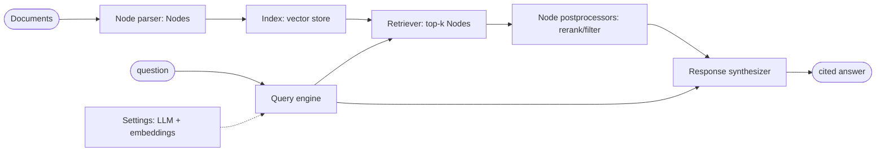

# 09 — LlamaIndex: the RAG-First Framework

## What you will learn

- What **LlamaIndex** is — a framework built specifically for RAG (Retrieval-Augmented Generation — retrieve your own documents first, then let the LLM, Large Language Model, answer from them): **Documents** (your files), **Nodes** (chunks), **Index** (the searchable store), **Retriever** (the searcher), **Node postprocessors** (re-rankers and filters), **Response synthesizer** (the answer builder) and **Query engine** (the object that runs the whole chain) — and how that maps onto our ~150-line chapter-03 code.
- What the **node parsers** do: **sentence-window** retrieval (return one small sentence but show its neighbours) and **hierarchical + auto-merging** retrieval (search small leaf chunks, then merge back up to the parent passage when several leaves hit) — and why auto-merging *lost* on our corpus.
- What **query fusion** (run several rewritten queries and fuse the lists), the **sub-question query engine** (split a hard question into sub-questions, answer each, combine) and the **router query engine** (pick vector search or summarisation per question) do — each with the real output for one golden question.
- How the three **response modes** (`compact`, `refine`, `tree_summarize`) trade LLM (Large Language Model) calls and seconds against answer quality — the cost table shows more passes do not mean better answers here.
- **What changed on the scoreboard**: all ten LlamaIndex rows next to our chapter-07 best, the chapter-08 framework rows and the three anchors — including the honest story that the worst retriever by chunk-id metrics gives the best answers.
- When to reach for LlamaIndex versus LangChain (chapter 08) versus writing it yourself, and troubleshooting for the traps we actually hit (Ollama `request_timeout`, `num_ctx`, `chromadb` version pins, the router timeout blowup).

All numbers below come from `project/runs/09_findings.md` and the committed `project/runs/09_*/metrics.json` plus `project/runs/09_li_evaluators/li_eval.json`, on the test split (n=27 questions). No new experiments were run for this chapter. Env: `llama-index-core 0.14.24`, `llama-index-llms-ollama 0.11.0`, `llama-index-embeddings-ollama 0.10.0`, `llama-index-vector-stores-qdrant 0.10.3`, `llama-index-retrievers-bm25 0.8.0`, `llama-index-postprocessor-sbert-rerank 0.6.0`, LLM (Large Language Model) `qwen3.8:27b` via Ollama, reranker `bge-reranker-v2-m3` locally. Two things from the original plan were skipped, deliberately: the **RAPTOR pack** (`llama-index-packs-raptor` is deprecated — chapter 11 builds RAPTOR by hand) and **LlamaCloud/LlamaParse** (hosted services — this tutorial is local-only).



---

## 1. LlamaIndex's mental model (side-by-side with chapter 03)

LlamaIndex thinks of RAG as an assembly line of named objects, each doing one job:

- **Document** — one input file (here: one parsed paper Markdown). A thin wrapper with text plus metadata.
- **Node** — one chunk. A node parser (e.g. `SentenceSplitter`, `SentenceWindowNodeParser`, `HierarchicalNodeParser`) cuts Documents into Nodes. Nodes carry `id, paper, section, text, start, end, meta` — the same fields as our chapter-03 chunk objects.
- **Index** — the searchable store built from Nodes (here a vector index over `nomic-embed-text` embeddings; MMR, Maximal Marginal Relevance — a ranking that balances relevance against diversity — and BM25, Best Matching 25, a classic word-overlap formula, enter through retrievers).
- **Retriever** — turns a question into the top-k Nodes (dense search, BM25, fusion of several queries, router-selected engine, …).
- **Node postprocessors** — clean up the retrieved list before generation: cross-encoder rerankers (`bge-reranker-v2-m3` — the chapter-07 workhorse, which reads question and chunk together and scores the pair), filters, window replacers.
- **Response synthesizer** — builds the prompt over the final Nodes and calls the LLM. The *response mode* (`compact`, `refine`, `tree_summarize`) decides how: one stuffed prompt, one pass per chunk, or a summary tree.
- **Query engine** — the front door: it wires retriever → postprocessors → synthesizer for one query style (naive, fusion, sub-question, router, …).
- **`Settings`** — the global defaults (which LLM, which embedding model, chunk sizes). Set once, every component inherits them — convenient, and the source of most "magic" surprises (see §6).

Side-by-side with our chapter-03 code (`baseline.py` — embed, search Chroma, build prompt, generate):

```python
# chapter 03 — no framework: you see every step
query_embedding = ollama.embed_query(question)                          # 1. embed
retrieved = [c for c, _ in store.query(query_embedding, k=k)]           # 2. retrieve
messages = build_messages(question, _as_triples(retrieved))             # 3. prompt
reply = ollama.chat(messages, max_tokens=384)                           # 4. generate
```

```python
# LlamaIndex — the same four steps as named objects (project/src/rag_tutorial/fw_llamaindex.py)
Settings.llm = Ollama(model="qwen3.8:27b")        # generator side of Settings
Settings.embed_model = OllamaEmbedding(...)       # retrieval side of Settings
index = VectorStoreIndex(nodes)                   # steps 1-2 live here once built
query_engine = index.as_query_engine(             # steps 2-4 wired by one call
    retriever=..., node_postprocessors=[reranker], response_mode="compact")
reply = query_engine.query(question)
```

Line for line: the `Index` + `Retriever` hide steps 1–2; the response synthesizer is step 3; `Settings.llm` is step 4. Our `fw_llamaindex.py` keeps the same split as chapter 08's glue file for the same practical reason — the shared evaluator calls `retrieve_fn` then `answer_fn` and counts generator calls — so each of the ten pipelines exposes those two functions over LlamaIndex objects, with the shared prompt (`build_messages`) used for generation so answer quality tracks retrieval, not wording. The validated pieces stay ours: chunking inputs, embeddings, the golden set, the judges.

---

## 2. The techniques, one paragraph each, with one real golden question

Our running example is golden question `single_hop_005` — *"Which specific retrieval system, fine-tuned on MS-MARCO, was used in the case study with Open-Domain QA?"* (reference answer: **Contriever**; evidence: the Lost-in-the-Middle paper §5). It separates the pipelines cleanly: some abstain, some answer a confident wrong system (DPR), some get it right.

| pipeline | one paragraph | `single_hop_005` real output (hit@5 / correctness) |
|---|---|---|
| **Naive** (`09_li_naive`) | Embed the question, take the top-k Nodes from the vector index, generate with the shared prompt. The LlamaIndex baseline — the same idea as chapter 03, through framework objects. | *"I cannot answer this from the provided documents."* (hit@5 0.0 / corr 0.0) — the framework baseline misses the evidence chunk entirely, and correctly declines rather than guessing. |
| **Sentence-window** (`09_li_sentence_window`) | Index small single-sentence Nodes for precise matching, but at query time replace each hit with its surrounding window so the generator sees coherent context. Small units match, big units read — the same instinct as chapter 04's sentence-window chunking. | *"I cannot answer this from the provided documents."* (hit@5 0.0 / corr 0.0) — on this question the windowed index retrieves no evidence chunk either; overall it is a small step up from naive (hit@5 0.435 vs 0.391, §5). |
| **Auto-merging** (`09_li_auto_merging`) | Build a tree of Nodes (small leaves → larger parents) with `HierarchicalNodeParser`; search the leaves, and when several hits share a parent, merge them upward and hand the parent to the generator. The idea: precise search, coherent reading. | *"I cannot answer this from the provided documents."* (hit@5 0.0 / corr 0.0) — and it is the only pipeline *worse* than naive overall (hit@5 0.348 vs 0.391): the hierarchical merge assumptions do not fit this Markdown corpus of self-contained 512-token passages. |
| **Query fusion** (`09_li_fusion`) | Ask the LLM to rewrite the question into several variants, run each, and fuse the ranked lists with RRF (Reciprocal Rank Fusion — combine rankings so chunks scoring high in *any* list rise). Our chapter-07 multi-query idea, canned. Costs 3 LLM calls per question (rewrites + answer). | *"The specific retrieval system … is **Contriever** [lost_in_the_middle §5]."* (hit@5 1.0 / corr 1.0) — fusion finds the evidence chunk that naive missed. Overall: hit@5 0.609, corr 0.543. |
| **Fusion + rerank** (`09_li_fusion_rerank`) | Fusion's pool re-ordered by the local `bge-reranker-v2-m3` cross-encoder postprocessor. Retrieval proposes, the reranker disposes. Still 3 LLM calls per question (the reranker is local, not an LLM call). | *"The retrieval system … was **Contriever**, which was fine-tuned on MS-MARCO [lost_in_the_middle §5]."* (hit@5 1.0 / corr 1.0) — the retrieval winner of the chapter: hit@5 0.739, recall@5 0.608, corr 0.652. |
| **Sub-question** (`09_li_subquestion`) | A decompose-then-combine engine: the LLM splits the question into sub-questions, each is answered against the index, and the answers are synthesised. Costs the most (5.185 LLM calls per question, 450 s/q). | *"the retrieval systems explicitly described as **fine-tuned on MS-MARCO** … are **Contriever^FT** and **mContriever^FT** …"* (hit@5 **0.0** / corr **1.0**) — the chapter's key paradox in one row: chunk-id retrieval scores zero, yet the judge marks the answer fully correct. Decomposition answers well with passages the gold evidence list does not contain, so the retrieval metric undercounts synthesis. Overall it has the *worst* hit@5 (0.304) and the *best* correctness (0.739). |
| **Router** (`09_li_router`) | An LLM router picks per question between the vector query engine and a summary engine (`SummaryIndex` + `tree_summarize`) — route factual lookups to vectors, global "what are the themes" questions to the summary tree. Costs ~1.9 LLM calls and 165 s/q on average. | *"the retrieval system discussed … is **DPR (Dense Passage Retrieval)** …"* (hit@5 0.0 / corr 0.0) — routed to the wrong engine/content and answered a confident wrong system. Overall its retrieval equals naive (0.391 — it routes mostly to the vector engine) for +0.087 correctness, plus one spectacular failure: `global_005` hit a `SummaryIndex` `tree_summarize` runaway that timed out after 954.7 s and was recorded as an error row. |

Two honest footnotes. First, **faithfulness** (fraction of answer claims supported by the retrieved passages) is uniformly high across all ten pipelines (0.871–0.965): the generator is grounded everywhere, so the correctness spread (0.304–0.739) comes from retrieval and decomposition, not from hallucination. Second, **unanswerable-abstain is 1.000 on all ten runs** — every pipeline correctly declined all 4 unanswerable questions, same as the anchors.

---

## 3. Response modes: the cost table

Same retriever (naive), three synthesizers — `compact` (pack chunks into one prompt, one call), `refine` (one LLM pass per chunk, refining the answer iteratively), `tree_summarize` (summarise bottom-up over the chunks). All three retrieve identically (hit@5 0.391), so only the answer side differs:

| response mode | correctness | faithfulness | LLM calls/q | s/q |
|---|---:|---:|---:|---:|
| `compact` (`09_li_mode_compact`) | 0.500 | 0.908 | 1.0 | 94.704 |
| `refine` (`09_li_mode_refine`) | 0.457 | 0.892 | 5.0 | 375.293 |
| `tree_summarize` (`09_li_mode_tree_summarize`) | 0.522 | 0.911 | 1.0 | 110.324 |

Read: **`refine` costs 5× the LLM calls and 4× the seconds of `compact` and scores *worse*** (0.457 vs 0.500). More passes do not mean better answers on this set — each refine pass can drift or dilute a correct draft. `tree_summarize` is the best of the three (0.522) at ~110 s/q, but still far below the sub-question engine (0.739). On `single_hop_005` all three modes failed identically (hit@5 0.0, corr 0.0 — `compact`/`tree_summarize` answered DPR, `refine` declined via "the context does not explicitly identify…"), confirming the failure sits in retrieval, which no synthesizer choice can fix.

---

## 4. Built-in evaluators vs our judge

LlamaIndex ships its own evaluators (`FaithfulnessEvaluator`, `CorrectnessEvaluator`, `RelevancyEvaluator` — each asks an LLM to grade the answer). We ran all three over the `09_li_fusion_rerank` predictions (27/27 rows, 0 errors; full rows in `runs/09_li_evaluators/li_eval.json`) and compared their pass/fail verdicts against our judge:

| comparison | agreement |
|---|---|
| LI Faithfulness passing vs ours faithfulness ≥ 0.5 | 0.593 (16/27) |
| LI Correctness passing vs ours correctness ≥ 0.5 | 0.739 |
| LI Relevancy passing vs ours correctness ≥ 0.5 | 0.696 |

Raw LlamaIndex pass counts: faithfulness 16/27 True, relevancy 22/27 True, correctness 15/27 True. Read: correctness and relevancy track our judge reasonably (0.74/0.70), but **faithfulness agrees barely above chance** (0.593) — the two faithfulness implementations count "supported" differently (ours checks per-claim support against the retrieved passages; LlamaIndex's answers YES/NO over the response as a whole). Lesson: never swap judges mid-tutorial without re-measuring; evaluator choice moves the scoreboard almost as much as pipeline choice.

---

## 5. What changed on the scoreboard

| experiment | hit@5 | recall@5 | MRR | nDCG@10 | correctness | faith | LLM/q | s/q |
|---|---:|---:|---:|---:|---:|---:|---:|---:|
| **02_no_retrieval** (anchor) | 0.000 | 0.000 | 0.000 | 0.000 | 0.174 | 1.000 | 1.0 | 0.000 |
| **03_naive_fixed_512_k5** (anchor) | 0.478 | 0.370 | 0.307 | 0.349 | 0.435 | 0.937 | 1.0 | 0.006 |
| **02_oracle** (anchor) | 1.000 | 0.988 | 1.000 | 1.000 | 0.543 | 0.865 | 1.0 | 0.000 |
| 07_hybrid_k20_ce_bge_k5 (ch07 best) | 0.739 | 0.558 | 0.667 | 0.680 | 0.674 | 0.957 | 1.0 | 0.155 |
| 08_lc_ensemble_rerank (ch08 best) | 0.435 | 0.348 | 0.289 | 0.318 | 0.478 | 0.882 | 1.0 | 9.506 |
| **09_li_naive** | 0.391 | 0.304 | 0.304 | 0.329 | 0.391 | 0.965 | 1.0 | 0.277 |
| **09_li_sentence_window** | 0.435 | 0.348 | 0.351 | 0.371 | 0.413 | 0.957 | 1.0 | 0.665 |
| **09_li_auto_merging** | 0.348 | 0.283 | 0.221 | 0.255 | 0.304 | 0.953 | 1.0 | 2.120 |
| **09_li_fusion** | 0.609 | 0.484 | 0.504 | 0.527 | 0.543 | 0.964 | 3.0 | 34.884 |
| **09_li_fusion_rerank** | 0.739 | 0.608 | 0.588 | 0.619 | 0.652 | 0.951 | 3.0 | 56.962 |
| **09_li_subquestion** | 0.304 | 0.239 | 0.097 | 0.148 | 0.739 | 0.919 | 5.2 | 450.074 |
| **09_li_router** | 0.391 | 0.304 | 0.304 | 0.329 | 0.478 | 0.871 | 1.9 | 165.326 |
| **09_li_mode_compact** | 0.391 | 0.304 | 0.304 | 0.329 | 0.500 | 0.908 | 1.0 | 94.704 |
| **09_li_mode_refine** | 0.391 | 0.304 | 0.304 | 0.329 | 0.457 | 0.892 | 5.0 | 375.293 |
| **09_li_mode_tree_summarize** | 0.391 | 0.304 | 0.304 | 0.329 | 0.522 | 0.911 | 1.0 | 110.324 |

Read in one breath: **fusion+rerank ties our chapter-07 best on hit@5 (0.739 vs 0.739) and beats it on recall@5 (0.608 vs 0.558)** — the only framework pipeline in chapters 08–09 to reach the hand-rolled frontier — but at 57 s/q versus 0.155 s/q, and still below it on correctness (0.652 vs 0.674) and ordering (MRR, Mean Reciprocal Rank — the average of 1/rank of the first correct hit — 0.588 vs 0.667; nDCG, normalized Discounted Cumulative Gain — 0.619 vs 0.680). **Sub-question breaks the pattern entirely**: worst retrieval on the board (hit@5 0.304, MRR 0.097) yet best correctness anywhere outside oracle (0.739 vs oracle 0.543 — above the "upper bound", because the oracle hands gold passages to one generation pass while decomposition synthesises across several). The LlamaIndex naive baseline (0.391/0.391) sits below both the chapter-03 anchor (0.478/0.435) and the chapter-08 naive (0.435/0.500): same idea, different chunking/index defaults — defaults matter. Auto-merging is the lone regression below naive. And every row keeps abstain 1.000.

Per-pipeline notes (deltas vs `09_li_naive` unless stated):

- **li_naive (0.277 s/q)** — the framework floor. Fast, grounded (faithfulness 0.965, highest of the ten), but retrieval-limited.
- **li_sentence_window (0.665 s/q, +0.044 hit@5, +0.022 corr)** — a cheap, safe upgrade; the window replacement costs half a second and never hurts much.
- **li_auto_merging (2.120 s/q, −0.043 hit@5, −0.087 corr)** — the only red row. Hierarchical merging assumes small leaves that only make sense inside a parent; our passages are already self-contained, so merging adds context without adding evidence.
- **li_fusion (34.884 s/q, +0.218 hit@5, +0.152 corr)** — the best correctness-per-second step: 3 LLM calls buy the jump from 0.391 to 0.543.
- **li_fusion_rerank (56.962 s/q)** — +0.130 hit@5 and +0.109 corr over fusion; the reranker earns its ~22 extra seconds. Matches the ch07 best on hit@5 — with a wide-enough candidate pool, unlike chapter 08's small-pool ensemble (§4.1 there).
- **li_subquestion (450 s/q, 5.185 calls)** — 0.739 correctness is the chapter headline, but 7.5 minutes per question on shared Ollama metal makes it a research result, not a deployment default.
- **li_router (165 s/q)** — pays a 954-second timeout blowup on one global question for +0.087 correctness; routing mostly to the vector engine means retrieval identical to naive.
- **Modes** — see §3: synthesizer choice moves correctness ±0.06 at 95–375 s/q; retrieval-identical rows prove the generator cannot rescue bad retrieval.

---

## 6. Advantages and disadvantages

| | advantage | disadvantage |
|---|---|---|
| **RAG depth out of the box** | Node parsers, fusion, sub-questions, routers, response modes and evaluators are first-class — ten distinct pipelines from one glue file, reusing our embeddings, prompt and judges. Fusion+rerank ties the ch07 best on hit@5. | Each object adds a default you did not choose (`Settings`, chunk sizes, fusion fan-out); when a pipeline underperforms, the cause hides inside a default — our explicit chapter-03 code shows every knob. |
| **Sensible retrieval defaults** | Unlike chapter 08's small-pool ensemble, LlamaIndex's fusion searches wide enough that fusion+rerank reaches 0.739 hit@5 — the framework default that actually matches the hand-rolled frontier. | The naive baseline still trails chapter 03 (0.391 vs 0.478 hit@5): "sensible" is corpus-dependent. Auto-merging defaults actively hurt here (−0.043 hit@5). |
| **Docs quality** | Query-engine, response-mode and evaluator concepts are well documented with one obvious entry point each (`as_query_engine`, `response_mode=`, evaluators in one package). | Docs track the newest API; installed-version drift is real — verify signatures against the installed 0.14.x before copying examples (see §7). |
| **Magic / implicit behaviour** | `Settings` as global state makes five-line quickstarts possible. | Global mutable state is the "magic": an unrelated import that mutates `Settings` changes your pipeline silently. Prefer passing `llm`/`embed_model` explicitly in shared code. |
| **Dependency weight** | One `llama-index` group in `pyproject.toml`; everything in this chapter installed cleanly (nothing failed, no substitutions). | The group still pulls a heavy tree (core + llms + embeddings + vector store + BM25 + sbert-rerank + sentence-transformers + qdrant-client) — and `chromadb` version pins conflict with the LangChain group's pins, so keep them in separate `uv` groups/extras or one resolved lock (see §7). |
| **Speed** | Local pieces (sentence-window, rerank) cost under a second extra per question. | Anything agentic is slow on shared Ollama metal: router 165 s/q, refine 375 s/q, sub-question 450 s/q — 2–4 orders of magnitude above the ch07 best (0.155 s/q). |

**LangChain vs LlamaIndex, in one honest paragraph.** On this corpus LlamaIndex wins on retrieval depth and loses on nothing except speed at the top end: its fusion+rerank (hit@5 0.739) beats every chapter-08 pipeline (best 0.435) because its canned fusion searches a wide-enough pool while LangChain's canned ensemble re-ranks a small one — but that is a defaults story, not a destiny story (§4.1 of chapter 08 shows the LangChain gap closes with wider legs). LangChain wins on breadth (chat models, tools, agents beyond RAG; the CRAG loop in chapter 08 has no one-line LlamaIndex equivalent here) and on explicitness (LCEL, LangChain Expression Language — the `|` pipe — shows the data flow; LlamaIndex's query engine hides it). Both cost more seconds per question than hand-rolled code and both inherit defaults silently. Our recommendation stands from chapter 08, extended: prototype retriever *shapes* in LlamaIndex (its RAG vocabulary is the richest), prototype *agent loops* in LangGraph, then port the winner to explicit code with your own pool sizes — and re-measure, because both chapters prove the port direction matters more than the framework choice.

---

## 7. Troubleshooting

| symptom | cause | fix |
|---|---|---|
| `ollama.ReadTimeout` / requests time out on long generations (we saw a 954.7 s runaway on `global_005`) | The Ollama client's default `request_timeout` (seconds) is shorter than summary-tree and sub-question generations on a shared GPU. | Pass a large `request_timeout` (e.g. 900 s) to the Ollama LLM wrapper and wrap per-question eval in try/except that records an error row and continues — exactly what `fw_llamaindex.py` does; the router metrics above include that error row. |
| Truncated or degraded answers on long contexts; slow generations | Default `num_ctx` (context window size in tokens) too small for multi-chunk prompts, or contention on the shared `rtx` box. | Set `num_ctx` explicitly (e.g. 8192+) in the Ollama options, run `just gpu-check` before batches of 100+ LLM calls, and prefer `compact` over `refine` when the window is tight. |
| `chromadb` version conflict when installing the LangChain and LlamaIndex groups together | Both groups pin overlapping transitive dependencies (`chromadb`, `qdrant-client`, `numpy`) at incompatible ranges. Our run installed cleanly, but only because the groups were resolved with care. | Keep framework dependencies in separate `uv` groups/extras (`uv sync --group llamaindex` vs `--group langchain`) or maintain one resolved lockfile and record which; never force-install one framework's pins over the other's. |
| `AttributeError: calls` on a counter subclassing a LlamaIndex/pydantic model | Declaring `calls: int = 0` on a pydantic-model subclass makes it a model *field*, not a class attribute — the first read in a fresh process raises. | Declare it as `calls: ClassVar[int] = 0` (the fix in `fw_llamaindex.py`). |
| `Detected nested async` on the 2nd+ `.evaluate()` call in one process (Python 3.14) | The sync-over-async wrapper re-enters the event loop once per call; after the first call the loop state trips the guard. | Drive async `aevaluate` directly under a single `asyncio.run`, sequentially, with per-question try/except plus incremental `li_eval.jsonl` resume (the `li-eval` CLI pattern). |
| Router routes everything to one engine | The router's LLM choice prompt defaults to the first engine when scores tie; summary answers then never map to chunk ids, so retrieval metrics equal naive. | Log the routing decision per question (our `config.json` records it); if one engine wins >90%, rewrite the router prompt with sharper engine descriptions or route global-type questions to summary explicitly. |

---

## 8. Exercises

1. **Close the sub-question gap honestly.** `09_li_subquestion` scores hit@5 0.304 with correctness 0.739 — the retrieval metric undercounts synthesis. Re-score its predictions with a passage-level check (does *any* retrieved chunk support each answer claim?) and report the "effective hit rate" next to 0.304.
2. **Refine vs compact A/B on long answers.** Re-run `09_li_mode_refine` vs `09_li_mode_compact` on just the 5 global questions: does `refine`'s extra 4 calls per question ever win where there is more to synthesise, and what happens to faithfulness (currently 0.892 vs 0.908)?
3. **Fix the router blowup.** Cap the summary engine's input (fewer nodes, lower `num_ctx`) or add a per-engine timeout well under 900 s, re-run `09_li_router` on `global_005` alone, and check whether correctness (currently 0.478 overall) survives without the 954 s tail.
4. **Port the winner, again.** Chapter 08's exercise was to reproduce 07's k_each=20 → cross-encoder → top-5 through LangChain. Do the same through LlamaIndex (`QueryFusionRetriever` fan-out matched to k_each=20 + `SentenceTransformerRerank` top-5) and compare hit@5/MRR against both `09_li_fusion_rerank` (0.739/0.588) and `07_hybrid_k20_ce_bge_k5` (0.739/0.667). Which ordering gap remains?

---

**Next:** [10_haystack_and_dspy.md](10_haystack_and_dspy.md) — Haystack 2 pipelines (hybrid retrieval, ranker, prompt builder, evaluators) and DSPy (a RAG *program* whose prompt is optimised against our golden set), with their own pros/cons.
