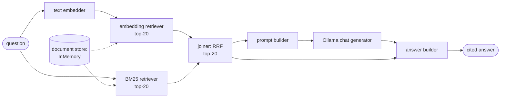
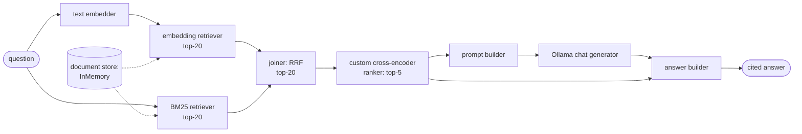

# 10 — Haystack Pipelines and DSPy Prompt Optimisation

## What you will learn

- What **Haystack 2** is — a framework where RAG (Retrieval-Augmented Generation — retrieve your own documents first, then let the LLM, Large Language Model, answer from them) is built from **typed-socket components** wired into a **pipeline graph** over a **document store** — and how our two pipelines (hybrid retrieval, hybrid + rerank) map onto the chapter-03 code.
- What the two Haystack pipelines do step by step (BM25, Best Matching 25, a classic word-overlap formula, + embedding retriever → RRF, Reciprocal Rank Fusion, joiner → optional cross-encoder ranker → prompt builder → LLM → answer builder), with the real output for one golden question and the YAML (a human-readable config format) serialisation round-trip.
- How Haystack's **built-in evaluators** (faithfulness, context relevance, document MRR/recall) agree — or fail — against our judge on the same 27 predictions.
- What **DSPy** is — "programming, not prompting": **signatures** (input/output contracts), **modules** (programs like ChainOfThought), **optimisers** (BootstrapFewShot, MIPROv2) that rewrite the prompt against an eval set — including the before/after prompts verbatim, the dev/test numbers, and what the optimisation cost.
- **What changed on the scoreboard**: all five chapter-10 rows next to the anchors and the chapter-07 best — including the two honest paradoxes (Haystack rerank improves ranking but worsens answers; DSPy optimisation hurts correctness while helping faithfulness).
- When to reach for Haystack versus DSPy versus hand-rolled code, and troubleshooting for the traps we actually hit (missing ranker component, chunk-id remapping, the DSPy import-order landmine, uncached Haystack LLM calls).

All numbers below come from `project/runs/10_findings.md` and the committed `project/runs/10_*/metrics.json`, `project/runs/10_hs_hybrid_rerank/pipeline.yaml`, `project/runs/10_hs_evaluators/hs_eval.json` and `project/runs/10_dspy_optimize_summary.json`, on the test split (n=27 questions; dev split n=9 for DSPy tuning). No new experiments were run for this chapter. Env: `haystack-ai 3.1.1`, `ollama-haystack 6.8.0`, `dspy 3.3.1`, `optuna 5.0.0`, LLM (Large Language Model) `qwen3.8:27b` via Ollama, embeddings `nomic-embed-text`, reranker `bge-reranker-v2-m3` locally. Deliberately skipped: `dspy.Refine`/citation assertions (budget; the shared prompt already demands `[short_name]` citations), a Qdrant-backed Haystack store (the Qdrant container was down, so the InMemory store was used), and `sentence-transformers-haystack` (version-pinned out — the rerank is a small custom component wrapping the same model).





The first diagram is `10_hs_hybrid`; the second is `10_hs_hybrid_rerank` — identical except the ranker between the joiner and the prompt/answer builders (see `runs/10_hs_hybrid_rerank/pipeline.yaml`).

---

## 1. Haystack's mental model (side-by-side with chapter 03)

Haystack 2 thinks of RAG as a **graph of components** with **typed sockets**:

- **Document store** — the searchable storage holding Documents (here `InMemoryDocumentStore`, shared by both retrievers; a Qdrant store would slot in without changing the graph).
- **Component** — one box doing one job, with named, typed inputs and outputs (sockets). Our graph uses: `OllamaTextEmbedder` (question → vector), `InMemoryBM25Retriever` and `InMemoryEmbeddingRetriever` (question → top-20 Documents each), `DocumentJoiner` in `reciprocal_rank_fusion` mode (two ranked lists → one fused top-20), a custom `CrossEncoderRankerComponent` (20 → top-5), `ChatPromptBuilder` (documents + question → chat messages from a Jinja template), `OllamaChatGenerator` (messages → reply), `AnswerBuilder` (reply + documents → cited answer).
- **Pipeline** — the graph itself: components plus connections (`sender.output → receiver.input`, all listed in `pipeline.yaml`). You run it with one call; Haystack routes data along the edges. The type checker refuses to connect mismatched sockets (`connection_type_validation: true`).
- **Evaluators** — also components (`FaithfulnessEvaluator`, `ContextRelevanceEvaluator`, `DocumentMRREvaluator`, `DocumentRecallEvaluator`), so judging can live inside the same graph abstraction (§4).

Side-by-side with our chapter-03 code (embed, search, build prompt, generate): the two retrievers + joiner hide steps 1–2, `ChatPromptBuilder` is step 3, `OllamaChatGenerator` is step 4, and `AnswerBuilder` attaches the citations. The difference from LlamaIndex (chapter 09): less magic, more plumbing — every edge is explicit in the YAML, including the easy-to-forget `ranker.documents → answer_builder.documents` edge that keeps citations pointing at the *reranked* list.

---

## 2. The two pipelines, with one real golden question

Our running example is golden question `single_hop_005` — *"Which specific retrieval system, fine-tuned on MS-MARCO, was used in the case study with Open-Domain QA?"* (reference answer: **Contriever**; evidence: the Lost-in-the-Middle paper §5).

| pipeline | one paragraph | `single_hop_005` real output (hit@5 / correctness) |
|---|---|---|
| **Hybrid** (`10_hs_hybrid`) | Embed the question *and* run BM25 over the same store (top-20 each), fuse with RRF (Reciprocal Rank Fusion — combine rankings so chunks scoring high in *any* leg rise), build the shared prompt over the fused top-5, generate once (1.0 LLM calls per question). | *"the retrieval system … was **Contriever**, which was fine-tuned on **MS-MARCO** [lost_in_the_middle §5]."* (hit@5 0.0 / corr 1.0) — correct answer from passages the gold evidence list does not contain, so the chunk-id metric scores zero while the judge scores full marks. Faithfulness on this question is only 0.25 (1/4 claims supported) — the generator added dataset details the passages do not support. |
| **Hybrid + rerank** (`10_hs_hybrid_rerank`) | Same pool re-ordered by the local `bge-reranker-v2-m3` cross-encoder (a model that reads question and chunk together and scores the pair) down to top-5 before generation. Still 1.0 LLM calls per question (the reranker is local). | *"The specific retrieval system … is **Contriever** [lost_in_the_middle §1]."* (hit@5 1.0 / corr 1.0) — the reranker surfaces the evidence chunk to the top. |

Overall (test, n=27): hybrid reaches hit@5 0.609, recall@5 0.471, MRR (Mean Reciprocal Rank — the average of 1/rank of the first correct hit) 0.373, nDCG@10 (normalised Discounted Cumulative Gain — ranking quality with partial credit for lower ranks) 0.431, correctness 0.696, faithfulness 0.702 at 11.5 s/q. Adding the reranker improves every rank metric (hit@5 0.609 → 0.696, MRR 0.373 → 0.581) **but correctness drops** (0.696 → 0.565) while faithfulness rises (0.702 → 0.922). Read: the reranked context is more faithful — the generator stays closer to it and answers more conservatively, declining or hedging where the hybrid pipeline guessed right. Rank quality ≠ answer quality on this set. Both rows keep unanswerable-abstain 1.000.

---

## 3. YAML serialisation

`pipeline.to_dict()` → YAML → `Pipeline.loads(...)` round-trips: reload gives the same components and connections (the committed `runs/10_hs_hybrid_rerank/pipeline.yaml` above is that artefact — note the two retrievers sharing one `InMemoryDocumentStore`, the joiner's `reciprocal_rank_fusion` mode, and the prompt template carrying our shared abstain instruction verbatim). One caution box: the reranker is a *custom* `@component` class, so deserialisation needs `Pipeline.loads(..., unsafe=True)` — stock components reload safely, custom code needs the explicit unsafe flag, which is Haystack telling you that YAML now executes your class.

---

## 4. Built-in evaluators vs our judge

We ran Haystack's evaluators over the `10_hs_hybrid_rerank` predictions (full rows in `runs/10_hs_evaluators/hs_eval.json`) with `OllamaChatGenerator(model=qwen3.8:27b)` — fully local, no OpenAI-style endpoint needed:

| comparison | agreement |
|---|---|
| Haystack FaithfulnessEvaluator passing vs ours faithfulness ≥ 0.5 | 1.000 (25/27 scored, Haystack mean 0.992) |
| Haystack ContextRelevanceEvaluator vs ours correctness ≥ 0.5 | 0.783 (26/27 scored, Haystack mean 0.769) |
| DocumentMRREvaluator / DocumentRecallEvaluator | 0/27 scored — both raise `ValueError: The length of ground_truth_documents and retrieved_documents must be the same` |

Read: the 1.000 faithfulness agreement is a **ceiling effect, not deep agreement** — both judges say "faithful" almost everywhere (Haystack's mean is 0.992 while ours spread out), so there is nothing to disagree on. Context relevance tracks our correctness reasonably (0.783, close to LlamaIndex's 0.739/0.696 in chapter 09). The document evaluators never ran at all: they require equal-length lists of gold and retrieved documents, but our gold evidence quotes (1–3 per question) never match the retrieved top-5 count. Lesson, same as chapter 09 with a new instance: never swap judges mid-tutorial without re-measuring — Haystack's faithfulness judge is far more lenient than ours (saturates near 1.0), and its rank evaluators assume a list shape our eval does not produce.

---

## 5. DSPy: programming, not prompting

DSPy's mental model flips the usual workflow. Instead of hand-editing prompt text, you write a **program**:

- **Signature** — a contract declaring input/output fields, e.g. `context, question -> answer` (optionally with `reasoning` for chain-of-thought). The *wording* of the instruction is a parameter, not the program.
- **Module** — the program itself. Ours is a `ChainOfThought` RAG module: retrieve with the chapter-07 best retriever as plain Python (k_each=20 → `bge-reranker-v2-m3` → top-5, parent chunks), then generate. All three DSPy rows share this retriever, so their retrieval columns are identical by construction (hit@5 0.739, recall@5 0.558, MRR 0.667, nDCG@10 0.680).
- **Optimiser** — rewrites the instruction and/or picks few-shot demos to maximise a metric on a dev set. We used two: **BootstrapFewShot** (run the module on dev, keep traces that score well as demos; max 4+4 demos, 4 saved) and **MIPROv2** in light mode (jointly searches instructions + demos; max 2+2 demos, 2 saved).
- **Metric** — the optimiser's objective. Ours is cheap **token-F1** (word-overlap between prediction and reference), NOT the LLM judge — the judge needs ~3 LLM calls per example and would blow the ≤400-call budget. Final test scoring still uses the real judges.

The before/after prompts, verbatim. Before (zero-shot; Bootstrap keeps this wording and only adds demos):

```text
Given the fields `context`, `question`, produce the fields `answer`.
```

After (MIPROv2's learned instruction, full text in `project/data/cache/dspy/10_dspy_mipro.json`):

```text
You are an expert AI assistant specialized in Natural Language Processing (NLP) and Large Language Model (LLM) research. Your task is to answer specific technical questions based strictly on the provided **Context**.

**Instructions:**
1.  **Analyze the Question:** Identify the core technical query, including specific metrics, model names, architectural details, or implementation strategies being asked about.
2.  **Locate Evidence:** Scrutinize the provided **Context** (which may contain text, tables, or algorithms) to find the exact information that answers the question. Pay close attention to numerical values, comparisons, and specific section references.
3.  **Formulate the Answer:**
    *   Provide a concise, factual, and accurate answer directly derived from the context.
    *   If the question asks for comparisons, explicitly state the values for both items being compared.
    *   If the answer involves multiple steps or conditions, ensure all parts are addressed.
    *   Do **not** use external knowledge. If the information is not present in the context, state that it is not provided.
4.  **Format:** Output only the final answer text. Do not include the reasoning process in the final output unless explicitly requested by the prompt structure (though the examples show a separate Reasoning field, the final output field is just the answer).

**Input Format:**
- `Context`: A string containing technical documentation, papers, or datasets relevant to NLP/LLMs.
- `Question`: A specific technical question based on the context.

**Output Format:**
- `Answer`: The direct, factual response to the question.

**Example 1:**
Context: [Text about CRAG evaluator size and Self-RAG critic model size]
Question: What is the parameter size of the evaluator designed in CRAG, and how does it compare to the critic model of Self-RAG?
Answer: The evaluator designed in CRAG has a parameter size of 0.77B (based on T5-large). In comparison, the critic model of Self-RAG is based on LLaMA-2 with a parameter size of 7B. The text highlights that the CRAG evaluator is "quite lightweight" and significantly smaller than the Self-RAG critic model.

**Example 2:**
Context: [Text about RAPTOR evaluation script modifications]
Question: What specific modification was made to AllenNLP's evaluation script to handle cases where the BLEU score is zero?
Answer: A smoothing function was added to the evaluation script. This modification prevents the BLEU score from dropping to zero when there are no n-gram matches, thereby avoiding an overly harsh evaluation for rare or novel phrases.

**Now, process the following:**

Context: {context}
Question: {question}
Answer:
```

The dev/test numbers and the optimisation cost:

| row | dev signal | test correctness | test faithfulness | s/q |
|---|---|---:|---:|---:|
| `10_dspy_zero_shot` (no optimisation) | — | 0.739 | 0.865 | 10.5 |
| `10_dspy_bootstrap` (4 LM calls, 2.6 s; teacher traces served from DSPy disk cache, cold cost est. ~10–20 calls) | token-F1 on 9 dev examples | 0.717 | 0.896 | 13.3 |
| `10_dspy_mipro` (90 LM calls, 766.2 s, dev token-F1 39.45) | token-F1 on 9 dev examples | 0.696 | 0.945 | 11.8 |

Read: optimising a cheap proxy (token-F1) on 9 dev examples **overfits and hurts judge correctness** (0.739 → 0.717 → 0.696) while faithfulness rises monotonically (0.865 → 0.896 → 0.945) — a textbook proxy-misalignment demo in one table. The headline within the headline: **zero-shot DSPy with our chapter-07 retriever is the new correctness SOTA (state of the art) at 0.739** with no optimisation at all — the retriever does the heavy lifting, ChainOfThought just verbalises it. Programs are saved at `project/data/cache/dspy/10_dspy_{zero_shot,bootstrap,mipro}.json`; the optimiser summary at `runs/10_dspy_optimize_summary.json`. DSPy-side LM settings that mattered: `max_tokens=4096` (ChainOfThought emits long `reasoning` before `answer` from one budget — smaller budgets truncate the answer), `num_ctx=16384` (5 parent chunks + CoT instructions exceed Ollama's default 4k window), `think=False` (qwen3.8:27b reasoning fills `reasoning_content`, leaving DSPy an empty response otherwise).

---

## 6. What changed on the scoreboard

| experiment | hit@5 | recall@5 | MRR | nDCG@10 | correctness | faith | LLM/q | s/q |
|---|---:|---:|---:|---:|---:|---:|---:|---:|
| **02_no_retrieval** (anchor) | 0.000 | 0.000 | 0.000 | 0.000 | 0.174 | 1.000 | 1.0 | 0.000 |
| **03_naive_fixed_512_k5** (anchor) | 0.478 | 0.370 | 0.307 | 0.349 | 0.435 | 0.937 | 1.0 | 0.006 |
| **02_oracle** (anchor) | 1.000 | 0.988 | 1.000 | 1.000 | 0.543 | 0.865 | 1.0 | 0.000 |
| 07_hybrid_k20_ce_bge_k5 (ch07 best) | 0.739 | 0.558 | 0.667 | 0.680 | 0.674 | 0.957 | 1.0 | 0.155 |
| **10_hs_hybrid** | 0.609 | 0.471 | 0.373 | 0.431 | 0.696 | 0.702 | 1.0 | 11.478 |
| **10_hs_hybrid_rerank** | 0.696 | 0.528 | 0.581 | 0.608 | 0.565 | 0.922 | 1.0 | 9.955 |
| **10_dspy_zero_shot** | 0.739 | 0.558 | 0.667 | 0.680 | 0.739 | 0.865 | 1.0 | 10.459 |
| **10_dspy_bootstrap** | 0.739 | 0.558 | 0.667 | 0.680 | 0.717 | 0.896 | 1.0 | 13.274 |
| **10_dspy_mipro** | 0.739 | 0.558 | 0.667 | 0.680 | 0.696 | 0.945 | 1.0 | 11.828 |

Read in one breath: **DSPy zero-shot takes the correctness crown (0.739)** — above the chapter-07 best (0.674) and even above oracle (0.543), because the oracle hands gold passages to one generation pass while the ch07 retriever + ChainOfThought finds strong passages and reasons over them. Haystack hybrid (0.696 correctness) beats the ch07 best on correctness while losing on every retrieval metric — its InMemory BM25 + embedding fusion over differently-chunked documents finds answerable passages the gold list undercounts (see `single_hop_005` above). Haystack rerank then trades correctness for faithfulness (0.565/0.922), and DSPy optimisation makes the same trade harder the more it costs (90 calls and 766 s to go from 0.739 down to 0.696). Every row keeps abstain 1.000. And every framework row costs ~10–13 s/q versus the ch07 best's 0.155 s/q — two orders of magnitude for the framework wrappers around identical models.

---

## 7. Advantages and disadvantages

Haystack 2:

| | advantage | disadvantage |
|---|---|---|
| **Explicitness** | The pipeline graph *is* the documentation: every component and every edge is listed in the YAML, including the ranker→answer-builder citation edge. No hidden `Settings` global like chapter 09. | You write every edge by hand — the YAML for two retrievers + joiner + ranker is already 126 lines, and a missing connection fails silently at the answer (wrong citations) rather than loudly at build time. |
| **Production features** | Document stores (swap InMemory → Qdrant without touching the graph), serialisation round-trip, evaluators as components, prompt builder with Jinja templates — the deployment-shaped pieces are first-class. | Production-shaped is not production-free: the Qdrant store path was untested here (container down), and Haystack-side embedding+generation calls bypass our disk cache (`ollama-haystack 6.8.0` calls Ollama directly), so re-runs cost real GPU seconds. |
| **Ecosystem** | Covers the RAG core (retrievers, joiners, rankers, builders, generators, evaluators) with one coherent graph abstraction. | Smaller ecosystem than LangChain (chapter 08): no agent-loop equivalent of the CRAG graph here, fewer integrations, and one documented ranker (`SentenceTransformersSimilarityRanker`) was missing from the installed `haystack-ai 3.1.1` — only LLM, LostInTheMiddle, MetaField rankers ship — so we wrote a custom component. |

DSPy:

| | advantage | disadvantage |
|---|---|---|
| **Measurable prompt improvement** | Optimisation is a number, not a vibe: dev token-F1 39.45 after MIPRO, test correctness/faithfulness per row, programs versioned as JSON. When the prompt gets better, you can prove it — and here you can prove it got *worse*, which is equally valuable. | Needs an eval set with reference answers (our 9-example dev split), and the metric you optimise is the metric you get: token-F1 optimisation bought faithfulness (+0.080) at the price of correctness (−0.043). |
| **Optimisation cost** | BootstrapFewShot is nearly free (4 LM calls, 2.6 s from cache). | MIPROv2 light costs 90 LM calls and 766 s on 9 examples — and overfit. Scaling this to a real dev set at judge-quality metrics would cost orders of magnitude more. |
| **Opacity of learned prompts** | The learned instruction is explicit text you can read (quoted verbatim in §5). | It reads like generic coaching ("Analyze the Question… Locate Evidence…") plus two baked-in examples (CRAG sizes, RAPTOR BLEU smoothing) — why *these* words, and whether they transfer to another corpus, is as opaque as any hand prompt. The program JSON pins behaviour without explaining it. |

---

## 8. Troubleshooting

| symptom | cause | fix |
|---|---|---|
| `haystack.components.rankers` has no `SentenceTransformersSimilarityRanker` (installed `haystack-ai 3.1.1`) | The similarity ranker from older Haystack versions is not in the 3.x rankers package (only LLMRanker/LostInTheMiddle/MetaField/…); `sentence-transformers-haystack` needs `sentence-transformers>=5.4.0`, pinned to `==5.3.0` by `pylate`. | Use a small custom `@component` wrapping our `CrossEncoderReranker` (`BAAI/bge-reranker-v2-m3`) — same model as specced; remember `Pipeline.loads(..., unsafe=True)` for custom components. |
| Chunk ids do not match the shared scorer after `DocumentSplitter` | The splitter records no char start/end offsets — only word-index `meta["split_idx_start"]` (+`split_id`, `source_id`). | Remap chunk ids as `chunk_id(paper, split_idx_start, split_idx_start + len(content))` so retrieval metrics work across strategies. |
| `TypeError: data type 'bool' not understood` (numpy) when importing DSPy | Import-order landmine: `import dspy` *before* chromadb/numpy breaks numpy's dtype registry. | Keep `import dspy` after the `rag_tutorial` imports in `fw_dspy.py` (comment in file); `python -m` entry points are safe. |
| Haystack re-runs cost GPU seconds even with our cache committed | `ollama-haystack 6.8.0` embedders/generators call Ollama directly and bypass the `rag_tutorial.llm` disk cache (judge calls still hit it). | Budget ~10 s/q per Haystack eval; DSPy's own `cache=True` is a separate on-disk LiteLLM cache — the two caches do not share entries. |
| DSPy answers truncated / `AdapterParseError` | ChainOfThought emits long `reasoning` before `answer` from one token budget; 384/1024-token limits cut the answer off mid-field. | Set `max_tokens=4096`, `num_ctx=16384` (5 parent chunks + CoT instructions exceed Ollama's default 4k window), `think=False` on the LM. |
| MIPROv2 import fails on `optuna` | MIPROv2 needs the optional `optuna` dependency, not installed with base `dspy`. | Add `optuna==5.0.0` to the `dspy` group. |
| `pipeline.draw()` fails | It needs network access (renders via an external service). | Draw mermaid by hand from `to_dict()` (the two diagrams at the top of this chapter); the `dump-pipeline` run records the pattern. |

---

## 9. Exercises

1. **Fix the document evaluators.** `DocumentMRREvaluator`/`DocumentRecallEvaluator` scored 0/27 on the list-length `ValueError`. Wrap gold evidence quotes and retrieved chunks into equal-length `Document` lists (pad the shorter side) and re-run `hs-eval`: does Haystack's document recall track our recall@5 (0.528)?
2. **Optimise against the judge, once.** Re-run BootstrapFewShot with 3 LLM-judge calls per dev example as the metric on just 3 dev questions, and compare test correctness against `10_dspy_bootstrap` (0.717). How many extra LLM calls did the "right" metric cost, and did correctness recover toward 0.739?
3. **Rerank strictness sweep.** `10_hs_hybrid_rerank` keeps top-5 after the cross-encoder. Re-run the rerank pipeline keeping top-3 and top-10: does correctness (currently 0.565) recover with a wider window, and what happens to faithfulness (currently 0.922)?
4. **Port the winner to Haystack.** The DSPy rows win on correctness (0.739) using the chapter-07 retriever as plain Python. Wire that exact retriever (k_each=20 → cross-encoder → top-5, parent chunks) into the Haystack graph as a custom component and compare against `10_hs_hybrid_rerank` (0.696/0.565). Which gap is the framework, and which is the retriever?

---

**Next:** [11_graph_rag_systems.md](11_graph_rag_systems.md) — LightRAG (local / global / hybrid / mix modes) and RAPTOR on our corpus; where graph-style retrieval wins (multi-hop, global questions) and what it costs.
