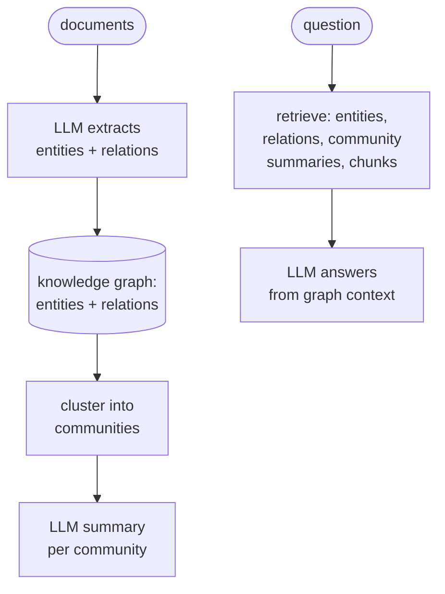
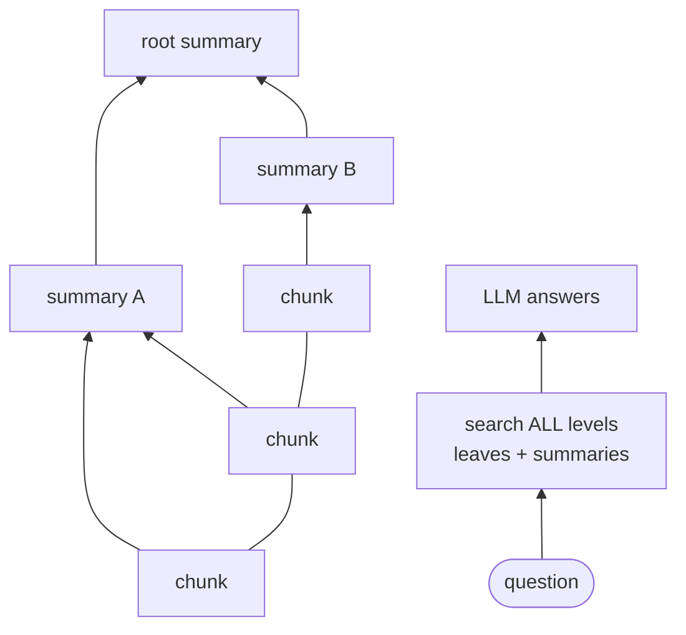

# 11 — Graph and Hierarchical RAG: LightRAG and RAPTOR

## What you will learn

- Why plain chunk retrieval fails on **multi-hop** (answer needs facts from two or more papers) and **global** ("what are the themes across the corpus") questions — with one real failing question from our golden set.
- What **GraphRAG** is — build a knowledge graph (entities, relations, communities, summaries) from the corpus and retrieve over it — and how **LightRAG** (a lightweight GraphRAG system) simplifies it with dual-level keywords and no community summaries.
- What **RAPTOR** (Recursive Abstractive Processing for Tree-Organized Retrieval — cluster chunks, summarise each cluster with an LLM (Large Language Model), recurse into a summary tree) is, and what its real tree looks like on our 12-paper corpus.
- How both systems scored on our 27-question test split: RAPTOR k=10 correctness 0.522 (close to the chapter-07 best of 0.587), LightRAG modes 0.065–0.130 — plus the per-question-type table, the indexing-cost table, and what changed on the scoreboard.
- When graph-style RAG is worth its indexing cost (and when it is not), with troubleshooting for the failures we actually hit.

All numbers below come from `project/runs/11_findings.md` and the committed result files (`project/runs/11_lightrag/index_stats.json`, `project/runs/11_raptor/build_stats.json`, `project/runs/11_*/metrics.json`, `project/runs/11_per_type.json`, chart `project/runs/11_per_type.png`), on the test split (n=27: 8 single-hop / 7 multi-hop / 3 comparative / 5 global / 4 unanswerable). No new experiments were run for this chapter. Env: `lightrag-hku 1.5.7`, `scikit-learn` clustering for RAPTOR, chat/judge model `qwen3.8:27b` via Ollama, embeddings `nomic-embed-text`. Deliberately skipped: HippoRAG (spec says writeup-only) and full MS GraphRAG (covered by the `graph_rag` tutorial with Neo4j — referenced, not re-run).

---

## 1. Why chunk retrieval fails for multi-hop and global questions

Plain RAG (Retrieval-Augmented Generation — retrieve your own documents first, then let the LLM answer from them) retrieves the top-k chunks most similar to the question. That works when the answer sits inside one chunk. It breaks in two cases:

- **Multi-hop**: the answer needs fact A from paper 1 *and* fact B from paper 2. No single chunk contains both, and the question text may resemble neither chunk strongly enough to retrieve both in the top 5.
- **Global**: "what are the themes across the corpus" has no single answer passage at all — the answer must be *synthesised* from dozens of chunks, far more than fit in the prompt.

One real example from our set — golden question `multi_hop_004`: *"How does the RAG approach to the FEVER fact verification task described in Passage A differ from the context selection strategies discussed in Passage B regarding the use of retrieved evidence?"* Answering needs the RAG paper's FEVER section *and* the Self-RAG paper's critic/segment machinery. LightRAG's `local` mode answered:

```text
I cannot answer this from the provided documents.
```

It retrieved chunks around one side of the comparison and, finding no passage covering both, abstained (our shared prompt tells the model to say so rather than guess). This is the characteristic multi-hop failure: each hop is retrievable, the *combination* is not ranked. A graph (entities like "FEVER", "retrieved evidence", "critic model" linked across papers) is meant to bridge exactly this gap — which is why this chapter tests whether it does.

---

## 2. The GraphRAG idea, and how LightRAG simplifies it

Microsoft's GraphRAG (paper 2404.16130, in our corpus) works in two phases:



- **Entities and relations** — the LLM (Large Language Model) reads each chunk and emits a mini knowledge graph: nodes ("RAPTOR", "recursive summary", "FEVER") and typed edges ("RAPTOR *uses* recursive summaries").
- **Communities** — the graph is clustered (Leiden algorithm) into densely-connected neighbourhoods, e.g. "everything about evaluation metrics".
- **Community summaries** — each community gets an LLM-written summary, bottom-up, so a global question can be answered from a handful of summaries instead of thousands of chunks.

**LightRAG** (discussed in our corpus notes; the package is `lightrag-hku`, version 1.5.7 here) keeps the extraction step but drops the expensive parts. From its paper, the two simplifications:

1. **No community detection, no community summaries.** Indexing stops at entities + relations + the original text chunks. Nothing like the Leiden step or the bottom-up summary hierarchy is built at index time (consistent with what we observed: zero community files in the working dir after a full index — see §4).
2. **Dual-level keyword retrieval instead of graph traversal.** At query time LightRAG asks the LLM for two keyword sets: **local keywords** (specific entities — people, methods, datasets) and **global keywords** (topics, themes). `local` mode retrieves around the entities, `global` mode around the relations/topics, `hybrid` combines both, `mix` blends graph context with plain vector chunks, and `naive` is plain chunk retrieval as a control.

So LightRAG trades GraphRAG's costly community hierarchy for a cheap trick: one extra LLM call that turns the question into graph keywords, then one-hop lookup. Whether that trick buys anything on our corpus is §4's question.

---

## 3. The RAPTOR idea: a tree of summaries

RAPTOR (paper 2401.18059, in our corpus) attacks the same problem from the hierarchy side instead of the graph side:



1. Embed all leaf chunks, **cluster** them by similarity.
2. Ask the LLM to **summarise each cluster**; embed the summaries.
3. **Recurse**: cluster the summaries, summarise the clusters, until ≤ 5 nodes remain at the top.
4. At query time, retrieve from the **collapsed tree** — leaves and summaries in one pool — so a global question can hit a summary node that already synthesises ten chunks.

Our implementation detail (from the findings): clustering is **agglomerative** (bottom-up merging) with cosine distance and average linkage toward a target cluster size of 10 — *not* the paper's UMAP + GMM (Gaussian Mixture Model), which would pull in `numba`/`pynndescent` dependencies and non-determinism. One metric caveat worth knowing: our scorer counts a summary node as "retrieved context" but judges it relevant only if it contains the evidence quote verbatim — summaries paraphrase, so retrieval metrics (hit@k, recall) *understate* summary usefulness. Correctness is the fairer comparator for RAPTOR.

---

## 4. Running LightRAG: config, index stats, local vs global

Config: one LightRAG instance over the 12 parsed papers (872,030 characters), text split into **211 chunks** (1200 characters with 100 overlap), `qwen3.8:27b` for extraction/keywords/answers, `nomic-embed-text` for vectors, default retrieve k=5, resumable working dir, a single index run of **121.97 minutes**. No reranker was configured (LightRAG logs a "no rerank model" warning per query; retrieval still returns). Query modes evaluated: `naive`, `local`, `global`, `hybrid`, `mix` (run configs in `project/runs/11_lightrag_*/config.json`).

Index stats (from `project/runs/11_lightrag/index_stats.json`):

| item | value |
|---|---|
| documents / characters / chunks | 12 / 872,030 / 211 |
| wall time | 121.97 min (≈ 2 h, one run 12:57–15:0x) |
| LLM calls at index | 497 (entity/relation extraction) |
| embedding texts | 6,091 |
| graph | 3,135 entities, 2,303 relations |
| community files | 0 — no `community_reports.json`; communities materialise lazily at global-query time, if at all |
| working dir | 41 MB total (biggest: `vdb_entities.json` 20.8 MB, `vdb_relationships.json` 15.1 MB, LLM response cache 8.8 MB) |

Two honest index-time observations: the log is full of `Complete delimiter can not be found in extraction result` and `LLM output format error ... RELATION` warnings — entity/relation extraction is lossy on dense academic prose. And the slow part is not the LLM calls but `nano-vectordb` upserts (25–200 s per relation batch).

One `local` vs `global` answer, verbatim, for `multi_hop_004` (the FEVER-vs-Self-RAG question from §1):

```text
LOCAL: I cannot answer this from the provided documents.
```

```text
GLOBAL: Based on the provided excerpts, the RAG approach to the FEVER fact verification task
differs from the Self-RAG context selection strategies in the following ways regarding the use
of retrieved evidence:

1.  Supervision on Retrieved Evidence: The RAG approach explicitly states that it does not use
supervision on retrieved evidence for the FEVER task, arguing that this makes the model
applicable to a wider range of tasks where retrieval supervision signals are unavailable
[rag §3.4 Fact Verification]. In contrast, the Self-RAG approach involves a critic model that
predicts whether retrieval is necessary for specific segments of the output [self_rag §A.1
REFLECTION TOKENS].
2.  Mechanism of Evidence Integration: In the RAG FEVER task, the model retrieves evidence from
Wikipedia and reasons over it to classify the claim (supports, refutes, or not enough info)
without specific supervision on the retrieval process itself [rag §3.4 Fact Verification]. In
Self-RAG, the strategy is dynamic and segment-specific: if the critic predicts "Retrieve=Yes,"
it uses the original input and the specific segment as a query to find relevant passages; if
"Retrieve=No," no paragraph is inserted [self_rag §A.1 REFLECTION TOKENS].

The excerpts do not provide a direct comparison of "context selection strategies" between the
two papers, but they highlight that RAG (in the FEVER context) avoids supervision on retrieval,
while Self-RAG actively decides on retrieval necessity per segment via a critic model.
```

This is the chapter's best-case advertisement for `global` mode: same corpus, same index — the relation/topic context bridges the two papers where `local` abstained. Do not over-read it: across all 27 questions only **2 hit in any mode** (`single_hop_000`, `multi_hop_004`), both in *all five* modes, so the overall hit@5 is 0.087 everywhere (§6).

A note on how LightRAG answers were scored: LightRAG returns long mixed context (entity/relation prose + ~12–17 text chunks per query, ~100–120k characters), not our chunk ids. The harness (v2, final) parses the ` ```json ` chunk blocks from the context, keeps LightRAG's chunk rank, and matches text against our chunks — `reference_id` is always empty, so text matching is the only bridge. Quote-in-context diagnostic: only 17/47 evidence quotes (naive) down to 8/47 (mix) appear verbatim *anywhere* in the returned context — so about two-thirds of misses are LightRAG retrieval itself, not the id-mapping bridge. Graph modes (`hybrid`/`mix`) return *fewer* evidence-bearing contexts than `naive` (8–9 vs 17/47): entity/relation prose displaces chunks but has no chunk-id counterpart.

---

## 5. RAPTOR's real tree shape

Build (from `project/runs/11_raptor/build_stats.json`): 1,942 chapter-05 child chunks embedded with `nomic-embed-text`, agglomerative clustering toward size 10, one LLM summary per cluster, summaries embedded, recurse until ≤ 5 top nodes:

| level | nodes | what |
|---|---|---|
| 0 (leaves) | 1,942 | original chunks |
| 1 | 194 | first-round summaries |
| 2 | 19 | summaries of summaries |
| 3 (root) | 2 | top summaries |
| **total** | **2,157** (215 summaries) | stored in Chroma collection `raptor_11_all` with `level` metadata |

Build cost: **215 summary LLM calls, 51.3 minutes wall, ~207 MB** index (2,157 nodes with embeddings). Retrieval is collapsed-tree search over all levels; we evaluated k=5 and k=10:

| row | hit@5 | recall@5 | hit@10 | recall@10 | MRR | nDCG@10 | correctness | faithfulness | LLM/q | s/q |
|---|---|---:|---:|---:|---:|---:|---:|---:|---:|---:|
| `11_raptor_collapsed_k5` | 0.435 | 0.326 | 0.435 | 0.326 | 0.230 | 0.280 | 0.413 | 0.896 | 1.0 | 0.0* |
| `11_raptor_collapsed_k10` | 0.435 | 0.326 | 0.565 | 0.414 | 0.244 | 0.319 | 0.522 | 0.917 | 1.0 | 12.8 |

\* k5 s/q 0.0 is a fully-cached re-run artefact, not real speed. Unanswerable-abstain is 1.0 for both. Note the interesting bit: k10 beats k5 on correctness (0.522 vs 0.413) while hit@5 is identical — the extra five leaves help the *generator* without moving the hit metric.

---

## 6. The per-type table and chart

Per-question-type correctness (test split; unanswerable column is abstain rate), full data in `project/runs/11_per_type.json`, chart in `project/runs/11_per_type.png`:

| experiment | single (8) | multi (7) | comparative (3) | global (5) | unanswerable (4) |
|---|---:|---:|---:|---:|---:|
| 05_hybrid_rrf_k5 | 0.750 | 0.357 | 0.667 | 0.500 | 1.0 |
| 07_best_combo | 0.875 | 0.571 | 0.167 | 0.400 | 1.0 |
| 08_lg_crag | 0.563 | 0.500 | 0.167 | 0.300 | 1.0 |
| 09_li_router | 0.625 | 0.429 | 0.500 | 0.300 | 1.0 |
| **11_raptor_k5** | 0.625 | 0.214 | 0.167 | 0.500 | 1.0 |
| **11_raptor_k10** | 0.688 | 0.429 | 0.333 | 0.500 | 1.0 |
| **11_lr_naive** | 0.250 | 0.071 | 0.000 | 0.000 | 1.0 |
| **11_lr_local** | 0.250 | 0.000 | 0.000 | 0.100 | 1.0 |
| **11_lr_global** | 0.250 | 0.071 | 0.000 | 0.100 | 1.0 |
| **11_lr_hybrid** | 0.125 | 0.071 | 0.000 | 0.000 | 1.0 |
| **11_lr_mix** | 0.125 | 0.071 | 0.000 | 0.000 | 1.0 |


Read: RAPTOR k10 ties the best global score on the board (0.500, with the chapter-05 baseline) — the summary tree does what it promises on corpus-wide questions — but trails the chapter-07 best on multi-hop (0.429 vs 0.571). LightRAG is near the floor on every answerable type; its graph modes even underperform its own `naive` on chunk-presence (mix 8/47 vs naive 17/47 quotes in context). All 11 rows abstain 1.0 on unanswerable — abstention is prompt-driven, unaffected by retriever choice.

---

## 7. The indexing cost table

| system | LLM calls | minutes | size / chunks |
|---|---|---:|---|
| baseline (03 naive, 512/128) | 0 | 0.83 | 591 chunks |
| contextual retrieval (04) | 670 (estimate: 1/chunk) | 20.79 | 670 chunks |
| RAPTOR (11) | 215 | 51.3 | 2,157 nodes / ~207 MB |
| LightRAG (11) | 497 | 122.0 | 3,135 entities + 2,303 relations / 41 MB working dir |

LightRAG costs the most index-time of anything in the tutorial so far (497 calls, 2 hours — dominated by vector-DB upserts, not the LLM), RAPTOR about half that. Query time is 1 LLM call per question for RAPTOR (12.8 s/q at k10) and nominally 1.0 for LightRAG — a cache artefact: the first (uncached) pass measured 2.0/q (1 keyword-extraction + 1 answer), and a probe with a novel question confirmed 1 fresh call for keyword extraction. True uncached LightRAG cost is 2/q for graph modes, 1/q for naive. Cached LightRAG eval ran at 0.2–1.7 s/q — ~10× faster per question than the chapter-09 router (165 s/q) — but that compares cache-hot against cache-cold and flatters LightRAG.

---

## 8. What changed on the scoreboard

| experiment | hit@5 | recall@5 | MRR | nDCG@10 | correctness | faith | LLM/q | s/q |
|---|---:|---:|---:|---:|---:|---:|---:|---:|
| **02_no_retrieval** (anchor) | 0.000 | 0.000 | 0.000 | 0.000 | 0.174 | 1.000 | 1.0 | 0.000 |
| **03_naive_fixed_512_k5** (anchor) | 0.478 | 0.370 | 0.307 | 0.349 | 0.435 | 0.937 | 1.0 | 0.006 |
| **02_oracle** (anchor) | 1.000 | 0.988 | 1.000 | 1.000 | 0.543 | 0.865 | 1.0 | 0.000 |
| 07_best_combo (prior best) | 0.739 | 0.558 | 0.667 | 0.680 | 0.587 | 0.957 | 1.0 | 0.155 |
| **11_raptor_collapsed_k5** | 0.435 | 0.326 | 0.230 | 0.280 | 0.413 | 0.896 | 1.0 | 0.005* |
| **11_raptor_collapsed_k10** | 0.435 | 0.326 | 0.244 | 0.319 | 0.522 | 0.917 | 1.0 | 12.765 |
| **11_lr_naive** | 0.087 | 0.065 | 0.087 | 0.087 | 0.109 | 0.972 | 1.0 | 1.727 |
| **11_lr_local** | 0.087 | 0.065 | 0.087 | 0.087 | 0.109 | 0.973 | 1.0 | 0.694 |
| **11_lr_global** | 0.087 | 0.065 | 0.087 | 0.087 | 0.130 | 0.966 | 1.0 | 0.988 |
| **11_lr_hybrid** | 0.087 | 0.065 | 0.087 | 0.087 | 0.065 | 0.979 | 1.0 | 0.631 |
| **11_lr_mix** | 0.087 | 0.065 | 0.087 | 0.087 | 0.065 | 0.979 | 1.0 | 0.156 |

\* k5 s/q ≈ 0 is the cached re-run artefact (§5).

Read in one breath: RAPTOR k10 (0.522) lands between the chapter-09 router (0.478) and the chapter-07 best (0.587) — a genuine second place built on summaries, not better chunk ranking (its hit@5 of 0.435 trails naive's 0.478). LightRAG (0.065–0.130) sits *below the no-retrieval anchor* (0.174): its retrieval returns long entity/relation prose that displaces evidence chunks, and the generator abstains or hedges. LightRAG's chart-topping faithfulness (0.966–0.979) is an artefact of short answers from thin context, not quality. The scoreboard delta in one line: best prior 0.587 > RAPTOR k10 0.522 > router 0.478 > CRAG 0.435 > RAPTOR k5 0.413 ≫ LightRAG 0.065–0.130.

---

## 9. Advantages and disadvantages

LightRAG (`lightrag-hku 1.5.7`):

| | advantage | disadvantage |
|---|---|---|
| **Indexing** | Resumable working dir; 12/12 docs in one run, no restart needed. | 122 minutes and 497 LLM calls — the most expensive index in the tutorial — plus lossy extraction (delimiter/format warnings throughout). |
| **Retrieval modes** | Five modes in one index (`naive/local/global/hybrid/mix`); `global` genuinely bridged a two-paper question `local` abstained on. | On aggregate the graph modes buy nothing measurable: all modes share hit@5 0.087, and hybrid/mix return *fewer* evidence quotes than naive. Modes differ in surrounding prose, not core chunk ranking (verified on a probe question: same top chunk, 4/5 mapped ids identical). |
| **Operability** | No Neo4j, no reranker, no extra services — flat files + nano-vectordb. | Async-teardown tracebacks (`no running event loop`) after eval exit (harmless noise, metrics already written); unpinned API surface (see Troubleshooting). |

RAPTOR (our agglomerative implementation):

| | advantage | disadvantage |
|---|---|---|
| **Quality where it matters** | k10 correctness 0.522; ties the board's best global score (0.500) and recovers multi-hop to 0.429 at k10. Summaries genuinely help the generator (k10 > k5 with identical hit@5). | Still trails the chapter-07 hybrid+rerank best (0.587) overall and on multi-hop (0.571); comparative stays weak (0.333). |
| **Cost** | 1 LLM call per question at query time; deterministic build (no UMAP/GMM). | 51 minutes and ~207 MB to index 12 papers — 60× the baseline's time for +0.09 correctness over naive. |
| **Metrics honesty** | Correctness captures summary value. | Chunk-id retrieval metrics understate summaries (paraphrase ≠ verbatim quote) — know which column to read. |

Hand-built Graph RAG (the `../graph_rag` tutorial, Neo4j-based, by reference — not re-run here):

| | advantage | disadvantage |
|---|---|---|
| **Control** | You own the schema, the extractor prompt, the community step and the Cypher (a graph query language) retrieval — inspectable in Neo4j Browser, debuggable per entity. | You build and maintain all of it: extractor, schema migrations, graph updates on new documents. |
| **Cost profile** | Extraction prompts can be tuned per corpus (fewer, better triples than LightRAG's lossy firehose). | Needs a Neo4j service and real graph-query skills; heavier to operate than LightRAG's flat files. |
| **When to prefer** | When the graph itself is a product (entity pages, relation browsing) or when LightRAG's one-hop keyword lookup demonstrably misses multi-hop bridges on your data. | Overkill if RAPTOR-style summaries already answer your global questions — compare against §10 first. |

---

## 10. When graph RAG is worth its cost

- **Your questions are global or multi-hop, and you have measured chunk RAG failing on them.** RAPTOR's +0.09 correctness over naive (0.522 vs 0.435) cost 51 index-minutes and 207 MB. That trade only makes sense if those question types dominate your workload — on single-hop factoids RAPTOR k10 (0.688) still loses to plain hybrid+rerank (0.875).
- **You can afford to index once and read many times.** Both systems front-load LLM calls (215 / 497) into the build; query time stays at 1–2 calls. Fast-changing corpora erase that bargain — every document update re-runs extraction (LightRAG) or re-clustering (RAPTOR).
- **LightRAG specifically**: our numbers say *don't* pay yet on dense academic prose — 122 index-minutes for below-no-retrieval correctness, with graph modes underperforming naive retrieval. Revisit if your corpus has crisp named entities (people, products, places) where keyword→entity lookup shines, and verify with the quote-in-context diagnostic (§4), not with faithfulness alone.
- **Rule of thumb from the board**: try chapter-07 hybrid + rerank first (0.587, minutes to build), RAPTOR second for global questions (0.522), hand-built graph third for entity-centric products, LightRAG last — and only with the per-type table to prove it helped.

---

## 11. Troubleshooting

| symptom | cause | fix |
|---|---|---|
| LightRAG API moved (`LightRAG(...)` signature / import path changed after an upgrade) | `lightrag-hku` moves fast; constructor and query-param names change between minor versions. | Pin `lightrag-hku==1.5.7` (our run) and check the installed package's signature (`inspect.signature`) before writing code; if a newer version disagrees with this chapter, the installed package wins. |
| `Complete delimiter can not be found in extraction result` / `LLM output format error ... RELATION` spam during indexing | The extractor LLM emits entity/relation triples that do not match the expected delimiter/format — lossy extraction on dense prose. | Expected noise; the index still completes (3,135 entities / 2,303 relations here). If entity counts collapse, raise the extraction token budget and check the Ollama `num_ctx` (next row). |
| Indexing takes ~2 hours and seems stuck | Slow part is `nano-vectordb` upserts (25–200 s per relation batch), not LLM calls — no progress bar per batch. | Wait; the working dir is resumable, so an interrupted run continues instead of restarting. Budget ~10 min per paper on this hardware. |
| Ollama `num_ctx` too small (truncated extraction, empty keyword sets, cut answers) | Default 4k context window truncates LightRAG's extraction prompts and RAPTOR's cluster-summarisation prompts. | Raise `num_ctx` (we used 16k-class windows wherever long prompts + generation mix, cf. chapter 10) and keep generation budgets separate from prompt budgets. |
| LightRAG `reference_id` always empty — cannot join results to chunk ids | By design the query response carries text blocks, not source ids. | Text-match bridge only (parse the ` ```json ` chunk blocks, keep LightRAG's rank, match against corpus chunks). Expect loss: ~15 returned chunks projected to 5 ids caps recall even with a perfect bridge. |
| `no running event loop` tracebacks after eval exit | LightRAG background workers tear down after the event loop closes. | Harmless noise — metrics are written before it. Ignore. |
| RAPTOR retrieval metrics look worse than its answers | Summary nodes paraphrase; the scorer wants verbatim quotes. | Read correctness, not hit@k, for tree retrieval (§3 caveat). |

---

## 12. Exercises

1. **Widen RAPTOR's window.** k10 (0.522) beats k5 (0.413) with identical hit@5. Re-run collapsed-tree retrieval at k=15 and k=20: does correctness keep climbing toward the chapter-07 best (0.587), and what happens to faithfulness (currently 0.917) and seconds-per-question (12.8)?
2. **Prove or kill LightRAG's `global` mode.** Only 2/27 questions hit in any mode. Take the quote-in-context diagnostic (naive 17/47 vs mix 8/47) and re-run `global` with retrieve k=10 instead of 5: does more graph context raise quote presence, or does entity prose keep displacing evidence?
3. **Fix the RAPTOR metric.** Our scorer marks summary nodes relevant only on verbatim quote overlap. Re-score `11_raptor_collapsed_k10` treating a summary as a hit when it entails the reference answer (LLM judge per node): does "true" hit@5 rise toward naive's 0.478?
4. **Price your own corpus.** Take the indexing-cost table (§7) and one global question in your style: index 3 papers with RAPTOR vs LightRAG, record LLM calls, minutes and correctness, and decide using the §10 rule of thumb which — if either — you would keep.

---

**Next:** [12_rag_apps.md](12_rag_apps.md) — complete applications: Open WebUI and kotaemon run against our corpus and scored, RAGFlow as a time-boxed optional, plus a survey of R2R, AnythingLLM, Onyx and friends.
