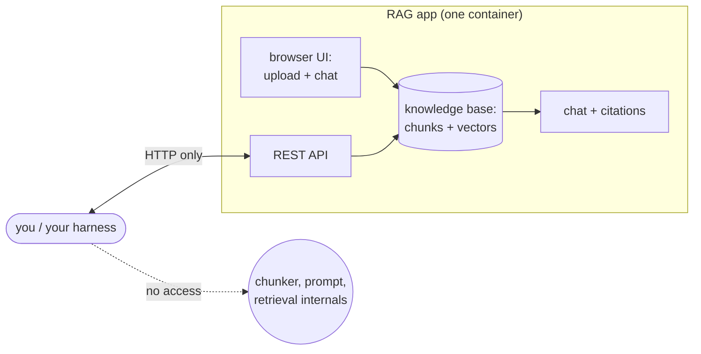

# 12 — Complete RAG Applications: Open WebUI, kotaemon, RAGFlow, and the Rest

## What you will learn

- What a complete **RAG** (Retrieval-Augmented Generation — retrieve your own documents first, then let the **LLM**, Large Language Model, answer from them) **application** gives you over library code — a **UI** (user interface), multi-user accounts, file uploads, permissions — and what it takes away (control over chunking and prompts, evaluation hooks).
- How to drive **Open WebUI** end to end through its real **API** (Application Programming Interface): creating the admin user, pushing retrieval settings, uploading the 12 papers, building a knowledge base, and chatting with citations — with the exact calls and settings we used.
- How our two scored Open WebUI configurations did on the 27-question test split: default correctness 0.500 vs hybrid-search-plus-reranker correctness 0.587 (which ties the tutorial's best code row), and why the app's retrieval metrics still trail hand-built pipelines.
- Why **kotaemon** (no scriptable chat endpoint — 368 Gradio endpoints, none stateless) and **RAGFlow** (x86-only ~9 GB image, ≥ 16 GB **RAM**, Random-Access Memory, minimum) were *not* scored here, with the honest failure reports instead of invented numbers.
- Which of the remaining apps (R2R, AnythingLLM, Onyx, PrivateGPT, txtai, Quivr, Khoj) to pick for which job, from the survey table — plus troubleshooting and exercises.

All numbers below come from `project/runs/12_findings.md` and the committed result files (`project/runs/12_openwebui_default/metrics.json`, `project/runs/12_openwebui_hybrid_rerank/metrics.json`, their `config.json`/`predictions.jsonl`/`mapping.json` companions), on the test split (n=27). No new experiments were run for this chapter. Env: Open WebUI image `ghcr.io/open-webui/open-webui:main` (probed 2026-09-09), container `rag-openwebui` at http://localhost:3010; chat/judge model `qwen3.8:27b` and embeddings `nomic-embed-text` via Ollama (a local LLM server). kotaemon image `ghcr.io/cinnamon/kotaemon:main-lite` (probed on port 7870, container stopped afterwards); RAGFlow v0.27.1 was never pulled. Deliberately not re-run: everything already committed by the implementation task.

---

## 1. What a "RAG app" gives you — and takes away

Chapters 03–11 built RAG systems out of code: you owned the chunker, the retriever, the prompt, and every metric. A complete RAG *application* flips that bargain. It gives you:

- **A UI (user interface).** Upload PDFs in a browser, ask questions in a chat box, read answers with clickable `[1]`-style citations. No Python needed for the end user.
- **Users and permissions.** Accounts, workspaces/collections, and per-collection access control — who may read which documents. Our tutorial pipelines have none of this.
- **Uploads and connectors.** Drag-and-drop files, URLs, directory sync; the app chunks, embeds and indexes behind the scenes.
- **An API (Application Programming Interface).** Most apps expose REST (Representational State Transfer) endpoints (chat, upload, knowledge-base management) so other programs can use them — which is exactly how we scored Open WebUI without touching its UI.

And it takes away:

- **Control.** Chunk size/overlap, embedding model, hybrid-search weights, reranker choice and the system prompt are whatever the app's settings page (or a single global config object) exposes. Per-collection tuning often does not exist — in Open WebUI the retrieval config is *global*, not per knowledge base (§2).
- **Evaluation hooks.** There is no "return chunk ids with scores" endpoint; you get answer text plus source snippets. To compute hit@5/recall against our golden chunk ids, the harness had to *map* the app's returned source chunks back onto our leaf ids by text overlap — a lossy bridge (§5). Internal behaviour (how many retrieval calls, what the reranker did) is unobservable: `llm_calls_per_q` is 1.0 by construction.



Rule of thumb for the whole chapter: pick library code when the scoreboard is your boss (every tunable matters); pick an app when *users* are your boss (uploads, accounts, citations in a browser beat +0.1 correctness).

---

## 2. Open WebUI walkthrough: the real API calls and settings

Open WebUI started life as a chat frontend for Ollama and grew a document/chat-with-your-files side (knowledge bases with retrieval). Our run used the Docker image `ghcr.io/open-webui/open-webui:main`, container `rag-openwebui`, UI at http://localhost:3010, with Ollama providing `qwen3.8:27b` (chat) and `nomic-embed-text` (embeddings).

### 2.1 First user becomes admin

Fresh Open WebUI has no accounts: the **first user to sign up becomes the administrator**, and there is no separate setup screen. In the harness this is one call — sign up once, keep the token (a secret string that authenticates later calls):

```text
POST /api/v1/auths/signup        ->  { "token": "<JWT — JSON Web Token>", ... }   # first user = admin
# every later call carries:  Authorization: Bearer <JWT>
```

If you open the UI instead, the same thing happens in the browser: the first signup form creates the admin. (If a colleague already signed up first, *they* are the admin — see Troubleshooting.)

### 2.2 Push the retrieval config (global, not per collection)

Retrieval settings are pushed to one global endpoint, and they apply server-wide — the default knowledge base was evaluated first under the default config, then the config was switched before the second knowledge base was created and evaluated. The keys are SCREAMING_SNAKE_CASE (all-caps with underscores); the run verified each push with an HTTP 200 (success code) plus the subsequent eval:

```text
POST /api/v1/retrieval/config/update
```

Default configuration (`project/runs/12_openwebui_default/config.json`):

| key | value |
|---|---|
| RAG_EMBEDDING_ENGINE / RAG_EMBEDDING_MODEL | `ollama` / `nomic-embed-text` |
| CHUNK_SIZE / CHUNK_OVERLAP | 1000 / 100 |
| TOP_K | 5 |
| ENABLE_RAG_HYBRID_SEARCH | `false` |
| RAG_RERANKING_MODEL | `""` (empty — no reranker) |

Hybrid + rerank configuration (`project/runs/12_openwebui_hybrid_rerank/config.json` — only three keys differ):

| key | value |
|---|---|
| ENABLE_RAG_HYBRID_SEARCH | `true` |
| RAG_RERANKING_MODEL | `cross-encoder/ms-marco-MiniLM-L-6-v2` |
| TOP_K | 5 (unchanged) |

One hedge, carried over from the findings: the config push was *accepted* by the server, but whether the server actually downloaded and ran that cross-encoder reranker versus silently ignoring the value is **not confirmed** — the score jump (§5) is consistent with reranking working, not proof of it.

### 2.3 Upload → wait → attach → chat

The document flow that actually worked against the live build (four API-shape fixes were needed on the day — apps move fast; verify against *your* running instance, not this list):

```text
POST /api/v1/files/                  ->  { "id": "<file_id>", ... }   # note: TOP-LEVEL id,
                                                                      # not data.id
GET  /api/v1/files/<file_id>         # poll until data.status == "completed"
POST /api/v1/knowledge/create        ->  { "id": "<kb_id>", ... }     # POST-only route:
                                                                      # GET /knowledge/create is 404
POST /api/v1/knowledge/<kb_id>/file/add   { "file_id": "<file_id>" }  # 400 while file is
                                                                      # still "pending" — poll first, then retry
GET  /api/v1/knowledge/              # trailing slash; /knowledge/list is 404
POST /api/chat/completions           # chat with the KB attached; model qwen3.8:27b
```

Two things that wasted time and are worth knowing: `/openapi.json` and `/docs/openapi.json` served the SPA (Single-Page Application — the web UI's `index.html`) instead of JSON on this build, so the harness `setup --verify` step degrades to a message rather than crashing; and the shell environment had to be exported manually (`set -a; . ./.env; set +a`) because `uv run` does not load `.env` by itself.

Knowledge-base ids from the runs: default `b926d4c7-ee86-4b15-ae3e-910ca499deb8`, hybrid-rerank `211addcf-1db4-43d0-8249-d6b3586f1d55`. Full 27-question evals took 963.9 s (~16 min) and 1006.1 s (~17 min) respectively — about 19–20 s per question, dominated by generation, not retrieval.

### 2.4 What a chat response looks like

Answers come back with inline `[1]`-style citations plus a top-level `sources` array (a list) shaped like `[{"source": {...}, "document": [chunk_text, ...]}]` — note `document` is a *list* of strings, not one string. A live-shape fixture is saved at `project/tests/fixtures/openwebui_chat_live.json`.

---

## 3. One answer with its citations, verbatim

Golden question `single_hop_000`: *"According to the paper, what specific type of human input does Ragas allow users to avoid when evaluating RAG architectures?"* Reference answer: `ground truth human annotations` (evidence: the RAGAS paper, 2309.15217: *"With Ragas, we put forward a suite of metrics which can be used to evaluate these different dimensions without having to rely on ground truth human annotations."*).

The hybrid-rerank KB's answer, verbatim from `project/runs/12_openwebui_hybrid_rerank/predictions.jsonl` (judge: correctness 1.0, faithfulness 1.0 — 9/9 claims supported):

```text
According to the paper, Ragas allows users to avoid relying on **ground truth human annotations** when evaluating RAG architectures [1]. The framework provides a suite of metrics for assessing different dimensions of RAG systems—such as the retrieval system's ability to identify relevant passages, the LLM's ability to exploit those passages faithfully, and the quality of the generation itself—without needing reference answers or human-labeled ground truth data [1]. The authors emphasize that this is particularly valuable because it contributes to faster evaluation cycles of RAG architectures, which is especially important given the rapid adoption of LLMs [1].
```

The default KB answered the same question nearly identically (correctness 1.0 there too) — single-hop factoids with a distinctive quote are the easy case for any configuration. The configurations separate on harder questions, which is what §5 measures.

---

## 4. RAGFlow: the honest failure report (not run — and why)

RAGFlow (an open-source deep-document-understanding RAG engine: it parses PDFs layout-first — tables, headings, figures — before chunking, and backs retrieval with Elasticsearch/Infinity) was **time-boxed out, not run**. The ~20 minutes spent established, structurally:

- RAGFlow v0.27.1 ships as a **single image with no multi-arch index — x86-only confirmed**. There is no `-slim` tag for v0.27.x (slim tags stop at v0.21.1).
- Only the **~9 GB full image** was available, on a Mac with ~300 MB free pages at check time and a Docker budget shared with other tutorials' containers.
- The documented minimum is **≥ 16 GB RAM** (Elasticsearch-backed), versus Open WebUI's single ~6.5 GB container that ran fine.
- Decision: **no 9 GB pull, no emulated run.** Helper scripts `scripts/ragflow_up.sh` / `ragflow_down.sh` exist (clone the pinned tag, UI on port 8085, API on 9385) for a future x86 machine.

Because RAGFlow never ran, there is **no RAGFlow chunk view of a table from our corpus in this tutorial** — and this chapter will not invent one. What that view *would* have shown, had the run happened: RAGFlow's parser emits table-aware chunks (cell text kept with its row/column headers) instead of the plain-text rows our `pypdf` pipeline produces, so a question about e.g. a results table in the ColBERTv2 paper would retrieve the table as one coherent chunk rather than fragments. Treat that as the reason to try RAGFlow on table-heavy corpora, not as a measured result. Its survey row (§6) is kept from the research note.

---

## 5. kotaemon: the honest failure report (probed, not scored)

kotaemon (an open-source RAG UI with hybrid + rerank + citations and pluggable GraphRAG support) was **probed live, then skipped**: image `ghcr.io/cinnamon/kotaemon:main-lite` (the only surveyed app with official arm64 — Apple-silicon-native — images), port 7870.

- The Gradio (the Python UI framework kotaemon is built on) client sees **368 named endpoints — and no stateless chat/upload endpoint exists**. `/chat_fn` takes no message argument (chat history plus UI dropdown state only); a message enters via `/submit_msg(chat_input, chat_history, conv_name, first_selector_choices)`.
- Probe 1 (`first_selector_choices=None`): server `TypeError: 'NoneType' object is not iterable` (ktem/pages/chat/__init__.py:903 in `submit_msg`).
- Probe 2 (`choices=[]`): `sqlalchemy NoResultFound` — the conversation name must already exist in the app's **server-side SQL (Structured Query Language) session database**; `/new_conv` creates it inside *browser session state*, invisible to API clients.
- Conclusion: scripted evaluation needs full UI-session replication — the Playwright (browser-automation library) fallback. Playwright was not installed (`ModuleNotFoundError`; would need `uv add playwright` plus a browser download), and a 27-question UI-driven eval exceeded the budget — so `12_kotaemon_default` / `12_kotaemon_rerank` were skipped, and the container was stopped (`just down kotaemon`; restart with `just up kotaemon` for a follow-up).

The irony, worth remembering: the only app with native Mac packaging was the only one with **no scriptable API** — native-arch support and automation-friendliness are uncorrelated.

A side note from the same session: **txtai** (NeuML, Apache-2.0 — a library, not an app) was the fastest hands-on of all: installed ephemerally (`uv run --with txtai`, *not* added to `pyproject.toml`), indexed 3 corpus papers with `all-MiniLM-L6-v2` (~90 MB download) and ran semantic search in 22 s total. Ten lines, zero infrastructure — but you author the whole RAG app yourself (no UI, no chat API). It appears in the survey as the "just give me search" option.

---

## 6. What changed on the scoreboard

| experiment | hit@5 | recall@5 | MRR | nDCG@10 | correctness | faithfulness | LLM/q | s/q |
|---|---:|---:|---:|---:|---:|---:|---:|---:|
| **02_no_retrieval** (anchor) | 0.000 | 0.000 | 0.000 | 0.000 | 0.174 | 1.000 | 1.0 | 0.0 |
| **03_naive_fixed_512_k5** (anchor) | 0.478 | 0.370 | 0.307 | 0.349 | 0.435 | 0.937 | 1.0 | 0.0 |
| **02_oracle** (anchor) | 1.000 | 0.988 | 1.000 | 1.000 | 0.543 | 0.865 | 1.0 | 0.0 |
| 07_best_combo (prior best code) | 0.652 | 0.506 | 0.609 | 0.620 | 0.587 | 0.931 | 1.0 | 5.0 |
| **12_openwebui_default** | 0.217 | 0.174 | 0.097 | 0.126 | 0.500 | 0.825 | 1.0 | 19.1 |
| **12_openwebui_hybrid_rerank** | 0.261 | 0.196 | 0.172 | 0.196 | 0.587 | 0.872 | 1.0 | 19.8 |

Hybrid + rerank beats default on *every* metric — the biggest jump is MRR (Mean Reciprocal Rank — how high the first relevant chunk ranks), 0.097 → 0.172 — and its correctness (0.587) **ties the tutorial's best code row** (`07_best_combo`, also 0.587), landing above the oracle anchor's 0.543 on correctness while far below it on retrieval. Both app rows abstain perfectly on unanswerables (1.0) — the chat template's citation instruction seems to make the model cautious.

Why apps usually score lower on a fixed benchmark, and why that is not the whole story:

1. **The config is fixed and global.** Our code sweeps chunk sizes, k, fusion weights and rerankers per experiment; the app gives you one chunking (1000/100), one TOP_K (5), one prompt. The benchmark rewards exactly the tuning the app forbids.
2. **The metric bridge is lossy.** Our scorer counts gold chunk ids; the app returns its own source chunks, mapped back via overlap. Mapping quality looked strong on smoke checks (top-1 overlap score ~1.4–1.5, ~10 strong matches in the top 10), but any miss can be the bridge, not the retriever — so read the app's *correctness* column first, retrieval columns second.
3. **Correctness is what users feel.** The reranked context is not just better ranked but cleaner to generate from: faithfulness rose 0.825 → 0.872 with hybrid + rerank. An app that answers correctly with citations in a browser, with uploads and user accounts thrown in, beats a +0.05-retrieval code pipeline nobody but you can operate. The ~19–20 s/q (seconds per question) cost is generation-dominated and cache-cold; it is a deployment detail, not a quality verdict.

---

## 7. Survey: the rest of the landscape

One-line-each rows from the research note plus the hands-on probes above — evaluated where stated, otherwise surveyed, not run. (Verba/Weaviate, archived 2026-06-08, and Cognita/TrueFoundry, archived read-only 2026-03-13, are excluded — discontinued projects do not belong in a picker table.)

| app | what it is | license | deploy | RAM | Ollama support | API | distinctive features | main drawbacks | maintenance | pick this when… |
|---|---|---|---|---|---|---|---|---|---|---|
| **Open WebUI** (evaluated §2–3, §6) | Chat frontend + knowledge bases | BSD-3-Clause | 1 container (~6.5 GB), port 3010 | runs alongside the tutorial stack | native (Ollama engine picker) | REST (auth, files, knowledge, chat) | Single container; global hybrid+rerank settings; `[1]` citations; admin workspaces | global-only config; lossy id bridge for eval; API shape drifts between builds | very active | …you want one container for chat + files + API, scored here at 0.500/0.587. |
| **kotaemon** (probed §5, not scored) | RAG UI + pipelines | Apache-2.0 | `main-lite` image, native arm64, port 7870 | modest (no Elasticsearch) | yes (provider config) | none stateless (Gradio session-bound) | hybrid + rerank + citations; pluggable GraphRAG; only native-Mac image here | no scriptable API — UI automation or nothing | active | …you live in the UI on a Mac and want GraphRAG options without x86 emulation. |
| **RAGFlow** (not run §4) | Deep-doc-parse RAG engine | Apache-2.0 | compose, ~9 GB image, UI 8085 / API 9385 | ≥ 16 GB (Elasticsearch/Infinity) | via model config | REST (datasets, chat) | layout-first parsing: table-aware chunks, figures, headings | x86-only images; heavyweight; no ARM story | very active | …your corpus is table/figure-heavy and you have an x86 box with RAM to spare. |
| **AnythingLLM** | Desktop-style private ChatGPT + workspaces | MIT | desktop or Docker, amd64+arm64 manifests | moderate | in-UI provider picker | REST + embedder API | workspaces, agents, multi-user; native Mac support | GB-size image; not exercised here | active | …you want a polished multi-user desktop/server app with Ollama in the picker. |
| **R2R** | Retrieval pipeline + API + UI | MIT | Docker compose | moderate | via config | full REST (ingest, retrieve, chat) | clean pipeline abstractions; hybrid + GraphRAG options | thinner verified Ollama docs; not exercised here | active | …you want API-first RAG with a real UI on top. |
| **Onyx** | Enterprise connectors + chat | MIT | Docker compose | moderate–high | via LLM provider settings | REST | 40+ connectors (Google Drive, Slack…); permissions mirroring | enterprise weight; not exercised here | active | …your problem is connectors and access control, not chunk tuning. |
| **PrivateGPT** | Local private documents + chat | Apache-2.0 | Docker / pip | modest | yes | REST + Gradio UI | simple recipes; Ollama-first docs | smaller feature set; not exercised here | active | …you want the smallest local private-GPT that still has an API. |
| **txtai** (hands-on §5) | Neural search library (not an app) | Apache-2.0 | `pip install`, no infra | ~90 MB model download | N/A (bring your own) | Python, not REST | 10 lines to semantic search (3 papers in 22 s here) | no UI, no chat API, no users — you build the app | active | …you need search in code fast and will author the rest yourself. |
| **Quivr** | Personal knowledge assistant | Apache-2.0 | Docker / cloud | modest | via config | REST | personal-notes UX; brain metaphor | thinner verified docs; not exercised here | active | …it is a notes-first assistant, not a benchmark maximiser. |
| **Khoj** | Personal AI search (notes + files) | AGPL-3.0 | Docker / pip | modest | yes | REST + chat | local + online hybrid; agents | AGPL copyleft; not exercised here | active | …you want personal search over notes with an open licence you accept. |

Licence/deploy/RAM/Ollama entries for the non-exercised rows are project-documentation claims, not measurements from this tutorial — verify against the running instance before committing, per the §2 lesson.

---

## 8. Advantages and disadvantages

Per app *tried* (probed or run — the surveyed-only rows stay in §7):

Open WebUI:

| | advantage | disadvantage |
|---|---|---|
| **Operability** | One ~6.5 GB container, up in minutes on this Mac; admin model is trivial (first signup). | API shape drifts between `main` builds (4 live fixes: trailing-slash list, POST-only create, top-level file id, pending-status 400) — pin the image and verify. |
| **Quality** | Hybrid + rerank 0.587 correctness ties the best code row; 0.872 faithfulness; perfect abstention (1.0). | Retrieval metrics modest (hit@5 0.261) under a fixed global config; reranker actually-running was not confirmed. |
| **Control** | Global hybrid-search toggle + reranker model + chunk size/overlap via one endpoint. | Global means *global*: two KBs cannot carry two configs at once — we evaluated sequentially. |

kotaemon:

| | advantage | disadvantage |
|---|---|---|
| **Packaging** | Only surveyed app with official arm64 images — native on this Mac. | No stateless chat/upload API (368 Gradio endpoints, session-bound SQL state) — unscorable without browser automation. |
| **Features (claimed)** | Hybrid + rerank + citations with pluggable GraphRAG. | Claims not tested here — no eval was possible in budget. |

RAGFlow:

| | advantage | disadvantage |
|---|---|---|
| **Parsing story** | Deep document understanding (table-aware chunks) — the one thing no other app here promises. | x86-only ~9 GB image + ≥ 16 GB RAM need — unrunnable on this Mac; zero measured numbers. |

txtai:

| | advantage | disadvantage |
|---|---|---|
| **Speed to first search** | `pip install` + 10 lines, 3 papers searchable in 22 s, zero infra. | It is a library: UI, chat API, users, permissions — all yours to build. |

---

## 9. Troubleshooting

| symptom | cause | fix |
|---|---|---|
| App in Docker cannot reach Ollama at `http://127.0.0.1:11435` or `localhost` | Inside a container, `localhost` is the container itself, not your Mac. | On Mac/Windows Docker, use `http://host.docker.internal:11435`. On **Linux**, `host.docker.internal` does not resolve by default — either start the container with `--add-host=host.docker.internal:host-gateway` or put Ollama on the same Docker network and use its service name. |
| No admin account / wrong person is admin in Open WebUI | The **first** signup becomes admin; there is no separate installer. | Decide who signs up first on a fresh volume. To redo: stop the container, delete its data volume, restart, sign up first. |
| `400` on `POST /knowledge/{id}/file/add` | File still embedding (`data.status == "pending"`) — attach happens before ingest finished. | Poll `GET /api/v1/files/{id}` until `data.status == "completed"`, then retry the attach. |
| `/openapi.json` returns HTML, not JSON | This build serves the SPA `index.html` for unknown routes. | Do not auto-generate a client from it on `main` builds; call the REST routes directly (§2.3). If you need a stable contract, pin a release tag instead of `main`. |
| RAGFlow compose dies / Elasticsearch exits (OOMKilled) | Elasticsearch/Infinity need ≥ 16 GB RAM; the default Docker Desktop budget is smaller. | Raise Docker memory (≥ 16 GB free), or run RAGFlow on an x86 host with real RAM; do not attempt the full image under emulation on a 8 GB Mac. |
| First question/embed is very slow, later ones fine | Cold embedding/model load: first ingest pulls `nomic-embed-text` (~274 MB) and the reranker through Ollama/HuggingFace, then warms caches. | Pre-pull models before evaluating (`ollama pull` on `rtx` for Ollama models), run one warm-up question, and only then start the timed eval. Our ~19–20 s/q rows are generation-dominated cold-ish timings. |
| kotaemon `/submit_msg` → `TypeError: 'NoneType' object is not iterable` | `first_selector_choices=None` — the endpoint needs the UI dropdown state. | Pass the selector choices from a live session, or drive the real UI with Playwright (`uv add playwright` + browser download) instead of the stateless API. |
| kotaemon `/submit_msg` → `sqlalchemy NoResultFound` | Conversation name unknown to the server-side SQL session DB (created in browser state only). | Create the conversation in the UI session first (`/new_conv` in-session), or replicate the whole session via Playwright. |
| `uv run` ignores your `.env` | `uv run` does not load `.env` automatically. | Export manually first: `set -a; . ./.env; set +a`. |

---

## 10. Exercises

1. **Flip the knobs the chapter left fixed.** Re-run the hybrid KB with `TOP_K=10` instead of 5 (one-line config push, full 27-q eval ≈ 16 min): does correctness move off 0.587, and does the MRR gain (0.097 → 0.172 last time) keep compounding?
2. **Close the reranker hedge.** Check whether `cross-encoder/ms-marco-MiniLM-L-6-v2` was actually downloaded/run on your Open WebUI instance (container logs + model cache dir) during the hybrid eval: if it was silently ignored, what explains the 0.500 → 0.587 jump — hybrid search alone? Re-run hybrid *without* the reranker key to split the two effects.
3. **Score the mapping bridge, not the app.** Take `mapping.json` from the hybrid run and compute quote-in-context presence (à la chapter 11's 17/47 diagnostic): how much of hit@5 = 0.261 is app retrieval vs overlap-mapping loss?
4. **Finish kotaemon (needs a browser).** Install Playwright, record one UI session (upload → new conversation → ask `single_hop_000`), and replay it for all 27 questions: does kotaemon's hybrid + rerank + citations beat Open WebUI's 0.587 on our corpus?

---

**Next:** [13_evaluation_and_production.md](13_evaluation_and_production.md) — RAGAS with a local judge, judge reliability, synthetic test-set pitfalls, latency and cost per variant, the final scoreboard, and the production checklist.
