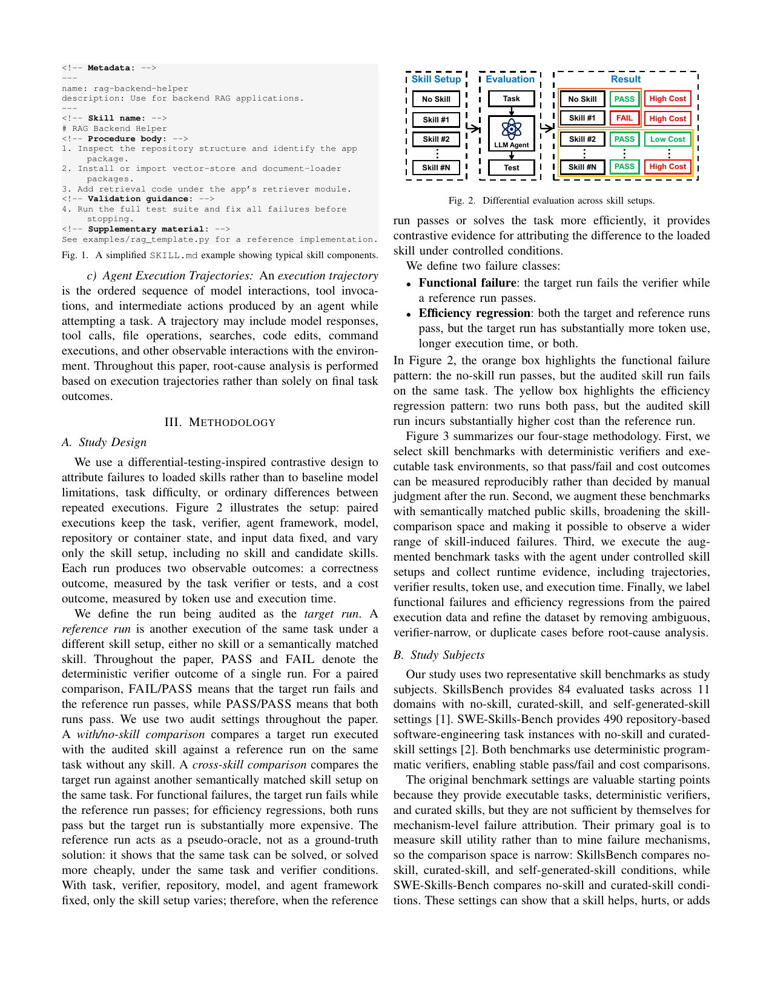

# Agent Skills Can Be Harmful: An Empirical Study of Skill-Induced Failures in LLM Agents

**Paper:** [Agent Skills Can Be Harmful: An Empirical Study of Skill-Induced Failures in LLM Agents (Dong, Gao, Li, Xu, Hua, Yang, 2026)](https://arxiv.org/abs/2608.11888)

## Human Readable TL;DR

Think of an "agent skill" as a cheat-sheet you hand to an AI coding assistant before it starts a task — a document that says "here's how to do this kind of job." These cheat-sheets usually help, but sometimes they quietly steer the assistant wrong: it follows the cheat-sheet's example instead of the actual task instructions, and either does the wrong thing or does far more work than needed. This paper is the first to systematically catch the AI "in the act" by running the same task twice — once with the cheat-sheet, once without (or with a different one) — and comparing what changed. Out of thousands of such comparisons, they confirmed 307 cases where the cheat-sheet was the cause of either a wrong answer or a huge waste of time/money, and they built a tool that can automatically diagnose which of these two problems happened and why.

## TL;DR

The paper introduces a differential-testing-inspired contrastive framework that pairs each skill-guided agent run against a no-skill or semantically matched reference run (same task/model/verifier/repo state) to attribute failures specifically to the loaded skill rather than to base-model limits or run variance. Applying this to SkillsBench and SWE-Skills-Bench (expanded 25x via public-skill retrieval to 20,664 potential comparisons), the authors confirm 307 skill-induced cases: 125 functional failures (FAIL where a reference PASSes) and 182 high-confidence efficiency regressions (both PASS but target costs >2x more in tokens and/or time). They build two taxonomies (functional-failure and efficiency-regression root causes) and a GPT-5.5-based tool, SkillTriage, that automates post-confirmation root-cause attribution with 93.6%/79.7% category accuracy for the two failure types respectively.

---

## Problem & Motivation

Agent skills (reusable `SKILL.md` instruction packages loaded into an LLM agent's context at inference time, no model retraining) are increasingly used to boost coding-agent performance by reusing procedural knowledge. Prior benchmarks (SkillsBench, SWE-Skills-Bench) already show skills help on average but also hurt some tasks — 16 of 84 tasks in SkillsBench see pass-rate drops, and token overhead reaches 451% in some SWE-Skills-Bench cases — yet nobody had explained *why* or *which skill content* causes the harm. This matters because skill marketplaces are growing, and platforms need a way to screen new/updated skills for risk rather than treating "load a relevant skill" as always safe and free. Existing evaluations couldn't isolate skill-caused failure from base-agent limitations, lacked negative test cases, and didn't scale to manual review of a growing skill ecosystem.

---

## Main Original Ideas

1. **Differential/contrastive attribution framework.** For the same task, verifier, agent, model, and repo/container state, only the skill setup varies between a "target run" (being audited) and a "reference run" (no skill, or a different semantically matched skill). If the reference passes where the target fails (or costs much less), that's contrastive evidence the *skill* — not the task or model — caused the problem. Two audit settings: with/no-skill comparison and cross-skill comparison.
2. **Functional-failure taxonomy.** Four categories covering how an on-topic skill still breaks correctness: Applicability Mismatch (wrong skill selected), Environment Mismatch (skill corrupts runtime/dependency state), Task-Implementation Fault (skill causes a wrong or missing required element — the dominant cause), and Artifact Misplacement (correct artifact, wrong location).
3. **Efficiency-regression taxonomy.** Three categories covering where wasted cost comes from when both runs pass but the target is much pricier: Context Bloat (each model call gets bigger), Excessive Procedure (skill adds extra trajectory steps like exploration/implementation/verification — the dominant cause), and Dependency Resolution (fragile dependency repair work).
4. **SkillTriage.** A GPT-5.5-based, three-stage tool (input construction → differential evidence extraction → attribution) that takes an already-confirmed target/reference failure pair and automatically predicts the taxonomy category/subcategory plus cited evidence and a repair suggestion, using majority vote over 3 runs.

---

## Key Findings

**Functional failures (125 confirmed cases) — Table III**

| Category | Subcategory | Count | % |
|---|---|---|---|
| Applicability Mismatch | — | 2 | 1.6% |
| Environment Mismatch | Broken Dependency/Runtime + Env-State Mismatch | 13 | 10.4% |
| Task-Implementation Fault | Obstructive Workflow Guidance | 4 | 3.2% |
| Task-Implementation Fault | Incorrect Required-Element Fill | 46 | 36.8% |
| Task-Implementation Fault | Required-Element Omission | 36 | 28.8% |
| Task-Implementation Fault | **Subtotal** | **86** | **68.8%** |
| Artifact Misplacement | — | 24 | 19.2% |

**Efficiency regressions (182 confirmed cases, T=2.0 threshold) — Table IV**

| Category | Subcategory | Count | % |
|---|---|---|---|
| Context Bloat | Skill-Body Bloat + Supplementary-Material Bloat | 46 | 25.3% |
| Excessive Procedure | Excessive Exploration | 17 | 9.3% |
| Excessive Procedure | Heavy Implementation Pipeline | 30 | 16.5% |
| Excessive Procedure | Excessive Verification | 67 | 36.8% |
| Excessive Procedure | **Subtotal** | **114** | **62.6%** |
| Dependency Resolution | — | 22 | 12.1% |

**SkillTriage attribution accuracy**

| Failure type | Category acc. | Exact subcategory acc. | Largest-subgroup acc. |
|---|---|---|---|
| Functional failures (125) | 117/125 (93.6%) | 111/125 (88.8%) | TIF: 76/86 (88.4%) |
| Efficiency regressions (182) | 145/182 (79.7%) | 132/182 (72.5%) | EP: 78/114 (68.4%) |

- **Finding 1:** Only 2/125 (1.6%) failures are Applicability Mismatch — skills almost never fail by being off-topic; they fail by corrupting implementation of on-topic requirements (Task-Implementation Fault = 68.8%).
- **Finding 2:** Environment Mismatch (10.4%) + Artifact Misplacement (19.2%) show a large share of failures happen at "execution-surface boundaries" (environment state, file location) rather than in core task logic.
- **Finding 3:** Context-overhead regressions are almost entirely from mandatory skill-body text (Skill-Body Context Bloat = 43/46 context cases), not supplementary materials.
- **Finding 4:** Efficiency regressions are dominated by Excessive Procedure (62.6%), not prompt length — mainly Excessive Verification (67 cases) and Heavy Implementation Pipeline (30 cases).

---

## Suggestions & Future Directions

1. **Skill-task compatibility checks** — before/during execution, compare task-required fields, APIs, paths, output formats, and environment constraints against a candidate skill's content to flag conflicting defaults, examples, or package-state assumptions.
2. **Cost-aware skill packaging and selection** — estimate a skill's marginal context cost, move examples/checklists to lazy-loaded references instead of always-loaded text, and predict the extra exploration/verification/repair work a skill is likely to induce before selecting it.
3. **Budget-aware execution policies** — treat loading a skill as a decision governed by an explicit cost/correctness budget, not a free, always-beneficial action.
4. **Threats to validity (caveats):** Root-cause labeling is human-judgment-based (mitigated via exclusion of ambiguous cases, group consensus, and SkillTriage as an independent cross-check). Findings come from two benchmarks, one agent harness (OpenCode 1.15.1), one model (Claude Opus 4.6), and two skill-sharing sites (smithery.ai, skillsmp.com) — results may not fully generalize beyond this setup, though the authors avoided benchmark-specific conclusions.

---

## Authors & Institutions

Gen Dong (Huazhong University of Science and Technology), Yanjie Gao (Microsoft Research), Liqun Li (Microsoft), Tianyin Xu (University of Illinois Urbana-Champaign), Yu Hua (Huazhong University of Science and Technology), Fan Yang (Microsoft Research).

## Figures

