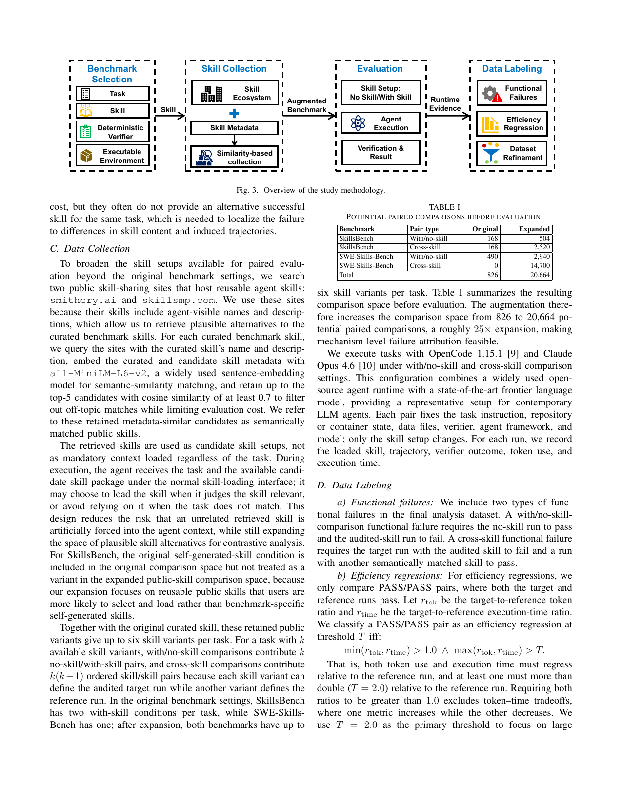

> [[../index|Wiki]] | [[../summary|Summary]] | [[../digest|Digest]]

# Problem, Background, and Methodology

**In one sentence:** Because "agent skills" (reusable SKILL.md instruction packages loaded into an LLM agent's context) can be topically relevant yet operationally wrong, the paper builds a differential-testing-inspired contrastive framework — pairing each skill-guided run against a no-skill or semantically matched-skill reference run — to attribute 307 confirmed functional failures and efficiency regressions to specific skills across SkillsBench and SWE-Skills-Bench.

## Key points

- An **agent skill** is a structured package of procedural knowledge, usually organized around a named `SKILL.md` file, that augments an LLM agent at inference time (no model-parameter changes) and can shape planning, repository exploration, tool use, code edits, tests, and the stopping decision. A skill typically bundles four kinds of content: (1) metadata (name, description, frontmatter, when-to-use text) that signals applicability, (2) a main body of procedural guidance (steps, rules, workflow constraints, checklists), (3) supplementary files (examples, templates, schemas, scripts) loaded on demand, and (4) validation guidance (suggested tests, expected outputs, completion criteria).
- Prior skill benchmarks already hint at the risk but don't explain it: SkillsBench shows average gains from curated skills yet pass-rate drops on 16 of 84 tasks; SWE-Skills-Bench shows limited average improvement, many skills with no pass-rate gain, and token overhead up to 451% in some cases.
- Existing evaluations have four gaps this paper targets: (1) they measure outcome-level pass/fail and cost but cannot isolate/attribute a failure to the specific loaded skill versus base-agent limits, verifier scope, or run-to-run variance; (2) original benchmark skill settings were designed to measure utility, not to surface failure mechanisms, so they offer few negative cases; (3) aggregate metrics don't explain *how* a skill changes the agent's trajectory; (4) manual attribution doesn't scale to marketplaces where new/updated skills need continuous screening.
- The core methodological device is a **differential-testing-inspired contrastive design**: for the same task, verifier, agent framework, model, and repository/container state, only the skill setup varies (no skill vs. a candidate skill, or one skill vs. another). The audited execution is the **target run**; a **reference run** is another execution of the same task under a different skill setup (no-skill, or a semantically matched skill), acting as a pseudo-oracle (not ground truth) that shows the task *can* be solved, or solved more cheaply. Two audit settings are used throughout: **with/no-skill comparison** (target-with-skill vs. reference-no-skill) and **cross-skill comparison** (target skill vs. another semantically matched skill).
- Two failure classes are defined from paired outcomes: a **functional failure** is when the target run fails the verifier while the reference run passes (FAIL/PASS); an **efficiency regression** is when both runs pass (PASS/PASS) but the target run costs substantially more in tokens and/or time. The efficiency-regression threshold is formalized as: with rtok = target-to-reference token ratio and rtime = target-to-reference execution-time ratio, a PASS/PASS pair counts as a regression at threshold T iff **min(rtok, rtime) > 1.0 AND max(rtok, rtime) > T**, with primary threshold **T = 2.0** — i.e., both metrics must worsen (excluding token/time tradeoffs) and at least one must more than double.
- The study augments two benchmarks (SkillsBench: 84 tasks / 11 domains; SWE-Skills-Bench: 490 repository-based SWE task instances) with public skills retrieved from smithery.ai and skillsmp.com, matched via all-MiniLM-L6-v2 sentence embeddings with cosine similarity ≥ 0.7, keeping up to the top-5 candidates per curated skill. This expands the potential paired-comparison space roughly 25× — from 826 to 20,664 (Table I) — enabling mechanism-level attribution that the original narrow benchmark settings could not support.
- Execution used OpenCode 1.15.1 as the agent runtime and Claude Opus 4.6 as the model, recording for every run the loaded skill, execution trajectory, verifier outcome, token use, and execution time; from the 20,664 potential comparisons, 665 labeled candidates were identified (315 functional-failure candidates, 350 efficiency-regression candidates), which were then refined (removing low-evidence, verifier-artifact, and duplicate cases) down to **307 confirmed skill-induced failures: 125 functional failures and 182 high-confidence efficiency regressions** (Table II).

---

## II. Background

### A. Agent skills in LLM agents

An agent skill is a structured package of procedural knowledge that augments an LLM agent at inference time without modifying model parameters. In current agent systems a skill is usually organized around a named `SKILL.md` file; the skill framework selects one or more skills for a task and loads their contents into the agent's context. Once loaded, a skill can influence planning, repository exploration, tool use, code edits, tests, and the stopping decision.

### B. Skill contents

A skill typically contains four kinds of information:

1. **Metadata** — skill name, description, frontmatter, or when-to-use text that signals when the skill applies.
2. **Main body** — procedural guidance: task-solving steps, implementation rules, workflow constraints, checklists.
3. **Supplementary files** — examples, templates, schemas, scripts, reference documents loaded on demand.
4. **Validation guidance** — suggested tests, expected outputs, debugging steps, completion criteria.

These components matter because they become part of the agent's *effective task context* rather than passive documentation. The paper illustrates this with a simplified `rag-backend-helper` SKILL.md example, showing how a description provides an applicability signal, repository/module wording can shape where the agent writes artifacts, dependency instructions can alter the execution environment, and verification checklists can add procedure cost — i.e., a skill can help via reusable knowledge, but can also mislead the agent when its assumptions don't match the concrete task.


### C. Agent execution trajectories

An execution trajectory is the ordered sequence of model interactions, tool invocations, and intermediate actions produced while an agent attempts a task (model responses, tool calls, file operations, searches, code edits, command executions). Root-cause analysis in this paper is performed on execution trajectories, not merely on final task outcomes.

## III. Methodology

### A. Study Design

The study uses a **differential-testing-inspired contrastive design** to attribute failures to loaded skills rather than to baseline model limitations, task difficulty, or ordinary run-to-run variance. Paired executions keep the task, verifier, agent framework, model, repository/container state, and input data fixed, and vary only the skill setup (including "no skill" and candidate skills). Each run produces two observable outcomes: a **correctness outcome** (verifier/tests: PASS or FAIL) and a **cost outcome** (token use and execution time).

- The **target run** is the run being audited.
- A **reference run** is another execution of the same task under a different skill setup — either no skill or a semantically matched skill.
- For a paired comparison: **FAIL/PASS** means the target run fails and the reference run passes; **PASS/PASS** means both runs pass.
- Two audit settings are used throughout:
  - **With/no-skill comparison** — target run (with the audited skill) vs. reference run (no skill), same task.
  - **Cross-skill comparison** — target run (audited skill) vs. reference run (another semantically matched skill setup), same task.

The reference run acts as a **pseudo-oracle**, not a ground-truth solution: it demonstrates the same task can be solved, or solved more cheaply, under otherwise identical conditions. Because only the skill setup varies, when the reference run passes or is cheaper, this is contrastive evidence attributing the difference to the loaded skill.

Two failure classes are defined:

- **Functional failure:** the target run fails the verifier while a reference run passes.
- **Efficiency regression:** both the target and reference runs pass, but the target run has substantially higher token use, longer execution time, or both.

In Figure 2 (skill-setup diagram), the functional-failure pattern is a no-skill run that passes paired with an audited-skill run that fails; the efficiency-regression pattern is two passing runs where the audited-skill run costs substantially more.

Figure 3 summarizes the study's four-stage methodology:

1. **Benchmark Selection** — choose skill benchmarks with deterministic verifiers and executable task environments, so pass/fail and cost outcomes are reproducible rather than manually judged.
2. **Skill Collection** — augment benchmarks with semantically matched public skills (from the skill ecosystem), broadening the skill-comparison space via similarity-based collection.
3. **Evaluation** — execute the augmented benchmark tasks under controlled no-skill/with-skill setups, collecting runtime evidence (trajectories, verifier results, token use, execution time).
4. **Data Labeling** — label functional failures and efficiency regressions from paired execution data, then refine the dataset (removing ambiguous, verifier-narrow, or duplicate cases) before root-cause analysis.



### B. Study Subjects

Two representative skill benchmarks serve as study subjects:

- **SkillsBench** — 84 evaluated tasks across 11 domains, with no-skill, curated-skill, and self-generated-skill settings.
- **SWE-Skills-Bench** — 490 repository-based software-engineering task instances, with no-skill and curated-skill settings.

Both use deterministic programmatic verifiers, enabling stable pass/fail and cost comparisons. However, their original settings are not sufficient by themselves for mechanism-level failure attribution: their primary goal is to measure skill *utility*, not to mine failure mechanisms, so the comparison space is narrow (SkillsBench: no-skill/curated/self-generated; SWE-Skills-Bench: no-skill/curated only) and they often lack an alternative *successful* skill for the same task — which is needed to localize a failure to differences in skill content and induced trajectories.

### C. Data Collection

To broaden available skill setups beyond the original benchmarks, the authors query two public skill-sharing sites — **smithery.ai** and **skillsmp.com** — chosen because their skills expose agent-visible names and descriptions, allowing retrieval of plausible alternatives to curated benchmark skills.

**Public-skill augmentation procedure:**

1. For each curated benchmark skill, query both sites using the curated skill's name and description.
2. Embed curated and candidate skill metadata with **all-MiniLM-L6-v2** (a widely used sentence-embedding model) for semantic-similarity matching.
3. Retain up to the **top-5 candidates** with **cosine similarity ≥ 0.7**, filtering out off-topic matches while limiting evaluation cost.
4. These retained candidates are called **semantically matched public skills**.

Retrieved skills are candidate skill setups, not mandatory context: the agent receives the task plus the available candidate skill package under the normal skill-loading interface and may choose to load it (or not) depending on relevance — reducing the risk of an unrelated skill being artificially forced into context while still expanding the space of plausible alternatives. For SkillsBench, the original self-generated-skill condition remains part of the original comparison space but is not treated as a variant in the expanded public-skill space, since the expansion targets reusable public skills users are likely to actually select.

Together with the original curated skill, this yields **up to six skill variants per task**. For a task with *k* available skill variants: with/no-skill comparisons contribute *k* no-skill/with-skill pairs, and cross-skill comparisons contribute *k(k−1)* ordered skill/skill pairs (each variant can serve as target or reference).

**Table I — Potential paired comparisons before evaluation**

| Benchmark | Pair type | Original | Expanded |
|---|---|---|---|
| SkillsBench | With/no-skill | 168 | 504 |
| SkillsBench | Cross-skill | 168 | 2,520 |
| SWE-Skills-Bench | With/no-skill | 490 | 2,940 |
| SWE-Skills-Bench | Cross-skill | 0 | 14,700 |
| **Total** | | **826** | **20,664** |

The augmentation increases the comparison space from 826 to 20,664 potential paired comparisons — roughly a **25× expansion** — making mechanism-level failure attribution feasible.

Tasks were executed with **OpenCode 1.15.1** as the agent runtime and **Claude Opus 4.6** as the model, under with/no-skill and cross-skill comparison settings. This pairs a widely used open-source agent runtime with a state-of-the-art frontier model, representative of contemporary LLM agents. Each pair fixes task instruction, repository/container state, data files, verifier, agent framework, and model; only the skill setup changes. For every run, the paper records the loaded skill, trajectory, verifier outcome, token use, and execution time.

### D. Data Labeling

**a) Functional failures** — two types are included in the final dataset:
- A **with/no-skill-comparison functional failure** requires the no-skill run to pass and the audited-skill run to fail.
- A **cross-skill functional failure** requires the target run (audited skill) to fail and a run with another semantically matched skill to pass.

**b) Efficiency regressions** — only PASS/PASS pairs are compared. Let rtok be the target-to-reference token ratio and rtime the target-to-reference execution-time ratio. A PASS/PASS pair is classified as an efficiency regression at threshold T iff:

```
min(rtok, rtime) > 1.0  AND  max(rtok, rtime) > T
```

That is, both token use and execution time must regress relative to the reference run (this excludes token–time tradeoffs where one metric improves while the other worsens), and at least one ratio must exceed T. The paper uses **T = 2.0** as the primary threshold (i.e., at least one of token use or execution time must more than double) to focus on large cost regressions and reduce sensitivity to small fluctuations. Each efficiency regression is further labeled as token-dominant, time-dominant, or joint token-and-time, according to which ratio exceeds T.

**c) Dataset refinement** — From the 20,664 potential paired comparisons (Table I), executed evaluations yield **665 labeled candidates**: 315 functional-failure candidates and 350 efficiency-regression candidates. Candidates with insufficient evidence, likely verifier-induced false positives, or duplicate same-task/same-skill effects are removed; when the same failure appears in both with/no-skill and cross-skill audits, the with/no-skill instance is kept. Each remaining case is then manually inspected, assigned one root-cause label, and finalized through group consensus.

**Table II — Failure dataset construction from labeled candidates to final analysis cases**

| Failure Type | Audit setting | Labeled candidates | Analysis cases |
|---|---|---|---|
| Functional failure | With/no-skill | 70 | 38 |
| Functional failure | Cross-skill | 245 | 87 |
| Functional failure | **Subtotal** | **315** | **125** |
| Efficiency regression | With/no-skill | 159 | 128 |
| Efficiency regression | Cross-skill | 191 | 54 |
| Efficiency regression | **Subtotal** | **350** | **182** |
| **Total** | | **665** | **307** |

For functional failures, the with/no-skill audit starts from 70 automatically identified with-skill-FAIL/no-skill-PASS candidate records (50 from SWE-Skills-Bench, 20 from SkillsBench); the cross-skill audit starts from 245 failed with-skill records in tasks where at least one skill run passes and another fails (131 from SWE-Skills-Bench, 114 from SkillsBench). For efficiency regressions, labeled candidates are threshold-triggering cost-regression candidates identified under the primary T = 2.0 threshold before refinement: 159 from with/no-skill audits and 191 from cross-skill audits.

After refinement, the final analysis dataset contains **307 confirmed skill-induced failures: 125 functional failures and 182 high-confidence efficiency regressions.**

---

**Covers:** Section I (Introduction), Section II (Background), Section III (Methodology)
