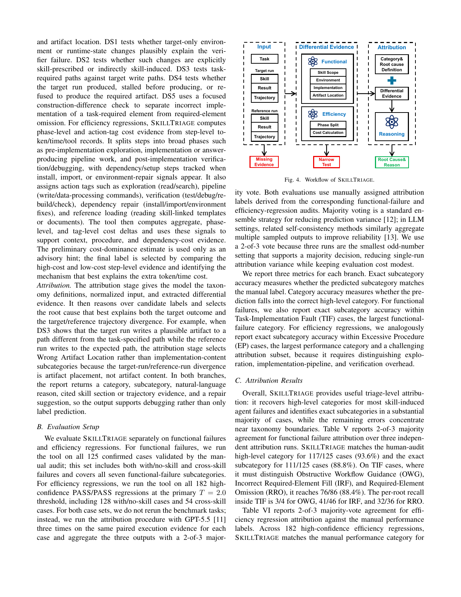

> [[../index|Wiki]] | [[../summary|Summary]] | [[../digest|Digest]]

# SkillTriage: Automated Attribution Tool

**In one sentence:** SkillTriage is a lightweight GPT-5.5-based tool that, given an already-confirmed skill-induced failure or regression paired with its reference run, operationalizes the manual taxonomy as a three-stage attribution procedure (input construction, differential evidence, attribution) and reproduces the human-audit category/subcategory labels with high accuracy (93.6%/88.8% for functional failures, 79.7%/72.5% for efficiency regressions), showing that automated triage is viable for post-confirmation labeling even though residual errors still cluster at taxonomy boundaries.

## Key points

- SkillTriage is explicitly a **post-confirmation triage** tool, not a taxonomy-creation or manual-validation-replacement tool: it only runs on target/reference pairs that have already been identified as skill-induced failures.
- Its core design principle is to turn the manual taxonomy into an **evidence checklist**: functional failures require skill-scope, runtime, artifact-construction, or task-path evidence; efficiency regressions require context, procedure, or dependency-cost evidence.
- The pipeline has three stages: **input construction** (normalizes the case into a task view plus target-run and reference-run views, with deterministic evidence gates checking minimum trajectory/skill/verifier evidence), **differential evidence extraction** (five signals DS1–DS5 for functional failures, phase/action-tag cost evidence for efficiency regressions), and **attribution** (reasons over candidate labels using the taxonomy definitions, normalized input, and extracted evidence).
- Evaluated with **GPT-5.5**, 3 independent runs per case, aggregated by **2-of-3 majority vote**, on **all 125 confirmed functional failures** and **all 182 high-confidence PASS/PASS efficiency regressions** (at the primary T = 2.0 threshold).
- Functional-failure attribution (Table V): **117/125 (93.6%)** category match, **111/125 (88.8%)** exact subcategory match, **76/86 (88.4%)** exact subcategory match within Task-Implementation Fault (TIF) cases.
- Efficiency-regression attribution (Table VI): **145/182 (79.7%)** category match, **132/182 (72.5%)** exact subcategory match, **78/114 (68.4%)** exact subcategory match within Excessive Procedure (EP) cases.
- Residual errors are boundary errors rather than random misses: functional-failure errors concentrate near the IRF/RRO boundary and the Environment Mismatch (EM)/Wrong Artifact Location (WAL) boundary; efficiency-regression errors concentrate near the Excessive Exploration (EE)/Heavy Implementation Pipeline (HIP)/Excessive Verification (EV) boundary.
- The tool's output is designed to support debugging, not just labeling: each report returns category, subcategory, natural-language reason, cited skill section or trajectory evidence, and a repair suggestion.

---

## What SkillTriage does and why

As reusable skills become part of agent platforms and skill marketplaces, the paper argues that failure analysis must eventually move beyond one-off manual audits. SkillTriage is built to explore this use case: it is a lightweight LLM-based tool for **post-confirmation triage** — given a target/reference pair already identified as a skill-induced agent failure, it predicts the high-level category and subcategory and returns contrastive evidence for that attribution.

Two scope boundaries matter here:
- SkillTriage is **not** used to create the taxonomy (the taxonomy comes from the manual audit described elsewhere in the paper).
- SkillTriage is **not** used to replace manual validation — it is evaluated against manually assigned labels, functioning as an independent consistency check rather than a substitute for human judgment.

The key design insight is that the manual taxonomy can be **operationalized as an attribution procedure**, not merely used as a static set of labels. The diagnostic principle: ask which label best explains both (a) the target outcome (failure or extra cost) and (b) the divergence between the target-run and reference-run trajectories. Each category thus acts as an evidence checklist — functional failures require skill-scope, runtime, artifact-construction, or task-path evidence, while efficiency regressions require context, procedure, or dependency-cost evidence.

## The three-stage pipeline

Figure 4 organizes SkillTriage into three stages: input construction, differential-evidence extraction, and attribution.

### Stage 1: Input construction

SkillTriage first normalizes each paired case into a shared **task view** and two **run views**:
- The **target-run view** records the loaded skill, result, and trajectory.
- The **reference-run view** records the no-skill or matched-skill setup, result, and trajectory.

At this stage, **deterministic evidence gates** check whether the case has the minimum trajectory, skill, and verifier evidence needed for attribution — filtering out cases that lack enough signal before any LLM reasoning happens.

### Stage 2: Differential evidence

Rather than asking the model to infer all evidence directly from raw traces, SkillTriage turns taxonomy boundaries into explicit differential signals.

**For functional failures**, it computes five differential signals (DS1–DS5) over functional-evidence surfaces (skill scope, environment, implementation, artifact location):

- **DS1** — tests whether target-only environment or runtime-state changes plausibly explain the verifier failure.
- **DS2** — tests whether such changes are explicitly skill-prescribed or indirectly skill-induced.
- **DS3** — tests task-required paths against target write paths.
- **DS4** — tests whether the target run produced, stalled before producing, or refused to produce the required artifact.
- **DS5** — uses a focused construction-difference check to separate incorrect implementation of a task-required element from required-element omission.

**For efficiency regressions**, SkillTriage computes phase-level and action-tag cost evidence from step-level token/time/tool records:

- **Phase split**: steps are split into broad phases — **pre-implementation exploration**, **implementation or answer-producing pipeline work**, and **post-implementation verification/debugging** — with **dependency/setup steps** tracked separately whenever install, import, or environment-repair signals appear.
- **Action tags**: each step is also tagged as **exploration** (read/search), **pipeline** (write/data-processing commands), **verification** (test/debug/rebuild/check), **dependency repair** (install/import/environment fixes), or **reference loading** (reading skill-linked templates or documents).
- The tool computes aggregate, phase-level, and tag-level cost deltas from these tags to support context, procedure, and dependency-cost evidence. A preliminary cost-dominance estimate is produced but used only as an **advisory hint** — the final label comes from comparing high-cost and low-cost step-level evidence to identify the mechanism that best explains the extra token/time cost.

### Stage 3: Attribution

The attribution stage gives the model the taxonomy definitions, the normalized input, and the extracted differential evidence, then reasons over candidate labels to select the root cause that best explains both the target outcome and the target/reference trajectory divergence.

Example given in the paper: when DS3 shows the target run writes a plausible artifact to a path different from the task-specified path, while the reference run writes to the expected path, the attribution stage selects **Wrong Artifact Location** rather than an implementation-content subcategory — because the divergence observed is about artifact placement, not artifact content.

In both branches (functional failures and efficiency regressions), the report returns: a category, a subcategory, a natural-language reason, cited skill section or trajectory evidence, and a repair suggestion — so the output supports debugging, not just label prediction.

## Evaluation setup

SkillTriage is evaluated separately on functional failures and efficiency regressions:

- **Functional failures**: run on all **125 confirmed cases** validated by the manual audit, including both with/no-skill and cross-skill failures, covering all seven functional-failure subcategories.
- **Efficiency regressions**: run on all **182 high-confidence PASS/PASS regressions** at the primary T = 2.0 threshold, including 128 with/no-skill cases and 54 cross-skill cases.

For both sets, the benchmark tasks are not rerun; instead, the attribution procedure runs with **GPT-5.5** three times on the same paired execution evidence per case, and the three outputs are aggregated with a **2-of-3 majority vote**. Majority voting is used as a standard ensemble strategy for reducing prediction variance (analogous to self-consistency methods that aggregate multiple sampled LLM outputs for reliability); 3 runs is the smallest odd-number setting that supports a majority decision, balancing variance reduction against evaluation cost.

Three metrics are reported per branch:
- **Exact subcategory accuracy** — predicted subcategory matches the manual label.
- **Category accuracy** — prediction falls into the correct high-level category.
- For functional failures: exact subcategory accuracy restricted to **Task-Implementation Fault (TIF)** cases, the largest functional-failure category.
- For efficiency regressions: exact subcategory accuracy restricted to **Excessive Procedure (EP)** cases, the largest performance category and a challenging attribution subset because it requires distinguishing exploration, implementation-pipeline, and verification overhead.

## Attribution results

Overall, SkillTriage provides useful triage-level attribution: it recovers the high-level category for most skill-induced agent failures and identifies the exact subcategory in a substantial majority of cases, with remaining errors concentrated near taxonomy boundaries.

**Functional failures** (Table V, 2-of-3 majority agreement over 3 independent runs): SkillTriage matches the human-audit high-level category for **117/125 (93.6%)** cases and the exact subcategory for **111/125 (88.8%)** cases. Within TIF cases — where it must distinguish Obstructive Workflow Guidance (OWG), Incorrect Required-Element Fill (IRF), and Required-Element Omission (RRO) — it reaches **76/86 (88.4%)**. Per-root recall inside TIF: 3/4 for OWG, 41/46 for IRF, 32/36 for RRO.

**Efficiency regressions** (Table VI, 2-of-3 majority-vote agreement against manual performance labels, across 182 high-confidence regressions): SkillTriage matches the manual performance category for **145/182 (79.7%)** cases and the exact subcategory for **132/182 (72.5%)** cases. Within the EP subset, it reaches **78/114 (68.4%)** exact subcategory agreement, reflecting the difficulty of separating Excessive Exploration (EE), Heavy Implementation Pipeline (HIP), and Excessive Verification (EV).

### Residual / boundary errors

The residual errors in both branches are **boundary errors**: the same differential evidence can support neighboring taxonomy labels.

- **Functional failures**: the 2-of-3 majority leaves 14/125 exact-subcategory errors, concentrated near the **IRF/RRO** boundary and the **Environment Mismatch (EM)/Wrong Artifact Location (WAL)** boundary. Example: when a required helper function is implicit in the task, the tool may classify its absence as an incorrect implementation of nearby code rather than as a required-element omission.
- **Efficiency regressions**: the 50/182 exact-subcategory errors often arise when one high-cost trajectory contains several plausible cost surfaces — e.g., dependency repair inside a verification loop, skill-body cost inflating test steps, or build commands that could be classified as implementation or verification. This is the **EE/HIP/EV** boundary.

This error structure suggests that automated attribution should expose the exact skill section, trajectory step, artifact difference, or cost-heavy step used as evidence, not only the final label — reinforcing the design choice to return cited evidence and repair suggestions alongside labels.

## Table V — Functional Failure Attribution Results

| Subset | Subcategory | Category | TIF subcat. |
|---|---|---|---|
| With/no-skill | 35/38 (92.1%) | 37/38 (97.4%) | 15/17 (88.2%) |
| Cross-skill | 76/87 (87.4%) | 80/87 (92.0%) | 61/69 (88.4%) |
| **Combined** | **111/125 (88.8%)** | **117/125 (93.6%)** | **76/86 (88.4%)** |

## Table VI — Efficiency Regression Attribution Results

| Subset | Subcategory | Category | EP subcat. |
|---|---|---|---|
| With/no-skill | 98/128 (76.6%) | 102/128 (79.7%) | 49/69 (71.0%) |
| Cross-skill | 34/54 (63.0%) | 43/54 (79.6%) | 29/45 (64.4%) |
| **Combined** | **132/182 (72.5%)** | **145/182 (79.7%)** | **78/114 (68.4%)** |

---

**Covers:** Section VI (Automated Attribution of Skill-Induced Agent Failures)
