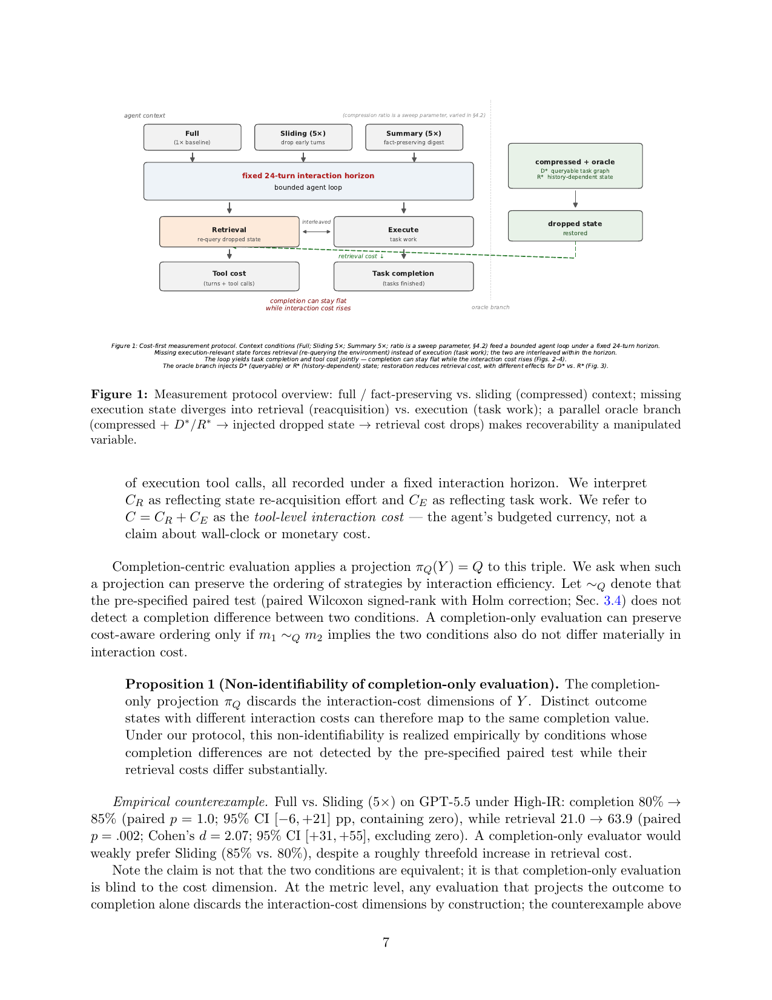

> [[../index|Wiki]] | [[../summary|Summary]] | [[../digest|Digest]]

# Method

**In one sentence:** By measuring each context condition as a triple (completion, retrieval calls, execution calls) under a fixed 24-turn horizon, and by treating dropped-state availability as a manipulated oracle variable, the paper's protocol exposes interaction cost as the dimension that completion-only evaluation discards.

## Key points

- The evaluation outcome is the triple Y(m) = (Q(m), C_R(m), C_E(m)) — completion rate, retrieval tool calls, execution tool calls — with tool-level interaction cost C = C_R + C_E treated as the agent's budgeted currency, not wall-clock or monetary cost (Definition 1).
- Proposition 1: the completion-only projection π_Q discards the cost dimensions of Y, so completion-only evaluation is non-identifiable; empirically, Full vs. Sliding (5×) on GPT-5.5 High-IR shows completion 80% → 85% (paired p = 1.0; 95% CI [−6, +21] pp) but retrieval 21.0 → 63.9 (p = .002; Cohen's d = 2.07; 95% CI [+31, +55]) — a ~3× retrieval increase invisible to completion.
- Cost-aware dominance is a two-dimensional Pareto relation on (Q, C): Summary vs. Sliding 5× on DeepSeek High sees completion 83% vs. 72% and cost 39.0 vs. 71.4, the cost gap attributed almost entirely to retrieval (19.5 vs. 55.1; execution 19.5 vs. 16.3).
- The "completion-insensitivity region" is a descriptive (not equivalence-test) label for (ratio, model) pairs where ΔC_R is detectable but completion change is not (Cohen's d ≥ 0.5 secondary criterion); GPT-5.5 High at 5× lies inside, DeepSeek leaves at 10×, Qwen High sits at the boundary.
- The environment **IRBench** is a deterministic 10-task project-planning world with a retrieval/execution tool split (`get_task_info`, `check_dependency`, `query_resource` vs. `execute`), high-IR and low-IR regimes, fixed 24-turn horizon (each turn = one model call plus tool results), and completion judged by how many of the ten tasks finish at horizon end.
- Context conditions are operators applied online, re-built every turn: **Sliding** (deletion, token budget r ∈ {1.7×, 2.5×, 5×, 10×}, keeps most recent turns), **Summary** (same budget, dropped turns replaced by an extractive fact digest, zero extra LLM calls), and **Oracle** (the specific dropped state string injected as a trailing message in a fixed position).
- The oracle splits dropped state into two recoverability classes: D* (externally queryable — task graph, prerequisites, resource occupancy) and R* (history-dependent — revealed constraints, failure counts, held resources), making recoverability a manipulated independent variable.
- Protocol: 10 seeds, 10 task instances per seed (100 task-level observations per condition); per-seed paired Wilcoxon signed-rank + bootstrap 95% CIs; primary family = six retrieval comparisons (3 models × 2 regimes) with Holm–Bonferroni at α = 0.05 (five of six remain significant); models DeepSeek (deepseek-v4-flash), Qwen (qwen3.7-plus), GPT-5.5, all at temperature 0.3, no extended thinking.
- Retention interventions (Sec. 3.5) act at fixed compaction point turn 10 (t_c) under digest budget B ∈ {265, 100, 50} tokens — an independent axis from compression ratio — with a candidate universe of atoms observed before t_c; the pre-registered primary is RAR-D vs. Sliding on retrieval cost (criterion ΔC_R ≤ −30%, 95% CI excluding zero); D-Irrelevant is a transparent post-hoc sequential diagnostic replacing D atoms with fabricated out-of-universe state.

---

## Evaluation outcomes, projections, and non-identifiability

The paper formalizes the object it measures (Def. 1):

**Definition 1 (Evaluation outcome).** Y(m) = (Q(m), C_R(m), C_E(m)), where Q is the task completion rate, C_R the number of retrieval tool calls, and C_E the number of execution tool calls, all recorded under a fixed interaction horizon. C_R is interpreted as state re-acquisition effort and C_E as task work. C = C_R + C_E is the *tool-level interaction cost* — the agent's budgeted currency, not a claim about wall-clock or monetary cost.

Completion-centric evaluation applies the projection π_Q(Y) = Q. Let ∼_Q denote that the pre-specified paired test (paired Wilcoxon signed-rank with Holm correction; Sec. 3.4) does not detect a completion difference between two conditions. A completion-only evaluation can preserve cost-aware ordering only if m_1 ∼_Q m_2 implies the two conditions also do not differ materially in interaction cost.

**Proposition 1 (Non-identifiability of completion-only evaluation).** The completion-only projection π_Q discards the interaction-cost dimensions of Y; distinct outcome states with different interaction costs can therefore map to the same completion value. Under the protocol this non-identifiability is realized empirically by conditions whose completion differences are not detected by the pre-specified paired test while their retrieval costs differ substantially.

**Empirical counterexample.** Full vs. Sliding (5×) on GPT-5.5 under High-IR: completion 80% → 85% (paired p = 1.0; 95% CI [−6, +21] pp, containing zero), while retrieval 21.0 → 63.9 (paired p = .002; Cohen's d = 2.07; 95% CI [+31, +55], excluding zero). A completion-only evaluator would weakly prefer Sliding (85% vs. 80%) despite a roughly threefold increase in retrieval cost. The claim is not that the conditions are equivalent but that completion-only evaluation is blind to the cost dimension; the direction of the completion change is immaterial — even improved completion under compression would leave the evaluator blind to the concurrent cost increase.

**Cost-aware dominance.** m_1 dominates m_2 if Q(m_1) ≥ Q(m_2) and C(m_1) ≤ C(m_2), with at least one inequality strict — a two-dimensional Pareto relation on (Q, C) that completion-only evaluation cannot detect, since π_Q collapses the cost dimension. Cleanest instance: Summary vs. Sliding at 5× on DeepSeek High — Summary achieves higher completion (83% vs. 72%) with lower interaction cost (39.0 vs. 71.4). The 11 pp completion gap understates the 32.4-call cost gap, which the C = C_R + C_E decomposition attributes almost entirely to retrieval (19.5 vs. 55.1; execution 19.5 vs. 16.3).

**Completion-insensitivity region (descriptive).** (Compression ratio, model) pairs where ΔC_R = C_R(compressed) − C_R(Full) is statistically detectable while the paired test does not detect a completion change (Cohen's d ≥ 0.5 as a secondary descriptive criterion). A descriptive characterization with conventional thresholds — not an equivalence test or a proposed metric. In the data (Fig. 3a): GPT-5.5 High at 5× lies inside; DeepSeek leaves the region at 10×, where completion degradation becomes significant; Qwen High sits at the boundary, with retrieval only weakly elevated and completion modestly declining.

## Agent and task environment

A minimal tool-using agent operates on **IRBench**, a deterministic project-planning environment:

- **10 tasks**, a small set of **resources** (each with capacity one). Tasks carry hidden execution constraints revealed only through interaction: ordering rules, resource holds with release times, and fail-until-success counts.
- Four tools: retrieval — `get_task_info`, `check_dependency`, `query_resource` (obtain environment state) — and execution — `execute` (performs a task and reveals constraints). The retrieval/execution split lets reacquisition cost be measured directly, without recourse to CoT or latent reasoning.
- **Determinism:** a seed fully determines the world instance, so any condition can be replayed on the identical task set. Two task regimes vary the density of hidden, execution-relevant facts while keeping static structure comparable (verified by environment self-checks): **High-IR** (constraints revealed only during execution, costly to lose once dropped) and **Low-IR** (multi-hop dependency chains, but state re-derivable from the public task graph).
- State asymmetry: the task graph and current resource state can be re-queried at any time, but a previously revealed failure condition or fail-until count exists only in the execution history.
- A fixed system prompt (identical across all conditions) instructs the agent to discover prerequisites, respect constraints, and complete all ten tasks within a **fixed interaction horizon of 24 turns**; each turn is one model call plus any tool results. Completion = how many of the ten tasks are finished when the horizon ends. An auxiliary **tool-budget statistic** (α × the reference tool count, α = 2.0) is a diagnostic only — the agent is never cut off by it.

**Table 2: Context conditions.**

| Condition | Context |
|---|---|
| **Full** | the complete trajectory (baseline) |
| **Sliding** | a token budget of r−1 × the trajectory (r = 1.7×, 2.5×, 5×, 10×); greedily keep the most recent turns within budget; drop early turns outright |
| **Summary** | the same budget, but dropped early turns are replaced by a deterministic fact digest `[Summary of earlier trajectory --- observed facts]` (extractive; keeps observed state facts, discards the model's reasoning text); zero extra LLM calls |
| **Oracle** | Full or Sliding context with a specific state string **injected as a trailing message** (same position in every condition) |

## Context conditions: operators and oracle interventions

Compression is isolated by holding task instance, system prompt, tool schema, and model fixed and varying **only** the context delivered to the model. All conditions are applied online at the same point in the agent loop, before each model response — the context is rebuilt on every turn, so the operator sees exactly the trajectory accumulated so far. Turns are grouped into atomic units (an assistant message plus its tool results), keeping the context always well-formed for the API.

Design commitments:

- **Sliding** is *deletion* (not summarization) — dropped state is genuinely absent, testing "absent → reacquire," not "present but ignored."
- **Summary** shares the same token budget (fair operator contrast); extractive mode keeps out summarizer-quality confounds — it preserves observed state facts represented in the digest while discarding the trajectory's reasoning text; a designed control, not a general summarizer.
- **Oracle** injection is a trailing message in a fixed position, leaving the system prompt untouched (same-prompt commitment across conditions).

The oracle supplies exactly the execution-relevant state that sliding drops, split into two recoverability classes:

- **D\*** — externally queryable state (the task graph: prerequisites, resource occupancy), recoverable in principle with more tool calls;
- **R\*** — history-dependent state (revealed constraints, failure counts, held resources), not recoverable from any single public query.

These are recoverability projections, not a data-versus-reasoning dichotomy. The oracle gives a manipulated independent variable — the availability of dropped state — and asks: *if the lost state were restored, how much of the compensatory retrieval disappears?*

### Figure 1

Figure 1 is a box-and-arrow protocol schematic (not a data plot) of the cost-first measurement. On the left, a top row of the three context conditions — Full (1× baseline), Sliding (≈5×, drop early turns), Summary (≈5×, fact-preserving digest) — funnels into a single fixed 24-turn interaction horizon; inside the loop, Retrieval (re-query of dropped state) and Execute (task work) are interleaved and map to Tool cost (turns + tool calls) and Task completion, with the red annotation "completion can stay flat while interaction cost rises." A dotted vertical line separates the right-side oracle branch, where compressed + oracle (D* queryable task graph or R* history-dependent state) restores the dropped state and a dashed green "retrieval cost ↓" arrow feeds back into the main loop's retrieval path. The diagram is the conceptual backbone for the claim that completion alone cannot rank strategies by interaction efficiency: C = C_R + C_E is the agent's budgeted currency, and the oracle branch makes recoverability a manipulated variable.

## Protocol and analysis

- **Reps:** for each condition and model, the same 10 seeds (10 task instances per seed, 100 task-level observations per condition); the retention-intervention family of Sec. 3.5 uses an extended **20 paired seeds** to bind the selection null (Sec. 4.6.1).
- **Statistics:** per-seed paired (same seed under both conditions) — Wilcoxon signed-rank tests and bootstrap 95% confidence intervals on per-seed differences. The primary comparisons (Full vs. Sliding on task completion, tool calls, and retrieval calls) are pre-specified.
- **Multiple-comparison control:** the primary family is the six retrieval comparisons (three models × two regimes); Holm–Bonferroni correction at α = 0.05 leaves five of six significant. Remaining pairwise tests are exploratory.
- **Models:** DeepSeek (deepseek-v4-flash), Qwen (qwen3.7-plus), GPT-5.5. All evaluated without an explicit extended-thinking mode, at temperature 0.3, to keep the observable interaction protocol comparable across providers; each served through an OpenAI-compatible interface.

## Retention interventions as causal probes

The oracle result (Sec. 4.4) — restoring dropped state reduces reacquisition cost — raises a _granularity_ question: at what level does retained state matter — how much is retained, which atoms, and is the retained content valid and task-relevant? The answer is a family of retention interventions applied online at a fixed compaction point (turn 10, t_c): take the observed trajectory up to t_c, extract the set of observed state atoms, and re-render a compressed prefix under a **digest budget B ∈ {265, 100, 50} tokens** — an independent resource axis that does not co-vary with the compression ratio. Every digest is injected at the same position with the same `[State retention digest]` format, followed by the most recent turns within the total budget. Atoms are split into the D/R classes of Sec. 3.3; retained coverage per class (cov_D, cov_R) and the actual rendered digest size are logged, so requested budget and delivered digest are both reported.

- The candidate universe is strictly online: atoms observed before t_c — no condition sees future observations. **Hindsight** is an offline reference, not an upper bound; the paper calls it an *offline hindsight oracle under the reference trajectory*.
- The recoverability-prioritized ranking (R before D) is a pre-registered hypothesis being _tested_, not an assumed ordering — the Random and Recent controls exist to test whether ranking beats selection that ignores it.
- The digest budget B is the independent variable of a budget sweep (all interventions at all three budgets).

**Table 3: Retention interventions.**

| Intervention | Selection rule |
|---|---|
| **Sliding** | recency baseline; no digest (recent turns only) |
| **RAR-D** | retain D-type atoms only |
| **RAR-R** | retain R-type atoms only |
| **RAR-All** | retain all atoms in observation order (≈ Summary control) |
| **RAR-TypeAware** | retain all atoms, R-first (recoverability-prioritized) |
| **Random** | random subset of atoms (seeded) |
| **Recent** | most-recently-observed atoms |
| **Hindsight** | top-k by _offline_ future re-access counts (reference) |
| **D-Irrelevant** | as TypeAware (R first), but D-budget filled with fabricated out-of-universe atoms |

**Pre-registration and the D-Irrelevant control.** The primary comparison was pre-registered (RAR-D vs. Sliding on retrieval cost, criterion ΔC_R ≤ −30% with a 95% CI excluding zero) along with the condition matrix above. As reported in Sec. 3.5, the fine-grained selection null (Random ≈ Hindsight) emerged at N = 20, prompting a mechanistic follow-up: the **D-Irrelevant** intervention, which holds the digest format, position, budget, and retained R content fixed and replaces only the D atoms with fabricated out-of-universe state (identifiers outside the task/resource universe, so no entity can be confused with the current world). Its judgment criterion (ΔC_R = C_R[D-irrelevant] − C_R[TypeAware], paired 95% CI) was fixed before the intervention ran, and it is reported transparently as a post-hoc sequential diagnostic rather than a pre-registered primary.

**Table 4: DeepSeek, High regime: severity sweep.**

| ratio | completion | tools | retrieval | execute | turns |
|---|---|---|---|---|---|
| 1× (Full) | 83% | 39.5 | 22.2 | 17.3 | 22.9 |
| 1.7× | 87% | 42.7 | 25.4 | 17.3 | 23.3 |
| 2.5× | 81% | 49.7 | 33.3 | 16.4 | 22.8 |
| 5× | 72% | 71.4 | 55.1 | 16.3 | 23.1 |
| 10× | 66% | 77.1 | 63.2 | 13.9 | 23.6 |

**Covers:** Section 3 (Method)
