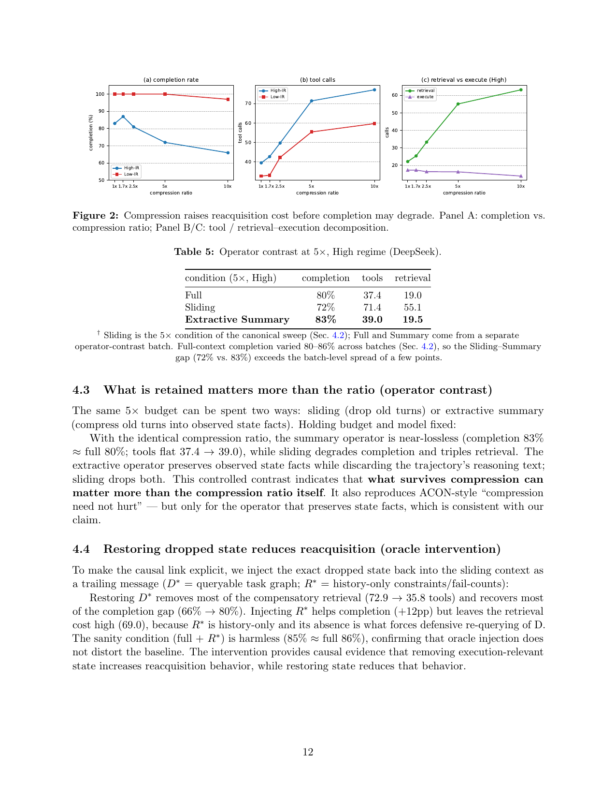
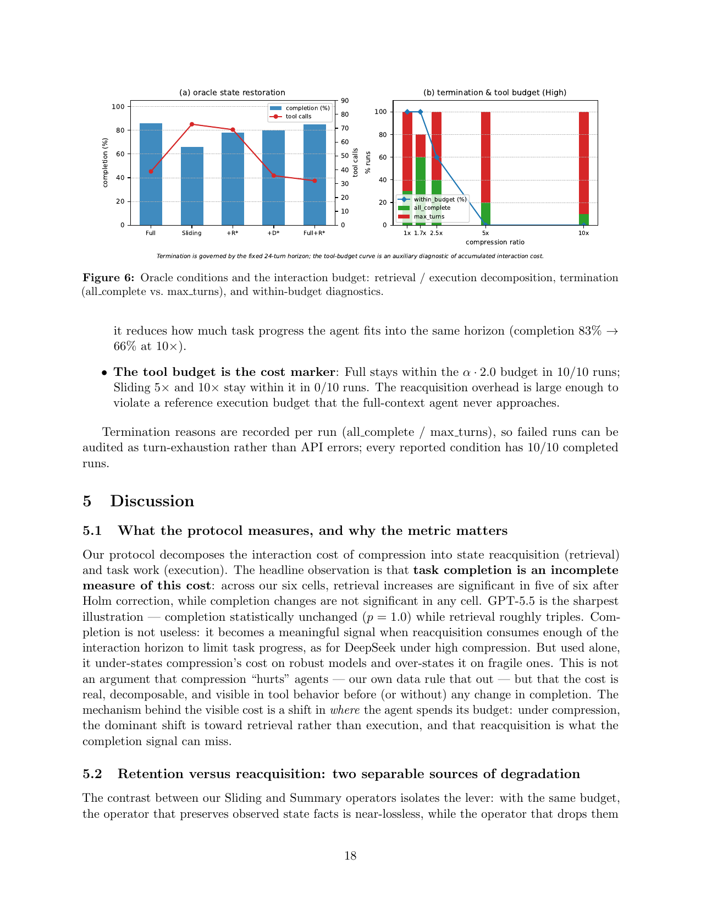
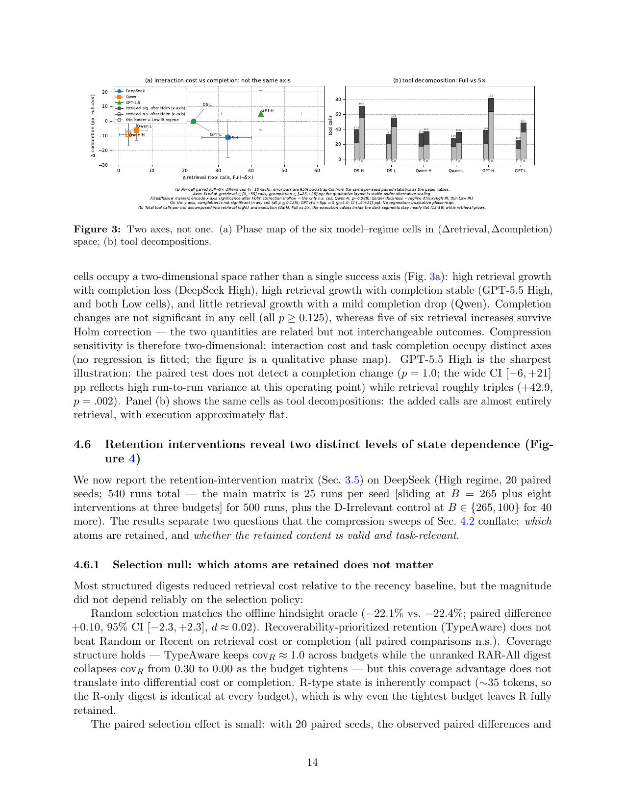
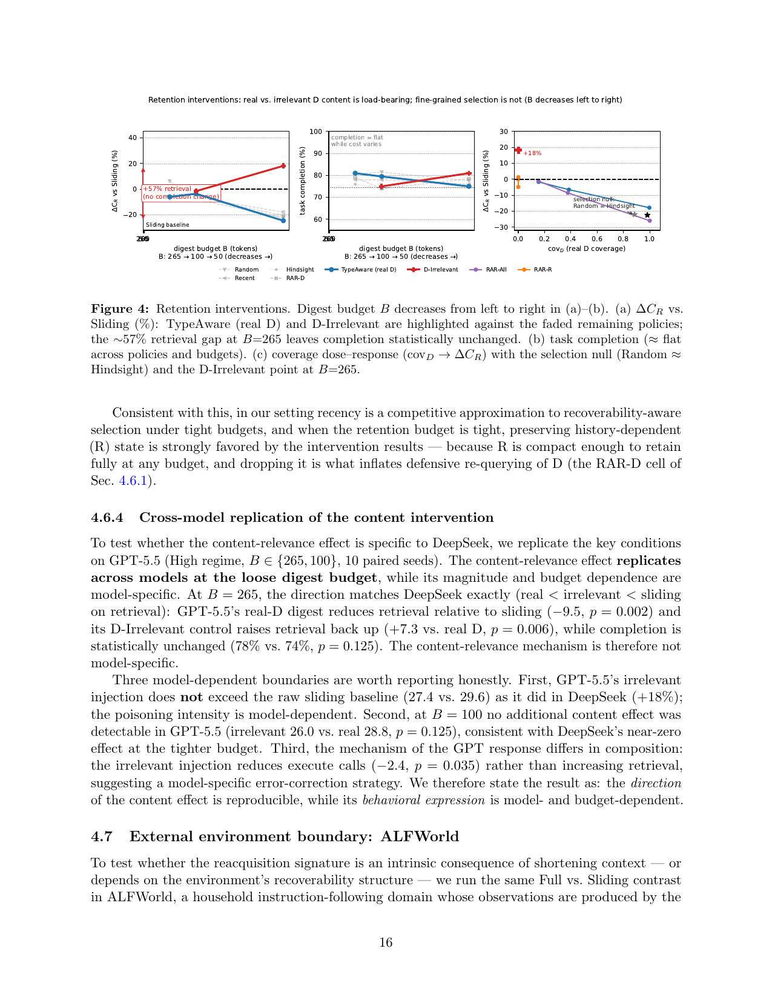
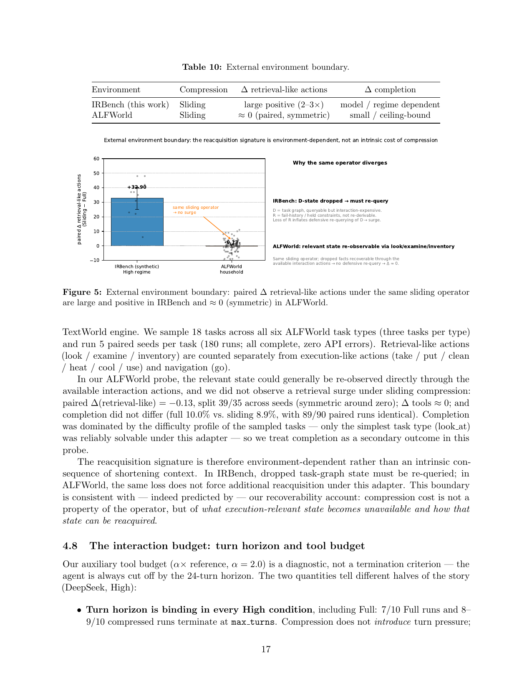

> [[../index|Wiki]] | [[../summary|Summary]] | [[../digest|Digest]]

# Experiments & Results

**In one sentence:** Compression's real cost is not (only) in completion but in a measurable, model-general **reacquisition cost** — elevated retrieval calls that arise when execution-relevant state is dropped and cannot be cheaply recovered — whose magnitude is driven by *what* survives compression, *which content* is retained, and the environment's recoverability structure, not by the compression ratio or operator alone.

## Key points

- DeepSeek severity sweep (sliding-window, High-IR): completion is flat through moderate ratios (87% at 1.7× vs. 83% at Full — within noise; −11pp at 5×, p = .25 N.S.; −17pp at 10×, p = .016 — the only significant completion change in the study), while retrieval is already significantly elevated at 5× (p = .002) and tool calls rise monotonically from 2.5× onward (39.5 → 77.1, +37.6 at 10×, p < .01).
- The extra interaction is retrieval, not work: retrieval calls rise 22.2 → 63.2 (+41.0, p < .01) while **execute calls fall** 17.3 → 13.9 — compression does not make the agent attempt more task work, it makes it spend more interaction re-acquiring dropped state.
- Operator contrast at 5× (same budget, same model): extractive summary is near-lossless (83% completion ≈ 80% Full; tools 37.4 → 39.0) while sliding degrades completion and triples retrieval (72%; tools 71.4; retrieval 55.1) — **what is retained matters more than the ratio**.
- Causal oracle intervention (5×, High): restoring the dropped queryable task graph D\* removes most compensatory retrieval (tools 72.9 → 35.8) and recovers most of the completion gap (66% → 80%); history-only state R\* helps completion (+12pp) but leaves retrieval high (69.0); sanity Full + R\* is harmless (85% ≈ Full 86%).
- Three-model replication (Full vs. Sliding 5×): retrieval increases in **6/6** model–regime cells and stays significant after Holm–Bonferroni in 5/6 (p = .002, .002, .002, .004, .023, .088); completion changes are non-significant in all six (all p ≥ .125) — GPT-5.5 High shows zero completion change (p = 1.0) yet pays the largest cost (+42.9 retrieval, +110% tools). Cost and completion are two distinct axes.
- Retention interventions (DeepSeek High, 20 paired seeds, 540 runs): selection of which real atoms to keep is a null (Random ≈ Hindsight oracle: −22.1% vs. −22.4% ΔC_R, d ≈ 0.02), but **content validity is load-bearing** — replacing D atoms with irrelevant state at B = 265 raises retrieval by +11.5 over real D ([9.2, 13.9], p < .001) and even above the no-digest sliding baseline (+18%, p = .002), while leaving completion statistically unchanged (+6.0pp, p = 0.41).
- The content effect is budget-dependent (null at B = 100: Δ +0.6, p = 0.60) and replicates in direction on GPT-5.5 (real D −9.5, p = .002; irrelevant +7.3 vs. real D, p = .006; completion 78% vs. 74%, p = .125) — the direction is reproducible, its behavioral expression is model- and budget-dependent.
- External environment boundary (ALFWorld, 18 tasks, 180 runs): the same sliding operator yields paired Δ(retrieval-like) = −0.13, symmetric around zero (39/35 split across seeds), vs. +32.9 in IRBench — the reacquisition signature is environment-dependent (depends on recoverability of dropped state), not an intrinsic property of context shortening.
- Termination: the 24-turn horizon binds in every High condition (7/10 Full and 8–9/10 compressed runs terminate at max turns); the tool budget (α = 2.0× reference) is a cost marker — Full stays within it 10/10 runs, Sliding 5× and 10× in 0/10 runs.

---

## 4.1 Setup

The experiments follow the measurement protocol of Sec. 3. "Completion" is the fraction of the 10 required tasks completed within a fixed **24-turn horizon**; "tools" is the per-run tool-call count, decomposed into **retrieval** and **execution** calls. Each condition runs on **10 seeds**, analyzed per-seed paired (Wilcoxon signed-rank; bootstrap 95% CI). The primary pre-specified comparisons are **Full vs. Sliding** on completion, tools, and retrieval calls.

## 4.2 Compression raises reacquisition cost before completion may degrade (Figure 2)

### Severity sweep, DeepSeek (High-IR)

Varying compression severity with the sliding-window operator (r ∈ {1, 1.7, 2.5, 5, 10}) on High-IR:

| Ratio | Completion | Note |
|---|---|---|
| Full (1×) | 83% | baseline |
| 1.7× | 87% (+4pp) | within run-to-run noise; mild compression may remove stale/distracting state ("less context, better agents" mechanism) — does not persist |
| 2.5× | ≈ flat | tools begin rising monotonically from here |
| 5× | 72% (−11pp) | p = .25, N.S.; **retrieval already significantly elevated, p = .002** |
| 10× | 66% (−17pp) | p = .016 — the only significant completion change in the study |

- **Tool calls** rise monotonically from 2.5×: 39.5 → 77.1 (**+37.6 at 10×, p < .01**).
- **Decomposition:** retrieval calls rise 22.2 → 63.2 (**+41.0, p < .01**); **execute calls do not increase with severity** — they fall 17.3 → 13.9. Compression does not make the agent attempt more task work; it makes it spend more interaction re-acquiring dropped state.
- Across independent collections the full-context baseline varied by only a few percentage points (80–86%), within run-to-run variability of the stochastic setting; the canonical sweep is used for all primary comparisons.

### Regime contrast (Low-IR, DeepSeek)

Under Low-IR the same operator is near-costless in completion (100% at every ratio until 10×, where it is 97%) while the tool response is preserved: tools 32.7 → 59.7 (**+83% at 10×**), retrieval-dominated. Low-IR's state is re-derivable from the public graph, so the extra reacquisition cost stays small enough to preserve completion within the horizon.

Figure 2 traces the sweep across panels. Panel (a) shows completion (%) vs. compression ratio for both regimes: Low-IR hugs ~100% until only easing toward ~95% at 10×, while High-IR starts lower (~80–85%), briefly peaks at 1.7×, then declines into the low 60s by 10×. Panel (b) shows total tool calls rising with ratio for both regimes (High-IR from ~40 to ~75–80; Low-IR from ~30, flat through 2.5×, climbing to ~60). Panel (c) decomposes High-IR tool calls: retrieval climbs steeply (~20 → ~60, steepest around 5×) while execution stays low and roughly flat. The visual takeaway matches the text: the agent pays for lost context in extra retrieval **before** completion visibly falls, and this effect is concentrated in the High-IR regime.

### Operator contrast at 5× (Table 5)

| Condition (5×, High) | Completion | Tools | Retrieval |
|---|---|---|---|
| Full | 80% | 37.4 | 19.0 |
| Sliding | 72% | 71.4 | 55.1 |
| Extractive Summary | **83%** | **39.0** | **19.5** |

† Sliding is the 5× condition of the canonical sweep (Sec. 4.2); Full and Summary come from a separate operator-contrast batch. Full-context completion varied 80–86% across batches, so the Sliding–Summary gap (72% vs. 83%) exceeds the batch-level spread of a few points.

## 4.3 What is retained matters more than the ratio (operator contrast)

The same 5× budget can be spent two ways: **sliding** (drop old turns) or **extractive summary** (compress old turns into observed state facts). Holding budget and model fixed:

- With the identical compression ratio, the summary operator is **near-lossless** (completion 83% ≈ Full 80%; tools flat 37.4 → 39.0), while sliding degrades completion and triples retrieval.
- The extractive operator preserves observed state facts while discarding the trajectory's reasoning text; sliding drops both.
- This controlled contrast indicates that **what survives compression can matter more than the compression ratio itself**. It also reproduces ACON-style "compression need not hurt" — but only for the operator that preserves state facts.

## 4.4 Restoring dropped state reduces reacquisition (oracle intervention)

To make the causal link explicit, the exact dropped state is injected back into the sliding context as a trailing message: **D\*** = queryable task graph; **R\*** = history-only constraints/fail-counts.

### Table 6: Oracle intervention at 5×, High regime (DeepSeek)

| Condition (5×, High) | Completion | Tools | Δtools vs. sliding |
|---|---|---|---|
| Full | 86% | 38.8 | — |
| Sliding | 66% | 72.9 | — |
| Sliding + R\* | 78% | 69.0 | −3.9 |
| Sliding + D\* | 80% | 35.8 | **−37.1** |
| Full + R\* (sanity) | 85% | 32.1 | — |

- Restoring **D\*** removes most of the compensatory retrieval (72.9 → 35.8 tools) and recovers most of the completion gap (66% → 80%).
- Injecting **R\*** helps completion (+12pp) but leaves the retrieval cost high (69.0), because R\* is history-only and its absence is what forces defensive re-querying of D.
- The sanity condition (Full + R\*) is harmless (85% ≈ Full 86%), confirming oracle injection does not distort the baseline.
- The intervention provides **causal evidence** that removing execution-relevant state increases reacquisition behavior, and restoring state reduces it.

*Placed here because Figure 6(a) visualizes the oracle conditions of Table 6.* Figure 6 decomposes the oracle (full-state-restoration) conditions into two views. Panel (a) plots the five protocol conditions (Full, Sliding, +R\*, +D\*, Full+R\*) with completion bars and a tool-call line: Sliding is the outlier — lowest completion with the highest tool count — while the oracle-restoration variants recover completion to the top of the band and drive the tool line to its lowest levels. Panel (b) shows termination and within-budget behavior across compression ratios: at low compression (≤2.5×) most runs complete (large `all_complete` share) and the within-budget line sits near 100%; at 5× and 10× the `max_turns` share dominates and the within-budget line collapses toward ~0. Restoring oracle state tames the accumulated tool-call overhead; rising compression exhausts both the turn horizon and the reference tool budget.

## 4.5 The cost generalizes; the outcome does not (three models)

The Full vs. Sliding (5×) comparison is repeated on **Qwen** (qwen3.7-plus) and **GPT-5.5** in both regimes.

### Table 7: Three models, Full vs. Sliding (5×), both regimes

| Model | Regime | Completion Full → 5× | Δ (p) | Tools Full → 5× | Retrieval Δ (p) | Execute Δ |
|---|---|---|---|---|---|---|
| DeepSeek | High | 83 → 72 | −11 (0.25) | 39 → 71 | +32.9 (.002)† | −1.0 |
| Qwen | High | 75 → 66 | −9 (0.13) | 34 → 37 | +2.9 (.088) | ≈ 0 |
| GPT-5.5 | High | 80 → 85 | +5 (1.0) | 39 → 82 | +42.9 (.002)† | ≈ 0 |
| DeepSeek | Low | 100 → 100 | 0 | 33 → 55 | +22.6 (.004)† | +0.1 |
| Qwen | Low | 100 → 94 | −6 (0.25) | 28 → 36 | +5.3 (.023)† | +2.7 |
| GPT-5.5 | Low | 100 → 100 | 0 | 26 → 49 | +22.4 (.002)† | +0.7 |

† p < .05 after **Holm–Bonferroni correction** across the six-comparison retrieval family (α = 0.05); Qwen High retrieval is the single non-significant cell.

**The comparison point is pre-specified.** The six-cell matrix uses a single ratio, 5× (fraction = 0.2), fixed in the design of Experiment A — before the severity sweep revealed where completion degrades. One representative point is evaluated per model because the three-model matrix runs under a shared API budget; 5× is the pre-registered main comparison, and DeepSeek's full severity sweep is reported separately (Sec. 4.2). This is not an attempt to avoid a significant completion result: DeepSeek's completion does become significant at 10× (Δ −17pp, p = .016), consistent with — indeed predicted by — the claim. The cost signal (retrieval) is significant already at 5× (p = .002), while completion responds only at the most aggressive ratio: **completion is the less sensitive measure**. If one measured only completion at 5× — the shallow-compression operating point many production systems run at — one would conclude compression is lossless while retrieval is already elevated.

**Cross-model findings:**

- Retrieval tool calls increased in **every** comparison (6/6); execution calls were approximately stable in **5 of 6**.
- Five of six retrieval increases remain significant after Holm–Bonferroni correction across the pre-specified family (p = 0.002, 0.002, 0.002, 0.004, 0.023, 0.088).
- Completion is heterogeneous and **none of its changes reach significance (all p ≥ 0.125)**: DeepSeek's high-compression degradation is suggestive but not significant (−11pp, p = .25); Qwen is largely insensitive — its retrieval response is the weakest (p = .088), possibly reflecting reliance on inference rather than re-querying when state is missing; GPT-5.5's completion is statistically unchanged (p = 1.0) while it pays the **largest** reacquisition cost (+110% tools, entirely retrieval).
- The reacquisition pattern is consistent across models; its conversion into reduced completion is not. This heterogeneity is the boundary condition of the claim, not a contradiction. (Cross-model comparisons use the same task seeds within each model but are not paired across models.)

### Two axes, not one (Figure 3)

Consistent with the dose–response pattern of Sec. 4.2, the six cells occupy a **two-dimensional** space rather than a single success axis (Fig. 3a):

- **High retrieval growth with completion loss:** DeepSeek High.
- **High retrieval growth with completion stable:** GPT-5.5 High, and both Low cells.
- **Little retrieval growth with a mild completion drop:** Qwen.

Completion changes are not significant in any cell (all p ≥ .125), whereas five of six retrieval increases survive Holm correction — the two quantities are related but not interchangeable outcomes. Compression sensitivity is therefore two-dimensional: interaction cost and task completion occupy distinct axes (no regression is fitted; the figure is a qualitative phase map). GPT-5.5 High is the sharpest illustration: the paired test does not detect a completion change (p = 1.0; the wide CI [−6, +21] pp reflects high run-to-run variance at this operating point) while retrieval roughly triples (+42.9, p = .002). Panel (b) shows the same cells as tool decompositions: the added calls are almost entirely retrieval, with execution approximately flat.

Figure 3 is a two-panel diagnostic across the six model–regime cells (DeepSeek, Qwen, and GPT-5.5, each in High-IR and Low-IR). Panel (a) is a qualitative phase map in (Δ retrieval, Δ completion) space — no regression is fitted. The x-axis is Δ retrieval (Full − 5×, roughly 0–60), the y-axis is Δ completion (pp, roughly −30 to +20), each point carrying 95% bootstrap CIs on both axes; marker fill encodes whether the retrieval difference survives Holm correction and border thickness encodes the regime. The six points scatter across the plane rather than along a diagonal: DeepSeek-High sits at high retrieval growth with completion loss, GPT-5.5-High and both Low cells show high retrieval growth with roughly flat completion, and Qwen shows little retrieval growth with a mild completion drop. The vertical (completion) error bars are wide and cross zero in every cell — none significant — while most horizontal (retrieval) bars clear zero. Panel (b) stacks total tool calls per cell into a light retrieval segment and a small dark execution segment: the differences between Full and 5× are concentrated in the retrieval segment, with execution small and nearly constant — the cost difference is driven by how much the system retrieves, not how much it executes.

## 4.6 Retention interventions reveal two distinct levels of state dependence (Figure 4)

The retention-intervention matrix (Sec. 3.5) is run on **DeepSeek (High regime, 20 paired seeds; 540 runs total** — the main matrix is 25 runs per seed [sliding at B = 265 plus eight interventions at three budgets] for 500 runs, plus the D-Irrelevant control at B ∈ {265, 100} for 40 more). The results separate two questions that the compression sweeps of Sec. 4.2 conflate: **which** atoms are retained, and **whether the retained content is valid and task-relevant**.

### 4.6.1 Selection null: which atoms are retained does not matter

Most structured digests reduced retrieval cost relative to the recency baseline, but the magnitude did not depend reliably on the selection policy:

- **Random selection matches the offline hindsight oracle** (−22.1% vs. −22.4%; paired difference +0.10, 95% CI [−2.3, +2.3], d ≈ 0.02).
- Recoverability-prioritized retention (TypeAware) does **not** beat Random or Recent on retrieval cost or completion (all paired comparisons n.s.).
- Coverage structure holds — TypeAware keeps cov_R ≈ 1.0 across budgets while the unranked RAR-All digest collapses cov_R from 0.30 to 0.00 as the budget tightens — but this coverage advantage does not translate into differential cost or completion.
- R-type state is inherently compact (≈35 tokens, so the R-only digest is identical at every budget), which is why even the tightest budget leaves R fully retained.

The paired selection effect is small: with 20 paired seeds, the observed paired differences and their 95% CIs rule out large selection benefits in this experiment — an order of magnitude smaller than the content effect below. While a larger N could in principle detect a marginal difference, the practical conclusion is that **fine-grained selection among real, task-relevant atoms has low marginal value** in this setting relative to the coarse content-validity effect.

### Table 8: Selection null at B = 265 (DeepSeek, High)

| Policy (B = 265) | ΔC_R vs. Sliding | p |
|---|---|---|
| RAR-All | −26.0% | < 0.001 |
| RAR-TypeAware | −24.5% | < 0.001 |
| Hindsight | −22.4% | 0.001 |
| Random | −22.1% | 0.001 |
| Recent | −20.4% | 0.002 |
| RAR-D | −17.8% | 0.002 |
| RAR-R | −4.8% | n.s. |

### 4.6.2 Content intervention: the D-Irrelevant control

The selection null leaves open whether the digest's *content* matters at all, or whether any D-shaped text occupying the budget is equivalent. The **D-Irrelevant** control holds the digest format, position, budget, and retained R content fixed and replaces the D atoms with fabricated out-of-universe state. At B = 265 the effect is large and uniform:

- All **20 seeds** show the retrieval increase (range +3 to +23); the increment is entirely in retrieval, with execute unchanged.
- **Semantically irrelevant state injection is harmful:** D-Irrelevant's retrieval exceeds even the no-digest sliding baseline (+18%, p = .002).
- Reported as a post-hoc sequential diagnostic (see Sec. 3.5): semantically irrelevant state injection induces additional verification and retrieval behavior. Whether the added retrieval reflects semantic irrelevance itself or verification of internally inconsistent state content is a finer mechanistic distinction left for future work; both readings support the claim that **state content is behaviorally load-bearing**.

### Table 9: D-Irrelevant content intervention at B = 265 (DeepSeek, High)

| Metric | TypeAware (real D) | D-Irrelevant | Δ | 95% CI | p |
|---|---|---|---|---|---|
| C_R (retrieval) | 20.4 | 31.9 | **+11.5** | [9.2, 13.9] | < 0.001 |
| Tools | 37.6 | 48.2 | +10.7 | [8.1, 13.4] | < 0.001 |
| Execute | 17.2 | 16.4 | −0.8 | [−1.9, +0.2] | n.s. |
| Q (completion) | 75.0 | 81.0 | +6.0 pp | [−2.5, +16.0] | 0.41 |

Figure 4 probes how the content of retained context (real D vs. irrelevant D) versus the selection policy affects re-querying cost and completion as the digest budget B shrinks (265 → 100 → 50 tokens, left to right). Panel (a) contrasts ΔC_R vs. Sliding (%) across budgets: TypeAware (real D) falls to roughly −15 to −25% while D-Irrelevant rises to roughly +15–20% above the sliding baseline — with an annotated ~57% retrieval gap at B = 265 — leaving completion statistically unchanged. Panel (b) shows task completion staying roughly flat (≈70–80%) across policies and budgets, so the content effect appears in cost/retrieval rather than raw completion. Panel (c) is a coverage dose–response (cov_D → ΔC_R): the curve falls from ~0 at low coverage to about −20 to −25% at full coverage, the selection-null Random ≈ Hindsight line passes through the D-Irrelevant region as coverage → 0, showing that the selection policy adds little beyond content coverage. Takeaway (approximate values as marked): content of retained D is the load-bearing factor — real D suppresses defensive re-querying while irrelevant D inflates it — whereas fine-grained selection policy is not a meaningful driver.

### 4.6.3 Budget dependence: content matters when the digest dominates the window

The content effect is not budget-invariant:

- At **B = 100** the same comparison is null (Δ +0.6, 95% CI [−2.4, +3.4], p = 0.60, d ≈ 0.09): the ≈77-token digest is a minor fraction of the compacted window, and the agent leans on the recent turns, so real-versus-irrelevant content is behaviorally invisible.
- At **B = 265** the digest (≈209 tokens) dominates the compressed window and content becomes load-bearing.
- **Content relevance matters as an interaction content × budget:** coarse, valid, task-relevant D content reduces retrieval at loose budgets; fine-grained selection among such content does not; and the distinction only becomes behaviorally visible when the digest occupies a substantial share of the context.

Consistent with this, in this setting **recency is a competitive approximation to recoverability-aware selection under tight budgets**, and when the retention budget is tight, preserving history-dependent (R) state is strongly favored — because R is compact enough to retain fully at any budget, and dropping it is what inflates defensive re-querying of D (the RAR-D cell of Sec. 4.6.1).

### 4.6.4 Cross-model replication of the content intervention

To test whether the content-relevance effect is specific to DeepSeek, the key conditions are replicated on **GPT-5.5 (High regime, B ∈ {265, 100}, 10 paired seeds)**. The content-relevance effect **replicates across models at the loose digest budget**, while its magnitude and budget dependence are model-specific:

- At B = 265 the direction matches DeepSeek exactly (real < irrelevant < sliding on retrieval): GPT-5.5's real-D digest reduces retrieval relative to sliding (−9.5, p = .002) and its D-Irrelevant control raises retrieval back up (+7.3 vs. real D, p = .006), while completion is statistically unchanged (78% vs. 74%, p = .125).
- **First boundary:** GPT-5.5's irrelevant injection does **not** exceed the raw sliding baseline (27.4 vs. 29.6) as it did in DeepSeek (+18%) — poisoning intensity is model-dependent.
- **Second boundary:** at B = 100 no additional content effect was detectable in GPT-5.5 (irrelevant 26.0 vs. real 28.8, p = .125), consistent with DeepSeek's near-zero effect at the tighter budget.
- **Third boundary:** the mechanism differs in composition — the irrelevant injection *reduces* execute calls (−2.4, p = .035) rather than increasing retrieval, suggesting a model-specific error-correction strategy.

Result stated conservatively: the **direction** of the content effect is reproducible, while its **behavioral expression** is model- and budget-dependent.

## 4.7 External environment boundary: ALFWorld (Figure 5)

To test whether the reacquisition signature is an intrinsic consequence of shortening context — or depends on the environment's recoverability structure — the same Full vs. Sliding contrast is run in **ALFWorld**, a household instruction-following domain whose observations are produced by the TextWorld engine. **18 tasks** are sampled across all six ALFWorld task types (three per type), with **5 paired seeds per task (180 runs; all complete, zero API errors)**. Retrieval-like actions (look / examine / inventory) are counted separately from execution-like actions (take / put / clean / heat / cool / use) and navigation (go).

### Table 10: External environment boundary

| Environment | Compression | Δ retrieval-like actions | Δ completion |
|---|---|---|---|
| IRBench (this work) | Sliding | large positive (2–3×) | model / regime dependent |
| ALFWorld | Sliding | ≈ 0 (paired, symmetric) | small / ceiling-bound |

In the ALFWorld probe, the relevant state could generally be re-observed directly through the available interaction actions, and **no retrieval surge** was observed under sliding compression:

- **Paired Δ(retrieval-like) = −0.13**, split 39/35 across seeds (symmetric around zero).
- **Δtools ≈ 0**; completion did not differ (Full 10.0% vs. Sliding 8.9%, with **89/90 paired runs identical**).
- Completion was dominated by the difficulty profile of the sampled tasks — only the simplest task type (look at) was reliably solvable under this adapter — so completion is treated as a secondary outcome in this probe.

Figure 5 compares the paired Δ(retrieval-like) actions (Sliding − Full) for the **same** sliding operator in two environments. The y-axis spans roughly −10 to +60; the x-axis holds two conditions — IRBench (synthetic, High regime) and ALFWorld (household) — each drawn as a small boxplot/scatter of paired seeds. IRBench shows a large, clearly positive shift on the order of +30 with dispersed points (a real retrieval "surge"), whereas ALFWorld's distribution collapses to roughly zero, symmetric about zero (a few points slightly positive, a few slightly negative) — no surge. A "same sliding operator → no surge" callout links the two, emphasizing that the operator is held constant while the outcome flips. The side rationale: in IRBench the dropped state is a D-state (task graph) that is queryable but interaction-expensive and not re-derivable, so its loss forces defensive re-querying; in ALFWorld the same lost facts are recoverable through ordinary interaction actions (look/examine/inventory), so Δ ≈ 0. (Exact values approximate: IRBench ≈ +30, ALFWorld ≈ 0.)

**Conclusion:** the reacquisition signature is **environment-dependent**, not an intrinsic consequence of shortening context. In IRBench, dropped task-graph state must be re-queried; in ALFWorld, the same loss does not force additional reacquisition under this adapter. This boundary is consistent with — predicted by — the recoverability account: compression cost is not a property of the operator, but of *what execution-relevant state becomes unavailable and how that state can be reacquired*.

## 4.8 The interaction budget: turn horizon and tool budget

The auxiliary tool budget (α× reference, **α = 2.0**) is a diagnostic, not a termination criterion — the agent is always cut off by the **24-turn horizon**. The two quantities tell different halves of the story (DeepSeek, High):

- **Turn horizon is binding in every High condition**, including Full: **7/10 Full runs** and **8–9/10 compressed runs** terminate at `max turns`. Compression does not *introduce* turn pressure; it reduces how much task progress the agent fits into the same horizon (completion 83% → 66% at 10×).
- **The tool budget is the cost marker:** Full stays within the α·2.0 budget in **10/10 runs**; Sliding 5× and 10× stay within it in **0/10 runs**. The reacquisition overhead is large enough to violate a reference execution budget that the full-context agent never approaches.

Termination reasons are recorded per run (`all_complete` / `max_turns`), so failed runs can be audited as turn-exhaustion rather than API errors; **every reported condition has 10/10 completed runs**.

---

**Covers:** Section 4 (Experiments)
