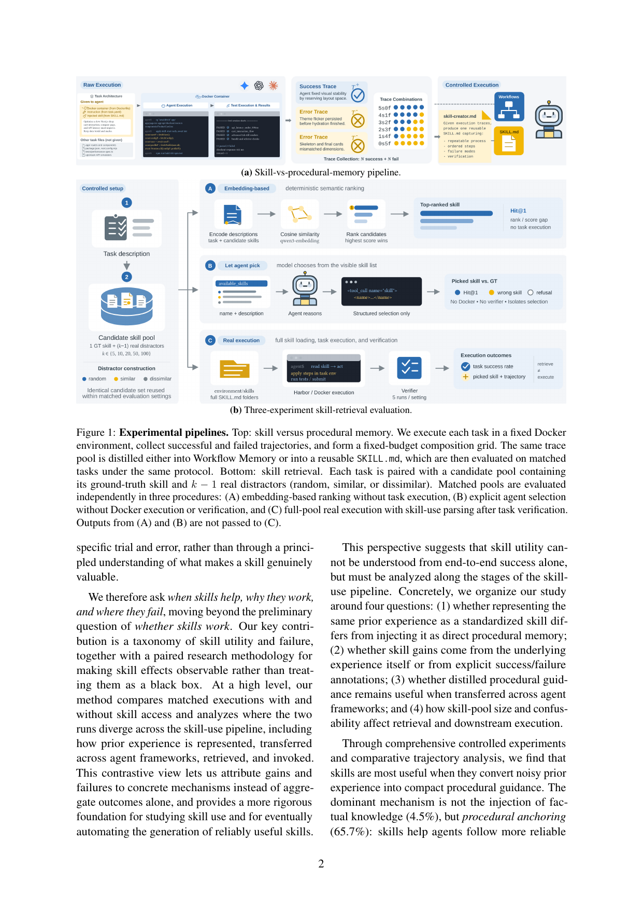
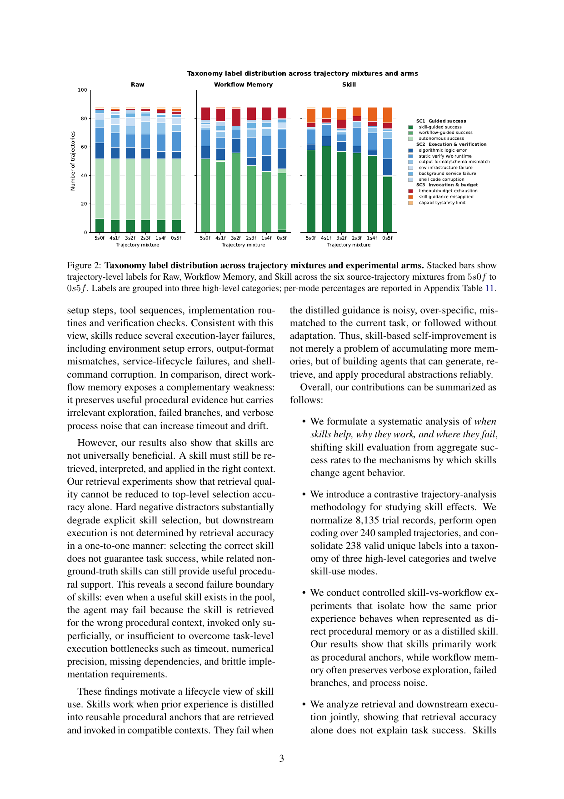

# Demystifying Agent Skills: Why They Work-Until They Don't

**Paper:** [Demystifying Agent Skills: Why They Work-Until They Don't (Jiang et al., 2026)](https://arxiv.org/abs/2608.14036)

## Human Readable TL;DR

Think of an "agent skill" as a cheat-sheet an AI coding assistant reads before starting a job. This paper asks not just "do cheat-sheets help?" but "*how* do they help, and when do they backfire?" The authors ran the same tasks three ways — with no cheat-sheet, with the raw notes from past attempts, and with a distilled cheat-sheet — and had judges compare what actually happened in each run. The cheat-sheet version won, but not because it told the AI new facts: it worked mainly by keeping the AI's actions on track (setup steps, checklists, order of operations). The catch: the AI sometimes misapplies or blindly follows the cheat-sheet, and once you have more than a handful of cheat-sheets to choose from, the AI gets much worse at picking the one it's actually supposed to use — even though it usually still finishes the task somehow.

## TL;DR

Through a contrastive trajectory analysis over 8,135 normalized trial records and 528 matched Raw/Workflow-Memory/Skill triples, the paper shows skills outperform workflow memory built from identical trajectories by +6.06 points (95% CI [+0.76, +11.36]), driven overwhelmingly by procedural anchoring (65.7% of skill mechanisms) rather than knowledge injection (4.5%). Skills cut execution/verification failures (SC2: 37.3%→23.5%) but create a new invocation-failure mode (skill_guidance_misapplied_or_ignored: 0.8%→10.0%) and do not fix algorithmic-logic or verification-depth failures. A separate retrieval study shows actual-use precision collapsing from 29.6% to 3.3% as skill-pool size grows from 5 to 100, driven mainly by semantically similar distractors, while downstream task success stays nearly flat (36.4%→39.3%).

---

## Problem & Motivation

Agent systems increasingly reuse prior execution experience — environment setup, tool-use patterns, debugging routines — rather than solving every task from scratch. Skills (compact SKILL.md artifacts describing what to do, check, and avoid) are the most convincing distillation of this experience, promising shorter context, standardized format, and cross-task transfer over raw traces or workflow memories. But existing evaluation only measures whether skill-augmented agents solve more tasks in aggregate. That tells you skills matter, not *why* — which parts of execution they stabilize, why the same skill helps one task and harms another, or where in the pipeline (representation, retrieval, invocation) the benefit or the failure actually originates. The field has been left designing and revising skills through heuristic trial and error rather than principled understanding.

---

## Main Original Ideas

1. **Contrastive matched-triple design.** Instead of comparing skill-augmented success rates against a baseline, the authors build 528 triples where the *same task* is run under Raw, Workflow Memory, and Skill — with Workflow Memory and Skill built from the *identical* source trajectories. This isolates the effect of *representation* from the effect of *having more prior experience*.
2. **A validated 3-category / 12-mode taxonomy of skill-use trajectories.** Open-coding 240 sampled trajectories into 238 valid labels, then two-round LLM batch-merging into 12 canonical modes grouped under three Skill-use Categories (SC1 successful procedural anchoring, SC2 execution/verification failures, SC3 invocation/applicability/boundary failures) — independently human-validated at 95.8% exact agreement, Cohen's κ = 0.952.
3. **Mechanism attribution, not just outcome labels.** For every triple an LLM judge tags how the injected artifact acted: procedural_anchor, knowledge_injection, failure_warning, none, or counterproductive — separating *whether* a skill helped from *how*.
4. **A 3-arm retrieval study that separates identification from use.** Arm 1 (embedding ranking), Arm 2 (explicit agent selection, no execution), and Arm 3 (full-pool real execution) run as independent measurements over the same candidate pools (size 5–100, random/similar/dissimilar distractors) — showing that finding the "correct" skill and successfully completing the task are only loosely coupled.

---

## Key Findings

**Oracle-status success rates (528 paired triples):**

| Arm | Success rate | Paired delta vs Raw | Paired delta vs Workflow Memory |
|---|---|---|---|
| Raw | 59.1% | — | — |
| Workflow Memory | 55.9% | −3.2 pp | — |
| Skill | 61.9% | +2.8 pp (CI crosses zero) | **+6.06 pp** (95% CI [+0.76, +11.36]) |

**Mechanism attribution:** procedural_anchor = 65.7% of skill cases vs knowledge_injection = 4.5%.

**Failure-mode shifts by arm (selected modes, % of paired-triple labels):**

| Mode | Raw | Workflow Memory | Skill |
|---|---|---|---|
| environment_infrastructure_failure | 5.3% | 1.7% | 0.2% |
| algorithmic_logic_error (unaffected) | 8.3% | 11.0% | 7.4% |
| static_verification_without_runtime (unaffected) | 12.5% | 12.5% | 11.7% |
| timeout_budget_exhaustion | 1.7% | 10.6% | 4.4% |
| skill_guidance_misapplied_or_ignored (new failure) | 0.8% | 0.4% | 10.0% (Table 11) |

**Retrieval collapses with pool size while task success stays flat:**

| Pool size | Actual-use precision (Arm 3, avg) | Downstream success (avg) |
|---|---|---|
| 5 | 29.6% | 36.4% |
| 100 | 3.3% | 39.3% |

- Skill-guided success dominates the SC1 category (326/528 skill vs 294/528 workflow memory); SC2 execution failures fall to 124/528 for skill vs 197/528 raw and 176/528 workflow memory; SC3 invocation/boundary failures *rise* to 78/528 for skill vs 19/528 raw.
- Lightweight compact-text baselines (short-plan 47.7%, test-first 59.2%) underperform both Workflow Memory (62.3%) and Skill (79.2%) on 26 matched Terminal-Bench-2 tasks — the skill advantage is not just "any short procedural text."
- On a matched 83-task token intersection, Skill achieves the highest success (69.6%, +5.5 pp vs Raw) using fewer tokens than Raw but more than Workflow Memory — an effectiveness/efficiency trade-off, not a free lunch.
- Cross-framework transfer (RQ3): skills built from Codex trajectories and evaluated in Gemini CLI still beat workflow memory by roughly +5–10 points, showing the representation — not just the source experience — is what transfers.
- Outcome annotations (whether the skill creator can see which source trajectories succeeded/failed) matter most once failed trajectories enter the training pool — e.g. Gemini/Terminal-Bench-2 at 3s2f: 74.6% with outcome hints vs 40.0% without.

---

## Suggestions & Future Directions

1. Treat skill use as a **lifecycle problem**, not a single memory-injection mechanism: better self-improving agents need better generation, retrieval, and application of procedural abstractions, not just more memories.
2. Extend the evaluation beyond terminal- and tool-using benchmarks to long-horizon web interaction and open-ended collaboration.
3. Broaden the agent–model configurations tested; the current taxonomy is derived from a ~3% stratified open-coding sample and may underrepresent rare behavioral modes.
4. Future skill systems should address the SC3 invocation-failure surface directly (when a skill should be adapted vs. followed literally) rather than only optimizing SC1/SC2.
5. Retrieval systems for skill libraries need mechanisms robust to semantically *similar* distractors specifically, since that — more than raw pool size — is what drives the observed precision collapse.

---

## Authors & Institutions

Zhiyuan Jiang, Fangrui Huang, Hanwen Xing, Xander Wu, Yipeng Gao, Rui Cao, Mengdi Wang, Shilong Liu, Yijiang Li — Princeton University, UC San Diego, Stanford University, University of Southern California, Johns Hopkins University.

## Figures

