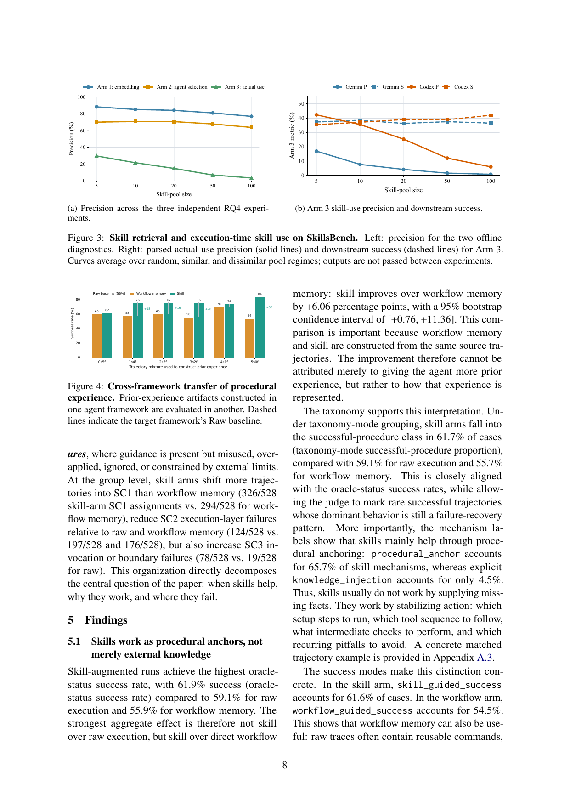
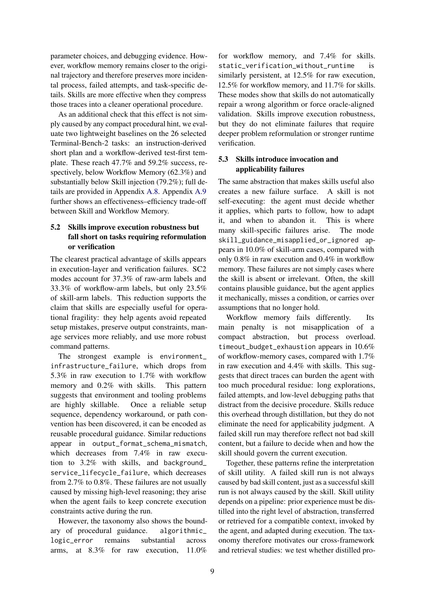
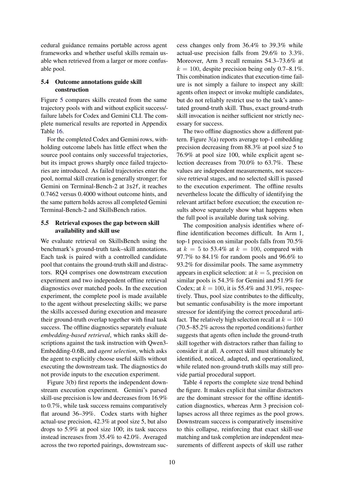

> [[../index|Wiki]] | [[../summary|Summary]] | [[../digest|Digest]]

# Findings, Conclusion, and Limitations

**In one sentence:** Skills work best as procedural anchors that stabilize execution (outperforming workflow memory built from the same trajectories by +6.06 points), but they cannot repair algorithmic or verification failures, introduce their own invocation/applicability failure surface, and suffer a sharp precision collapse when retrieved from large or semantically confusable pools — even as downstream task success stays remarkably flat.

## Key points

- Skill-augmented runs achieve the highest oracle-status success rate: 61.9% vs 59.1% raw execution and 55.9% workflow memory; the effect over workflow memory is +6.06 percentage points (95% bootstrap CI [+0.76, +11.36]).
- Mechanism labels show skills work through procedural anchoring, not knowledge injection: procedural_anchor accounts for 65.7% of skill mechanisms vs only 4.5% for explicit knowledge_injection.
- SC2 execution/verification fragility modes fall from 37.3% of raw-arm and 33.3% of workflow-arm labels to only 23.5% for skills; environment/infrastructure failure drops from 5.3% (raw) to 1.7% (workflow) to 0.2% (skills).
- Skills do not fix deep reasoning failures: algorithmic_logic_error stays at 7.4–11.0% across arms and static_verification_without_runtime at 11.7–12.5%.
- Skills create a new failure surface — skill_guidance_misapplied_or_ignored appears in 10.0% of skill-arm cases vs 0.8% raw and 0.4% workflow memory.
- Workflow memory's distinctive penalty is process overload: timeout_budget_exhaustion appears in 10.6% of workflow-memory cases vs 1.7% raw and 4.4% with skills.
- Outcome labels matter most when failed trajectories enter the pool: Gemini on Terminal-Bench-2 at 3s2f reaches 0.7462 with outcome hints vs 0.4000 without.
- Retrieval precision collapses with pool size — averaged actual-use precision falls from 29.6% at pool size 5 to 3.3% at pool size 100 — while downstream success changes only from 36.4% to 39.3%.

---

## 5.1 Skills work as procedural anchors, not merely external knowledge

Skill-augmented runs achieve the highest oracle-status success rate of the three arms: 61.9% for skills, compared with 59.1% for raw execution and 55.9% for workflow memory. Crucially, the strongest aggregate effect is not skill over raw execution but skill over direct workflow memory: skill improves over workflow memory by +6.06 percentage points, with a 95% bootstrap confidence interval of [+0.76, +11.36]. This comparison is the load-bearing one in the paper because workflow memory and skills are constructed from the *same* source trajectories — so the improvement cannot be attributed merely to giving the agent more prior experience. It must come from how that experience is represented.

The taxonomy supports this interpretation directly. Under taxonomy-mode grouping, skill arms fall into the successful-procedure class in 61.7% of cases, compared with 59.1% for raw execution and 55.7% for workflow memory. This is closely aligned with the oracle-status success rates, while additionally allowing the judge to mark rare successful trajectories whose dominant behavior is still a failure-recovery pattern. More importantly, the mechanism labels show that skills mainly help through procedural anchoring: procedural_anchor accounts for 65.7% of skill mechanisms, whereas explicit knowledge_injection accounts for only 4.5%. In other words, skills usually do not work by supplying missing facts. They work by stabilizing action — which setup steps to run, which tool sequence to follow, which intermediate checks to perform, and which recurring pitfalls to avoid (a concrete matched trajectory example is provided in the paper's Appendix A.3).

The success modes make this distinction concrete. In the skill arm, skill_guided_success accounts for 61.6% of cases, while in the workflow arm, workflow_guided_success accounts for 54.5%. This shows that workflow memory can also be useful — raw traces often contain reusable commands, parameter choices, and debugging evidence. However, workflow memory remains closer to the original trajectory and therefore preserves more incidental process, failed attempts, and task-specific details. Skills are more effective when they compress those traces into a cleaner operational procedure.

As an additional check that this effect is not simply caused by any compact procedural hint, the authors evaluate two lightweight baselines on the 26 selected Terminal-Bench-2 tasks: an instruction-derived short plan and a workflow-derived test-first template. These reach 47.7% and 59.2% success, respectively — below Workflow Memory (62.3%) and substantially below Skill injection (79.2%); full details are in Appendix A.8. Appendix A.9 further shows an effectiveness–efficiency trade-off between Skill and Workflow Memory. Taken together, the 5.1 evidence says: what makes a skill valuable is its role as a distilled, reusable procedural anchor, not the raw information it contains.

## 5.2 Skills improve execution robustness but fall short on tasks requiring reformulation or verification

The clearest practical advantage of skills appears in execution-layer and verification failures. SC2 (execution/verification fragility) modes account for 37.3% of raw-arm labels and 33.3% of workflow-arm labels, but only 23.5% of skill-arm labels. This reduction supports the claim that skills are especially useful for operational fragility: they help agents avoid repeated setup mistakes, preserve output constraints, manage services more reliably, and use more robust command patterns.

The strongest example is environment_infrastructure_failure, which drops from 5.3% in raw execution to 1.7% with workflow memory and only 0.2% with skills. This pattern suggests that environment and tooling problems are highly skillable: once a reliable setup sequence, dependency workaround, or path convention has been discovered, it can be encoded as reusable procedural guidance. Similar reductions appear in output_format_schema_mismatch, which decreases from 7.4% in raw execution to 3.2% with skills, and background_service_lifecycle_failure, which decreases from 2.7% to 0.8%. These failures are not usually caused by missing high-level reasoning; they arise when the agent fails to keep concrete execution constraints active during the run — precisely the class of problem a distilled procedure addresses.

However, the taxonomy also shows the boundary of procedural guidance. algorithmic_logic_error remains substantial across arms, at 8.3% for raw execution, 11.0% for workflow memory, and 7.4% for skills (so skills do not reliably help here, and even slightly worsen the workflow number). static_verification_without_runtime is similarly persistent, at 12.5% for raw execution, 12.5% for workflow memory, and 11.7% for skills. These modes show that skills do not automatically repair a wrong algorithm or force oracle-aligned validation. The practical takeaway: skills improve execution robustness, but they do not eliminate failures that require deeper problem reformulation or stronger runtime verification — the agent still has to reason correctly and verify at runtime.

## 5.3 Skills introduce invocation and applicability failures

The same abstraction that makes skills useful also creates a new failure surface. A skill is not self-executing: the agent must decide whether it applies, which parts to follow, how to adapt it, and when to abandon it — and this is where many skill-specific failures arise. The mode skill_guidance_misapplied_or_ignored appears in 10.0% of skill-arm cases, compared with only 0.8% in raw execution and 0.4% in workflow memory. These failures are not simply cases where the skill is absent or irrelevant; often the skill contains plausible guidance, but the agent applies it mechanically, misses a condition, or carries over assumptions that no longer hold in the current task.

Workflow memory fails differently. Its main penalty is not misapplication of a compact abstraction but *process overload*: timeout_budget_exhaustion appears in 10.6% of workflow-memory cases, compared with 1.7% in raw execution and 4.4% with skills. This suggests that direct traces can burden the agent with too much procedural residue — long explorations, failed attempts, and low-level debugging paths that distract from the decisive procedure. Skills reduce this overhead through distillation, but they do not eliminate the need for applicability judgment. A failed skill run may therefore reflect not bad skill content, but a failure to decide when and how the skill should govern the current execution.

Together, these patterns refine the interpretation of skill utility in both directions: a failed skill run is not always caused by bad skill content, just as a successful skill run is not always caused by the skill. Skill utility depends on a whole pipeline: prior experience must be distilled into the right level of abstraction, transferred or retrieved for a compatible context, invoked by the agent, and adapted during execution. The taxonomy is what motivates the paper's cross-framework and retrieval studies: whether distilled procedural guidance remains portable across agent frameworks, and whether useful skills remain usable when retrieved from a larger or more confusable pool.

## 5.4 Outcome annotations guide skill construction

Figure 5 compares skills created from the same trajectory pools with and without explicit success/failure labels, for Codex and Gemini CLI (the complete numerical results are reported in the paper's Appendix Table 16). The headline result is conditional: for the completed Codex and Gemini rows, withholding outcome labels has little effect when the source pool contains only successful trajectories, but its impact grows sharply once failed trajectories are introduced. As failed trajectories enter the pool, normal skill creation (with outcome labels) is generally stronger; for Gemini on Terminal-Bench-2 at the 3s2f mixture, skill creation with outcome hints reaches 0.7462 versus 0.4000 without outcome hints, and the same pattern holds across all completed Gemini Terminal-Bench-2 and SkillsBench mixtures. The practical reading is that outcome annotations act as signal for what the skill author should preserve and what should be discarded — especially important when the source pool is mixed, since without labels the builder cannot easily distinguish the productive steps from the failed attempts. (Terminal-Bench-Pro entries use 130 trials per condition, with missing or infrastructure-error trials counted as failures.)

This page's Figure 4 (cross-framework transfer of procedural experience) is a grouped bar chart of success rate (%) against trajectory mixture (x-axis, from 0s3f to 5s0f), comparing three kinds of prior-experience artifacts — raw baseline, workflow memory, and skill — built in one agent framework and evaluated in a different target framework, against the target framework's own Raw baseline (dashed line, ~mid-50s %). Within every mixture group the skill bar is tallest, workflow memory is intermediate, and raw baseline is lowest; the skill advantage is most pronounced at the more "skill-pure" end of the mixture (~90% vs ~80% for workflow memory and ~50–60% for raw). The takeaway is that procedural experience transfers across frameworks and the skill representation consistently outperforms both raw traces and workflow memory (roughly +5–10 points over workflow memory) — and because both are built from the same source trajectories, the gap is attributed to representation (procedural anchoring) rather than to extra prior information. The companion Figure 3 on the same page plots precision vs. skill-pool size: Figure 3a shows Arm 1 (embedding) highest (~80–90%), Arm 2 (agent selection) mid (~70%), and Arm 3 (actual use) lowest and declining (~30% → low single digits); Figure 3b shows Arm-3 actual-use precision falling with pool size while downstream success stays flat around the 35–40% range.

## 5.5 Retrieval exposes the gap between skill availability and skill use

The authors evaluate retrieval on SkillsBench using the benchmark's ground-truth task–skill annotations. Each task is paired with a controlled candidate pool containing the ground-truth skill plus distractors. RQ4 comprises one downstream execution experiment and two independent offline retrieval diagnostics over matched pools. In the execution experiment, the complete pool is made available to the agent without preselecting skills; the skills accessed during execution are parsed and their ground-truth overlap is measured together with final task success. The offline diagnostics separately evaluate *embedding-based retrieval*, which ranks skill descriptions against the task instruction with Qwen3-Embedding-0.6B, and *agent selection*, which asks the agent to explicitly choose useful skills without executing the downstream task. The diagnostics do not provide inputs to the execution experiment — they are independent measurements, not successive stages of one pipeline.

Figure 3(b) first reports the independent downstream execution result. Gemini's parsed skill-use precision is low and decreases from 16.9% to 0.7% as the pool grows, while task success remains comparatively flat around 36–39%. Codex starts with higher actual-use precision — 42.3% at pool size 5 — but also drops to 5.9% at pool size 100; its task success instead increases from 35.4% to 42.0%. Averaged across the two reported pairings, downstream success changes only from 36.4% to 39.3%, while actual-use precision falls from 29.6% to 3.3%. Moreover, Arm 3 recall remains 54.3–73.6% at k = 100, despite precision being only 0.7–8.1%. This combination indicates that execution-time failure is *not* simply a failure to inspect any skill: agents often inspect or invoke multiple candidates, but do not reliably restrict use to the task's annotated ground-truth skill. Thus, exact ground-truth skill invocation is neither sufficient nor strictly necessary for success.

The two offline diagnostics show a different pattern. Figure 3(a) reports average top-1 embedding precision decreasing from 88.3% at pool size 5 to 76.9% at pool size 100, while explicit agent selection decreases from 70.0% to 63.7%. Again, these are independent measurements and no selected skill is passed to the execution experiment. The offline results locate the difficulty of identifying the relevant artifact *before* execution; the execution results separately show what happens when the full pool is available during task solving.

The composition analysis identifies where offline identification becomes difficult. In Arm 1, top-1 precision on *similar* pools falls from 70.5% at k = 5 to 53.4% at k = 100, compared with 97.7% to 84.1% for random pools and 96.6% to 93.2% for dissimilar pools. The same asymmetry appears in explicit selection: at k = 5, precision on similar pools is 54.3% for Gemini and 51.9% for Codex; at k = 100, it is 55.4% and 31.9%, respectively. Thus, pool size contributes to the difficulty, but semantic confusability is the *more important* stressor for identifying the correct procedural artifact. The relatively high selection recall at k = 100 (70.5–85.2% across the reported conditions) further suggests that agents often include the ground-truth skill together with distractors rather than failing to consider it at all. A correct skill must ultimately be identified, noticed, adapted, and operationalized, while related non-ground-truth skills may still provide partial procedural support.

Table 4 reports the complete size trend behind the figure. It makes explicit that similar distractors are the dominant stressor for the offline identification diagnostics, whereas Arm 3 precision collapses across all three regimes as the pool grows. Downstream success is comparatively insensitive to this collapse, reinforcing that exact skill-use matching and task completion are independent measurements of different aspects of skill use rather than successive stages of one pipeline. The net message of 5.5 is that the gap between skill *availability* and skill *use* is driven primarily by semantic confusability among similar distractors, and that agents can complete tasks — sometimes while their precision on the annotated ground-truth skill has mostly collapsed — by adapting or drawing partial procedural support from related skills.

Figure 5 (above) is the outcome-label ablation supporting finding 5.4: panels compare skills created with outcome labels visible (normal) or withheld (no-hint) across trajectory mixtures and benchmarks (Terminal-Bench-2, SkillsBench, Terminal-Bench-Pro), with dashed lines marking the corresponding Raw baselines. Figure 3(b) shows Arm-3 actual-use precision falling with pool size (Gemini ~17% → ~1%, Codex ~42% → ~6%) while downstream success stays flat at ~36–42%; Figure 3(a)/Table 4 show offline top-1 embedding precision dropping from ~88% to ~77% and explicit agent selection from ~70% to ~64%, with similar-distractor pools hurt most (~70% → ~53% at k = 100) while recall stays relatively high (~70–85%) — the agent usually considers the correct skill alongside distractors but does not reliably restrict use to it.

## Conclusion

This paper studies the behavior of skills through controlled experiments and contrastive trajectory analysis, moving beyond aggregate success rates to ask when skills help, why they work, and where they fail. The results show that skills are most effective as **procedural anchors** and can also fail when they are retrieved incorrectly, invoked in the wrong context, followed too rigidly, or used on tasks that require deeper reformulation and runtime validation. Overall, the findings suggest that skill use should be understood as a **lifecycle problem** rather than a single memory-injection mechanism: building better self-evolving agents requires not only generating more skills, but also improving how agents represent, retrieve, and leverage procedural knowledge. The authors hope this analysis provides a foundation for more principled evaluation and design of future skill-based agent systems.

## Limitations

The evaluation focuses on terminal- and tool-using benchmarks that emphasize multi-step execution, debugging, and verification, and therefore does not cover the full range of agentic behavior, such as long-horizon web interaction or open-ended collaboration. It also evaluates a limited number of agent–model configurations, so the findings may not generalize to other scaffolds, model families, or model versions; the authors intend to extend the study to broader settings in future work. Finally, the mechanism taxonomy is derived from a stratified open-coding sample covering approximately 3% of the normalized records rather than exhaustive labeling, so rare behavioral modes may be underrepresented.

**Covers:** Sections 5 (Findings), 6 (Conclusion), 7 (Limitations) of arXiv 2608.14036, including Figures 3, 4, 5