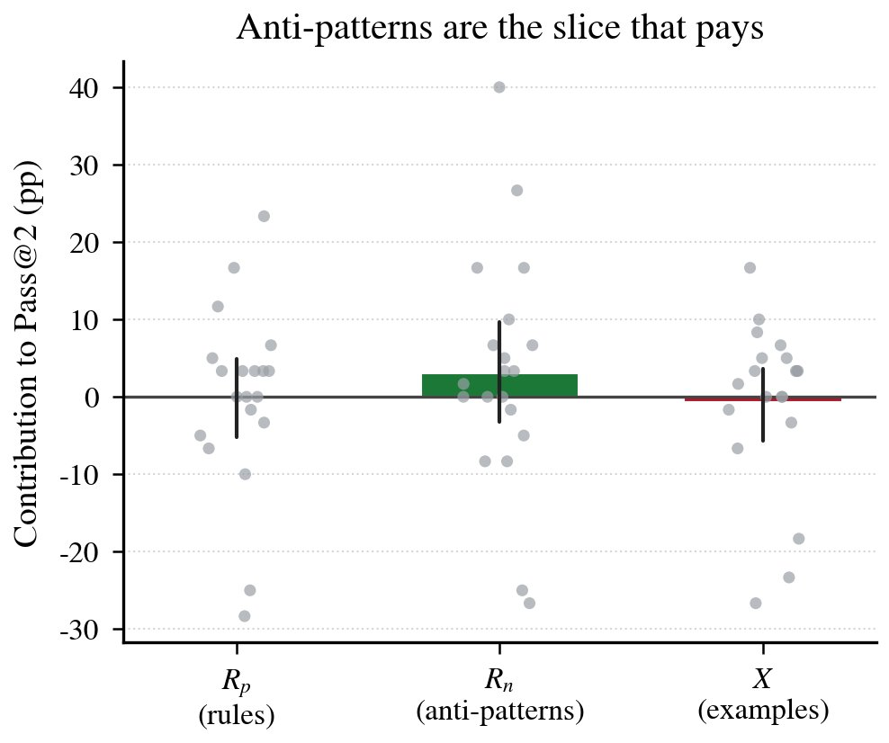
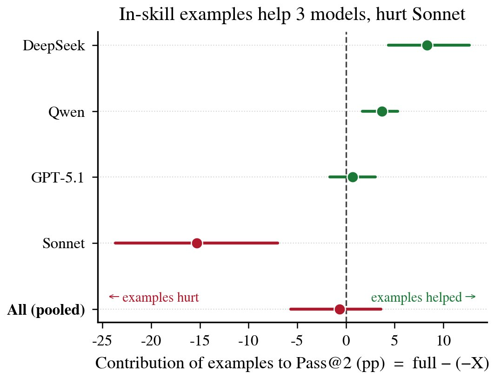

> [[../index|Wiki]] | [[../summary|Summary]] | [[../digest|Digest]]

# Results and Mechanisms

**In one sentence:** Average Skill injection is a net negative that pays for itself in tokens (+394% to +91% overhead), the harm concentrates on easy tasks the model already solves, the same aggregate loss splits into two distinct mechanisms (length distraction vs content misalignment) across models, per-pair effects decorrelate across models so no static Skill ranking transfers, and within genuinely helpful Skills, anti-pattern rules are the only directionally reliable and most cost-effective slice.

## Key points

- Mean C1−C0 ∆Pass@2 is negative for all four models on the 117 core pairs: Sonnet 4 −4.2 pp, Qwen −2.3, DeepSeek −2.0, GPT-5.1 −1.3; Task Completion Depth falls in parallel (−0.85/−0.47/−0.40/−0.26), while token overhead ρ rises +72–+91% (three models) and +394% for DeepSeek.
- Despite negative means, every model has a positive-gain tail: GPT-5.1 wins on 35% of pairs, DeepSeek 36%, Sonnet 30%, Qwen only 17%.
- Easy-task degradation is large and significant on every model (CI excludes zero), from −4.0 pp (GPT-5.1) to −10.7 pp (Qwen); moderate/challenging buckets are noisy and show no consistent loss (DeepSeek even improves on moderate tasks).
- The length/content decomposition splits the panel: length distraction for Sonnet 4 (∆Length = −3.3 pp, ∆Content = −0.9) and Qwen (∆Length = −3.5, ∆Content = +1.2), content misalignment for GPT-5.1 (∆Length = −0.2, ∆Content = −1.1) and DeepSeek (∆Length = −0.6, ∆Content = −1.4).
- Survival of C1 wins after the length control: Sonnet 4 60%, Qwen 95%, GPT-5.1 71%, DeepSeek 64% — most individual wins stay content-positive even where the mean is length-driven.
- Cross-model Pearson correlations of per-pair ∆Pass@2 are all near zero (−0.08 to +0.12, mean ≈ 0.00; Spearman ≤ 0.16); 74% of pairs have at least one positive and one negative model sign, only 1% gain on all four models.
- Starkest counterexample: lowdb × database-optimizer (S14) — Sonnet 4 +33 pp, DeepSeek −22 pp, Qwen −22 pp, GPT-5.1 unchanged: a 55 pp swing on one core-tier pair.
- C3 slice ablation on five robustly positive (Skill, project) pairs (each +3.3 to +6.7 pp; complete Skill +5.1 pp): anti-patterns Rn are the only directionally reliable slice (p = 0.008, +3.1 pp pooled), rules Rp neutral (+0.0), examples X null (−0.7) yet costliest — removing X saves 34,482 input tokens per run (~22.7% of the SKILL.md budget); dropping Sonnet, examples flip to the strongest effect (+4.2 pp; DeepSeek +8.3, Qwen +3.7, GPT-5.1 +0.7, Sonnet −15.3).

---

## Average Skill injection does not justify its token cost

Table 1 reports model-wise C1−C0 effects on the 117 core pairs (N = 3). All four models show a negative mean ∆Pass@2, three with 95% CIs excluding zero (GPT-5.1's marginally includes zero, but its ∆Pass@1 of −1.6 pp [−3.3, −0.1] does not). Task Completion Depth falls in parallel for every model, so the negative average is not a pass-rate artifact. Token cost rises in parallel: ρ = +72 to +91% for three models and +394% for DeepSeek — the latter amplified by early C0 failures that shrink its denominator. So Skill injection (C1) is both net-harmful and cost-increasing at the margin.

The negative mean coexists with a positive-gain tail on every model: even Sonnet 4, whose mean effect is most negative, wins on 30% of pairs; GPT-5.1 wins on 35%, DeepSeek on 36%, and Qwen on 17%. This is what motivates the per-pair rather than only project-level views in the rest of Section 4.

## The negative effect concentrates on easy tasks

Web-Bench labels each of the 20 tasks per project as easy, moderate, or challenging. A natural hypothesis — that Skills help most where they are most needed, i.e. on challenging late-chain tasks — is refuted. Table 2 shows mean ∆Pass@2 within each difficulty bucket with per-pair-bucket 95% CIs:

| Model | Easy ∆Pass@2 (pp) | Moderate | Challenging |
|---|---|---|---|
| GPT-5.1 | −4.0 (CI excludes zero) | no consistent loss | no consistent loss |
| DeepSeek | CI excludes zero | improves | no consistent loss |
| Qwen | −10.7 (CI excludes zero) | no consistent loss | no consistent loss |

(Only the extreme values are stated in the chunk: easy-bucket degradation ranges from −4.0 pp for GPT-5.1 to −10.7 pp for Qwen, significant on every model; moderate and challenging buckets have fewer pair-cells, ceiling/floor effects, and show no consistent loss, with DeepSeek even improving on its moderate tasks.)

Injection thus incurs its largest and most reliable losses on the tasks the model already handles correctly, which is why Skill utility should be reported by chain position rather than only as a project-level average.

**Mechanism — retry lock-in.** On early (easy) tasks, single-attempt mistakes are common but inexpensive: Web-Bench's two-attempt budget recovers most of them when the model can vary simple structural choices (button text, class names, element nesting) between attempts. An injected Skill that fixes those choices in place — even when not technically wrong — converts recoverable first-attempt mistakes into chain-terminating failures and removes self-repair flexibility on retry. Appendix A gives a concrete Sonnet × zustand × react-expert trace.

## Length distraction vs content misalignment

The length-matched C2 control decomposes gross utility into a length artifact ∆Length = C2 − C0 and a content effect ∆Content = C1 − C2 (Table 3, N = 3):

| Model | ∆Total (pp) | ∆Length (pp) | ∆Content (pp) | Survival |
|---|---|---|---|---|
| Sonnet 4 | −4.2 | −3.3 (CI excludes zero) | −0.9 (CI includes zero) | 60% |
| Qwen | −2.3 | −3.5 (CI excludes zero) | +1.2 | 95% |
| GPT-5.1 | −1.3 | −0.2 | −1.1 | 71% |
| DeepSeek | −2.0 | −0.6 | −1.4 | 64% |

**Length distraction (Sonnet 4, Qwen).** Sonnet's total loss (−4.2 pp) is largely accounted for by the length control alone (−3.3 pp, CI excludes zero); its content term is small and not significant (−0.9 pp). Qwen follows the same shape (∆Length = −3.5, CI excludes zero; ∆Content = +1.2). For these models the data fit attention dilution: a Skill-sized prompt block degrades performance, while the target content itself is not reliably worse than an equally long irrelevant block.

**Content misalignment (GPT-5.1, DeepSeek).** The opposite shape: length terms are near zero with CIs including zero (−0.2 and −0.6 pp), while content terms are negative (−1.1 and −1.4 pp). Prompt-length increase alone is essentially harmless for these models, but injecting the specific content of the target Skill degrades performance. This is mechanism-level evidence that the same aggregate effect arises from different causes across models — and the mitigation therefore differs: prompt shortening versus content review.

**Pair-level view (Survival column).** A majority of each model's C1 wins remain positive after the length control — Sonnet 4 60%, GPT-5.1 71%, DeepSeek 64%, Qwen 95%. So even where the average effect is length-driven, most individual wins are content-positive rather than length artifacts. The decomposition describes model-level tendencies, not a certification of any individual pair; the per-pair content effect is what a benchmark should expose before routing.

## Cross-model contradictions caution against static Skill rankings

Table 4 reports cross-model Pearson correlations of per-pair ∆Pass@2 (C1−C0) over the 117 core pairs (N = 3). All six coefficients are near zero (Pearson −0.08 to +0.12, mean ≈ 0.00; Spearman similar, |ρs| ≤ 0.16):

| | GPT-5.1 | Qwen | Sonnet 4 |
|---|---|---|---|
| **DeepSeek** | −0.00 | +0.09 | −0.07 |
| **Qwen** | +0.12 | — | −0.08 |
| **Sonnet 4** | −0.06 | — | — |

A Skill's measured utility on one model barely predicts its utility on another, and the disagreement is pervasive rather than confined to outliers: 74% of pairs carry at least one positive and one negative model sign; only 1% gain on all four models and 4% lose on all four.

The decorrelation is starkest in individual pairs: on lowdb × database-optimizer (S14), Sonnet 4 gains +33 pp while DeepSeek and Qwen each lose 22 pp and GPT-5.1 is unchanged — a 55 pp swing on one core-tier pair that baseline difficulty does not explain (Appendix C).

This cautions against two deployment shortcuts: (1) ranking Skills by marketplace stars implicitly assumes one ranking transfers across backends, when the same content is a strong gainer for Sonnet and a clear liability for DeepSeek; (2) validating a Skill on a frontier model and deploying on a cheaper one is unsafe, since the Sonnet signal (+33 pp on S14) gives no hint the Skill should be withheld from DeepSeek. A practical router needs per-(Skill, project, model) traces, re-collected whenever any of the three vertices is upgraded.

## Slice ablation: anti-patterns are the most cost-effective component

Conditions C0–C2 ask whether a Skill helps; C3, a leave-one-out slice ablation, asks which part of it does. Each SKILL.md is partitioned into three removable slices — positive rules Rp, anti-patterns Rn, and example code X — removed one at a time; a slice's contribution is C1 − (variant) on Pass@2. C3 is run on the positive tail — five (Skill, project) pairs with a robustly positive cross-model C1−C0 signal (+3.3 to +6.7 pp each) — so the complete Skill here raises Pass@2 by +5.1 pp, opposite in sign to the panel average of §4.1. The C3 numbers describe how a helpful Skill is built, not how often Skills help (pair selection, run protocol, statistical tests in Appendix D).

**Table 5. C3 slice contributions to Pass@2 (pp), C1 − (variant).** Cell-level means with paired-bootstrap 95% CIs. "All" pools 20 model×project cells; "−Sonnet" the 15 non-Sonnet cells. Positive = slice helps.

| Slice | All (N = 20) | −Sonnet (N = 15) |
|---|---|---|
| Whole Skill (C1−C0) | +5.1 [1.0, 9.3] | +6.1 [1.6, 10.9] |
| Rp (positive rules) | +0.0 [−5.1, 4.9] | +4.6 [1.1, 8.4] |
| Rn (anti-patterns) | +3.1 [−3.3, 9.8] | +6.1 [0.3, 12.9] |
| X (examples) | −0.7 [−5.6, 3.6] | +4.2 [2.0, 6.8] |

Pooled over the 20 cells, anti-patterns (Rn) are the only slice with a directionally reliable task-level effect (Wilcoxon signed-rank p = 0.008; McNemar in Appendix D), positive rules Rp are neutral, and example code X is null on average (−0.7 pp). Yet X is by far the costliest slice: removing it saves 34,482 input tokens per run on average — about 22.7% of the full SKILL.md budget — so cheap proscriptive content is the most cost-effective signal.

The pooled example null is an artifact of cancellation. Dropping Sonnet, every slice (including examples) turns positive, and the example effect becomes the strongest and most significant of all (+4.2 pp, [2.0, 6.8]). Figure 4 shows the split: examples help DeepSeek (+8.3 pp) and Qwen (+3.7 pp), are neutral for GPT-5.1 (+0.7 pp), and clearly hurt Sonnet (−15.3 pp). For the strongest model, in-skill examples act as a constraint that suppresses its own better priors — the retry-lock-in mechanism of §4.2. Example-heavy Skills should not be a default: they are expensive and model-dependent, whereas concise anti-pattern rules are most worth retaining.

## Figures

Per-slice decomposition of Pass@2 gain (R_p rules, R_n anti-patterns, X examples) as point estimates with per-instance scatter for the C3 leave-one-out cells. Under "Anti-patterns are the slice that pays," the R_n aggregate bar is the clearly positive one while rules are small and examples sit at roughly zero — a visual restatement of the Table 5 finding that concise proscriptive content carries the reliable signal.

Effect of the example-code slice X on Pass@2 by model (full − (−X)). Examples help DeepSeek (+8.3 pp) and Qwen (+3.7 pp), are neutral for GPT-5.1, and strongly hurt Sonnet (−15.3 pp), whose outlier penalty pulls the pooled estimate back to ≈ −1 pp — the visual evidence behind the "pooled example null is an artifact of cancellation" reading.

**Covers:** Section 4 (Results), subsections 4.1–4.5, Tables 1–5, Figures 3–4
