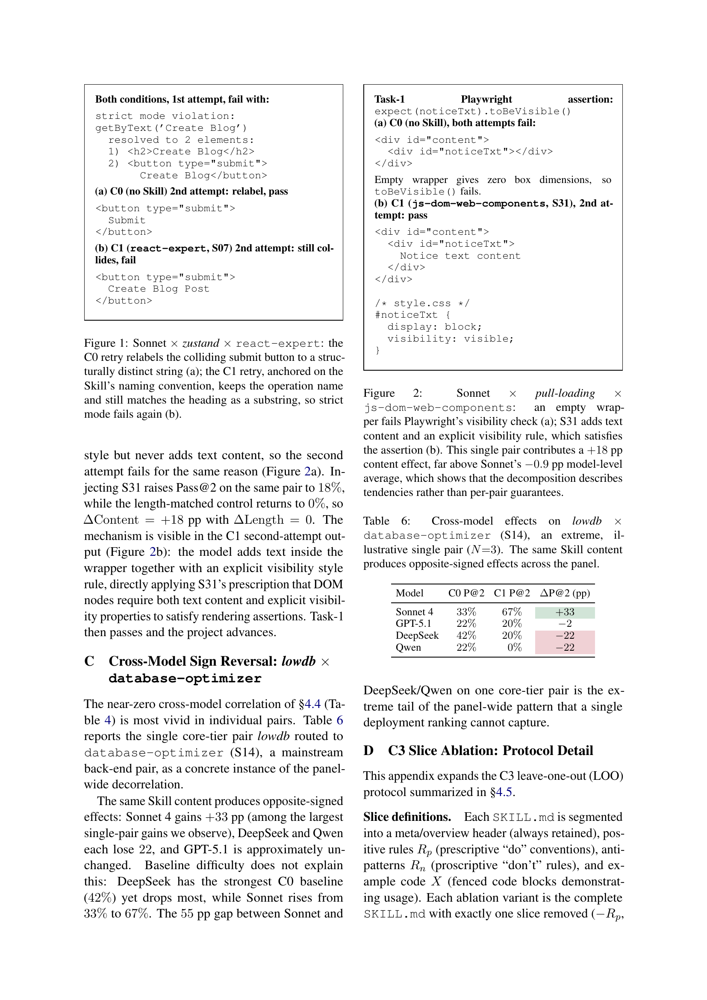

> [[../index|Wiki]] | [[../summary|Summary]] | [[../digest|Digest]]

# Appendices: Worked Examples and Protocol Detail

**In one sentence:** Concrete traces show that a single injected Skill can produce opposite per-pair outcomes — a retry lock-in loss (−15 pp), a content-driven win (+18 pp), and cross-model sign reversal — while the C3 slice-ablation protocol isolates anti-patterns (Rn) as the only reliably positive slice.

## Key points

- **Retry lock-in (Appendix A):** On zustand × react-expert (S07), injecting the most stack-aligned Skill lowers Sonnet C0 Pass@2 from 55% to 40% (Δ = −15 pp), with the entire loss coming from a single seed: both conditions fail identically on task-4, but on the C1 retry the model renames the submit button to "Create Blog Post" (following the Skill's operation-restating naming rule), which still substring-collides with the `<h2>Create Blog</h2>` heading, so strict mode fails again and the chain terminates at task-4.
- **Content-driven win (Appendix B):** On pull-loading × js-dom-web-components (S31), the C0 baseline is 0% Pass@2 on all three seeds because an empty `
` has zero box dimensions and `toBeVisible()` fails; S31 raises it to 18% while the length-matched control returns to 0%, giving ΔContent = +18 pp — an order of magnitude above Sonnet's −0.9 pp model-level average, per-pair effects can far exceed the panel mean.
- **Cross-model sign reversal (Appendix C):** On lowdb × database-optimizer (S14) the same Skill content yields opposite-signed effects: Sonnet 4 +33 pp (33%→67%), GPT-5.1 −2 pp (22%→20%), DeepSeek −22 pp (42%→20%), Qwen −22 pp (22%→0%) — a 55 pp gap on one core-tier pair, and baseline difficulty does not explain it (DeepSeek has the strongest C0 baseline yet drops most).
- **C3 slice definitions (Appendix D):** Each SKILL.md is segmented into a meta/overview header (always retained so the prompt stays well-formed), positive rules Rp ("do" conventions), anti-patterns Rn ("don't" rules), and example code X (fenced code blocks); each ablation removes exactly one slice (−Rp, −Rn, −X), and only Skills with at least two removable slices are eligible.
- **Pair selection for C3:** Pairs were screened by two rules — the Skill must contain ≥2 cleanly removable slices (excluding svelte/S22 rules-only and backend-patterns/S15 examples-only) and the pair must gain (C1>C0) on at least two of four models; the five selected pairs (S13 on vite/svg-chart, S29 on webpack, S07 on fastify-react, S14 on sequelize) retain positive cross-model mean gains of +3.3 to +6.7 pp.
- **C3 statistics:** 5×3×3×4 = 180 ablation runs at N=3 seeds across all four models; the inference unit is the cell (model × project, N=20); per-slice contributions are tested with a Wilcoxon signed-rank test over cells with a 10,000-resample paired-bootstrap CI, corroborated by task-level McNemar tests on discordant counts.
- **Reported C3 p-values:** The pooled anti-pattern (Rn) contribution has McNemar discordants b=111, c=74 (p=0.008); excluding Sonnet, the example-code (X) contribution of +4.2 pp has Wilcoxon p=0.005 — the most significant slice effect in the panel.
- **Released artifacts (Appendix E):** Analysis code, routing for all conditions (C1 core, C2 length-matched, C3 candidate pairs), the 31 Skills with provenance, C3 slice definitions, and derived per-pair/per-task CSVs (C0–C3 values, pairwise Δs, per-slice C3 contributions, chain-position data, per-model rankings, seed-variance tables) are at https://anonymous.4open.science/r/webdev-skills-bench-1C32/; the raw evaluation reports and Web-Bench harness are omitted, so the release reproduces the analyses but not byte-for-byte trajectories.

---

## Appendix A: Retry lock-in (zustand × react-expert)

Zustand is a React state-management project, so react-expert (S07) is the most stack-aligned Skill routed to it. On Sonnet, the C0 baseline reaches 55% Pass@2 (mean over three seeds); injecting S07 lowers it to 40% (Δ = −15 pp), and the whole loss comes from one seed whose chain terminates at task-4. Task-4 asks for a BlogForm modal titled "Create Blog" with an "Add Blog" button in the header. On both conditions the first attempt emits a modal whose `<h2>Create Blog</h2>` heading and submit `<button>Create Blog</button>` collide under the same Playwright `getByText('Create Blog')` locator, and both fail with the identical strict-mode violation (Figure 1). The conditions diverge only on the retry: the C0 model relabels the submit button to "Submit", a structurally distinct string, so the locator resolves to a single element and the project continues to task-11. The C1 model, anchored on the Skill's prescription that button labels restate the operation, relabels it to "Create Blog Post" — but Playwright matches text as a substring, so `Create Blog Post` still contains `Create Blog`, the heading collision persists, strict mode fails again, and the chain dies at task-4. The Skill's naming convention thus converts a fixable collision into a locked-in failure.

## Appendix B: Content-driven win (pull-loading × js-dom-web-components)

Pull-loading is a vanilla-JS pull-to-refresh widget routed to js-dom-web-components (S31), a Skill on DOM lifecycle and Web Component visibility patterns. On Sonnet's C0 baseline the project sits at 0% Pass@2 across all three seeds, with the failure cascading from task-1: the model emits the requested DOM — `

` — but Playwright's `toBeVisible()` assertion fails because the empty wrapper has zero box dimensions. The C0 retry adds a defensive `display: block` style but never adds text content, so the second attempt fails for the same reason (Figure 2a). Injecting S31 raises Pass@2 on the same pair to 18% while the length-matched control returns to 0%, so ΔContent = +18 pp with ΔLength = 0. The mechanism is visible in the C1 second-attempt output (Figure 2b): the model adds text inside the wrapper together with an explicit visibility style rule (`display: block; visibility: visible;`), directly applying S31's prescription that DOM nodes require both text content and explicit visibility properties to satisfy rendering assertions. Task-1 then passes and the project advances — a per-pair effect an order of magnitude above Sonnet's −0.9 pp model-level average.

## Appendix C: Cross-model sign reversal (lowdb × database-optimizer)

The near-zero cross-model correlation of §4.4 (Table 4) is most vivid in individual pairs. Table 6 reports the single core-tier pair lowdb routed to database-optimizer (S14), a mainstream back-end pair, as a concrete instance of the panel-wide decorrelation.

**Table 6: Cross-model effects on lowdb × database-optimizer (S14**, N = 3). The same Skill content produces opposite-signed effects across the panel.

| Model | C0 P@2 | C1 P@2 | ΔP@2 (pp) |
|---|---|---|---|
| Sonnet 4 | 33% | 67% | +33 |
| GPT-5.1 | 22% | 20% | −2 |
| DeepSeek | 42% | 20% | −22 |
| Qwen | 22% | 0% | −22 |

The same Skill content produces opposite-signed effects: Sonnet 4 gains +33 pp (among the largest single-pair gains observed), DeepSeek and Qwen each lose 22 pp, and GPT-5.1 is approximately unchanged. Baseline difficulty does not explain this: DeepSeek has the strongest C0 baseline (42%) yet drops most, while Sonnet rises from 33% to 67%. The 55 pp gap between Sonnet and DeepSeek/Qwen on one core-tier pair is the extreme tail of the panel-wide pattern that a single deployment ranking cannot capture.

## Appendix D: C3 slice-ablation protocol

This appendix expands the C3 leave-one-out (LOO) protocol summarized in §4.5.

**Slice definitions.** Each SKILL.md is segmented into a meta/overview header (always retained so the prompt remains well-formed), positive rules Rp (prescriptive "do" conventions), anti-patterns Rn (proscriptive "don't" rules), and example code X (fenced code blocks demonstrating usage). Each ablation variant is the complete SKILL.md with exactly one slice removed (−Rp, −Rn, −X); the header is never removed. A variant is marked N/A for any Skill that lacks the relevant slice, and only Skills with at least two removable slices are eligible.

**Pair selection.** Decomposition requires a gross effect to attribute. Pairs were screened by two rules on the cross-model main-experiment aggregates: (1) the Skill must contain at least two cleanly removable slices (this excludes svelte/S22 (rules only) and backend-patterns/S15 (examples only), whose SKILL.md reduces to a single removable slice after segmentation), and (2) the pair must gain (C1>C0) on at least two of the four models (cross-model consistency rejects single-model noise). The five selected pairs are javascript-pro (S13) on vite and svg-chart, bundler-config (S29) on webpack, react-expert (S07) on fastify-react, and database-optimizer (S14) on sequelize. On the final N=3 aggregates, vite/S13, svg-chart/S13, and webpack/S29 gain on three of four models and fastify-react/S07 and sequelize/S14 gain on two; all five retain a positive cross-model mean gain (+3.3 to +6.7 pp). With only five pairs no per-domain claims are made and contributions are reported pooled and per model; this positive-tail selection is why the gross effect here (+5.1 pp) is opposite in sign to the panel average of §4.1 and must not be read as evidence that Skills help on average.

**Runs and statistics.** Every variant is evaluated for all four models at N=3 seeds, anchored on the existing C0 and C1 runs, giving 5×3×3×4 = 180 ablation runs. The unit of inference is the cell (model × project, N=20, seeds averaged). Per-slice contributions are tested with a Wilcoxon signed-rank test over cells with a 10,000-resample paired-bootstrap CI; the task-level McNemar test (discordant counts b, c over matched task attempts, missing tasks scored as failures) corroborates direction. For the pooled anti-pattern (Rn) contribution the McNemar discordants are b=111, c=74 (p=0.008); excluding Sonnet, the example-code (X) contribution of +4.2 pp has Wilcoxon p=0.005, the most significant slice effect in the panel. Only anti-patterns (Rn) sit reliably above zero; positive rules and examples are null on average with wide per-cell spread, and the X effect helps DeepSeek, Qwen, and weakly GPT-5.1 but hurts Sonnet, so its pooled effect is near zero.

## Appendix E: Released artifacts

The analysis code, the routing for all conditions (C1 core pairs, C2 length-matched pairs, C3 candidate pairs), the 31 Skills with provenance, the C3 slice definitions, and the derived per-pair and per-task CSVs (C0–C3 values, pairwise Δs, per-slice C3 contributions, chain-position data, per-model rankings, and seed-variance tables) are released at `https://anonymous.4open.science/r/webdev-skills-bench-1C32/`. The repository includes the pipeline that reproduces the paper's tables and figures from these derived CSVs. The raw per-task evaluation reports and the base Web-Bench task harness are omitted for size and obtained from the upstream Web-Bench project, so the release fully reproduces the reported analyses but not a byte-for-byte rerun of every agent trajectory.

## Figure

*Figure 1 shows the strict-mode locator collision on Sonnet × zustand × react-expert: both conditions fail identically on attempt 1, then the C0 retry relabels the submit button to a structurally distinct string and passes while the C1 retry, anchored on the Skill's naming convention, keeps "Create Blog Post" and still collides with the heading as a substring. Figure 2 shows the content-driven fix on Sonnet × pull-loading × js-dom-web-components: an empty wrapper fails `toBeVisible()`, while S31's second attempt adds text content plus an explicit `display:block; visibility:visible;` rule that satisfies the assertion.*

**Covers:** Appendix A, B, C, D, E
